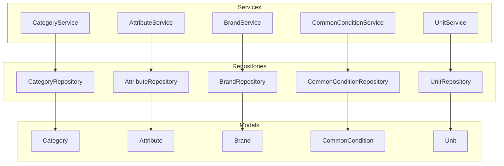
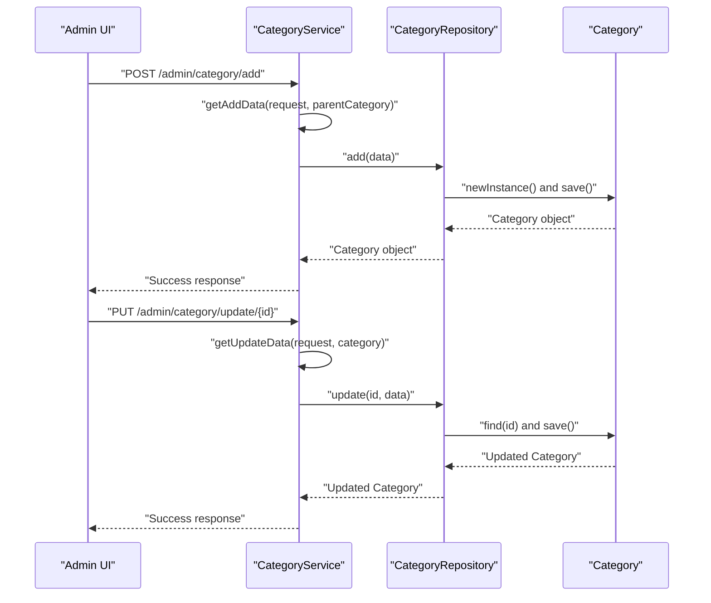
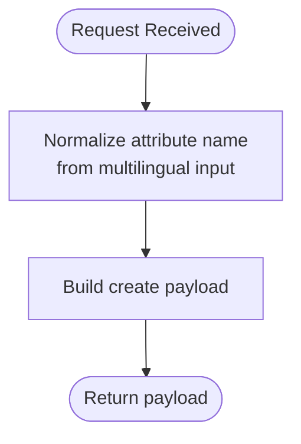
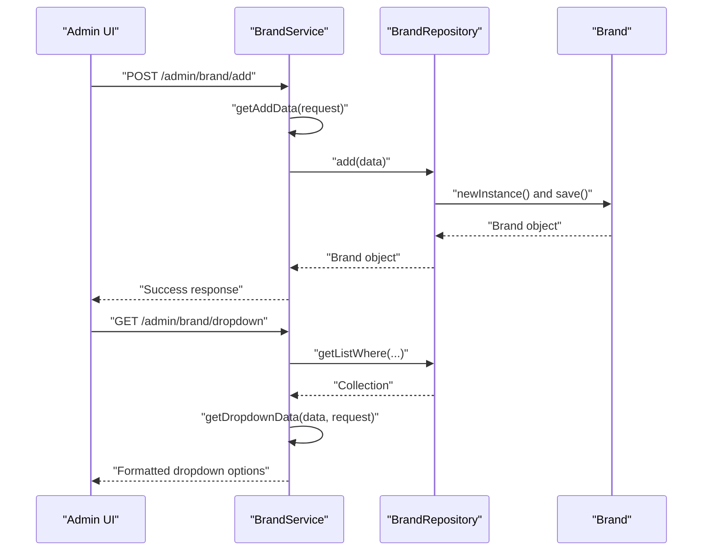
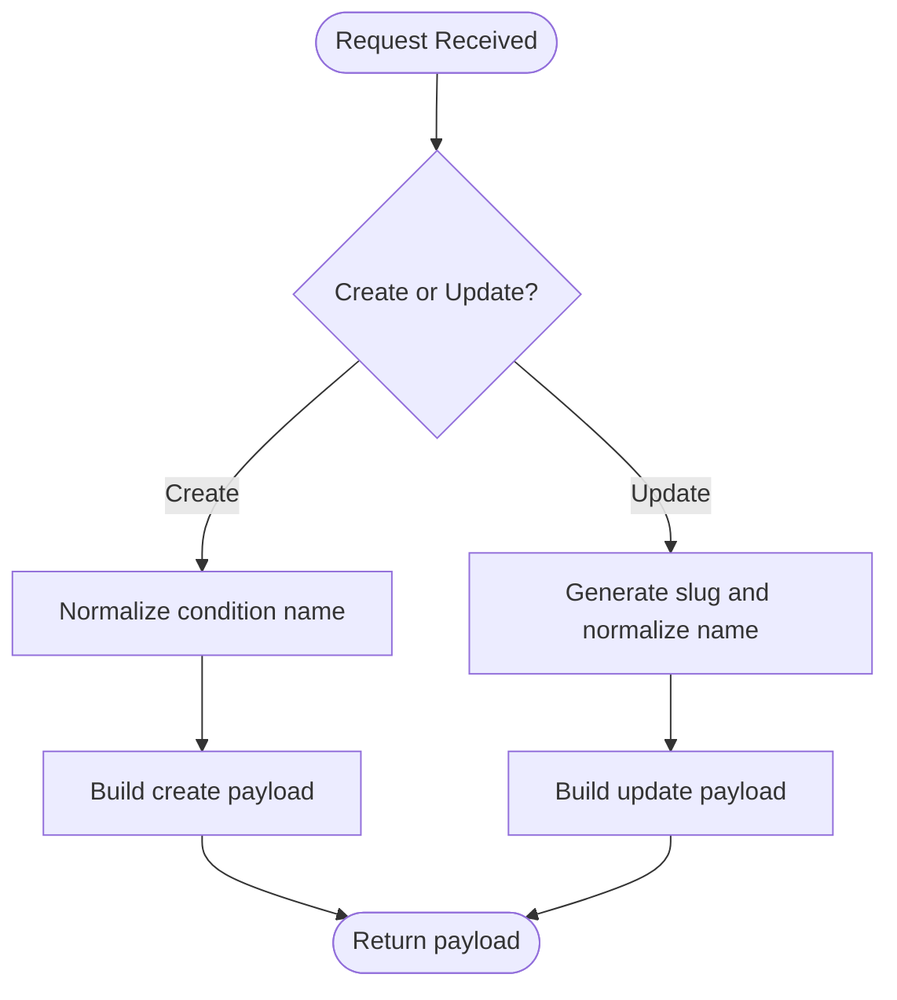
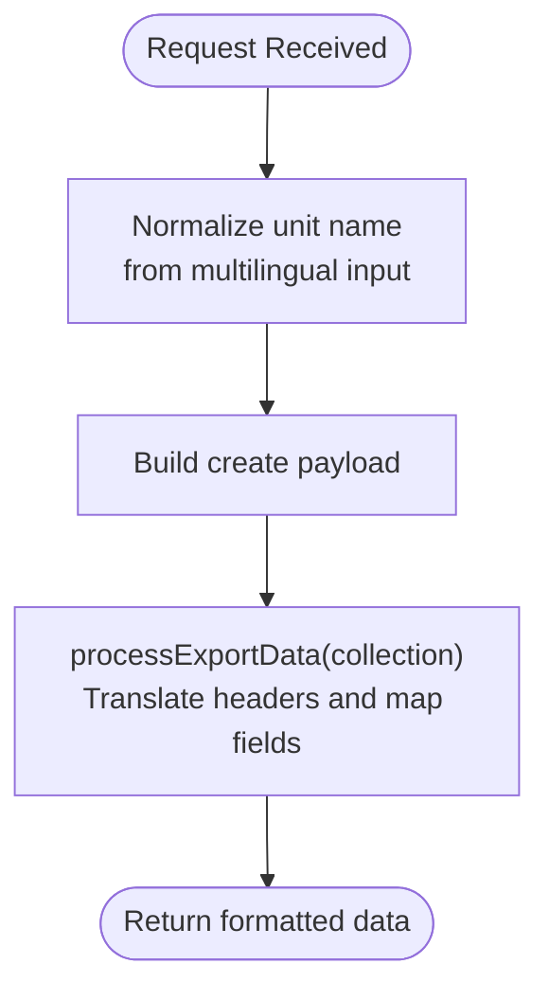
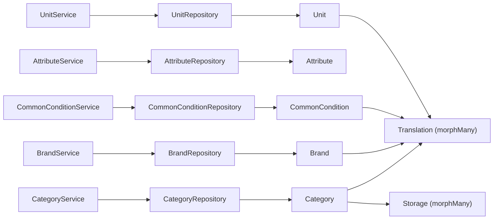

# Product Catalog Services

<cite>
**Referenced Files in This Document**
- [CategoryService.php](file://app/Services/CategoryService.php)
- [AttributeService.php](file://app/Services/AttributeService.php)
- [BrandService.php](file://app/Services/BrandService.php)
- [CommonConditionService.php](file://app/Services/CommonConditionService.php)
- [UnitService.php](file://app/Services/UnitService.php)
- [CategoryRepository.php](file://app/Repositories/CategoryRepository.php)
- [AttributeRepository.php](file://app/Repositories/AttributeRepository.php)
- [BrandRepository.php](file://app/Repositories/BrandRepository.php)
- [CommonConditionRepository.php](file://app/Repositories/CommonConditionRepository.php)
- [UnitRepository.php](file://app/Repositories/UnitRepository.php)
- [Category.php](file://app/Models/Category.php)
- [Attribute.php](file://app/Models/Attribute.php)
- [Brand.php](file://app/Models/Brand.php)
- [CommonCondition.php](file://app/Models/CommonCondition.php)
- [Unit.php](file://app/Models/Unit.php)
</cite>

## Table of Contents
1. [Introduction](#introduction)
2. [Project Structure](#project-structure)
3. [Core Components](#core-components)
4. [Architecture Overview](#architecture-overview)
5. [Detailed Component Analysis](#detailed-component-analysis)
6. [Dependency Analysis](#dependency-analysis)
7. [Performance Considerations](#performance-considerations)
8. [Troubleshooting Guide](#troubleshooting-guide)
9. [Conclusion](#conclusion)

## Introduction
This document explains the product catalog services that power category management, attribute handling, brand administration, product condition management, and unit-of-measurement support. It covers service methods for CRUD operations, bulk import/export, and integration with product listing and search. It also provides practical guidance on product data validation, category relationships, and how these services connect to product data flows.

## Project Structure
The catalog services follow a layered architecture:
- Services: Orchestrate requests, transform data, and coordinate uploads.
- Repositories: Encapsulate persistence logic and query building.
- Models: Define domain entities, relationships, scopes, and global scopes for localization.

**Diagram sources**
- [CategoryService.php:14-101](file://app/Services/CategoryService.php#L14-L101)
- [AttributeService.php:10-21](file://app/Services/AttributeService.php#L10-L21)
- [BrandService.php:8-51](file://app/Services/BrandService.php#L8-L51)
- [CommonConditionService.php:8-46](file://app/Services/CommonConditionService.php#L8-L46)
- [UnitService.php:5-29](file://app/Services/UnitService.php#L5-L29)
- [CategoryRepository.php:18-175](file://app/Repositories/CategoryRepository.php#L18-L175)
- [AttributeRepository.php:12-90](file://app/Repositories/AttributeRepository.php#L12-L90)
- [BrandRepository.php:13-105](file://app/Repositories/BrandRepository.php#L13-L105)
- [CommonConditionRepository.php:12-95](file://app/Repositories/CommonConditionRepository.php#L12-L95)
- [UnitRepository.php:11-72](file://app/Repositories/UnitRepository.php#L11-L72)
- [Category.php:32-192](file://app/Models/Category.php#L32-L192)
- [Attribute.php:19-68](file://app/Models/Attribute.php#L19-L68)
- [Brand.php:26-170](file://app/Models/Brand.php#L26-L170)
- [CommonCondition.php:26-136](file://app/Models/CommonCondition.php#L26-L136)
- [Unit.php:19-68](file://app/Models/Unit.php#L19-L68)

**Section sources**
- [CategoryService.php:14-101](file://app/Services/CategoryService.php#L14-L101)
- [CategoryRepository.php:18-175](file://app/Repositories/CategoryRepository.php#L18-L175)
- [Category.php:32-192](file://app/Models/Category.php#L32-L192)

## Core Components
This section outlines the responsibilities and key methods of each catalog service.

- CategoryService
  - Purpose: Manage categories, including creation, updates, image handling, import/export, and view selection.
  - Key methods:
    - getViewByPosition(position): Selects admin view based on position.
    - getAddData(request, parentCategory): Builds normalized create payload including slug, image, parent_id, position, and module_id.
    - getUpdateData(request, category): Builds normalized update payload with slug generation and optional image replacement.
    - getImportData(request, toAdd): Parses CSV upload into structured rows with validation and defaults.
    - getExportData(collection): Formats categories for export.

- AttributeService
  - Purpose: Manage product attributes (names).
  - Key methods:
    - getAddData(request): Normalizes attribute name from multilingual input.

- BrandService
  - Purpose: Manage brands, including status, slug generation, image handling, and dropdown formatting.
  - Key methods:
    - getAddData(request): Builds create payload with status, name, and uploaded image.
    - getUpdateData(request, brand): Builds update payload with status, slug, and optional image replacement.
    - getDropdownData(data, request): Transforms brand records into select-friendly format with optional "all" option.

- CommonConditionService
  - Purpose: Manage product condition entities (names).
  - Key methods:
    - getAddData(request): Normalizes condition name from multilingual input.
    - getUpdateData(request, condition): Builds update payload with slug and name.
    - getDropdownData(data, request): Transforms conditions into select-friendly format with optional "all" option.

- UnitService
  - Purpose: Manage measurement units.
  - Key methods:
    - getAddData(request): Normalizes unit name from multilingual input.
    - processExportData(collection): Prepares unit records for export with translated headers.

**Section sources**
- [CategoryService.php:18-101](file://app/Services/CategoryService.php#L18-L101)
- [AttributeService.php:13-21](file://app/Services/AttributeService.php#L13-L21)
- [BrandService.php:12-51](file://app/Services/BrandService.php#L12-L51)
- [CommonConditionService.php:11-46](file://app/Services/CommonConditionService.php#L11-L46)
- [UnitService.php:8-29](file://app/Services/UnitService.php#L8-L29)

## Architecture Overview
The services delegate persistence to repositories, which operate on models. Global scopes handle localization, and morph relations manage translations and storage metadata.

```mermaid
classDiagram
class CategoryService {
+getViewByPosition(position) string
+getAddData(request, parentCategory) array
+getUpdateData(request, category) array
+getImportData(request, toAdd) array
+getExportData(collection) array
}
class AttributeService {
+getAddData(request) array
}
class BrandService {
+getAddData(request) array
+getUpdateData(request, brand) array
+getDropdownData(data, request) array|object
}
class CommonConditionService {
+getAddData(request) array
+getUpdateData(request, condition) array
+getDropdownData(data, request) array|object
}
class UnitService {
+getAddData(request) array
+processExportData(collection) array
}
class CategoryRepository {
+add(data) string|object
+addByChunk(data) void
+updateByChunk(data) void
+getFirstWhere(params, relations) Model?
+getList(orderBy, relations, dataLimit, offset) Collection|LengthAwarePaginator
+getListWhere(searchValue, filters, relations, dataLimit, offset) Collection|LengthAwarePaginator
+getNameList(request, dataLimit) SupportCollection|LengthAwarePaginator
+getMainList(searchValue, filters, relations, dataLimit, offset) Collection|LengthAwarePaginator
+update(id, data) string|object
+delete(id) bool
}
class AttributeRepository {
+add(data) string|object
+getFirstWhere(params, relations) Model?
+getList(orderBy, relations, dataLimit, offset) Collection|LengthAwarePaginator
+getListWhere(searchValue, filters, relations, dataLimit, offset) Collection|LengthAwarePaginator
+update(id, data) string|object
+delete(id) bool
}
class BrandRepository {
+add(data) string|object
+getFirstWhere(params, relations) Model?
+getList(orderBy, relations, dataLimit, offset) Collection|LengthAwarePaginator
+getListWhere(searchValue, filters, relations, dataLimit, offset) Collection|LengthAwarePaginator
+update(id, data) string|object
+delete(id) bool
}
class CommonConditionRepository {
+add(data) string|object
+getFirstWhere(params, relations) Model?
+getList(orderBy, relations, dataLimit, offset) Collection|LengthAwarePaginator
+getListWhere(searchValue, filters, relations, dataLimit, offset) Collection|LengthAwarePaginator
+update(id, data) string|object
+delete(id) bool
}
class UnitRepository {
+add(data) string|object
+getFirstWhere(params, relations) Model?
+getList(orderBy, relations, dataLimit, offset) Collection|LengthAwarePaginator
+getListWhere(searchValue, filters, relations, dataLimit, offset) Collection|LengthAwarePaginator
+update(id, data) string|object
+delete(id) bool
}
class Category {
+translations() MorphMany
+module() BelongsTo
+products() HasMany
+childes() HasMany
+parent() BelongsTo
+storage() MorphMany
+scopeModule(query, module_id)
+scopeActive(query)
+scopeFeatured(query)
}
class Attribute {
+translations() MorphMany
}
class Brand {
+translations() MorphMany
+items() HasMany
+scopeActive(query)
}
class CommonCondition {
+translations() MorphMany
+items() HasMany
+scopeActive(query)
}
class Unit {
+translations() MorphMany
}
CategoryService --> CategoryRepository
AttributeService --> AttributeRepository
BrandService --> BrandRepository
CommonConditionService --> CommonConditionRepository
UnitService --> UnitRepository
CategoryRepository --> Category
AttributeRepository --> Attribute
BrandRepository --> Brand
CommonConditionRepository --> CommonCondition
UnitRepository --> Unit
```

**Diagram sources**
- [CategoryService.php:14-101](file://app/Services/CategoryService.php#L14-L101)
- [AttributeService.php:10-21](file://app/Services/AttributeService.php#L10-L21)
- [BrandService.php:8-51](file://app/Services/BrandService.php#L8-L51)
- [CommonConditionService.php:8-46](file://app/Services/CommonConditionService.php#L8-L46)
- [UnitService.php:5-29](file://app/Services/UnitService.php#L5-L29)
- [CategoryRepository.php:18-175](file://app/Repositories/CategoryRepository.php#L18-L175)
- [AttributeRepository.php:12-90](file://app/Repositories/AttributeRepository.php#L12-L90)
- [BrandRepository.php:13-105](file://app/Repositories/BrandRepository.php#L13-L105)
- [CommonConditionRepository.php:12-95](file://app/Repositories/CommonConditionRepository.php#L12-L95)
- [UnitRepository.php:11-72](file://app/Repositories/UnitRepository.php#L11-L72)
- [Category.php:32-192](file://app/Models/Category.php#L32-L192)
- [Attribute.php:19-68](file://app/Models/Attribute.php#L19-L68)
- [Brand.php:26-170](file://app/Models/Brand.php#L26-L170)
- [CommonCondition.php:26-136](file://app/Models/CommonCondition.php#L26-L136)
- [Unit.php:19-68](file://app/Models/Unit.php#L19-L68)

## Detailed Component Analysis

### CategoryService Analysis
CategoryService handles category lifecycle operations and supports bulk import/export. It integrates with FileManagerTrait for image handling and uses module scoping via configuration.

Key responsibilities:
- View selection based on position.
- Normalized create/update payloads with slug generation and image handling.
- CSV import validation and mapping to category fields.
- Export formatting aligned with admin expectations.

**Diagram sources**
- [CategoryService.php:26-45](file://app/Services/CategoryService.php#L26-L45)
- [CategoryRepository.php:26-34](file://app/Repositories/CategoryRepository.php#L26-L34)
- [CategoryRepository.php:152-160](file://app/Repositories/CategoryRepository.php#L152-L160)
- [Category.php:121-143](file://app/Models/Category.php#L121-L143)

**Section sources**
- [CategoryService.php:18-101](file://app/Services/CategoryService.php#L18-L101)
- [CategoryRepository.php:26-175](file://app/Repositories/CategoryRepository.php#L26-L175)
- [Category.php:32-192](file://app/Models/Category.php#L32-L192)

### AttributeService Analysis
AttributeService normalizes attribute names from multilingual requests for consistent storage.

Key responsibilities:
- Extract localized attribute name for create operations.

**Diagram sources**
- [AttributeService.php:13-18](file://app/Services/AttributeService.php#L13-L18)
- [AttributeRepository.php:18-26](file://app/Repositories/AttributeRepository.php#L18-L26)
- [Attribute.php:19-68](file://app/Models/Attribute.php#L19-L68)

**Section sources**
- [AttributeService.php:10-21](file://app/Services/AttributeService.php#L10-L21)
- [AttributeRepository.php:12-90](file://app/Repositories/AttributeRepository.php#L12-L90)
- [Attribute.php:19-68](file://app/Models/Attribute.php#L19-L68)

### BrandService Analysis
BrandService manages brand records, including status, slug generation, and image handling. It also formats data for dropdown selections.

Key responsibilities:
- Create/update payloads with status, slug, and image.
- Dropdown formatting with optional "all" selection.

**Diagram sources**
- [BrandService.php:12-29](file://app/Services/BrandService.php#L12-L29)
- [BrandRepository.php:19-28](file://app/Repositories/BrandRepository.php#L19-L28)
- [BrandRepository.php:43-56](file://app/Repositories/BrandRepository.php#L43-L56)
- [Brand.php:92-114](file://app/Models/Brand.php#L92-L114)

**Section sources**
- [BrandService.php:8-51](file://app/Services/BrandService.php#L8-L51)
- [BrandRepository.php:13-105](file://app/Repositories/BrandRepository.php#L13-L105)
- [Brand.php:26-170](file://app/Models/Brand.php#L26-L170)

### CommonConditionService Analysis
CommonConditionService manages product condition entities with localized names and slugs.

Key responsibilities:
- Create/update payloads with localized name and slug.
- Dropdown formatting with optional "all" selection.

**Diagram sources**
- [CommonConditionService.php:11-24](file://app/Services/CommonConditionService.php#L11-L24)
- [CommonConditionRepository.php:18-26](file://app/Repositories/CommonConditionRepository.php#L18-L26)
- [CommonConditionRepository.php:52-60](file://app/Repositories/CommonConditionRepository.php#L52-L60)
- [CommonCondition.php:76-83](file://app/Models/CommonCondition.php#L76-L83)

**Section sources**
- [CommonConditionService.php:8-46](file://app/Services/CommonConditionService.php#L8-L46)
- [CommonConditionRepository.php:12-95](file://app/Repositories/CommonConditionRepository.php#L12-L95)
- [CommonCondition.php:26-136](file://app/Models/CommonCondition.php#L26-L136)

### UnitService Analysis
UnitService manages measurement units with localization support and export formatting.

Key responsibilities:
- Create payload normalization for unit names.
- Export formatting with translated headers.

**Diagram sources**
- [UnitService.php:8-26](file://app/Services/UnitService.php#L8-L26)
- [UnitRepository.php:17-25](file://app/Repositories/UnitRepository.php#L17-L25)
- [UnitRepository.php:38-46](file://app/Repositories/UnitRepository.php#L38-L46)
- [Unit.php:19-68](file://app/Models/Unit.php#L19-L68)

**Section sources**
- [UnitService.php:5-29](file://app/Services/UnitService.php#L5-L29)
- [UnitRepository.php:11-72](file://app/Repositories/UnitRepository.php#L11-L72)
- [Unit.php:19-68](file://app/Models/Unit.php#L19-L68)

## Dependency Analysis
The services depend on repositories, which encapsulate model interactions and query logic. Models define relationships, scopes, and localization behavior.

**Diagram sources**
- [CategoryService.php:14-101](file://app/Services/CategoryService.php#L14-L101)
- [AttributeService.php:10-21](file://app/Services/AttributeService.php#L10-L21)
- [BrandService.php:8-51](file://app/Services/BrandService.php#L8-L51)
- [CommonConditionService.php:8-46](file://app/Services/CommonConditionService.php#L8-L46)
- [UnitService.php:5-29](file://app/Services/UnitService.php#L5-L29)
- [CategoryRepository.php:18-175](file://app/Repositories/CategoryRepository.php#L18-L175)
- [AttributeRepository.php:12-90](file://app/Repositories/AttributeRepository.php#L12-L90)
- [BrandRepository.php:13-105](file://app/Repositories/BrandRepository.php#L13-L105)
- [CommonConditionRepository.php:12-95](file://app/Repositories/CommonConditionRepository.php#L12-L95)
- [UnitRepository.php:11-72](file://app/Repositories/UnitRepository.php#L11-L72)
- [Category.php:65-107](file://app/Models/Category.php#L65-L107)
- [Brand.php:54-57](file://app/Models/Brand.php#L54-L57)
- [CommonCondition.php:51-54](file://app/Models/CommonCondition.php#L51-L54)
- [Unit.php:35-38](file://app/Models/Unit.php#L35-L38)

**Section sources**
- [CategoryRepository.php:18-175](file://app/Repositories/CategoryRepository.php#L18-L175)
- [BrandRepository.php:13-105](file://app/Repositories/BrandRepository.php#L13-L105)
- [CommonConditionRepository.php:12-95](file://app/Repositories/CommonConditionRepository.php#L12-L95)
- [UnitRepository.php:11-72](file://app/Repositories/UnitRepository.php#L11-L72)
- [Category.php:32-192](file://app/Models/Category.php#L32-L192)
- [Brand.php:26-170](file://app/Models/Brand.php#L26-L170)
- [CommonCondition.php:26-136](file://app/Models/CommonCondition.php#L26-L136)
- [Unit.php:19-68](file://app/Models/Unit.php#L19-L68)

## Performance Considerations
- Bulk operations: CategoryRepository supports chunked inserts and upsert-like updates to reduce memory overhead during large imports.
- Pagination: Repositories use pagination for list queries to limit result sets.
- Localization: Global scopes fetch translations per record; consider eager-loading when rendering lists to avoid N+1 queries.
- Image storage: Models maintain a storage mapping for images; ensure disk configuration aligns with deployment needs.

[No sources needed since this section provides general guidance]

## Troubleshooting Guide
Common issues and resolutions:
- Import format errors: CSV parsing failures return a specific flag; verify column names and data types.
- Required fields missing: Empty name triggers a validation flag during import.
- Parent ID resolution: Non-numeric ParentId defaults to root (0); ensure numeric IDs for hierarchical categories.
- Deletion constraints: Categories with child nodes cannot be deleted; remove children first.
- Slug conflicts: Slugs are generated and suffixed on duplicates; verify uniqueness when updating.

**Section sources**
- [CategoryService.php:47-82](file://app/Services/CategoryService.php#L47-L82)
- [CategoryRepository.php:162-173](file://app/Repositories/CategoryRepository.php#L162-L173)
- [Category.php:145-160](file://app/Models/Category.php#L145-L160)

## Conclusion
The product catalog services provide a cohesive foundation for managing categories, attributes, brands, conditions, and units. They integrate cleanly with repositories and models, supporting localization, bulk operations, and export workflows. By following the outlined patterns and validations, teams can reliably manage product catalog data and enrich product listings and search experiences.