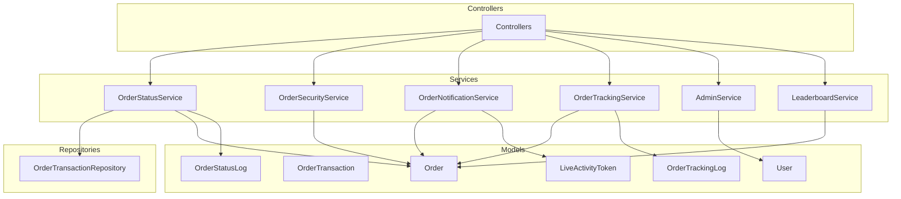
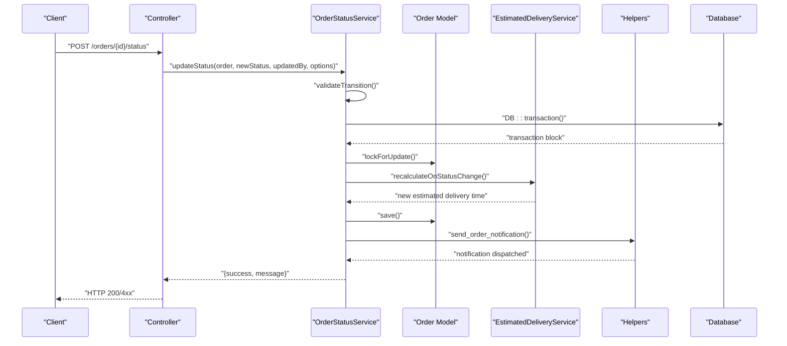
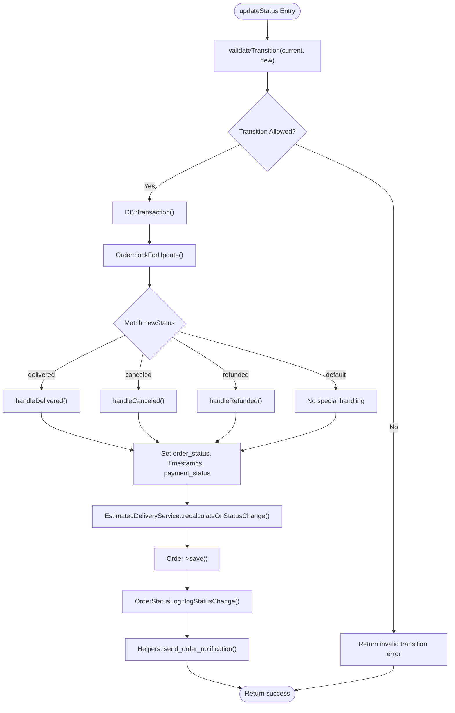
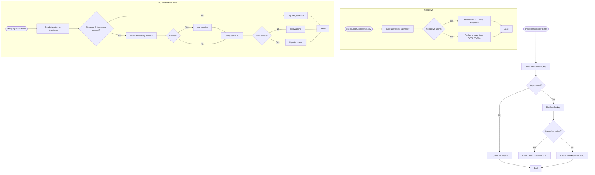
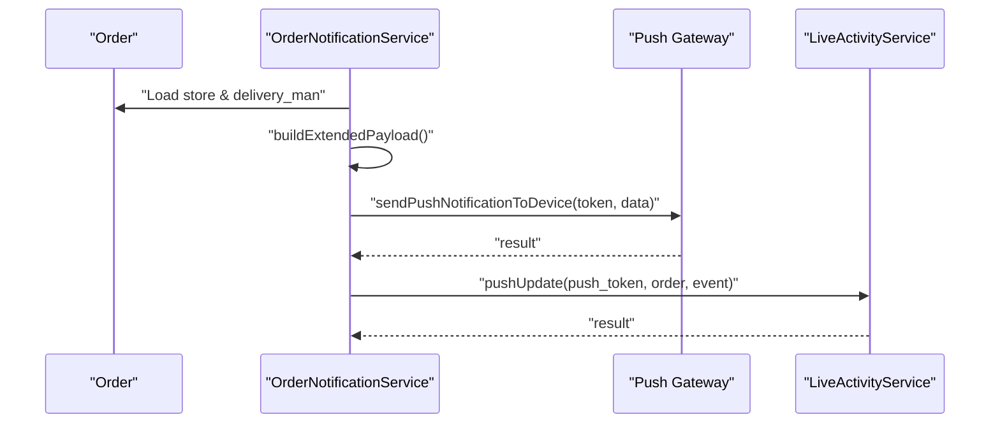
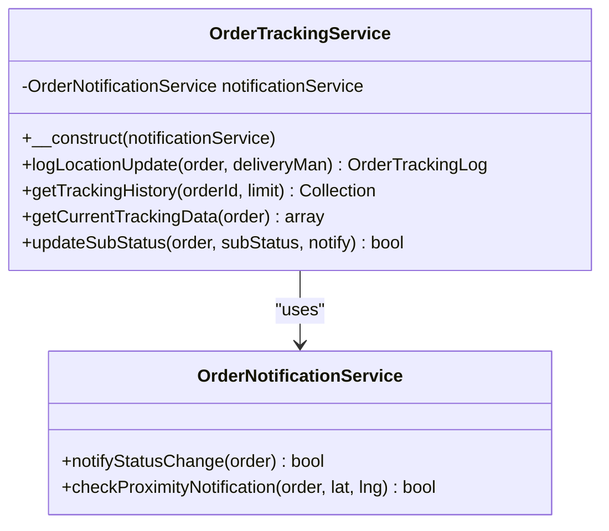
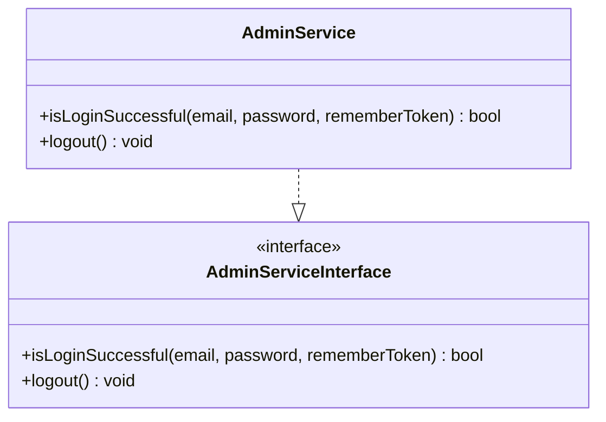
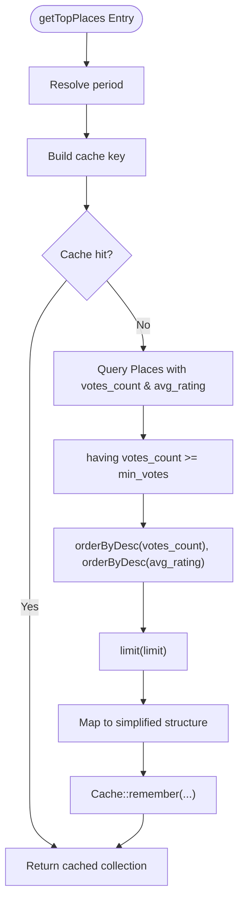
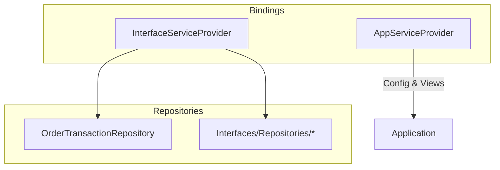

# Service Layer Architecture

<cite>
**Referenced Files in This Document**
- [AdminService.php](file://app/Services/AdminService.php)
- [AdminServiceInterface.php](file://app/Contracts/AdminServiceInterface.php)
- [OrderStatusService.php](file://app/Services/OrderStatusService.php)
- [OrderSecurityService.php](file://app/Services/OrderSecurityService.php)
- [OrderNotificationService.php](file://app/Services/OrderNotificationService.php)
- [OrderTrackingService.php](file://app/Services/OrderTrackingService.php)
- [OrderTransactionRepository.php](file://app/Repositories/OrderTransactionRepository.php)
- [InterfaceServiceProvider.php](file://app/Providers/InterfaceServiceProvider.php)
- [AppServiceProvider.php](file://app/Providers/AppServiceProvider.php)
- [LeaderboardService.php](file://Modules/PlacesToVisit/Services/LeaderboardService.php)
</cite>

## Table of Contents
1. [Introduction](#introduction)
2. [Project Structure](#project-structure)
3. [Core Components](#core-components)
4. [Architecture Overview](#architecture-overview)
5. [Detailed Component Analysis](#detailed-component-analysis)
6. [Dependency Analysis](#dependency-analysis)
7. [Performance Considerations](#performance-considerations)
8. [Troubleshooting Guide](#troubleshooting-guide)
9. [Conclusion](#conclusion)

## Introduction
This document explains the service layer architecture of Waddy Back, focusing on how services encapsulate business logic, coordinate between repositories and models, and provide clean interfaces for controllers. It documents service contracts, dependency injection usage, and demonstrates how services handle complex operations such as order processing, user management, and notification delivery. The analysis includes concrete examples from the codebase, error handling strategies, transaction management, and the relationship with the repository pattern and business rule enforcement.

## Project Structure
The service layer is organized under app/Services and app/Repositories, with contracts under app/Contracts. Providers manage binding interfaces to implementations. Module-specific services live under Modules/<ModuleName>/Services. The service layer sits between controllers and repositories/models, centralizing business logic and ensuring testability and separation of concerns.

**Diagram sources**
- [OrderStatusService.php:1-348](file://app/Services/OrderStatusService.php#L1-L348)
- [OrderSecurityService.php:1-137](file://app/Services/OrderSecurityService.php#L1-L137)
- [OrderNotificationService.php:1-312](file://app/Services/OrderNotificationService.php#L1-L312)
- [OrderTrackingService.php:1-124](file://app/Services/OrderTrackingService.php#L1-L124)
- [OrderTransactionRepository.php:1-76](file://app/Repositories/OrderTransactionRepository.php#L1-L76)
- [AdminService.php:1-23](file://app/Services/AdminService.php#L1-L23)
- [LeaderboardService.php:1-141](file://Modules/PlacesToVisit/Services/LeaderboardService.php#L1-L141)

**Section sources**
- [OrderStatusService.php:1-348](file://app/Services/OrderStatusService.php#L1-L348)
- [OrderSecurityService.php:1-137](file://app/Services/OrderSecurityService.php#L1-L137)
- [OrderNotificationService.php:1-312](file://app/Services/OrderNotificationService.php#L1-L312)
- [OrderTrackingService.php:1-124](file://app/Services/OrderTrackingService.php#L1-L124)
- [OrderTransactionRepository.php:1-76](file://app/Repositories/OrderTransactionRepository.php#L1-L76)
- [AdminService.php:1-23](file://app/Services/AdminService.php#L1-L23)
- [LeaderboardService.php:1-141](file://Modules/PlacesToVisit/Services/LeaderboardService.php#L1-L141)

## Core Components
- OrderStatusService: Centralized orchestration for order status transitions, validation, transaction management, notifications, and audit logging.
- OrderSecurityService: Idempotency checks, rate-limiting, and HMAC signature verification for order requests.
- OrderNotificationService: Push notification building and dispatching, Live Activity updates, and proximity-based triggers.
- OrderTrackingService: Location logging, tracking history retrieval, and sub-status updates with optional notifications.
- AdminService: Authentication and logout for administrative contexts.
- LeaderboardService (module): Aggregates and caches leaderboard data for place voting.

These services depend on repositories and models to persist and retrieve data, while exposing clean method signatures to controllers.

**Section sources**
- [OrderStatusService.php:1-348](file://app/Services/OrderStatusService.php#L1-L348)
- [OrderSecurityService.php:1-137](file://app/Services/OrderSecurityService.php#L1-L137)
- [OrderNotificationService.php:1-312](file://app/Services/OrderNotificationService.php#L1-L312)
- [OrderTrackingService.php:1-124](file://app/Services/OrderTrackingService.php#L1-L124)
- [AdminService.php:1-23](file://app/Services/AdminService.php#L1-L23)
- [LeaderboardService.php:1-141](file://Modules/PlacesToVisit/Services/LeaderboardService.php#L1-L141)

## Architecture Overview
The service layer follows a layered architecture:
- Controllers receive requests and delegate to services.
- Services validate inputs, enforce business rules, and coordinate with repositories/models.
- Repositories abstract persistence and encapsulate query logic.
- Models represent domain entities and relationships.
- Providers bind interfaces to implementations for dependency injection.

**Diagram sources**
- [OrderStatusService.php:89-156](file://app/Services/OrderStatusService.php#L89-L156)

**Section sources**
- [OrderStatusService.php:1-348](file://app/Services/OrderStatusService.php#L1-L348)

## Detailed Component Analysis

### OrderStatusService
Responsibilities:
- Validates allowed status transitions against configuration.
- Performs atomic updates using database transactions.
- Handles special transitions (delivered, canceled, refunded) with side effects.
- Updates estimated delivery time via EstimatedDeliveryService.
- Logs status changes for audit trails.
- Sends order notifications via Helpers.

Key implementation patterns:
- Static service methods for centralized logic.
- Match expressions for transition-specific handling.
- DB::transaction for atomicity.
- Eloquent lockForUpdate for concurrency safety.
- Integration with OrderStatusLog model for audit trail.

Error handling:
- Returns structured results with success flags and messages.
- Wraps transaction in try/catch to capture failures.
- Graceful logging for notification failures.

Transaction management:
- Uses database transactions to ensure consistency across order updates, delivery man adjustments, and inventory/order count increments.

Relationships:
- Depends on Order, DeliveryMan, OrderStatusLog, EstimatedDeliveryService, Helpers, and Eloquent models.

**Diagram sources**
- [OrderStatusService.php:89-156](file://app/Services/OrderStatusService.php#L89-L156)

**Section sources**
- [OrderStatusService.php:1-348](file://app/Services/OrderStatusService.php#L1-L348)

### OrderSecurityService
Responsibilities:
- Idempotency enforcement using cache keys to prevent duplicate submissions.
- Cooldown enforcement per user/guest to throttle order frequency.
- HMAC-SHA256 signature verification with timestamp window checking.
- Stores security fields on the order for audit.

Error handling:
- Returns structured HTTP 409/429 responses for violations.
- Logs warnings and informational events without failing the request.

**Diagram sources**
- [OrderSecurityService.php:22-125](file://app/Services/OrderSecurityService.php#L22-L125)

**Section sources**
- [OrderSecurityService.php:1-137](file://app/Services/OrderSecurityService.php#L1-L137)

### OrderNotificationService
Responsibilities:
- Builds localized, structured notification payloads for order status changes.
- Dispatches push notifications via shared trait methods.
- Manages Live Activity updates for iOS.
- Calculates ETA and constructs display-friendly titles/subtitles.
- Proximity-based triggers to notify customers when drivers are near.

Integration points:
- Uses Order model relationships (store, delivery_man).
- Integrates with LiveActivityService for iOS updates.

**Diagram sources**
- [OrderNotificationService.php:86-122](file://app/Services/OrderNotificationService.php#L86-L122)
- [OrderNotificationService.php:177-196](file://app/Services/OrderNotificationService.php#L177-L196)

**Section sources**
- [OrderNotificationService.php:1-312](file://app/Services/OrderNotificationService.php#L1-L312)

### OrderTrackingService
Responsibilities:
- Logs driver location updates with order status and sub-status.
- Retrieves tracking history and current tracking data.
- Updates sub-status and optionally notifies the customer.

Dependency injection:
- Accepts OrderNotificationService via constructor injection.

**Diagram sources**
- [OrderTrackingService.php:12-19](file://app/Services/OrderTrackingService.php#L12-L19)
- [OrderTrackingService.php:28-50](file://app/Services/OrderTrackingService.php#L28-L50)
- [OrderTrackingService.php:110-122](file://app/Services/OrderTrackingService.php#L110-L122)

**Section sources**
- [OrderTrackingService.php:1-124](file://app/Services/OrderTrackingService.php#L1-L124)

### AdminService
Responsibilities:
- Handles admin login attempts with remember token support.
- Performs logout and session invalidation.

Contract:
- Implements AdminServiceInterface for type-safe contracts.

**Diagram sources**
- [AdminServiceInterface.php:5-10](file://app/Contracts/AdminServiceInterface.php#L5-L10)
- [AdminService.php:7-22](file://app/Services/AdminService.php#L7-L22)

**Section sources**
- [AdminServiceInterface.php:1-11](file://app/Contracts/AdminServiceInterface.php#L1-L11)
- [AdminService.php:1-23](file://app/Services/AdminService.php#L1-L23)

### LeaderboardService (Module)
Responsibilities:
- Computes top places and top voters with caching and configurable limits.
- Supports filtering by period, category, and zone.
- Clears cache for recomputation.

**Diagram sources**
- [LeaderboardService.php:28-58](file://Modules/PlacesToVisit/Services/LeaderboardService.php#L28-L58)

**Section sources**
- [LeaderboardService.php:1-141](file://Modules/PlacesToVisit/Services/LeaderboardService.php#L1-L141)

## Dependency Analysis
Dependency injection and bindings:
- InterfaceServiceProvider scans repositories and binds matching interface-to-implementation pairs automatically.
- AppServiceProvider bootstraps global configurations and shares view data.

Repository pattern:
- OrderTransactionRepository implements a generic repository interface and encapsulates CRUD operations for OrderTransaction, enabling testable and reusable persistence logic.

**Diagram sources**
- [InterfaceServiceProvider.php:20-36](file://app/Providers/InterfaceServiceProvider.php#L20-L36)
- [AppServiceProvider.php:29-45](file://app/Providers/AppServiceProvider.php#L29-L45)
- [OrderTransactionRepository.php:12-16](file://app/Repositories/OrderTransactionRepository.php#L12-L16)

**Section sources**
- [InterfaceServiceProvider.php:1-46](file://app/Providers/InterfaceServiceProvider.php#L1-L46)
- [AppServiceProvider.php:1-49](file://app/Providers/AppServiceProvider.php#L1-L49)
- [OrderTransactionRepository.php:1-76](file://app/Repositories/OrderTransactionRepository.php#L1-L76)

## Performance Considerations
- Use database transactions for atomic updates to avoid inconsistent states during order processing.
- Apply row-level locking (lockForUpdate) to prevent race conditions during concurrent updates.
- Cache heavy computations (e.g., leaderboard) with appropriate TTLs to reduce database load.
- Minimize N+1 queries by eager-loading relationships in services (e.g., loading store and delivery_man before sending notifications).
- Use pagination and filtered queries in repositories to limit result sets.

## Troubleshooting Guide
Common issues and resolutions:
- Order status update fails: Check transaction rollback causes and review validation logic in OrderStatusService.updateStatus.
- Duplicate order submission: Ensure idempotency_key is provided and cache TTL is configured correctly in OrderSecurityService.
- Too many requests: Verify cooldown cache keys and TTL values.
- Signature verification failures: Confirm HMAC secret and timestamp window configuration; inspect logs for warnings.
- Notification delivery problems: Validate device tokens and push gateway credentials; note that notification failures are logged but do not block the main flow.

**Section sources**
- [OrderStatusService.php:149-155](file://app/Services/OrderStatusService.php#L149-L155)
- [OrderSecurityService.php:36-44](file://app/Services/OrderSecurityService.php#L36-L44)
- [OrderSecurityService.php:59-69](file://app/Services/OrderSecurityService.php#L59-L69)
- [OrderSecurityService.php:117-124](file://app/Services/OrderSecurityService.php#L117-L124)
- [OrderNotificationService.php:139-142](file://app/Services/OrderNotificationService.php#L139-L142)

## Conclusion
Waddy Back’s service layer effectively encapsulates business logic, coordinates between repositories and models, and provides clean interfaces for controllers. Services enforce business rules, manage transactions, and integrate with external systems for notifications and security. The repository pattern and provider-based dependency injection further enhance modularity and testability. By following the patterns documented here, developers can extend and maintain the service layer reliably.