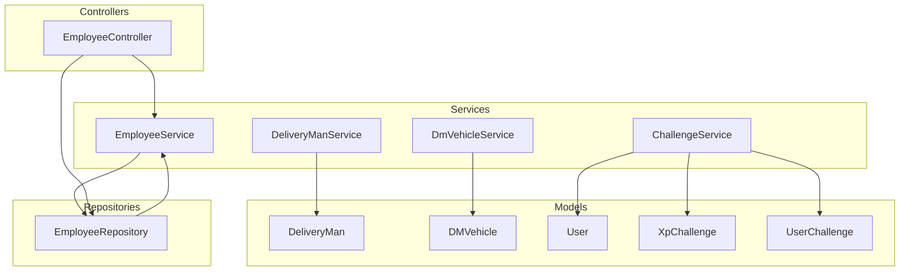
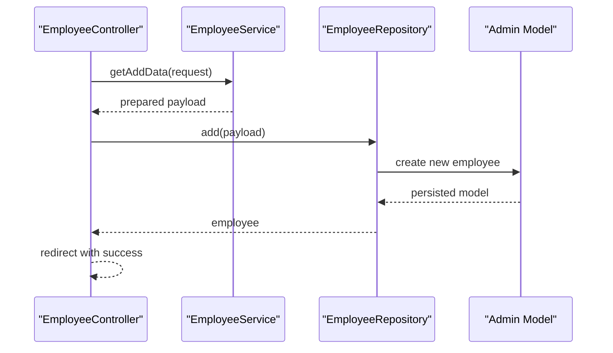
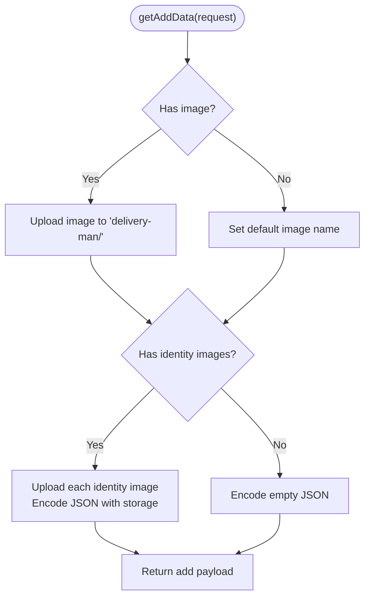
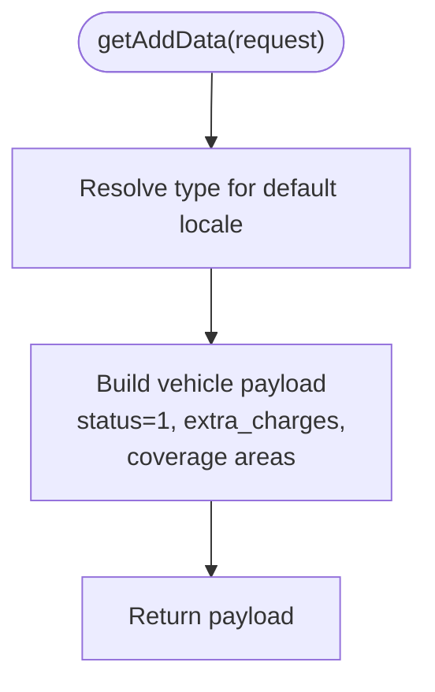
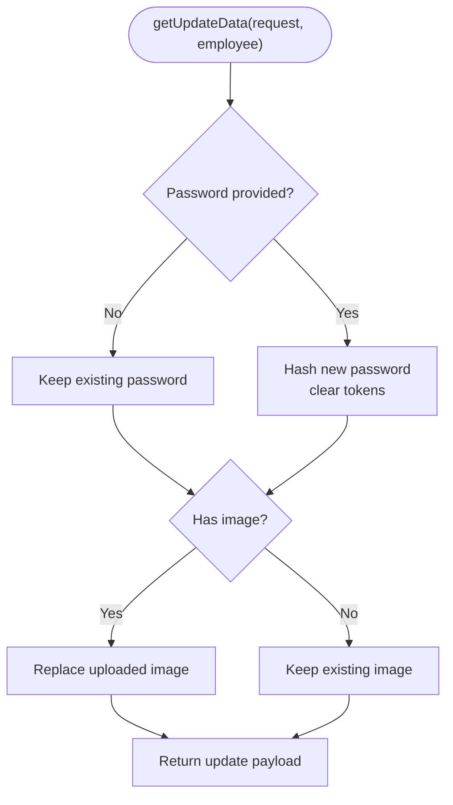
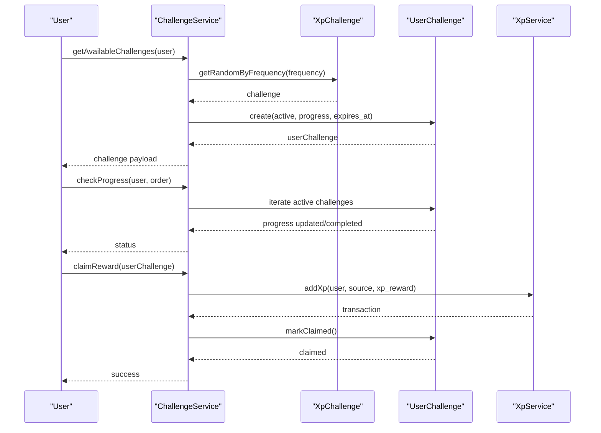
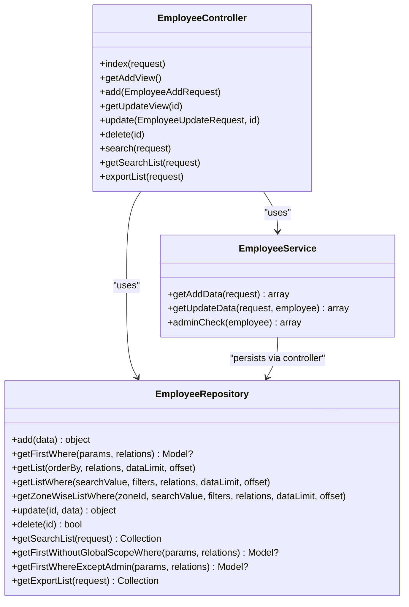
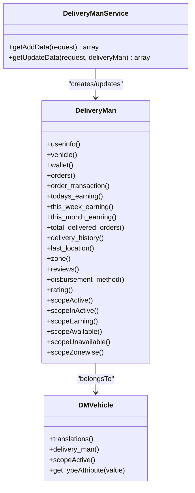
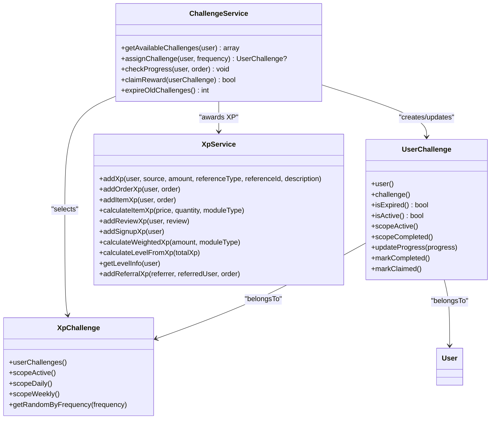
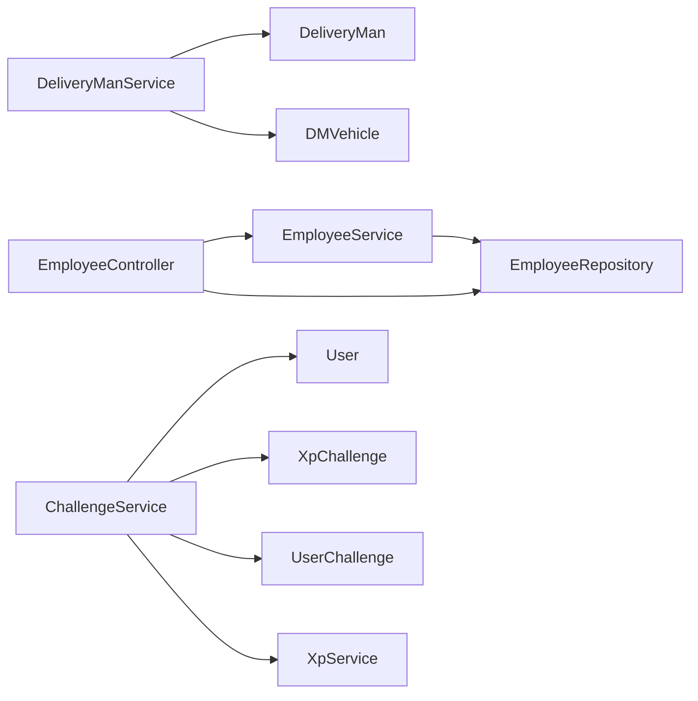

# User Management Services

<cite>
**Referenced Files in This Document**
- [DeliveryManService.php](file://app/Services/DeliveryManService.php)
- [DmVehicleService.php](file://app/Services/DmVehicleService.php)
- [EmployeeService.php](file://app/Services/EmployeeService.php)
- [ChallengeService.php](file://app/Services/ChallengeService.php)
- [DeliveryMan.php](file://app/Models/DeliveryMan.php)
- [DMVehicle.php](file://app/Models/DMVehicle.php)
- [User.php](file://app/Models/User.php)
- [XpChallenge.php](file://app/Models/XpChallenge.php)
- [UserChallenge.php](file://app/Models/UserChallenge.php)
- [XpService.php](file://app/Services/XpService.php)
- [VendorEmployee.php](file://app/Models/VendorEmployee.php)
- [EmployeeRepository.php](file://app/Repositories/EmployeeRepository.php)
- [EmployeeController.php](file://app/Http/Controllers/Admin/Employee/EmployeeController.php)
</cite>

## Table of Contents
1. [Introduction](#introduction)
2. [Project Structure](#project-structure)
3. [Core Components](#core-components)
4. [Architecture Overview](#architecture-overview)
5. [Detailed Component Analysis](#detailed-component-analysis)
6. [Dependency Analysis](#dependency-analysis)
7. [Performance Considerations](#performance-considerations)
8. [Troubleshooting Guide](#troubleshooting-guide)
9. [Conclusion](#conclusion)

## Introduction
This document provides comprehensive documentation for user management services focused on:
- Delivery personnel management via DeliveryManService
- Vehicle assignment and tracking via DmVehicleService
- Staff management via EmployeeService
- User engagement challenges via ChallengeService

It explains service methods for user onboarding, profile management, role assignments, and performance tracking. It also covers user lifecycle management, vehicle allocation processes, and integration with authentication systems.

## Project Structure
The user management domain spans services, models, repositories, and controllers:
- Services encapsulate business logic for data preparation and challenge management
- Models define authentication traits, relationships, and computed attributes
- Repositories handle persistence and filtering
- Controllers orchestrate requests and delegate to services and repositories

**Diagram sources**
- [DeliveryManService.php:1-92](file://app/Services/DeliveryManService.php#L1-L92)
- [DmVehicleService.php:1-28](file://app/Services/DmVehicleService.php#L1-L28)
- [EmployeeService.php:1-61](file://app/Services/EmployeeService.php#L1-L61)
- [ChallengeService.php:1-321](file://app/Services/ChallengeService.php#L1-L321)
- [DeliveryMan.php:1-234](file://app/Models/DeliveryMan.php#L1-L234)
- [DMVehicle.php:1-57](file://app/Models/DMVehicle.php#L1-L57)
- [User.php:1-279](file://app/Models/User.php#L1-L279)
- [XpChallenge.php:1-64](file://app/Models/XpChallenge.php#L1-L64)
- [UserChallenge.php:1-118](file://app/Models/UserChallenge.php#L1-L118)
- [EmployeeRepository.php:1-132](file://app/Repositories/EmployeeRepository.php#L1-L132)
- [EmployeeController.php:1-132](file://app/Http/Controllers/Admin/Employee/EmployeeController.php#L1-L132)

**Section sources**
- [DeliveryManService.php:1-92](file://app/Services/DeliveryManService.php#L1-L92)
- [DmVehicleService.php:1-28](file://app/Services/DmVehicleService.php#L1-L28)
- [EmployeeService.php:1-61](file://app/Services/EmployeeService.php#L1-L61)
- [ChallengeService.php:1-321](file://app/Services/ChallengeService.php#L1-L321)
- [DeliveryMan.php:1-234](file://app/Models/DeliveryMan.php#L1-L234)
- [DMVehicle.php:1-57](file://app/Models/DMVehicle.php#L1-L57)
- [User.php:1-279](file://app/Models/User.php#L1-L279)
- [XpChallenge.php:1-64](file://app/Models/XpChallenge.php#L1-L64)
- [UserChallenge.php:1-118](file://app/Models/UserChallenge.php#L1-L118)
- [EmployeeRepository.php:1-132](file://app/Repositories/EmployeeRepository.php#L1-L132)
- [EmployeeController.php:1-132](file://app/Http/Controllers/Admin/Employee/EmployeeController.php#L1-L132)

## Core Components
- DeliveryManService: Prepares creation and update payloads for delivery personnel, handles image uploads, identity documents, and password hashing.
- DmVehicleService: Prepares creation and update payloads for delivery vehicles, including localization and coverage areas.
- EmployeeService: Prepares creation and update payloads for employees, manages images and passwords, and enforces admin ownership checks.
- ChallengeService: Manages user engagement challenges (daily/weekly), assigns random challenges, tracks progress, and claims rewards.

**Section sources**
- [DeliveryManService.php:13-47](file://app/Services/DeliveryManService.php#L13-L47)
- [DeliveryManService.php:49-89](file://app/Services/DeliveryManService.php#L49-L89)
- [DmVehicleService.php:6-15](file://app/Services/DmVehicleService.php#L6-L15)
- [DmVehicleService.php:17-25](file://app/Services/DmVehicleService.php#L17-L25)
- [EmployeeService.php:11-25](file://app/Services/EmployeeService.php#L11-L25)
- [EmployeeService.php:26-51](file://app/Services/EmployeeService.php#L26-L51)
- [EmployeeService.php:52-58](file://app/Services/EmployeeService.php#L52-L58)
- [ChallengeService.php:18-35](file://app/Services/ChallengeService.php#L18-L35)
- [ChallengeService.php:147-164](file://app/Services/ChallengeService.php#L147-L164)
- [ChallengeService.php:196-256](file://app/Services/ChallengeService.php#L196-L256)
- [ChallengeService.php:261-285](file://app/Services/ChallengeService.php#L261-L285)

## Architecture Overview
The services act as orchestrators between controllers, repositories, and models. Authentication is handled via Laravel’s User base class and Passport tokens for API access. File uploads leverage a trait for consistent storage handling.

**Diagram sources**
- [EmployeeController.php:57-63](file://app/Http/Controllers/Admin/Employee/EmployeeController.php#L57-L63)
- [EmployeeService.php:11-25](file://app/Services/EmployeeService.php#L11-L25)
- [EmployeeRepository.php:18-26](file://app/Repositories/EmployeeRepository.php#L18-L26)

**Section sources**
- [EmployeeController.php:57-63](file://app/Http/Controllers/Admin/Employee/EmployeeController.php#L57-L63)
- [EmployeeService.php:11-25](file://app/Services/EmployeeService.php#L11-L25)
- [EmployeeRepository.php:18-26](file://app/Repositories/EmployeeRepository.php#L18-L26)

## Detailed Component Analysis

### DeliveryManService
Responsibilities:
- Build creation payload with personal info, credentials, images, identity documents, and vehicle association
- Build update payload with optional image replacement, identity document updates, and conditional password handling
- Manage file uploads and identity document JSON encoding

Key methods:
- getAddData(request): constructs the initial delivery person record
- getUpdateData(request, deliveryMan): updates profile and documents

**Diagram sources**
- [DeliveryManService.php:13-47](file://app/Services/DeliveryManService.php#L13-L47)

**Section sources**
- [DeliveryManService.php:13-47](file://app/Services/DeliveryManService.php#L13-L47)
- [DeliveryManService.php:49-89](file://app/Services/DeliveryManService.php#L49-L89)

### DmVehicleService
Responsibilities:
- Prepare vehicle creation/update payloads with localized type, status, and coverage parameters

Key methods:
- getAddData(request): builds creation payload
- getUpdateData(request): builds update payload

**Diagram sources**
- [DmVehicleService.php:6-15](file://app/Services/DmVehicleService.php#L6-L15)

**Section sources**
- [DmVehicleService.php:6-15](file://app/Services/DmVehicleService.php#L6-L15)
- [DmVehicleService.php:17-25](file://app/Services/DmVehicleService.php#L17-L25)

### EmployeeService
Responsibilities:
- Prepare employee creation payload including credentials, image upload, timestamps
- Prepare employee update payload with optional password change, token resets, and image replacement
- Enforce admin ownership checks for sensitive operations

Key methods:
- getAddData(request)
- getUpdateData(request, employee)
- adminCheck(employee)

**Diagram sources**
- [EmployeeService.php:26-51](file://app/Services/EmployeeService.php#L26-L51)

**Section sources**
- [EmployeeService.php:11-25](file://app/Services/EmployeeService.php#L11-L25)
- [EmployeeService.php:26-51](file://app/Services/EmployeeService.php#L26-L51)
- [EmployeeService.php:52-58](file://app/Services/EmployeeService.php#L52-L58)

### ChallengeService
Responsibilities:
- Determine available daily and weekly challenges for a user
- Assign random active challenges with time limits and progress initialization
- Track and update challenge progress after orders
- Claim rewards and apply 24-hour cooldowns
- Expire overdue challenges

Core flows:
- Available challenges retrieval (midnight daily reset; weekly reset on Saturday)
- Random assignment with progress initialization
- Progress checks per challenge type
- Reward claiming and XP awarding via XpService

**Diagram sources**
- [ChallengeService.php:18-35](file://app/Services/ChallengeService.php#L18-L35)
- [ChallengeService.php:147-164](file://app/Services/ChallengeService.php#L147-L164)
- [ChallengeService.php:196-256](file://app/Services/ChallengeService.php#L196-L256)
- [ChallengeService.php:261-285](file://app/Services/ChallengeService.php#L261-L285)
- [XpService.php:20-76](file://app/Services/XpService.php#L20-L76)

**Section sources**
- [ChallengeService.php:18-35](file://app/Services/ChallengeService.php#L18-L35)
- [ChallengeService.php:147-164](file://app/Services/ChallengeService.php#L147-L164)
- [ChallengeService.php:196-256](file://app/Services/ChallengeService.php#L196-L256)
- [ChallengeService.php:261-285](file://app/Services/ChallengeService.php#L261-L285)
- [XpService.php:20-76](file://app/Services/XpService.php#L20-L76)

### Employee Management Lifecycle
- Onboarding: Controller validates input, delegates to EmployeeService for payload construction, persists via EmployeeRepository
- Profile management: Updates include optional password changes and image replacement
- Role assignments: Controlled via role_id during creation/update
- Performance tracking: Not directly exposed by EmployeeService; integrate via repository queries and reporting exports

**Diagram sources**
- [EmployeeController.php:25-132](file://app/Http/Controllers/Admin/Employee/EmployeeController.php#L25-L132)
- [EmployeeService.php:1-61](file://app/Services/EmployeeService.php#L1-L61)
- [EmployeeRepository.php:1-132](file://app/Repositories/EmployeeRepository.php#L1-L132)

**Section sources**
- [EmployeeController.php:36-55](file://app/Http/Controllers/Admin/Employee/EmployeeController.php#L36-L55)
- [EmployeeController.php:57-63](file://app/Http/Controllers/Admin/Employee/EmployeeController.php#L57-L63)
- [EmployeeController.php:65-78](file://app/Http/Controllers/Admin/Employee/EmployeeController.php#L65-L78)
- [EmployeeController.php:80-88](file://app/Http/Controllers/Admin/Employee/EmployeeController.php#L80-L88)
- [EmployeeController.php:90-95](file://app/Http/Controllers/Admin/Employee/EmployeeController.php#L90-L95)
- [EmployeeController.php:97-115](file://app/Http/Controllers/Admin/Employee/EmployeeController.php#L97-L115)
- [EmployeeController.php:117-130](file://app/Http/Controllers/Admin/Employee/EmployeeController.php#L117-L130)
- [EmployeeService.php:11-25](file://app/Services/EmployeeService.php#L11-L25)
- [EmployeeService.php:26-51](file://app/Services/EmployeeService.php#L26-L51)
- [EmployeeService.php:52-58](file://app/Services/EmployeeService.php#L52-L58)
- [EmployeeRepository.php:18-26](file://app/Repositories/EmployeeRepository.php#L18-L26)
- [EmployeeRepository.php:76-84](file://app/Repositories/EmployeeRepository.php#L76-L84)
- [EmployeeRepository.php:86-92](file://app/Repositories/EmployeeRepository.php#L86-L92)

### Delivery Personnel Lifecycle
- Onboarding: Controller validates input, delegates to DeliveryManService for payload construction, persists via repository
- Profile management: Updates handle optional image and identity document replacements, conditional password updates
- Vehicle assignment: Creation payload includes vehicle_id; updates adjust vehicle association
- Performance tracking: DeliveryMan model exposes scopes and relations for earnings and orders

**Diagram sources**
- [DeliveryManService.php:13-47](file://app/Services/DeliveryManService.php#L13-L47)
- [DeliveryManService.php:49-89](file://app/Services/DeliveryManService.php#L49-L89)
- [DeliveryMan.php:13-234](file://app/Models/DeliveryMan.php#L13-L234)
- [DMVehicle.php:9-57](file://app/Models/DMVehicle.php#L9-L57)

**Section sources**
- [DeliveryManService.php:13-47](file://app/Services/DeliveryManService.php#L13-L47)
- [DeliveryManService.php:49-89](file://app/Services/DeliveryManService.php#L49-L89)
- [DeliveryMan.php:49-134](file://app/Models/DeliveryMan.php#L49-L134)
- [DeliveryMan.php:136-164](file://app/Models/DeliveryMan.php#L136-L164)
- [DMVehicle.php:26-34](file://app/Models/DMVehicle.php#L26-L34)
- [DMVehicle.php:36-46](file://app/Models/DMVehicle.php#L36-L46)

### Challenge System Integration
- Challenge templates: XpChallenge defines daily/weekly challenges with conditions and XP rewards
- User challenges: UserChallenge tracks per-user progress, status, and expiration
- XP awards: XpService handles XP additions, level-ups, and notifications
- Challenge progression: ChallengeService evaluates orders against challenge conditions

**Diagram sources**
- [XpChallenge.php:8-64](file://app/Models/XpChallenge.php#L8-L64)
- [UserChallenge.php:9-118](file://app/Models/UserChallenge.php#L9-L118)
- [XpService.php:15-336](file://app/Services/XpService.php#L15-L336)
- [ChallengeService.php:12-321](file://app/Services/ChallengeService.php#L12-L321)

**Section sources**
- [XpChallenge.php:24-62](file://app/Models/XpChallenge.php#L24-L62)
- [UserChallenge.php:29-116](file://app/Models/UserChallenge.php#L29-L116)
- [XpService.php:20-76](file://app/Services/XpService.php#L20-L76)
- [ChallengeService.php:147-164](file://app/Services/ChallengeService.php#L147-L164)
- [ChallengeService.php:196-256](file://app/Services/ChallengeService.php#L196-L256)
- [ChallengeService.php:261-285](file://app/Services/ChallengeService.php#L261-L285)

## Dependency Analysis
- Controllers depend on Services and Repositories for business operations
- Services depend on Models for data shaping and on external traits for file handling
- Models define relationships and scopes used by Services and Repositories
- ChallengeService integrates with XpService for XP accounting and notifications

**Diagram sources**
- [EmployeeController.php:25-34](file://app/Http/Controllers/Admin/Employee/EmployeeController.php#L25-L34)
- [EmployeeService.php:1-61](file://app/Services/EmployeeService.php#L1-L61)
- [EmployeeRepository.php:1-132](file://app/Repositories/EmployeeRepository.php#L1-L132)
- [DeliveryManService.php:1-92](file://app/Services/DeliveryManService.php#L1-L92)
- [DeliveryMan.php:1-234](file://app/Models/DeliveryMan.php#L1-L234)
- [DMVehicle.php:1-57](file://app/Models/DMVehicle.php#L1-L57)
- [ChallengeService.php:1-321](file://app/Services/ChallengeService.php#L1-L321)
- [User.php:1-279](file://app/Models/User.php#L1-L279)
- [XpChallenge.php:1-64](file://app/Models/XpChallenge.php#L1-L64)
- [UserChallenge.php:1-118](file://app/Models/UserChallenge.php#L1-L118)
- [XpService.php:1-336](file://app/Services/XpService.php#L1-L336)

**Section sources**
- [EmployeeController.php:25-34](file://app/Http/Controllers/Admin/Employee/EmployeeController.php#L25-L34)
- [EmployeeService.php:1-61](file://app/Services/EmployeeService.php#L1-L61)
- [EmployeeRepository.php:1-132](file://app/Repositories/EmployeeRepository.php#L1-L132)
- [DeliveryManService.php:1-92](file://app/Services/DeliveryManService.php#L1-L92)
- [DeliveryMan.php:1-234](file://app/Models/DeliveryMan.php#L1-L234)
- [DMVehicle.php:1-57](file://app/Models/DMVehicle.php#L1-L57)
- [ChallengeService.php:1-321](file://app/Services/ChallengeService.php#L1-L321)
- [User.php:1-279](file://app/Models/User.php#L1-L279)
- [XpChallenge.php:1-64](file://app/Models/XpChallenge.php#L1-L64)
- [UserChallenge.php:1-118](file://app/Models/UserChallenge.php#L1-L118)
- [XpService.php:1-336](file://app/Services/XpService.php#L1-L336)

## Performance Considerations
- ChallengeService uses database queries to fetch active challenges and assign random ones; ensure indexes on challenge frequency and status for scalability
- File uploads via FileManagerTrait should be optimized for disk I/O; consider CDN-backed storage for images
- EmployeeRepository pagination and search filters help manage large datasets; prefer indexed columns for search keys
- ChallengeService operations (progress checks, reward claims) should be batched or scheduled to avoid heavy synchronous workloads

## Troubleshooting Guide
- Authentication and tokens: EmployeeService clears remember tokens upon password change to enforce re-authentication
- Image handling: Ensure proper MIME types and storage disks; verify FileManagerTrait integration for upload paths
- Challenge eligibility: Verify midnight and weekly reset logic; confirm time zone settings for accurate resets
- XP duplication prevention: XpService prevents duplicate XP entries for the same reference/source combination

**Section sources**
- [EmployeeService.php:28-34](file://app/Services/EmployeeService.php#L28-L34)
- [XpService.php:34-37](file://app/Services/XpService.php#L34-L37)
- [ChallengeService.php:70-77](file://app/Services/ChallengeService.php#L70-L77)
- [ChallengeService.php:123-131](file://app/Services/ChallengeService.php#L123-L131)

## Conclusion
The user management services provide a cohesive foundation for onboarding, managing profiles, assigning roles, and tracking performance across delivery personnel, staff, and user engagement challenges. Services encapsulate business logic, while models and repositories ensure robust persistence and relationships. Integrations with authentication and XP systems enable scalable user lifecycle management and gamification.