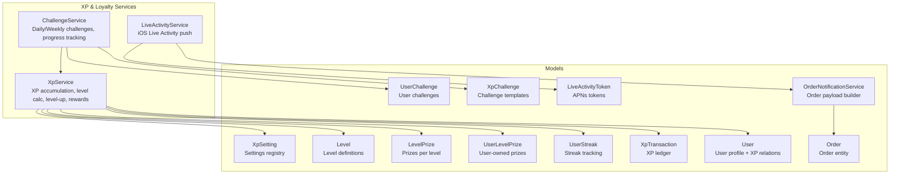
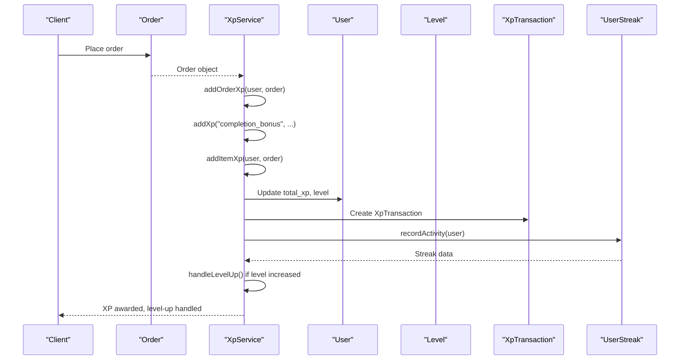
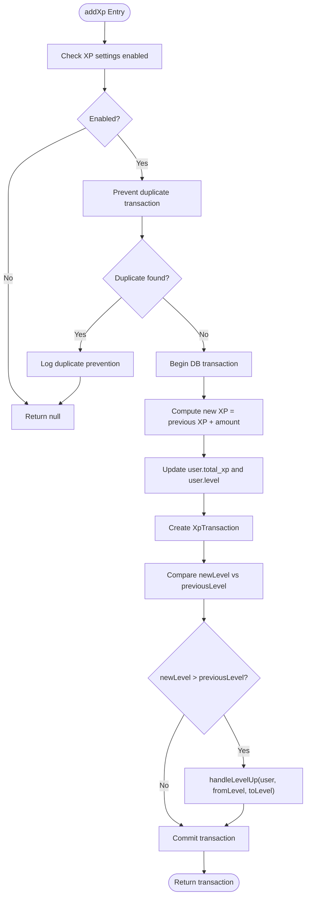
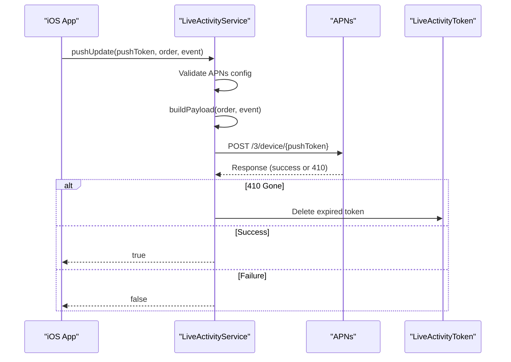
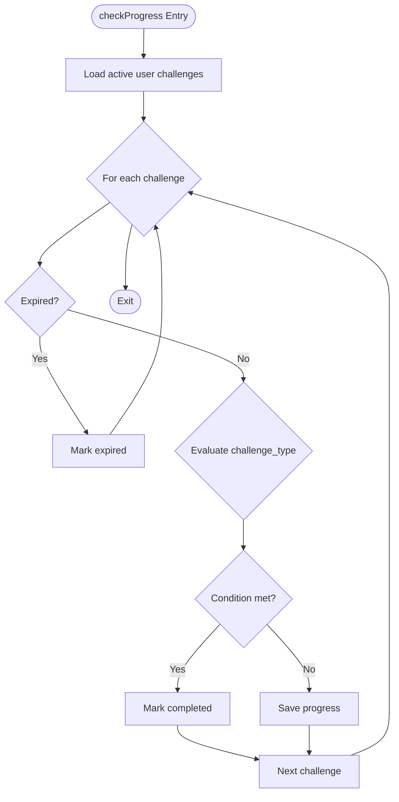
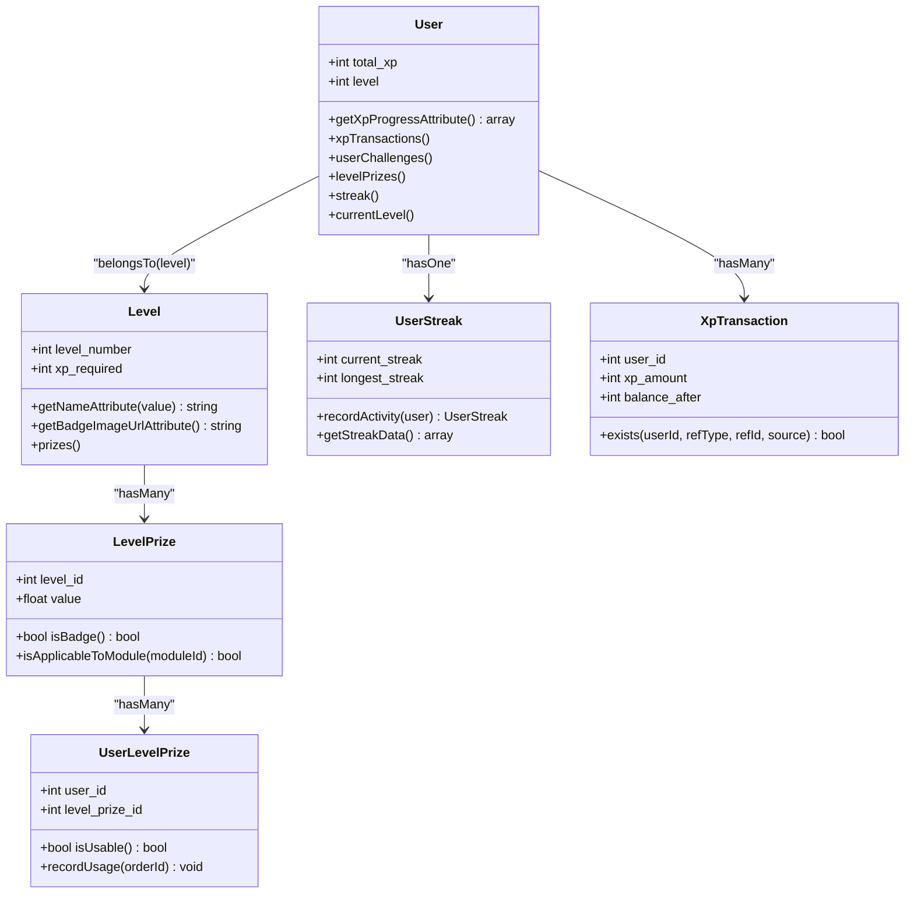
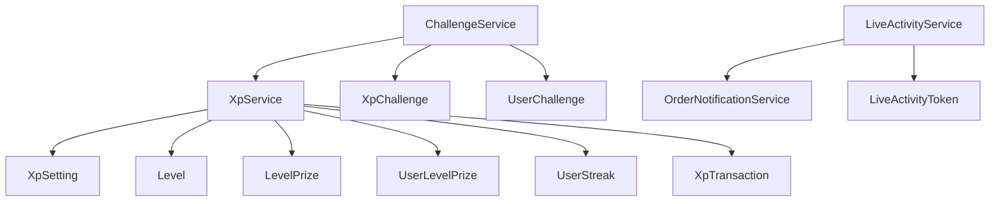

# XP and Loyalty Services

<cite>
**Referenced Files in This Document**
- [XpService.php](file://app/Services/XpService.php)
- [LiveActivityService.php](file://app/Services/LiveActivityService.php)
- [XpSetting.php](file://app/Models/XpSetting.php)
- [Level.php](file://app/Models/Level.php)
- [LevelPrize.php](file://app/Models/LevelPrize.php)
- [UserLevelPrize.php](file://app/Models/UserLevelPrize.php)
- [UserStreak.php](file://app/Models/UserStreak.php)
- [XpTransaction.php](file://app/Models/XpTransaction.php)
- [User.php](file://app/Models/User.php)
- [ChallengeService.php](file://app/Services/ChallengeService.php)
- [UserChallenge.php](file://app/Models/UserChallenge.php)
- [XpChallenge.php](file://app/Models/XpChallenge.php)
- [LiveActivityToken.php](file://app/Models/LiveActivityToken.php)
- [OrderNotificationService.php](file://app/Services/OrderNotificationService.php)
- [Order.php](file://app/Models/Order.php)
</cite>

## Table of Contents
1. [Introduction](#introduction)
2. [Project Structure](#project-structure)
3. [Core Components](#core-components)
4. [Architecture Overview](#architecture-overview)
5. [Detailed Component Analysis](#detailed-component-analysis)
6. [Dependency Analysis](#dependency-analysis)
7. [Performance Considerations](#performance-considerations)
8. [Troubleshooting Guide](#troubleshooting-guide)
9. [Conclusion](#conclusion)

## Introduction
This document provides comprehensive documentation for the XP and loyalty services that power experience point management, level progression, challenge completion, and live activity tracking. It explains how XpService manages XP accumulation, calculates level progression, handles rewards, and integrates with user profiles. It also documents LiveActivityService for real-time iOS Live Activity updates and engagement metrics. The guide includes algorithmic explanations, integration patterns, and operational insights for maintainers and developers.

## Project Structure
The XP and loyalty system spans services and models organized around XP management, level progression, challenges, streaks, and live activity updates. The primary components are:
- XpService: Central XP engine for adding points, calculating levels, handling level-ups, and integrating with user profiles.
- LiveActivityService: iOS Live Activity push notifications via APNs with JWT authentication.
- Supporting models: XpSetting, Level, LevelPrize, UserLevelPrize, UserStreak, XpTransaction, User, ChallengeService, UserChallenge, XpChallenge, LiveActivityToken, OrderNotificationService, and Order.

**Diagram sources**
- [XpService.php:15-336](file://app/Services/XpService.php#L15-L336)
- [LiveActivityService.php:22-191](file://app/Services/LiveActivityService.php#L22-L191)
- [XpSetting.php:8-68](file://app/Models/XpSetting.php#L8-L68)
- [Level.php:11-152](file://app/Models/Level.php#L11-L152)
- [LevelPrize.php:9-97](file://app/Models/LevelPrize.php#L9-L97)
- [UserLevelPrize.php:10-203](file://app/Models/UserLevelPrize.php#L10-L203)
- [UserStreak.php:9-81](file://app/Models/UserStreak.php#L9-L81)
- [XpTransaction.php:8-53](file://app/Models/XpTransaction.php#L8-L53)
- [User.php:19-279](file://app/Models/User.php#L19-L279)
- [ChallengeService.php:12-321](file://app/Services/ChallengeService.php#L12-L321)
- [UserChallenge.php:9-118](file://app/Models/UserChallenge.php#L9-L118)
- [XpChallenge.php:8-64](file://app/Models/XpChallenge.php#L8-L64)
- [LiveActivityToken.php](file://app/Models/LiveActivityToken.php)
- [OrderNotificationService.php](file://app/Services/OrderNotificationService.php)
- [Order.php](file://app/Models/Order.php)

**Section sources**
- [XpService.php:15-336](file://app/Services/XpService.php#L15-L336)
- [LiveActivityService.php:22-191](file://app/Services/LiveActivityService.php#L22-L191)
- [XpSetting.php:8-68](file://app/Models/XpSetting.php#L8-L68)
- [Level.php:11-152](file://app/Models/Level.php#L11-L152)
- [LevelPrize.php:9-97](file://app/Models/LevelPrize.php#L9-L97)
- [UserLevelPrize.php:10-203](file://app/Models/UserLevelPrize.php#L10-L203)
- [UserStreak.php:9-81](file://app/Models/UserStreak.php#L9-L81)
- [XpTransaction.php:8-53](file://app/Models/XpTransaction.php#L8-L53)
- [User.php:19-279](file://app/Models/User.php#L19-L279)
- [ChallengeService.php:12-321](file://app/Services/ChallengeService.php#L12-L321)
- [UserChallenge.php:9-118](file://app/Models/UserChallenge.php#L9-L118)
- [XpChallenge.php:8-64](file://app/Models/XpChallenge.php#L8-L64)
- [LiveActivityToken.php](file://app/Models/LiveActivityToken.php)
- [OrderNotificationService.php](file://app/Services/OrderNotificationService.php)
- [Order.php](file://app/Models/Order.php)

## Core Components
- XpService: Adds XP for orders, reviews, signups, referrals, and items purchased; calculates level from XP; handles level-ups; records transactions; integrates with streaks and notifications.
- LiveActivityService: Sends APNs Live Activity updates/end events to iOS devices using JWT authentication; builds content-state payloads from order data.
- ChallengeService: Manages daily and weekly challenges, initializes progress, evaluates completion conditions, awards XP upon claiming, and expires stale challenges.
- Supporting models: XpSetting stores XP configuration; Level defines level thresholds; LevelPrize defines rewards; UserLevelPrize tracks user-owned prizes; UserStreak tracks streaks; XpTransaction logs XP movements; User aggregates XP relations.

**Section sources**
- [XpService.php:15-336](file://app/Services/XpService.php#L15-L336)
- [LiveActivityService.php:22-191](file://app/Services/LiveActivityService.php#L22-L191)
- [ChallengeService.php:12-321](file://app/Services/ChallengeService.php#L12-L321)
- [XpSetting.php:8-68](file://app/Models/XpSetting.php#L8-L68)
- [Level.php:11-152](file://app/Models/Level.php#L11-L152)
- [LevelPrize.php:9-97](file://app/Models/LevelPrize.php#L9-L97)
- [UserLevelPrize.php:10-203](file://app/Models/UserLevelPrize.php#L10-L203)
- [UserStreak.php:9-81](file://app/Models/UserStreak.php#L9-L81)
- [XpTransaction.php:8-53](file://app/Models/XpTransaction.php#L8-L53)
- [User.php:19-279](file://app/Models/User.php#L19-L279)

## Architecture Overview
The XP and loyalty architecture centers on XpService orchestrating XP accumulation and level progression, with supporting services and models managing challenges, streaks, and rewards. LiveActivityService complements the system by enabling real-time order tracking on iOS devices.

**Diagram sources**
- [XpService.php:81-116](file://app/Services/XpService.php#L81-L116)
- [UserStreak.php:34-66](file://app/Models/UserStreak.php#L34-L66)
- [XpTransaction.php:35-51](file://app/Models/XpTransaction.php#L35-L51)
- [User.php:137-172](file://app/Models/User.php#L137-L172)

**Section sources**
- [XpService.php:81-116](file://app/Services/XpService.php#L81-L116)
- [UserStreak.php:34-66](file://app/Models/UserStreak.php#L34-L66)
- [XpTransaction.php:35-51](file://app/Models/XpTransaction.php#L35-L51)
- [User.php:137-172](file://app/Models/User.php#L137-L172)

## Detailed Component Analysis

### XpService: Experience Point Management and Level Progression
XpService is responsible for:
- Adding XP with duplicate prevention and transaction logging.
- Computing XP from item purchases using multipliers and currency rates.
- Calculating levels from total XP and handling level-ups with automatic prize unlocking.
- Integrating with streaks and notifications for level-ups.
- Managing XP for orders, reviews, signups, referrals, and challenges.

Key methods and behaviors:
- addXp: Validates XP settings, prevents duplicates, updates user XP and level, creates transaction, and triggers level-up handling.
- addOrderXp: Awards completion bonus and per-item XP; updates streak and streak bonus.
- addItemXp: Iterates order details and computes item XP with module-specific multipliers.
- calculateItemXp: Implements XP formula with optional event multipliers.
- addReviewXp, addSignupXp, addReferralXp: Specialized XP awarding for actions.
- calculateLevelFromXp: Determines level based on XP thresholds.
- handleLevelUp: Unlocks level prizes for newly reached levels, sends push notifications, and logs events.
- getLevelInfo: Provides structured level progress for APIs.
- calculateWeightedXp: Computes XP with vertical multiplier.

**Diagram sources**
- [XpService.php:20-76](file://app/Services/XpService.php#L20-L76)
- [XpService.php:227-286](file://app/Services/XpService.php#L227-L286)

**Section sources**
- [XpService.php:20-76](file://app/Services/XpService.php#L20-L76)
- [XpService.php:81-116](file://app/Services/XpService.php#L81-L116)
- [XpService.php:121-144](file://app/Services/XpService.php#L121-L144)
- [XpService.php:150-166](file://app/Services/XpService.php#L150-L166)
- [XpService.php:171-182](file://app/Services/XpService.php#L171-L182)
- [XpService.php:187-200](file://app/Services/XpService.php#L187-L200)
- [XpService.php:205-222](file://app/Services/XpService.php#L205-L222)
- [XpService.php:227-286](file://app/Services/XpService.php#L227-L286)
- [XpService.php:291-312](file://app/Services/XpService.php#L291-L312)
- [XpService.php:317-334](file://app/Services/XpService.php#L317-L334)

### LiveActivityService: iOS Live Activity Tracking
LiveActivityService pushes real-time order status updates to iOS Live Activity using APNs with JWT authentication. It:
- Validates APNs configuration and generates a signed JWT.
- Builds content-state payloads from order data via OrderNotificationService.
- Sends HTTP/2 POST requests to APNs endpoints (production or sandbox).
- Handles token expiration (410) by removing invalid tokens.
- Supports 'update' and 'end' events, with dismissal dates for end events.

**Diagram sources**
- [LiveActivityService.php:35-84](file://app/Services/LiveActivityService.php#L35-L84)
- [LiveActivityService.php:89-118](file://app/Services/LiveActivityService.php#L89-L118)
- [LiveActivityService.php:123-153](file://app/Services/LiveActivityService.php#L123-L153)
- [LiveActivityService.php:185-189](file://app/Services/LiveActivityService.php#L185-L189)

**Section sources**
- [LiveActivityService.php:35-84](file://app/Services/LiveActivityService.php#L35-L84)
- [LiveActivityService.php:89-118](file://app/Services/LiveActivityService.php#L89-L118)
- [LiveActivityService.php:123-153](file://app/Services/LiveActivityService.php#L123-L153)
- [LiveActivityService.php:185-189](file://app/Services/LiveActivityService.php#L185-L189)

### ChallengeService: Daily and Weekly Challenges
ChallengeService manages dynamic challenges:
- Determines availability based on resets (midnight for daily, weekly boundary for weekly) and 24h cooldown.
- Assigns random active challenges with time limits.
- Initializes progress based on challenge type (e.g., multiple orders, min spend, new store).
- Evaluates progress after each order and marks challenges completed.
- Awards XP upon claiming rewards and applies 24h cooldown.

**Diagram sources**
- [ChallengeService.php:196-256](file://app/Services/ChallengeService.php#L196-L256)

**Section sources**
- [ChallengeService.php:18-88](file://app/Services/ChallengeService.php#L18-L88)
- [ChallengeService.php:94-142](file://app/Services/ChallengeService.php#L94-L142)
- [ChallengeService.php:147-164](file://app/Services/ChallengeService.php#L147-L164)
- [ChallengeService.php:169-191](file://app/Services/ChallengeService.php#L169-L191)
- [ChallengeService.php:196-256](file://app/Services/ChallengeService.php#L196-L256)
- [ChallengeService.php:261-285](file://app/Services/ChallengeService.php#L261-L285)
- [ChallengeService.php:314-319](file://app/Services/ChallengeService.php#L314-L319)

### Supporting Models and Data Structures
- XpSetting: Centralized XP configuration with getters for values, integers, floats, and multipliers by module type.
- Level: Defines level thresholds and badges; provides helpers to compute level for XP and next level retrieval.
- LevelPrize: Prize definitions per level with applicability checks and badge detection.
- UserLevelPrize: Tracks user-owned prizes, expiration, usage limits, and period resets.
- UserStreak: Maintains current and longest streaks, last activity date, and provides streak data.
- XpTransaction: Ledger of XP movements with duplicate prevention and reference scoping.
- User: Aggregates XP relations, streak, challenges, and level details; exposes XP progress computation.

**Diagram sources**
- [User.php:169-203](file://app/Models/User.php#L169-L203)
- [Level.php:93-126](file://app/Models/Level.php#L93-L126)
- [LevelPrize.php:55-95](file://app/Models/LevelPrize.php#L55-L95)
- [UserLevelPrize.php:132-169](file://app/Models/UserLevelPrize.php#L132-L169)
- [UserStreak.php:34-79](file://app/Models/UserStreak.php#L34-L79)
- [XpTransaction.php:35-51](file://app/Models/XpTransaction.php#L35-L51)

**Section sources**
- [XpSetting.php:14-66](file://app/Models/XpSetting.php#L14-L66)
- [Level.php:93-126](file://app/Models/Level.php#L93-L126)
- [LevelPrize.php:55-95](file://app/Models/LevelPrize.php#L55-L95)
- [UserLevelPrize.php:55-101](file://app/Models/UserLevelPrize.php#L55-L101)
- [UserStreak.php:34-79](file://app/Models/UserStreak.php#L34-L79)
- [XpTransaction.php:35-51](file://app/Models/XpTransaction.php#L35-L51)
- [User.php:169-203](file://app/Models/User.php#L169-L203)

## Dependency Analysis
- XpService depends on XpSetting for configuration, Level for level thresholds, LevelPrize for rewards, UserLevelPrize for unlocked prizes, UserStreak for streak bonuses, and XpTransaction for ledger entries.
- ChallengeService depends on XpChallenge for templates, UserChallenge for user instances, and XpService for awarding XP upon claim.
- LiveActivityService depends on APNs configuration, OrderNotificationService for payload construction, and LiveActivityToken for token lifecycle.

**Diagram sources**
- [XpService.php:5-13](file://app/Services/XpService.php#L5-L13)
- [ChallengeService.php:5-10](file://app/Services/ChallengeService.php#L5-L10)
- [LiveActivityService.php:5-9](file://app/Services/LiveActivityService.php#L5-L9)

**Section sources**
- [XpService.php:5-13](file://app/Services/XpService.php#L5-L13)
- [ChallengeService.php:5-10](file://app/Services/ChallengeService.php#L5-L10)
- [LiveActivityService.php:5-9](file://app/Services/LiveActivityService.php#L5-L9)

## Performance Considerations
- Transaction boundaries: XpService wraps XP updates and level-ups in a single transaction to ensure atomicity and consistency.
- Duplicate prevention: XpTransaction.exists prevents redundant XP awards, reducing unnecessary writes.
- Level lookup: calculateLevelFromXp queries the Level table; ensure proper indexing on xp_required and level_number for efficient lookups.
- Streak updates: UserStreak.recordActivity performs minimal conditional updates and saves once per activity day.
- Challenge evaluation: ChallengeService iterates active challenges per order; keep challenge counts reasonable and leverage scopes for filtering.
- APNs JWT generation: LiveActivityService signs JWTs; ensure private key configuration is secure and avoid frequent regeneration.

[No sources needed since this section provides general guidance]

## Troubleshooting Guide
Common issues and resolutions:
- APNs configuration missing: LiveActivityService logs informational messages and returns false when APNs credentials are not configured.
- Token expired (410): On receiving 410, LiveActivityService deletes the expired token and logs the event.
- Exception during level-up notification: XpService catches exceptions while sending push notifications and logs errors without failing the XP update.
- Duplicate XP transactions: XpService prevents duplicates and logs info; verify reference_type and reference_id uniqueness.
- Challenge not resetting: Verify midnight/weekly reset logic and 24h cooldown in ChallengeService; ensure cron job runs to expire old challenges.

**Section sources**
- [LiveActivityService.php:39-42](file://app/Services/LiveActivityService.php#L39-L42)
- [LiveActivityService.php:67-71](file://app/Services/LiveActivityService.php#L67-L71)
- [XpService.php:281-283](file://app/Services/XpService.php#L281-L283)
- [XpTransaction.php:35-42](file://app/Models/XpTransaction.php#L35-L42)
- [ChallengeService.php:314-319](file://app/Services/ChallengeService.php#L314-L319)

## Conclusion
The XP and loyalty services provide a robust, extensible foundation for gamification and engagement. XpService centralizes XP accounting, level progression, and reward distribution, while ChallengeService introduces dynamic daily and weekly goals. LiveActivityService enhances user engagement by delivering timely order updates to iOS devices. Together, these components support scalable growth and a rich user experience.

[No sources needed since this section summarizes without analyzing specific files]