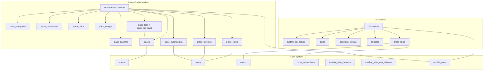
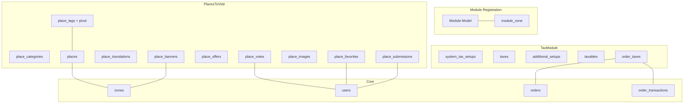
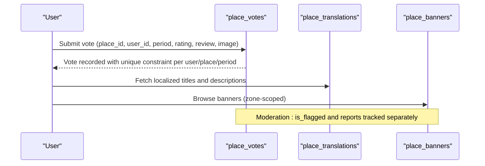
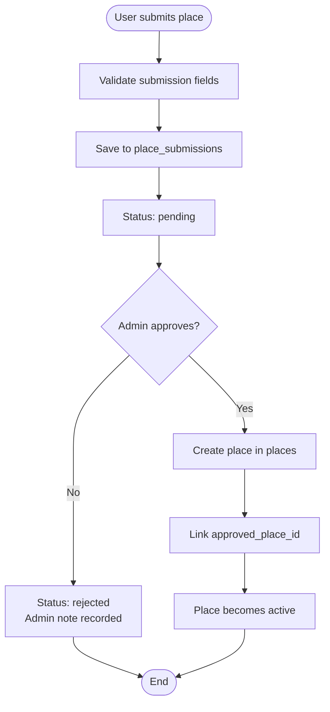
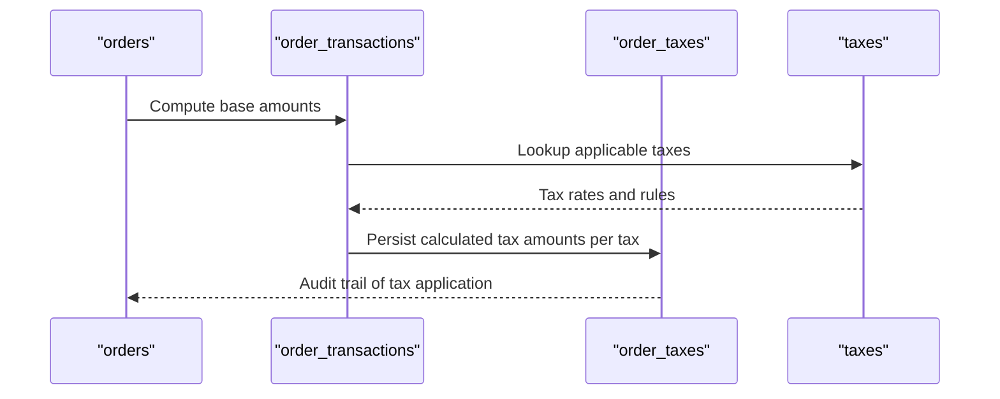
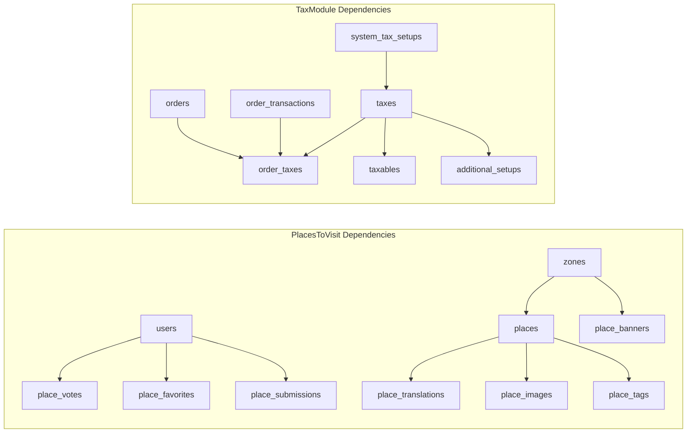

# Business Module Schemas

<cite>
**Referenced Files in This Document**
- [create_place_categories_table.php](file://Modules/PlacesToVisit/Database/Migrations/2026_01_04_000001_create_place_categories_table.php)
- [create_places_table.php](file://Modules/PlacesToVisit/Database/Migrations/2026_01_04_000002_create_places_table.php)
- [create_place_translations_table.php](file://Modules/PlacesToVisit/Database/Migrations/2026_01_04_000003_create_place_translations_table.php)
- [create_place_votes_table.php](file://Modules/PlacesToVisit/Database/Migrations/2026_01_04_000004_create_place_votes_table.php)
- [create_place_offers_table.php](file://Modules/PlacesToVisit/Database/Migrations/2026_01_04_000005_create_place_offers_table.php)
- [create_place_banners_table.php](file://Modules/PlacesToVisit/Database/Migrations/2026_01_04_000006_create_place_banners_table.php)
- [add_details_to_places_table.php](file://Modules/PlacesToVisit/Database/Migrations/2026_02_10_000001_add_details_to_places_table.php)
- [create_place_images_table.php](file://Modules/PlacesToVisit/Database/Migrations/2026_02_10_000002_create_place_images_table.php)
- [create_place_favorites_table.php](file://Modules/PlacesToVisit/Database/Migrations/2026_02_10_000003_create_place_favorites_table.php)
- [create_place_submissions_table.php](file://Modules/PlacesToVisit/Database/Migrations/2026_02_10_000004_create_place_submissions_table.php)
- [create_place_tags_tables.php](file://Modules/PlacesToVisit/Database/Migrations/2026_02_10_000005_create_place_tags_tables.php)
- [create_place_vote_reports_table.php](file://Modules/PlacesToVisit/Database/Migrations/2026_02_10_000006_create_place_vote_reports_table.php)
- [add_name_ar_to_place_categories_table.php](file://Modules/PlacesToVisit/Database/Migrations/2026_02_10_000007_add_name_ar_to_place_categories_table.php)
- [add_image_to_place_votes_table.php](file://Modules/PlacesToVisit/Database/Migrations/2026_02_10_000008_add_image_to_place_votes_table.php)
- [add_zone_id_to_places_table.php](file://Modules/PlacesToVisit/Database/Migrations/2026_04_02_000001_add_zone_id_to_places_table.php)
- [insert_places_module.sql](file://Modules/PlacesToVisit/Database/insert_places_module.sql)
- [module.json](file://Modules/PlacesToVisit/module.json)
- [config.php](file://Modules/PlacesToVisit/Config/config.php)
- [create_system_tax_setups_table.php](file://Modules/TaxModule/Database/Migrations/2026_01_04_000001_create_system_tax_setups_table.php)
- [create_taxes_table.php](file://Modules/TaxModule/Database/Migrations/2026_01_04_000002_create_taxes_table.php)
- [create_additional_setups_table.php](file://Modules/TaxModule/Database/Migrations/2026_01_04_000003_create_additional_setups_table.php)
- [create_taxables_table.php](file://Modules/TaxModule/Database/Migrations/2026_01_04_000004_create_taxables_table.php)
- [create_order_taxes_table.php](file://Modules/TaxModule/Database/Migrations/2026_01_04_000005_create_order_taxes_table.php)
- [module.json](file://Modules/TaxModule/module.json)
- [config.php](file://Modules/TaxModule/Config/config.php)
- [module.json](file://app/Models/Module.php)
- [module_zone.php](file://database/migrations/2022_10_20_105054_module_zone.php)
- [zones_table.php](file://database/migrations/2023_01_07_115354_add_prescription_order_to_stores_table.php)
- [orders_table.php](file://database/migrations/2023_01_23_144828_add_tax_status_column_to_orders_table.php)
- [order_transactions_table.php](file://database/migrations/2023_07_05_145800_add_service_charge_col_to_order_transactions_table.php)
- [module_wise_banners_table.php](file://database/migrations/2023_08_28_114316_create_module_wise_banners_table.php)
- [module_wise_why_chooses_table.php](file://database/migrations/2023_08_28_134428_create_module_wise_why_chooses_table.php)
</cite>

## Table of Contents
1. [Introduction](#introduction)
2. [Project Structure](#project-structure)
3. [Core Components](#core-components)
4. [Architecture Overview](#architecture-overview)
5. [Detailed Component Analysis](#detailed-component-analysis)
6. [Dependency Analysis](#dependency-analysis)
7. [Performance Considerations](#performance-considerations)
8. [Troubleshooting Guide](#troubleshooting-guide)
9. [Conclusion](#conclusion)

## Introduction
This document provides comprehensive data model documentation for Waddy Back's business module schemas, focusing on the PlacesToVisit and TaxModule. It details the relational structure, constraints, and business rules for each module, explains how module-specific entities integrate with core system tables, and outlines migration patterns used for installation and updates. The goal is to enable developers and stakeholders to understand module isolation, dependency management, and schema evolution strategies while maintaining data consistency across the system.

## Project Structure
The business modules are organized as Laravel modules under the Modules directory, each containing its own configuration, database migrations, entities, providers, routes, and services. The PlacesToVisit module defines place-related entities such as categories, places, translations, votes, offers, banners, images, favorites, submissions, and tags. The TaxModule defines tax-related entities including system tax setups, taxes, additional setups, taxables, and order taxes. Both modules rely on core system tables for shared entities like zones and users.

**Diagram sources**
- [create_places_table.php:11-21](file://Modules/PlacesToVisit/Database/Migrations/2026_01_04_000002_create_places_table.php#L11-L21)
- [create_place_votes_table.php:11-23](file://Modules/PlacesToVisit/Database/Migrations/2026_01_04_000004_create_place_votes_table.php#L11-L23)
- [create_place_favorites_table.php:11-18](file://Modules/PlacesToVisit/Database/Migrations/2026_02_10_000003_create_place_favorites_table.php#L11-L18)
- [create_place_submissions_table.php:11-29](file://Modules/PlacesToVisit/Database/Migrations/2026_02_10_000004_create_place_submissions_table.php#L11-L29)
- [create_place_banners_table.php:14-35](file://Modules/PlacesToVisit/Database/Migrations/2026_01_04_000006_create_place_banners_table.php#L14-L35)
- [create_place_tags_tables.php:11-26](file://Modules/PlacesToVisit/Database/Migrations/2026_02_10_000005_create_place_tags_tables.php#L11-L26)
- [create_order_taxes_table.php:11-25](file://Modules/TaxModule/Database/Migrations/2026_01_04_000005_create_order_taxes_table.php#L11-L25)
- [module_zone.php:11-25](file://database/migrations/2022_10_20_105054_module_zone.php#L11-L25)

**Section sources**
- [module.json](file://Modules/PlacesToVisit/module.json)
- [config.php](file://Modules/PlacesToVisit/Config/config.php)
- [module.json](file://Modules/TaxModule/module.json)
- [config.php](file://Modules/TaxModule/Config/config.php)

## Core Components
This section documents the PlacesToVisit module's place categories, places, translations, votes, offers, banners, images, favorites, submissions, and tags tables, along with the TaxModule's system tax setups, taxes, additional setups, taxables, and order taxes tables. It also explains relationships, constraints, and integration with core system tables.

### PlacesToVisit Module Tables

- place_categories
  - Purpose: Stores categories for places with activation flag, priority, and optional Arabic name.
  - Key attributes: id, name, name_ar, image, is_active, priority, timestamps.
  - Constraints: Unique name; default is_active true; default priority 0.
  - Section sources
    - [create_place_categories_table.php:11-18](file://Modules/PlacesToVisit/Database/Migrations/2026_01_04_000001_create_place_categories_table.php#L11-L18)
    - [add_name_ar_to_place_categories_table.php:11-13](file://Modules/PlacesToVisit/Database/Migrations/2026_02_10_000007_add_name_ar_to_place_categories_table.php#L11-L13)

- places
  - Purpose: Represents individual places with geographic coordinates, address, media, and metadata.
  - Key attributes: id, category_id, zone_id, latitude, longitude, address, phone, website, instagram, opening_hours, image, is_active, is_featured, timestamps.
  - Relationships: belongs to place_categories; optional belongs to zones; cascade delete on category deletion.
  - Constraints: Decimal precision for coordinates; optional details added via migration; foreign key to zones; unique composite constraint on category_id and zone_id enforced by application logic.
  - Section sources
    - [create_places_table.php:11-21](file://Modules/PlacesToVisit/Database/Migrations/2026_01_04_000002_create_places_table.php#L11-L21)
    - [add_details_to_places_table.php:11-16](file://Modules/PlacesToVisit/Database/Migrations/2026_02_10_000001_add_details_to_places_table.php#L11-L16)
    - [add_zone_id_to_places_table.php:11-13](file://Modules/PlacesToVisit/Database/Migrations/2026_04_02_000001_add_zone_id_to_places_table.php#L11-L13)

- place_translations
  - Purpose: Localized titles and descriptions for places.
  - Key attributes: id, place_id, locale, title, description.
  - Relationships: belongs to places; unique combination of place_id and locale.
  - Constraints: Unique locale per place.
  - Section sources
    - [create_place_translations_table.php:11-18](file://Modules/PlacesToVisit/Database/Migrations/2026_01_04_000003_create_place_translations_table.php#L11-L18)

- place_votes
  - Purpose: Records user ratings and reviews for places on a monthly basis.
  - Key attributes: id, place_id, user_id, period, rating, review, image, is_flagged, timestamps.
  - Relationships: belongs to places and users; unique composite of place_id, user_id, and period.
  - Constraints: Rating range 1-5; monthly period format; flagged for moderation.
  - Section sources
    - [create_place_votes_table.php:11-23](file://Modules/PlacesToVisit/Database/Migrations/2026_01_04_000004_create_place_votes_table.php#L11-L23)
    - [add_image_to_place_votes_table.php:11-13](file://Modules/PlacesToVisit/Database/Migrations/2026_02_10_000008_add_image_to_place_votes_table.php#L11-L13)

- place_offers
  - Purpose: Promotional offers associated with places.
  - Key attributes: id, place_id, title, description, image, discount_percent, start_date, end_date, is_active, timestamps.
  - Relationships: belongs to places; active flag and date range control visibility.
  - Constraints: Optional discount_percent; date range validation handled by application logic.
  - Section sources
    - [create_place_offers_table.php:11-22](file://Modules/PlacesToVisit/Database/Migrations/2026_01_04_000005_create_place_offers_table.php#L11-L22)

- place_banners
  - Purpose: Module-wide promotional banners with targeting and scheduling.
  - Key attributes: id, title, title_ar, description, description_ar, image, type, data, external_link, zone_id, priority, is_active, is_featured, start_date, end_date, timestamps.
  - Relationships: optional foreign key to zones; indexed for active status and priority; indexed for date ranges.
  - Constraints: Type enumeration; optional zone scoping; composite index for performance.
  - Section sources
    - [create_place_banners_table.php:14-35](file://Modules/PlacesToVisit/Database/Migrations/2026_01_04_000006_create_place_banners_table.php#L14-L35)

- place_images
  - Purpose: Additional images for places with ordering and primary selection.
  - Key attributes: id, place_id, image, sort_order, is_primary, timestamps.
  - Relationships: belongs to places; composite index on place_id and sort_order.
  - Constraints: Primary image flag; sort order for display.
  - Section sources
    - [create_place_images_table.php:11-20](file://Modules/PlacesToVisit/Database/Migrations/2026_02_10_000002_create_place_images_table.php#L11-L20)

- place_favorites
  - Purpose: Tracks user favorites for places.
  - Key attributes: id, user_id, place_id, timestamps.
  - Relationships: belongs to users and places; unique composite of user_id and place_id.
  - Constraints: Uniqueness ensures one favorite per user-place pair.
  - Section sources
    - [create_place_favorites_table.php:11-18](file://Modules/PlacesToVisit/Database/Migrations/2026_02_10_000003_create_place_favorites_table.php#L11-L18)

- place_submissions
  - Purpose: User-generated place submissions with moderation workflow.
  - Key attributes: id, user_id, category_id, title, description, image, latitude, longitude, address, phone, status, admin_note, approved_place_id, timestamps.
  - Relationships: belongs to users and optionally categories; optional linkage to created place after approval.
  - Constraints: Status enumeration; indexes on status and user_id; optional approved_place_id.
  - Section sources
    - [create_place_submissions_table.php:11-29](file://Modules/PlacesToVisit/Database/Migrations/2026_02_10_000004_create_place_submissions_table.php#L11-L29)

- place_tags and place_tag_pivot
  - Purpose: Tags for categorizing places with many-to-many relationship.
  - Key attributes: place_tags (id, name, name_ar, icon, is_active); place_tag_pivot (composite primary of place_id and tag_id).
  - Relationships: pivot table linking places and tags; tags may have Arabic names and icons.
  - Constraints: Composite primary on pivot; cascading deletes.
  - Section sources
    - [create_place_tags_tables.php:11-26](file://Modules/PlacesToVisit/Database/Migrations/2026_02_10_000005_create_place_tags_tables.php#L11-L26)

- place_vote_reports
  - Purpose: Moderation reports for place votes.
  - Key attributes: id, vote_id, reporter_id, reason, timestamps.
  - Relationships: belongs to place_votes and users; unique composite of vote_id and reporter_id.
  - Constraints: Prevents duplicate reports per user per vote.
  - Section sources
    - [create_place_vote_reports_table.php:11-19](file://Modules/PlacesToVisit/Database/Migrations/2026_02_10_000006_create_place_vote_reports_table.php#L11-L19)

### TaxModule Tables

- system_tax_setups
  - Purpose: Global tax configuration settings for the system.
  - Key attributes: id, name, description, rate, is_compound, is_active, timestamps.
  - Constraints: Rate precision and compound flag; activation control.
  - Section sources
    - [create_system_tax_setups_table.php:11-25](file://Modules/TaxModule/Database/Migrations/2026_01_04_000001_create_system_tax_setups_table.php#L11-L25)

- taxes
  - Purpose: Defines tax entities applicable to items or services.
  - Key attributes: id, name, code, rate, type, is_active, timestamps.
  - Constraints: Tax code uniqueness; type enumeration; activation flag.
  - Section sources
    - [create_taxes_table.php:11-25](file://Modules/TaxModule/Database/Migrations/2026_01_04_000002_create_taxes_table.php#L11-L25)

- additional_setups
  - Purpose: Additional tax configuration parameters (e.g., thresholds, exemptions).
  - Key attributes: id, tax_id, key, value, description, timestamps.
  - Relationships: belongs to taxes; supports dynamic configuration.
  - Constraints: Key-value pairs with optional description.
  - Section sources
    - [create_additional_setups_table.php:11-25](file://Modules/TaxModule/Database/Migrations/2026_01_04_000003_create_additional_setups_table.php#L11-L25)

- taxables
  - Purpose: Association of tax entities to specific items or orders.
  - Key attributes: id, tax_id, entity_type, entity_id, is_active, timestamps.
  - Relationships: polymorphic association via entity_type and entity_id; belongs to taxes.
  - Constraints: Activation flag; composite indexing for lookup performance.
  - Section sources
    - [create_taxables_table.php:11-25](file://Modules/TaxModule/Database/Migrations/2026_01_04_000004_create_taxables_table.php#L11-L25)

- order_taxes
  - Purpose: Records tax calculations applied to orders.
  - Key attributes: id, order_id, tax_id, taxable_amount, tax_amount, calculated_at, timestamps.
  - Relationships: belongs to orders and taxes; stores computed tax amounts.
  - Constraints: Precision for amounts; timestamp for auditability.
  - Section sources
    - [create_order_taxes_table.php:11-25](file://Modules/TaxModule/Database/Migrations/2026_01_04_000005_create_order_taxes_table.php#L11-L25)

### Integration with Core System Tables
- Zones: Places and banners can be scoped to zones via foreign keys, enabling localized content and targeting.
  - Section sources
    - [create_places_table.php:13](file://Modules/PlacesToVisit/Database/Migrations/2026_01_04_000002_create_places_table.php#L13)
    - [add_zone_id_to_places_table.php:12](file://Modules/PlacesToVisit/Database/Migrations/2026_04_02_000001_add_zone_id_to_places_table.php#L12)
    - [create_place_banners_table.php:32](file://Modules/PlacesToVisit/Database/Migrations/2026_01_04_000006_create_place_banners_table.php#L32)

- Users: Votes, favorites, and submissions reference users for ownership and moderation.
  - Section sources
    - [create_place_votes_table.php:13-14](file://Modules/PlacesToVisit/Database/Migrations/2026_01_04_000004_create_place_votes_table.php#L13-L14)
    - [create_place_favorites_table.php:13-14](file://Modules/PlacesToVisit/Database/Migrations/2026_02_10_000003_create_place_favorites_table.php#L13-L14)
    - [create_place_submissions_table.php:13-14](file://Modules/PlacesToVisit/Database/Migrations/2026_02_10_000004_create_place_submissions_table.php#L13-L14)

- Orders and Order Transactions: TaxModule integrates with core order tables to compute and record tax amounts.
  - Section sources
    - [create_order_taxes_table.php:13-14](file://Modules/TaxModule/Database/Migrations/2026_01_04_000005_create_order_taxes_table.php#L13-L14)
    - [orders_table.php:11-25](file://database/migrations/2023_01_23_144828_add_tax_status_column_to_orders_table.php#L11-L25)
    - [order_transactions_table.php:11-25](file://database/migrations/2023_07_05_145800_add_service_charge_col_to_order_transactions_table.php#L11-L25)

- Module-wise Banners and Why Choose Sections: Module-specific promotional content can be integrated with module-wise banner and feature tables.
  - Section sources
    - [module_wise_banners_table.php:11-25](file://database/migrations/2023_08_28_114316_create_module_wise_banners_table.php#L11-L25)
    - [module_wise_why_chooses_table.php:11-25](file://database/migrations/2023_08_28_134428_create_module_wise_why_chooses_table.php#L11-L25)

**Section sources**
- [module_zone.php:11-25](file://database/migrations/2022_10_20_105054_module_zone.php#L11-L25)
- [module.json](file://app/Models/Module.php)

## Architecture Overview
The PlacesToVisit and TaxModule schemas are designed as isolated domains with explicit relationships to core system tables. The module architecture follows Laravel conventions with migrations, models, and service layers. Module registration and configuration are managed via module.json and config.php files. The module_zone table enables cross-module zone scoping, ensuring consistent localization and targeting.

**Diagram sources**
- [module_zone.php:11-25](file://database/migrations/2022_10_20_105054_module_zone.php#L11-L25)
- [module.json](file://app/Models/Module.php)
- [create_places_table.php:13](file://Modules/PlacesToVisit/Database/Migrations/2026_01_04_000002_create_places_table.php#L13)
- [create_place_banners_table.php:32](file://Modules/PlacesToVisit/Database/Migrations/2026_01_04_000006_create_place_banners_table.php#L32)
- [create_place_votes_table.php:13-14](file://Modules/PlacesToVisit/Database/Migrations/2026_01_04_000004_create_place_votes_table.php#L13-L14)
- [create_place_favorites_table.php:13-14](file://Modules/PlacesToVisit/Database/Migrations/2026_02_10_000003_create_place_favorites_table.php#L13-L14)
- [create_place_submissions_table.php:13-14](file://Modules/PlacesToVisit/Database/Migrations/2026_02_10_000004_create_place_submissions_table.php#L13-L14)
- [create_order_taxes_table.php:13-14](file://Modules/TaxModule/Database/Migrations/2026_01_04_000005_create_order_taxes_table.php#L13-L14)

## Detailed Component Analysis

### PlacesToVisit: Voting Workflow
This sequence illustrates how a user submits a monthly vote for a place, including optional review and image upload, and how moderation works.

**Diagram sources**
- [create_place_votes_table.php:11-23](file://Modules/PlacesToVisit/Database/Migrations/2026_01_04_000004_create_place_votes_table.php#L11-L23)
- [create_place_translations_table.php:11-18](file://Modules/PlacesToVisit/Database/Migrations/2026_01_04_000003_create_place_translations_table.php#L11-L18)
- [create_place_banners_table.php:14-35](file://Modules/PlacesToVisit/Database/Migrations/2026_01_04_000006_create_place_banners_table.php#L14-L35)

### PlacesToVisit: Submission and Approval Lifecycle
This flow shows how user-submitted places are processed through moderation.

**Diagram sources**
- [create_place_submissions_table.php:11-29](file://Modules/PlacesToVisit/Database/Migrations/2026_02_10_000004_create_place_submissions_table.php#L11-L29)
- [create_places_table.php:11-21](file://Modules/PlacesToVisit/Database/Migrations/2026_01_04_000002_create_places_table.php#L11-L21)

### TaxModule: Order Tax Calculation
This sequence demonstrates how tax amounts are computed and stored against orders.

**Diagram sources**
- [create_order_taxes_table.php:11-25](file://Modules/TaxModule/Database/Migrations/2026_01_04_000005_create_order_taxes_table.php#L11-L25)
- [orders_table.php:11-25](file://database/migrations/2023_01_23_144828_add_tax_status_column_to_orders_table.php#L11-L25)
- [order_transactions_table.php:11-25](file://database/migrations/2023_07_05_145800_add_service_charge_col_to_order_transactions_table.php#L11-L25)

## Dependency Analysis
The module schemas exhibit clear separation of concerns:
- PlacesToVisit depends on zones for localization and users for ownership/moderation.
- TaxModule depends on orders and order_transactions for computation and persistence.
- Both modules leverage module_zone for cross-module scoping and integration with core system tables.

**Diagram sources**
- [create_places_table.php:13](file://Modules/PlacesToVisit/Database/Migrations/2026_01_04_000002_create_places_table.php#L13)
- [create_place_banners_table.php:32](file://Modules/PlacesToVisit/Database/Migrations/2026_01_04_000006_create_place_banners_table.php#L32)
- [create_place_votes_table.php:13-14](file://Modules/PlacesToVisit/Database/Migrations/2026_01_04_000004_create_place_votes_table.php#L13-L14)
- [create_place_favorites_table.php:13-14](file://Modules/PlacesToVisit/Database/Migrations/2026_02_10_000003_create_place_favorites_table.php#L13-L14)
- [create_place_submissions_table.php:13-14](file://Modules/PlacesToVisit/Database/Migrations/2026_02_10_000004_create_place_submissions_table.php#L13-L14)
- [create_order_taxes_table.php:13-14](file://Modules/TaxModule/Database/Migrations/2026_01_04_000005_create_order_taxes_table.php#L13-L14)

**Section sources**
- [module_zone.php:11-25](file://database/migrations/2022_10_20_105054_module_zone.php#L11-L25)

## Performance Considerations
- Indexes: Strategic indexing on frequently queried columns improves query performance. Examples include:
  - place_votes: unique composite on (place_id, user_id, period) to prevent duplicates and support fast lookups.
  - place_banners: composite index on (is_active, priority) and (start_date, end_date) for efficient filtering and sorting.
  - place_images: composite index on (place_id, sort_order) for ordered retrieval.
  - place_submissions: indexes on status and user_id for moderation dashboards.
- Foreign Keys: Cascading deletes ensure referential integrity when parent records are removed.
- Decimal Precision: Geographic coordinates and discount percentages use precise decimal types to avoid rounding errors.
- Zone Scoping: Foreign keys to zones enable targeted queries and reduce unnecessary scans.

[No sources needed since this section provides general guidance]

## Troubleshooting Guide
Common issues and resolutions:
- Duplicate votes: Ensure the unique constraint on (place_id, user_id, period) is respected; validate period formatting before insertion.
- Missing translations: Verify locale entries exist for supported languages; check place_translations uniqueness per place.
- Banner visibility: Confirm is_active flag and date range conditions; validate zone scoping.
- Submission moderation: Monitor status transitions and admin notes; ensure approved_place_id linkage after approval.
- Tax calculation discrepancies: Reconcile order_taxes against taxes and order_transactions; verify tax rule applicability.

**Section sources**
- [create_place_votes_table.php:21-22](file://Modules/PlacesToVisit/Database/Migrations/2026_01_04_000004_create_place_votes_table.php#L21-L22)
- [create_place_banners_table.php:32-35](file://Modules/PlacesToVisit/Database/Migrations/2026_01_04_000006_create_place_banners_table.php#L32-L35)
- [create_place_submissions_table.php:27-28](file://Modules/PlacesToVisit/Database/Migrations/2026_02_10_000004_create_place_submissions_table.php#L27-L28)
- [create_order_taxes_table.php:13-14](file://Modules/TaxModule/Database/Migrations/2026_01_04_000005_create_order_taxes_table.php#L13-L14)

## Conclusion
The PlacesToVisit and TaxModule schemas are designed with clear boundaries and robust relationships to core system tables. They enforce business rules through constraints and indexes, support localization and moderation workflows, and integrate seamlessly with orders and zones. Migration patterns ensure consistent installation and updates, while module_zone enables cross-module scoping. These designs promote module isolation, maintain data consistency, and provide scalable foundations for future enhancements.