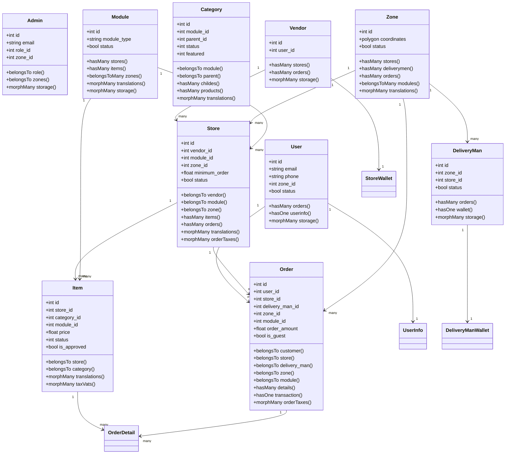
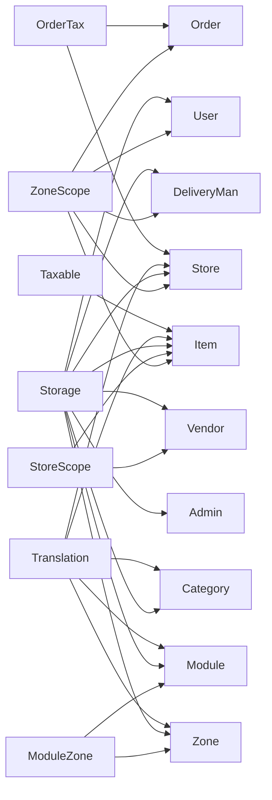
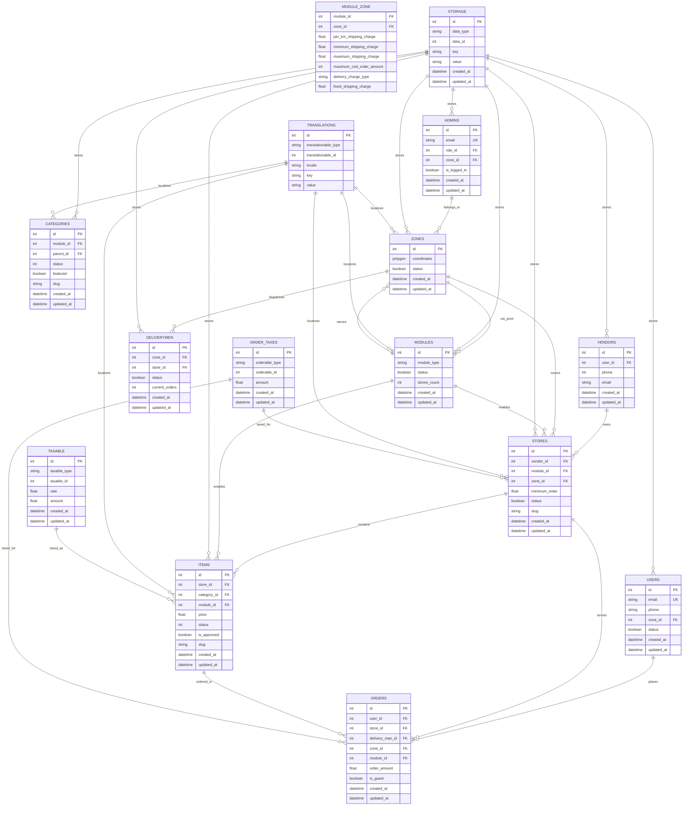

# Core Entity Models

<cite>
**Referenced Files in This Document**
- [User.php](file://app/Models/User.php)
- [Admin.php](file://app/Models/Admin.php)
- [Vendor.php](file://app/Models/Vendor.php)
- [DeliveryMan.php](file://app/Models/DeliveryMan.php)
- [Store.php](file://app/Models/Store.php)
- [Order.php](file://app/Models/Order.php)
- [Item.php](file://app/Models/Item.php)
- [Category.php](file://app/Models/Category.php)
- [Module.php](file://app/Models/Module.php)
- [Zone.php](file://app/Models/Zone.php)
- [ZoneScope.php](file://app/Scopes/ZoneScope.php)
- [StoreScope.php](file://app/Scopes/StoreScope.php)
- [OrderTax.php](file://Modules/TaxModule/Entities/OrderTax.php)
- [Taxable.php](file://Modules/TaxModule/Entities/Taxable.php)
- [OrderDetail.php](file://app/Models/OrderDetail.php)
- [OrderTransaction.php](file://app/Models/OrderTransaction.php)
- [OrderPayment.php](file://app/Models/OrderPayment.php)
- [OrderTrackingLog.php](file://app/Models/OrderTrackingLog.php)
- [OrderReference.php](file://app/Models/OrderReference.php)
- [Refund.php](file://app/Models/Refund.php)
- [Guest.php](file://app/Models/Guest.php)
- [Cart.php](file://app/Models/Cart.php)
- [Wishlist.php](file://app/Models/Wishlist.php)
- [Review.php](file://app/Models/Review.php)
- [DMReview.php](file://app/Models/DMReview.php)
- [StoreWallet.php](file://app/Models/StoreWallet.php)
- [DeliveryManWallet.php](file://app/Models/DeliveryManWallet.php)
- [WithdrawRequest.php](file://app/Models/WithdrawRequest.php)
- [DisbursementWithdrawalMethod.php](file://app/Models/DisbursementWithdrawalMethod.php)
- [StoreSchedule.php](file://app/Models/StoreSchedule.php)
- [Discount.php](file://app/Models/Discount.php)
- [Coupon.php](file://app/Models/Coupon.php)
- [FlashSaleItem.php](file://app/Models/FlashSaleItem.php)
- [TempProduct.php](file://app/Models/TempProduct.php)
- [Translation.php](file://app/Models/Translation.php)
- [Storage.php](file://app/Models/Storage.php)
- [StoreConfig.php](file://app/Models/StoreConfig.php)
- [StoreSubscription.php](file://app/Models/StoreSubscription.php)
- [SubscriptionPackage.php](file://app/Models/SubscriptionPackage.php)
- [SubscriptionTransaction.php](file://app/Models/SubscriptionTransaction.php)
- [SurgePrice.php](file://app/Models/SurgePrice.php)
- [ModuleZone.php](file://app/Models/ModuleZone.php)
- [CustomerAddress.php](file://app/Models/CustomerAddress.php)
- [UserInfo.php](file://app/Models/UserInfo.php)
- [StoreBundle.php](file://app/Models/StoreBundle.php)
- [StoreBundleItem.php](file://app/Models/StoreBundleItem.php)
- [StoreScope.php](file://app/Scopes/StoreScope.php)
- [ZoneScope.php](file://app/Scopes/ZoneScope.php)
</cite>

## Table of Contents
1. [Introduction](#introduction)
2. [Project Structure](#project-structure)
3. [Core Components](#core-components)
4. [Architecture Overview](#architecture-overview)
5. [Detailed Component Analysis](#detailed-component-analysis)
6. [Dependency Analysis](#dependency-analysis)
7. [Performance Considerations](#performance-considerations)
8. [Troubleshooting Guide](#troubleshooting-guide)
9. [Conclusion](#conclusion)
10. [Appendices](#appendices)

## Introduction
This document provides comprehensive data model documentation for Waddy Back’s core business entities: User, Admin, Vendor, DeliveryMan, Store, Order, Item, Category, Module, and Zone. It covers field definitions, data types, validation rules, primary and foreign keys, indexes, business rules enforced via relationships, and Eloquent ORM usage patterns. It also includes entity relationship diagrams, performance considerations, and query optimization strategies grounded in the repository’s models and scopes.

## Project Structure
The core models reside under app/Models and are complemented by scopes (app/Scopes), tax-related entities in Modules/TaxModule/Entities, and supporting models for orders, items, stores, and zones. Relationships leverage Eloquent morph relations for images and translations, global scopes for zone and store filtering, and pivot tables for module-zone configurations.

```mermaid
graph TB
subgraph "Core Models"
U["User"]
A["Admin"]
V["Vendor"]
DM["DeliveryMan"]
ST["Store"]
O["Order"]
I["Item"]
C["Category"]
M["Module"]
Z["Zone"]
end
subgraph "Supporting Models"
OD["OrderDetail"]
OT["OrderTransaction"]
OP["OrderPayment"]
RT["OrderTrackingLog"]
RF["Refund"]
G["Guest"]
CA["Cart"]
WL["Wishlist"]
R["Review"]
DMR["DMReview"]
SW["StoreWallet"]
DMW["DeliveryManWallet"]
WR["WithdrawRequest"]
DW["DisbursementWithdrawalMethod"]
SS["StoreSchedule"]
DC["Discount"]
CP["Coupon"]
FSI["FlashSaleItem"]
TP["TempProduct"]
TR["Translation"]
STG["Storage"]
SC["StoreConfig"]
SUB["StoreSubscription"]
SP["SubscriptionPackage"]
SPT["SubscriptionTransaction"]
SURGE["SurgePrice"]
MZ["ModuleZone"]
end
U -- "hasMany" --> O
U -- "hasMany" --> G
U -- "hasOne" --> UserInfo
A -- "belongsTo" --> Z
V -- "hasMany" --> ST
V -- "hasOne" --> UserInfo
DM -- "hasMany" --> O
DM -- "hasMany" --> DMR
DM -- "belongsTo" --> Z
ST -- "belongsTo" --> V
ST -- "belongsTo" --> M
ST -- "belongsTo" --> Z
ST -- "hasMany" --> I
ST -- "hasMany" --> O
ST -- "hasMany" --> SS
ST -- "hasOne" --> SC
ST -- "hasOne" --> SW
ST -- "hasMany" --> SUB
ST -- "hasMany" --> SURGE
O -- "belongsTo" --> U
O -- "belongsTo" --> DM
O -- "belongsTo" --> ST
O -- "belongsTo" --> Z
O -- "belongsTo" --> M
O -- "hasMany" --> OD
O -- "hasOne" --> OT
O -- "hasMany" --> OP
O -- "hasOne" --> RF
O -- "hasOne" --> RT
O -- "hasOne" --> OR["OrderReference"]
I -- "belongsTo" --> ST
I -- "belongsTo" --> C
I -- "hasMany" --> OD
I -- "hasMany" --> R
I -- "belongsToMany" --> T["Tag"]
I -- "belongsToMany" --> AL["Allergy"]
I -- "belongsToMany" --> GN["GenericName"]
I -- "belongsToMany" --> N["Nutrition"]
C -- "hasMany" --> I
M -- "hasMany" --> ST
M -- "belongsToMany" --> Z
Z -- "hasMany" --> ST
Z -- "hasMany" --> DM
Z -- "hasMany" --> O
Z -- "hasMany" --> SURGE
Z -- "belongsToMany" --> M
```

**Diagram sources**
- [User.php:103-120](file://app/Models/User.php#L103-L120)
- [Admin.php:67-78](file://app/Models/Admin.php#L67-L78)
- [Vendor.php:89-104](file://app/Models/Vendor.php#L89-L104)
- [DeliveryMan.php:64-122](file://app/Models/DeliveryMan.php#L64-L122)
- [Store.php:392-403](file://app/Models/Store.php#L392-L403)
- [Order.php:128-161](file://app/Models/Order.php#L128-L161)
- [Item.php:247-269](file://app/Models/Item.php#L247-L269)
- [Category.php:75-103](file://app/Models/Category.php#L75-L103)
- [Module.php:70-81](file://app/Models/Module.php#L70-L81)
- [Zone.php:104-122](file://app/Models/Zone.php#L104-L122)

**Section sources**
- [User.php:19-279](file://app/Models/User.php#L19-L279)
- [Admin.php:31-149](file://app/Models/Admin.php#L31-L149)
- [Vendor.php:14-146](file://app/Models/Vendor.php#L14-L146)
- [DeliveryMan.php:13-234](file://app/Models/DeliveryMan.php#L13-L234)
- [Store.php:86-934](file://app/Models/Store.php#L86-L934)
- [Order.php:13-358](file://app/Models/Order.php#L13-L358)
- [Item.php:17-404](file://app/Models/Item.php#L17-L404)
- [Category.php:32-192](file://app/Models/Category.php#L32-L192)
- [Module.php:32-240](file://app/Models/Module.php#L32-L240)
- [Zone.php:37-160](file://app/Models/Zone.php#L37-L160)

## Core Components

### User
- Purpose: Registered customer with profile, addresses, orders, XP, and image storage.
- Primary key: id (auto-increment).
- Fields and types (selected):
  - f_name, l_name (strings), email (unique), phone (string), password (hashed), image (string), zone_id (integer), ref_code, ref_by (integer), cm_firebase_token (string), interest (JSON/array), is_phone_verified, is_email_verified (booleans), login_medium (string), status (boolean), hide_phone (boolean), is_from_pos (boolean), created_at, updated_at (datetime), order_count (integer), wallet_balance (float), loyalty_point (integer), total_xp, level (integers), last_active_at (datetime).
- Validation rules:
  - Email uniqueness enforced by database schema; phone uniqueness enforced by database schema.
  - Status and verification flags validated via business logic.
- Relationships:
  - One-to-many: orders (excluding guest orders), trips.
  - One-to-one: userinfo.
  - One-to-many: addresses (via CustomerAddress).
  - Polymorphic: storage (morphMany).
- Scopes:
  - OfStatus(status), Zone(zone_id).
- Indexes and performance:
  - zone_id indexed via ZoneScope.
  - Global scope eager-loads storage and translations.
- Business rules:
  - Orders filtered by is_guest = 0.
  - Image updates synchronized to storages table.

**Section sources**
- [User.php:29-78](file://app/Models/User.php#L29-L78)
- [User.php:103-120](file://app/Models/User.php#L103-L120)
- [User.php:127-130](file://app/Models/User.php#L127-L130)
- [ZoneScope.php](file://app/Scopes/ZoneScope.php)
- [CustomerAddress.php](file://app/Models/CustomerAddress.php)
- [UserInfo.php](file://app/Models/UserInfo.php)

### Admin
- Purpose: Backend administrator with role and zone association.
- Primary key: id.
- Fields and types:
  - f_name, l_name, phone, email (unique), image, password, remember_token, login_remember_token (string), role_id (integer), zone_id (integer), is_logged_in (boolean), created_at, updated_at (datetime).
- Relationships:
  - BelongsTo: role (AdminRole), zone (Zone).
  - Polymorphic: storage (morphMany).
- Scopes:
  - Zone scope filters by authenticated admin’s zone_id.
- Indexes and performance:
  - Global scope eager-loads storage.

**Section sources**
- [Admin.php:40-61](file://app/Models/Admin.php#L40-L61)
- [Admin.php:67-78](file://app/Models/Admin.php#L67-L78)
- [Admin.php:110-117](file://app/Models/Admin.php#L110-L117)

### Vendor
- Purpose: Supplier/owner of stores; tracks earnings and orders across stores.
- Primary key: id.
- Fields and types:
  - Standard timestamps; various hidden fields including auth_token and remember_token.
- Relationships:
  - One-to-many: order_transaction, stores, withdrawrequests, orders (through Store), todays_orders, this_week_orders, this_month_orders.
  - One-to-one: wallet (StoreWallet), store (one store), userinfo.
  - Polymorphic: storage (morphMany).
- Scopes:
  - OfStatus(status).
- Earnings aggregations:
  - Daily/weekly/monthly earnings via OrderTransaction with date boundaries.

**Section sources**
- [Vendor.php:18-30](file://app/Models/Vendor.php#L18-L30)
- [Vendor.php:49-104](file://app/Models/Vendor.php#L49-L104)

### DeliveryMan
- Purpose: Rider managing orders, ratings, and wallet.
- Primary key: id.
- Fields and types:
  - zone_id (integer), status (boolean), active, available, earning (float), store_id (integer), current_orders (integer), vehicle_id (integer), identity_image (JSON/array), created_at, updated_at (datetime).
- Relationships:
  - One-to-many: orders, order_transaction, delivery_history, reviews (DMReview), withdrawals (DisbursementWithdrawalMethod), trips.
  - One-to-one: wallet (DeliveryManWallet), vehicle (DMVehicle).
  - BelongsTo: zone (Zone).
  - Polymorphic: storage (morphMany).
- Scopes:
  - Active, InActive, Earning, Available, Unavailable, Zonewise.
- Ratings:
  - Aggregated average and count via grouped query.

**Section sources**
- [DeliveryMan.php:17-32](file://app/Models/DeliveryMan.php#L17-L32)
- [DeliveryMan.php:64-134](file://app/Models/DeliveryMan.php#L64-L134)
- [DeliveryMan.php:136-163](file://app/Models/DeliveryMan.php#L136-L163)

### Store
- Purpose: Business entity offering items, subscriptions, and operational settings.
- Primary key: id.
- Fields and types (selected):
  - name, phone, email, logo, latitude, longitude, address, footer_text, minimum_order (float), comission (float), schedule_order (boolean), status (integer), vendor_id (integer), free_delivery (boolean), rating (JSON), cover_photo, delivery, take_away, item_section (booleans), tax (float), zone_id (integer), reviews_section (boolean), active (boolean), off_day (string), gst (JSON/string), self_delivery_system (integer), pos_system (boolean), minimum_shipping_charge, maximum_shipping_charge, per_km_shipping_charge (float), prescription_order (boolean), slug (string), cutlery (boolean), meta_title, meta_description, meta_image, announcement (boolean), announcement_message, comment (string), tin, tin_expire_date, tin_certificate_image.
- Relationships:
  - BelongsTo: vendor (Vendor), module (Module), zone (Zone).
  - One-to-many: items, orders, schedules, deliverymen, coupons, campaigns, itemCampaigns, reviews (through Item), bundles, trips, store_subs, store_all_sub_trans, store_sub_trans, disbursement_method, vehicles, vehicle_identity, vehicleDriver, storeConfig, store_wallet.
  - BelongsToMany: campaigns (pivot).
  - MorphMany: translations, orderTaxes.
- Scopes:
  - Module(module_id), WithModuleType(moduleType), Delivery, Takeaway, Active, Featured, Opened, Weekday, Type(type), Halal(type), StoreModel(type), WithoutModule(moduleType).
- Indexes and performance:
  - Global scopes: ZoneScope, translated locale scope, storage eager-load.
  - Slug generation on saved.
- Business rules:
  - Active scope considers commission vs subscription validity.
  - Subscription expiry disables features and updates status.

**Section sources**
- [Store.php:94-188](file://app/Models/Store.php#L94-L188)
- [Store.php:392-403](file://app/Models/Store.php#L392-L403)
- [Store.php:641-671](file://app/Models/Store.php#L641-L671)
- [Store.php:824-869](file://app/Models/Store.php#L824-L869)

### Order
- Purpose: Customer order record with items, payments, delivery, and tax.
- Primary key: id.
- Fields and types (selected):
  - order_amount, coupon_discount_amount, total_tax_amount, store_discount_amount, flash_admin_discount_amount, flash_store_discount_amount, delivery_address_id, delivery_man_id, delivery_charge, additional_charge, original_delivery_charge (floats), user_id, zone_id, scheduled (integer), store_id, module_id, dm_vehicle_id (integers), processing_time (integer), created_at, updated_at (datetime), extra_packaging_amount (float), receiver_details (array), dm_tips (float), distance (float), tax_percentage (float), prescription_order, cutlery (booleans), is_guest (boolean), ref_bonus_amount (float), sub_status_updated_at (datetime), estimated_delivery_at (datetime), order_timestamp (integer), order_attachment, order_proof, voice_instruction (JSON/array).
- Relationships:
  - BelongsTo: customer (User), delivery_man (DeliveryMan), store (Store), zone (Zone), module (Module), coupon (Coupon), parcel_category (ParcelCategory).
  - One-to-many: details (OrderDetail), payments (OrderPayment), delivery_history (DeliveryHistory), tracking_logs (OrderTrackingLog), refunds (Refund), order_reference (OrderReference).
  - One-to-one: transaction (OrderTransaction), offline_payments (OfflinePayments), cashback_history (CashBackHistory).
  - Polymorphic: orderTaxes (morphMany).
- Scopes:
  - AccepteByDeliveryman, Preparing, Module, Ongoing, ItemOnTheWay, Pending, Failed, Canceled, Delivered, NotRefunded, Refunded, Refund_requested, Refund_request_canceled, SearchingForDeliveryman, Delivery, Scheduled, OrderScheduledIn(interval), StoreOrder, DmOrder, ParcelOrder, Pos, Notpos, NotDigitalOrder.
- Indexes and performance:
  - Global scopes: ZoneScope, storage eager-load.

**Section sources**
- [Order.php:17-51](file://app/Models/Order.php#L17-L51)
- [Order.php:128-191](file://app/Models/Order.php#L128-L191)
- [Order.php:206-331](file://app/Models/Order.php#L206-L331)

### Item
- Purpose: Product offered by stores; supports translations, discounts, tags, and nutrition.
- Primary key: id.
- Fields and types (selected):
  - tax (float), price (float), status (integer), discount (float), avg_rating (float), set_menu (integer), category_id (integer), store_id (integer), reviews_count (integer), recommended (integer), maximum_cart_quantity (integer), organic (integer), created_at, updated_at (datetime), veg (integer), images (array), module_id (integer), is_approved (integer), stock (integer), min_price, max_price (floats), order_count (integer), rating_count (integer), unit_id (integer), is_halal, is_gifted (integers), is_ramadan_featured (integer), gift_expiry_date (date).
- Relationships:
  - BelongsTo: store (Store), category (Category), unit (Unit).
  - One-to-many: reviews (Review), orders (OrderDetail), carts (Cart), whislists (Wishlist), flashSaleItems (FlashSaleItem), pharmacy_item_details (PharmacyItemDetails), ecommerce_item_details (EcommerceItemDetails).
  - BelongsToMany: tags, allergies, generic (GenericName), nutritions (Nutrition).
  - MorphMany: translations, taxVats (morphMany).
  - One-to-one: temp_product (TempProduct).
- Scopes:
  - Recommended, Discounted, Module, Active, Popular, Approved, Type(type), Available(time), UnAvailable(time).
- Indexes and performance:
  - Global scopes: StoreScope (vendor context), ZoneScope, storage eager-load, translated locale scope.
  - Slug generation on saved.

**Section sources**
- [Item.php:22-51](file://app/Models/Item.php#L22-L51)
- [Item.php:247-269](file://app/Models/Item.php#L247-L269)
- [Item.php:55-131](file://app/Models/Item.php#L55-L131)
- [Item.php:271-287](file://app/Models/Item.php#L271-L287)

### Category
- Purpose: Product categorization with hierarchical support and translations.
- Primary key: id.
- Fields and types:
  - parent_id (integer), position (integer), priority (integer), status (integer), featured (integer), module_id (integer), products_count, childes_count (integers).
- Relationships:
  - BelongsTo: module (Module), parent (Category).
  - One-to-many: childes (Category), products (Item).
  - MorphMany: translations.
  - Polymorphic: storage (morphMany).
- Scopes:
  - Module, Active, Featured.
- Indexes and performance:
  - Global scopes: storage eager-load, translated locale scope.
  - Slug generation on saved.

**Section sources**
- [Category.php:53-62](file://app/Models/Category.php#L53-L62)
- [Category.php:100-103](file://app/Models/Category.php#L100-L103)
- [Category.php:175-186](file://app/Models/Category.php#L175-L186)

### Module
- Purpose: Business module type (e.g., food, parcel, rental) with translation and icon/thumbnail.
- Primary key: id.
- Fields and types:
  - module_name, module_type (string), thumbnail, icon, description (string), status (boolean), stores_count (integer), theme_id (integer), all_zone_service (boolean).
- Relationships:
  - One-to-many: stores, items.
  - MorphMany: translations.
  - BelongsToMany: zones (with pivot ModuleZone).
  - Polymorphic: storage (morphMany).
- Scopes:
  - Parcel, NotParcel, NotRental, Active.
- Indexes and performance:
  - Global scopes: storage eager-load, translated locale scope.
  - Icon/thumbnail storage sync on saved.

**Section sources**
- [Module.php:57-63](file://app/Models/Module.php#L57-L63)
- [Module.php:201-204](file://app/Models/Module.php#L201-L204)
- [Module.php:186-196](file://app/Models/Module.php#L186-L196)

### Zone
- Purpose: Geographic service area with spatial coordinates and payment/delivery settings.
- Primary key: id.
- Fields and types:
  - name, display_name, coordinates (Polygon), status (integer), store_wise_topic, customer_wise_topic, deliveryman_wise_topic (string), cash_on_delivery, digital_payment, offline_payment (booleans), increased_delivery_fee (integer), increased_delivery_fee_status (integer), increase_delivery_charge_message (string).
- Relationships:
  - One-to-many: stores, deliverymen, orders (through stores), campaigns (through stores), surge_prices.
  - BelongsToMany: modules (with pivot ModuleZone).
  - MorphMany: translations.
- Scopes:
  - Active, Contains(point).
- Indexes and performance:
  - Global scopes: ZoneScope, translated locale scope.
  - Spatial polygon casting for coordinates.

**Section sources**
- [Zone.php:65-73](file://app/Models/Zone.php#L65-L73)
- [Zone.php:104-122](file://app/Models/Zone.php#L104-L122)
- [Zone.php:139-148](file://app/Models/Zone.php#L139-L148)

## Architecture Overview
The system follows a layered Eloquent architecture:
- Models define domain entities and relationships.
- Scopes encapsulate cross-cutting concerns (zone/store filtering).
- Tax entities integrate via morph relations.
- Pivot tables (e.g., ModuleZone) manage many-to-many relationships with attributes.

**Diagram sources**
- [User.php:103-120](file://app/Models/User.php#L103-L120)
- [Vendor.php:89-104](file://app/Models/Vendor.php#L89-L104)
- [Store.php:392-403](file://app/Models/Store.php#L392-L403)
- [Order.php:128-161](file://app/Models/Order.php#L128-L161)
- [Item.php:247-269](file://app/Models/Item.php#L247-L269)
- [Category.php:75-103](file://app/Models/Category.php#L75-L103)
- [Module.php:70-81](file://app/Models/Module.php#L70-L81)
- [Zone.php:104-122](file://app/Models/Zone.php#L104-L122)

## Detailed Component Analysis

### Eloquent Relationships and Scopes
- ZoneScope and StoreScope:
  - Enforce tenant-like filtering globally on queries for Store, Item, User, Order, DeliveryMan, and Category.
- Global eager-loading:
  - Storage polymorphic relation is eagerly loaded for User, Admin, Vendor, DeliveryMan, Store, Item, Category, Module, Zone to avoid N+1 on images.
- Translations:
  - Locale-specific translation eager-loading applied on Store, Item, Category, Module, Zone.

**Section sources**
- [ZoneScope.php](file://app/Scopes/ZoneScope.php)
- [StoreScope.php](file://app/Scopes/StoreScope.php)
- [Store.php:705-714](file://app/Models/Store.php#L705-L714)
- [Item.php:277-287](file://app/Models/Item.php#L277-L287)
- [Category.php:177-186](file://app/Models/Category.php#L177-L186)
- [Module.php:188-196](file://app/Models/Module.php#L188-L196)
- [Zone.php:139-148](file://app/Models/Zone.php#L139-L148)

### Query Builders and Business Filters
- Store:
  - Active scope combines store status and subscription validity.
  - WithOpen/WithOpenWithDeliveryTime compute open status and distance using spatial functions.
- Item:
  - Discounted scope aggregates store discount and flash sale conditions.
  - Active scope ensures store and subscription eligibility.
- Order:
  - Rich set of scopes for order lifecycle (preparing, ongoing, delivered, canceled, refunded, scheduled, etc.).

**Section sources**
- [Store.php:641-671](file://app/Models/Store.php#L641-L671)
- [Store.php:680-687](file://app/Models/Store.php#L680-L687)
- [Item.php:70-91](file://app/Models/Item.php#L70-L91)
- [Item.php:104-118](file://app/Models/Item.php#L104-L118)
- [Order.php:206-331](file://app/Models/Order.php#L206-L331)

### Tax Integration
- Items and Stores participate in tax calculations via morph relations to Taxable and OrderTax entities.

**Section sources**
- [Item.php:399-402](file://app/Models/Item.php#L399-L402)
- [Store.php:928-931](file://app/Models/Store.php#L928-L931)
- [Order.php:353-356](file://app/Models/Order.php#L353-L356)
- [Taxable.php](file://Modules/TaxModule/Entities/Taxable.php)
- [OrderTax.php](file://Modules/TaxModule/Entities/OrderTax.php)

### Data Access Patterns
- One-to-many:
  - User.orders, Store.items/orders, Item.reviews/orders.
- Many-to-one:
  - Order.customer, Order.store, Order.delivery_man, Item.store/category.
- Many-to-many:
  - Item.tags/allergies/generic/nutritions, Module.zones via ModuleZone pivot.
- Polymorphic:
  - Storage polymorphic attachments for images across entities.

**Section sources**
- [User.php:103-120](file://app/Models/User.php#L103-L120)
- [Store.php:408-411](file://app/Models/Store.php#L408-L411)
- [Order.php:128-161](file://app/Models/Order.php#L128-L161)
- [Item.php:313-328](file://app/Models/Item.php#L313-L328)
- [Module.php:201-204](file://app/Models/Module.php#L201-L204)
- [Storage.php](file://app/Models/Storage.php)

### Validation Rules and Constraints
- Unique constraints:
  - Email uniqueness enforced by database schema for User and Admin.
  - Phone uniqueness enforced by database schema for User and Admin.
- Business validations:
  - Store.Active scope validates subscription status.
  - Item.Active and Item.Approved ensure product readiness.
  - Order scopes enforce lifecycle transitions and payment states.

**Section sources**
- [User.php:29-47](file://app/Models/User.php#L29-L47)
- [Admin.php:40-52](file://app/Models/Admin.php#L40-L52)
- [Store.php:641-653](file://app/Models/Store.php#L641-L653)
- [Item.php:104-126](file://app/Models/Item.php#L104-L126)

### Indexes and Query Optimization
- Global scopes:
  - ZoneScope and StoreScope reduce query blast radius and improve locality.
- Eager loading:
  - Storage and translations preloading prevents N+1 queries.
- Spatial queries:
  - Zone.Contains leverages spatial functions for proximity checks.
- Scopes as filters:
  - Predefined scopes encapsulate frequently used WHERE clauses.

**Section sources**
- [Zone.php:135-137](file://app/Models/Zone.php#L135-L137)
- [Store.php:705-714](file://app/Models/Store.php#L705-L714)
- [Item.php:277-287](file://app/Models/Item.php#L277-L287)

## Dependency Analysis

**Diagram sources**
- [ZoneScope.php](file://app/Scopes/ZoneScope.php)
- [StoreScope.php](file://app/Scopes/StoreScope.php)
- [ModuleZone.php](file://app/Models/ModuleZone.php)
- [Storage.php](file://app/Models/Storage.php)
- [Translation.php](file://app/Models/Translation.php)
- [Taxable.php](file://Modules/TaxModule/Entities/Taxable.php)
- [OrderTax.php](file://Modules/TaxModule/Entities/OrderTax.php)

**Section sources**
- [ZoneScope.php](file://app/Scopes/ZoneScope.php)
- [StoreScope.php](file://app/Scopes/StoreScope.php)
- [ModuleZone.php](file://app/Models/ModuleZone.php)
- [Storage.php](file://app/Models/Storage.php)
- [Translation.php](file://app/Models/Translation.php)
- [Taxable.php](file://Modules/TaxModule/Entities/Taxable.php)
- [OrderTax.php](file://Modules/TaxModule/Entities/OrderTax.php)

## Performance Considerations
- Prefer scopes for common filters to centralize SQL logic and reduce duplication.
- Use global scopes (ZoneScope, StoreScope) to limit dataset size early.
- Eager-load polymorphic storage and translation relations to avoid N+1.
- Leverage spatial functions judiciously; ensure appropriate indexes on geometry columns.
- Use morph relations for images to minimize duplication and simplify maintenance.

[No sources needed since this section provides general guidance]

## Troubleshooting Guide
- Missing images:
  - Verify storage records exist for the entity’s polymorphic data_type/data_id/key combination.
- Incorrect zone visibility:
  - Confirm ZoneScope is active and user/admin zone_id matches expected value.
- Store not appearing in listings:
  - Check Store.Active scope conditions (status, subscription validity).
- Order lifecycle anomalies:
  - Inspect order scopes and statuses; confirm tracking logs and payment records align.

**Section sources**
- [Storage.php](file://app/Models/Storage.php)
- [ZoneScope.php](file://app/Scopes/ZoneScope.php)
- [Store.php:641-653](file://app/Models/Store.php#L641-L653)
- [Order.php:206-331](file://app/Models/Order.php#L206-L331)

## Conclusion
Waddy Back’s core models form a cohesive, scalable domain layer with strong Eloquent relationships, global scopes for tenant isolation, and polymorphic storage for media. The documented fields, relationships, scopes, and performance strategies enable efficient querying, robust business rule enforcement, and maintainable extensions across modules.

[No sources needed since this section summarizes without analyzing specific files]

## Appendices

### Entity Relationship Diagram (ERD)

**Diagram sources**
- [User.php:29-47](file://app/Models/User.php#L29-L47)
- [Admin.php:40-52](file://app/Models/Admin.php#L40-L52)
- [Vendor.php:18-30](file://app/Models/Vendor.php#L18-L30)
- [DeliveryMan.php:17-32](file://app/Models/DeliveryMan.php#L17-L32)
- [Store.php:94-146](file://app/Models/Store.php#L94-L146)
- [Order.php:17-51](file://app/Models/Order.php#L17-L51)
- [Item.php:22-51](file://app/Models/Item.php#L22-L51)
- [Category.php:42-51](file://app/Models/Category.php#L42-L51)
- [Module.php:41-51](file://app/Models/Module.php#L41-L51)
- [Zone.php:49-63](file://app/Models/Zone.php#L49-L63)
- [ModuleZone.php](file://app/Models/ModuleZone.php)
- [Storage.php](file://app/Models/Storage.php)
- [Translation.php](file://app/Models/Translation.php)
- [Taxable.php](file://Modules/TaxModule/Entities/Taxable.php)
- [OrderTax.php](file://Modules/TaxModule/Entities/OrderTax.php)