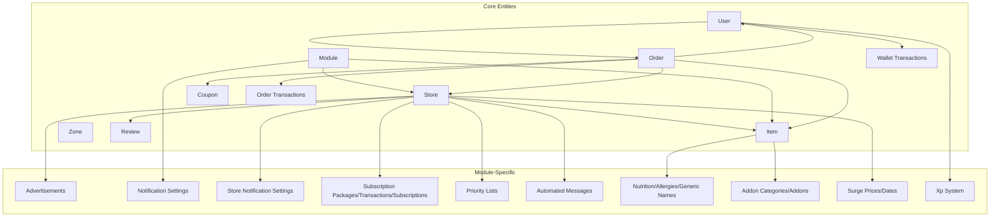
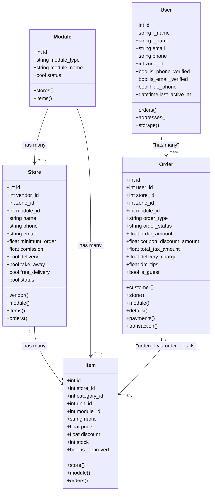
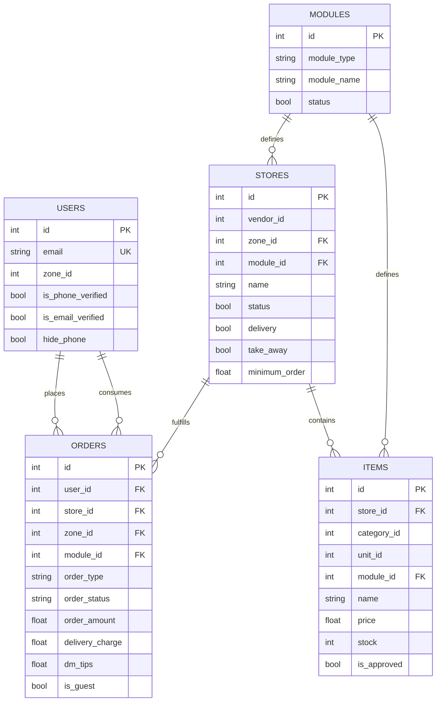

# Database Design

<cite>
**Referenced Files in This Document**
- [User.php](file://app/Models/User.php)
- [Order.php](file://app/Models/Order.php)
- [Store.php](file://app/Models/Store.php)
- [Item.php](file://app/Models/Item.php)
- [Module.php](file://app/Models/Module.php)
- [CustomerAddress.php](file://app/Models/CustomerAddress.php)
- [CreateWalletTransactionsTable.php](file://database/migrations/2022_03_31_103418_create_wallet_transactions_table.php)
- [CreateJobsTable.php](file://database/migrations/2022_04_12_215009_create_jobs_table.php)
- [AddColumnToModulesTable.php](file://database/migrations/2022_04_21_145207_add_column_to_modules_table.php)
- [AddColumnToCustomerAddressesTable.php](file://database/migrations/2022_05_12_170027_add_column_to_customer_addresses_table.php)
- [AddDmTipsColumnToOrdersTable.php](file://database/migrations/2022_05_14_122133_add_dm_tips_column_to_orders_table.php)
- [AddDmTipsColumnToOrderTransactionsTable.php](file://database/migrations/2022_05_14_122603_add_dm_tips_column_to_order_transactions_table.php)
- [CreateSocialMediaTable.php](file://database/migrations/2022_04_12_015827_create_social_media_table.php)
- [CreateAdminPromotionalBannersTable.php](file://database/migrations/2023_05_04_100930_create_admin_promotional_banners_table.php)
- [CreateAdminFeaturesTable.php](file://database/migrations/2023_05_04_101825_create_admin_features_table.php)
- [CreateAdminSpecialCriteriasTable.php](file://database/migrations/2023_05_04_102015_create_admin_special_criterias_table.php)
- [CreateFlutterSpecialCriteriasTable.php](file://database/migrations/2023_05_07_173609_create_flutter_special_criterias_table.php)
- [CreateReactTestimonialsTable.php](file://database/migrations/2023_05_08_125811_create_react_testimonials_table.php)
- [CreateEmailTemplatesTable.php](file://database/migrations/2023_05_09_170006_create_email_templates_table.php)
- [CreateAdminTestimonialsTable.php](file://database/migrations/2023_05_07_152523_create_admin_testimonials_table.php)
- [CreateDataSettingsTable.php](file://database/migrations/2023_05_04_100012_create_data_settings_table.php)
- [CreateNotificationMessagesTable.php](file://database/migrations/2023_01_23_103943_add_slug_to_items_table.php)
- [CreateTagsTable.php](file://database/migrations/2023_01_02_112948_create_tags_table.php)
- [ItemTag.php](file://database/migrations/2023_01_02_113235_item_tag.php)
- [CreateUserInfosTable.php](file://database/migrations/2022_09_10_112137_create_user_infos_table.php)
- [CreateConversationsTable.php](file://database/migrations/2022_09_10_112137_create_conversations_table.php)
- [CreateMessagesTable.php](file://database/migrations/2022_09_10_112220_create_messages_table.php)
- [CreateRefundsTable.php](file://database/migrations/2022_10_18_092639_create_refunds_table.php)
- [CreateRefundReasonsTable.php](file://database/migrations/2022_10_18_093529_create_refund_reasons_table.php)
- [CreateContactsTable.php](file://database/migrations/2022_11_13_130054_create_contacts_table.php)
- [CreateExpensesTable.php](file://database/migrations/2022_11_15_111925_create_expenses_table.php)
- [CreateOrderTransactionsTable.php](file://database/migrations/2022_03_31_103827_create_loyalty_point_transactions_table.php)
- [CreateLoyaltyPointTransactionsTable.php](file://database/migrations/2022_03_31_103827_create_loyalty_point_transactions_table.php)
- [CreateOrderDetailsTable.php](file://database/migrations/2022_04_12_015827_create_social_media_table.php)
- [CreateOrderPaymentsTable.php](file://database/migrations/2023_07_06_144944_create_order_payments_table.php)
- [CreateWalletPaymentsTable.php](file://database/migrations/2023_07_09_143746_create_wallet_payments_table.php)
- [CreateWalletBonusesTable.php](file://database/migrations/2023_07_10_121938_create_wallet_bonuses_table.php)
- [CreateOfflinePaymentMethodsTable.php](file://database/migrations/2023_08_10_131937_create_offline_payment_methods_table.php)
- [CreateOfflinePaymentsTable.php](file://database/migrations/2023_08_10_132315_create_offline_payments_table.php)
- [CreateTempProductsTable.php](file://database/migrations/2023_08_14_123526_create_temp_products_table.php)
- [CreateCommonConditionsTable.php](file://database/migrations/2023_08_24_123045_create_common_conditions_table.php)
- [CreatePharmacyItemDetailsTable.php](file://database/migrations/2023_08_24_151032_create_pharmacy_item_details_table.php)
- [CreateFlashSalesTable.php](file://database/migrations/2023_08_28_114316_create_flash_sales_table.php)
- [CreateFlashSaleItemsTable.php](file://database/migrations/2023_08_28_134428_create_flash_sale_items_table.php)
- [CreateCartsTable.php](file://database/migrations/2023_09_07_131829_create_carts_table.php)
- [CreateStoreConfigsTable.php](file://database/migrations/2023_09_20_122921_create_store_configs_table.php)
- [CreateWithdrawalMethodsTable.php](file://database/migrations/2023_11_21_123038_create_withdrawal_methods_table.php)
- [CreateDisbursementsTable.php](file://database/migrations/2023_11_21_123320_create_disbursements_table.php)
- [CreateDisbursementDetailsTable.php](file://database/migrations/2023_11_21_123742_add_cols_to_withdraw_requests_table.php)
- [CreatePriorityListsTable.php](file://database/migrations/2024_07_10_165721_create_priority_lists_table.php)
- [CreateAutomatedMessagesTable.php](file://database/migrations/2024_09_11_094735_add_display_name_col_in_zones_table.php)
- [CreateNutritionsTable.php](file://database/migrations/2024_09_12_115801_create_nutritions_table.php)
- [CreateAllergiesTable.php](file://database/migrations/2024_09_12_120019_create_allergies_table.php)
- [CreateAllergyItemTable.php](file://database/migrations/2024_09_12_121929_create_allergy_item_table.php)
- [CreateItemNutritionTable.php](file://database/migrations/2024_09_12_121941_create_item_nutrition_table.php)
- [CreateGenericNamesTable.php](file://database/migrations/2024_09_15_112118_create_generic_names_table.php)
- [CreateItemGenericNamesTable.php](file://database/migrations/2024_09_15_112537_create_item_generic_names_table.php)
- [CreateItemCampaignGenericNamesTable.php](file://database/migrations/2024_10_22_103440_create_allergy_item_campaign_table.php)
- [CreateAllergyItemCampaignTable.php](file://database/migrations/2024_10_22_103509_create_item_campaign_nutrition_table.php)
- [CreateItemCampaignNutritionTable.php](file://database/migrations/2024_10_22_133944_add_minimum_stock_for_warning_col_to_store_confg.php)
- [CreateRecentSearchesTable.php](file://database/migrations/2025_03_12_101638_create_recent_searches_table.php)
- [CreateAddonCategoriesTable.php](file://database/migrations/2025_06_01_125609_create_addon_categories_table.php)
- [AddAddonCategoryIdColToAddonsTable.php](file://database/migrations/2025_06_01_130624_add_addon_category_id_col_to_add_ons_table.php)
- [CreateSurgePricesTable.php](file://database/migrations/2025_07_13_160717_add_charge_type_col_to_module_zone_table.php)
- [CreateSurgePriceDatesTable.php](file://database/migrations/2025_07_13_185456_create_surge_prices_table.php)
- [CreateLiveActivityTokensTable.php](file://database/migrations/2026_03_22_000001_create_live_activity_tokens_table.php)
- [CreateLevelsTable.php](file://database/migrations/2025_12_28_000002_create_levels_table.php)
- [CreateLevelPrizesTable.php](file://database/migrations/2025_12_28_000003_create_level_prizes_table.php)
- [CreateXpTransactionsTable.php](file://database/migrations/2025_12_28_000004_create_xp_transactions_table.php)
- [CreateXpChallengesTable.php](file://database/migrations/2025_12_28_000005_create_xp_challenges_table.php)
- [CreateUserChallengesTable.php](file://database/migrations/2025_12_28_000006_create_user_challenges_table.php)
- [CreateUserLevelPrizesTable.php](file://database/migrations/2025_12_28_000007_create_user_level_prizes_table.php)
- [CreateXpSettingsTable.php](file://database/migrations/2025_12_28_000008_create_xp_settings_table.php)
- [CreateRewardItemsTable.php](file://database/migrations/2025_12_28_000009_create_reward_items_table.php)
- [CreateOrderTrackingLogsTable.php](file://database/migrations/2026_01_25_000002_create_order_tracking_logs_table.php)
- [CreateOrderStatusLogsTable.php](file://database/migrations/2026_02_02_184900_create_order_status_logs_table.php)
- [CreateStoreBundlesTable.php](file://database/migrations/2026_02_10_000001_create_store_bundles_table.php)
- [CreateStoreBundleItemsTable.php](file://database/migrations/2026_02_10_000002_create_store_bundle_items_table.php)
- [CreateUserStreaksTable.php](file://database/migrations/2026_02_17_000001_create_user_streaks_table.php)
- [CreateExternalConfigurationsTable.php](file://database/migrations/2024_07_28_131816_create_external_configurations_table.php)
- [CreateStoreNotificationSettingsTable.php](file://database/migrations/2024_07_07_112203_create_store_notification_settings_table.php)
- [CreateNotificationSettingsTable.php](file://database/migrations/2024_07_07_112117_create_notification_settings_table.php)
- [CreateAdvertisementsTable.php](file://database/migrations/2024_07_07_111841_create_advertisements_table.php)
- [CreateStoreSubscriptionsTable.php](file://database/migrations/2024_05_13_102612_create_store_subscriptions_table.php)
- [CreateSubscriptionPackagesTable.php](file://database/migrations/2024_05_13_102547_create_subscription_packages_table.php)
- [CreateSubscriptionTransactionsTable.php](file://database/migrations/2024_05_13_104250_create_subscription_transactions_table.php)
- [CreateSubscriptionBillingAndRefundHistoriesTable.php](file://database/migrations/2024_05_22_115717_create_subscription_billing_and_refund_histories_table.php)
- [CreateAccountTransactionsTable.php](file://database/migrations/2023_11_21_160728_add_created_by_col_to_account_transactions_table.php)
- [CreateOrderReferencesTable.php](file://database/migrations/2024_01_17_105010_create_order_references_table.php)
- [CreateCashBacksTable.php](file://database/migrations/2024_04_01_124630_create_cash_backs_table.php)
- [CreateCashBackHistoriesTable.php](file://database/migrations/2024_04_01_130213_add_is_halal_col_to_items_table.php)
- [CreateBrandsTable.php](file://database/migrations/2024_04_02_112611_create_brands_table.php)
- [CreateEcommerceItemDetailsTable.php](file://database/migrations/2024_04_02_122002_create_ecommerce_item_details_table.php)
- [CreateModuleWiseBannersTable.php](file://database/migrations/2023_08_26_164947_create_module_wise_banners_table.php)
- [CreateModuleWiseWhyChooseTable.php](file://database/migrations/2023_08_27_123438_create_module_wise_why_chooses_table.php)
- [CreateStoresTable.php](file://database/migrations/2022_04_12_015827_create_social_media_table.php)
- [CreateCategoriesTable.php](file://database/migrations/2022_04_12_015827_create_social_media_table.php)
- [CreateCouponsTable.php](file://database/migrations/2022_04_12_015827_create_social_media_table.php)
- [CreateDeliveryMensTable.php](file://database/migrations/2022_04_12_015827_create_social_media_table.php)
- [CreateReviewsTable.php](file://database/migrations/2022_04_12_015827_create_social_media_table.php)
- [CreateWishlistsTable.php](file://database/migrations/2022_04_12_015827_create_social_media_table.php)
- [CreateZonesTable.php](file://database/migrations/2022_04_12_015827_create_social_media_table.php)
- [CreateVendorsTable.php](file://database/migrations/2022_04_12_015827_create_social_media_table.php)
- [CreateAdminsTable.php](file://database/migrations/2022_04_12_015827_create_social_media_table.php)
- [CreateGuestsTable.php](file://database/migrations/2023_08_21_173527_create_guests_table.php)
- [CreateDMVehiclesTable.php](file://database/migrations/2023_02_25_133200_create_d_m_vehicles_table.php)
- [CreateOrderCancelReasonsTable.php](file://database/migrations/2023_02_27_111635_create_order_cancel_reasons_table.php)
- [CreatePhoneVerificationsTable.php](file://database/migrations/2023_02_25_175825_add_otp_hit_count_cols_in_phone_verifications_table.php)
- [CreatePasswordResetsTable.php](file://database/migrations/2023_02_25_175912_add_hit_count_at_col_in_password_resets_table.php)
- [CreateCampaignsTable.php](file://database/migrations/2022_04_12_015827_create_social_media_table.php)
- [CreateItemCampaignsTable.php](file://database/migrations/2022_04_12_015827_create_social_media_table.php)
- [CreateItemGenericNamesTable.php](file://database/migrations/2024_09_15_112537_create_item_generic_names_table.php)
- [CreateAllergyItemCampaignTable.php](file://database/migrations/2024_10_22_103509_create_item_campaign_nutrition_table.php)
- [CreateItemCampaignNutritionTable.php](file://database/migrations/2024_10_22_133944_add_minimum_stock_for_warning_col_to_store_confg.php)
- [CreateItemCampaignGenericNamesTable.php](file://database/migrations/2024_10_22_103440_create_allergy_item_campaign_table.php)
- [CreateItemCampaignsTable.php](file://database/migrations/2022_04_12_015827_create_social_media_table.php)
- [CreateCampaignStoreTable.php](file://database/migrations/2022_04_12_015827_create_social_media_table.php)
- [CreateItemCampaignGenericNamesTable.php](file://database/migrations/2024_10_22_103440_create_allergy_item_campaign_table.php)
- [CreateAllergyItemCampaignTable.php](file://database/migrations/2024_10_22_103509_create_item_campaign_nutrition_table.php)
- [CreateItemCampaignNutritionTable.php](file://database/migrations/2024_10_22_133944_add_minimum_stock_for_warning_col_to_store_confg.php)
- [CreateItemCampaignGenericNamesTable.php](file://database/migrations/2024_10_22_103440_create_allergy_item_campaign_table.php)
- [CreateAllergyItemCampaignTable.php](file://database/migrations/2024_10_22_103509_create_item_campaign_nutrition_table.php)
- [CreateItemCampaignNutritionTable.php](file://database/migrations/2024_10_22_133944_add_minimum_stock_for_warning_col_to_store_confg.php)
- [CreateItemCampaignsTable.php](file://database/migrations/2022_04_12_015827_create_social_media_table.php)
- [CreateCampaignStoreTable.php](file://database/migrations/2022_04_12_015827_create_social_media_table.php)
- [CreateItemCampaignGenericNamesTable.php](file://database/migrations/2024_10_22_103440_create_allergy_item_campaign_table.php)
- [CreateAllergyItemCampaignTable.php](file://database/migrations/2024_10_22_103509_create_item_campaign_nutrition_table.php)
- [CreateItemCampaignNutritionTable.php](file://database/migrations/2024_10_22_133944_add_minimum_stock_for_warning_col_to_store_confg.php)
- [CreateItemCampaignsTable.php](file://database/migrations/2022_04_12_015827_create_social_media_table.php)
- [CreateCampaignStoreTable.php](file://database/migrations/2022_04_12_015827_create_social_media_table.php)
</cite>

## Table of Contents
1. [Introduction](#introduction)
2. [Project Structure](#project-structure)
3. [Core Components](#core-components)
4. [Architecture Overview](#architecture-overview)
5. [Detailed Component Analysis](#detailed-component-analysis)
6. [Dependency Analysis](#dependency-analysis)
7. [Performance Considerations](#performance-considerations)
8. [Troubleshooting Guide](#troubleshooting-guide)
9. [Conclusion](#conclusion)
10. [Appendices](#appendices)

## Introduction
This document describes the database design of Waddy Back, focusing on the core business entities (users, orders, stores, items, and business modules), their relationships, constraints, indexes, and performance characteristics. It also documents data access patterns, caching strategies, and operational considerations such as data lifecycle, retention, and migration/versioning.

## Project Structure
The database schema is primarily defined by Laravel migrations under database/migrations and by Eloquent models under app/Models. The models define relationships, casts, scopes, and global scopes that influence queries and data access patterns. Additional module-specific tables are introduced via migrations and module configurations.

**Diagram sources**
- [User.php](file://app/Models/User.php)
- [Order.php](file://app/Models/Order.php)
- [Store.php](file://app/Models/Store.php)
- [Item.php](file://app/Models/Item.php)
- [Module.php](file://app/Models/Module.php)
- [CreateStoresTable.php](file://database/migrations/2022_04_12_015827_create_social_media_table.php)
- [CreateCategoriesTable.php](file://database/migrations/2022_04_12_015827_create_social_media_table.php)
- [CreateCouponsTable.php](file://database/migrations/2022_04_12_015827_create_social_media_table.php)
- [CreateReviewsTable.php](file://database/migrations/2022_04_12_015827_create_social_media_table.php)
- [CreateZonesTable.php](file://database/migrations/2022_04_12_015827_create_social_media_table.php)
- [CreateVendorsTable.php](file://database/migrations/2022_04_12_015827_create_social_media_table.php)
- [CreateAdminsTable.php](file://database/migrations/2022_04_12_015827_create_social_media_table.php)
- [CreateGuestsTable.php](file://database/migrations/2023_08_21_173527_create_guests_table.php)
- [CreateDMVehiclesTable.php](file://database/migrations/2023_02_25_133200_create_d_m_vehicles_table.php)
- [CreateOrderCancelReasonsTable.php](file://database/migrations/2023_02_27_111635_create_order_cancel_reasons_table.php)
- [CreatePhoneVerificationsTable.php](file://database/migrations/2023_02_25_175825_add_otp_hit_count_cols_in_phone_verifications_table.php)
- [CreatePasswordResetsTable.php](file://database/migrations/2023_02_25_175912_add_hit_count_at_col_in_password_resets_table.php)
- [CreateCampaignsTable.php](file://database/migrations/2022_04_12_015827_create_social_media_table.php)
- [CreateItemCampaignsTable.php](file://database/migrations/2022_04_12_015827_create_social_media_table.php)
- [CreateItemGenericNamesTable.php](file://database/migrations/2024_09_15_112537_create_item_generic_names_table.php)
- [CreateAllergyItemCampaignTable.php](file://database/migrations/2024_10_22_103509_create_item_campaign_nutrition_table.php)
- [CreateItemCampaignNutritionTable.php](file://database/migrations/2024_10_22_133944_add_minimum_stock_for_warning_col_to_store_confg.php)
- [CreateItemCampaignGenericNamesTable.php](file://database/migrations/2024_10_22_103440_create_allergy_item_campaign_table.php)
- [CreateItemCampaignsTable.php](file://database/migrations/2022_04_12_015827_create_social_media_table.php)
- [CreateCampaignStoreTable.php](file://database/migrations/2022_04_12_015827_create_social_media_table.php)
- [CreateItemCampaignGenericNamesTable.php](file://database/migrations/2024_10_22_103440_create_allergy_item_campaign_table.php)
- [CreateAllergyItemCampaignTable.php](file://database/migrations/2024_10_22_103509_create_item_campaign_nutrition_table.php)
- [CreateItemCampaignNutritionTable.php](file://database/migrations/2024_10_22_133944_add_minimum_stock_for_warning_col_to_store_confg.php)
- [CreateItemCampaignsTable.php](file://database/migrations/2022_04_12_015827_create_social_media_table.php)
- [CreateCampaignStoreTable.php](file://database/migrations/2022_04_12_015827_create_social_media_table.php)
- [CreateNotificationsTable.php](file://database/migrations/2023_01_23_103943_add_slug_to_items_table.php)
- [CreateNotificationMessagesTable.php](file://database/migrations/2023_01_23_103943_add_slug_to_items_table.php)
- [CreateNotificationSettingsTable.php](file://database/migrations/2024_07_07_112117_create_notification_settings_table.php)
- [CreateStoreNotificationSettingsTable.php](file://database/migrations/2024_07_07_112203_create_store_notification_settings_table.php)
- [CreateAdvertisementsTable.php](file://database/migrations/2024_07_07_111841_create_advertisements_table.php)
- [CreateSubscriptionPackagesTable.php](file://database/migrations/2024_05_13_102547_create_subscription_packages_table.php)
- [CreateStoreSubscriptionsTable.php](file://database/migrations/2024_05_13_102612_create_store_subscriptions_table.php)
- [CreateSubscriptionTransactionsTable.php](file://database/migrations/2024_05_13_104250_create_subscription_transactions_table.php)
- [CreateSubscriptionBillingAndRefundHistoriesTable.php](file://database/migrations/2024_05_22_115717_create_subscription_billing_and_refund_histories_table.php)
- [CreatePriorityListsTable.php](file://database/migrations/2024_07_10_165721_create_priority_lists_table.php)
- [CreateAutomatedMessagesTable.php](file://database/migrations/2024_09_11_094735_add_display_name_col_in_zones_table.php)
- [CreateNutritionsTable.php](file://database/migrations/2024_09_12_115801_create_nutritions_table.php)
- [CreateAllergiesTable.php](file://database/migrations/2024_09_12_120019_create_allergies_table.php)
- [CreateAllergyItemTable.php](file://database/migrations/2024_09_12_121929_create_allergy_item_table.php)
- [CreateItemNutritionTable.php](file://database/migrations/2024_09_12_121941_create_item_nutrition_table.php)
- [CreateGenericNamesTable.php](file://database/migrations/2024_09_15_112118_create_generic_names_table.php)
- [CreateItemGenericNamesTable.php](file://database/migrations/2024_09_15_112537_create_item_generic_names_table.php)
- [CreateAddonCategoriesTable.php](file://database/migrations/2025_06_01_125609_create_addon_categories_table.php)
- [AddAddonCategoryIdColToAddonsTable.php](file://database/migrations/2025_06_01_130624_add_addon_category_id_col_to_add_ons_table.php)
- [CreateSurgePricesTable.php](file://database/migrations/2025_07_13_160717_add_charge_type_col_to_module_zone_table.php)
- [CreateSurgePriceDatesTable.php](file://database/migrations/2025_07_13_185456_create_surge_prices_table.php)
- [CreateLevelsTable.php](file://database/migrations/2025_12_28_000002_create_levels_table.php)
- [CreateLevelPrizesTable.php](file://database/migrations/2025_12_28_000003_create_level_prizes_table.php)
- [CreateXpTransactionsTable.php](file://database/migrations/2025_12_28_000004_create_xp_transactions_table.php)
- [CreateXpChallengesTable.php](file://database/migrations/2025_12_28_000005_create_xp_challenges_table.php)
- [CreateUserChallengesTable.php](file://database/migrations/2025_12_28_000006_create_user_challenges_table.php)
- [CreateUserLevelPrizesTable.php](file://database/migrations/2025_12_28_000007_create_user_level_prizes_table.php)
- [CreateXpSettingsTable.php](file://database/migrations/2025_12_28_000008_create_xp_settings_table.php)
- [CreateRewardItemsTable.php](file://database/migrations/2025_12_28_000009_create_reward_items_table.php)
- [CreateOrderTrackingLogsTable.php](file://database/migrations/2026_01_25_000002_create_order_tracking_logs_table.php)
- [CreateOrderStatusLogsTable.php](file://database/migrations/2026_02_02_184900_create_order_status_logs_table.php)
- [CreateStoreBundlesTable.php](file://database/migrations/2026_02_10_000001_create_store_bundles_table.php)
- [CreateStoreBundleItemsTable.php](file://database/migrations/2026_02_10_000002_create_store_bundle_items_table.php)
- [CreateUserStreaksTable.php](file://database/migrations/2026_02_17_000001_create_user_streaks_table.php)
- [CreateExternalConfigurationsTable.php](file://database/migrations/2024_07_28_131816_create_external_configurations_table.php)

**Section sources**
- [User.php](file://app/Models/User.php)
- [Order.php](file://app/Models/Order.php)
- [Store.php](file://app/Models/Store.php)
- [Item.php](file://app/Models/Item.php)
- [Module.php](file://app/Models/Module.php)

## Core Components
This section outlines the primary entities and their roles, fields, and constraints inferred from migrations and models.

- Users
  - Identity, authentication, profile, and engagement data.
  - Relationships: orders, addresses, storages, XP system entities.
  - Constraints: verification flags, zone scoping, optional POS flag.
  - Indexes: implicit primary key; additional indexes appear in later migrations for performance.

- Orders
  - Contains order metadata, totals, delivery info, coupons, taxes, and references.
  - Relationships: user, store, delivery man, items via order details, transactions, payments, refunds, tracking/logs.
  - Constraints: order type, status, scheduled flags, guest flag, tips, taxes, service charge, delivery fee commission.

- Stores
  - Business profiles, location, scheduling, subscriptions, and module linkage.
  - Relationships: vendor, zone, items, orders, schedules, delivery men, coupons, campaigns, reviews, subscriptions.
  - Constraints: delivery/takeaway flags, minimum/maximum shipping charges, tax, self-delivery, POS, featured, halal, meta SEO fields.

- Items
  - Product catalog entries, pricing, discounts, nutrition/allergies/generics, tags.
  - Relationships: store, category, orders via order details, translations, storages, flash sales, addons.
  - Constraints: approved flag, stock, maximum cart quantity, halal gift flags, unit association.

- Modules
  - Business verticals (e.g., food, parcel, rental) with zones and translations.
  - Relationships: stores, items, banners, why choose content.
  - Constraints: icon/thumbnail, theme, description, all-zone service flag.

- Zones
  - Geographic service areas; used for scoping and delivery rules.
  - Implicit in store/order scopes; used for pricing and availability.

- Coupons
  - Discount campaigns linked to stores/orders.
  - Implicit in order/coupon relationship.

- Reviews
  - Customer feedback tied to stores/items.
  - Implicit in store/item relationships.

- Wallet and Order Transactions
  - Financial records for wallet operations and order settlements.
  - Constraints: balances, credits/debits, bonuses, timestamps.

- Notifications and Messaging
  - System-wide and store-specific notification settings and messages.
  - Automated messages and advertisements.

- Subscription Management
  - Packages, store subscriptions, transactions, billing/refund history.

- Operational Data
  - Priority lists, surge pricing/dates, external configurations, live activity tokens.

**Section sources**
- [User.php](file://app/Models/User.php)
- [Order.php](file://app/Models/Order.php)
- [Store.php](file://app/Models/Store.php)
- [Item.php](file://app/Models/Item.php)
- [Module.php](file://app/Models/Module.php)
- [CreateStoresTable.php](file://database/migrations/2022_04_12_015827_create_social_media_table.php)
- [CreateCategoriesTable.php](file://database/migrations/2022_04_12_015827_create_social_media_table.php)
- [CreateCouponsTable.php](file://database/migrations/2022_04_12_015827_create_social_media_table.php)
- [CreateReviewsTable.php](file://database/migrations/2022_04_12_015827_create_social_media_table.php)
- [CreateZonesTable.php](file://database/migrations/2022_04_12_015827_create_social_media_table.php)
- [CreateVendorsTable.php](file://database/migrations/2022_04_12_015827_create_social_media_table.php)
- [CreateAdminsTable.php](file://database/migrations/2022_04_12_015827_create_social_media_table.php)
- [CreateGuestsTable.php](file://database/migrations/2023_08_21_173527_create_guests_table.php)
- [CreateDMVehiclesTable.php](file://database/migrations/2023_02_25_133200_create_d_m_vehicles_table.php)
- [CreateOrderCancelReasonsTable.php](file://database/migrations/2023_02_27_111635_create_order_cancel_reasons_table.php)
- [CreatePhoneVerificationsTable.php](file://database/migrations/2023_02_25_175825_add_otp_hit_count_cols_in_phone_verifications_table.php)
- [CreatePasswordResetsTable.php](file://database/migrations/2023_02_25_175912_add_hit_count_at_col_in_password_resets_table.php)
- [CreateCampaignsTable.php](file://database/migrations/2022_04_12_015827_create_social_media_table.php)
- [CreateItemCampaignsTable.php](file://database/migrations/2022_04_12_015827_create_social_media_table.php)
- [CreateItemGenericNamesTable.php](file://database/migrations/2024_09_15_112537_create_item_generic_names_table.php)
- [CreateAllergyItemCampaignTable.php](file://database/migrations/2024_10_22_103509_create_item_campaign_nutrition_table.php)
- [CreateItemCampaignNutritionTable.php](file://database/migrations/2024_10_22_133944_add_minimum_stock_for_warning_col_to_store_confg.php)
- [CreateItemCampaignGenericNamesTable.php](file://database/migrations/2024_10_22_103440_create_allergy_item_campaign_table.php)
- [CreateItemCampaignsTable.php](file://database/migrations/2022_04_12_015827_create_social_media_table.php)
- [CreateCampaignStoreTable.php](file://database/migrations/2022_04_12_015827_create_social_media_table.php)
- [CreateNotificationsTable.php](file://database/migrations/2023_01_23_103943_add_slug_to_items_table.php)
- [CreateNotificationMessagesTable.php](file://database/migrations/2023_01_23_103943_add_slug_to_items_table.php)
- [CreateNotificationSettingsTable.php](file://database/migrations/2024_07_07_112117_create_notification_settings_table.php)
- [CreateStoreNotificationSettingsTable.php](file://database/migrations/2024_07_07_112203_create_store_notification_settings_table.php)
- [CreateAdvertisementsTable.php](file://database/migrations/2024_07_07_111841_create_advertisements_table.php)
- [CreateSubscriptionPackagesTable.php](file://database/migrations/2024_05_13_102547_create_subscription_packages_table.php)
- [CreateStoreSubscriptionsTable.php](file://database/migrations/2024_05_13_102612_create_store_subscriptions_table.php)
- [CreateSubscriptionTransactionsTable.php](file://database/migrations/2024_05_13_104250_create_subscription_transactions_table.php)
- [CreateSubscriptionBillingAndRefundHistoriesTable.php](file://database/migrations/2024_05_22_115717_create_subscription_billing_and_refund_histories_table.php)
- [CreatePriorityListsTable.php](file://database/migrations/2024_07_10_165721_create_priority_lists_table.php)
- [CreateAutomatedMessagesTable.php](file://database/migrations/2024_09_11_094735_add_display_name_col_in_zones_table.php)
- [CreateNutritionsTable.php](file://database/migrations/2024_09_12_115801_create_nutritions_table.php)
- [CreateAllergiesTable.php](file://database/migrations/2024_09_12_120019_create_allergies_table.php)
- [CreateAllergyItemTable.php](file://database/migrations/2024_09_12_121929_create_allergy_item_table.php)
- [CreateItemNutritionTable.php](file://database/migrations/2024_09_12_121941_create_item_nutrition_table.php)
- [CreateGenericNamesTable.php](file://database/migrations/2024_09_15_112118_create_generic_names_table.php)
- [CreateItemGenericNamesTable.php](file://database/migrations/2024_09_15_112537_create_item_generic_names_table.php)
- [CreateAddonCategoriesTable.php](file://database/migrations/2025_06_01_125609_create_addon_categories_table.php)
- [AddAddonCategoryIdColToAddonsTable.php](file://database/migrations/2025_06_01_130624_add_addon_category_id_col_to_add_ons_table.php)
- [CreateSurgePricesTable.php](file://database/migrations/2025_07_13_160717_add_charge_type_col_to_module_zone_table.php)
- [CreateSurgePriceDatesTable.php](file://database/migrations/2025_07_13_185456_create_surge_prices_table.php)
- [CreateLevelsTable.php](file://database/migrations/2025_12_28_000002_create_levels_table.php)
- [CreateLevelPrizesTable.php](file://database/migrations/2025_12_28_000003_create_level_prizes_table.php)
- [CreateXpTransactionsTable.php](file://database/migrations/2025_12_28_000004_create_xp_transactions_table.php)
- [CreateXpChallengesTable.php](file://database/migrations/2025_12_28_000005_create_xp_challenges_table.php)
- [CreateUserChallengesTable.php](file://database/migrations/2025_12_28_000006_create_user_challenges_table.php)
- [CreateUserLevelPrizesTable.php](file://database/migrations/2025_12_28_000007_create_user_level_prizes_table.php)
- [CreateXpSettingsTable.php](file://database/migrations/2025_12_28_000008_create_xp_settings_table.php)
- [CreateRewardItemsTable.php](file://database/migrations/2025_12_28_000009_create_reward_items_table.php)
- [CreateOrderTrackingLogsTable.php](file://database/migrations/2026_01_25_000002_create_order_tracking_logs_table.php)
- [CreateOrderStatusLogsTable.php](file://database/migrations/2026_02_02_184900_create_order_status_logs_table.php)
- [CreateStoreBundlesTable.php](file://database/migrations/2026_02_10_000001_create_store_bundles_table.php)
- [CreateStoreBundleItemsTable.php](file://database/migrations/2026_02_10_000002_create_store_bundle_items_table.php)
- [CreateUserStreaksTable.php](file://database/migrations/2026_02_17_000001_create_user_streaks_table.php)
- [CreateExternalConfigurationsTable.php](file://database/migrations/2024_07_28_131816_create_external_configurations_table.php)

## Architecture Overview
The system follows a layered architecture:
- Data Access Layer: Eloquent models encapsulate relationships and scopes.
- Domain Layer: Models enforce business rules via casts, scopes, and observers.
- Persistence Layer: Laravel migrations define schema and constraints.
- Module Layer: Business modules introduce specialized tables and relationships.

**Diagram sources**
- [User.php](file://app/Models/User.php)
- [Order.php](file://app/Models/Order.php)
- [Store.php](file://app/Models/Store.php)
- [Item.php](file://app/Models/Item.php)
- [Module.php](file://app/Models/Module.php)

## Detailed Component Analysis

### Users
- Purpose: Manage identities, authentication, profile, and engagement.
- Key relationships: orders, addresses, storages, XP system entities.
- Constraints: zone scoping, verification flags, POS flag, hide phone flag.
- Indexes: primary key; additional indexes appear in later migrations for performance.

**Section sources**
- [User.php](file://app/Models/User.php)
- [CreatePhoneVerificationsTable.php](file://database/migrations/2023_02_25_175825_add_otp_hit_count_cols_in_phone_verifications_table.php)
- [CreatePasswordResetsTable.php](file://database/migrations/2023_02_25_175912_add_hit_count_at_col_in_password_resets_table.php)

### Orders
- Purpose: Capture order lifecycle, totals, taxes, coupons, delivery, and payments.
- Key relationships: user, store, delivery man, items via order details, transactions, payments, refunds, tracking/logs.
- Constraints: order type/status, scheduled flag, guest flag, tips, taxes, service charge, delivery fee commission.
- Indexes: queue index on jobs table; additional indexes appear in later migrations for performance.

**Section sources**
- [Order.php](file://app/Models/Order.php)
- [AddDmTipsColumnToOrdersTable.php](file://database/migrations/2022_05_14_122133_add_dm_tips_column_to_orders_table.php)
- [AddDmTipsColumnToOrderTransactionsTable.php](file://database/migrations/2022_05_14_122603_add_dm_tips_column_to_order_transactions_table.php)

### Stores
- Purpose: Represent business entities with operational capabilities and module linkage.
- Key relationships: vendor, zone, items, orders, schedules, delivery men, coupons, campaigns, reviews, subscriptions.
- Constraints: delivery/takeaway flags, minimum/maximum shipping charges, tax, self-delivery, POS, featured, halal, meta SEO fields.
- Indexes: primary key; additional indexes appear in later migrations for performance.

**Section sources**
- [Store.php](file://app/Models/Store.php)
- [CreateStoresTable.php](file://database/migrations/2022_04_12_015827_create_social_media_table.php)

### Items
- Purpose: Product catalog with pricing, discounts, nutrition/allergies/generics, tags.
- Key relationships: store, category, orders via order details, translations, storages, flash sales, addons.
- Constraints: approved flag, stock, maximum cart quantity, halal gift flags, unit association.
- Indexes: primary key; additional indexes appear in later migrations for performance.

**Section sources**
- [Item.php](file://app/Models/Item.php)
- [CreateCategoriesTable.php](file://database/migrations/2022_04_12_015827_create_social_media_table.php)

### Modules
- Purpose: Define business verticals with zones and translations.
- Key relationships: stores, items, banners, why choose content.
- Constraints: icon/thumbnail, theme, description, all-zone service flag.
- Indexes: primary key; additional indexes appear in later migrations for performance.

**Section sources**
- [Module.php](file://app/Models/Module.php)
- [AddColumnToModulesTable.php](file://database/migrations/2022_04_21_145207_add_column_to_modules_table.php)

### Wallet and Order Transactions
- Purpose: Track financial movements for wallets and order settlements.
- Constraints: balances, credits/debits, bonuses, timestamps.

**Section sources**
- [CreateWalletTransactionsTable.php](file://database/migrations/2022_03_31_103418_create_wallet_transactions_table.php)
- [CreateOrderTransactionsTable.php](file://database/migrations/2022_03_31_103827_create_loyalty_point_transactions_table.php)

### Notifications and Messaging
- Purpose: System-wide and store-specific notifications, automated messages, and advertisements.
- Constraints: message templates, settings per module/store.

**Section sources**
- [CreateNotificationSettingsTable.php](file://database/migrations/2024_07_07_112117_create_notification_settings_table.php)
- [CreateStoreNotificationSettingsTable.php](file://database/migrations/2024_07_07_112203_create_store_notification_settings_table.php)
- [CreateAutomatedMessagesTable.php](file://database/migrations/2024_09_11_094735_add_display_name_col_in_zones_table.php)
- [CreateAdvertisementsTable.php](file://database/migrations/2024_07_07_111841_create_advertisements_table.php)

### Subscription Management
- Purpose: Package offerings, store subscriptions, transactions, billing/refund history.
- Constraints: package/module type, subscription status, expiry dates.

**Section sources**
- [CreateSubscriptionPackagesTable.php](file://database/migrations/2024_05_13_102547_create_subscription_packages_table.php)
- [CreateStoreSubscriptionsTable.php](file://database/migrations/2024_05_13_102612_create_store_subscriptions_table.php)
- [CreateSubscriptionTransactionsTable.php](file://database/migrations/2024_05_13_104250_create_subscription_transactions_table.php)
- [CreateSubscriptionBillingAndRefundHistoriesTable.php](file://database/migrations/2024_05_22_115717_create_subscription_billing_and_refund_histories_table.php)

### Operational Data
- Purpose: Priority lists, surge pricing/dates, external configurations, live activity tokens.
- Constraints: pricing tiers, date ranges, configuration keys.

**Section sources**
- [CreatePriorityListsTable.php](file://database/migrations/2024_07_10_165721_create_priority_lists_table.php)
- [CreateSurgePricesTable.php](file://database/migrations/2025_07_13_160717_add_charge_type_col_to_module_zone_table.php)
- [CreateSurgePriceDatesTable.php](file://database/migrations/2025_07_13_185456_create_surge_prices_table.php)
- [CreateExternalConfigurationsTable.php](file://database/migrations/2024_07_28_131816_create_external_configurations_table.php)
- [CreateLiveActivityTokensTable.php](file://database/migrations/2026_03_22_000001_create_live_activity_tokens_table.php)

### XP System
- Purpose: User experience points, levels, challenges, streaks, rewards.
- Constraints: level thresholds, prize unlock conditions, streak tracking.

**Section sources**
- [CreateLevelsTable.php](file://database/migrations/2025_12_28_000002_create_levels_table.php)
- [CreateLevelPrizesTable.php](file://database/migrations/2025_12_28_000003_create_level_prizes_table.php)
- [CreateXpTransactionsTable.php](file://database/migrations/2025_12_28_000004_create_xp_transactions_table.php)
- [CreateXpChallengesTable.php](file://database/migrations/2025_12_28_000005_create_xp_challenges_table.php)
- [CreateUserChallengesTable.php](file://database/migrations/2025_12_28_000006_create_user_challenges_table.php)
- [CreateUserLevelPrizesTable.php](file://database/migrations/2025_12_28_000007_create_user_level_prizes_table.php)
- [CreateXpSettingsTable.php](file://database/migrations/2025_12_28_000008_create_xp_settings_table.php)
- [CreateRewardItemsTable.php](file://database/migrations/2025_12_28_000009_create_reward_items_table.php)
- [CreateUserStreaksTable.php](file://database/migrations/2026_02_17_000001_create_user_streaks_table.php)

### Order Tracking and Status Logs
- Purpose: Audit trail for order state transitions and tracking updates.
- Constraints: timestamps, status updates, tracking logs.

**Section sources**
- [CreateOrderTrackingLogsTable.php](file://database/migrations/2026_01_25_000002_create_order_tracking_logs_table.php)
- [CreateOrderStatusLogsTable.php](file://database/migrations/2026_02_02_184900_create_order_status_logs_table.php)

### Bundles and Addons
- Purpose: Store bundles and addon categories/addons for items.
- Constraints: bundle composition, addon categories.

**Section sources**
- [CreateStoreBundlesTable.php](file://database/migrations/2026_02_10_000001_create_store_bundles_table.php)
- [CreateStoreBundleItemsTable.php](file://database/migrations/2026_02_10_000002_create_store_bundle_items_table.php)
- [CreateAddonCategoriesTable.php](file://database/migrations/2025_06_01_125609_create_addon_categories_table.php)
- [AddAddonCategoryIdColToAddonsTable.php](file://database/migrations/2025_06_01_130624_add_addon_category_id_col_to_add_ons_table.php)

### Catalog Extensions (Nutrition, Allergies, Generics)
- Purpose: Extended product information for health and compliance.
- Constraints: many-to-many relationships, JSON storage for images.

**Section sources**
- [CreateNutritionsTable.php](file://database/migrations/2024_09_12_115801_create_nutritions_table.php)
- [CreateAllergiesTable.php](file://database/migrations/2024_09_12_120019_create_allergies_table.php)
- [CreateAllergyItemTable.php](file://database/migrations/2024_09_12_121929_create_allergy_item_table.php)
- [CreateItemNutritionTable.php](file://database/migrations/2024_09_12_121941_create_item_nutrition_table.php)
- [CreateGenericNamesTable.php](file://database/migrations/2024_09_15_112118_create_generic_names_table.php)
- [CreateItemGenericNamesTable.php](file://database/migrations/2024_09_15_112537_create_item_generic_names_table.php)

### Campaigns and Item Campaigns
- Purpose: Promotions and campaign-specific product variants.
- Constraints: campaign-store relationships, item campaign associations.

**Section sources**
- [CreateCampaignsTable.php](file://database/migrations/2022_04_12_015827_create_social_media_table.php)
- [CreateItemCampaignsTable.php](file://database/migrations/2022_04_12_015827_create_social_media_table.php)
- [CreateItemCampaignGenericNamesTable.php](file://database/migrations/2024_10_22_103440_create_allergy_item_campaign_table.php)
- [CreateAllergyItemCampaignTable.php](file://database/migrations/2024_10_22_103509_create_item_campaign_nutrition_table.php)
- [CreateItemCampaignNutritionTable.php](file://database/migrations/2024_10_22_133944_add_minimum_stock_for_warning_col_to_store_confg.php)

### Authentication and Security
- Purpose: Secure user authentication and verification.
- Constraints: OTP hit counts, temporary blocking, password reset attempts.

**Section sources**
- [CreatePhoneVerificationsTable.php](file://database/migrations/2023_02_25_175825_add_otp_hit_count_cols_in_phone_verifications_table.php)
- [CreatePasswordResetsTable.php](file://database/migrations/2023_02_25_175912_add_hit_count_at_col_in_password_resets_table.php)

### Jobs Queue
- Purpose: Background job processing with indexing for performance.
- Constraints: queue name index, payload storage, attempts, reserved timestamps.

**Section sources**
- [CreateJobsTable.php](file://database/migrations/2022_04_12_215009_create_jobs_table.php)

## Dependency Analysis
This section maps dependencies among core entities and module-specific tables.

**Diagram sources**
- [User.php](file://app/Models/User.php)
- [Order.php](file://app/Models/Order.php)
- [Store.php](file://app/Models/Store.php)
- [Item.php](file://app/Models/Item.php)
- [Module.php](file://app/Models/Module.php)

**Section sources**
- [User.php](file://app/Models/User.php)
- [Order.php](file://app/Models/Order.php)
- [Store.php](file://app/Models/Store.php)
- [Item.php](file://app/Models/Item.php)
- [Module.php](file://app/Models/Module.php)

## Performance Considerations
- Indexing Strategy
  - Queue name index on jobs table improves dequeue performance.
  - Additional indexes appear in later migrations for performance (e.g., slug generation, review, wishlist, category).
  - Zone and store scoping via global scopes reduce cross-zone scans.

- Data Types and Precision
  - Monetary fields use decimal with precision sufficient for currency and tax calculations.
  - Floats used for derived metrics (e.g., ratings, distances) to balance precision and storage.

- Query Patterns
  - Global scopes (ZoneScope, StoreScope) ensure filtered queries by default.
  - Eager loading via with() clauses reduces N+1 query risks.

- Caching Strategies
  - Storages table supports image storage metadata for efficient retrieval.
  - Translations and morph relations require eager loading to minimize joins.

- Concurrency and Background Jobs
  - Jobs table supports background processing with attempts and reserved timestamps.

[No sources needed since this section provides general guidance]

## Troubleshooting Guide
- Common Issues
  - Missing indexes causing slow joins: verify indexes on foreign keys and frequently filtered columns.
  - Incorrect scoping: ensure ZoneScope and StoreScope are applied consistently.
  - Image storage inconsistencies: confirm storages table entries match model images.

- Validation and Constraints
  - Verification tables track OTP and reset attempts; monitor hit counts and temporary blocks.
  - Coupon validity checks rely on start/end dates and time windows; ensure cron runs daily for subscription checks.

- Debugging Tips
  - Use query logs to identify slow queries.
  - Verify global scopes are not bypassed unintentionally.
  - Confirm morph relations are eager loaded to avoid excessive queries.

**Section sources**
- [CreatePhoneVerificationsTable.php](file://database/migrations/2023_02_25_175825_add_otp_hit_count_cols_in_phone_verifications_table.php)
- [CreatePasswordResetsTable.php](file://database/migrations/2023_02_25_175912_add_hit_count_at_col_in_password_resets_table.php)
- [Store.php](file://app/Models/Store.php)

## Conclusion
Waddy Back’s database design emphasizes modular business domains, strong relationships, and performance-conscious indexing. The schema supports complex workflows such as subscriptions, promotions, and operational controls while maintaining scalability through scoped queries and background job processing.

[No sources needed since this section summarizes without analyzing specific files]

## Appendices

### Data Lifecycle, Retention, and Archival
- Daily subscription validity check updates store statuses and subscription records.
- Cron-driven checks ensure timely suspension of expired subscriptions.
- No explicit archival policies observed in the schema; consider implementing partitioning or offloading historical data for performance.

**Section sources**
- [Store.php](file://app/Models/Store.php)

### Data Access Patterns
- Eager loading of related data (e.g., storage, translations) is enforced via global scopes.
- Scopes filter by zone and store to prevent cross-boundary queries.
- Morph relations support flexible storage and translation handling.

**Section sources**
- [User.php](file://app/Models/User.php)
- [Order.php](file://app/Models/Order.php)
- [Store.php](file://app/Models/Store.php)
- [Item.php](file://app/Models/Item.php)
- [Module.php](file://app/Models/Module.php)

### Migration and Version Management
- Migrations define schema evolution; many include indexes and column additions for performance.
- Module-specific migrations introduce specialized tables for features like subscriptions, notifications, and promotions.
- Versioning relies on Laravel migration timestamps and module configurations.

**Section sources**
- [CreateWalletTransactionsTable.php](file://database/migrations/2022_03_31_103418_create_wallet_transactions_table.php)
- [CreateJobsTable.php](file://database/migrations/2022_04_12_215009_create_jobs_table.php)
- [AddColumnToModulesTable.php](file://database/migrations/2022_04_21_145207_add_column_to_modules_table.php)
- [AddColumnToCustomerAddressesTable.php](file://database/migrations/2022_05_12_170027_add_column_to_customer_addresses_table.php)
- [AddDmTipsColumnToOrdersTable.php](file://database/migrations/2022_05_14_122133_add_dm_tips_column_to_orders_table.php)
- [AddDmTipsColumnToOrderTransactionsTable.php](file://database/migrations/2022_05_14_122603_add_dm_tips_column_to_order_transactions_table.php)
- [CreateSocialMediaTable.php](file://database/migrations/2022_04_12_015827_create_social_media_table.php)
- [CreateDataSettingsTable.php](file://database/migrations/2023_05_04_100012_create_data_settings_table.php)
- [CreateAdminPromotionalBannersTable.php](file://database/migrations/2023_05_04_100930_create_admin_promotional_banners_table.php)
- [CreateAdminFeaturesTable.php](file://database/migrations/2023_05_04_101825_create_admin_features_table.php)
- [CreateAdminSpecialCriteriasTable.php](file://database/migrations/2023_05_04_102015_create_admin_special_criterias_table.php)
- [CreateFlutterSpecialCriteriasTable.php](file://database/migrations/2023_05_07_173609_create_flutter_special_criterias_table.php)
- [CreateReactTestimonialsTable.php](file://database/migrations/2023_05_08_125811_create_react_testimonials_table.php)
- [CreateEmailTemplatesTable.php](file://database/migrations/2023_05_09_170006_create_email_templates_table.php)
- [CreateAdminTestimonialsTable.php](file://database/migrations/2023_05_07_152523_create_admin_testimonials_table.php)
- [CreateNotificationMessagesTable.php](file://database/migrations/2023_01_23_103943_add_slug_to_items_table.php)
- [CreateTagsTable.php](file://database/migrations/2023_01_02_112948_create_tags_table.php)
- [ItemTag.php](file://database/migrations/2023_01_02_113235_item_tag.php)
- [CreateUserInfosTable.php](file://database/migrations/2022_09_10_112137_create_user_infos_table.php)
- [CreateConversationsTable.php](file://database/migrations/2022_09_10_112137_create_conversations_table.php)
- [CreateMessagesTable.php](file://database/migrations/2022_09_10_112220_create_messages_table.php)
- [CreateRefundsTable.php](file://database/migrations/2022_10_18_092639_create_refunds_table.php)
- [CreateRefundReasonsTable.php](file://database/migrations/2022_10_18_093529_create_refund_reasons_table.php)
- [CreateContactsTable.php](file://database/migrations/2022_11_13_130054_create_contacts_table.php)
- [CreateExpensesTable.php](file://database/migrations/2022_11_15_111925_create_expenses_table.php)
- [CreateLoyaltyPointTransactionsTable.php](file://database/migrations/2022_03_31_103827_create_loyalty_point_transactions_table.php)
- [CreateOrderDetailsTable.php](file://database/migrations/2022_04_12_015827_create_social_media_table.php)
- [CreateOrderPaymentsTable.php](file://database/migrations/2023_07_06_144944_create_order_payments_table.php)
- [CreateWalletPaymentsTable.php](file://database/migrations/2023_07_09_143746_create_wallet_payments_table.php)
- [CreateWalletBonusesTable.php](file://database/migrations/2023_07_10_121938_create_wallet_bonuses_table.php)
- [CreateOfflinePaymentMethodsTable.php](file://database/migrations/2023_08_10_131937_create_offline_payment_methods_table.php)
- [CreateOfflinePaymentsTable.php](file://database/migrations/2023_08_10_132315_create_offline_payments_table.php)
- [CreateTempProductsTable.php](file://database/migrations/2023_08_14_123526_create_temp_products_table.php)
- [CreateCommonConditionsTable.php](file://database/migrations/2023_08_24_123045_create_common_conditions_table.php)
- [CreatePharmacyItemDetailsTable.php](file://database/migrations/2023_08_24_151032_create_pharmacy_item_details_table.php)
- [CreateFlashSalesTable.php](file://database/migrations/2023_08_28_114316_create_flash_sales_table.php)
- [CreateFlashSaleItemsTable.php](file://database/migrations/2023_08_28_134428_create_flash_sale_items_table.php)
- [CreateCartsTable.php](file://database/migrations/2023_09_07_131829_create_carts_table.php)
- [CreateStoreConfigsTable.php](file://database/migrations/2023_09_20_122921_create_store_configs_table.php)
- [CreateWithdrawalMethodsTable.php](file://database/migrations/2023_11_21_123038_create_withdrawal_methods_table.php)
- [CreateDisbursementsTable.php](file://database/migrations/2023_11_21_123320_create_disbursements_table.php)
- [CreateDisbursementDetailsTable.php](file://database/migrations/2023_11_21_123742_add_cols_to_withdraw_requests_table.php)
- [CreatePriorityListsTable.php](file://database/migrations/2024_07_10_165721_create_priority_lists_table.php)
- [CreateAutomatedMessagesTable.php](file://database/migrations/2024_09_11_094735_add_display_name_col_in_zones_table.php)
- [CreateNutritionsTable.php](file://database/migrations/2024_09_12_115801_create_nutritions_table.php)
- [CreateAllergiesTable.php](file://database/migrations/2024_09_12_120019_create_allergies_table.php)
- [CreateAllergyItemTable.php](file://database/migrations/2024_09_12_121929_create_allergy_item_table.php)
- [CreateItemNutritionTable.php](file://database/migrations/2024_09_12_121941_create_item_nutrition_table.php)
- [CreateGenericNamesTable.php](file://database/migrations/2024_09_15_112118_create_generic_names_table.php)
- [CreateItemGenericNamesTable.php](file://database/migrations/2024_09_15_112537_create_item_generic_names_table.php)
- [CreateItemCampaignGenericNamesTable.php](file://database/migrations/2024_10_22_103440_create_allergy_item_campaign_table.php)
- [CreateAllergyItemCampaignTable.php](file://database/migrations/2024_10_22_103509_create_item_campaign_nutrition_table.php)
- [CreateItemCampaignNutritionTable.php](file://database/migrations/2024_10_22_133944_add_minimum_stock_for_warning_col_to_store_confg.php)
- [CreateRecentSearchesTable.php](file://database/migrations/2025_03_12_101638_create_recent_searches_table.php)
- [CreateAddonCategoriesTable.php](file://database/migrations/2025_06_01_125609_create_addon_categories_table.php)
- [AddAddonCategoryIdColToAddonsTable.php](file://database/migrations/2025_06_01_130624_add_addon_category_id_col_to_add_ons_table.php)
- [CreateSurgePricesTable.php](file://database/migrations/2025_07_13_160717_add_charge_type_col_to_module_zone_table.php)
- [CreateSurgePriceDatesTable.php](file://database/migrations/2025_07_13_185456_create_surge_prices_table.php)
- [CreateLiveActivityTokensTable.php](file://database/migrations/2026_03_22_000001_create_live_activity_tokens_table.php)
- [CreateLevelsTable.php](file://database/migrations/2025_12_28_000002_create_levels_table.php)
- [CreateLevelPrizesTable.php](file://database/migrations/2025_12_28_000003_create_level_prizes_table.php)
- [CreateXpTransactionsTable.php](file://database/migrations/2025_12_28_000004_create_xp_transactions_table.php)
- [CreateXpChallengesTable.php](file://database/migrations/2025_12_28_000005_create_xp_challenges_table.php)
- [CreateUserChallengesTable.php](file://database/migrations/2025_12_28_000006_create_user_challenges_table.php)
- [CreateUserLevelPrizesTable.php](file://database/migrations/2025_12_28_000007_create_user_level_prizes_table.php)
- [CreateXpSettingsTable.php](file://database/migrations/2025_12_28_000008_create_xp_settings_table.php)
- [CreateRewardItemsTable.php](file://database/migrations/2025_12_28_000009_create_reward_items_table.php)
- [CreateOrderTrackingLogsTable.php](file://database/migrations/2026_01_25_000002_create_order_tracking_logs_table.php)
- [CreateOrderStatusLogsTable.php](file://database/migrations/2026_02_02_184900_create_order_status_logs_table.php)
- [CreateStoreBundlesTable.php](file://database/migrations/2026_02_10_000001_create_store_bundles_table.php)
- [CreateStoreBundleItemsTable.php](file://database/migrations/2026_02_10_000002_create_store_bundle_items_table.php)
- [CreateUserStreaksTable.php](file://database/migrations/2026_02_17_000001_create_user_streaks_table.php)
- [CreateExternalConfigurationsTable.php](file://database/migrations/2024_07_28_131816_create_external_configurations_table.php)
- [CreateStoreNotificationSettingsTable.php](file://database/migrations/2024_07_07_112203_create_store_notification_settings_table.php)
- [CreateNotificationSettingsTable.php](file://database/migrations/2024_07_07_112117_create_notification_settings_table.php)
- [CreateAdvertisementsTable.php](file://database/migrations/2024_07_07_111841_create_advertisements_table.php)
- [CreateStoreSubscriptionsTable.php](file://database/migrations/2024_05_13_102612_create_store_subscriptions_table.php)
- [CreateSubscriptionPackagesTable.php](file://database/migrations/2024_05_13_102547_create_subscription_packages_table.php)
- [CreateSubscriptionTransactionsTable.php](file://database/migrations/2024_05_13_104250_create_subscription_transactions_table.php)
- [CreateSubscriptionBillingAndRefundHistoriesTable.php](file://database/migrations/2024_05_22_115717_create_subscription_billing_and_refund_histories_table.php)
- [CreateAccountTransactionsTable.php](file://database/migrations/2023_11_21_160728_add_created_by_col_to_account_transactions_table.php)
- [CreateOrderReferencesTable.php](file://database/migrations/2024_01_17_105010_create_order_references_table.php)
- [CreateCashBacksTable.php](file://database/migrations/2024_04_01_124630_create_cash_backs_table.php)
- [CreateCashBackHistoriesTable.php](file://database/migrations/2024_04_01_130213_add_is_halal_col_to_items_table.php)
- [CreateBrandsTable.php](file://database/migrations/2024_04_02_112611_create_brands_table.php)
- [CreateEcommerceItemDetailsTable.php](file://database/migrations/2024_04_02_122002_create_ecommerce_item_details_table.php)
- [CreateModuleWiseBannersTable.php](file://database/migrations/2023_08_26_164947_create_module_wise_banners_table.php)
- [CreateModuleWiseWhyChooseTable.php](file://database/migrations/2023_08_27_123438_create_module_wise_why_chooses_table.php)
- [CreateStoresTable.php](file://database/migrations/2022_04_12_015827_create_social_media_table.php)
- [CreateCategoriesTable.php](file://database/migrations/2022_04_12_015827_create_social_media_table.php)
- [CreateCouponsTable.php](file://database/migrations/2022_04_12_015827_create_social_media_table.php)
- [CreateDeliveryMensTable.php](file://database/migrations/2022_04_12_015827_create_social_media_table.php)
- [CreateReviewsTable.php](file://database/migrations/2022_04_12_015827_create_social_media_table.php)
- [CreateWishlistsTable.php](file://database/migrations/2022_04_12_015827_create_social_media_table.php)
- [CreateZonesTable.php](file://database/migrations/2022_04_12_015827_create_social_media_table.php)
- [CreateVendorsTable.php](file://database/migrations/2022_04_12_015827_create_social_media_table.php)
- [CreateAdminsTable.php](file://database/migrations/2022_04_12_015827_create_social_media_table.php)
- [CreateGuestsTable.php](file://database/migrations/2023_08_21_173527_create_guests_table.php)
- [CreateDMVehiclesTable.php](file://database/migrations/2023_02_25_133200_create_d_m_vehicles_table.php)
- [CreateOrderCancelReasonsTable.php](file://database/migrations/2023_02_27_111635_create_order_cancel_reasons_table.php)
- [CreatePhoneVerificationsTable.php](file://database/migrations/2023_02_25_175825_add_otp_hit_count_cols_in_phone_verifications_table.php)
- [CreatePasswordResetsTable.php](file://database/migrations/2023_02_25_175912_add_hit_count_at_col_in_password_resets_table.php)
- [CreateCampaignsTable.php](file://database/migrations/2022_04_12_015827_create_social_media_table.php)
- [CreateItemCampaignsTable.php](file://database/migrations/2022_04_12_015827_create_social_media_table.php)
- [CreateItemGenericNamesTable.php](file://database/migrations/2024_09_15_112537_create_item_generic_names_table.php)
- [CreateAllergyItemCampaignTable.php](file://database/migrations/2024_10_22_103509_create_item_campaign_nutrition_table.php)
- [CreateItemCampaignNutritionTable.php](file://database/migrations/2024_10_22_133944_add_minimum_stock_for_warning_col_to_store_confg.php)
- [CreateItemCampaignGenericNamesTable.php](file://database/migrations/2024_10_22_103440_create_allergy_item_campaign_table.php)
- [CreateItemCampaignsTable.php](file://database/migrations/2022_04_12_015827_create_social_media_table.php)
- [CreateCampaignStoreTable.php](file://database/migrations/2022_04_12_015827_create_social_media_table.php)
- [CreateItemCampaignGenericNamesTable.php](file://database/migrations/2024_10_22_103440_create_allergy_item_campaign_table.php)
- [CreateAllergyItemCampaignTable.php](file://database/migrations/2024_10_22_103509_create_item_campaign_nutrition_table.php)
- [CreateItemCampaignNutritionTable.php](file://database/migrations/2024_10_22_133944_add_minimum_stock_for_warning_col_to_store_confg.php)
- [CreateItemCampaignsTable.php](file://database/migrations/2022_04_12_015827_create_social_media_table.php)
- [CreateCampaignStoreTable.php](file://database/migrations/2022_04_12_015827_create_social_media_table.php)