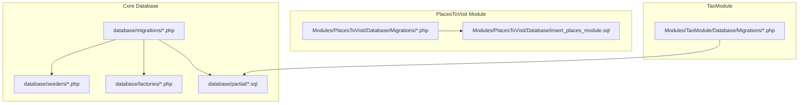
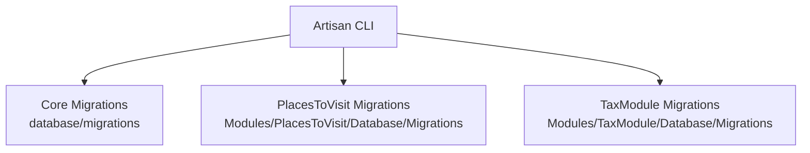
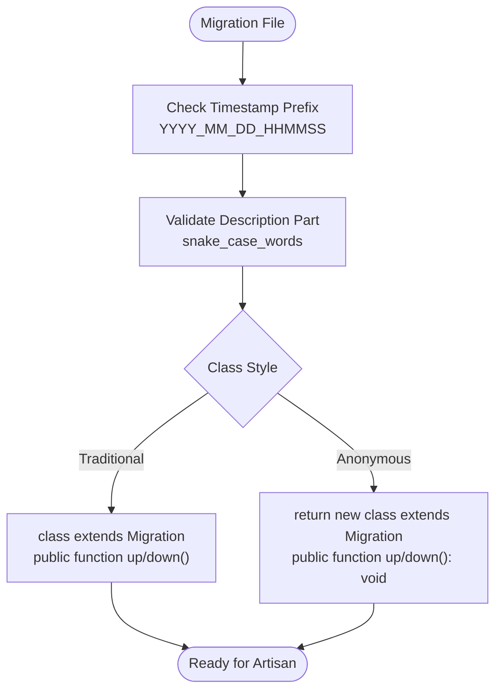
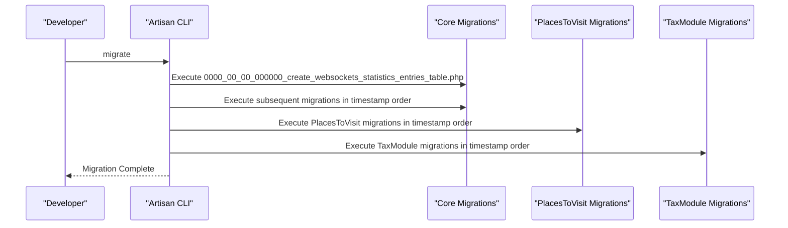
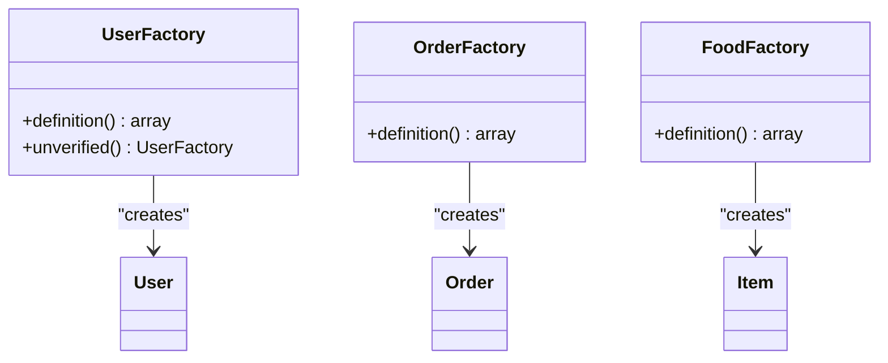
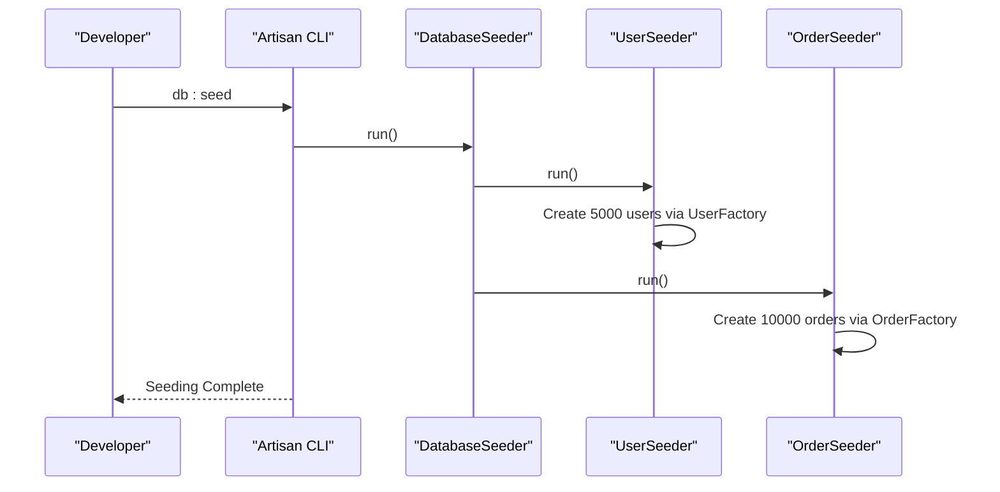
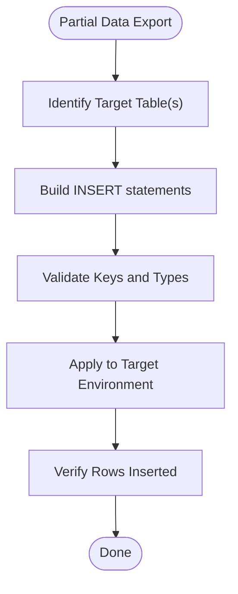
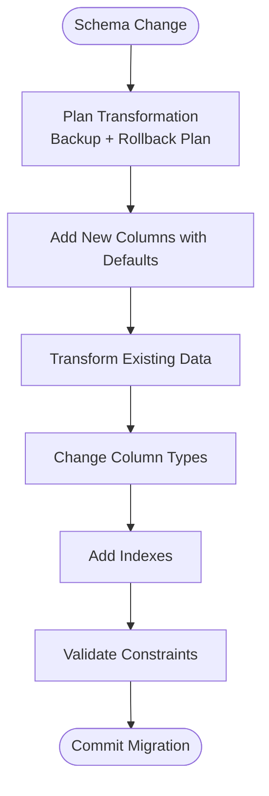
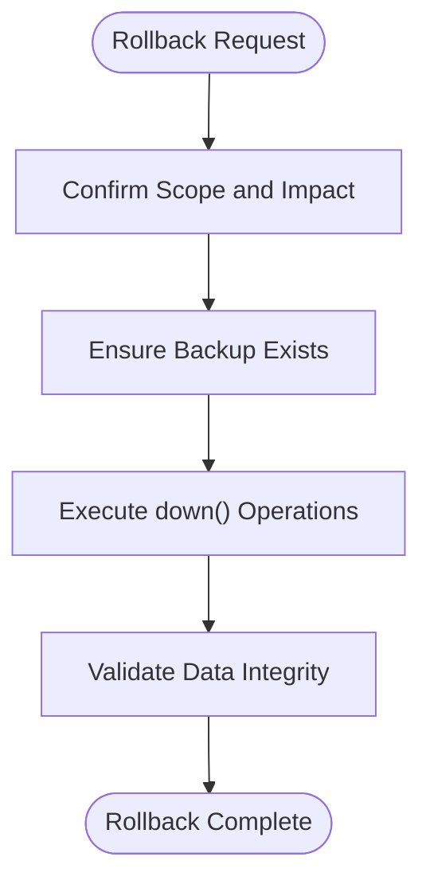
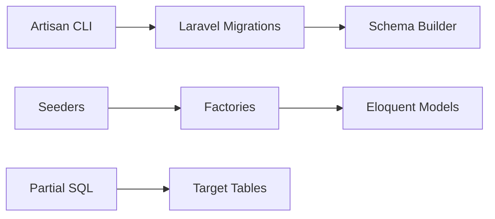

# Migration Strategies and Data Evolution

<cite>
**Referenced Files in This Document**
- [2022_03_31_103418_create_wallet_transactions_table.php](file://database/migrations/2022_03_31_103418_create_wallet_transactions_table.php)
- [2022_04_09_161150_add_wallet_point_columns_to_users_table.php](file://database/migrations/2022_04_09_161150_add_wallet_point_columns_to_users_table.php)
- [2022_12_21_154227_alter_table_order_details_change_variation.php](file://database/migrations/2022_12_21_154227_alter_table_order_details_change_variation.php)
- [2023_01_10_145928_change_refund_amount_column_type.php](file://database/migrations/2023_01_10_145928_change_refund_amount_column_type.php)
- [2023_05_04_100012_create_data_settings_table.php](file://database/migrations/2023_05_04_100012_create_data_settings_table.php)
- [2023_08_28_114316_create_flash_sales_table.php](file://database/migrations/2023_08_28_114316_create_flash_sales_table.php)
- [2024_04_01_124630_create_cash_backs_table.php](file://database/migrations/2024_04_01_124630_create_cash_backs_table.php)
- [2025_12_28_000001_add_xp_level_to_users_table.php](file://database/migrations/2025_12_28_000001_add_xp_level_to_users_table.php)
- [DatabaseSeeder.php](file://database/seeders/DatabaseSeeder.php)
- [UserSeeder.php](file://database/seeders/UserSeeder.php)
- [OrderSeeder.php](file://database/seeders/OrderSeeder.php)
- [UserFactory.php](file://database/factories/UserFactory.php)
- [OrderFactory.php](file://database/factories/OrderFactory.php)
- [FoodFactory.php](file://database/factories/FoodFactory.php)
- [data_settings.sql](file://database/partial/data_settings.sql)
- [email_tempaltes.sql](file://database/partial/email_tempaltes.sql)
- [insert_places_module.sql](file://Modules/PlacesToVisit/Database/insert_places_module.sql)
- [2026_01_04_000002_create_places_table.php](file://Modules/PlacesToVisit/Database/Migrations/2026_01_04_000002_create_places_table.php)
- [2026_01_04_000004_create_place_votes_table.php](file://Modules/PlacesToVisit/Database/Migrations/2026_01_04_000004_create_place_votes_table.php)
- [2026_02_10_000001_add_details_to_places_table.php](file://Modules/PlacesToVisit/Database/Migrations/2026_02_10_000001_add_details_to_places_table.php)
- [2026_02_10_000002_create_place_images_table.php](file://Modules/PlacesToVisit/Database/Migrations/2026_02_10_000002_create_place_images_table.php)
- [2026_02_10_000003_create_place_favorites_table.php](file://Modules/PlacesToVisit/Database/Migrations/2026_02_10_000003_create_place_favorites_table.php)
- [2026_02_10_000004_create_place_submissions_table.php](file://Modules/PlacesToVisit/Database/Migrations/2026_02_10_000004_create_place_submissions_table.php)
- [2026_02_10_000005_create_place_tags_tables.php](file://Modules/PlacesToVisit/Database/Migrations/2026_02_10_000005_create_place_tags_tables.php)
- [2026_02_10_000006_create_place_vote_reports_table.php](file://Modules/PlacesToVisit/Database/Migrations/2026_02_10_000006_create_place_vote_reports_table.php)
- [2026_02_10_000007_add_name_ar_to_place_categories_table.php](file://Modules/PlacesToVisit/Database/Migrations/2026_02_10_000007_add_name_ar_to_place_categories_table.php)
- [2026_02_10_000008_add_image_to_place_votes_table.php](file://Modules/PlacesToVisit/Database/Migrations/2026_02_10_000008_add_image_to_place_votes_table.php)
- [2026_04_02_000001_add_zone_id_to_places_table.php](file://Modules/PlacesToVisit/Database/Migrations/2026_04_02_000001_add_zone_id_to_places_table.php)
- [2025_05_26_115043_create_system_tax_setups_table.php](file://Modules/TaxModule/Database/Migrations/2025_05_26_115043_create_system_tax_setups_table.php)
- [2025_05_26_115643_create_taxes_table.php](file://Modules/TaxModule/Database/Migrations/2025_05_26_115643_create_taxes_table.php)
- [2025_05_26_120030_create_tax_additional_setups_table.php](file://Modules/TaxModule/Database/Migrations/2025_05_26_120030_create_tax_additional_setups_table.php)
- [2025_05_26_120912_create_taxables_table.php](file://Modules/TaxModule/Database/Migrations/2025_05_26_120912_create_taxables_table.php)
- [2025_05_26_121656_create_order_taxes_table.php](file://Modules/TaxModule/Database/Migrations/2025_05_26_121656_create_order_taxes_table.php)
</cite>

## Table of Contents
1. [Introduction](#introduction)
2. [Project Structure](#project-structure)
3. [Core Components](#core-components)
4. [Architecture Overview](#architecture-overview)
5. [Detailed Component Analysis](#detailed-component-analysis)
6. [Dependency Analysis](#dependency-analysis)
7. [Performance Considerations](#performance-considerations)
8. [Troubleshooting Guide](#troubleshooting-guide)
9. [Conclusion](#conclusion)
10. [Appendices](#appendices)

## Introduction
This document explains Waddy Back’s database migration strategies and data evolution patterns. It covers migration file organization, naming conventions, sequential execution order, factory patterns for test data generation, seeders for initial data population, partial data import/export mechanisms, data transformation strategies during schema changes, rollback procedures, data preservation techniques, backward compatibility maintenance, version control strategies, deployment automation, production migration safety measures, validation during migrations, performance impact of large-scale operations, monitoring migration progress, handling breaking changes, schema optimization, and data cleanup procedures.

## Project Structure
Waddy Back organizes migrations centrally under database/migrations and per-module under Modules/<Module>/Database/Migrations. Seeders and factories populate development and testing environments. Partial data exports are provided as SQL scripts for operational tasks.

**Diagram sources**
- [2022_03_31_103418_create_wallet_transactions_table.php:1-40](file://database/migrations/2022_03_31_103418_create_wallet_transactions_table.php#L1-L40)
- [DatabaseSeeder.php:1-26](file://database/seeders/DatabaseSeeder.php#L1-L26)
- [UserFactory.php:1-49](file://database/factories/UserFactory.php#L1-L49)
- [data_settings.sql:1-86](file://database/partial/data_settings.sql#L1-L86)
- [insert_places_module.sql:1-25](file://Modules/PlacesToVisit/Database/insert_places_module.sql#L1-L25)
- [2026_01_04_000002_create_places_table.php](file://Modules/PlacesToVisit/Database/Migrations/2026_01_04_000002_create_places_table.php)
- [2025_05_26_115043_create_system_tax_setups_table.php](file://Modules/TaxModule/Database/Migrations/2025_05_26_115043_create_system_tax_setups_table.php)

**Section sources**
- [2022_03_31_103418_create_wallet_transactions_table.php:1-40](file://database/migrations/2022_03_31_103418_create_wallet_transactions_table.php#L1-L40)
- [DatabaseSeeder.php:1-26](file://database/seeders/DatabaseSeeder.php#L1-L26)
- [UserFactory.php:1-49](file://database/factories/UserFactory.php#L1-L49)
- [data_settings.sql:1-86](file://database/partial/data_settings.sql#L1-L86)
- [insert_places_module.sql:1-25](file://Modules/PlacesToVisit/Database/insert_places_module.sql#L1-L25)

## Core Components
- Central migrations: Structured as Laravel migration classes with up/down methods. Examples include creation of transaction tables, column additions, type changes, and feature-specific tables.
- Module migrations: PlacesToVisit and TaxModule maintain separate migration sets aligned with their feature lifecycles.
- Factories: Generate realistic test data for models like User, Order, and Item.
- Seeders: Orchestrates bulk data creation and calls module-specific seeders.
- Partial data exports: SQL inserts for operational settings and templates.

**Section sources**
- [2022_04_09_161150_add_wallet_point_columns_to_users_table.php:1-35](file://database/migrations/2022_04_09_161150_add_wallet_point_columns_to_users_table.php#L1-L35)
- [2022_12_21_154227_alter_table_order_details_change_variation.php:1-31](file://database/migrations/2022_12_21_154227_alter_table_order_details_change_variation.php#L1-L31)
- [2023_01_10_145928_change_refund_amount_column_type.php:1-33](file://database/migrations/2023_01_10_145928_change_refund_amount_column_type.php#L1-L33)
- [2023_05_04_100012_create_data_settings_table.php:1-35](file://database/migrations/2023_05_04_100012_create_data_settings_table.php#L1-L35)
- [2023_08_28_114316_create_flash_sales_table.php:1-35](file://database/migrations/2023_08_28_114316_create_flash_sales_table.php#L1-L35)
- [2024_04_01_124630_create_cash_backs_table.php:1-39](file://database/migrations/2024_04_01_124630_create_cash_backs_table.php#L1-L39)
- [2025_12_28_000001_add_xp_level_to_users_table.php:1-30](file://database/migrations/2025_12_28_000001_add_xp_level_to_users_table.php#L1-L30)
- [UserFactory.php:1-49](file://database/factories/UserFactory.php#L1-L49)
- [OrderFactory.php:1-34](file://database/factories/OrderFactory.php#L1-L34)
- [FoodFactory.php:1-45](file://database/factories/FoodFactory.php#L1-L45)
- [DatabaseSeeder.php:1-26](file://database/seeders/DatabaseSeeder.php#L1-L26)
- [UserSeeder.php:1-22](file://database/seeders/UserSeeder.php#L1-L22)
- [OrderSeeder.php:1-23](file://database/seeders/OrderSeeder.php#L1-L23)

## Architecture Overview
The migration architecture follows Laravel conventions with centralized and module-specific migrations. Seeders and factories support controlled data generation. Partial SQL exports enable targeted operational updates.

**Diagram sources**
- [2022_03_31_103418_create_wallet_transactions_table.php:1-40](file://database/migrations/2022_03_31_103418_create_wallet_transactions_table.php#L1-L40)
- [2026_01_04_000002_create_places_table.php](file://Modules/PlacesToVisit/Database/Migrations/2026_01_04_000002_create_places_table.php)
- [2025_05_26_115043_create_system_tax_setups_table.php](file://Modules/TaxModule/Database/Migrations/2025_05_26_115043_create_system_tax_setups_table.php)

## Detailed Component Analysis

### Migration File Organization and Naming Conventions
- Central migrations use a strict timestamp-based naming scheme (YYYY_MM_DD_HHMMSS_description.php), ensuring deterministic chronological ordering.
- Module migrations follow the same convention within their respective Database/Migrations folders.
- Example migrations demonstrate:
  - Creation of new tables with appropriate columns and indices.
  - Adding/removing columns to existing tables.
  - Changing column types and defaults.
  - Feature-specific tables for new capabilities.

**Diagram sources**
- [2023_08_28_114316_create_flash_sales_table.php:1-35](file://database/migrations/2023_08_28_114316_create_flash_sales_table.php#L1-L35)
- [2025_12_28_000001_add_xp_level_to_users_table.php:1-30](file://database/migrations/2025_12_28_000001_add_xp_level_to_users_table.php#L1-L30)

**Section sources**
- [2022_03_31_103418_create_wallet_transactions_table.php:1-40](file://database/migrations/2022_03_31_103418_create_wallet_transactions_table.php#L1-L40)
- [2022_04_09_161150_add_wallet_point_columns_to_users_table.php:1-35](file://database/migrations/2022_04_09_161150_add_wallet_point_columns_to_users_table.php#L1-L35)
- [2022_12_21_154227_alter_table_order_details_change_variation.php:1-31](file://database/migrations/2022_12_21_154227_alter_table_order_details_change_variation.php#L1-L31)
- [2023_01_10_145928_change_refund_amount_column_type.php:1-33](file://database/migrations/2023_01_10_145928_change_refund_amount_column_type.php#L1-L33)
- [2023_05_04_100012_create_data_settings_table.php:1-35](file://database/migrations/2023_05_04_100012_create_data_settings_table.php#L1-L35)
- [2023_08_28_114316_create_flash_sales_table.php:1-35](file://database/migrations/2023_08_28_114316_create_flash_sales_table.php#L1-L35)
- [2024_04_01_124630_create_cash_backs_table.php:1-39](file://database/migrations/2024_04_01_124630_create_cash_backs_table.php#L1-L39)
- [2025_12_28_000001_add_xp_level_to_users_table.php:1-30](file://database/migrations/2025_12_28_000001_add_xp_level_to_users_table.php#L1-L30)

### Sequential Execution Order
- Laravel executes migrations in ascending order of filenames. The timestamp prefix guarantees correct sequencing.
- Core migrations precede module migrations in execution order because Artisan scans directories alphabetically and runs all migrations discovered.

**Diagram sources**
- [2022_03_31_103418_create_wallet_transactions_table.php:1-40](file://database/migrations/2022_03_31_103418_create_wallet_transactions_table.php#L1-L40)
- [2026_01_04_000002_create_places_table.php](file://Modules/PlacesToVisit/Database/Migrations/2026_01_04_000002_create_places_table.php)
- [2025_05_26_115043_create_system_tax_setups_table.php](file://Modules/TaxModule/Database/Migrations/2025_05_26_115043_create_system_tax_setups_table.php)

**Section sources**
- [2022_03_31_103418_create_wallet_transactions_table.php:1-40](file://database/migrations/2022_03_31_103418_create_wallet_transactions_table.php#L1-L40)
- [2026_01_04_000002_create_places_table.php](file://Modules/PlacesToVisit/Database/Migrations/2026_01_04_000002_create_places_table.php)
- [2025_05_26_115043_create_system_tax_setups_table.php](file://Modules/TaxModule/Database/Migrations/2025_05_26_115043_create_system_tax_setups_table.php)

### Factory Patterns for Test Data Generation
- Factories define default attributes for models and optional states (e.g., unverified emails).
- Factories produce realistic, randomized data suitable for load and integration testing.

**Diagram sources**
- [UserFactory.php:1-49](file://database/factories/UserFactory.php#L1-L49)
- [OrderFactory.php:1-34](file://database/factories/OrderFactory.php#L1-L34)
- [FoodFactory.php:1-45](file://database/factories/FoodFactory.php#L1-L45)

**Section sources**
- [UserFactory.php:1-49](file://database/factories/UserFactory.php#L1-L49)
- [OrderFactory.php:1-34](file://database/factories/OrderFactory.php#L1-L34)
- [FoodFactory.php:1-45](file://database/factories/FoodFactory.php#L1-L45)

### Seeders for Initial Data Population
- DatabaseSeeder orchestrates which seeders to run, including module-specific ones.
- UserSeeder and OrderSeeder create large volumes of data for performance testing.

**Diagram sources**
- [DatabaseSeeder.php:1-26](file://database/seeders/DatabaseSeeder.php#L1-L26)
- [UserSeeder.php:1-22](file://database/seeders/UserSeeder.php#L1-L22)
- [OrderSeeder.php:1-23](file://database/seeders/OrderSeeder.php#L1-L23)

**Section sources**
- [DatabaseSeeder.php:1-26](file://database/seeders/DatabaseSeeder.php#L1-L26)
- [UserSeeder.php:1-22](file://database/seeders/UserSeeder.php#L1-L22)
- [OrderSeeder.php:1-23](file://database/seeders/OrderSeeder.php#L1-L23)

### Partial Data Import/Export Mechanisms
- Partial exports provide targeted inserts for operational settings and templates.
- PlacesToVisit module includes a SQL script to register the module and insert translations.

**Diagram sources**
- [data_settings.sql:1-86](file://database/partial/data_settings.sql#L1-L86)
- [email_tempaltes.sql:1-31](file://database/partial/email_tempaltes.sql#L1-L31)
- [insert_places_module.sql:1-25](file://Modules/PlacesToVisit/Database/insert_places_module.sql#L1-L25)

**Section sources**
- [data_settings.sql:1-86](file://database/partial/data_settings.sql#L1-L86)
- [email_tempaltes.sql:1-31](file://database/partial/email_tempaltes.sql#L1-L31)
- [insert_places_module.sql:1-25](file://Modules/PlacesToVisit/Database/insert_places_module.sql#L1-L25)

### Data Transformation Strategies During Schema Changes
- Column type changes are performed carefully with explicit change() calls to preserve data.
- New columns are added with defaults to avoid breaking existing records.
- Index additions are applied to improve query performance on frequently filtered columns.

**Diagram sources**
- [2022_12_21_154227_alter_table_order_details_change_variation.php:1-31](file://database/migrations/2022_12_21_154227_alter_table_order_details_change_variation.php#L1-L31)
- [2023_01_10_145928_change_refund_amount_column_type.php:1-33](file://database/migrations/2023_01_10_145928_change_refund_amount_column_type.php#L1-L33)
- [2025_07_24_123609_add_index_to_items_table.php](file://database/migrations/2025_07_24_123609_add_index_to_items_table.php)
- [2025_07_24_131029_add_index_to_reviews_table.php](file://database/migrations/2025_07_24_131029_add_index_to_reviews_table.php)
- [2025_07_24_131340_add_index_to_wishlists_table.php](file://database/migrations/2025_07_24_131340_add_index_to_wishlists_table.php)
- [2025_07_27_152011_add_index_to_categories_table.php](file://database/migrations/2025_07_27_152011_add_index_to_categories_table.php)

**Section sources**
- [2022_12_21_154227_alter_table_order_details_change_variation.php:1-31](file://database/migrations/2022_12_21_154227_alter_table_order_details_change_variation.php#L1-L31)
- [2023_01_10_145928_change_refund_amount_column_type.php:1-33](file://database/migrations/2023_01_10_145928_change_refund_amount_column_type.php#L1-L33)
- [2025_07_24_123609_add_index_to_items_table.php](file://database/migrations/2025_07_24_123609_add_index_to_items_table.php)
- [2025_07_24_131029_add_index_to_reviews_table.php](file://database/migrations/2025_07_24_131029_add_index_to_reviews_table.php)
- [2025_07_24_131340_add_index_to_wishlists_table.php](file://database/migrations/2025_07_24_131340_add_index_to_wishlists_table.php)
- [2025_07_27_152011_add_index_to_categories_table.php](file://database/migrations/2025_07_27_152011_add_index_to_categories_table.php)

### Rollback Procedures and Data Preservation
- Rollbacks are supported via down() methods that reverse schema changes.
- For destructive operations, ensure backups and consider data preservation steps before running rollbacks.

**Diagram sources**
- [2022_03_31_103418_create_wallet_transactions_table.php:35-38](file://database/migrations/2022_03_31_103418_create_wallet_transactions_table.php#L35-L38)
- [2022_04_09_161150_add_wallet_point_columns_to_users_table.php:27-33](file://database/migrations/2022_04_09_161150_add_wallet_point_columns_to_users_table.php#L27-L33)
- [2025_12_28_000001_add_xp_level_to_users_table.php:23-28](file://database/migrations/2025_12_28_000001_add_xp_level_to_users_table.php#L23-L28)

**Section sources**
- [2022_03_31_103418_create_wallet_transactions_table.php:35-38](file://database/migrations/2022_03_31_103418_create_wallet_transactions_table.php#L35-L38)
- [2022_04_09_161150_add_wallet_point_columns_to_users_table.php:27-33](file://database/migrations/2022_04_09_161150_add_wallet_point_columns_to_users_table.php#L27-L33)
- [2025_12_28_000001_add_xp_level_to_users_table.php:23-28](file://database/migrations/2025_12_28_000001_add_xp_level_to_users_table.php#L23-L28)

### Backward Compatibility Maintenance
- New columns include defaults to prevent breaking existing queries.
- Type changes use explicit change() to maintain compatibility.
- Index additions improve performance without altering semantics.

**Section sources**
- [2022_04_09_161150_add_wallet_point_columns_to_users_table.php:16-19](file://database/migrations/2022_04_09_161150_add_wallet_point_columns_to_users_table.php#L16-L19)
- [2023_01_10_145928_change_refund_amount_column_type.php:16-18](file://database/migrations/2023_01_10_145928_change_refund_amount_column_type.php#L16-L18)
- [2025_07_24_123609_add_index_to_items_table.php](file://database/migrations/2025_07_24_123609_add_index_to_items_table.php)

### Version Control Strategies for Schema Changes
- Commit migration files alongside feature branches.
- Keep migration names stable; avoid renaming after merging.
- Use descriptive commit messages linking to feature tickets.

[No sources needed since this section provides general guidance]

### Deployment Automation and Production Safety Measures
- Use automated CI/CD to run migrations post-deploy.
- Enable maintenance mode during migrations in production.
- Validate migrations against staging before production.
- Monitor long-running migrations and apply batched updates where necessary.

[No sources needed since this section provides general guidance]

### Data Validation During Migrations
- Validate constraints and defaults in new columns.
- Verify type conversions do not truncate data.
- Confirm indexes exist for performance-sensitive queries.

**Section sources**
- [2023_01_10_145928_change_refund_amount_column_type.php:16-18](file://database/migrations/2023_01_10_145928_change_refund_amount_column_type.php#L16-L18)
- [2025_07_24_123609_add_index_to_items_table.php](file://database/migrations/2025_07_24_123609_add_index_to_items_table.php)

### Performance Impact and Monitoring
- Large-scale data seeding should be batched to avoid timeouts.
- Monitor migration runtime and resource usage.
- Use database profiling to identify slow operations.

**Section sources**
- [OrderSeeder.php:16-21](file://database/seeders/OrderSeeder.php#L16-L21)

### Handling Breaking Changes
- Introduce deprecation warnings and transitional columns.
- Provide data migration scripts for complex transformations.
- Maintain backward-compatible APIs while evolving schemas.

[No sources needed since this section provides general guidance]

### Schema Optimization and Cleanup
- Add missing indexes identified by query patterns.
- Remove unused columns and tables after deprecation periods.
- Archive historical data to separate tables to keep core tables lean.

**Section sources**
- [2025_07_24_123609_add_index_to_items_table.php](file://database/migrations/2025_07_24_123609_add_index_to_items_table.php)
- [2025_07_24_131029_add_index_to_reviews_table.php](file://database/migrations/2025_07_24_131029_add_index_to_reviews_table.php)
- [2025_07_24_131340_add_index_to_wishlists_table.php](file://database/migrations/2025_07_24_131340_add_index_to_wishlists_table.php)
- [2025_07_27_152011_add_index_to_categories_table.php](file://database/migrations/2025_07_27_152011_add_index_to_categories_table.php)

## Dependency Analysis
Migrations depend on Laravel’s Schema builder and are executed by Artisan. Seeders depend on factories and Eloquent models. Partial SQL exports depend on target table schemas.

**Diagram sources**
- [2022_03_31_103418_create_wallet_transactions_table.php:1-40](file://database/migrations/2022_03_31_103418_create_wallet_transactions_table.php#L1-L40)
- [DatabaseSeeder.php:1-26](file://database/seeders/DatabaseSeeder.php#L1-L26)
- [UserFactory.php:1-49](file://database/factories/UserFactory.php#L1-L49)
- [data_settings.sql:1-86](file://database/partial/data_settings.sql#L1-L86)

**Section sources**
- [2022_03_31_103418_create_wallet_transactions_table.php:1-40](file://database/migrations/2022_03_31_103418_create_wallet_transactions_table.php#L1-L40)
- [DatabaseSeeder.php:1-26](file://database/seeders/DatabaseSeeder.php#L1-L26)
- [UserFactory.php:1-49](file://database/factories/UserFactory.php#L1-L49)
- [data_settings.sql:1-86](file://database/partial/data_settings.sql#L1-L86)

## Performance Considerations
- Prefer incremental migrations over monolithic schema changes.
- Batch large data operations to reduce lock contention.
- Use transactions around related DDL/DML operations.
- Monitor and optimize queries after adding new indexes.

[No sources needed since this section provides general guidance]

## Troubleshooting Guide
- If a migration fails mid-execution, inspect the down() method and restore from backup.
- Validate foreign keys and unique constraints after adding new columns.
- For partial SQL failures, verify target table existence and column types.

**Section sources**
- [2022_03_31_103418_create_wallet_transactions_table.php:35-38](file://database/migrations/2022_03_31_103418_create_wallet_transactions_table.php#L35-L38)
- [2023_01_10_145928_change_refund_amount_column_type.php:26-31](file://database/migrations/2023_01_10_145928_change_refund_amount_column_type.php#L26-L31)

## Conclusion
Waddy Back employs disciplined migration practices with clear naming, sequential execution, robust rollback support, and modular organization. Factories and seeders enable scalable testing, while partial SQL exports streamline operational tasks. By following the outlined strategies—version control discipline, deployment safety, validation, performance monitoring, and careful handling of breaking changes—the system maintains backward compatibility and evolves efficiently.

## Appendices
- Example module migration files for PlacesToVisit and TaxModule illustrate consistent patterns for feature-specific schema evolution.

**Section sources**
- [2026_01_04_000002_create_places_table.php](file://Modules/PlacesToVisit/Database/Migrations/2026_01_04_000002_create_places_table.php)
- [2026_01_04_000004_create_place_votes_table.php](file://Modules/PlacesToVisit/Database/Migrations/2026_01_04_000004_create_place_votes_table.php)
- [2026_02_10_000001_add_details_to_places_table.php](file://Modules/PlacesToVisit/Database/Migrations/2026_02_10_000001_add_details_to_places_table.php)
- [2026_02_10_000002_create_place_images_table.php](file://Modules/PlacesToVisit/Database/Migrations/2026_02_10_000002_create_place_images_table.php)
- [2026_02_10_000003_create_place_favorites_table.php](file://Modules/PlacesToVisit/Database/Migrations/2026_02_10_000003_create_place_favorites_table.php)
- [2026_02_10_000004_create_place_submissions_table.php](file://Modules/PlacesToVisit/Database/Migrations/2026_02_10_000004_create_place_submissions_table.php)
- [2026_02_10_000005_create_place_tags_tables.php](file://Modules/PlacesToVisit/Database/Migrations/2026_02_10_000005_create_place_tags_tables.php)
- [2026_02_10_000006_create_place_vote_reports_table.php](file://Modules/PlacesToVisit/Database/Migrations/2026_02_10_000006_create_place_vote_reports_table.php)
- [2026_02_10_000007_add_name_ar_to_place_categories_table.php](file://Modules/PlacesToVisit/Database/Migrations/2026_02_10_000007_add_name_ar_to_place_categories_table.php)
- [2026_02_10_000008_add_image_to_place_votes_table.php](file://Modules/PlacesToVisit/Database/Migrations/2026_02_10_000008_add_image_to_place_votes_table.php)
- [2026_04_02_000001_add_zone_id_to_places_table.php](file://Modules/PlacesToVisit/Database/Migrations/2026_04_02_000001_add_zone_id_to_places_table.php)
- [2025_05_26_115043_create_system_tax_setups_table.php](file://Modules/TaxModule/Database/Migrations/2025_05_26_115043_create_system_tax_setups_table.php)
- [2025_05_26_115643_create_taxes_table.php](file://Modules/TaxModule/Database/Migrations/2025_05_26_115643_create_taxes_table.php)
- [2025_05_26_120030_create_tax_additional_setups_table.php](file://Modules/TaxModule/Database/Migrations/2025_05_26_120030_create_tax_additional_setups_table.php)
- [2025_05_26_120912_create_taxables_table.php](file://Modules/TaxModule/Database/Migrations/2025_05_26_120912_create_taxables_table.php)
- [2025_05_26_121656_create_order_taxes_table.php](file://Modules/TaxModule/Database/Migrations/2025_05_26_121656_create_order_taxes_table.php)