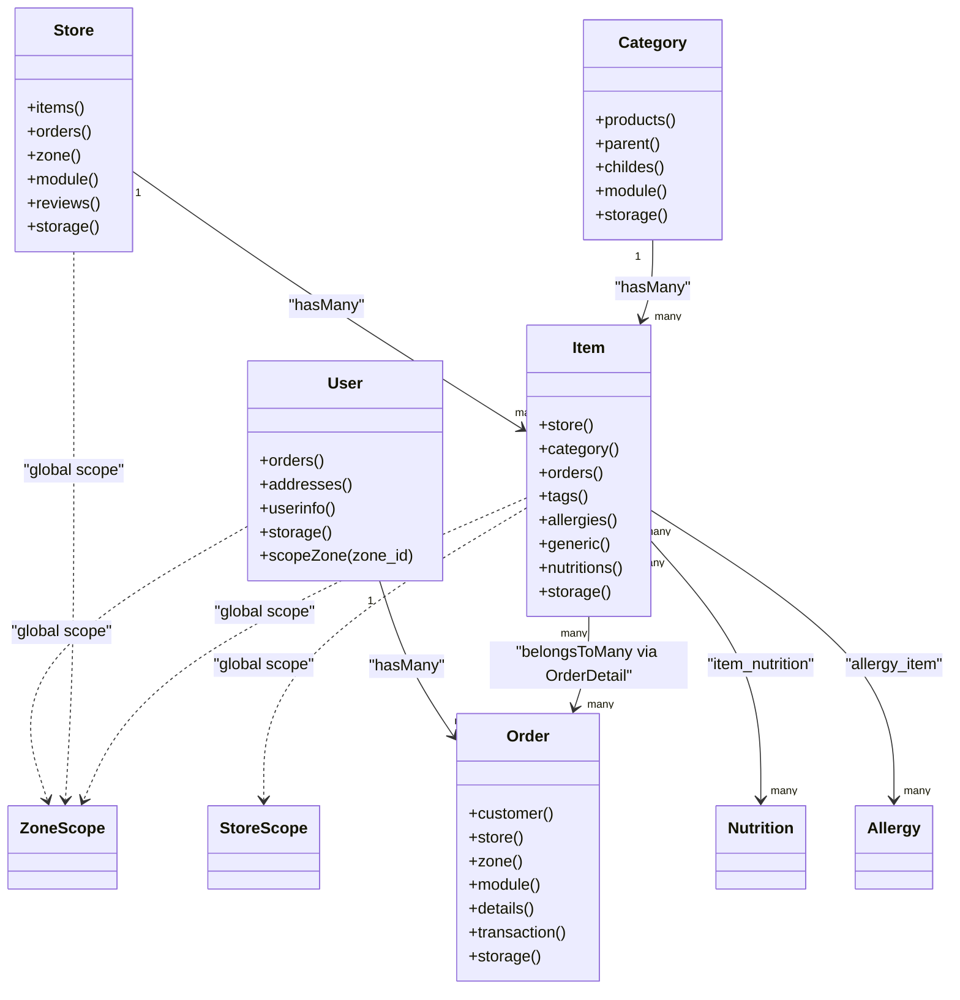
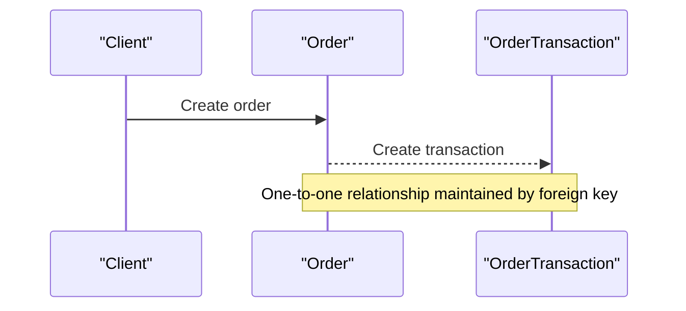
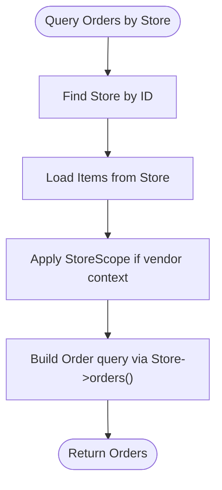
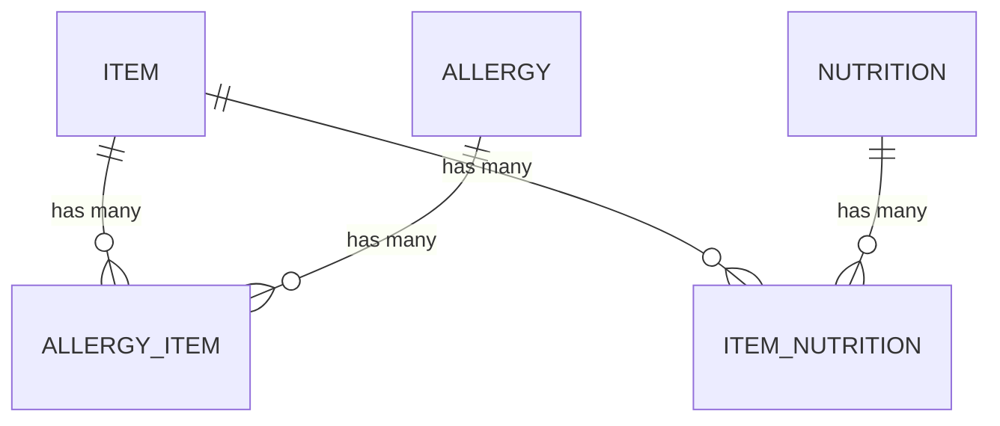
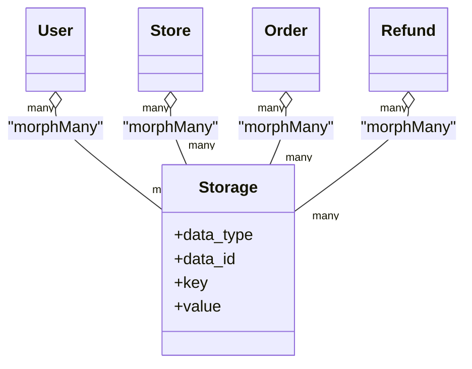
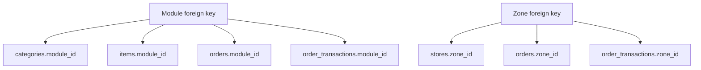
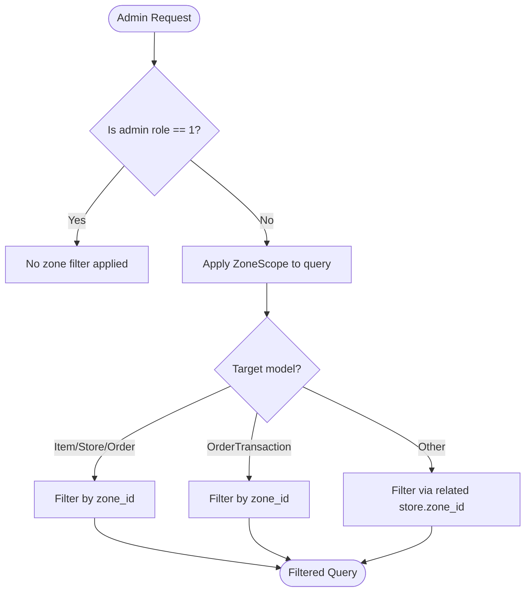
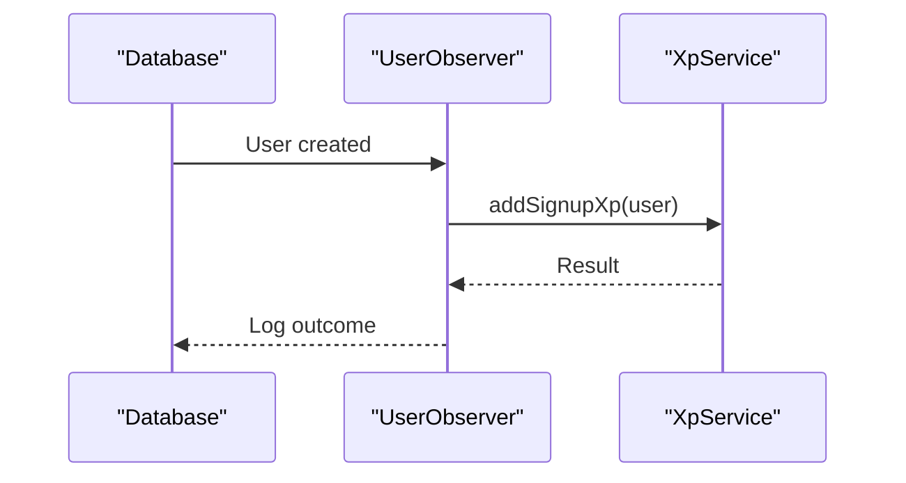
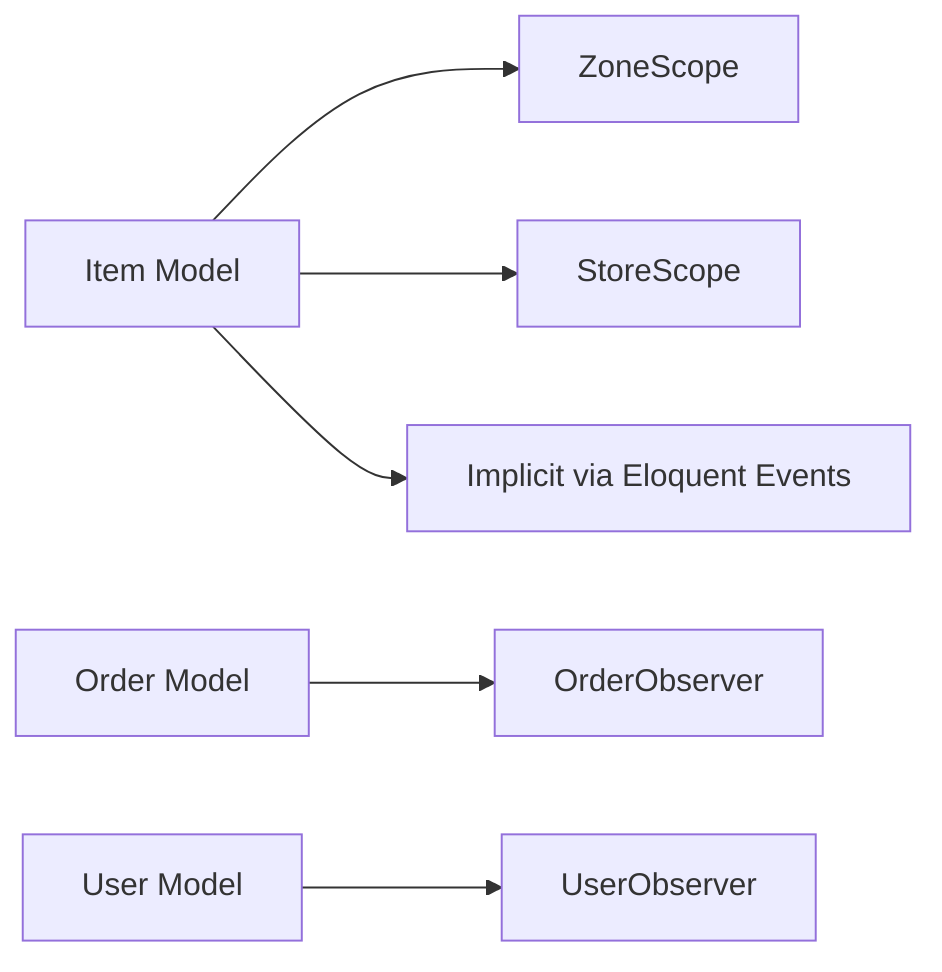

# Relationship Patterns and Constraints

<cite>
**Referenced Files in This Document**
- [User.php](file://app/Models/User.php)
- [Store.php](file://app/Models/Store.php)
- [Order.php](file://app/Models/Order.php)
- [Item.php](file://app/Models/Item.php)
- [Category.php](file://app/Models/Category.php)
- [ZoneScope.php](file://app/Scopes/ZoneScope.php)
- [StoreScope.php](file://app/Scopes/StoreScope.php)
- [UserObserver.php](file://app/Observers/UserObserver.php)
- [OrderObserver.php](file://app/Observers/OrderObserver.php)
- [2024_09_12_121929_create_allergy_item_table.php](file://database/migrations/2024_09_12_121929_create_allergy_item_table.php)
- [2024_09_12_121941_create_item_nutrition_table.php](file://database/migrations/2024_09_12_121941_create_item_nutrition_table.php)
- [2024_09_12_121941_create_item_nutrition_table.php](file://database/migrations/2024_09_12_121941_create_item_nutrition_table.php)
- [2022_04_12_015827_create_social_media_table.php](file://database/migrations/2022_04_12_015827_create_social_media_table.php)
- [installation/backup/database_3.0.sql](file://installation/backup/database_3.0.sql)
</cite>

## Table of Contents
1. [Introduction](#introduction)
2. [Project Structure](#project-structure)
3. [Core Components](#core-components)
4. [Architecture Overview](#architecture-overview)
5. [Detailed Component Analysis](#detailed-component-analysis)
6. [Dependency Analysis](#dependency-analysis)
7. [Performance Considerations](#performance-considerations)
8. [Troubleshooting Guide](#troubleshooting-guide)
9. [Conclusion](#conclusion)

## Introduction
This document explains Waddy Back’s database relationship patterns and constraint enforcement across the entire schema. It covers:
- One-to-one, one-to-many, many-to-many, and polymorphic relationships
- Foreign key constraints, cascading behaviors, and referential integrity rules
- Scope implementations for zone-based filtering, store-specific queries, and module-scoped data access
- Observer patterns for automatic data validation, audit trails, and business rule enforcement
- Constraint validation strategies, transaction handling for complex operations, and data consistency maintenance
- Performance implications of different relationship patterns and optimization techniques for complex queries

## Project Structure
The schema is organized around core entities (users, stores, orders, items, categories) with supporting scopes and observers that enforce business rules and data consistency. Many-to-many relationships are implemented via dedicated pivot tables, while polymorphic relations support shared metadata and media storage.

```mermaid
graph TB
subgraph "Core Entities"
U["User"]
S["Store"]
O["Order"]
I["Item"]
C["Category"]
end
subgraph "Pivots and Polymorphs"
AI["allergy_item"]
IN["item_nutrition"]
ST["storages"]
end
subgraph "Scopes"
ZS["ZoneScope"]
SS["StoreScope"]
end
subgraph "Observers"
UObs["UserObserver"]
OObs["OrderObserver"]
end
U --> O
S --> I
C --> I
I <-- AI
I <-- IN
U -.morphMany.-> ST
S -.morphMany.-> ST
O -.morphMany.-> ST
```

**Diagram sources**
- [User.php:103-130](file://app/Models/User.php#L103-L130)
- [Store.php:408-464](file://app/Models/Store.php#L408-L464)
- [Order.php:118-161](file://app/Models/Order.php#L118-L161)
- [Item.php:247-269](file://app/Models/Item.php#L247-L269)
- [Category.php:75-103](file://app/Models/Category.php#L75-L103)
- [2024_09_12_121929_create_allergy_item_table.php:14-18](file://database/migrations/2024_09_12_121929_create_allergy_item_table.php#L14-L18)
- [2024_09_12_121941_create_item_nutrition_table.php:14-18](file://database/migrations/2024_09_12_121941_create_item_nutrition_table.php#L14-L18)
- [ZoneScope.php:18-98](file://app/Scopes/ZoneScope.php#L18-L98)
- [StoreScope.php:19-22](file://app/Scopes/StoreScope.php#L19-L22)
- [UserObserver.php:14-23](file://app/Observers/UserObserver.php#L14-L23)
- [OrderObserver.php:17-65](file://app/Observers/OrderObserver.php#L17-L65)

**Section sources**
- [User.php:103-130](file://app/Models/User.php#L103-L130)
- [Store.php:408-464](file://app/Models/Store.php#L408-L464)
- [Order.php:118-161](file://app/Models/Order.php#L118-L161)
- [Item.php:247-269](file://app/Models/Item.php#L247-L269)
- [Category.php:75-103](file://app/Models/Category.php#L75-L103)
- [ZoneScope.php:18-98](file://app/Scopes/ZoneScope.php#L18-L98)
- [StoreScope.php:19-22](file://app/Scopes/StoreScope.php#L19-L22)
- [2024_09_12_121929_create_allergy_item_table.php:14-18](file://database/migrations/2024_09_12_121929_create_allergy_item_table.php#L14-L18)
- [2024_09_12_121941_create_item_nutrition_table.php:14-18](file://database/migrations/2024_09_12_121941_create_item_nutrition_table.php#L14-L18)

## Core Components
- User: One-to-many with Order and DeliveryMan; polymorphic storage; zone/store scopes; observers for XP and audit.
- Store: One-to-many with Item, Order, DeliveryMan; belongs-to Module and Zone; many-to-many with Campaign; has-many-through Reviews; global scopes for zone and translation/storage.
- Order: Belongs-to User, Store, Zone, Module; one-to-many with OrderDetail; one-to-one with OrderTransaction; polymorphic storage and taxes.
- Item: Belongs-to Store and Category; belongs-to Unit; polymorphic translations/storage; many-to-many with Tags, Allergies, GenericName, Nutrition; belongs-to-many Campaigns; has-many OrderDetail.
- Category: Belongs-to Module; one-to-many with Item; self-referencing parent/children; polymorphic translations/storage.
- Scopes: ZoneScope applies zone-based filters across related models; StoreScope restricts queries to a vendor’s store.
- Observers: Automatic XP awards and challenge updates on order lifecycle; initial audit trail creation.

**Section sources**
- [User.php:103-130](file://app/Models/User.php#L103-L130)
- [Store.php:408-464](file://app/Models/Store.php#L408-L464)
- [Order.php:118-161](file://app/Models/Order.php#L118-L161)
- [Item.php:247-269](file://app/Models/Item.php#L247-L269)
- [Category.php:75-103](file://app/Models/Category.php#L75-L103)
- [ZoneScope.php:18-98](file://app/Scopes/ZoneScope.php#L18-L98)
- [StoreScope.php:19-22](file://app/Scopes/StoreScope.php#L19-L22)
- [UserObserver.php:14-23](file://app/Observers/UserObserver.php#L14-L23)
- [OrderObserver.php:17-65](file://app/Observers/OrderObserver.php#L17-L65)

## Architecture Overview
The system enforces referential integrity via foreign keys and leverages Eloquent relationships and scopes to maintain data consistency. Observers automate business logic and audit trails. Polymorphic relations decouple metadata/media from entities.



**Diagram sources**
- [User.php:103-130](file://app/Models/User.php#L103-L130)
- [Store.php:408-464](file://app/Models/Store.php#L408-L464)
- [Order.php:118-161](file://app/Models/Order.php#L118-L161)
- [Item.php:247-269](file://app/Models/Item.php#L247-L269)
- [Category.php:75-103](file://app/Models/Category.php#L75-L103)
- [ZoneScope.php:18-98](file://app/Scopes/ZoneScope.php#L18-L98)
- [StoreScope.php:19-22](file://app/Scopes/StoreScope.php#L19-L22)
- [2024_09_12_121929_create_allergy_item_table.php:14-18](file://database/migrations/2024_09_12_121929_create_allergy_item_table.php#L14-L18)
- [2024_09_12_121941_create_item_nutrition_table.php:14-18](file://database/migrations/2024_09_12_121941_create_item_nutrition_table.php#L14-L18)

## Detailed Component Analysis

### One-to-One Relationships
- User to UserInfo: enforced via foreign key and Eloquent relation.
- Order to OrderTransaction: one-to-one financial settlement record.
- Store to Discount: store-level discount configuration.
- Item to PharmacyItemDetails and EcommerceItemDetails: specialized product details per domain.



**Diagram sources**
- [Order.php:174-177](file://app/Models/Order.php#L174-L177)

**Section sources**
- [Order.php:174-177](file://app/Models/Order.php#L174-L177)
- [Item.php:257-264](file://app/Models/Item.php#L257-L264)

### One-to-Many Relationships
- User to Orders: customer places many orders.
- Store to Items: store carries many items.
- Store to Orders: store receives many orders.
- Category to Items: category aggregates many items.
- Store to DeliveryMen: store employs many delivery personnel.
- Store to StoreSubscription: store may have multiple subscriptions.



**Diagram sources**
- [Store.php:408-464](file://app/Models/Store.php#L408-L464)
- [StoreScope.php:19-22](file://app/Scopes/StoreScope.php#L19-L22)

**Section sources**
- [User.php:103-106](file://app/Models/User.php#L103-L106)
- [Store.php:408-464](file://app/Models/Store.php#L408-L464)
- [Category.php:75-78](file://app/Models/Category.php#L75-L78)

### Many-to-Many Relationships
- Item to Allergy via allergy_item pivot.
- Item to Nutrition via item_nutrition pivot.
- Item to Tag, GenericName, and Campaign via dedicated pivots.



**Diagram sources**
- [2024_09_12_121929_create_allergy_item_table.php:14-18](file://database/migrations/2024_09_12_121929_create_allergy_item_table.php#L14-L18)
- [2024_09_12_121941_create_item_nutrition_table.php:14-18](file://database/migrations/2024_09_12_121941_create_item_nutrition_table.php#L14-L18)
- [Item.php:313-328](file://app/Models/Item.php#L313-L328)

**Section sources**
- [Item.php:313-328](file://app/Models/Item.php#L313-L328)
- [2024_09_12_121929_create_allergy_item_table.php:14-18](file://database/migrations/2024_09_12_121929_create_allergy_item_table.php#L14-L18)
- [2024_09_12_121941_create_item_nutrition_table.php:14-18](file://database/migrations/2024_09_12_121941_create_item_nutrition_table.php#L14-L18)

### Polymorphic Relationships
- User, Store, Order, Refund, and others morphMany to Storage for unified media metadata.
- Item, Category, and others morphMany to Translation for i18n.
- Item and Category morphMany to Taxable for tax-related metadata.



**Diagram sources**
- [User.php:127-130](file://app/Models/User.php#L127-L130)
- [Store.php:207-210](file://app/Models/Store.php#L207-L210)
- [Order.php:345-348](file://app/Models/Order.php#L345-L348)
- [Refund.php:56-59](file://app/Models/Refund.php#L56-L59)

**Section sources**
- [User.php:127-130](file://app/Models/User.php#L127-L130)
- [Store.php:207-210](file://app/Models/Store.php#L207-L210)
- [Order.php:345-348](file://app/Models/Order.php#L345-L348)
- [Refund.php:56-59](file://app/Models/Refund.php#L56-L59)

### Foreign Keys, Cascades, and Referential Integrity
- Module-based foreign keys: categories, coupons, items, item_campaigns, orders, order_transactions, parcel_categories, reviews, stores are constrained to modules.
- Zone-based foreign keys: stores, orders, and related entities reference zones.
- Additional constraints observed in legacy SQL include primary keys and indexes for performance and uniqueness.



**Diagram sources**
- [installation/backup/database_3.0.sql:5276-5328](file://installation/backup/database_3.0.sql#L5276-L5328)

**Section sources**
- [installation/backup/database_3.0.sql:5276-5328](file://installation/backup/database_3.0.sql#L5276-L5328)

### Scope Implementations
- ZoneScope: Applies zone-based filtering for multiple models (Item, ItemCampaign, Order, Store, AddOn, DeliveryMan, Banner, Notification, Zone, Provider earnings, StoreSubscription, SubscriptionTransaction) when the admin user lacks super privileges.
- StoreScope: Restricts Item queries to the current vendor’s store.



**Diagram sources**
- [ZoneScope.php:18-98](file://app/Scopes/ZoneScope.php#L18-L98)

**Section sources**
- [ZoneScope.php:18-98](file://app/Scopes/ZoneScope.php#L18-L98)
- [StoreScope.php:19-22](file://app/Scopes/StoreScope.php#L19-L22)

### Observer Patterns
- UserObserver: On user creation, grants signup XP via service layer and logs outcome.
- OrderObserver: On creation, initializes an OrderReference; on delivered status change, awards XP and checks challenges.



**Diagram sources**
- [UserObserver.php:14-23](file://app/Observers/UserObserver.php#L14-L23)

**Section sources**
- [UserObserver.php:14-23](file://app/Observers/UserObserver.php#L14-L23)
- [OrderObserver.php:17-65](file://app/Observers/OrderObserver.php#L17-L65)

### Constraint Validation Strategies
- Global scopes automatically enforce zone/store boundaries on queries.
- Polymorphic storage ensures media metadata consistency across entities.
- Observers act as runtime validators for business rules (e.g., XP grants, audit trail initialization).

**Section sources**
- [ZoneScope.php:18-98](file://app/Scopes/ZoneScope.php#L18-L98)
- [StoreScope.php:19-22](file://app/Scopes/StoreScope.php#L19-L22)
- [UserObserver.php:14-23](file://app/Observers/UserObserver.php#L14-L23)
- [OrderObserver.php:17-65](file://app/Observers/OrderObserver.php#L17-L65)

### Transaction Handling and Consistency
- Use database transactions for complex operations involving multiple writes (e.g., order creation, payment recording, inventory adjustments).
- Leverage observers to maintain audit trails and trigger side effects consistently.
- Apply scopes to ensure filtered reads align with business boundaries.

[No sources needed since this section provides general guidance]

## Dependency Analysis
The following diagram highlights how models depend on scopes and observers to maintain consistency and enforce business rules.



**Diagram sources**
- [Item.php:271-287](file://app/Models/Item.php#L271-L287)
- [Store.php:701-714](file://app/Models/Store.php#L701-L714)
- [Order.php:338-344](file://app/Models/Order.php#L338-L344)
- [User.php:209-214](file://app/Models/User.php#L209-L214)
- [ZoneScope.php:18-98](file://app/Scopes/ZoneScope.php#L18-L98)
- [StoreScope.php:19-22](file://app/Scopes/StoreScope.php#L19-L22)
- [OrderObserver.php:17-65](file://app/Observers/OrderObserver.php#L17-L65)
- [UserObserver.php:14-23](file://app/Observers/UserObserver.php#L14-L23)

**Section sources**
- [Item.php:271-287](file://app/Models/Item.php#L271-L287)
- [Store.php:701-714](file://app/Models/Store.php#L701-L714)
- [Order.php:338-344](file://app/Models/Order.php#L338-L344)
- [User.php:209-214](file://app/Models/User.php#L209-L214)
- [ZoneScope.php:18-98](file://app/Scopes/ZoneScope.php#L18-L98)
- [StoreScope.php:19-22](file://app/Scopes/StoreScope.php#L19-L22)
- [OrderObserver.php:17-65](file://app/Observers/OrderObserver.php#L17-L65)
- [UserObserver.php:14-23](file://app/Observers/UserObserver.php#L14-L23)

## Performance Considerations
- Prefer eager loading via global scopes (translate/storage) to reduce N+1 queries.
- Use targeted scopes (ZoneScope, StoreScope) to minimize result sets early.
- Indexes on foreign keys (module_id, zone_id, store_id, user_id) improve join performance.
- Polymorphic storage reduces duplication but may require composite lookups; ensure appropriate indexing on data_type/data_id.
- Batch updates for media metadata (as seen in model boot hooks) reduce redundant writes.

[No sources needed since this section provides general guidance]

## Troubleshooting Guide
- Zone visibility issues: Verify ZoneScope is attached and admin role conditions match expectations.
- Vendor store isolation problems: Confirm StoreScope is active in vendor contexts.
- Missing translations/media: Check global scopes for translate/storage and polymorphic storage entries.
- Audit trail gaps: Ensure observers are registered and logging is configured.

**Section sources**
- [ZoneScope.php:18-98](file://app/Scopes/ZoneScope.php#L18-L98)
- [StoreScope.php:19-22](file://app/Scopes/StoreScope.php#L19-L22)
- [UserObserver.php:14-23](file://app/Observers/UserObserver.php#L14-L23)
- [OrderObserver.php:17-65](file://app/Observers/OrderObserver.php#L17-L65)

## Conclusion
Waddy Back enforces robust data relationships and integrity through a combination of Eloquent relationships, foreign keys, global scopes, and observers. ZoneScope and StoreScope provide strong segmentation for multi-zone and multi-store environments. Polymorphic relations unify media and translation handling. Observers automate business validations and audit trails. Applying these patterns consistently ensures correctness, performance, and maintainability across complex workflows.