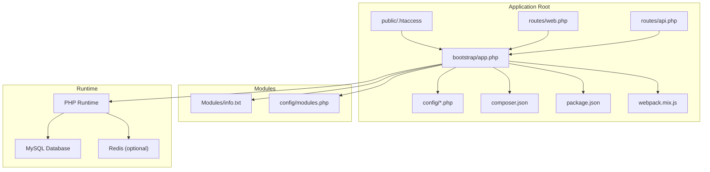
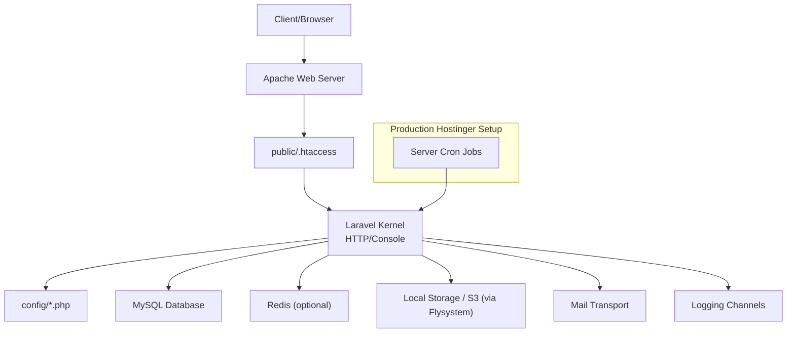
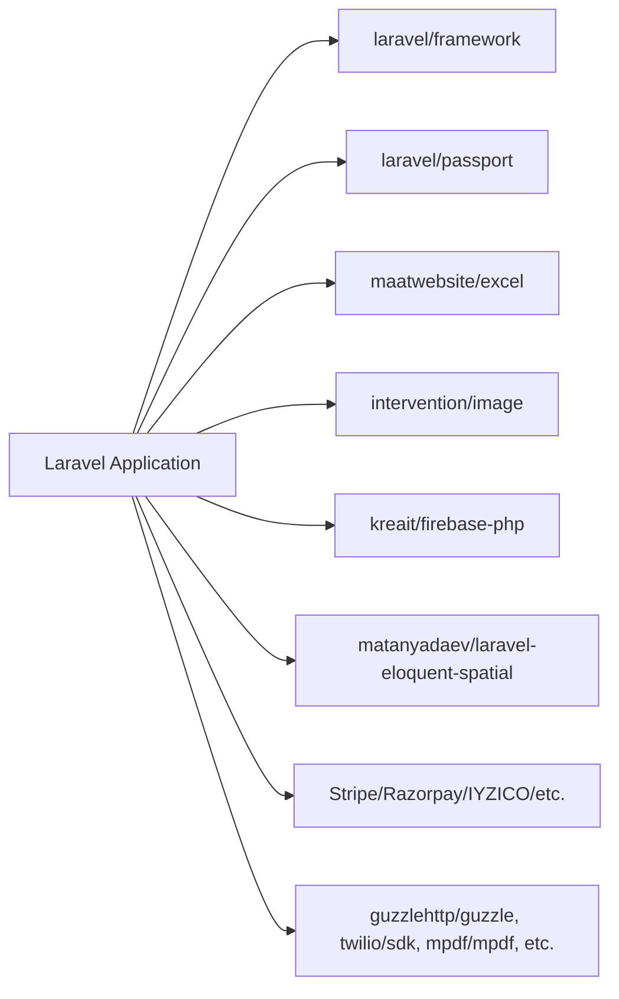

# Deployment and Configuration

<cite>
**Referenced Files in This Document**
- [composer.json](file://composer.json)
- [package.json](file://package.json)
- [DEPLOYMENT.md](file://DEPLOYMENT.md)
- [README.md](file://README.md)
- [.env.example](file://.env.example)
- [config/app.php](file://config/app.php)
- [config/database.php](file://config/database.php)
- [config/cache.php](file://config/cache.php)
- [config/session.php](file://config/session.php)
- [config/mail.php](file://config/mail.php)
- [config/queue.php](file://config/queue.php)
- [config/logging.php](file://config/logging.php)
- [bootstrap/app.php](file://bootstrap/app.php)
- [webpack.mix.js](file://webpack.mix.js)
- [public/.htaccess](file://public/.htaccess)
- [routes/web.php](file://routes/web.php)
- [routes/api.php](file://routes/api.php)
- [app/Console/Kernel.php](file://app/Console/Kernel.php)
- [config/modules.php](file://config/modules.php)
- [Modules/info.txt](file://Modules/info.txt)
</cite>

## Table of Contents
1. [Introduction](#introduction)
2. [Project Structure](#project-structure)
3. [Core Components](#core-components)
4. [Architecture Overview](#architecture-overview)
5. [Detailed Component Analysis](#detailed-component-analysis)
6. [Dependency Analysis](#dependency-analysis)
7. [Performance Considerations](#performance-considerations)
8. [Troubleshooting Guide](#troubleshooting-guide)
9. [Conclusion](#conclusion)
10. [Appendices](#appendices)

## Introduction
This document provides comprehensive deployment and configuration guidance for the backend application. It covers production deployment prerequisites, environment configuration, performance optimization, maintenance procedures, security considerations, backup and disaster recovery planning, and troubleshooting. The content is derived from the repository's configuration files, deployment guide, and Laravel ecosystem defaults.

## Project Structure
The backend is a Laravel application with modular extensions and asset compilation via Laravel Mix. Key characteristics:
- PHP runtime and extensions are defined in the project dependencies.
- Composer manages PHP packages and autoloads application and module namespaces.
- NPM scripts and Laravel Mix handle frontend asset builds.
- Configuration files under config/ define application behavior per environment.
- The deployment guide outlines a production-ready setup for shared hosting.

**Diagram sources**
- [public/.htaccess](file://public/.htaccess)
- [routes/web.php](file://routes/web.php)
- [routes/api.php](file://routes/api.php)
- [bootstrap/app.php](file://bootstrap/app.php)
- [config/app.php](file://config/app.php)
- [composer.json](file://composer.json)
- [package.json](file://package.json)
- [webpack.mix.js](file://webpack.mix.js)
- [Modules/info.txt](file://Modules/info.txt)
- [config/modules.php](file://config/modules.php)

**Section sources**
- [README.md](file://README.md)
- [DEPLOYMENT.md](file://DEPLOYMENT.md)
- [composer.json](file://composer.json)
- [package.json](file://package.json)
- [webpack.mix.js](file://webpack.mix.js)

## Core Components
- Application kernel and service providers: The application bootstraps through the HTTP and Console kernels, registering providers and facades defined in configuration.
- Database connectivity: Multi-connection support is configured, with MySQL as the primary connection and optional Redis for caching and queues.
- Caching and sessions: File-based caching and session storage are default, with options for Redis and database-backed stores.
- Queues: Synchronous processing is default; Redis and SQS are available for async processing.
- Logging: Stack-based logging with daily rotation and optional Slack/Papertrail integrations.
- Asset pipeline: Laravel Mix compiles JavaScript and CSS assets.

**Section sources**
- [bootstrap/app.php](file://bootstrap/app.php)
- [config/app.php](file://config/app.php)
- [config/database.php](file://config/database.php)
- [config/cache.php](file://config/cache.php)
- [config/session.php](file://config/session.php)
- [config/queue.php](file://config/queue.php)
- [config/logging.php](file://config/logging.php)
- [webpack.mix.js](file://webpack.mix.js)

## Architecture Overview
The deployment architecture centers on a shared hosting environment with Apache serving the Laravel application from the public directory. The application connects to a managed MySQL database and optionally Redis. Assets are served from the public directory, and scheduled tasks rely on server cron.

**Diagram sources**
- [public/.htaccess](file://public/.htaccess)
- [bootstrap/app.php](file://bootstrap/app.php)
- [config/database.php](file://config/database.php)
- [config/cache.php](file://config/cache.php)
- [config/session.php](file://config/session.php)
- [config/mail.php](file://config/mail.php)
- [config/logging.php](file://config/logging.php)
- [DEPLOYMENT.md](file://DEPLOYMENT.md)

## Detailed Component Analysis

### Environment Configuration
- Environment template: The repository includes a development-focused .env.example with local database, mailer, and cache settings.
- Production hardening: The deployment guide emphasizes disabling debug, setting a strong APP_KEY, enabling SSL, and adjusting PHP limits.
- Key variables: Application name, environment, URL, database credentials, cache/session drivers, mail transport, and queue connection.

Recommended production variables to set in .env:
- APP_ENV=production
- APP_DEBUG=false
- APP_KEY=<generated>
- APP_URL=https://yourdomain.com
- DB_* (host, database, username, password)
- CACHE_DRIVER=redis or file
- SESSION_DRIVER=redis or file
- QUEUE_CONNECTION=redis or database
- MAIL_* (transport, host, port, encryption, credentials)
- LOG_CHANNEL=daily or slack

**Section sources**
- [.env.example](file://.env.example)
- [DEPLOYMENT.md](file://DEPLOYMENT.md)
- [config/app.php](file://config/app.php)
- [config/database.php](file://config/database.php)
- [config/cache.php](file://config/cache.php)
- [config/session.php](file://config/session.php)
- [config/queue.php](file://config/queue.php)
- [config/mail.php](file://config/mail.php)
- [config/logging.php](file://config/logging.php)

### Server Requirements and Dependencies
- PHP version: The project targets PHP 8.2+.
- Required extensions: cURL, JSON, SimpleXML.
- PHP packages: Managed via Composer, including Laravel framework, Passport, payment SDKs, Excel export, Firebase, spatial, and more.
- Frontend toolchain: Node.js and npm for Laravel Mix; assets compiled to public/js and public/css.
- Optional external services: Redis, AWS S3 (Flysystem), Firebase, various payment gateways.

Installation steps (high level):
- Install PHP 8.2+ and required extensions.
- Install Composer and Node.js/npm.
- Clone repository and run composer install (optimized for production).
- Build assets with npm run production.
- Configure .env and generate APP_KEY.
- Run database migrations and seeders.
- Set storage symlink and cache configuration.
- Configure web server document root to public and enable .htaccess.

**Section sources**
- [composer.json](file://composer.json)
- [package.json](file://package.json)
- [webpack.mix.js](file://webpack.mix.js)
- [DEPLOYMENT.md](file://DEPLOYMENT.md)

### Deployment Strategies
- Development: Local environment with debug enabled, file-based cache/session, and SMTP mailer.
- Staging: Similar to production but with lower traffic, separate database, and minimal cache/queue backends.
- Production: Strict security settings, optimized cache/session drivers (preferably Redis), SSL enforcement, and robust logging.

Deployment steps (shared hosting):
- Provision Hostinger account with SSH access and MySQL database.
- SSH into the server and navigate to the public_html/public directory.
- Clone the repository, remove default files, and install Composer dependencies with --no-dev and --optimize-autoloader.
- Copy .env.example to .env, fill in production values, and generate APP_KEY.
- Create storage symlink, cache configuration, routes, and views.
- Run database migrations and seeders.
- Set file permissions for storage and bootstrap/cache.
- Configure Apache document root to public and PHP version/limits.
- Enable SSL certificate.
- Optionally set up cron for scheduler.

Update procedure:
- Pull latest changes, install dependencies, run migrations, and rebuild caches.

**Section sources**
- [DEPLOYMENT.md](file://DEPLOYMENT.md)
- [config/app.php](file://config/app.php)

### Performance Optimization
- PHP and web server tuning: Increase memory limit, execution time, and upload sizes as per the deployment guide.
- Caching: Prefer Redis for cache and session stores; ensure proper prefix configuration.
- Queue processing: Use Redis or database queues for background jobs; monitor failed jobs.
- Static assets: Compile with production mode and serve via CDN if applicable.
- Database: Use UTF8MB4 charset/collation and appropriate indexes; optimize queries and migrations.
- Sessions: Choose Redis or database-backed sessions for distributed deployments.

**Section sources**
- [DEPLOYMENT.md](file://DEPLOYMENT.md)
- [config/cache.php](file://config/cache.php)
- [config/session.php](file://config/session.php)
- [config/queue.php](file://config/queue.php)
- [config/database.php](file://config/database.php)
- [webpack.mix.js](file://webpack.mix.js)

### Monitoring Setup
- Logging: Daily rotation with configurable log levels; integrate Slack or Papertrail for alerts.
- Health checks: Use the documented API endpoint to verify deployment health.
- Metrics: Consider adding application-level metrics and server monitoring (outside this repository scope).

**Section sources**
- [config/logging.php](file://config/logging.php)
- [DEPLOYMENT.md](file://DEPLOYMENT.md)

### Security Considerations
- Disable debug in production and keep APP_KEY secret.
- Enforce HTTPS with a valid SSL certificate.
- Restrict file permissions and avoid committing .env to version control.
- Regularly update dependencies and apply security patches.
- Use strong database credentials and network-level firewall rules if available.

**Section sources**
- [DEPLOYMENT.md](file://DEPLOYMENT.md)
- [config/app.php](file://config/app.php)

### Backup Procedures and Disaster Recovery
- Database backups: Regular mysqldump exports of the production database.
- Application backups: Full repository snapshots including storage/app/public and configuration.
- Recovery plan: Restore database dump, redeploy application, re-run migrations if schema changed, and restore uploaded media.

Note: The repository includes installation/backup/database.sql and related versions for historical reference.

**Section sources**
- [DEPLOYMENT.md](file://DEPLOYMENT.md)
- [installation/backup/database.sql](file://installation/backup/database.sql)

### Maintenance Procedures
- Routine tasks: Clear and rebuild caches, rotate logs, prune expired sessions, and monitor queue backlogs.
- Scheduled tasks: Configure server cron to run Laravel scheduler for recurring jobs.
- Health checks: Periodically verify API endpoints and database connectivity.

**Section sources**
- [app/Console/Kernel.php](file://app/Console/Kernel.php)
- [DEPLOYMENT.md](file://DEPLOYMENT.md)

## Dependency Analysis
The application depends on Laravel and numerous third-party packages for payments, Excel export, image processing, Firebase, spatial data, and more. Composer handles autoloading and PSR-4 namespaces for app and Modules.

**Diagram sources**
- [composer.json](file://composer.json)

**Section sources**
- [composer.json](file://composer.json)

## Performance Considerations
- PHP runtime: Ensure sufficient memory and execution time for heavy operations.
- Database: Use UTF8MB4 and appropriate collations; maintain indexes; batch imports/exports.
- Cache: Redis-backed cache and sessions improve throughput; tune prefix and connection settings.
- Queues: Offload long-running tasks to Redis or database queues; monitor failed jobs.
- Assets: Minimize and combine assets; leverage browser caching.
- Logging: Use daily rotation and avoid verbose logging in production.

[No sources needed since this section provides general guidance]

## Troubleshooting Guide
Common issues and resolutions:
- 500 Internal Server Error: Check Laravel logs, ensure storage and bootstrap/cache permissions.
- Database connection failures: Verify .env credentials and database existence.
- Routes not working: Clear and rebuild route cache.
- Storage files inaccessible: Recreate storage symlink.
- Cron not executing: Confirm server cron is configured to run Laravel scheduler.

**Section sources**
- [DEPLOYMENT.md](file://DEPLOYMENT.md)

## Conclusion
This guide consolidates deployment, configuration, performance, and maintenance practices for the backend application. By following the outlined steps—setting up the environment, configuring .env, optimizing caching and queues, enforcing security, and establishing monitoring—you can reliably operate the application in development, staging, and production environments.

[No sources needed since this section summarizes without analyzing specific files]

## Appendices

### Environment Variables Reference
- Application: APP_NAME, APP_ENV, APP_KEY, APP_DEBUG, APP_URL
- Database: DB_CONNECTION, DB_HOST, DB_PORT, DB_DATABASE, DB_USERNAME, DB_PASSWORD
- Cache/Session/Queue: CACHE_DRIVER, SESSION_DRIVER, QUEUE_CONNECTION
- Mail: MAIL_MAILER, MAIL_HOST, MAIL_PORT, MAIL_USERNAME, MAIL_PASSWORD, MAIL_ENCRYPTION, MAIL_FROM_ADDRESS, MAIL_FROM_NAME
- Logging: LOG_CHANNEL, LOG_LEVEL, LOG_SLACK_WEBHOOK_URL
- Redis: REDIS_CLIENT, REDIS_HOST, REDIS_PASSWORD, REDIS_PORT, REDIS_DB, REDIS_CACHE_DB, REDIS_PREFIX
- AWS: AWS_ACCESS_KEY_ID, AWS_SECRET_ACCESS_KEY, AWS_DEFAULT_REGION, AWS_BUCKET
- Modules: Module-specific variables as defined in module configs

**Section sources**
- [.env.example](file://.env.example)
- [config/app.php](file://config/app.php)
- [config/database.php](file://config/database.php)
- [config/cache.php](file://config/cache.php)
- [config/session.php](file://config/session.php)
- [config/queue.php](file://config/queue.php)
- [config/mail.php](file://config/mail.php)
- [config/logging.php](file://config/logging.php)
- [config/modules.php](file://config/modules.php)