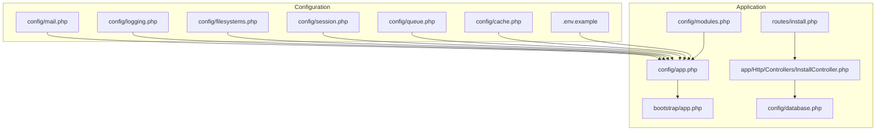
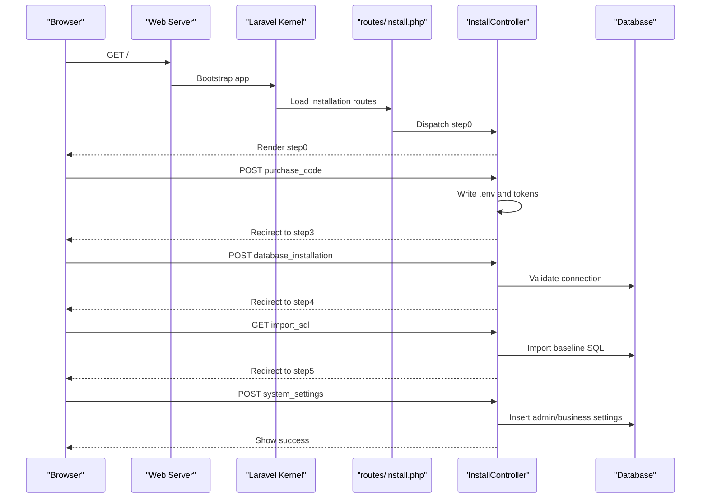
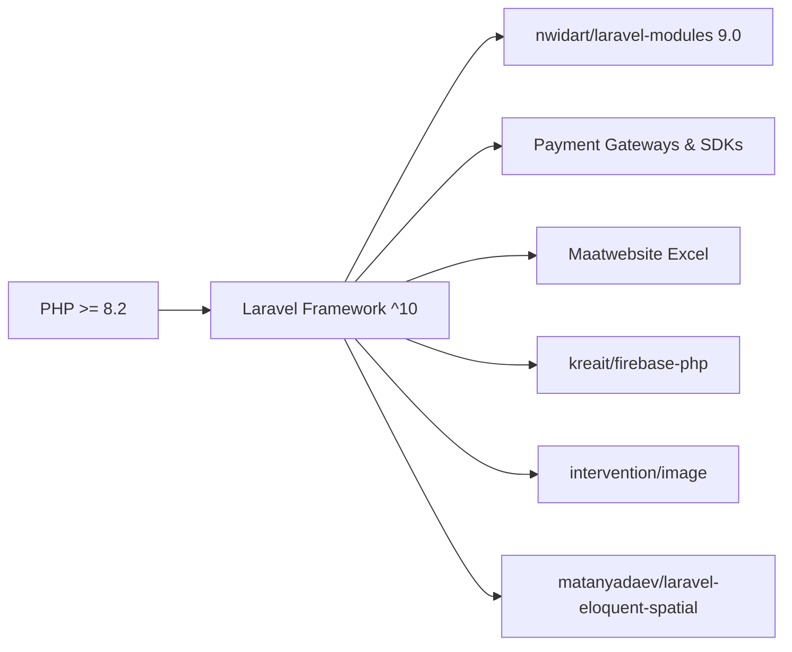

# Getting Started

<cite>
**Referenced Files in This Document**
- [composer.json](file://composer.json)
- [.env.example](file://.env.example)
- [config/app.php](file://config/app.php)
- [config/database.php](file://config/database.php)
- [config/modules.php](file://config/modules.php)
- [config/mail.php](file://config/mail.php)
- [config/cache.php](file://config/cache.php)
- [config/queue.php](file://config/queue.php)
- [config/session.php](file://config/session.php)
- [config/filesystems.php](file://config/filesystems.php)
- [config/logging.php](file://config/logging.php)
- [routes/install.php](file://routes/install.php)
- [app/Http/Controllers/InstallController.php](file://app/Http/Controllers/InstallController.php)
- [bootstrap/app.php](file://bootstrap/app.php)
- [DEPLOYMENT.md](file://DEPLOYMENT.md)
</cite>

## Table of Contents
1. [Introduction](#introduction)
2. [Project Structure](#project-structure)
3. [Core Components](#core-components)
4. [Architecture Overview](#architecture-overview)
5. [Detailed Component Analysis](#detailed-component-analysis)
6. [Dependency Analysis](#dependency-analysis)
7. [Performance Considerations](#performance-considerations)
8. [Troubleshooting Guide](#troubleshooting-guide)
9. [Conclusion](#conclusion)
10. [Appendices](#appendices)

## Introduction
This guide helps you install and run the Waddy Back platform locally and deploy it to production. It covers prerequisites, environment setup, database configuration, installation via the built-in installer or manual steps, environment variables, module initialization, and verification. It also includes troubleshooting tips and production deployment guidance tailored to shared hosting environments.

## Project Structure
Waddy Back is a Laravel 10 application with a modular architecture powered by the nwidart/laravel-modules package. The application ships with:
- A dedicated installation wizard for guided setup
- Multiple database migrations and seeders
- A set of modules (PlacesToVisit, TaxModule) under the Modules directory
- Extensive configuration for cache, queues, sessions, filesystems, logging, and mail

**Diagram sources**
- [config/app.php:1-243](file://config/app.php#L1-L243)
- [bootstrap/app.php:1-62](file://bootstrap/app.php#L1-L62)
- [routes/install.php:1-22](file://routes/install.php#L1-L22)
- [app/Http/Controllers/InstallController.php:1-260](file://app/Http/Controllers/InstallController.php#L1-L260)
- [config/database.php:1-148](file://config/database.php#L1-L148)
- [config/modules.php:1-278](file://config/modules.php#L1-L278)
- [.env.example:1-51](file://.env.example#L1-L51)
- [config/cache.php:1-108](file://config/cache.php#L1-L108)
- [config/queue.php:1-94](file://config/queue.php#L1-L94)
- [config/session.php:1-202](file://config/session.php#L1-L202)
- [config/filesystems.php:1-74](file://config/filesystems.php#L1-L74)
- [config/logging.php:1-106](file://config/logging.php#L1-L106)
- [config/mail.php:1-111](file://config/mail.php#L1-L111)

**Section sources**
- [config/app.php:1-243](file://config/app.php#L1-L243)
- [config/modules.php:1-278](file://config/modules.php#L1-L278)
- [routes/install.php:1-22](file://routes/install.php#L1-L22)
- [app/Http/Controllers/InstallController.php:1-260](file://app/Http/Controllers/InstallController.php#L1-L260)

## Core Components
- PHP and Laravel: Requires PHP 8.2+ and Laravel 10.x. See [composer.json:8-21](file://composer.json#L8-L21).
- Database: MySQL is configured by default; PostgreSQL and SQL Server are also supported. See [config/database.php:36-94](file://config/database.php#L36-L94).
- Modules: The nwidart/laravel-modules package manages feature modules. See [config/modules.php:1-278](file://config/modules.php#L1-L278).
- Installation Wizard: A guided installer exposes steps for purchase code, environment, database, SQL import, and system settings. See [routes/install.php:1-22](file://routes/install.php#L1-L22) and [app/Http/Controllers/InstallController.php:1-260](file://app/Http/Controllers/InstallController.php#L1-L260).
- Environment: The .env file drives runtime configuration. See [.env.example:1-51](file://.env.example#L1-L51).

**Section sources**
- [composer.json:8-21](file://composer.json#L8-L21)
- [config/database.php:36-94](file://config/database.php#L36-L94)
- [config/modules.php:1-278](file://config/modules.php#L1-L278)
- [routes/install.php:1-22](file://routes/install.php#L1-L22)
- [app/Http/Controllers/InstallController.php:1-260](file://app/Http/Controllers/InstallController.php#L1-L260)
- [.env.example:1-51](file://.env.example#L1-L51)

## Architecture Overview
The application boots through the Laravel kernel, loads providers from config/app.php, and routes requests via routes/install.php during installation. The installer writes a temporary .env, connects to the database, imports baseline SQL, and finalizes system settings.

**Diagram sources**
- [routes/install.php:1-22](file://routes/install.php#L1-L22)
- [app/Http/Controllers/InstallController.php:162-245](file://app/Http/Controllers/InstallController.php#L162-L245)
- [config/database.php:46-64](file://config/database.php#L46-L64)

**Section sources**
- [routes/install.php:1-22](file://routes/install.php#L1-L22)
- [app/Http/Controllers/InstallController.php:162-245](file://app/Http/Controllers/InstallController.php#L162-L245)
- [config/database.php:46-64](file://config/database.php#L46-L64)

## Detailed Component Analysis

### Prerequisites
- PHP: Minimum 8.2+. See [composer.json](file://composer.json#L8).
- Laravel: ^10.0. See [composer.json](file://composer.json#L21).
- Required PHP extensions: curl, json, simplexml. See [composer.json:9-11](file://composer.json#L9-L11).
- Optional extensions validated by installer: bcmath, ctype, mbstring, openssl, pdo, tokenizer, xml, zip, fileinfo, gd, sodium, pdo_mysql. See [app/Http/Controllers/InstallController.php:28-43](file://app/Http/Controllers/InstallController.php#L28-L43).

**Section sources**
- [composer.json:8-11](file://composer.json#L8-L11)
- [composer.json:21](file://composer.json#L21)
- [app/Http/Controllers/InstallController.php:28-43](file://app/Http/Controllers/InstallController.php#L28-L43)

### Local Installation (Guided Installer)
Follow these steps to install locally using the built-in installer:

1. Prepare environment
- Copy .env.example to .env and adjust APP_* and APP_MODE as needed. See [.env.example:1-7](file://.env.example#L1-L7).
- Ensure writable permissions for .env and RouteServiceProvider. See [app/Http/Controllers/InstallController.php:44-45](file://app/Http/Controllers/InstallController.php#L44-L45).

2. Start installation
- Visit the installer root route to begin. Routes are defined in [routes/install.php:6-11](file://routes/install.php#L6-L11).
- The installer validates PHP extensions and permissions in step1.

3. Purchase code and environment
- Submit purchase code and credentials in step2. The controller persists values and redirects to step3. See [app/Http/Controllers/InstallController.php:88-107](file://app/Http/Controllers/InstallController.php#L88-L107).

4. Database configuration
- Provide DB_HOST, DB_DATABASE, DB_USERNAME, DB_PASSWORD in step3.
- The controller writes a temporary .env and validates connectivity. See [app/Http/Controllers/InstallController.php:162-216](file://app/Http/Controllers/InstallController.php#L162-L216).

5. Import baseline SQL
- Import the bundled SQL dump. See [app/Http/Controllers/InstallController.php:218-230](file://app/Http/Controllers/InstallController.php#L218-L230).
- If the database is not empty, use force import to wipe and re-import. See [app/Http/Controllers/InstallController.php:232-245](file://app/Http/Controllers/InstallController.php#L232-L245).

6. Finalize system settings
- Complete admin and business settings in step4. The controller inserts admin records and default settings. See [app/Http/Controllers/InstallController.php:109-160](file://app/Http/Controllers/InstallController.php#L109-L160).

7. Verify
- Access the API endpoint to confirm configuration. See [DEPLOYMENT.md:190-197](file://DEPLOYMENT.md#L190-L197).

**Section sources**
- [.env.example:1-7](file://.env.example#L1-L7)
- [routes/install.php:6-11](file://routes/install.php#L6-L11)
- [app/Http/Controllers/InstallController.php:88-160](file://app/Http/Controllers/InstallController.php#L88-L160)
- [app/Http/Controllers/InstallController.php:162-245](file://app/Http/Controllers/InstallController.php#L162-L245)
- [DEPLOYMENT.md:190-197](file://DEPLOYMENT.md#L190-L197)

### Local Installation (Manual Steps)
If you prefer manual setup:

1. Install dependencies
- Composer install with optimized autoloader and no-dev in production-like environments. See [DEPLOYMENT.md:56-67](file://DEPLOYMENT.md#L56-L67).

2. Configure environment
- Copy .env.example to .env and set APP_ENV, APP_KEY, APP_URL, DB_* accordingly. See [.env.example:1-51](file://.env.example#L1-L51).

3. Generate application key
- Run key generation. See [DEPLOYMENT.md:109-113](file://DEPLOYMENT.md#L109-L113).

4. Storage and cache
- Create storage symlink and cache configuration/route/view. See [DEPLOYMENT.md:115-128](file://DEPLOYMENT.md#L115-L128).

5. Database migrations and seeding
- Run migrations and seeders. See [DEPLOYMENT.md:130-138](file://DEPLOYMENT.md#L130-L138).

6. Permissions
- Set storage and cache permissions. See [DEPLOYMENT.md:140-150](file://DEPLOYMENT.md#L140-L150).

7. Web server configuration
- Ensure document root points to public and enable URL rewriting. See [DEPLOYMENT.md:152-172](file://DEPLOYMENT.md#L152-L172).

8. PHP settings
- Set PHP version >= 8.1 and increase memory/limits as needed. See [DEPLOYMENT.md:173-183](file://DEPLOYMENT.md#L173-L183).

**Section sources**
- [DEPLOYMENT.md:56-67](file://DEPLOYMENT.md#L56-L67)
- [.env.example:1-51](file://.env.example#L1-L51)
- [DEPLOYMENT.md:109-113](file://DEPLOYMENT.md#L109-L113)
- [DEPLOYMENT.md:115-128](file://DEPLOYMENT.md#L115-L128)
- [DEPLOYMENT.md:130-138](file://DEPLOYMENT.md#L130-L138)
- [DEPLOYMENT.md:140-150](file://DEPLOYMENT.md#L140-L150)
- [DEPLOYMENT.md:152-172](file://DEPLOYMENT.md#L152-L172)
- [DEPLOYMENT.md:173-183](file://DEPLOYMENT.md#L173-L183)

### Environment Configuration and Variables
Key environment variables and their roles:
- Application
  - APP_NAME, APP_ENV, APP_KEY, APP_DEBUG, APP_URL, APP_MODE. See [.env.example:1-6](file://.env.example#L1-L6).
- Database
  - DB_CONNECTION, DB_HOST, DB_PORT, DB_DATABASE, DB_USERNAME, DB_PASSWORD. See [.env.example:11-16](file://.env.example#L11-L16).
- Cache, Sessions, Queues, Filesystems, Logging, Mail
  - CACHE_DRIVER, SESSION_DRIVER, QUEUE_CONNECTION, FILESYSTEM_DRIVER, LOG_CHANNEL, MAIL_MAILER, etc. See [.env.example:18-50](file://.env.example#L18-L50) and related configs:
    - [config/cache.php](file://config/cache.php#L18)
    - [config/session.php](file://config/session.php#L21)
    - [config/queue.php](file://config/queue.php#L16)
    - [config/filesystems.php](file://config/filesystems.php#L16)
    - [config/logging.php](file://config/logging.php#L20)
    - [config/mail.php](file://config/mail.php#L16)

Notes:
- The installer writes a temporary .env during step3 and validates write permissions. See [app/Http/Controllers/InstallController.php:162-216](file://app/Http/Controllers/InstallController.php#L162-L216).
- The application reads environment values via env() helpers in config files. See [config/app.php:18-124](file://config/app.php#L18-L124).

**Section sources**
- [.env.example:1-51](file://.env.example#L1-L51)
- [config/cache.php:18](file://config/cache.php#L18)
- [config/session.php:21](file://config/session.php#L21)
- [config/queue.php:16](file://config/queue.php#L16)
- [config/filesystems.php:16](file://config/filesystems.php#L16)
- [config/logging.php:20](file://config/logging.php#L20)
- [config/mail.php:16](file://config/mail.php#L16)
- [app/Http/Controllers/InstallController.php:162-216](file://app/Http/Controllers/InstallController.php#L162-L216)
- [config/app.php:18-124](file://config/app.php#L18-L124)

### Module Initialization
- Modules are managed under Modules/, with each module containing Config, Database, Entities, Http, Providers, Resources, Routes, Services, etc. See [config/modules.php:74-131](file://config/modules.php#L74-L131).
- Module activation status is persisted in modules_statuses.json. See [config/modules.php:267-274](file://config/modules.php#L267-L274).
- The installer finalizes system settings after SQL import, which includes initializing module-related business settings. See [app/Http/Controllers/InstallController.php:109-160](file://app/Http/Controllers/InstallController.php#L109-L160).

**Section sources**
- [config/modules.php:74-131](file://config/modules.php#L74-L131)
- [config/modules.php:267-274](file://config/modules.php#L267-L274)
- [app/Http/Controllers/InstallController.php:109-160](file://app/Http/Controllers/InstallController.php#L109-L160)

### Verification Steps
- API health check: Visit the API endpoint documented in the deployment guide. See [DEPLOYMENT.md:190-197](file://DEPLOYMENT.md#L190-L197).
- Database connectivity: Confirm the installer can connect to the database. See [app/Http/Controllers/InstallController.php:247-258](file://app/Http/Controllers/InstallController.php#L247-L258).
- Storage symlink: Ensure storage:link was executed. See [DEPLOYMENT.md:118-119](file://DEPLOYMENT.md#L118-L119).
- Cache and routes: Confirm cache:clear and route:cache were applied. See [DEPLOYMENT.md:121-124](file://DEPLOYMENT.md#L121-L124).

**Section sources**
- [DEPLOYMENT.md:190-197](file://DEPLOYMENT.md#L190-L197)
- [app/Http/Controllers/InstallController.php:247-258](file://app/Http/Controllers/InstallController.php#L247-L258)
- [DEPLOYMENT.md:118-119](file://DEPLOYMENT.md#L118-L119)
- [DEPLOYMENT.md:121-124](file://DEPLOYMENT.md#L121-L124)

## Dependency Analysis
The application depends on Laravel 10 and a set of packages for payments, Excel exports, Firebase, spatial data, and more. Composer metadata defines required PHP version and extensions.

**Diagram sources**
- [composer.json:8-39](file://composer.json#L8-L39)

**Section sources**
- [composer.json:8-39](file://composer.json#L8-L39)

## Performance Considerations
- Use production-grade cache and session drivers (e.g., database, redis) in production. See [config/cache.php](file://config/cache.php#L18), [config/session.php](file://config/session.php#L21).
- Prefer queued jobs for heavy tasks. See [config/queue.php](file://config/queue.php#L16).
- Tune PHP memory and execution time limits per hosting requirements. See [DEPLOYMENT.md:173-183](file://DEPLOYMENT.md#L173-L183).
- Clear and cache configuration in production. See [DEPLOYMENT.md:121-124](file://DEPLOYMENT.md#L121-L124).

[No sources needed since this section provides general guidance]

## Troubleshooting Guide
Common issues and resolutions:
- 500 Internal Server Error
  - Check Laravel logs and ensure storage/cache permissions are correct. See [DEPLOYMENT.md:237-247](file://DEPLOYMENT.md#L237-L247).
- Database connection error
  - Verify DB_* values in .env and database user privileges. See [DEPLOYMENT.md:249-254](file://DEPLOYMENT.md#L249-L254).
- Routes not working
  - Clear and rebuild route cache. See [DEPLOYMENT.md:255-261](file://DEPLOYMENT.md#L255-L261).
- Storage files inaccessible
  - Recreate storage symlink. See [DEPLOYMENT.md:263-268](file://DEPLOYMENT.md#L263-L268).
- Installer failures
  - Ensure .env and RouteServiceProvider are writable. See [app/Http/Controllers/InstallController.php:44-45](file://app/Http/Controllers/InstallController.php#L44-L45).
  - Validate database connectivity before proceeding. See [app/Http/Controllers/InstallController.php:247-258](file://app/Http/Controllers/InstallController.php#L247-L258).

**Section sources**
- [DEPLOYMENT.md:237-268](file://DEPLOYMENT.md#L237-L268)
- [app/Http/Controllers/InstallController.php:44-45](file://app/Http/Controllers/InstallController.php#L44-L45)
- [app/Http/Controllers/InstallController.php:247-258](file://app/Http/Controllers/InstallController.php#L247-L258)

## Conclusion
You now have the prerequisites, environment setup, and step-by-step instructions to install Waddy Back locally or deploy it to production. Use the guided installer for simplicity or the manual steps for full control. Verify your setup using the API endpoint and address issues using the troubleshooting section.

[No sources needed since this section summarizes without analyzing specific files]

## Appendices

### Production Deployment Checklist
- Hostinger-specific steps and commands are documented in [DEPLOYMENT.md:1-292](file://DEPLOYMENT.md#L1-L292). Follow the numbered steps for SSH, cloning, dependencies, environment, key generation, storage/linking, migrations, permissions, web server, PHP settings, SSL, and optional cron jobs.

**Section sources**
- [DEPLOYMENT.md:1-292](file://DEPLOYMENT.md#L1-L292)