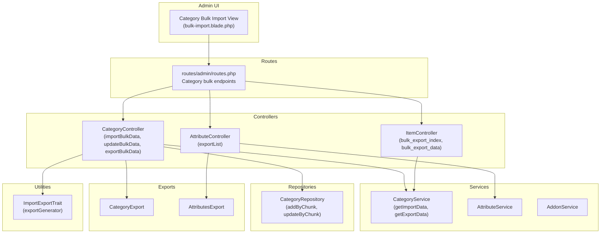
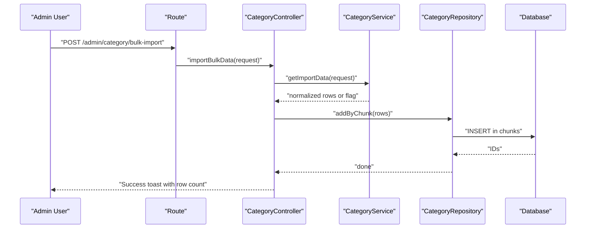
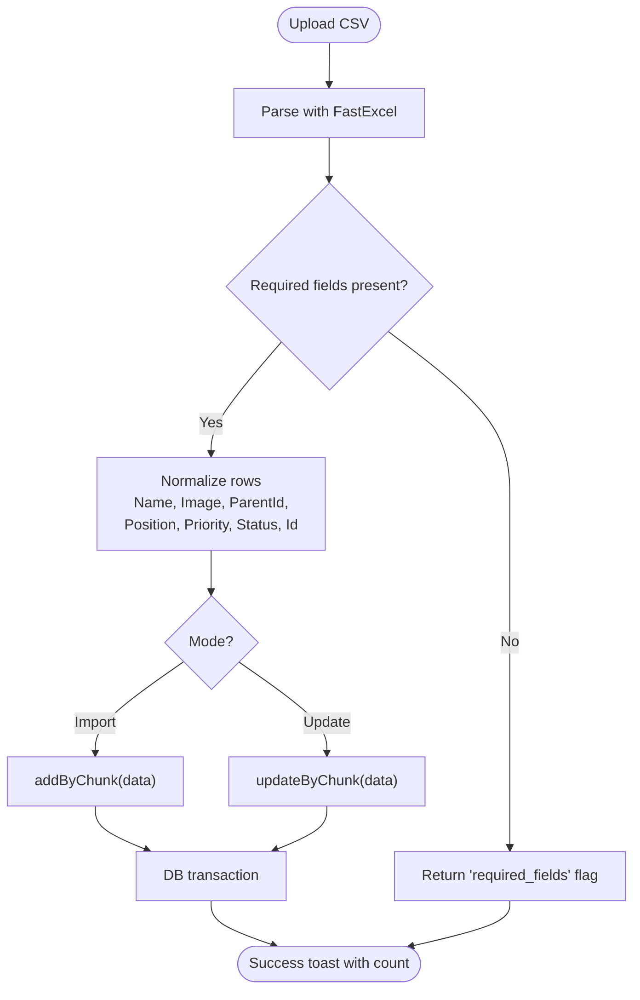
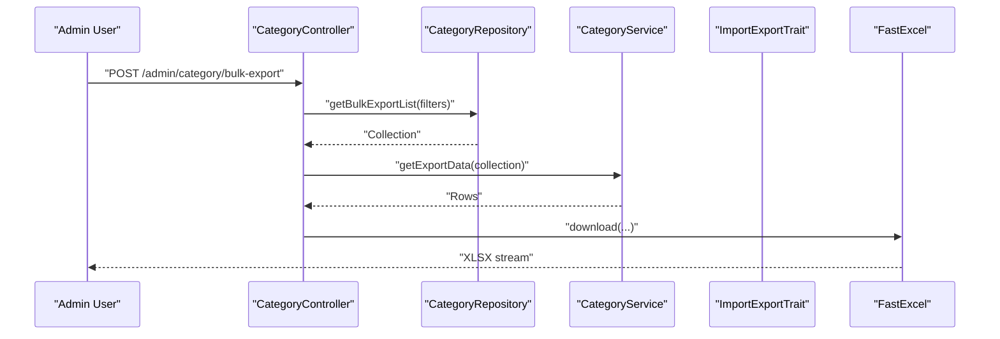
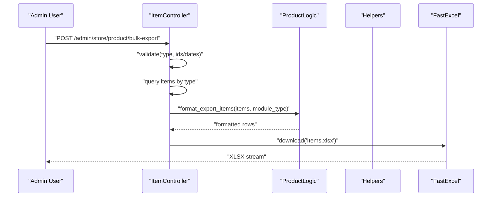
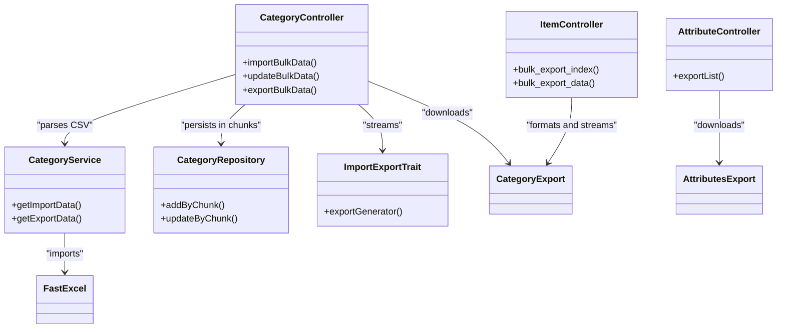

# Bulk Operations

<cite>
**Referenced Files in This Document**
- [CategoryController.php](file://app/Http/Controllers/Admin/Item/CategoryController.php)
- [CategoryService.php](file://app/Services/CategoryService.php)
- [CategoryRepository.php](file://app/Repositories/CategoryRepository.php)
- [routes.php](file://routes/admin/routes.php)
- [bulk-import.blade.php](file://resources/views/admin-views/category/bulk-import.blade.php)
- [ImportExportTrait.php](file://app/Traits/ImportExportTrait.php)
- [ItemController.php](file://app/Http/Controllers/Admin/ItemController.php)
- [AttributeController.php](file://app/Http/Controllers/Admin/Item/AttributeController.php)
- [AttributeService.php](file://app/Services/AttributeService.php)
- [AddonService.php](file://app/Services/AddonService.php)
- [CategoryExport.php](file://app/Exports/CategoryExport.php)
- [AttributesExport.php](file://app/Exports/AttributesExport.php)
- [ProductLogic.php](file://app/CentralLogics/ProductLogic.php)
- [Helpers.php](file://app/Helpers.php)
</cite>

## Table of Contents
1. [Introduction](#introduction)
2. [Project Structure](#project-structure)
3. [Core Components](#core-components)
4. [Architecture Overview](#architecture-overview)
5. [Detailed Component Analysis](#detailed-component-analysis)
6. [Dependency Analysis](#dependency-analysis)
7. [Performance Considerations](#performance-considerations)
8. [Troubleshooting Guide](#troubleshooting-guide)
9. [Conclusion](#conclusion)

## Introduction
This document explains bulk operations across categories, attributes, and products, including:
- Bulk imports and updates for categories and attributes
- Bulk exports for categories and attributes
- Bulk product exports by date range or ID range
- Validation rules, error handling, and progress tracking
- Batch processing limits and memory management
- Guidance for extending to products, addons, and other entities

It consolidates backend controllers, services, repositories, traits, and routes that implement these capabilities.

## Project Structure
Bulk operations are primarily implemented under:
- Admin controllers for categories and attributes
- Admin controller for product bulk exports
- Services that parse CSV and prepare data
- Repositories that persist data in chunks
- Routes that expose bulk import/update/export endpoints
- Blade templates for upload UI
- Traits for streaming exports

**Diagram sources**
- [routes.php:69-85](file://routes/admin/routes.php#L69-L85)
- [CategoryController.php:196-292](file://app/Http/Controllers/Admin/Item/CategoryController.php#L196-L292)
- [ItemController.php:1509-1533](file://app/Http/Controllers/Admin/ItemController.php#L1509-L1533)
- [AttributeController.php:78-90](file://app/Http/Controllers/Admin/Item/AttributeController.php#L78-L90)
- [CategoryService.php:47-99](file://app/Services/CategoryService.php#L47-L99)
- [AttributeService.php:13-18](file://app/Services/AttributeService.php#L13-L18)
- [AddonService.php:25-31](file://app/Services/AddonService.php#L25-L31)
- [CategoryRepository.php:36-53](file://app/Repositories/CategoryRepository.php#L36-L53)
- [CategoryExport.php](file://app/Exports/CategoryExport.php)
- [AttributesExport.php](file://app/Exports/AttributesExport.php)
- [ImportExportTrait.php:7-13](file://app/Traits/ImportExportTrait.php#L7-L13)
- [bulk-import.blade.php:122-140](file://resources/views/admin-views/category/bulk-import.blade.php#L122-L140)

**Section sources**
- [routes.php:69-85](file://routes/admin/routes.php#L69-L85)
- [CategoryController.php:196-292](file://app/Http/Controllers/Admin/Item/CategoryController.php#L196-L292)
- [ItemController.php:1509-1533](file://app/Http/Controllers/Admin/ItemController.php#L1509-L1533)
- [AttributeController.php:78-90](file://app/Http/Controllers/Admin/Item/AttributeController.php#L78-L90)
- [CategoryService.php:47-99](file://app/Services/CategoryService.php#L47-L99)
- [CategoryRepository.php:36-53](file://app/Repositories/CategoryRepository.php#L36-L53)
- [ImportExportTrait.php:7-13](file://app/Traits/ImportExportTrait.php#L7-L13)
- [bulk-import.blade.php:122-140](file://resources/views/admin-views/category/bulk-import.blade.php#L122-L140)

## Core Components
- Category bulk import and update:
  - Controller actions accept CSV uploads, delegate parsing to CategoryService, and persist via CategoryRepository in chunks.
  - Supports “Upload New Data” and “Update Existing Data” modes.
- Category bulk export:
  - Streams filtered lists and exports to XLSX via FastExcel.
- Product bulk export:
  - Admin ItemController supports date-wise and ID-wise exports to XLSX.
- Attribute export:
  - AttributeController exports attributes to CSV/XLSX via dedicated export classes.
- Utilities:
  - ImportExportTrait provides a generator-based export streamer to reduce memory usage.

**Section sources**
- [CategoryController.php:201-272](file://app/Http/Controllers/Admin/Item/CategoryController.php#L201-L272)
- [CategoryService.php:47-99](file://app/Services/CategoryService.php#L47-L99)
- [CategoryRepository.php:36-53](file://app/Repositories/CategoryRepository.php#L36-L53)
- [ItemController.php:1509-1533](file://app/Http/Controllers/Admin/ItemController.php#L1509-L1533)
- [AttributeController.php:78-90](file://app/Http/Controllers/Admin/Item/AttributeController.php#L78-L90)
- [ImportExportTrait.php:7-13](file://app/Traits/ImportExportTrait.php#L7-L13)

## Architecture Overview
The bulk operation pipeline follows a layered pattern:
- HTTP requests reach controllers
- Controllers validate and delegate to services for CSV parsing and data shaping
- Services return normalized arrays ready for persistence
- Repositories persist data in batches to avoid memory spikes
- Exports use generators and streaming libraries for large datasets

**Diagram sources**
- [routes.php:70-71](file://routes/admin/routes.php#L70-L71)
- [CategoryController.php:201-227](file://app/Http/Controllers/Admin/Item/CategoryController.php#L201-L227)
- [CategoryService.php:47-82](file://app/Services/CategoryService.php#L47-L82)
- [CategoryRepository.php:36-47](file://app/Repositories/CategoryRepository.php#L36-L47)

## Detailed Component Analysis

### Category Bulk Import and Update
- CSV parsing:
  - Uses FastExcel to import the uploaded file.
  - Validates required fields and module context.
- Data normalization:
  - Builds arrays with keys like Name, Image, ParentId, Position, Priority, Status, Id (for updates).
- Persistence:
  - addByChunk and updateByChunk split arrays into chunks of 100 to reduce memory pressure.
  - Transactions wrap the operation to ensure atomicity.
- UI:
  - The bulk import view presents “Upload New Data” and “Update Existing Data” radio options.

**Diagram sources**
- [CategoryService.php:47-82](file://app/Services/CategoryService.php#L47-L82)
- [CategoryRepository.php:36-53](file://app/Repositories/CategoryRepository.php#L36-L53)
- [CategoryController.php:201-255](file://app/Http/Controllers/Admin/Item/CategoryController.php#L201-L255)
- [bulk-import.blade.php:122-140](file://resources/views/admin-views/category/bulk-import.blade.php#L122-L140)

**Section sources**
- [CategoryController.php:201-255](file://app/Http/Controllers/Admin/Item/CategoryController.php#L201-L255)
- [CategoryService.php:47-82](file://app/Services/CategoryService.php#L47-L82)
- [CategoryRepository.php:36-53](file://app/Repositories/CategoryRepository.php#L36-L53)
- [bulk-import.blade.php:122-140](file://resources/views/admin-views/category/bulk-import.blade.php#L122-L140)

### Category Bulk Export
- Endpoint:
  - GET and POST endpoints render and process bulk export views.
- Data retrieval:
  - Controller fetches filtered lists from repository.
- Streaming:
  - Uses ImportExportTrait generator and FastExcel to stream XLSX downloads.

**Diagram sources**
- [CategoryController.php:257-272](file://app/Http/Controllers/Admin/Item/CategoryController.php#L257-L272)
- [CategoryService.php:84-99](file://app/Services/CategoryService.php#L84-L99)
- [ImportExportTrait.php:7-13](file://app/Traits/ImportExportTrait.php#L7-L13)

**Section sources**
- [CategoryController.php:257-272](file://app/Http/Controllers/Admin/Item/CategoryController.php#L257-L272)
- [CategoryService.php:84-99](file://app/Services/CategoryService.php#L84-L99)
- [ImportExportTrait.php:7-13](file://app/Traits/ImportExportTrait.php#L7-L13)

### Product Bulk Export (Admin)
- Endpoint:
  - GET renders export UI; POST handles date-wise or ID-wise exports.
- Validation:
  - Requires type-specific fields (start_id/end_id or from_date/to_date).
- Formatting:
  - Uses ProductLogic formatting and Helpers export generator before download.

**Diagram sources**
- [ItemController.php:1509-1533](file://app/Http/Controllers/Admin/ItemController.php#L1509-L1533)
- [ProductLogic.php](file://app/CentralLogics/ProductLogic.php)
- [Helpers.php](file://app/Helpers.php)

**Section sources**
- [ItemController.php:1509-1533](file://app/Http/Controllers/Admin/ItemController.php#L1509-L1533)

### Attribute Export
- Endpoint:
  - AttributeController exportList returns CSV/XLSX using AttributesExport.
- Filtering:
  - Supports search and type selection.

**Section sources**
- [AttributeController.php:78-90](file://app/Http/Controllers/Admin/Item/AttributeController.php#L78-L90)
- [AttributesExport.php](file://app/Exports/AttributesExport.php)

### Addon Import Template
- AddonService demonstrates CSV import pattern:
  - Imports via FastExcel and returns normalized rows or a wrong_format flag.
- Extending to addons:
  - Follow CategoryService.getImportData pattern to define column mapping and validation.

**Section sources**
- [AddonService.php:25-31](file://app/Services/AddonService.php#L25-L31)

## Dependency Analysis
- Controllers depend on:
  - Services for CSV parsing and data shaping
  - Repositories for persistence
  - Exports for report generation
- Services depend on:
  - FastExcel for CSV import
  - Config for module context
- Repositories depend on:
  - Chunking and transactions for performance and reliability
- Trait provides:
  - Generator-based export streaming

**Diagram sources**
- [CategoryController.php:201-272](file://app/Http/Controllers/Admin/Item/CategoryController.php#L201-L272)
- [CategoryService.php:47-99](file://app/Services/CategoryService.php#L47-L99)
- [CategoryRepository.php:36-53](file://app/Repositories/CategoryRepository.php#L36-L53)
- [ItemController.php:1509-1533](file://app/Http/Controllers/Admin/ItemController.php#L1509-L1533)
- [AttributeController.php:78-90](file://app/Http/Controllers/Admin/Item/AttributeController.php#L78-L90)
- [ImportExportTrait.php:7-13](file://app/Traits/ImportExportTrait.php#L7-L13)
- [CategoryExport.php](file://app/Exports/CategoryExport.php)
- [AttributesExport.php](file://app/Exports/AttributesExport.php)

**Section sources**
- [CategoryController.php:201-272](file://app/Http/Controllers/Admin/Item/CategoryController.php#L201-L272)
- [CategoryService.php:47-99](file://app/Services/CategoryService.php#L47-L99)
- [CategoryRepository.php:36-53](file://app/Repositories/CategoryRepository.php#L36-L53)
- [ItemController.php:1509-1533](file://app/Http/Controllers/Admin/ItemController.php#L1509-L1533)
- [AttributeController.php:78-90](file://app/Http/Controllers/Admin/Item/AttributeController.php#L78-L90)
- [ImportExportTrait.php:7-13](file://app/Traits/ImportExportTrait.php#L7-L13)

## Performance Considerations
- Chunked writes:
  - CategoryRepository adds and updates in chunks of 100 to limit memory usage and improve throughput.
- Transactions:
  - Wrapping bulk operations ensures rollback on failure.
- Streaming exports:
  - ImportExportTrait’s generator reduces peak memory during large downloads.
- CSV parsing:
  - FastExcel is efficient for reading structured spreadsheets.
- Recommendations:
  - For very large datasets, consider:
    - Increasing chunk size gradually (e.g., 500) after testing stability
    - Using database-level upserts or batch insert bindings if supported
    - Monitoring memory and CPU during long-running jobs
    - Offloading heavy tasks to queued jobs with progress callbacks

**Section sources**
- [CategoryRepository.php:36-53](file://app/Repositories/CategoryRepository.php#L36-L53)
- [CategoryController.php:215-223](file://app/Http/Controllers/Admin/Item/CategoryController.php#L215-L223)
- [ImportExportTrait.php:7-13](file://app/Traits/ImportExportTrait.php#L7-L13)

## Troubleshooting Guide
- Wrong file format:
  - If CSV parsing fails, the service returns a wrong_format flag; controller displays an error toast and aborts the operation.
- Required fields missing:
  - If required fields are empty, the service returns a required_fields flag; controller prompts the user to fill all required fields.
- Import failures:
  - On exceptions during chunked inserts/updates, the controller rolls back the transaction and shows a failure toast.
- Export issues:
  - Ensure filters are valid (e.g., date range or ID range) for product exports.
  - Confirm module context is set for category exports.

**Section sources**
- [CategoryController.php:205-223](file://app/Http/Controllers/Admin/Item/CategoryController.php#L205-L223)
- [CategoryService.php:49-60](file://app/Services/CategoryService.php#L49-L60)
- [ItemController.php:1516-1522](file://app/Http/Controllers/Admin/ItemController.php#L1516-L1522)

## Conclusion
The system provides robust, chunked, and streamed bulk operations for categories and attributes, plus flexible product exports. By leveraging services for CSV parsing, repositories for batch persistence, and traits for memory-efficient exports, the platform scales to large datasets while maintaining reliability and usability. Extending these patterns enables bulk imports for addons and other entities, and supports future enhancements like progress tracking and queued processing.