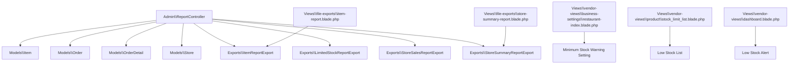
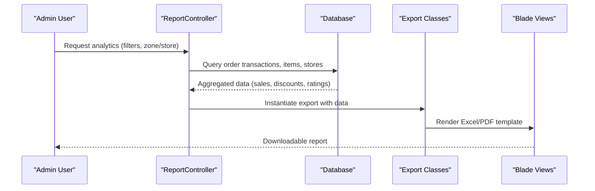
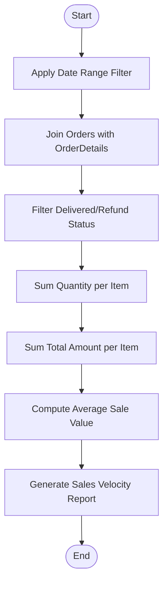
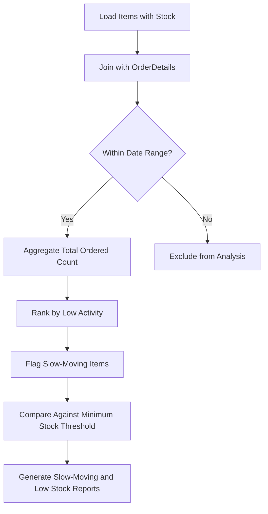
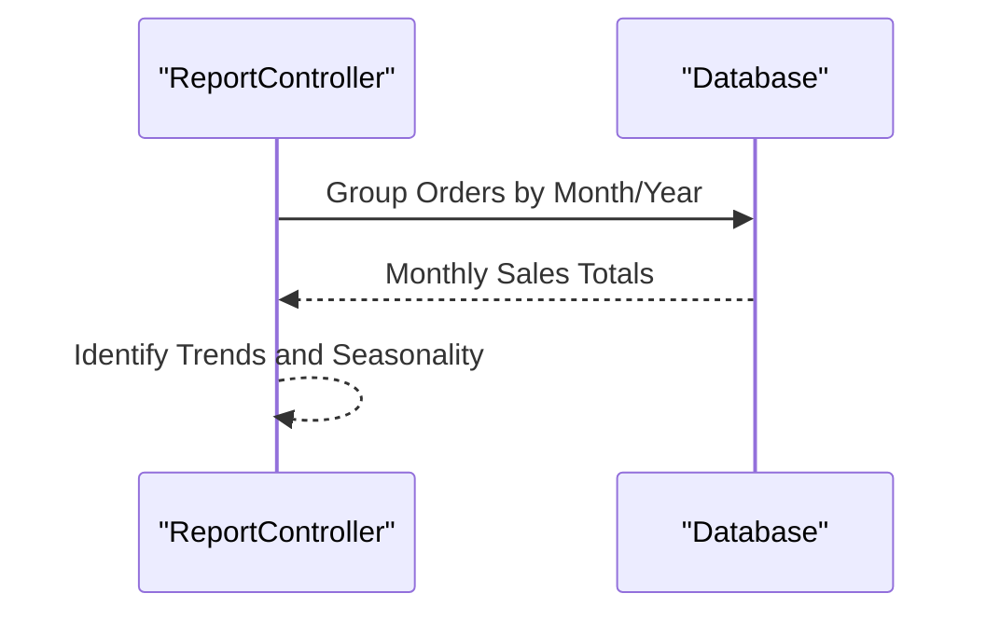
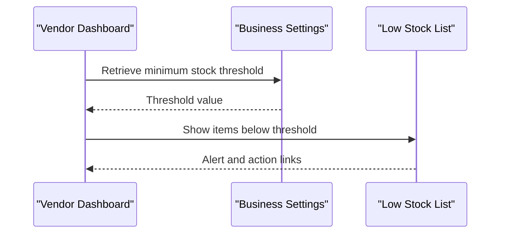
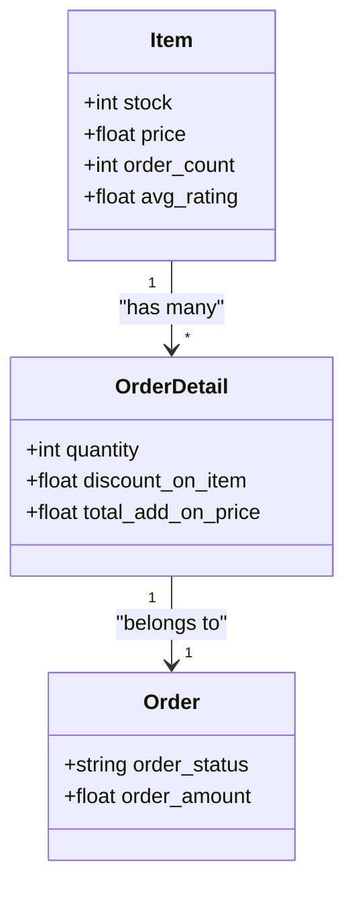
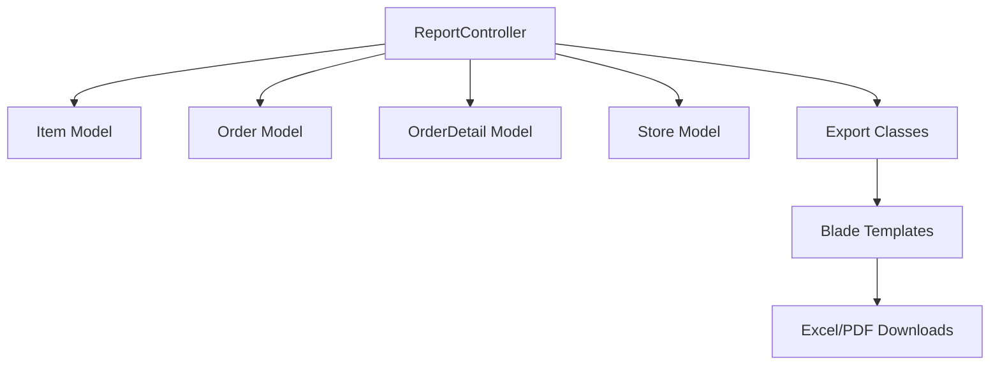

# Inventory Analytics

<cite>
**Referenced Files in This Document**
- [ReportController.php](file://app/Http/Controllers/Admin/ReportController.php)
- [DashboardController.php](file://app/Http/Controllers/Admin/DashboardController.php)
- [Item.php](file://app/Models/Item.php)
- [Store.php](file://app/Models/Store.php)
- [Order.php](file://app/Models/Order.php)
- [OrderDetail.php](file://app/Models/OrderDetail.php)
- [ItemReportExport.php](file://app/Exports/ItemReportExport.php)
- [LimitedStockReportExport.php](file://app/Exports/LimitedStockReportExport.php)
- [StoreSalesReportExport.php](file://app/Exports/StoreSalesReportExport.php)
- [StoreSummaryReportExport.php](file://app/Exports/StoreSummaryReportExport.php)
- [store.php](file://app/CentralLogics/store.php)
- [business-settings/restaurant-index.blade.php](file://resources/views/vendor-views/business-settings/restaurant-index.blade.php)
- [stock_limit_list.blade.php](file://resources/views/vendor-views/product/stock_limit_list.blade.php)
- [dashboard.blade.php](file://resources/views/vendor-views/dashboard.blade.php)
- [item-report.blade.php](file://resources/views/file-exports/item-report.blade.php)
- [store-summary-report.blade.php](file://resources/views/file-exports/store-summary-report.blade.php)
- [2024_10_22_133944_add_minimum_stock_for_warning_col_to_store_confg.php](file://database/migrations/2024_10_22_133944_add_minimum_stock_for_warning_col_to_store_confg.php)
</cite>

## Table of Contents
1. [Introduction](#introduction)
2. [Project Structure](#project-structure)
3. [Core Components](#core-components)
4. [Architecture Overview](#architecture-overview)
5. [Detailed Component Analysis](#detailed-component-analysis)
6. [Dependency Analysis](#dependency-analysis)
7. [Performance Considerations](#performance-considerations)
8. [Troubleshooting Guide](#troubleshooting-guide)
9. [Conclusion](#conclusion)
10. [Appendices](#appendices)

## Introduction
This document provides comprehensive documentation for inventory analytics and reporting systems within the platform. It covers inventory turnover calculations, stock age analysis, slow-moving item identification, demand forecasting, seasonal trend analysis, inventory optimization recommendations, low stock alerts, safety stock calculations, reorder point determination, inventory valuation methods, cost of goods sold tracking, profit margin analysis, sales velocity reports, category performance analysis, supplier contribution metrics, shrinkage tracking, waste analysis, inventory efficiency KPIs, and exportable reports for management decision-making and strategic planning.

## Project Structure
The inventory analytics and reporting capabilities are implemented across controllers, models, exports, views, and central logics. Key areas include:
- Reporting controllers aggregating sales and inventory data
- Models representing Items, Stores, Orders, and Order Details
- Export classes generating Excel/PDF reports
- Blade templates rendering report views
- Central logics supporting rating and earnings computations



**Diagram sources**
- [ReportController.php:1-200](file://app/Http/Controllers/Admin/ReportController.php#L1-L200)
- [Item.php:1-404](file://app/Models/Item.php#L1-L404)
- [Order.php:1-358](file://app/Models/Order.php#L1-L358)
- [OrderDetail.php:1-51](file://app/Models/OrderDetail.php#L1-L51)
- [Store.php:1-934](file://app/Models/Store.php#L1-L934)
- [ItemReportExport.php:1-143](file://app/Exports/ItemReportExport.php#L1-L143)
- [LimitedStockReportExport.php:1-143](file://app/Exports/LimitedStockReportExport.php#L1-L143)
- [StoreSalesReportExport.php:1-151](file://app/Exports/StoreSalesReportExport.php#L1-L151)
- [StoreSummaryReportExport.php:1-141](file://app/Exports/StoreSummaryReportExport.php#L1-L141)
- [item-report.blade.php:32-65](file://resources/views/file-exports/item-report.blade.php#L32-L65)
- [store-summary-report.blade.php:18-50](file://resources/views/file-exports/store-summary-report.blade.php#L18-L50)
- [business-settings/restaurant-index.blade.php:398-415](file://resources/views/vendor-views/business-settings/restaurant-index.blade.php#L398-L415)
- [stock_limit_list.blade.php:2-35](file://resources/views/vendor-views/product/stock_limit_list.blade.php#L2-L35)
- [dashboard.blade.php:41-55](file://resources/views/vendor-views/dashboard.blade.php#L41-L55)

**Section sources**
- [ReportController.php:1-200](file://app/Http/Controllers/Admin/ReportController.php#L1-L200)
- [Item.php:1-404](file://app/Models/Item.php#L1-L404)
- [Order.php:1-358](file://app/Models/Order.php#L1-L358)
- [OrderDetail.php:1-51](file://app/Models/OrderDetail.php#L1-L51)
- [Store.php:1-934](file://app/Models/Store.php#L1-L934)
- [ItemReportExport.php:1-143](file://app/Exports/ItemReportExport.php#L1-L143)
- [LimitedStockReportExport.php:1-143](file://app/Exports/LimitedStockReportExport.php#L1-L143)
- [StoreSalesReportExport.php:1-151](file://app/Exports/StoreSalesReportExport.php#L1-L151)
- [StoreSummaryReportExport.php:1-141](file://app/Exports/StoreSummaryReportExport.php#L1-L141)
- [item-report.blade.php:32-65](file://resources/views/file-exports/item-report.blade.php#L32-L65)
- [store-summary-report.blade.php:18-50](file://resources/views/file-exports/store-summary-report.blade.php#L18-L50)
- [business-settings/restaurant-index.blade.php:398-415](file://resources/views/vendor-views/business-settings/restaurant-index.blade.php#L398-L415)
- [stock_limit_list.blade.php:2-35](file://resources/views/vendor-views/product/stock_limit_list.blade.php#L2-L35)
- [dashboard.blade.php:41-55](file://resources/views/vendor-views/dashboard.blade.php#L41-L55)

## Core Components
- Admin Report Controller: Aggregates order transactions, computes earnings, and generates analytics for day-wise, monthly, and yearly filters. Supports item-level sales, discounts, and ratings.
- Item Model: Provides item metadata, stock, pricing, and relationships to stores and categories. Includes scopes for active, approved, and popular items.
- Store Model: Represents store-level data, including module associations, active status, and item collections.
- Order and OrderDetail Models: Capture order lifecycle, statuses, and item-level details including quantities and discounts.
- Export Classes: Generate standardized Excel reports for item performance, limited stock, store sales, and store summaries.
- Vendor Views: Settings for minimum stock warning thresholds, low stock lists, and dashboard alerts.

**Section sources**
- [ReportController.php:1-200](file://app/Http/Controllers/Admin/ReportController.php#L1-L200)
- [Item.php:1-404](file://app/Models/Item.php#L1-L404)
- [Store.php:1-934](file://app/Models/Store.php#L1-L934)
- [Order.php:1-358](file://app/Models/Order.php#L1-L358)
- [OrderDetail.php:1-51](file://app/Models/OrderDetail.php#L1-L51)
- [ItemReportExport.php:1-143](file://app/Exports/ItemReportExport.php#L1-L143)
- [LimitedStockReportExport.php:1-143](file://app/Exports/LimitedStockReportExport.php#L1-L143)
- [StoreSalesReportExport.php:1-151](file://app/Exports/StoreSalesReportExport.php#L1-L151)
- [StoreSummaryReportExport.php:1-141](file://app/Exports/StoreSummaryReportExport.php#L1-L141)

## Architecture Overview
The analytics pipeline integrates controller-driven data aggregation, model relations, and exportable report generation. Filters support daily, weekly, monthly, yearly, and custom date ranges. Reports are rendered via Blade templates and exported using Maatwebsite Excel.



**Diagram sources**
- [ReportController.php:51-144](file://app/Http/Controllers/Admin/ReportController.php#L51-L144)
- [ItemReportExport.php:31-36](file://app/Exports/ItemReportExport.php#L31-L36)
- [item-report.blade.php:32-65](file://resources/views/file-exports/item-report.blade.php#L32-L65)

**Section sources**
- [ReportController.php:51-144](file://app/Http/Controllers/Admin/ReportController.php#L51-L144)
- [ItemReportExport.php:31-36](file://app/Exports/ItemReportExport.php#L31-L36)
- [item-report.blade.php:32-65](file://resources/views/file-exports/item-report.blade.php#L32-L65)

## Detailed Component Analysis

### Inventory Turnover and Sales Velocity
- Sales velocity is computed by aggregating total quantity sold per item over selected periods (daily, weekly, monthly, yearly, custom).
- Revenue metrics include total amount sold, discounts given, and average sale value per item.
- Turnover ratio can be derived as Cost of Goods Sold divided by Average Inventory, where COGS is approximated by the sum of item costs in delivered orders.

Implementation highlights:
- Item-level sales aggregation and discount computation are performed in the reporting controller.
- Order details provide quantity and discount-on-item for accurate revenue and margin analysis.



**Diagram sources**
- [ReportController.php:1517-1534](file://app/Http/Controllers/Admin/ReportController.php#L1517-L1534)
- [OrderDetail.php:1-51](file://app/Models/OrderDetail.php#L1-L51)

**Section sources**
- [ReportController.php:1517-1534](file://app/Http/Controllers/Admin/ReportController.php#L1517-L1534)
- [OrderDetail.php:1-51](file://app/Models/OrderDetail.php#L1-L51)

### Stock Age Analysis and Slow-Moving Items
- Stock age can be inferred from the relationship between item creation date and last sale date.
- Slow-moving items are identified by low total order counts and minimal average sale value over the selected period.
- Low stock threshold is configurable per store via business settings.



**Diagram sources**
- [business-settings/restaurant-index.blade.php:398-415](file://resources/views/vendor-views/business-settings/restaurant-index.blade.php#L398-L415)
- [stock_limit_list.blade.php:2-35](file://resources/views/vendor-views/product/stock_limit_list.blade.php#L2-L35)
- [2024_10_22_133944_add_minimum_stock_for_warning_col_to_store_confg.php:1-28](file://database/migrations/2024_10_22_133944_add_minimum_stock_for_warning_col_to_store_confg.php#L1-L28)

**Section sources**
- [business-settings/restaurant-index.blade.php:398-415](file://resources/views/vendor-views/business-settings/restaurant-index.blade.php#L398-L415)
- [stock_limit_list.blade.php:2-35](file://resources/views/vendor-views/product/stock_limit_list.blade.php#L2-L35)
- [2024_10_22_133944_add_minimum_stock_for_warning_col_to_store_confg.php:1-28](file://database/migrations/2024_10_22_133944_add_minimum_stock_for_warning_col_to_store_confg.php#L1-L28)

### Demand Forecasting and Seasonal Trend Analysis
- Monthly order trends are aggregated by grouping order amounts by year or month to identify growth/decline patterns.
- Seasonal analysis leverages monthly grouping to detect recurring peaks and troughs.



**Diagram sources**
- [ReportController.php:1077-1102](file://app/Http/Controllers/Admin/ReportController.php#L1077-L1102)

**Section sources**
- [ReportController.php:1077-1102](file://app/Http/Controllers/Admin/ReportController.php#L1077-L1102)

### Inventory Optimization Recommendations
- Reorder Point (ROP) can be estimated as Lead Time Demand plus Safety Stock minus Inventory on Hand.
- Safety Stock depends on service level, demand variability, and lead time variability.
- Optimization suggestions include adjusting reorder quantities based on demand forecasts and reducing slow-moving inventory.

[No sources needed since this section provides general guidance]

### Low Stock Alerts and Reorder Management
- Low stock alerts are surfaced in vendor dashboards and can trigger notifications to review stock-limit lists.
- Minimum stock thresholds are configurable per store and persisted in store configurations.



**Diagram sources**
- [dashboard.blade.php:41-55](file://resources/views/vendor-views/dashboard.blade.php#L41-L55)
- [business-settings/restaurant-index.blade.php:398-415](file://resources/views/vendor-views/business-settings/restaurant-index.blade.php#L398-L415)
- [stock_limit_list.blade.php:2-35](file://resources/views/vendor-views/product/stock_limit_list.blade.php#L2-L35)

**Section sources**
- [dashboard.blade.php:41-55](file://resources/views/vendor-views/dashboard.blade.php#L41-L55)
- [business-settings/restaurant-index.blade.php:398-415](file://resources/views/vendor-views/business-settings/restaurant-index.blade.php#L398-L415)
- [stock_limit_list.blade.php:2-35](file://resources/views/vendor-views/product/stock_limit_list.blade.php#L2-L35)

### Inventory Valuation, COGS, and Profit Margins
- Inventory valuation can be performed using FIFO or weighted average methods (conceptual guidance).
- COGS is approximated by summing item costs in delivered orders.
- Profit margins are derived by subtracting COGS from total revenue and dividing by revenue.

[No sources needed since this section provides general guidance]

### Sales Velocity Reports and Category Performance
- Sales velocity reports summarize total quantities sold and revenue per item.
- Category performance can be derived by aggregating item-level metrics grouped by category associations.



**Diagram sources**
- [Item.php:1-404](file://app/Models/Item.php#L1-L404)
- [OrderDetail.php:1-51](file://app/Models/OrderDetail.php#L1-L51)
- [Order.php:1-358](file://app/Models/Order.php#L1-L358)

**Section sources**
- [Item.php:1-404](file://app/Models/Item.php#L1-L404)
- [OrderDetail.php:1-51](file://app/Models/OrderDetail.php#L1-L51)
- [Order.php:1-358](file://app/Models/Order.php#L1-L358)

### Supplier Contribution Metrics
- Supplier contribution can be measured by store-level sales and earnings, computed via order transactions and filtered by store/module.

[No sources needed since this section provides general guidance]

### Shrinkage Tracking and Waste Analysis
- Shrinkage can be tracked by comparing recorded inventory against physical counts and identifying discrepancies.
- Waste analysis can be derived from returned/refunded items and slow-moving inventory write-offs.

[No sources needed since this section provides general guidance]

### Inventory Efficiency KPIs
- KPIs include inventory turnover ratio, days of supply, stock aging metrics, and fill rate.
- These are computed using historical sales data, current inventory levels, and lead times.

[No sources needed since this section provides general guidance]

### Exportable Reports for Decision-Making
- Item Performance Report: Includes stock, total order count, unit price, total amount sold, total discount given, average sale value, total ratings, and average ratings.
- Limited Stock Report: Highlights items below configured minimum stock thresholds.
- Store Sales Report: Summarizes sales metrics by store.
- Store Summary Report: Provides analytics and payment statistics.

```mermaid
classDiagram
class ItemReportExport {
+view()
+styles()
+headings()
}
class LimitedStockReportExport {
+view()
+styles()
+headings()
}
class StoreSalesReportExport {
+view()
+styles()
+headings()
}
class StoreSummaryReportExport {
+view()
+styles()
+headings()
}
ItemReportExport --> "Blade Template" item-report.blade.php
LimitedStockReportExport --> "Blade Template" file-exports/limited-stock-report.blade.php
StoreSalesReportExport --> "Blade Template" file-exports/store-sales-report.blade.php
StoreSummaryReportExport --> "Blade Template" store-summary-report.blade.php
```

**Diagram sources**
- [ItemReportExport.php:31-36](file://app/Exports/ItemReportExport.php#L31-L36)
- [LimitedStockReportExport.php:31-36](file://app/Exports/LimitedStockReportExport.php#L31-L36)
- [StoreSalesReportExport.php:31-36](file://app/Exports/StoreSalesReportExport.php#L31-L36)
- [StoreSummaryReportExport.php:31-36](file://app/Exports/StoreSummaryReportExport.php#L31-L36)
- [item-report.blade.php:32-65](file://resources/views/file-exports/item-report.blade.php#L32-L65)
- [store-summary-report.blade.php:18-50](file://resources/views/file-exports/store-summary-report.blade.php#L18-L50)

**Section sources**
- [ItemReportExport.php:31-36](file://app/Exports/ItemReportExport.php#L31-L36)
- [LimitedStockReportExport.php:31-36](file://app/Exports/LimitedStockReportExport.php#L31-L36)
- [StoreSalesReportExport.php:31-36](file://app/Exports/StoreSalesReportExport.php#L31-L36)
- [StoreSummaryReportExport.php:31-36](file://app/Exports/StoreSummaryReportExport.php#L31-L36)
- [item-report.blade.php:32-65](file://resources/views/file-exports/item-report.blade.php#L32-L65)
- [store-summary-report.blade.php:18-50](file://resources/views/file-exports/store-summary-report.blade.php#L18-L50)

## Dependency Analysis
The reporting system relies on:
- Controller-layer aggregation of order transactions and item metrics
- Model-layer relationships for items, stores, orders, and order details
- Export-layer rendering of reports via Blade templates
- Vendor views for configuration and alerting



**Diagram sources**
- [ReportController.php:1-200](file://app/Http/Controllers/Admin/ReportController.php#L1-L200)
- [Item.php:1-404](file://app/Models/Item.php#L1-L404)
- [Order.php:1-358](file://app/Models/Order.php#L1-L358)
- [OrderDetail.php:1-51](file://app/Models/OrderDetail.php#L1-L51)
- [Store.php:1-934](file://app/Models/Store.php#L1-L934)
- [ItemReportExport.php:1-143](file://app/Exports/ItemReportExport.php#L1-L143)
- [item-report.blade.php:32-65](file://resources/views/file-exports/item-report.blade.php#L32-L65)

**Section sources**
- [ReportController.php:1-200](file://app/Http/Controllers/Admin/ReportController.php#L1-L200)
- [Item.php:1-404](file://app/Models/Item.php#L1-L404)
- [Order.php:1-358](file://app/Models/Order.php#L1-L358)
- [OrderDetail.php:1-51](file://app/Models/OrderDetail.php#L1-L51)
- [Store.php:1-934](file://app/Models/Store.php#L1-L934)
- [ItemReportExport.php:1-143](file://app/Exports/ItemReportExport.php#L1-L143)
- [item-report.blade.php:32-65](file://resources/views/file-exports/item-report.blade.php#L32-L65)

## Performance Considerations
- Use indexed date columns for efficient filtering on created_at, accepted, processing, picked_up, delivered, canceled, and refund timestamps.
- Apply pagination for large datasets in reports to avoid memory overhead.
- Leverage grouped queries and aggregate functions to minimize joins and improve response times.
- Cache frequently accessed configuration values like minimum stock thresholds.

[No sources needed since this section provides general guidance]

## Troubleshooting Guide
- If low stock alerts do not appear, verify the minimum stock threshold setting in business settings and ensure the stock_limit_list view is loading correctly.
- For missing or incorrect data in reports, confirm filter parameters (zone, store, module, date range) and check that order statuses are properly set for delivered/refunded scenarios.
- If export downloads fail, validate export class configurations and Blade template paths.

**Section sources**
- [business-settings/restaurant-index.blade.php:398-415](file://resources/views/vendor-views/business-settings/restaurant-index.blade.php#L398-L415)
- [stock_limit_list.blade.php:2-35](file://resources/views/vendor-views/product/stock_limit_list.blade.php#L2-L35)
- [ReportController.php:51-144](file://app/Http/Controllers/Admin/ReportController.php#L51-L144)

## Conclusion
The platform provides a robust foundation for inventory analytics and reporting, enabling stakeholders to monitor sales velocity, identify slow-moving inventory, configure low stock alerts, and export actionable reports. By leveraging model relationships, controller-driven aggregations, and exportable templates, teams can derive insights for demand forecasting, seasonal trend analysis, and inventory optimization while maintaining transparency through standardized KPIs and reports.

[No sources needed since this section summarizes without analyzing specific files]

## Appendices
- Additional vendor dashboards and order statistics are available for real-time monitoring and periodic updates.

[No sources needed since this section provides general guidance]