# Inventory Management

<cite>
**Referenced Files in This Document**
- [Item.php](file://app/Models/Item.php)
- [Store.php](file://app/Models/Store.php)
- [Order.php](file://app/Models/Order.php)
- [OrderDetail.php](file://app/Models/OrderDetail.php)
- [ItemController.php](file://app/Http/Controllers/Admin/ItemController.php)
- [ItemController.php](file://app/Http/Controllers/Vendor/ItemController.php)
- [helpers.php](file://app/CentralLogics/helpers.php)
- [admin.php](file://routes/admin.php)
- [restaurant-index.blade.php](file://resources/views/vendor-views/business-settings/restaurant-index.blade.php)
- [dashboard.blade.php](file://resources/views/vendor-views/dashboard.blade.php)
- [_variant-combinations.blade.php](file://resources/views/admin-views/product/partials/_variant-combinations.blade.php)
- [_variant-combinations.blade.php](file://resources/views/vendor-views/product/partials/_variant-combinations.blade.php)
- [_variant-combinations.blade.php](file://resources/views/admin-views/product/partials/_edit-combinations.blade.php)
- [bulk-import.blade.php](file://resources/views/admin-views/product/bulk-import.blade.php)
- [view.blade.php](file://resources/views/admin-views/product/view.blade.php)
- [view.blade.php](file://resources/views/vendor-views/product/view.blade.php)
- [list.blade.php](file://resources/views/admin-views/product/list.blade.php)
- [stock-report.blade.php](file://resources/views/admin-views/report/stock-report.blade.php)
- [2024_10_22_133944_add_minimum_stock_for_warning_col_to_store_confg.php](file://database/migrations/2024_10_22_133944_add_minimum_stock_for_warning_col_to_store_confg.php)
- [ItemReviewExport.php](file://app/Exports/ItemReviewExport.php)
- [ItemListExport.php](file://app/Exports/ItemListExport.php)
- [StoreItemExport.php](file://app/Exports/StoreItemExport.php)
- [LimitedStockReportExport.php](file://app/Exports/LimitedStockReportExport.php)
- [ItemReportExport.php](file://app/Exports/ItemReportExport.php)
- [OrderExport.php](file://app/Exports/OrderExport.php)
- [StoreOrderReportExport.php](file://app/Exports/StoreOrderReportExport.php)
- [StoreSalesReportExport.php](file://app/Exports/StoreSalesReportExport.php)
- [2869_2887_export_item_wise_report.php](file://app/CentralLogics/helpers.php)
</cite>

## Table of Contents
1. [Introduction](#introduction)
2. [Project Structure](#project-structure)
3. [Core Components](#core-components)
4. [Architecture Overview](#architecture-overview)
5. [Detailed Component Analysis](#detailed-component-analysis)
6. [Dependency Analysis](#dependency-analysis)
7. [Performance Considerations](#performance-considerations)
8. [Troubleshooting Guide](#troubleshooting-guide)
9. [Conclusion](#conclusion)
10. [Appendices](#appendices)

## Introduction
This document describes the inventory management system with a focus on product catalog management, stock tracking, low stock alerts, and bulk operations. It explains the item lifecycle from creation to retirement, including variations, combinations, and attribute management. It also covers stock quantity management, reservation systems, and inventory allocation strategies, along with integrations to order processing, sales reporting, and supplier management. Finally, it documents bulk import/export capabilities, inventory adjustment procedures, and reporting features for inventory analysis.

## Project Structure
The inventory system spans models, controllers, views, routes, exports, and migrations:
- Models define domain entities such as Item, Store, Order, and OrderDetail.
- Controllers handle admin and vendor operations for items, including creation, updates, and bulk actions.
- Views render variant combinations, stock totals, and low stock warnings.
- Routes expose endpoints for reports and low stock listings.
- Exports support bulk reporting and data interchange.
- Migrations introduce schema elements like minimum stock thresholds.

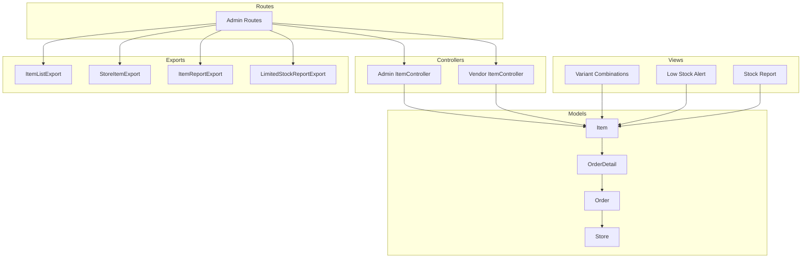

**Diagram sources**
- [Item.php:1-404](file://app/Models/Item.php#L1-L404)
- [Store.php:1-934](file://app/Models/Store.php#L1-L934)
- [Order.php:1-358](file://app/Models/Order.php#L1-L358)
- [OrderDetail.php:1-51](file://app/Models/OrderDetail.php#L1-L51)
- [ItemController.php:1-2126](file://app/Http/Controllers/Admin/ItemController.php#L1-L2126)
- [ItemController.php:1-1913](file://app/Http/Controllers/Vendor/ItemController.php#L1-L1913)
- [_variant-combinations.blade.php:1-105](file://resources/views/admin-views/product/partials/_variant-combinations.blade.php#L1-L105)
- [dashboard.blade.php:41-55](file://resources/views/vendor-views/dashboard.blade.php#L41-L55)
- [stock-report.blade.php:221-242](file://resources/views/admin-views/report/stock-report.blade.php#L221-L242)
- [admin.php:748-753](file://routes/admin.php#L748-L753)
- [ItemListExport.php](file://app/Exports/ItemListExport.php)
- [StoreItemExport.php](file://app/Exports/StoreItemExport.php)
- [ItemReportExport.php](file://app/Exports/ItemReportExport.php)
- [LimitedStockReportExport.php](file://app/Exports/LimitedStockReportExport.php)

**Section sources**
- [Item.php:1-404](file://app/Models/Item.php#L1-L404)
- [Store.php:1-934](file://app/Models/Store.php#L1-L934)
- [Order.php:1-358](file://app/Models/Order.php#L1-L358)
- [OrderDetail.php:1-51](file://app/Models/OrderDetail.php#L1-L51)
- [ItemController.php:1-2126](file://app/Http/Controllers/Admin/ItemController.php#L1-L2126)
- [ItemController.php:1-1913](file://app/Http/Controllers/Vendor/ItemController.php#L1-L1913)
- [_variant-combinations.blade.php:1-105](file://resources/views/admin-views/product/partials/_variant-combinations.blade.php#L1-L105)
- [dashboard.blade.php:41-55](file://resources/views/vendor-views/dashboard.blade.php#L41-L55)
- [stock-report.blade.php:221-242](file://resources/views/admin-views/report/stock-report.blade.php#L221-L242)
- [admin.php:748-753](file://routes/admin.php#L748-L753)

## Core Components
- Item model encapsulates product metadata, pricing, stock, variations, attributes, and associations to stores, categories, orders, and media storage.
- Store model defines store-level configurations, including minimum stock warning thresholds and operational settings.
- Order and OrderDetail connect sales events to items, enabling stock deduction and reporting.
- Admin and Vendor ItemControllers manage CRUD, approval workflows, and bulk operations for items.
- Views implement variant combination generation, stock aggregation, and low stock notifications.
- Exports provide standardized reporting for items, orders, and stock status.

**Section sources**
- [Item.php:1-404](file://app/Models/Item.php#L1-L404)
- [Store.php:1-934](file://app/Models/Store.php#L1-L934)
- [Order.php:1-358](file://app/Models/Order.php#L1-L358)
- [OrderDetail.php:1-51](file://app/Models/OrderDetail.php#L1-L51)
- [ItemController.php:1-2126](file://app/Http/Controllers/Admin/ItemController.php#L1-L2126)
- [ItemController.php:1-1913](file://app/Http/Controllers/Vendor/ItemController.php#L1-L1913)

## Architecture Overview
The system follows a layered architecture:
- Presentation layer: Blade views for admin/vendor interfaces and report pages.
- Application layer: Controllers orchestrate requests, validate inputs, and coordinate services/logic.
- Domain layer: Models represent entities and enforce relationships and scopes.
- Persistence layer: Eloquent models map to database tables; migrations define schema.

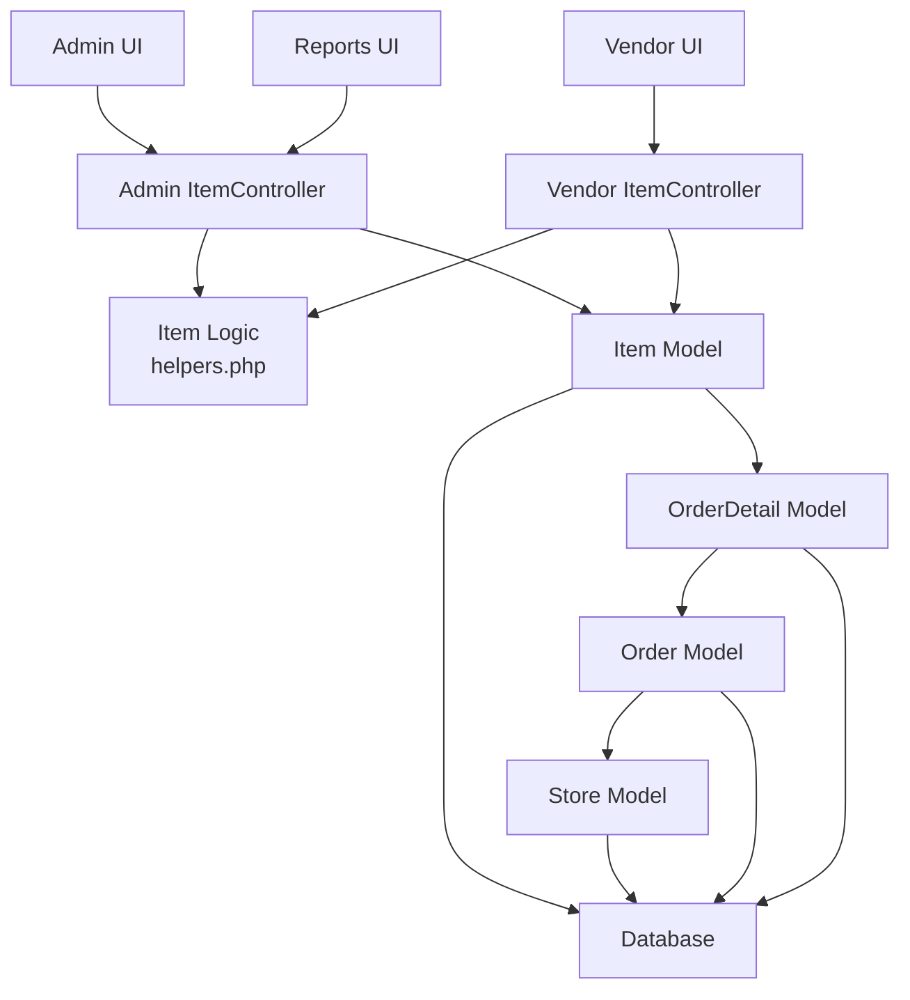

**Diagram sources**
- [ItemController.php:1-2126](file://app/Http/Controllers/Admin/ItemController.php#L1-L2126)
- [ItemController.php:1-1913](file://app/Http/Controllers/Vendor/ItemController.php#L1-L1913)
- [helpers.php:1-1312](file://app/CentralLogics/helpers.php#L1-L1312)
- [Item.php:1-404](file://app/Models/Item.php#L1-L404)
- [Store.php:1-934](file://app/Models/Store.php#L1-L934)
- [Order.php:1-358](file://app/Models/Order.php#L1-L358)
- [OrderDetail.php:1-51](file://app/Models/OrderDetail.php#L1-L51)

## Detailed Component Analysis

### Product Catalog Management
- Creation and updates support:
  - Name/description localization via translation keys.
  - Category hierarchy assignment with positions.
  - Variants and combinations for non-food modules.
  - Attributes, add-ons, tags, nutrition, allergies, and generic names.
  - Images gallery and storage mapping.
  - Approval workflows for vendor-submitted items.
- Admin and vendor controllers enforce validation rules and store business model constraints.

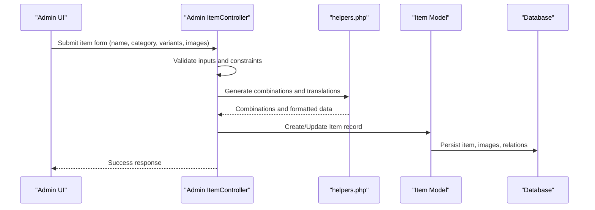

**Diagram sources**
- [ItemController.php:54-387](file://app/Http/Controllers/Admin/ItemController.php#L54-L387)
- [helpers.php:316-337](file://app/CentralLogics/helpers.php#L316-L337)
- [Item.php:1-404](file://app/Models/Item.php#L1-L404)

**Section sources**
- [ItemController.php:54-387](file://app/Http/Controllers/Admin/ItemController.php#L54-L387)
- [ItemController.php:58-436](file://app/Http/Controllers/Vendor/ItemController.php#L58-L436)
- [helpers.php:316-337](file://app/CentralLogics/helpers.php#L316-L337)
- [Item.php:1-404](file://app/Models/Item.php#L1-L404)

### Stock Tracking and Quantity Management
- Stock fields:
  - Item stock aggregated from variant combinations.
  - Store-level minimum stock threshold for low stock alerts.
- Aggregation logic:
  - Variant combination tables compute total current stock.
  - JavaScript updates total stock field based on variant inputs.
- Low stock alert:
  - Dashboard notification triggers when a single out-of-stock item is detected.
  - Store settings allow setting a global minimum threshold.

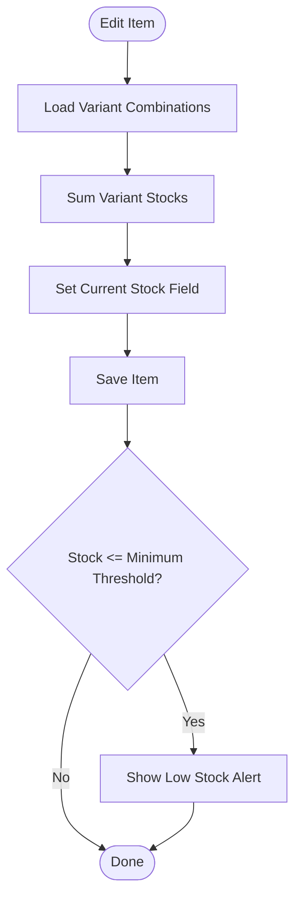

**Diagram sources**
- [_variant-combinations.blade.php:83-98](file://resources/views/admin-views/product/partials/_variant-combinations.blade.php#L83-L98)
- [view.blade.php:607-622](file://resources/views/admin-views/product/view.blade.php#L607-L622)
- [view.blade.php:683-698](file://resources/views/vendor-views/product/view.blade.php#L683-L698)
- [list.blade.php:521-539](file://resources/views/admin-views/product/list.blade.php#L521-L539)
- [stock-report.blade.php:221-242](file://resources/views/admin-views/report/stock-report.blade.php#L221-L242)
- [dashboard.blade.php:41-55](file://resources/views/vendor-views/dashboard.blade.php#L41-L55)
- [restaurant-index.blade.php:398-415](file://resources/views/vendor-views/business-settings/restaurant-index.blade.php#L398-L415)
- [2024_10_22_133944_add_minimum_stock_for_warning_col_to_store_confg.php:1-28](file://database/migrations/2024_10_22_133944_add_minimum_stock_for_warning_col_to_store_confg.php#L1-L28)

**Section sources**
- [_variant-combinations.blade.php:83-98](file://resources/views/admin-views/product/partials/_variant-combinations.blade.php#L83-L98)
- [view.blade.php:607-622](file://resources/views/admin-views/product/view.blade.php#L607-L622)
- [view.blade.php:683-698](file://resources/views/vendor-views/product/view.blade.php#L683-L698)
- [list.blade.php:521-539](file://resources/views/admin-views/product/list.blade.php#L521-L539)
- [stock-report.blade.php:221-242](file://resources/views/admin-views/report/stock-report.blade.php#L221-L242)
- [dashboard.blade.php:41-55](file://resources/views/vendor-views/dashboard.blade.php#L41-L55)
- [restaurant-index.blade.php:398-415](file://resources/views/vendor-views/business-settings/restaurant-index.blade.php#L398-L415)
- [2024_10_22_133944_add_minimum_stock_for_warning_col_to_store_confg.php:1-28](file://database/migrations/2024_10_22_133944_add_minimum_stock_for_warning_col_to_store_confg.php#L1-L28)

### Low Stock Alerts
- Real-time dashboard alert appears when a single item is out of stock.
- Store settings allow configuring a minimum stock threshold per store.
- Reports and exports help monitor low stock items across catalogs.

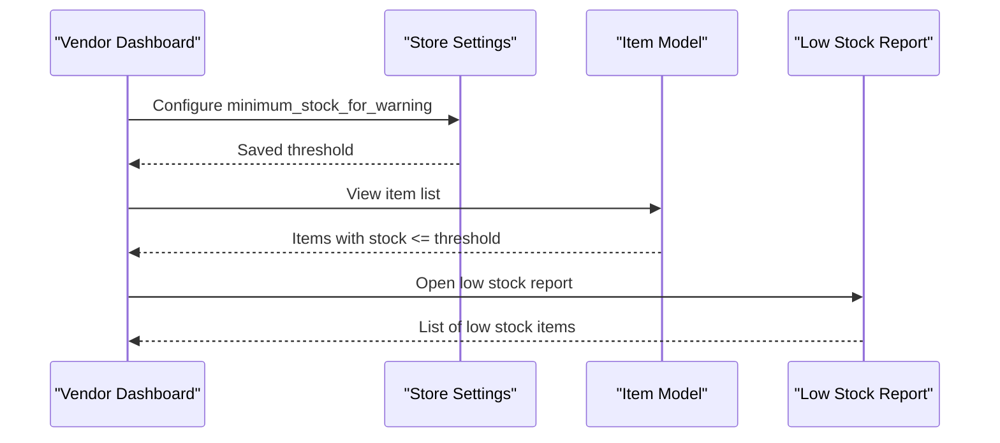

**Diagram sources**
- [dashboard.blade.php:41-55](file://resources/views/vendor-views/dashboard.blade.php#L41-L55)
- [restaurant-index.blade.php:398-415](file://resources/views/vendor-views/business-settings/restaurant-index.blade.php#L398-L415)
- [admin.php:748-753](file://routes/admin.php#L748-L753)

**Section sources**
- [dashboard.blade.php:41-55](file://resources/views/vendor-views/dashboard.blade.php#L41-L55)
- [restaurant-index.blade.php:398-415](file://resources/views/vendor-views/business-settings/restaurant-index.blade.php#L398-L415)
- [admin.php:748-753](file://routes/admin.php#L748-L753)

### Bulk Operations
- Bulk import:
  - Generates variant combinations and computes total stock from variant inputs.
  - AJAX-driven updates to variant tables and total stock fields.
- Bulk export:
  - Item list, store item list, item review, limited stock report, and item sales reports.

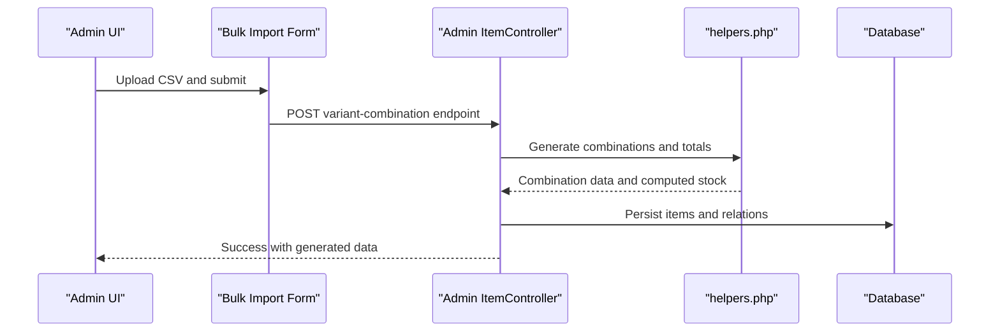

**Diagram sources**
- [bulk-import.blade.php:472-534](file://resources/views/admin-views/product/bulk-import.blade.php#L472-L534)
- [ItemController.php:250-276](file://app/Http/Controllers/Admin/ItemController.php#L250-L276)
- [helpers.php:316-337](file://app/CentralLogics/helpers.php#L316-L337)

**Section sources**
- [bulk-import.blade.php:472-534](file://resources/views/admin-views/product/bulk-import.blade.php#L472-L534)
- [ItemController.php:250-276](file://app/Http/Controllers/Admin/ItemController.php#L250-L276)
- [ItemListExport.php](file://app/Exports/ItemListExport.php)
- [StoreItemExport.php](file://app/Exports/StoreItemExport.php)
- [ItemReviewExport.php](file://app/Exports/ItemReviewExport.php)
- [LimitedStockReportExport.php](file://app/Exports/LimitedStockReportExport.php)
- [ItemReportExport.php](file://app/Exports/ItemReportExport.php)

### Item Lifecycle: Creation to Retirement
- Creation:
  - Admin and vendor controllers validate and persist items, including variants, combinations, attributes, and media.
- Updates:
  - Approval workflows trigger for vendor updates depending on settings.
  - Variant changes and price changes may require re-approval.
- Deactivation:
  - Status toggles controlled by controllers; visibility governed by scopes and filters.

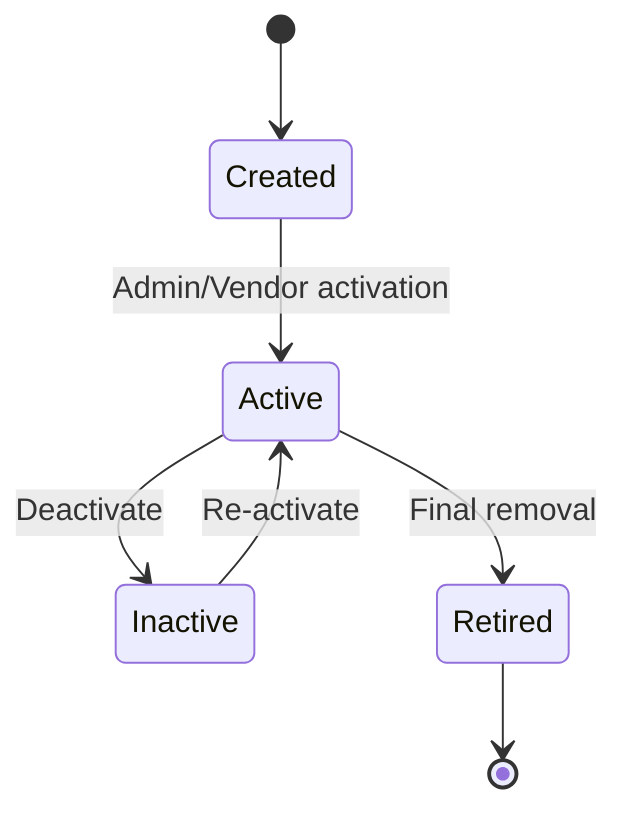

**Diagram sources**
- [ItemController.php:430-437](file://app/Http/Controllers/Admin/ItemController.php#L430-L437)
- [ItemController.php:485-502](file://app/Http/Controllers/Vendor/ItemController.php#L485-L502)
- [Item.php:104-126](file://app/Models/Item.php#L104-L126)

**Section sources**
- [ItemController.php:430-437](file://app/Http/Controllers/Admin/ItemController.php#L430-L437)
- [ItemController.php:485-502](file://app/Http/Controllers/Vendor/ItemController.php#L485-L502)
- [Item.php:104-126](file://app/Models/Item.php#L104-L126)

### Variations, Combinations, and Attributes
- Variants:
  - Choice options and numeric combinations are generated and persisted.
  - Each combination includes type, price, and stock.
- Attributes:
  - Tags, nutrition, allergies, and generic names are managed and synchronized.
- Add-ons:
  - Optional add-on associations are stored with items.

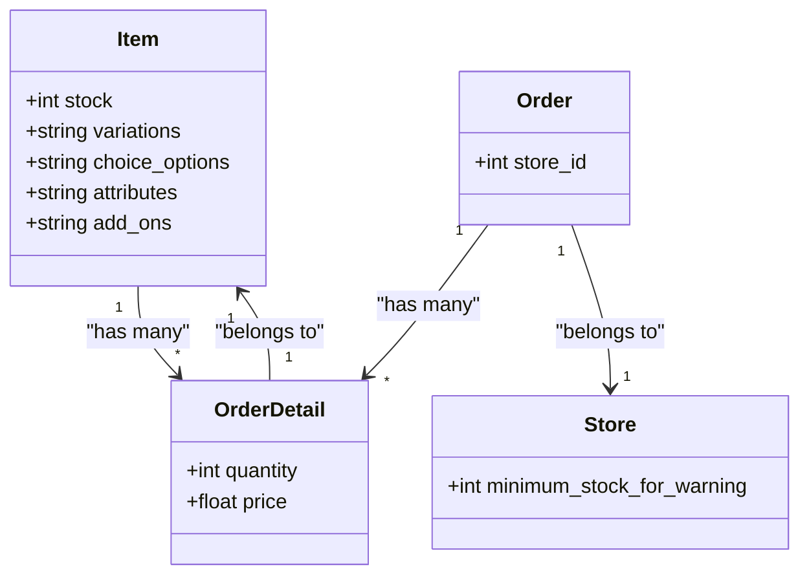

**Diagram sources**
- [Item.php:1-404](file://app/Models/Item.php#L1-L404)
- [OrderDetail.php:1-51](file://app/Models/OrderDetail.php#L1-L51)
- [Order.php:1-358](file://app/Models/Order.php#L1-L358)
- [Store.php:1-934](file://app/Models/Store.php#L1-L934)
- [_variant-combinations.blade.php:1-43](file://resources/views/admin-views/product/partials/_variant-combinations.blade.php#L1-L43)

**Section sources**
- [_variant-combinations.blade.php:1-43](file://resources/views/admin-views/product/partials/_variant-combinations.blade.php#L1-L43)
- [_variant-combinations.blade.php:1-43](file://resources/views/vendor-views/product/partials/_variant-combinations.blade.php#L1-L43)
- [_variant-combinations.blade.php:1-43](file://resources/views/admin-views/product/partials/_edit-combinations.blade.php#L1-L43)
- [Item.php:1-404](file://app/Models/Item.php#L1-L404)

### Reservation Systems and Allocation Strategies
- Reservation:
  - No explicit reservation entity found; stock reduction occurs upon order placement.
- Allocation:
  - Orders allocate items via order details; stock is decremented accordingly.
- Availability:
  - Item availability windows and store schedules influence visibility and sales.

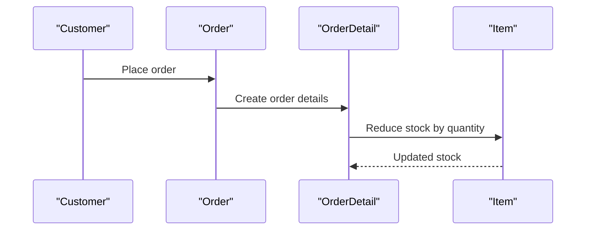

**Diagram sources**
- [Order.php:1-358](file://app/Models/Order.php#L1-L358)
- [OrderDetail.php:1-51](file://app/Models/OrderDetail.php#L1-L51)
- [Item.php:1-404](file://app/Models/Item.php#L1-L404)

**Section sources**
- [Order.php:1-358](file://app/Models/Order.php#L1-L358)
- [OrderDetail.php:1-51](file://app/Models/OrderDetail.php#L1-L51)
- [Item.php:1-404](file://app/Models/Item.php#L1-L404)

### Integration with Order Processing and Sales Reporting
- Order-to-item linkage:
  - OrderDetail references item and captures price and quantity.
- Reporting:
  - Item sales reports, store sales reports, and order exports are supported.
- Item-wise export:
  - Central logic exports item performance metrics including counts and amounts.

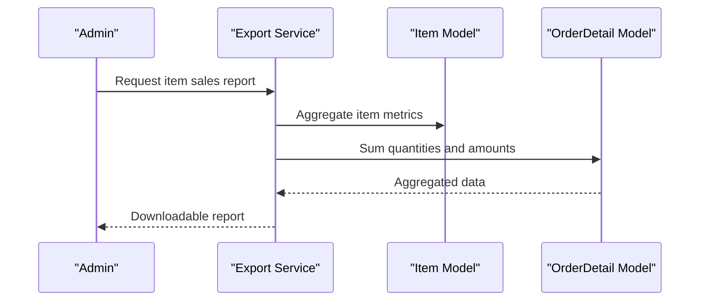

**Diagram sources**
- [OrderExport.php](file://app/Exports/OrderExport.php)
- [StoreOrderReportExport.php](file://app/Exports/StoreOrderReportExport.php)
- [StoreSalesReportExport.php](file://app/Exports/StoreSalesReportExport.php)
- [2869_2887_export_item_wise_report.php:2869-2887](file://app/CentralLogics/helpers.php#L2869-L2887)

**Section sources**
- [OrderDetail.php:1-51](file://app/Models/OrderDetail.php#L1-L51)
- [Order.php:1-358](file://app/Models/Order.php#L1-L358)
- [OrderExport.php](file://app/Exports/OrderExport.php)
- [StoreOrderReportExport.php](file://app/Exports/StoreOrderReportExport.php)
- [StoreSalesReportExport.php](file://app/Exports/StoreSalesReportExport.php)
- [2869_2887_export_item_wise_report.php:2869-2887](file://app/CentralLogics/helpers.php#L2869-L2887)

### Supplier Management
- No dedicated supplier model or supplier-specific inventory controls were identified in the examined files.
- Supplier-related functionality would typically involve purchase orders and supplier inventories, which are not present here.

[No sources needed since this section does not analyze specific files]

## Dependency Analysis
- Controllers depend on models and helpers for validation, combinations, and persistence.
- Views depend on controller-provided data and JavaScript to compute totals and trigger AJAX updates.
- Exports depend on models and central logic for data retrieval and formatting.
- Routes expose endpoints for reports and low stock listings.

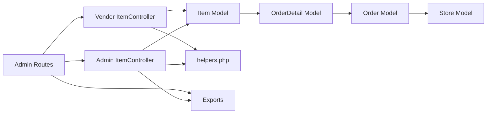

**Diagram sources**
- [ItemController.php:1-2126](file://app/Http/Controllers/Admin/ItemController.php#L1-L2126)
- [ItemController.php:1-1913](file://app/Http/Controllers/Vendor/ItemController.php#L1-L1913)
- [helpers.php:1-1312](file://app/CentralLogics/helpers.php#L1-L1312)
- [Item.php:1-404](file://app/Models/Item.php#L1-L404)
- [OrderDetail.php:1-51](file://app/Models/OrderDetail.php#L1-L51)
- [Order.php:1-358](file://app/Models/Order.php#L1-L358)
- [Store.php:1-934](file://app/Models/Store.php#L1-L934)
- [admin.php:748-753](file://routes/admin.php#L748-L753)

**Section sources**
- [ItemController.php:1-2126](file://app/Http/Controllers/Admin/ItemController.php#L1-L2126)
- [ItemController.php:1-1913](file://app/Http/Controllers/Vendor/ItemController.php#L1-L1913)
- [helpers.php:1-1312](file://app/CentralLogics/helpers.php#L1-L1312)
- [Item.php:1-404](file://app/Models/Item.php#L1-L404)
- [OrderDetail.php:1-51](file://app/Models/OrderDetail.php#L1-L51)
- [Order.php:1-358](file://app/Models/Order.php#L1-L358)
- [Store.php:1-934](file://app/Models/Store.php#L1-L934)
- [admin.php:748-753](file://routes/admin.php#L748-L753)

## Performance Considerations
- Variant combination computation:
  - Combinatorial growth increases processing time; limit attribute options and use efficient combination generation.
- Image storage:
  - Centralized storage mapping reduces duplication and improves scalability.
- Reporting:
  - Aggregations across orders and items can be heavy; consider indexed columns and optimized queries.
- Frontend stock updates:
  - Client-side summation reduces server load during variant editing.

[No sources needed since this section provides general guidance]

## Troubleshooting Guide
- Validation failures:
  - Controllers return structured error messages for invalid inputs (e.g., discount vs. price).
- Approval workflows:
  - Vendor updates may require admin approval depending on settings; check approval statuses and notifications.
- Stock discrepancies:
  - Verify variant stock sums and store minimum thresholds; ensure AJAX updates are triggered after variant changes.
- Export issues:
  - Confirm export classes and permissions; ensure required data exists for reports.

**Section sources**
- [ItemController.php:86-92](file://app/Http/Controllers/Admin/ItemController.php#L86-L92)
- [ItemController.php:94-100](file://app/Http/Controllers/Vendor/ItemController.php#L94-L100)
- [ItemController.php:752-756](file://app/Http/Controllers/Vendor/ItemController.php#L752-L756)

## Conclusion
The inventory management system provides robust catalog management, variant handling, and stock tracking with integrated low stock alerts and bulk operations. It connects seamlessly with order processing and reporting, while maintaining flexibility for approvals and store-level configurations. Areas for future enhancement include explicit reservation mechanisms and supplier integration.

## Appendices
- Additional reports and exports:
  - Item review export, limited stock report export, and item sales report export are available for administrative analysis.

**Section sources**
- [ItemReviewExport.php](file://app/Exports/ItemReviewExport.php)
- [LimitedStockReportExport.php](file://app/Exports/LimitedStockReportExport.php)
- [ItemReportExport.php](file://app/Exports/ItemReportExport.php)