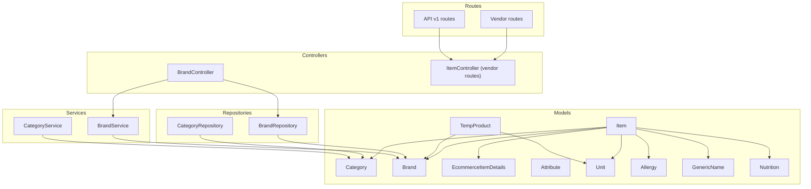
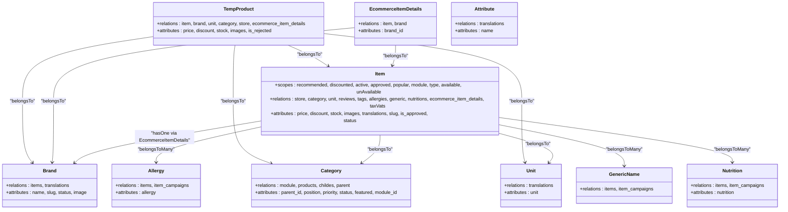
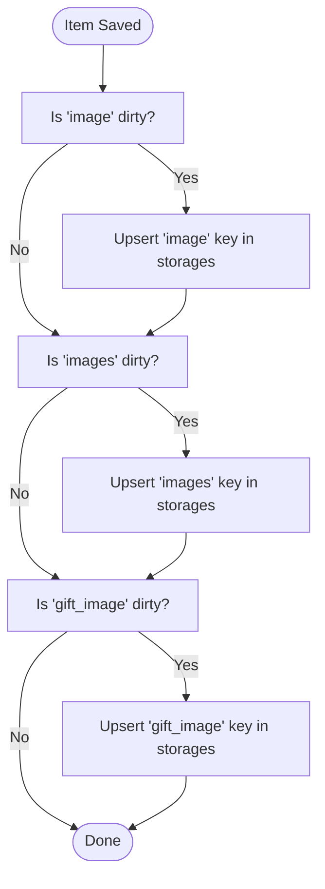
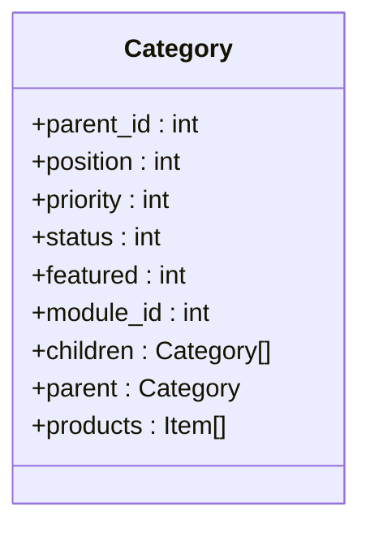
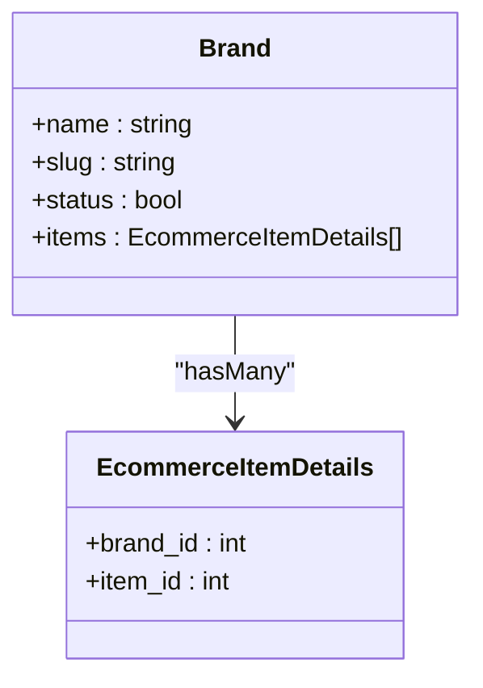
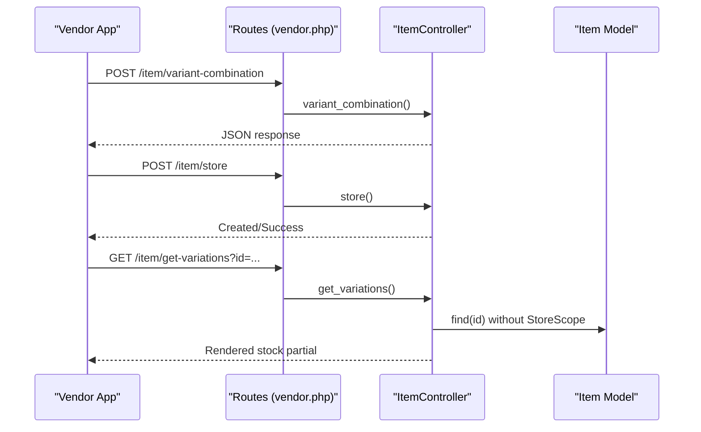
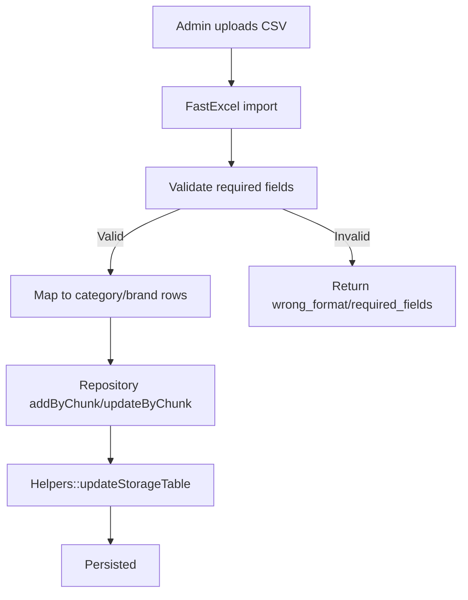
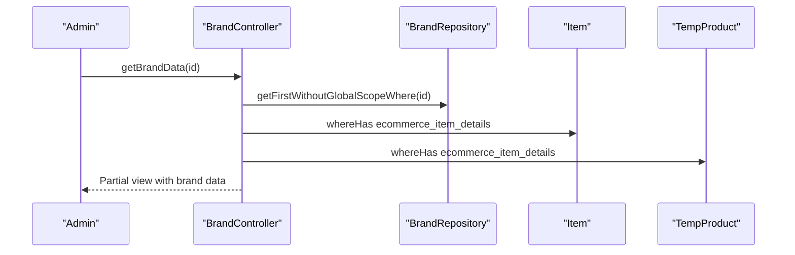
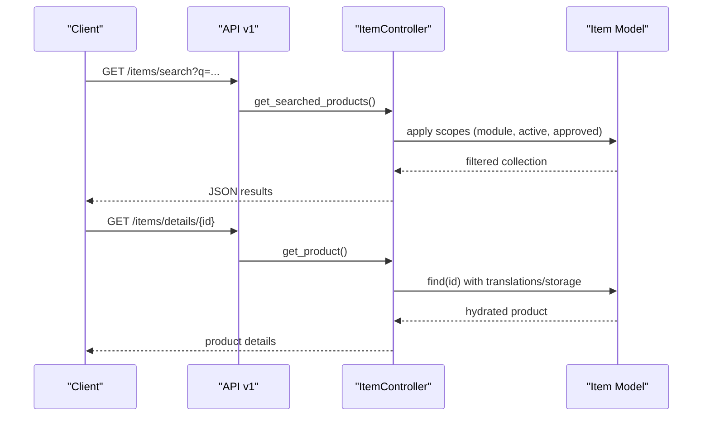
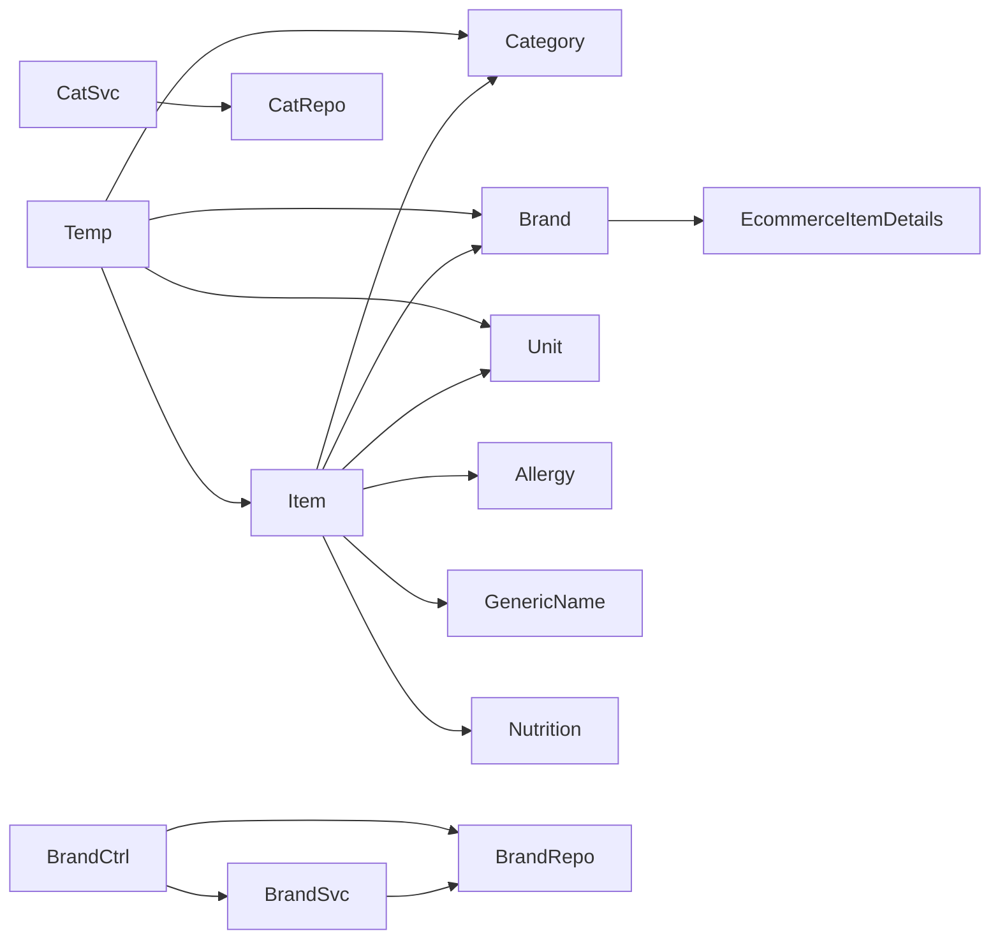

# Product Catalog Management

<cite>
**Referenced Files in This Document**
- [Item.php](file://app/Models/Item.php)
- [Category.php](file://app/Models/Category.php)
- [Brand.php](file://app/Models/Brand.php)
- [EcommerceItemDetails.php](file://app/Models/EcommerceItemDetails.php)
- [TempProduct.php](file://app/Models/TempProduct.php)
- [Attribute.php](file://app/Models/Attribute.php)
- [Unit.php](file://app/Models/Unit.php)
- [Allergy.php](file://app/Models/Allergy.php)
- [GenericName.php](file://app/Models/GenericName.php)
- [Nutrition.php](file://app/Models/Nutrition.php)
- [CategoryService.php](file://app/Services/CategoryService.php)
- [BrandService.php](file://app/Services/BrandService.php)
- [CategoryRepository.php](file://app/Repositories/CategoryRepository.php)
- [BrandRepository.php](file://app/Repositories/BrandRepository.php)
- [BrandController.php](file://app/Http/Controllers/Admin/Item/BrandController.php)
- [ItemController.php](file://routes/vendor.php)
- [api.php](file://routes/api/v1/api.php)
- [SearchRoutingController.php](file://app/Http/Controllers/Vendor/SearchRoutingController.php)
</cite>

## Table of Contents
1. [Introduction](#introduction)
2. [Project Structure](#project-structure)
3. [Core Components](#core-components)
4. [Architecture Overview](#architecture-overview)
5. [Detailed Component Analysis](#detailed-component-analysis)
6. [Dependency Analysis](#dependency-analysis)
7. [Performance Considerations](#performance-considerations)
8. [Troubleshooting Guide](#troubleshooting-guide)
9. [Conclusion](#conclusion)
10. [Appendices](#appendices)

## Introduction
This document explains the product catalog management system in the e-commerce platform. It covers item creation, categorization, branding, and lifecycle management. It documents the Item model and related entities, product variations and combinations, attribute management, category hierarchy, brand associations, unit conversions, slug generation, translation handling, media management, bulk import/export, approval workflows, product status management, search indexing and filtering, and visibility controls across business modules.

## Project Structure
The product catalog spans models, repositories, services, controllers, and routes:
- Models define domain entities (Item, Category, Brand, EcommerceItemDetails, TempProduct, Attribute, Unit, Allergy, GenericName, Nutrition).
- Repositories encapsulate data access and queries.
- Services handle business logic for import/export and data transformation.
- Controllers orchestrate requests and coordinate repositories/services.
- Routes expose APIs for product discovery and vendor operations.

**Diagram sources**
- [Item.php:17-404](file://app/Models/Item.php#L17-L404)
- [Category.php:32-192](file://app/Models/Category.php#L32-L192)
- [Brand.php:26-170](file://app/Models/Brand.php#L26-L170)
- [EcommerceItemDetails.php:7-26](file://app/Models/EcommerceItemDetails.php#L7-L26)
- [TempProduct.php:13-224](file://app/Models/TempProduct.php#L13-L224)
- [Attribute.php:19-68](file://app/Models/Attribute.php#L19-L68)
- [Unit.php:19-68](file://app/Models/Unit.php#L19-L68)
- [Allergy.php:8-24](file://app/Models/Allergy.php#L8-L24)
- [GenericName.php:8-24](file://app/Models/GenericName.php#L8-L24)
- [Nutrition.php:8-25](file://app/Models/Nutrition.php#L8-L25)
- [CategoryRepository.php:18-175](file://app/Repositories/CategoryRepository.php#L18-L175)
- [BrandRepository.php:13-105](file://app/Repositories/BrandRepository.php#L13-L105)
- [CategoryService.php:14-101](file://app/Services/CategoryService.php#L14-L101)
- [BrandService.php:8-51](file://app/Services/BrandService.php#L8-L51)
- [BrandController.php:27-210](file://app/Http/Controllers/Admin/Item/BrandController.php#L27-L210)
- [vendor.php:120-135](file://routes/vendor.php#L120-L135)
- [api.php:441-458](file://routes/api/v1/api.php#L441-L458)

**Section sources**
- [Item.php:17-404](file://app/Models/Item.php#L17-L404)
- [Category.php:32-192](file://app/Models/Category.php#L32-L192)
- [Brand.php:26-170](file://app/Models/Brand.php#L26-L170)
- [CategoryRepository.php:18-175](file://app/Repositories/CategoryRepository.php#L18-L175)
- [BrandRepository.php:13-105](file://app/Repositories/BrandRepository.php#L13-L105)
- [CategoryService.php:14-101](file://app/Services/CategoryService.php#L14-L101)
- [BrandService.php:8-51](file://app/Services/BrandService.php#L8-L51)
- [BrandController.php:27-210](file://app/Http/Controllers/Admin/Item/BrandController.php#L27-L210)
- [vendor.php:120-135](file://routes/vendor.php#L120-L135)
- [api.php:441-458](file://routes/api/v1/api.php#L441-L458)

## Core Components
- Item: central product entity with pricing, availability, stock, media, translations, and lifecycle flags (approved, status).
- Category: hierarchical taxonomy with parent-child relations, module scoping, and slugs.
- Brand: brand association via EcommerceItemDetails, with translations and images.
- EcommerceItemDetails: bridge linking Item to Brand and optional TempProduct.
- TempProduct: draft product records for approval workflows.
- Attribute, Unit: attribute vocabulary and unit of measure with translations.
- Allergy, GenericName, Nutrition: product attributes for health and composition.

Key scopes and traits:
- Item scopes: recommended, discounted, active, approved, popular, module, type, available/unavailable.
- Global scopes: zone, store, storage eager-loading, locale-specific translations.
- Slug generation on create/save for Item, Category, Brand.

**Section sources**
- [Item.php:17-404](file://app/Models/Item.php#L17-L404)
- [Category.php:32-192](file://app/Models/Category.php#L32-L192)
- [Brand.php:26-170](file://app/Models/Brand.php#L26-L170)
- [EcommerceItemDetails.php:7-26](file://app/Models/EcommerceItemDetails.php#L7-L26)
- [TempProduct.php:13-224](file://app/Models/TempProduct.php#L13-L224)
- [Attribute.php:19-68](file://app/Models/Attribute.php#L19-L68)
- [Unit.php:19-68](file://app/Models/Unit.php#L19-L68)
- [Allergy.php:8-24](file://app/Models/Allergy.php#L8-L24)
- [GenericName.php:8-24](file://app/Models/GenericName.php#L8-L24)
- [Nutrition.php:8-25](file://app/Models/Nutrition.php#L8-L25)

## Architecture Overview
The system follows layered architecture:
- Presentation: vendor and API routes.
- Application: controllers and services.
- Domain: models and repositories.
- Persistence: Eloquent ORM with global scopes and storage mapping.

**Diagram sources**
- [Item.php:17-404](file://app/Models/Item.php#L17-L404)
- [Category.php:32-192](file://app/Models/Category.php#L32-L192)
- [Brand.php:26-170](file://app/Models/Brand.php#L26-L170)
- [EcommerceItemDetails.php:7-26](file://app/Models/EcommerceItemDetails.php#L7-L26)
- [TempProduct.php:13-224](file://app/Models/TempProduct.php#L13-L224)
- [Attribute.php:19-68](file://app/Models/Attribute.php#L19-L68)
- [Unit.php:19-68](file://app/Models/Unit.php#L19-L68)
- [Allergy.php:8-24](file://app/Models/Allergy.php#L8-L24)
- [GenericName.php:8-24](file://app/Models/GenericName.php#L8-L24)
- [Nutrition.php:8-25](file://app/Models/Nutrition.php#L8-L25)

## Detailed Component Analysis

### Item Model: Attributes, Relationships, Scopes, Lifecycle
- Attributes: pricing, discounts, stock, availability windows, flags (recommended, organic, halal, gift-related), arrays (images), foreign keys (category, unit, store), and booleans (status, is_approved).
- Relationships: belongs to store/category/unit; has one ecommerce_item_details; belongs to many tags/allergies/generic/nutritions; morph many taxVats; morph many storages; morph many translations.
- Scopes:
  - recommended, discounted (including store and flash-sale conditions), active (approved and store conditions), approved, popular, module, type (veg/non-veg), available/unavailable by time.
- Lifecycle hooks:
  - Slug generation on create.
  - Storage mapping updates on image/images/gift_image changes.
  - Global scopes: StoreScope, ZoneScope, storage eager-load, locale-specific translation filter.
- Media and translations:
  - Full URLs for single image, multiple images, and gift image via storage mapping.
  - Translated name/description fallback to current locale.

**Diagram sources**
- [Item.php:333-381](file://app/Models/Item.php#L333-L381)

**Section sources**
- [Item.php:17-404](file://app/Models/Item.php#L17-L404)

### Category Model: Hierarchy, Slugs, Translations, Taxables
- Hierarchical: parent-child via parent_id; main/sub categories via position.
- Slugs: generated on create and persisted.
- Translations: localized name retrieval.
- Taxables: morph many tax rates.

**Diagram sources**
- [Category.php:32-192](file://app/Models/Category.php#L32-L192)

**Section sources**
- [Category.php:32-192](file://app/Models/Category.php#L32-L192)

### Brand Model: Associations, Slugs, Translations
- Association: Brand has many EcommerceItemDetails (via items).
- Slugs: generated on create.
- Translations: localized name retrieval.

**Diagram sources**
- [Brand.php:26-170](file://app/Models/Brand.php#L26-L170)
- [EcommerceItemDetails.php:7-26](file://app/Models/EcommerceItemDetails.php#L7-L26)

**Section sources**
- [Brand.php:26-170](file://app/Models/Brand.php#L26-L170)
- [EcommerceItemDetails.php:7-26](file://app/Models/EcommerceItemDetails.php#L7-L26)

### EcommerceItemDetails: Brand-Item Bridge
- Links Item to Brand and supports TempProduct linkage.

**Section sources**
- [EcommerceItemDetails.php:7-26](file://app/Models/EcommerceItemDetails.php#L7-L26)

### TempProduct: Draft Items and Approval Workflow
- Draft product records with similar attributes to Item.
- Relations to Brand, Unit, Category, Store, and EcommerceItemDetails.
- Used in vendor workflows and admin approvals.

**Section sources**
- [TempProduct.php:13-224](file://app/Models/TempProduct.php#L13-L224)

### Attributes, Units, Allergies, Generics, Nutritions
- Attribute: vocabulary for attributes.
- Unit: unit of measure with translations.
- Allergy, GenericName, Nutrition: product composition and health attributes with many-to-many relationships.

**Section sources**
- [Attribute.php:19-68](file://app/Models/Attribute.php#L19-L68)
- [Unit.php:19-68](file://app/Models/Unit.php#L19-L68)
- [Allergy.php:8-24](file://app/Models/Allergy.php#L8-L24)
- [GenericName.php:8-24](file://app/Models/GenericName.php#L8-L24)
- [Nutrition.php:8-25](file://app/Models/Nutrition.php#L8-L25)

### Product Variations, Combinations, and Attribute Management
- Vendor routes expose variant-combination and stock update endpoints.
- ItemController handles variation retrieval and stock updates for vendor panel.
- Attribute vocabulary and units support dynamic attribute sets.

**Diagram sources**
- [vendor.php:120-135](file://routes/vendor.php#L120-L135)
- [ItemController.php:1535-1566](file://routes/vendor.php#L1535-L1566)

**Section sources**
- [vendor.php:120-135](file://routes/vendor.php#L120-L135)
- [ItemController.php:1535-1566](file://routes/vendor.php#L1535-L1566)

### Category and Brand Management: Import/Export, Bulk Operations
- CategoryService: import/export CSV data, slug generation, and data shaping.
- BrandService: upload/update images, slug generation, dropdown formatting.
- CategoryRepository and BrandRepository: CRUD, search, pagination, bulk export filters.

**Diagram sources**
- [CategoryService.php:47-82](file://app/Services/CategoryService.php#L47-L82)
- [CategoryRepository.php:36-67](file://app/Repositories/CategoryRepository.php#L36-L67)

**Section sources**
- [CategoryService.php:14-101](file://app/Services/CategoryService.php#L14-L101)
- [BrandService.php:8-51](file://app/Services/BrandService.php#L8-L51)
- [CategoryRepository.php:18-175](file://app/Repositories/CategoryRepository.php#L18-L175)
- [BrandRepository.php:13-105](file://app/Repositories/BrandRepository.php#L13-L105)

### Approval Workflows and Status Management
- TempProduct holds draft items and rejection flag.
- BrandController demonstrates cross-module item ID resolution for brand associations and approval contexts.
- Item scopes active/approved/status integrate with store and module visibility.

**Diagram sources**
- [BrandController.php:201-209](file://app/Http/Controllers/Admin/Item/BrandController.php#L201-L209)
- [BrandController.php:189-199](file://app/Http/Controllers/Admin/Item/BrandController.php#L189-L199)

**Section sources**
- [TempProduct.php:13-224](file://app/Models/TempProduct.php#L13-L224)
- [BrandController.php:189-199](file://app/Http/Controllers/Admin/Item/BrandController.php#L189-L199)

### Search Indexing, Filtering, and Visibility Controls
- API routes expose product discovery endpoints (latest, popular, discounted, search, suggestions).
- Vendor routes support item search and listing.
- Item scopes enable filtering by type, availability, popularity, and module.
- Global scopes enforce zone/store visibility and locale-specific translations.

**Diagram sources**
- [api.php:441-458](file://routes/api/v1/api.php#L441-L458)

**Section sources**
- [api.php:441-458](file://routes/api/v1/api.php#L441-L458)
- [vendor.php:120-135](file://routes/vendor.php#L120-L135)
- [Item.php:98-126](file://app/Models/Item.php#L98-L126)

## Dependency Analysis
- Item depends on Category, Brand (via EcommerceItemDetails), Unit, Allergy/GenericName/Nutrition, Store, and Taxable.
- Category depends on Module and stores hierarchical relations.
- Brand depends on EcommerceItemDetails and items.
- TempProduct mirrors Item’s attributes and relations for draft workflows.
- Services depend on repositories for persistence and on FileManagerTrait for media.
- Controllers depend on services and repositories for business operations.

**Diagram sources**
- [Item.php:17-404](file://app/Models/Item.php#L17-L404)
- [Category.php:32-192](file://app/Models/Category.php#L32-L192)
- [Brand.php:26-170](file://app/Models/Brand.php#L26-L170)
- [EcommerceItemDetails.php:7-26](file://app/Models/EcommerceItemDetails.php#L7-L26)
- [TempProduct.php:13-224](file://app/Models/TempProduct.php#L13-L224)
- [CategoryService.php:14-101](file://app/Services/CategoryService.php#L14-L101)
- [BrandService.php:8-51](file://app/Services/BrandService.php#L8-L51)
- [BrandController.php:27-210](file://app/Http/Controllers/Admin/Item/BrandController.php#L27-L210)

**Section sources**
- [Item.php:17-404](file://app/Models/Item.php#L17-L404)
- [Category.php:32-192](file://app/Models/Category.php#L32-L192)
- [Brand.php:26-170](file://app/Models/Brand.php#L26-L170)
- [EcommerceItemDetails.php:7-26](file://app/Models/EcommerceItemDetails.php#L7-L26)
- [TempProduct.php:13-224](file://app/Models/TempProduct.php#L13-L224)
- [CategoryService.php:14-101](file://app/Services/CategoryService.php#L14-L101)
- [BrandService.php:8-51](file://app/Services/BrandService.php#L8-L51)
- [BrandController.php:27-210](file://app/Http/Controllers/Admin/Item/BrandController.php#L27-L210)

## Performance Considerations
- Use scopes to constrain queries (module, active, approved, discounted).
- Leverage global scopes to eager-load translations and storage to avoid N+1 queries.
- Batch import/export via chunked repository methods to reduce memory overhead.
- Avoid unnecessary morph relations in listings; select only required fields.
- Index frequently filtered columns (module_id, status, category_id, store_id).

## Troubleshooting Guide
- Slug conflicts: when creating/updating Item/Category/Brand, ensure unique slugs; the system appends suffixes if duplicates exist.
- Media not appearing: verify storage mapping updates on image/images/gift_image changes; confirm disk value propagation.
- Locale translations missing: ensure global translate scope is applied and locale matches stored translation keys.
- Approval issues: check TempProduct rejection flag and Item approval status; reconcile via BrandController’s cross-module item resolution.
- Search not returning results: confirm module and store visibility scopes; verify search routing for vendor vs. public.

**Section sources**
- [Item.php:333-381](file://app/Models/Item.php#L333-L381)
- [BrandController.php:189-199](file://app/Http/Controllers/Admin/Item/BrandController.php#L189-L199)
- [vendor.php:183-771](file://app/Http/Controllers/Vendor/SearchRoutingController.php#L183-L771)

## Conclusion
The product catalog system integrates robust models, repositories, services, and controllers to manage items, categories, brands, and attributes. It supports approval workflows, media management, localization, and scalable import/export. Scopes and global constraints ensure visibility and performance across modules and zones.

## Appendices
- API endpoints for product discovery and vendor item operations are defined in the routes and controller bindings.
- Vendor routes include variant combination and stock update handlers for product variations.