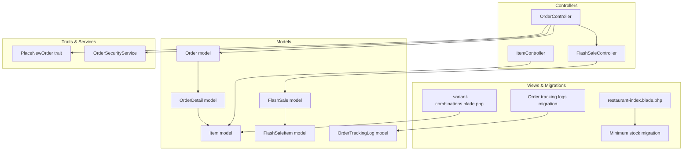
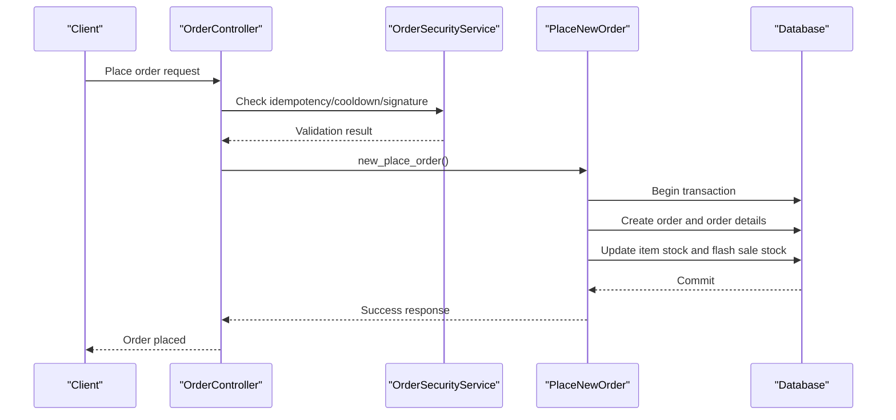
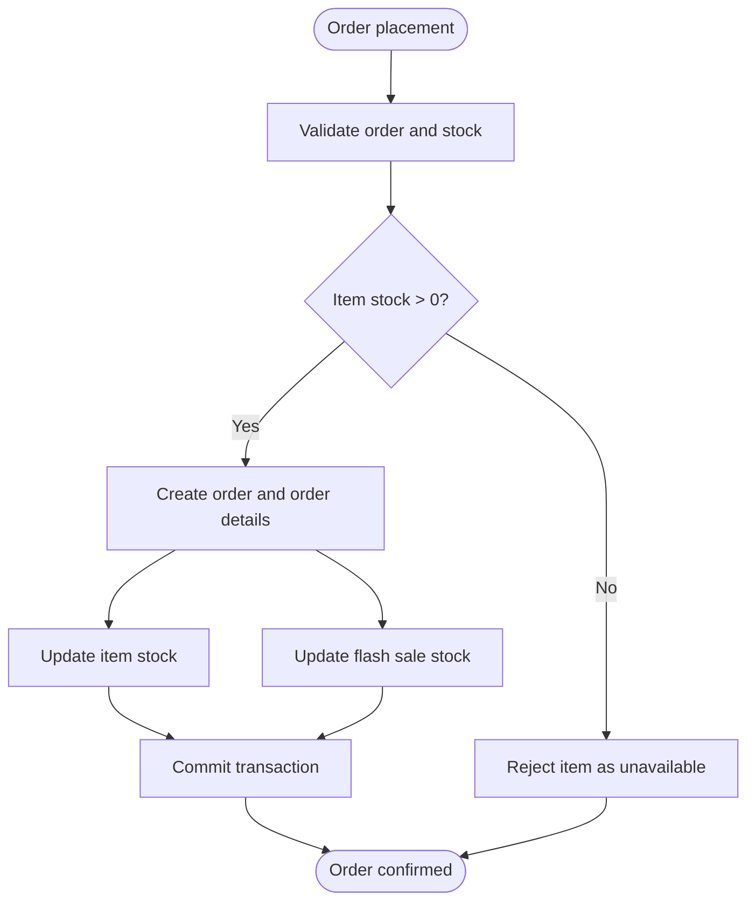
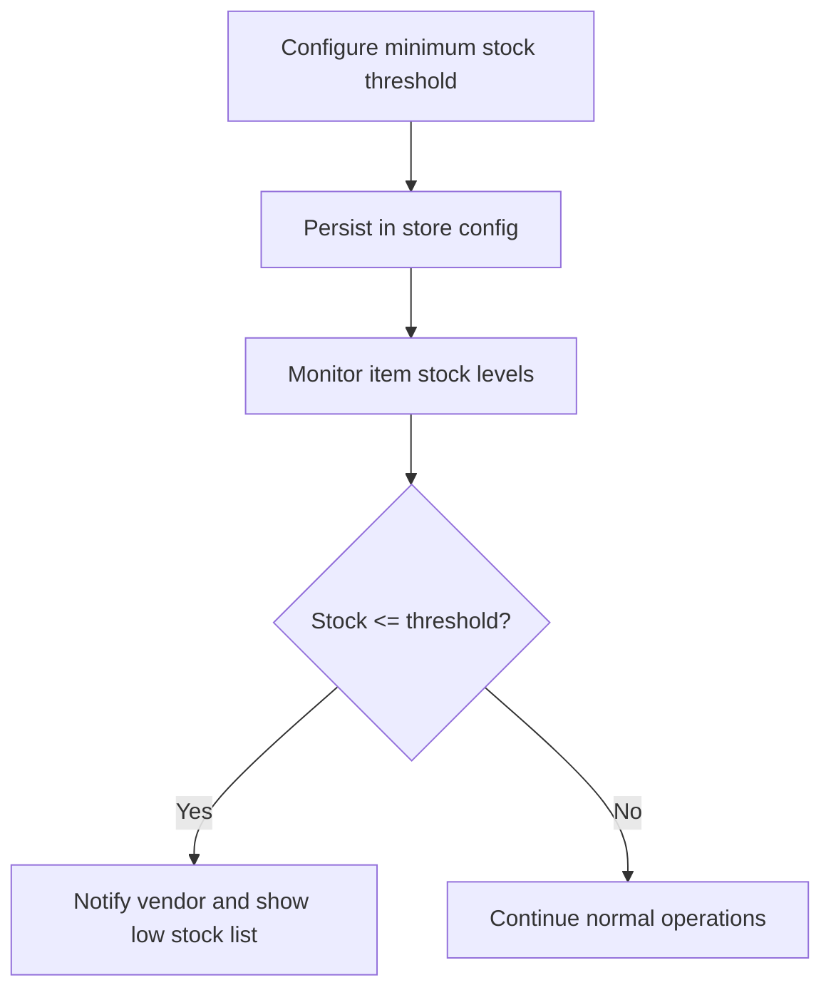
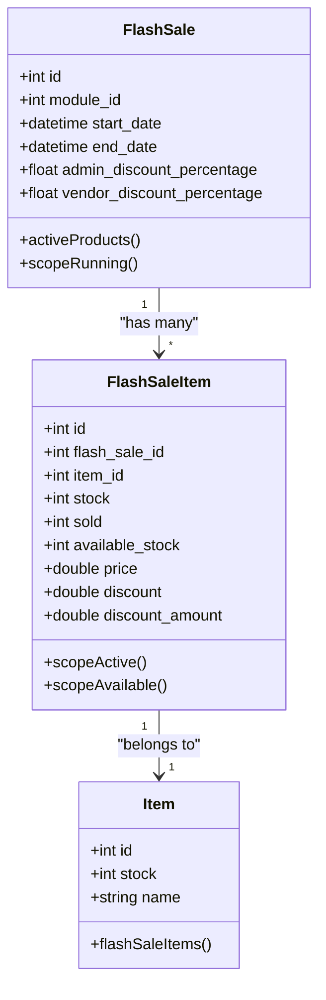
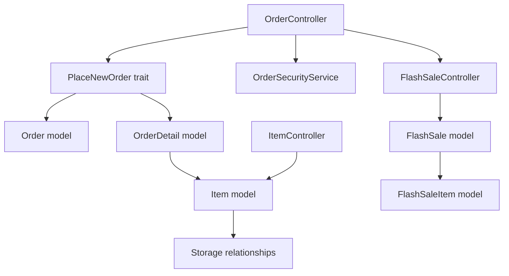

# Stock Tracking System

<cite>
**Referenced Files in This Document**
- [Item.php](file://app/Models/Item.php)
- [FlashSale.php](file://app/Models/FlashSale.php)
- [FlashSaleItem.php](file://app/Models/FlashSaleItem.php)
- [Order.php](file://app/Models/Order.php)
- [OrderDetail.php](file://app/Models/OrderDetail.php)
- [OrderController.php](file://app/Http/Controllers/Api/V1/OrderController.php)
- [PlaceNewOrder.php](file://app/Traits/PlaceNewOrder.php)
- [OrderSecurityService.php](file://app/Services/OrderSecurityService.php)
- [ItemController.php](file://app/Http/Controllers/Admin/ItemController.php)
- [helpers.php](file://app/CentralLogics/helpers.php)
- [2024_10_22_133944_add_minimum_stock_for_warning_col_to_store_confg.php](file://database/migrations/2024_10_22_133944_add_minimum_stock_for_warning_col_to_store_confg.php)
- [restaurant-index.blade.php](file://resources/views/vendor-views/business-settings/restaurant-index.blade.php)
- [FlashSaleController.php](file://app/Http/Controllers/Api/V1/FlashSaleController.php)
- [product-index.blade.php](file://resources/views/admin-views/flash-sale/product-index.blade.php)
- [_variant-combinations.blade.php](file://resources/views/admin-views/product/partials/_variant-combinations.blade.php)
- [dashboard.blade.php](file://resources/views/vendor-views/dashboard.blade.php)
- [2026_01_25_000002_create_order_tracking_logs_table.php](file://database/migrations/2026_01_25_000002_create_order_tracking_logs_table.php)
- [OrderTrackingLog.php](file://app/Models/OrderTrackingLog.php)
</cite>

## Table of Contents
1. [Introduction](#introduction)
2. [Project Structure](#project-structure)
3. [Core Components](#core-components)
4. [Architecture Overview](#architecture-overview)
5. [Detailed Component Analysis](#detailed-component-analysis)
6. [Dependency Analysis](#dependency-analysis)
7. [Performance Considerations](#performance-considerations)
8. [Troubleshooting Guide](#troubleshooting-guide)
9. [Conclusion](#conclusion)

## Introduction
This document describes the stock tracking and inventory control system implemented in the backend. It covers stock quantity management, real-time updates during order processing, stock reservation mechanisms, minimum stock alerts, reorder point calculations, low stock reporting, flash sale inventory management, temporary product stock handling, bulk stock adjustments, stock allocation strategies, FIFO/LIFO calculations, inventory valuation methods, integration with order fulfillment, warehouse management, supplier reordering systems, stock movement tracking, adjustment procedures, and inventory audit capabilities.

## Project Structure
The stock tracking system spans several core areas:
- Domain models representing items, orders, and flash sales
- Controllers orchestrating order placement and flash sale queries
- Traits implementing order placement logic and stock updates
- Services enforcing order security and preventing duplicate submissions
- Views and migrations supporting UI configuration and database schema
- Reports and tracking logs enabling audit and visibility

**Diagram sources**
- [OrderController.php:600-791](file://app/Http/Controllers/Api/V1/OrderController.php#L600-L791)
- [PlaceNewOrder.php:560-575](file://app/Traits/PlaceNewOrder.php#L560-L575)
- [OrderSecurityService.php:1-137](file://app/Services/OrderSecurityService.php#L1-L137)
- [Order.php:1-358](file://app/Models/Order.php#L1-L358)
- [OrderDetail.php:1-51](file://app/Models/OrderDetail.php#L1-L51)
- [Item.php:1-404](file://app/Models/Item.php#L1-L404)
- [FlashSale.php:1-90](file://app/Models/FlashSale.php#L1-L90)
- [FlashSaleItem.php:1-47](file://app/Models/FlashSaleItem.php#L1-L47)
- [_variant-combinations.blade.php:83-105](file://resources/views/admin-views/product/partials/_variant-combinations.blade.php#L83-L105)
- [restaurant-index.blade.php:398-415](file://resources/views/vendor-views/business-settings/restaurant-index.blade.php#L398-L415)
- [2024_10_22_133944_add_minimum_stock_for_warning_col_to_store_confg.php:1-28](file://database/migrations/2024_10_22_133944_add_minimum_stock_for_warning_col_to_store_confg.php#L1-L28)
- [2026_01_25_000002_create_order_tracking_logs_table.php:1-40](file://database/migrations/2026_01_25_000002_create_order_tracking_logs_table.php#L1-L40)

**Section sources**
- [OrderController.php:600-791](file://app/Http/Controllers/Api/V1/OrderController.php#L600-L791)
- [PlaceNewOrder.php:560-575](file://app/Traits/PlaceNewOrder.php#L560-L575)
- [OrderSecurityService.php:1-137](file://app/Services/OrderSecurityService.php#L1-L137)
- [Item.php:1-404](file://app/Models/Item.php#L1-L404)
- [Order.php:1-358](file://app/Models/Order.php#L1-L358)
- [OrderDetail.php:1-51](file://app/Models/OrderDetail.php#L1-L51)
- [FlashSale.php:1-90](file://app/Models/FlashSale.php#L1-L90)
- [FlashSaleItem.php:1-47](file://app/Models/FlashSaleItem.php#L1-L47)
- [_variant-combinations.blade.php:83-105](file://resources/views/admin-views/product/partials/_variant-combinations.blade.php#L83-L105)
- [restaurant-index.blade.php:398-415](file://resources/views/vendor-views/business-settings/restaurant-index.blade.php#L398-L415)
- [2024_10_22_133944_add_minimum_stock_for_warning_col_to_store_confg.php:1-28](file://database/migrations/2024_10_22_133944_add_minimum_stock_for_warning_col_to_store_confg.php#L1-L28)
- [2026_01_25_000002_create_order_tracking_logs_table.php:1-40](file://database/migrations/2026_01_25_000002_create_order_tracking_logs_table.php#L1-L40)

## Core Components
- Item model: Holds base stock quantity and metadata for products across modules. It supports scopes for availability and active status and integrates with translations and storage.
- Order and OrderDetail models: Represent order lifecycle and individual items within orders. They connect items to orders and maintain pricing, discounts, and taxes.
- FlashSale and FlashSaleItem models: Manage flash sale inventory with dedicated stock, sold counters, and available stock tracking per item.
- OrderController and PlaceNewOrder trait: Implement order placement logic, including stock checks, flash sale stock updates, and transactional persistence.
- OrderSecurityService: Provides idempotency keys, cooldown enforcement, and signature verification to prevent duplicate orders and tampering.
- Admin ItemController and views: Support bulk stock adjustments, variant combinations, and minimum stock warning configuration via UI and migrations.

**Section sources**
- [Item.php:1-404](file://app/Models/Item.php#L1-L404)
- [Order.php:1-358](file://app/Models/Order.php#L1-L358)
- [OrderDetail.php:1-51](file://app/Models/OrderDetail.php#L1-L51)
- [FlashSale.php:1-90](file://app/Models/FlashSale.php#L1-L90)
- [FlashSaleItem.php:1-47](file://app/Models/FlashSaleItem.php#L1-L47)
- [OrderController.php:600-791](file://app/Http/Controllers/Api/V1/OrderController.php#L600-L791)
- [PlaceNewOrder.php:560-575](file://app/Traits/PlaceNewOrder.php#L560-L575)
- [OrderSecurityService.php:1-137](file://app/Services/OrderSecurityService.php#L1-L137)
- [ItemController.php:1-200](file://app/Http/Controllers/Admin/ItemController.php#L1-L200)

## Architecture Overview
The system follows a layered architecture:
- Presentation layer: Controllers expose APIs and render views for admin/vendor dashboards.
- Application layer: Traits encapsulate order placement logic and stock updates.
- Domain layer: Models define entities and relationships for items, orders, flash sales, and tracking logs.
- Persistence layer: Migrations define schema for stock-related fields and tracking logs.

**Diagram sources**
- [OrderController.php:600-791](file://app/Http/Controllers/Api/V1/OrderController.php#L600-L791)
- [OrderSecurityService.php:1-137](file://app/Services/OrderSecurityService.php#L1-L137)
- [PlaceNewOrder.php:560-575](file://app/Traits/PlaceNewOrder.php#L560-L575)

## Detailed Component Analysis

### Stock Quantity Management and Real-Time Updates During Order Processing
- Stock checks occur during order processing for non-food modules to prevent out-of-stock items from being ordered.
- On successful order placement, item stock and flash sale stock are updated atomically within a transaction to ensure consistency.

**Diagram sources**
- [OrderController.php:635-646](file://app/Http/Controllers/Api/V1/OrderController.php#L635-L646)
- [PlaceNewOrder.php:560-575](file://app/Traits/PlaceNewOrder.php#L560-L575)

**Section sources**
- [OrderController.php:635-646](file://app/Http/Controllers/Api/V1/OrderController.php#L635-L646)
- [PlaceNewOrder.php:560-575](file://app/Traits/PlaceNewOrder.php#L560-L575)

### Stock Reservation Mechanisms
- The system does not implement explicit stock reservations. Instead, it performs immediate stock decrements upon successful order placement. Idempotency and cooldown mechanisms mitigate duplicate submissions and abuse.

**Section sources**
- [OrderSecurityService.php:1-137](file://app/Services/OrderSecurityService.php#L1-L137)
- [PlaceNewOrder.php:560-575](file://app/Traits/PlaceNewOrder.php#L560-L575)

### Minimum Stock Alerts and Reorder Point Calculations
- Minimum stock threshold is configurable per store via a dedicated field in store configurations.
- The system surfaces low stock reminders in vendor dashboards and lists low stock items for visibility.

**Diagram sources**
- [restaurant-index.blade.php:398-415](file://resources/views/vendor-views/business-settings/restaurant-index.blade.php#L398-L415)
- [2024_10_22_133944_add_minimum_stock_for_warning_col_to_store_confg.php:1-28](file://database/migrations/2024_10_22_133944_add_minimum_stock_for_warning_col_to_store_confg.php#L1-L28)
- [dashboard.blade.php:32-39](file://resources/views/vendor-views/dashboard.blade.php#L32-L39)

**Section sources**
- [restaurant-index.blade.php:398-415](file://resources/views/vendor-views/business-settings/restaurant-index.blade.php#L398-L415)
- [2024_10_22_133944_add_minimum_stock_for_warning_col_to_store_confg.php:1-28](file://database/migrations/2024_10_22_133944_add_minimum_stock_for_warning_col_to_store_confg.php#L1-L28)
- [dashboard.blade.php:32-39](file://resources/views/vendor-views/dashboard.blade.php#L32-L39)

### Low Stock Reporting
- Low stock reporting is supported through vendor dashboards and reminders. Administrators can also query items not associated with running flash sales within a given zone.

**Section sources**
- [ItemController.php:1020-1050](file://app/Http/Controllers/Admin/ItemController.php#L1020-L1050)

### Flash Sale Inventory Management
- Flash sale items maintain separate stock, sold, and available stock fields. The system filters items with positive available stock and active status for flash sale listings.

**Diagram sources**
- [FlashSale.php:1-90](file://app/Models/FlashSale.php#L1-L90)
- [FlashSaleItem.php:1-47](file://app/Models/FlashSaleItem.php#L1-L47)
- [Item.php:1-404](file://app/Models/Item.php#L1-L404)

**Section sources**
- [FlashSaleController.php:51-81](file://app/Http/Controllers/Api/V1/FlashSaleController.php#L51-L81)
- [product-index.blade.php:143-158](file://resources/views/admin-views/flash-sale/product-index.blade.php#L143-L158)
- [FlashSale.php:50-78](file://app/Models/FlashSale.php#L50-L78)
- [FlashSaleItem.php:35-45](file://app/Models/FlashSaleItem.php#L35-L45)

### Temporary Product Stock Handling
- Temporary product records support stock management alongside regular items. Bulk stock adjustments and variant combinations are handled in admin views.

**Section sources**
- [ItemController.php:1-200](file://app/Http/Controllers/Admin/ItemController.php#L1-L200)
- [_variant-combinations.blade.php:83-105](file://resources/views/admin-views/product/partials/_variant-combinations.blade.php#L83-L105)

### Bulk Stock Adjustments
- Admin and vendor views enable updating stock quantities across variants and items. JavaScript aggregates variant stocks into a single current stock value.

**Section sources**
- [_variant-combinations.blade.php:83-105](file://resources/views/admin-views/product/partials/_variant-combinations.blade.php#L83-L105)
- [product-index.blade.php:143-158](file://resources/views/admin-views/flash-sale/product-index.blade.php#L143-L158)

### Stock Allocation Strategies, FIFO/LIFO, and Inventory Valuation
- The codebase does not implement FIFO/LIFO cost accounting or valuation methods. Stock updates are quantity-based and do not track cost layers or allocation strategies.

**Section sources**
- [PlaceNewOrder.php:560-575](file://app/Traits/PlaceNewOrder.php#L560-L575)
- [Item.php:1-404](file://app/Models/Item.php#L1-L404)

### Integration with Order Fulfillment, Warehouse Management, and Supplier Reordering Systems
- Order fulfillment: Order creation, status transitions, and tracking logs integrate with delivery management and order lifecycle.
- Warehouse management: Not explicitly modeled in the provided files; stock updates occur at item level.
- Supplier reordering: Not present in the codebase; reorder point alerts rely on minimum stock thresholds configured per store.

**Section sources**
- [Order.php:1-358](file://app/Models/Order.php#L1-L358)
- [OrderDetail.php:1-51](file://app/Models/OrderDetail.php#L1-L51)
- [OrderTrackingLog.php:1-200](file://app/Models/OrderTrackingLog.php#L1-L200)
- [2026_01_25_000002_create_order_tracking_logs_table.php:1-40](file://database/migrations/2026_01_25_000002_create_order_tracking_logs_table.php#L1-L40)

### Stock Movement Tracking, Adjustment Procedures, and Audit Capabilities
- Stock movement tracking: Order tracking logs capture location and status updates for orders, aiding auditability of fulfillment stages.
- Adjustment procedures: Admin and vendor interfaces support bulk adjustments and variant stock aggregation.
- Audit capabilities: Order security fields (idempotency key, device fingerprint, timestamps) and tracking logs enhance audit trails.

**Section sources**
- [OrderTrackingLog.php:1-200](file://app/Models/OrderTrackingLog.php#L1-L200)
- [2026_01_25_000002_create_order_tracking_logs_table.php:1-40](file://database/migrations/2026_01_25_000002_create_order_tracking_logs_table.php#L1-L40)
- [OrderSecurityService.php:1-137](file://app/Services/OrderSecurityService.php#L1-L137)

## Dependency Analysis
The following diagram highlights key dependencies among components involved in stock management and order processing.

**Diagram sources**
- [OrderController.php:600-791](file://app/Http/Controllers/Api/V1/OrderController.php#L600-L791)
- [PlaceNewOrder.php:560-575](file://app/Traits/PlaceNewOrder.php#L560-L575)
- [OrderSecurityService.php:1-137](file://app/Services/OrderSecurityService.php#L1-L137)
- [Order.php:1-358](file://app/Models/Order.php#L1-L358)
- [OrderDetail.php:1-51](file://app/Models/OrderDetail.php#L1-L51)
- [Item.php:1-404](file://app/Models/Item.php#L1-L404)
- [FlashSaleController.php:51-81](file://app/Http/Controllers/Api/V1/FlashSaleController.php#L51-L81)
- [FlashSale.php:1-90](file://app/Models/FlashSale.php#L1-L90)
- [FlashSaleItem.php:1-47](file://app/Models/FlashSaleItem.php#L1-L47)
- [ItemController.php:1-200](file://app/Http/Controllers/Admin/ItemController.php#L1-L200)

**Section sources**
- [OrderController.php:600-791](file://app/Http/Controllers/Api/V1/OrderController.php#L600-L791)
- [PlaceNewOrder.php:560-575](file://app/Traits/PlaceNewOrder.php#L560-L575)
- [OrderSecurityService.php:1-137](file://app/Services/OrderSecurityService.php#L1-L137)
- [Order.php:1-358](file://app/Models/Order.php#L1-L358)
- [OrderDetail.php:1-51](file://app/Models/OrderDetail.php#L1-L51)
- [Item.php:1-404](file://app/Models/Item.php#L1-L404)
- [FlashSaleController.php:51-81](file://app/Http/Controllers/Api/V1/FlashSaleController.php#L51-L81)
- [FlashSale.php:1-90](file://app/Models/FlashSale.php#L1-L90)
- [FlashSaleItem.php:1-47](file://app/Models/FlashSaleItem.php#L1-L47)
- [ItemController.php:1-200](file://app/Http/Controllers/Admin/ItemController.php#L1-L200)

## Performance Considerations
- Transactional stock updates: Using transactions ensures atomicity and avoids race conditions during order placement.
- Idempotency and cooldown: Prevent redundant processing and reduce load spikes from duplicate requests.
- Indexing: Database migrations introduce indexes on tracking logs to optimize queries.

**Section sources**
- [PlaceNewOrder.php:560-575](file://app/Traits/PlaceNewOrder.php#L560-L575)
- [OrderSecurityService.php:1-137](file://app/Services/OrderSecurityService.php#L1-L137)
- [2026_01_25_000002_create_order_tracking_logs_table.php:1-40](file://database/migrations/2026_01_25_000002_create_order_tracking_logs_table.php#L1-L40)

## Troubleshooting Guide
- Duplicate orders: Use idempotency keys to prevent repeated submissions; verify cooldown periods.
- Signature verification failures: Review HMAC payload construction and secret configuration.
- Out-of-stock items: Ensure stock checks are performed before adding items to cart; verify item stock values.
- Flash sale discrepancies: Confirm available stock filtering and active status for flash sale items.

**Section sources**
- [OrderSecurityService.php:76-125](file://app/Services/OrderSecurityService.php#L76-L125)
- [OrderController.php:635-646](file://app/Http/Controllers/Api/V1/OrderController.php#L635-L646)
- [FlashSale.php:75-78](file://app/Models/FlashSale.php#L75-L78)
- [FlashSaleItem.php:42-45](file://app/Models/FlashSaleItem.php#L42-L45)

## Conclusion
The system provides robust stock quantity management integrated with order processing, including real-time stock updates, flash sale inventory controls, and administrative tools for bulk adjustments. While it lacks FIFO/LIFO valuation and warehouse-specific integrations, it offers strong auditability through order tracking logs and security measures. Minimum stock thresholds and dashboard reminders support low stock monitoring and reorder planning.