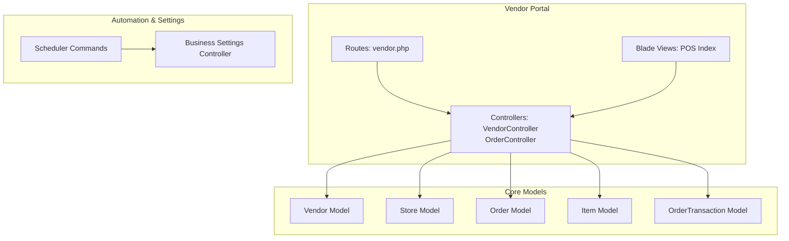
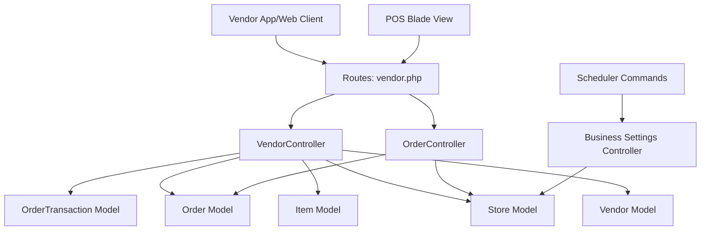
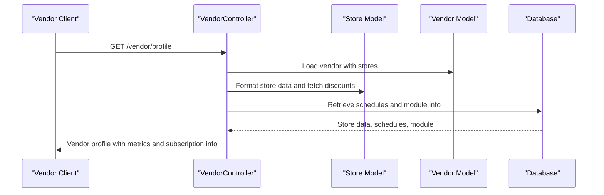
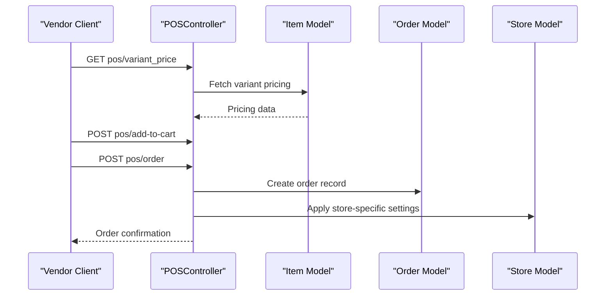
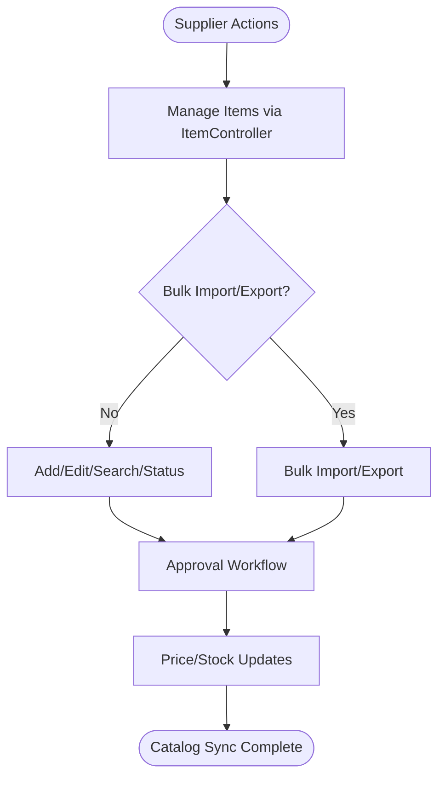
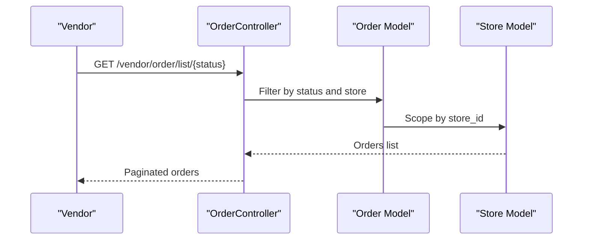
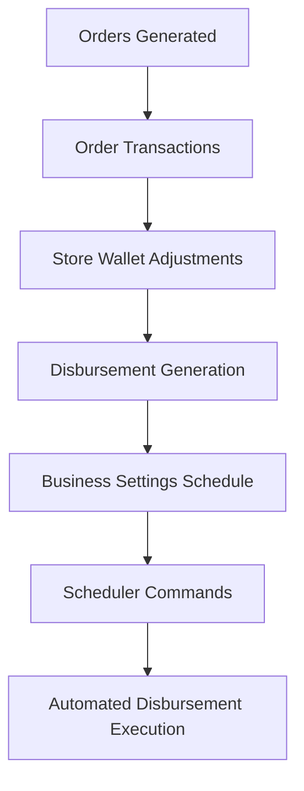
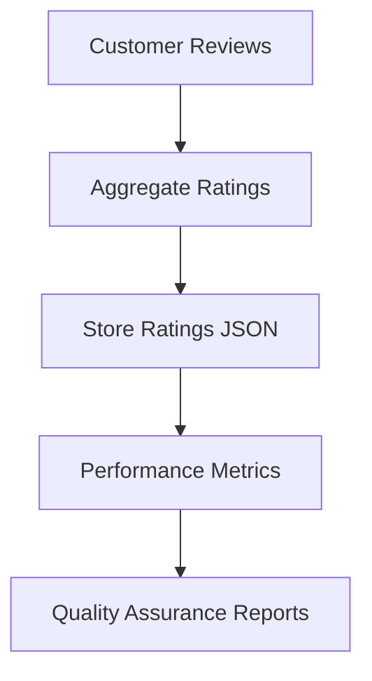
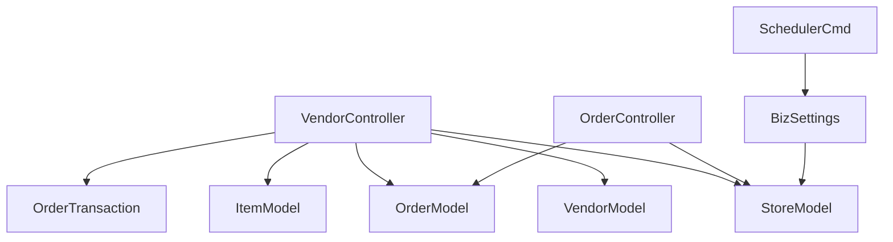

# Supplier Integration

<cite>
**Referenced Files in This Document**
- [vendor.php](file://routes/vendor.php)
- [vendor_controller.php](file://app/Http/Controllers/Api/V1/Vendor/VendorController.php)
- [vendor_order_controller.php](file://app/Http/Controllers/Vendor/OrderController.php)
- [vendor_pos_index.blade.php](file://resources/views/vendor-views/pos/index.blade.php)
- [vendor_pos_routes.json](file://public/vendor_formatted_routes.json)
- [vendor_model.php](file://app/Models/Vendor.php)
- [store_model.php](file://app/Models/Store.php)
- [order_model.php](file://app/Models/Order.php)
- [item_model.php](file://app/Models/Item.php)
- [order_transaction_model.php](file://app/Models/OrderTransaction.php)
- [store_disbursement_scheduler.php](file://app/Console/Commands/StoreDisbursementScheduler.php)
- [business_settings_controller.php](file://app/Http/Controllers/Admin/BusinessSettingsController.php)
- [store_disbursement_scheduler_command.php](file://app/Console/Commands/StoreDisbursementScheduler.php)
- [delivery_disbursement_scheduler_command.php](file://app/Console/Commands/DeliveryManDisbursementScheduler.php)
- [order_security_service.php](file://app/Services/OrderSecurityService.php)
- [store_helper.php](file://app/CentralLogics/store.php)
</cite>

## Table of Contents
1. [Introduction](#introduction)
2. [Project Structure](#project-structure)
3. [Core Components](#core-components)
4. [Architecture Overview](#architecture-overview)
5. [Detailed Component Analysis](#detailed-component-analysis)
6. [Dependency Analysis](#dependency-analysis)
7. [Performance Considerations](#performance-considerations)
8. [Troubleshooting Guide](#troubleshooting-guide)
9. [Conclusion](#conclusion)

## Introduction
This document provides comprehensive documentation for supplier/vendor integration and supply chain management within the platform. It covers supplier onboarding processes, vendor account management, supplier portal functionality, purchase order systems, supplier product catalogs, price synchronization, payment processing, commission calculations, disbursement scheduling, performance metrics, rating systems, quality assurance, inventory management, dropshipping capabilities, multi-supplier order fulfillment, communication systems, automated notifications, and supply chain visibility features.

## Project Structure
The supplier integration spans several key areas:
- Vendor portal routes and controllers for POS, orders, items, wallet, and business settings
- Core models representing vendors, stores, orders, items, and transactions
- Scheduler commands for automated disbursement generation
- Business settings controllers for configuring disbursement schedules
- Blade templates for POS interface
- Security services for order integrity

**Diagram sources**
- [vendor.php:1-307](file://routes/vendor.php#L1-L307)
- [vendor_controller.php:1-800](file://app/Http/Controllers/Api/V1/Vendor/VendorController.php#L1-L800)
- [vendor_order_controller.php:1-200](file://app/Http/Controllers/Vendor/OrderController.php#L1-L200)
- [vendor_pos_index.blade.php:1-33](file://resources/views/vendor-views/pos/index.blade.php#L1-L33)
- [vendor_model.php:1-146](file://app/Models/Vendor.php#L1-L146)
- [store_model.php:1-934](file://app/Models/Store.php#L1-L934)
- [order_model.php:1-200](file://app/Models/Order.php#L1-L200)
- [item_model.php:1-200](file://app/Models/Item.php#L1-L200)
- [order_transaction_model.php:1-47](file://app/Models/OrderTransaction.php#L1-L47)
- [store_disbursement_scheduler_command.php:1-24](file://app/Console/Commands/StoreDisbursementScheduler.php#L1-L24)
- [delivery_disbursement_scheduler_command.php:1-24](file://app/Console/Commands/DeliveryManDisbursementScheduler.php#L1-L24)
- [business_settings_controller.php:362-449](file://app/Http/Controllers/Admin/BusinessSettingsController.php#L362-L449)

**Section sources**
- [vendor.php:1-307](file://routes/vendor.php#L1-L307)
- [vendor_controller.php:1-800](file://app/Http/Controllers/Api/V1/Vendor/VendorController.php#L1-L800)
- [vendor_order_controller.php:1-200](file://app/Http/Controllers/Vendor/OrderController.php#L1-L200)
- [vendor_pos_index.blade.php:1-33](file://resources/views/vendor-views/pos/index.blade.php#L1-L33)
- [vendor_model.php:1-146](file://app/Models/Vendor.php#L1-L146)
- [store_model.php:1-934](file://app/Models/Store.php#L1-L934)
- [order_model.php:1-200](file://app/Models/Order.php#L1-L200)
- [item_model.php:1-200](file://app/Models/Item.php#L1-L200)
- [order_transaction_model.php:1-47](file://app/Models/OrderTransaction.php#L1-L47)
- [store_disbursement_scheduler_command.php:1-24](file://app/Console/Commands/StoreDisbursementScheduler.php#L1-L24)
- [delivery_disbursement_scheduler_command.php:1-24](file://app/Console/Commands/DeliveryManDisbursementScheduler.php#L1-L24)
- [business_settings_controller.php:362-449](file://app/Http/Controllers/Admin/BusinessSettingsController.php#L362-L449)

## Core Components
- Vendor model: Authenticates suppliers, manages store relationships, earnings, and wallet balances
- Store model: Represents supplier storefronts, business settings, ratings, subscriptions, and operational capabilities
- Order model: Tracks purchase orders, statuses, payments, and delivery information
- Item model: Manages supplier product catalogs, pricing, stock, and approval workflows
- OrderTransaction model: Handles transaction records for orders
- Vendor controllers: Provide vendor portal APIs for profile, orders, items, campaigns, and wallet operations
- POS routes and views: Enable in-person purchase order processing within the vendor portal
- Scheduler commands: Automate disbursement generation for stores and delivery personnel
- Business settings controller: Configure disbursement schedules and periods

**Section sources**
- [vendor_model.php:1-146](file://app/Models/Vendor.php#L1-L146)
- [store_model.php:1-934](file://app/Models/Store.php#L1-L934)
- [order_model.php:1-200](file://app/Models/Order.php#L1-L200)
- [item_model.php:1-200](file://app/Models/Item.php#L1-L200)
- [order_transaction_model.php:1-47](file://app/Models/OrderTransaction.php#L1-L47)
- [vendor_controller.php:1-800](file://app/Http/Controllers/Api/V1/Vendor/VendorController.php#L1-L800)
- [vendor_pos_routes.json:15-28](file://public/vendor_formatted_routes.json#L15-L28)

## Architecture Overview
The supplier integration architecture centers around the vendor portal, which exposes REST endpoints for supplier operations. The vendor controller orchestrates supplier profile retrieval, order management, item catalog operations, and wallet-related actions. POS functionality is integrated via dedicated routes and views. Disbursement automation is configured through business settings and executed by scheduler commands.

**Diagram sources**
- [vendor.php:1-307](file://routes/vendor.php#L1-L307)
- [vendor_controller.php:1-800](file://app/Http/Controllers/Api/V1/Vendor/VendorController.php#L1-L800)
- [vendor_order_controller.php:1-200](file://app/Http/Controllers/Vendor/OrderController.php#L1-L200)
- [vendor_pos_index.blade.php:1-33](file://resources/views/vendor-views/pos/index.blade.php#L1-L33)
- [vendor_model.php:1-146](file://app/Models/Vendor.php#L1-L146)
- [store_model.php:1-934](file://app/Models/Store.php#L1-L934)
- [order_model.php:1-200](file://app/Models/Order.php#L1-L200)
- [item_model.php:1-200](file://app/Models/Item.php#L1-L200)
- [order_transaction_model.php:1-47](file://app/Models/OrderTransaction.php#L1-L47)
- [store_disbursement_scheduler_command.php:1-24](file://app/Console/Commands/StoreDisbursementScheduler.php#L1-L24)
- [business_settings_controller.php:362-449](file://app/Http/Controllers/Admin/BusinessSettingsController.php#L362-L449)

## Detailed Component Analysis

### Vendor Profile and Account Management
The vendor profile endpoint aggregates store data, schedules, module information, order counts, and financial metrics. It computes payable balance, dynamic balance types, and subscription-related metadata. The profile supports updating personal information and bank details.

**Diagram sources**
- [vendor_controller.php:47-184](file://app/Http/Controllers/Api/V1/Vendor/VendorController.php#L47-L184)
- [store_model.php:1-934](file://app/Models/Store.php#L1-L934)
- [vendor_model.php:1-146](file://app/Models/Vendor.php#L1-L146)

**Section sources**
- [vendor_controller.php:47-184](file://app/Http/Controllers/Api/V1/Vendor/VendorController.php#L47-L184)

### Purchase Order Systems and POS
The vendor portal includes a POS system for in-person order processing. Routes expose endpoints for variant pricing, cart management, customer lookup, tax updates, discounts, and order placement. The POS view integrates search, product selection, and billing operations.

**Diagram sources**
- [vendor.php:28-48](file://routes/vendor.php#L28-L48)
- [vendor_pos_routes.json:15-28](file://public/vendor_formatted_routes.json#L15-L28)
- [vendor_pos_index.blade.php:1-33](file://resources/views/vendor-views/pos/index.blade.php#L1-L33)
- [item_model.php:1-200](file://app/Models/Item.php#L1-L200)
- [order_model.php:1-200](file://app/Models/Order.php#L1-L200)
- [store_model.php:1-934](file://app/Models/Store.php#L1-L934)

**Section sources**
- [vendor.php:28-48](file://routes/vendor.php#L28-L48)
- [vendor_pos_routes.json:15-28](file://public/vendor_formatted_routes.json#L15-L28)
- [vendor_pos_index.blade.php:1-33](file://resources/views/vendor-views/pos/index.blade.php#L1-L33)

### Supplier Product Catalogs and Price Synchronization
The vendor portal enables suppliers to manage product catalogs, including adding, editing, searching, and bulk importing/exporting items. Items are associated with stores and modules, and their pricing, stock, and approval status are tracked. Price synchronization occurs through item updates and approval workflows.

**Diagram sources**
- [vendor.php:120-158](file://routes/vendor.php#L120-L158)
- [item_model.php:1-200](file://app/Models/Item.php#L1-L200)

**Section sources**
- [vendor.php:120-158](file://routes/vendor.php#L120-L158)
- [item_model.php:1-200](file://app/Models/Item.php#L1-L200)

### Order Management and Multi-Supplier Fulfillment
Order management includes listing orders by status, updating order status, retrieving order details, and exporting orders. The system supports scheduled orders, refund requests, and integration with delivery personnel. Multi-supplier fulfillment is facilitated by store-level order scoping and vendor-specific order filtering.

**Diagram sources**
- [vendor_order_controller.php:27-108](file://app/Http/Controllers/Vendor/OrderController.php#L27-L108)
- [order_model.php:1-200](file://app/Models/Order.php#L1-L200)
- [store_model.php:1-934](file://app/Models/Store.php#L1-L934)

**Section sources**
- [vendor_order_controller.php:27-108](file://app/Http/Controllers/Vendor/OrderController.php#L27-L108)

### Payment Processing, Commission Calculations, and Disbursement Scheduling
Payment processing involves order transactions and wallet adjustments. The vendor profile exposes payable balance, withdrawable balance, and dynamic balance types. Disbursement scheduling is configurable via business settings and executed by scheduler commands for stores and delivery personnel.

**Diagram sources**
- [vendor_controller.php:47-184](file://app/Http/Controllers/Api/V1/Vendor/VendorController.php#L47-L184)
- [order_transaction_model.php:1-47](file://app/Models/OrderTransaction.php#L1-L47)
- [business_settings_controller.php:362-449](file://app/Http/Controllers/Admin/BusinessSettingsController.php#L362-L449)
- [store_disbursement_scheduler_command.php:1-24](file://app/Console/Commands/StoreDisbursementScheduler.php#L1-L24)
- [delivery_disbursement_scheduler_command.php:1-24](file://app/Console/Commands/DeliveryManDisbursementScheduler.php#L1-L24)

**Section sources**
- [vendor_controller.php:47-184](file://app/Http/Controllers/Api/V1/Vendor/VendorController.php#L47-L184)
- [order_transaction_model.php:1-47](file://app/Models/OrderTransaction.php#L1-L47)
- [business_settings_controller.php:362-449](file://app/Http/Controllers/Admin/BusinessSettingsController.php#L362-L449)
- [store_disbursement_scheduler_command.php:1-24](file://app/Console/Commands/StoreDisbursementScheduler.php#L1-L24)
- [delivery_disbursement_scheduler_command.php:1-24](file://app/Console/Commands/DeliveryManDisbursementScheduler.php#L1-L24)

### Supplier Performance Metrics, Rating Systems, and Quality Assurance
Supplier performance metrics include order counts, earnings, and ratings. Ratings are aggregated and stored in the store model, with helper functions to update store ratings based on product ratings. Quality assurance encompasses order status controls, delivery verification, and review management.

**Diagram sources**
- [store_helper.php:512-529](file://app/CentralLogics/store.php#L512-L529)
- [store_model.php:574-583](file://app/Models/Store.php#L574-L583)

**Section sources**
- [store_helper.php:512-529](file://app/CentralLogics/store.php#L512-L529)
- [store_model.php:574-583](file://app/Models/Store.php#L574-L583)

### Inventory Management and Dropshipping Capabilities
Inventory management includes stock tracking, low stock alerts, and stock limit configurations. Dropshipping capabilities are indicated by store business model settings and operational flags within the store model, enabling suppliers to manage fulfillment modes.

**Section sources**
- [vendor_controller.php:173-181](file://app/Http/Controllers/Api/V1/Vendor/VendorController.php#L173-L181)
- [store_model.php:1-934](file://app/Models/Store.php#L1-L934)

### Communication Systems and Automated Notifications
Communication systems include FCM token updates, notifications, and messaging. Automated notifications are triggered during order events, and messaging allows supplier-customer conversations.

**Section sources**
- [vendor_controller.php:585-634](file://app/Http/Controllers/Api/V1/Vendor/VendorController.php#L585-L634)
- [vendor.php:284-288](file://routes/vendor.php#L284-L288)

### Supply Chain Visibility Features
Supply chain visibility is achieved through order tracking logs, delivery history, and real-time location updates. The order model includes tracking logs and delivery history relationships to provide transparency across the fulfillment process.

**Section sources**
- [order_model.php:196-200](file://app/Models/Order.php#L196-L200)

## Dependency Analysis
The vendor portal depends on core models for data access and business logic. Controllers orchestrate interactions between routes, models, and external services. Scheduler commands depend on business settings for schedule configuration.

**Diagram sources**
- [vendor_controller.php:1-800](file://app/Http/Controllers/Api/V1/Vendor/VendorController.php#L1-L800)
- [vendor_order_controller.php:1-200](file://app/Http/Controllers/Vendor/OrderController.php#L1-L200)
- [vendor_model.php:1-146](file://app/Models/Vendor.php#L1-L146)
- [store_model.php:1-934](file://app/Models/Store.php#L1-L934)
- [order_model.php:1-200](file://app/Models/Order.php#L1-L200)
- [item_model.php:1-200](file://app/Models/Item.php#L1-L200)
- [order_transaction_model.php:1-47](file://app/Models/OrderTransaction.php#L1-L47)
- [store_disbursement_scheduler_command.php:1-24](file://app/Console/Commands/StoreDisbursementScheduler.php#L1-L24)
- [business_settings_controller.php:362-449](file://app/Http/Controllers/Admin/BusinessSettingsController.php#L362-L449)

**Section sources**
- [vendor_controller.php:1-800](file://app/Http/Controllers/Api/V1/Vendor/VendorController.php#L1-L800)
- [vendor_order_controller.php:1-200](file://app/Http/Controllers/Vendor/OrderController.php#L1-L200)
- [vendor_model.php:1-146](file://app/Models/Vendor.php#L1-L146)
- [store_model.php:1-934](file://app/Models/Store.php#L1-L934)
- [order_model.php:1-200](file://app/Models/Order.php#L1-L200)
- [item_model.php:1-200](file://app/Models/Item.php#L1-L200)
- [order_transaction_model.php:1-47](file://app/Models/OrderTransaction.php#L1-L47)
- [store_disbursement_scheduler_command.php:1-24](file://app/Console/Commands/StoreDisbursementScheduler.php#L1-L24)
- [business_settings_controller.php:362-449](file://app/Http/Controllers/Admin/BusinessSettingsController.php#L362-L449)

## Performance Considerations
- Use pagination for order and item listings to reduce payload sizes
- Optimize queries with appropriate scopes and eager loading
- Implement caching for frequently accessed store and product data
- Monitor scheduler command execution intervals and resource usage
- Validate and sanitize inputs for POS operations to prevent invalid data

## Troubleshooting Guide
Common issues and resolutions:
- Order status update failures: Verify order confirmation model settings and delivery personnel availability
- POS cart operations: Ensure variant pricing and stock availability checks are functioning
- Disbursement generation: Confirm business settings schedule configuration and scheduler command permissions
- Rating aggregation: Validate rating JSON structure and helper function updates
- Notification delivery: Check FCM token updates and notification channel configurations

**Section sources**
- [vendor_controller.php:347-504](file://app/Http/Controllers/Api/V1/Vendor/VendorController.php#L347-L504)
- [vendor_order_controller.php:27-108](file://app/Http/Controllers/Vendor/OrderController.php#L27-L108)
- [business_settings_controller.php:411-442](file://app/Http/Controllers/Admin/BusinessSettingsController.php#L411-L442)
- [store_helper.php:512-529](file://app/CentralLogics/store.php#L512-L529)

## Conclusion
The supplier/vendor integration provides a comprehensive suite of capabilities for managing supplier accounts, product catalogs, purchase orders, payments, and supply chain operations. The modular architecture, automated scheduling, and robust data models support scalable supplier onboarding and efficient multi-supplier order fulfillment while maintaining strong security and visibility features.