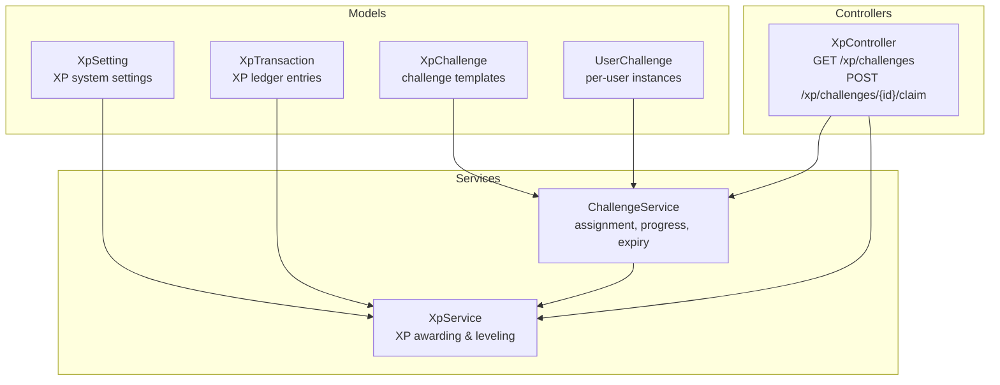
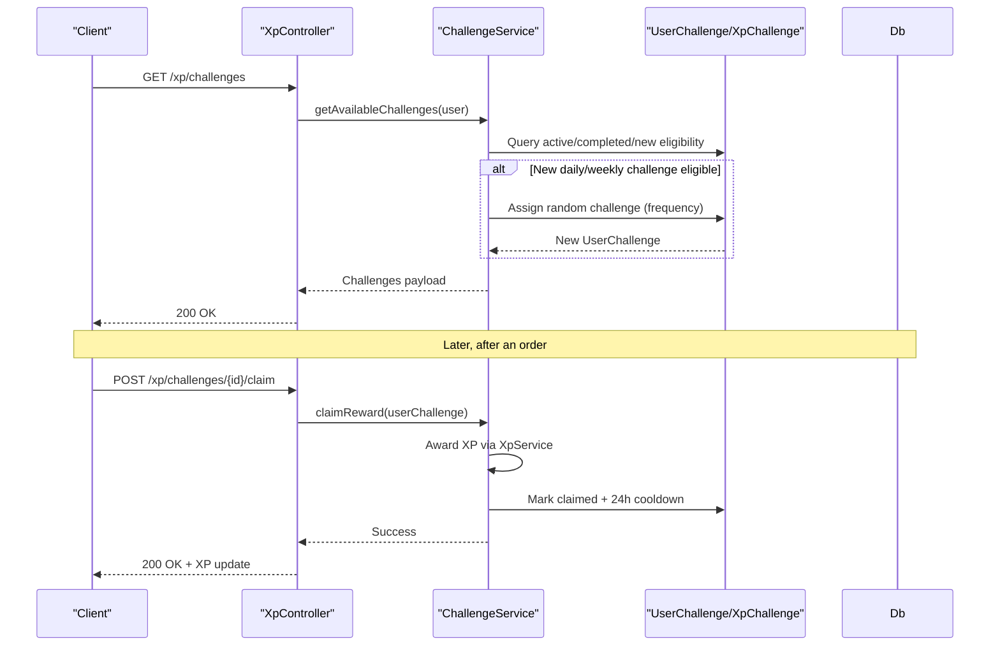
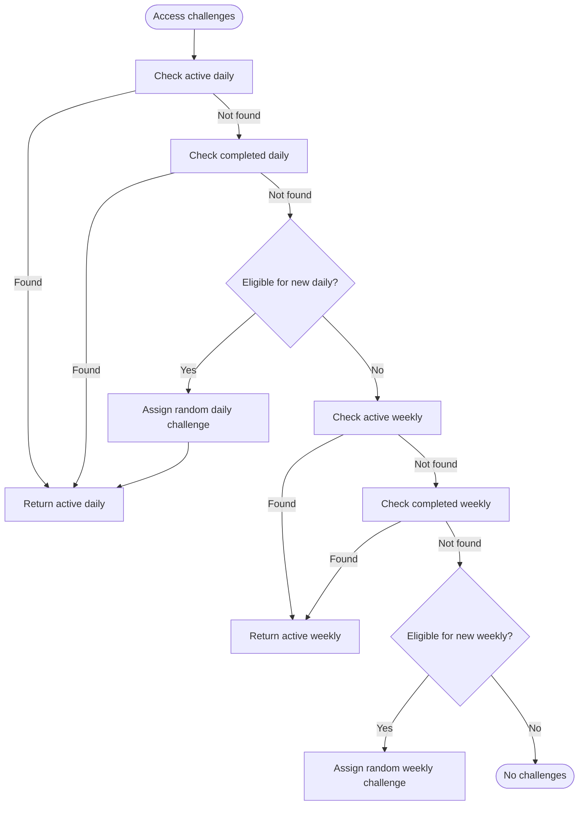
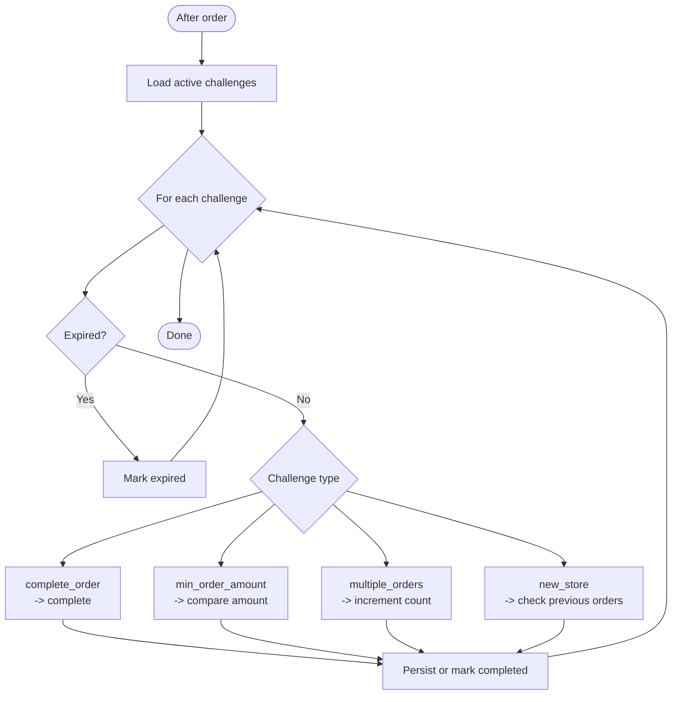
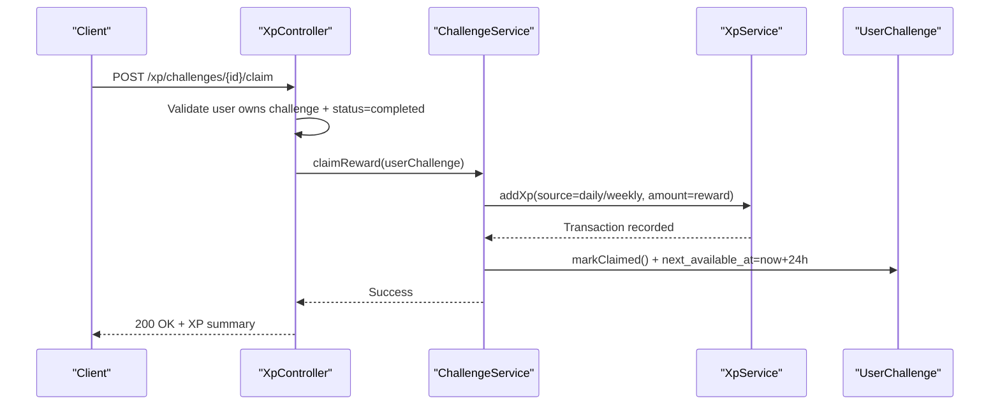
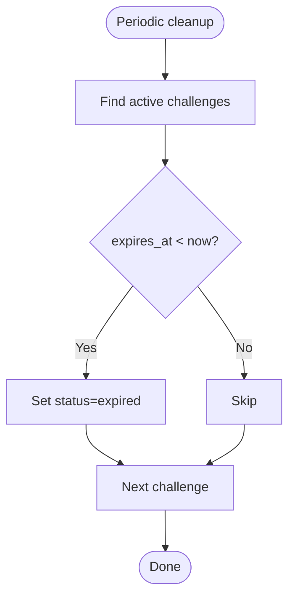
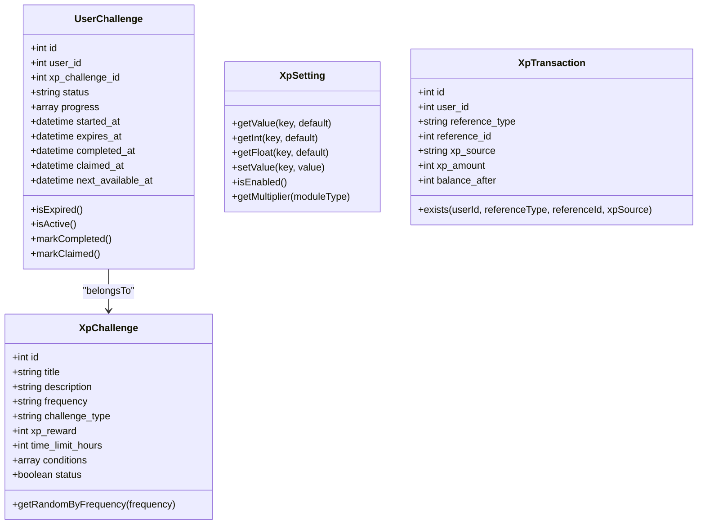
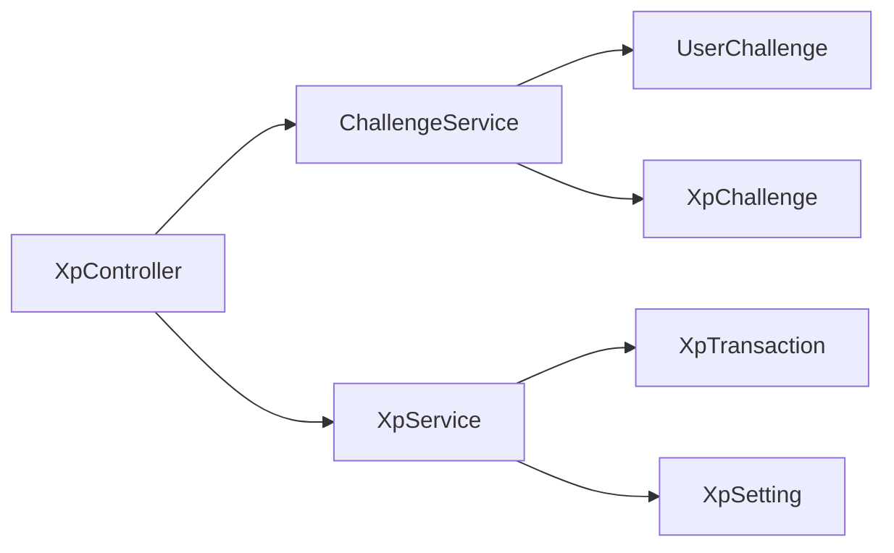

# Challenge System

<cite>
**Referenced Files in This Document**
- [ChallengeService.php](file://app/Services/ChallengeService.php)
- [XpController.php](file://app/Http/Controllers/Api/V1/XpController.php)
- [XpService.php](file://app/Services/XpService.php)
- [XpChallenge.php](file://app/Models/XpChallenge.php)
- [UserChallenge.php](file://app/Models/UserChallenge.php)
- [XpSetting.php](file://app/Models/XpSetting.php)
- [XpTransaction.php](file://app/Models/XpTransaction.php)
- [ChallengesSeeder.php](file://database/seeders/ChallengesSeeder.php)
</cite>

## Table of Contents
1. [Introduction](#introduction)
2. [Project Structure](#project-structure)
3. [Core Components](#core-components)
4. [Architecture Overview](#architecture-overview)
5. [Detailed Component Analysis](#detailed-component-analysis)
6. [Dependency Analysis](#dependency-analysis)
7. [Performance Considerations](#performance-considerations)
8. [Troubleshooting Guide](#troubleshooting-guide)
9. [Conclusion](#conclusion)

## Introduction
This document explains the challenge system implementation, covering daily and weekly challenge mechanics, progress tracking, and reward claiming. It documents challenge types (complete_order, min_order_amount, multiple_orders, new_store), the assignment and lazy generation process, progress tracking formulas, expiration and reset behavior, and integration with XP point accumulation.

## Project Structure
The challenge system spans models, services, and controllers:
- Models define challenge templates, user-specific challenge instances, XP settings, and XP transactions.
- Services encapsulate challenge assignment, progress tracking, expiration, and XP awarding.
- Controllers expose endpoints for retrieving challenges and claiming rewards.

**Diagram sources**
- [XpChallenge.php:1-64](file://app/Models/XpChallenge.php#L1-L64)
- [UserChallenge.php:1-118](file://app/Models/UserChallenge.php#L1-L118)
- [XpSetting.php:1-68](file://app/Models/XpSetting.php#L1-L68)
- [XpTransaction.php:1-53](file://app/Models/XpTransaction.php#L1-L53)
- [ChallengeService.php:1-321](file://app/Services/ChallengeService.php#L1-L321)
- [XpService.php:1-336](file://app/Services/XpService.php#L1-L336)
- [XpController.php:1-574](file://app/Http/Controllers/Api/V1/XpController.php#L1-L574)

**Section sources**
- [ChallengeService.php:1-321](file://app/Services/ChallengeService.php#L1-L321)
- [XpController.php:1-574](file://app/Http/Controllers/Api/V1/XpController.php#L1-L574)
- [XpService.php:1-336](file://app/Services/XpService.php#L1-L336)
- [XpChallenge.php:1-64](file://app/Models/XpChallenge.php#L1-L64)
- [UserChallenge.php:1-118](file://app/Models/UserChallenge.php#L1-L118)
- [XpSetting.php:1-68](file://app/Models/XpSetting.php#L1-L68)
- [XpTransaction.php:1-53](file://app/Models/XpTransaction.php#L1-L53)

## Core Components
- ChallengeService: Handles challenge availability, assignment, progress tracking, expiration, and reward claiming.
- XpController: Exposes endpoints for challenge retrieval and reward claiming.
- XpService: Awards XP, handles leveling, and maintains XP transactions.
- XpChallenge: Defines challenge templates (type, conditions, XP reward, frequency).
- UserChallenge: Tracks per-user challenge instances, progress, status, and timestamps.
- XpSetting: Stores XP-related configuration values.
- XpTransaction: Records XP additions and triggers level-ups.

**Section sources**
- [ChallengeService.php:12-321](file://app/Services/ChallengeService.php#L12-L321)
- [XpController.php:253-309](file://app/Http/Controllers/Api/V1/XpController.php#L253-L309)
- [XpService.php:15-336](file://app/Services/XpService.php#L15-L336)
- [XpChallenge.php:8-63](file://app/Models/XpChallenge.php#L8-L63)
- [UserChallenge.php:9-118](file://app/Models/UserChallenge.php#L9-L118)
- [XpSetting.php:8-67](file://app/Models/XpSetting.php#L8-L67)
- [XpTransaction.php:8-52](file://app/Models/XpTransaction.php#L8-L52)

## Architecture Overview
The challenge lifecycle:
- Lazy assignment: On first access, daily and weekly challenges are lazily generated if eligible.
- Progress tracking: After each order, active challenges are evaluated against the order details.
- Completion: Challenges reach completion when thresholds are met.
- Claiming: Users claim XP rewards for completed challenges.
- Expiration: Challenges expire either by time limit or by reset cadence.

**Diagram sources**
- [XpController.php:253-309](file://app/Http/Controllers/Api/V1/XpController.php#L253-L309)
- [ChallengeService.php:18-321](file://app/Services/ChallengeService.php#L18-L321)
- [XpService.php:20-76](file://app/Services/XpService.php#L20-L76)

## Detailed Component Analysis

### Challenge Types and Mechanics
- complete_order: Binary completion; any qualifying order completes the challenge.
- min_order_amount: Requires a single order meeting or exceeding a minimum spend threshold.
- multiple_orders: Requires completing a target number of orders within the challenge period.
- new_store: First-time purchase at a previously unvisited store completes the challenge.

Progress tracking and completion indicators:
- Binary types (complete_order, new_store): progress indicates completion via a boolean flag.
- min_order_amount: progress tracks amount_spent vs target.
- multiple_orders: progress tracks orders_completed vs target.

Challenge assignment and initialization:
- Random selection from active templates filtered by frequency.
- Progress initialized according to challenge type and conditions.

Expiration and resets:
- Time-based expiration: challenges expire after time_limit_hours.
- Daily reset: midnight reset allows new daily challenges regardless of cooldown.
- Weekly reset: Saturday boundary reset allows new weekly challenges regardless of cooldown.
- Cooldown: After claiming, a 24-hour next_available_at prevents immediate reassignment.

Integration with XP:
- Upon successful claim, XP is awarded with a source indicating daily or weekly challenge.
- XP addition updates user totals and may trigger level-ups.

**Section sources**
- [ChallengeService.php:147-191](file://app/Services/ChallengeService.php#L147-L191)
- [ChallengeService.php:196-256](file://app/Services/ChallengeService.php#L196-L256)
- [ChallengeService.php:314-319](file://app/Services/ChallengeService.php#L314-L319)
- [XpController.php:272-309](file://app/Http/Controllers/Api/V1/XpController.php#L272-L309)
- [XpService.php:20-76](file://app/Services/XpService.php#L20-L76)

### Assignment and Lazy Generation
- Daily challenges:
  - Eligibility checks include recent claimed challenge and 24h cooldown.
  - Midnight reset logic overrides cooldown if last claim was before today.
- Weekly challenges:
  - Eligibility checks include recent claimed challenge and 24h cooldown.
  - Weekly reset logic checks week-of-year and year boundaries.

**Diagram sources**
- [ChallengeService.php:18-142](file://app/Services/ChallengeService.php#L18-L142)

**Section sources**
- [ChallengeService.php:41-88](file://app/Services/ChallengeService.php#L41-L88)
- [ChallengeService.php:94-142](file://app/Services/ChallengeService.php#L94-L142)

### Progress Tracking System
- Active challenges are evaluated after each order.
- For each challenge type:
  - complete_order: marks completed immediately.
  - min_order_amount: compares order amount to target.
  - multiple_orders: increments counter towards target.
  - new_store: verifies no prior delivered orders at the store.
- Completed challenges are marked and persisted; otherwise progress is saved.

**Diagram sources**
- [ChallengeService.php:196-256](file://app/Services/ChallengeService.php#L196-L256)

**Section sources**
- [ChallengeService.php:196-256](file://app/Services/ChallengeService.php#L196-L256)

### Reward Claiming Workflow
- Endpoint: POST /xp/challenges/{id}/claim
- Validation:
  - Challenge must belong to the requesting user.
  - Challenge status must be completed.
- Execution:
  - Award XP via XpService with appropriate source (daily or weekly).
  - Mark challenge as claimed and set next_available_at to 24h later.
- Response includes XP earned, new total XP, and new level.

**Diagram sources**
- [XpController.php:272-309](file://app/Http/Controllers/Api/V1/XpController.php#L272-L309)
- [ChallengeService.php:261-285](file://app/Services/ChallengeService.php#L261-L285)
- [XpService.php:20-76](file://app/Services/XpService.php#L20-L76)

**Section sources**
- [XpController.php:272-309](file://app/Http/Controllers/Api/V1/XpController.php#L272-L309)
- [ChallengeService.php:261-285](file://app/Services/ChallengeService.php#L261-L285)
- [XpService.php:20-76](file://app/Services/XpService.php#L20-L76)

### Expiration and Reset Mechanisms
- Time-based expiration:
  - Challenges expire after time_limit_hours from creation.
  - Cron-style cleanup updates expired active challenges to expired.
- Daily reset:
  - Midnight boundary allows new daily challenges even if within 24h cooldown.
- Weekly reset:
  - Weekly boundary (Saturday) allows new weekly challenges even if within 24h cooldown.

**Diagram sources**
- [ChallengeService.php:314-319](file://app/Services/ChallengeService.php#L314-L319)

**Section sources**
- [ChallengeService.php:314-319](file://app/Services/ChallengeService.php#L314-L319)

### Data Models Overview

**Diagram sources**
- [XpChallenge.php:8-63](file://app/Models/XpChallenge.php#L8-L63)
- [UserChallenge.php:9-118](file://app/Models/UserChallenge.php#L9-L118)
- [XpSetting.php:8-67](file://app/Models/XpSetting.php#L8-L67)
- [XpTransaction.php:8-52](file://app/Models/XpTransaction.php#L8-L52)

**Section sources**
- [XpChallenge.php:8-63](file://app/Models/XpChallenge.php#L8-L63)
- [UserChallenge.php:9-118](file://app/Models/UserChallenge.php#L9-L118)
- [XpSetting.php:8-67](file://app/Models/XpSetting.php#L8-L67)
- [XpTransaction.php:8-52](file://app/Models/XpTransaction.php#L8-L52)

## Dependency Analysis
- ChallengeService depends on:
  - XpChallenge for template selection and conditions.
  - UserChallenge for persistence of per-user instances.
  - XpService for awarding XP upon claim.
- XpController orchestrates:
  - Challenge retrieval and reward claiming.
  - Delegates to ChallengeService and XpService.
- XpService depends on:
  - XpSetting for configuration.
  - XpTransaction for audit trail and duplicate prevention.

**Diagram sources**
- [XpController.php:1-574](file://app/Http/Controllers/Api/V1/XpController.php#L1-L574)
- [ChallengeService.php:1-321](file://app/Services/ChallengeService.php#L1-L321)
- [XpService.php:1-336](file://app/Services/XpService.php#L1-L336)
- [XpChallenge.php:1-64](file://app/Models/XpChallenge.php#L1-L64)
- [UserChallenge.php:1-118](file://app/Models/UserChallenge.php#L1-L118)
- [XpSetting.php:1-68](file://app/Models/XpSetting.php#L1-L68)
- [XpTransaction.php:1-53](file://app/Models/XpTransaction.php#L1-L53)

**Section sources**
- [XpController.php:1-574](file://app/Http/Controllers/Api/V1/XpController.php#L1-L574)
- [ChallengeService.php:1-321](file://app/Services/ChallengeService.php#L1-L321)
- [XpService.php:1-336](file://app/Services/XpService.php#L1-L336)

## Performance Considerations
- Lazy assignment minimizes unnecessary writes; challenges are created only when eligible.
- Progress evaluation iterates active challenges per order; keep active challenge counts reasonable.
- Expiration cleanup runs periodically to prevent stale active records.
- XP awarding uses atomic transactions to avoid race conditions.

## Troubleshooting Guide
Common issues and resolutions:
- Challenge not found:
  - Ensure the challenge ID belongs to the authenticated user.
  - Verify the challenge exists and is accessible.
- Challenge not completed:
  - Confirm the challenge’s status is completed before claiming.
  - Review order conditions (amount, count, store) to ensure completion criteria were met.
- Failed to claim reward:
  - Check backend logs for exceptions during XP awarding.
  - Ensure XP system is enabled and settings are valid.
- Duplicate XP award prevention:
  - XpTransaction existence check prevents duplicate awards for the same reference and source.

**Section sources**
- [XpController.php:280-308](file://app/Http/Controllers/Api/V1/XpController.php#L280-L308)
- [XpService.php:33-37](file://app/Services/XpService.php#L33-L37)
- [XpTransaction.php:34-42](file://app/Models/XpTransaction.php#L34-L42)

## Conclusion
The challenge system integrates template-driven daily and weekly challenges with dynamic progress tracking, strict expiration and reset policies, and seamless XP reward integration. The lazy assignment model ensures efficient resource usage while providing timely and motivating goals aligned with user behavior.