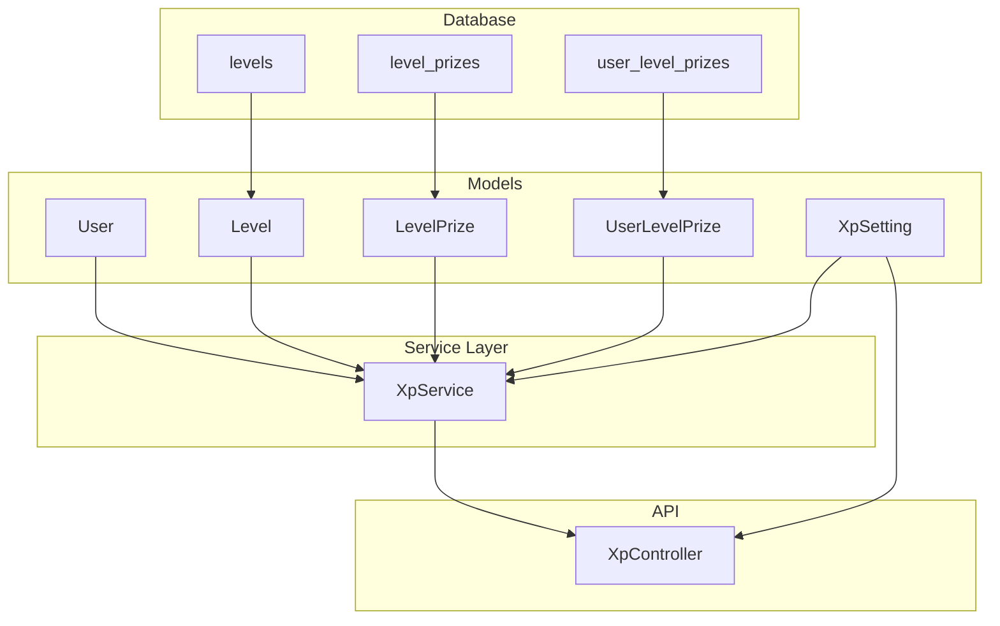
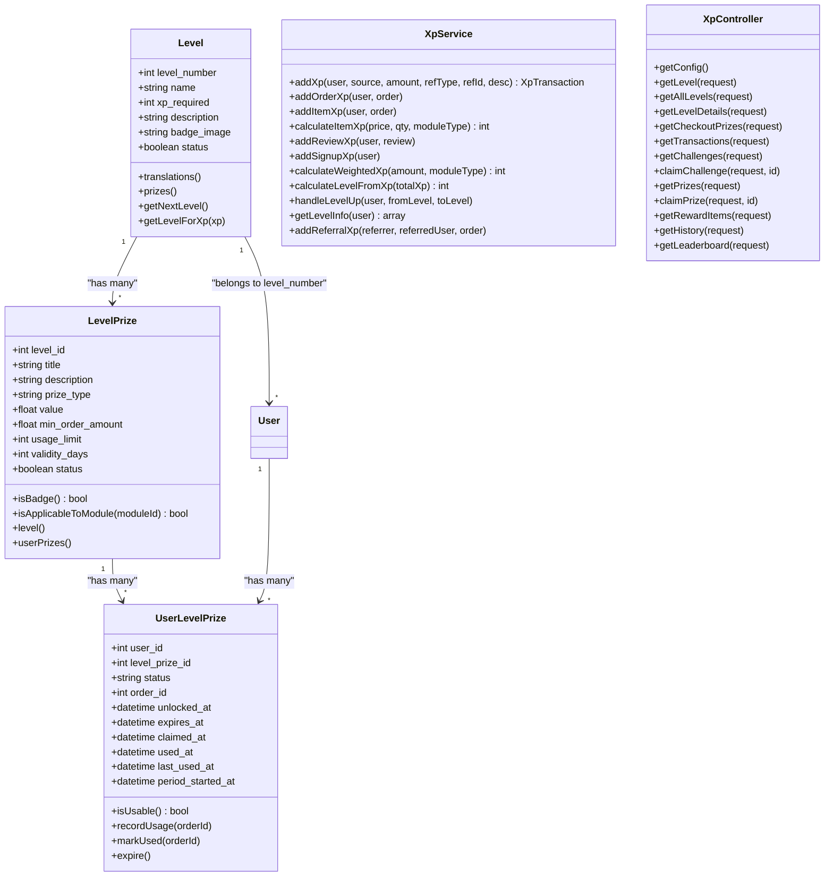
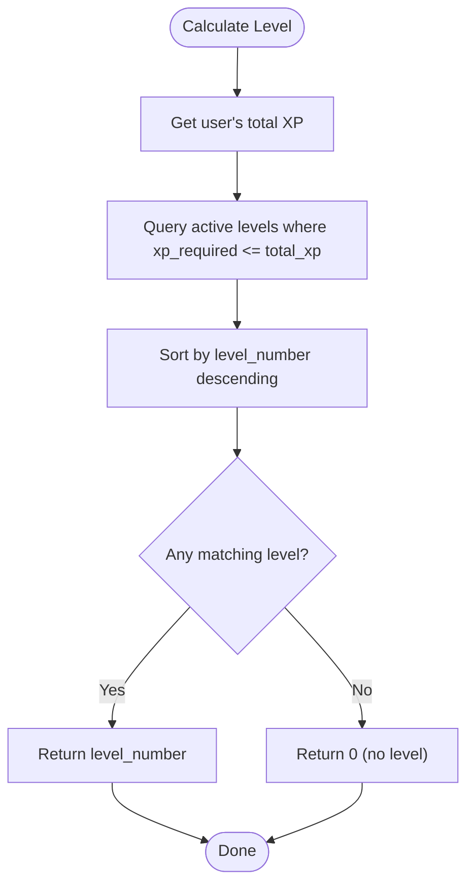
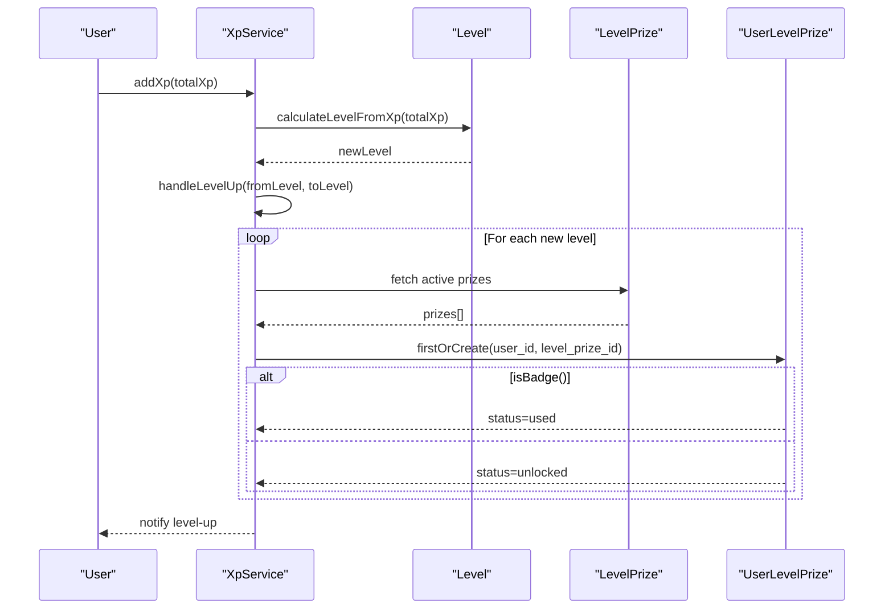
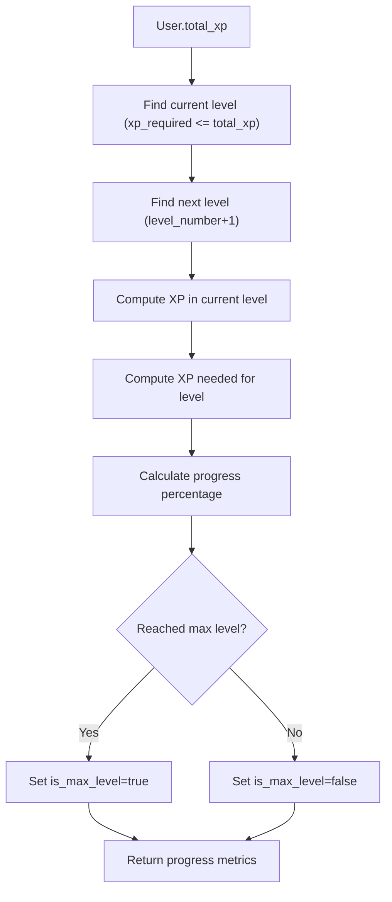
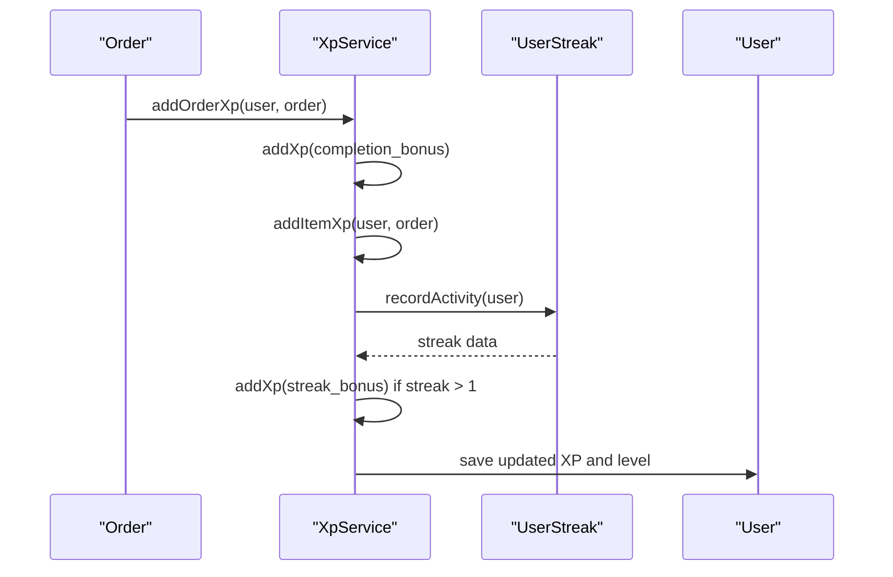
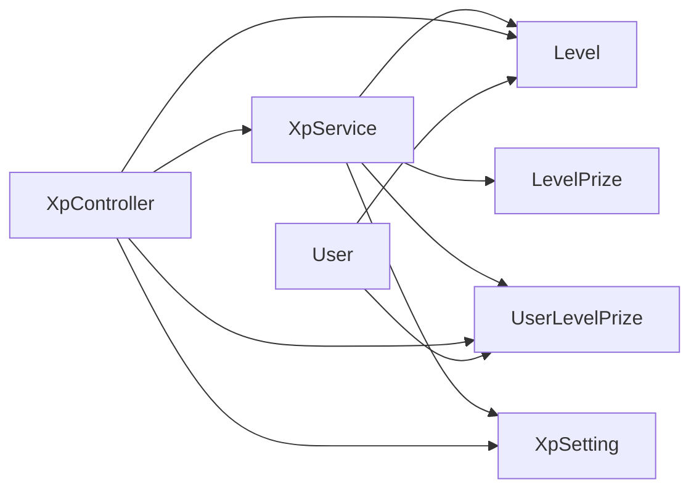

# Level Progression System

<cite>
**Referenced Files in This Document**
- [Level.php](file://app/Models/Level.php)
- [LevelPrize.php](file://app/Models/LevelPrize.php)
- [UserLevelPrize.php](file://app/Models/UserLevelPrize.php)
- [XpService.php](file://app/Services/XpService.php)
- [XpController.php](file://app/Http/Controllers/Api/V1/XpController.php)
- [LevelsSeeder.php](file://database/seeders/LevelsSeeder.php)
- [2025_12_28_000002_create_levels_table.php](file://database/migrations/2025_12_28_000002_create_levels_table.php)
- [2025_12_28_000003_create_level_prizes_table.php](file://database/migrations/2025_12_28_000003_create_level_prizes_table.php)
- [2025_12_28_000007_create_user_level_prizes_table.php](file://database/migrations/2025_12_28_000007_create_user_level_prizes_table.php)
- [User.php](file://app/Models/User.php)
- [XpSetting.php](file://app/Models/XpSetting.php)
</cite>

## Table of Contents
1. [Introduction](#introduction)
2. [Project Structure](#project-structure)
3. [Core Components](#core-components)
4. [Architecture Overview](#architecture-overview)
5. [Detailed Component Analysis](#detailed-component-analysis)
6. [Dependency Analysis](#dependency-analysis)
7. [Performance Considerations](#performance-considerations)
8. [Troubleshooting Guide](#troubleshooting-guide)
9. [Conclusion](#conclusion)

## Introduction
This document provides comprehensive documentation for the level progression system, covering level configuration, progression requirements, milestone achievements, unlocking mechanisms, badge assignment, visual progression indicators, and the relationship between levels and prize unlocking. It also documents the level configuration API endpoints, level details retrieval, and the combined level information endpoint. Additionally, it explains level progression tracking, streak integration with level advancement, and the maximum level cap of 10 levels.

## Project Structure
The level progression system spans several core components:
- Database schema: levels, level_prizes, user_level_prizes
- Domain models: Level, LevelPrize, UserLevelPrize
- Service layer: XpService for XP calculations, level-ups, and notifications
- API controllers: XpController for exposing level configuration and data via endpoints
- Configuration: XpSetting for system-wide XP behavior
- Seeding: LevelsSeeder for default level structure and prizes



**Diagram sources**
- [2025_12_28_000002_create_levels_table.php:14-23](file://database/migrations/2025_12_28_000002_create_levels_table.php#L14-L23)
- [2025_12_28_000003_create_level_prizes_table.php:14-28](file://database/migrations/2025_12_28_000003_create_level_prizes_table.php#L14-L28)
- [2025_12_28_000007_create_user_level_prizes_table.php:14-30](file://database/migrations/2025_12_28_000007_create_user_level_prizes_table.php#L14-L30)
- [Level.php:11-96](file://app/Models/Level.php#L11-L96)
- [LevelPrize.php:9-66](file://app/Models/LevelPrize.php#L9-L66)
- [UserLevelPrize.php:10-51](file://app/Models/UserLevelPrize.php#L10-L51)
- [XpService.php:15-76](file://app/Services/XpService.php#L15-L76)
- [XpController.php:20-83](file://app/Http/Controllers/Api/V1/XpController.php#L20-L83)

**Section sources**
- [2025_12_28_000002_create_levels_table.php:14-23](file://database/migrations/2025_12_28_000002_create_levels_table.php#L14-L23)
- [2025_12_28_000003_create_level_prizes_table.php:14-28](file://database/migrations/2025_12_28_000003_create_level_prizes_table.php#L14-L28)
- [2025_12_28_000007_create_user_level_prizes_table.php:14-30](file://database/migrations/2025_12_28_000007_create_user_level_prizes_table.php#L14-L30)

## Core Components
- Level model: Defines level number, XP requirement, name, description, badge image, and relationships to prizes and translations.
- LevelPrize model: Defines prize types (badge, free_item, free_delivery, discount, wallet_credit, custom), values, validity periods, usage limits, and applicability.
- UserLevelPrize model: Tracks individual user instances of level prizes, statuses (unlocked, claimed, used, expired), expiration, and usage tracking.
- XpService: Handles XP accumulation, level calculation, level-up detection, automatic prize unlocking, and notifications.
- XpController: Exposes endpoints for configuration, level info, levels with prizes, and combined level details.
- XpSetting: Provides XP-related configuration values and multipliers.
- LevelsSeeder: Seeds default levels 1–10 with XP requirements and default prizes.

**Section sources**
- [Level.php:11-152](file://app/Models/Level.php#L11-L152)
- [LevelPrize.php:9-97](file://app/Models/LevelPrize.php#L9-L97)
- [UserLevelPrize.php:10-203](file://app/Models/UserLevelPrize.php#L10-L203)
- [XpService.php:15-336](file://app/Services/XpService.php#L15-L336)
- [XpController.php:20-574](file://app/Http/Controllers/Api/V1/XpController.php#L20-L574)
- [XpSetting.php:8-68](file://app/Models/XpSetting.php#L8-L68)
- [LevelsSeeder.php:9-158](file://database/seeders/LevelsSeeder.php#L9-L158)

## Architecture Overview
The system follows a layered architecture:
- Data layer: Eloquent models with foreign key relationships between levels, level prizes, and user-level prizes.
- Service layer: XpService encapsulates business logic for XP calculations, level-ups, and notifications.
- API layer: XpController exposes endpoints for clients to fetch configuration, current level, and level/prize details.
- Configuration layer: XpSetting centralizes XP behavior settings and multipliers.



**Diagram sources**
- [Level.php:11-152](file://app/Models/Level.php#L11-L152)
- [LevelPrize.php:9-97](file://app/Models/LevelPrize.php#L9-L97)
- [UserLevelPrize.php:10-203](file://app/Models/UserLevelPrize.php#L10-L203)
- [XpService.php:15-336](file://app/Services/XpService.php#L15-L336)
- [XpController.php:20-574](file://app/Http/Controllers/Api/V1/XpController.php#L20-L574)

## Detailed Component Analysis

### Level Configuration and Default Structure
The default level structure spans from Starter (Level 1, 50 XP) through Legendary (Level 10, 9000 XP). Each level defines a unique XP threshold required to reach it. The seeding process creates these levels and assigns default prizes per level.

```mermaid
erDiagram
LEVELS {
int id PK
uint level_number UK
string name
bigint xp_required
text description
string badge_image
boolean status
timestamps
}
LEVEL_PRIZES {
int id PK
int level_id FK
string title
text description
enum prize_type
decimal value
decimal min_order_amount
int usage_limit
int validity_days
boolean status
timestamps
}
USER_LEVEL_PRIZES {
int id PK
int user_id FK
int level_prize_id FK
enum status
int order_id
timestamp unlocked_at
timestamp expires_at
timestamp claimed_at
timestamp used_at
timestamps
}
LEVELS ||--o{ LEVEL_PRIZES : "contains"
LEVEL_PRIZES ||--o{ USER_LEVEL_PRIZES : "awarded as"
```

**Diagram sources**
- [2025_12_28_000002_create_levels_table.php:14-23](file://database/migrations/2025_12_28_000002_create_levels_table.php#L14-L23)
- [2025_12_28_000003_create_level_prizes_table.php:14-28](file://database/migrations/2025_12_28_000003_create_level_prizes_table.php#L14-L28)
- [2025_12_28_000007_create_user_level_prizes_table.php:14-30](file://database/migrations/2025_12_28_000007_create_user_level_prizes_table.php#L14-L30)

**Section sources**
- [LevelsSeeder.php:16-39](file://database/seeders/LevelsSeeder.php#L16-L39)
- [2025_12_28_000002_create_levels_table.php:16-18](file://database/migrations/2025_12_28_000002_create_levels_table.php#L16-L18)

### Level Progression Requirements and Calculation
- Level thresholds: Each level specifies the cumulative XP required to reach it.
- Current level determination: The service calculates the current level based on total XP using the highest level whose XP requirement is less than or equal to the user's total XP.
- Maximum level cap: The system caps at level 10, with a public configuration endpoint returning the max level.



**Diagram sources**
- [XpService.php:215-222](file://app/Services/XpService.php#L215-L222)
- [Level.php:109-115](file://app/Models/Level.php#L109-L115)

**Section sources**
- [XpService.php:215-222](file://app/Services/XpService.php#L215-L222)
- [Level.php:109-115](file://app/Models/Level.php#L109-L115)

### Level Unlocking Mechanism and Badge Assignment
- Automatic unlocking: When a user's XP crosses a level threshold, the service triggers a level-up and unlocks all active prizes associated with newly reached levels.
- Badge assignment: Prizes marked as badges (non-claimable) are automatically set to "used" upon unlocking, while other prizes are set to "unlocked".
- Notifications: Upon level-up, push notifications and in-app notifications are sent to the user with the level name and badge image.



**Diagram sources**
- [XpService.php:227-286](file://app/Services/XpService.php#L227-L286)
- [LevelPrize.php:92-95](file://app/Models/LevelPrize.php#L92-L95)
- [UserLevelPrize.php:244-256](file://app/Models/UserLevelPrize.php#L244-L256)

**Section sources**
- [XpService.php:227-286](file://app/Services/XpService.php#L227-L286)
- [LevelPrize.php:92-95](file://app/Models/LevelPrize.php#L92-L95)
- [UserLevelPrize.php:244-256](file://app/Models/UserLevelPrize.php#L244-L256)

### Visual Progression Indicators and Milestone Achievements
- Visual indicators: Each level includes a badge image URL derived from storage metadata, ensuring consistent asset resolution.
- Progress tracking: The User model computes XP progress to the next level, including current XP, XP for current level, XP to next level, progress percentage, and whether the user has reached the maximum level.
- Milestone achievements: Level-up events are recorded in XP transactions and reflected in the history endpoint as "level_up" entries.



**Diagram sources**
- [User.php:177-200](file://app/Models/User.php#L177-L200)
- [XpController.php:28-49](file://app/Http/Controllers/Api/V1/XpController.php#L28-L49)

**Section sources**
- [Level.php:76-88](file://app/Models/Level.php#L76-L88)
- [User.php:177-200](file://app/Models/User.php#L177-L200)
- [XpController.php:28-49](file://app/Http/Controllers/Api/V1/XpController.php#L28-L49)

### Prizes Unlocking and Types
Prizes are categorized into multiple types, each with distinct unlocking and usage behaviors:
- Badge: Non-claimable, automatically set to "used" upon level-up.
- Free item: Claimable; can be used for a free item purchase.
- Free delivery: Claimable; can be applied to meet minimum order thresholds.
- Discount: Claimable; applies a fixed discount to qualifying orders.
- Wallet credit: Claimable; automatically credited to the user's wallet upon claiming.
- Custom: Claimable; specific custom rewards defined per level.

Prize constraints include validity days, usage limits, minimum order amounts, and optional module applicability.

**Section sources**
- [LevelsSeeder.php:48-156](file://database/seeders/LevelsSeeder.php#L48-L156)
- [LevelPrize.php:15-25](file://app/Models/LevelPrize.php#L15-L25)
- [LevelPrize.php:78-87](file://app/Models/LevelPrize.php#L78-L87)
- [UserLevelPrize.php:54-80](file://app/Models/UserLevelPrize.php#L54-L80)

### Level Configuration API Endpoints
The system exposes the following endpoints for level configuration and data retrieval:

- GET /xp/config
  - Purpose: Public endpoint to fetch XP configuration settings for client-side calculation and caching.
  - Response fields: enabled, xp_per_order, xp_per_review, xp_signup_bonus, max_level, multipliers (per module), multiplier_event (active, multiplier, ends_at), streak_bonus_xp.

- GET /xp/level
  - Purpose: Retrieve current user's level and XP progress.
  - Response fields: current_level, level_name, level_badge, total_xp, xp_to_next_level, progress_percentage, is_max_level, next_level (level_number, name, xp_required).

- GET /xp/levels
  - Purpose: Retrieve all levels with their details and user-specific prize instances.
  - Response fields: levels[], current_level, current_xp, xp_for_next_level, xp_to_next_level, progress_percentage.

- GET /xp/level-details
  - Purpose: Combined endpoint returning current level info plus all levels with prizes and streak data.
  - Response fields: levels[], current_level, current_xp, xp_for_next_level, xp_to_next_level, progress_percentage, level_name, level_badge, is_max_level, next_level, streak (current_streak, longest_streak, streak_bonus_xp, last_activity_date).

- GET /xp/checkout-prizes?order_amount={amount}
  - Purpose: Retrieve user's claimable free_delivery prizes filtered by order amount and minimum order thresholds.
  - Response fields: prizes[] with id, title, min_order_amount, expires_at, level_name.

- GET /xp/transactions
  - Purpose: Retrieve user's XP transaction history with pagination.
  - Response fields: total_size, limit, offset, transactions[].

- GET /xp/challenges
  - Purpose: Retrieve user's available challenges.
  - Response fields: challenges, has_daily, has_weekly.

- POST /xp/challenges/{id}/claim
  - Purpose: Claim a completed challenge reward and update XP and level.

- GET /xp/prizes
  - Purpose: Retrieve user's level prizes grouped by usability and status.
  - Response fields: usable_prizes[], used_prizes[], expired_prizes[].

- POST /xp/prizes/{id}/claim
  - Purpose: Claim a level prize; wallet_credit prizes are auto-used and credited to the wallet.

- GET /xp/history
  - Purpose: Unified XP activity feed including level-up events detected from transaction balances crossing thresholds.

- GET /xp/leaderboard?type={global|zone}
  - Purpose: Retrieve top users by XP with user's rank.

**Section sources**
- [XpController.php:26-49](file://app/Http/Controllers/Api/V1/XpController.php#L26-L49)
- [XpController.php:54-61](file://app/Http/Controllers/Api/V1/XpController.php#L54-L61)
- [XpController.php:67-83](file://app/Http/Controllers/Api/V1/XpController.php#L67-L83)
- [XpController.php:188-223](file://app/Http/Controllers/Api/V1/XpController.php#L188-L223)
- [XpController.php:228-251](file://app/Http/Controllers/Api/V1/XpController.php#L228-L251)
- [XpController.php:256-267](file://app/Http/Controllers/Api/V1/XpController.php#L256-L267)
- [XpController.php:272-309](file://app/Http/Controllers/Api/V1/XpController.php#L272-L309)
- [XpController.php:314-352](file://app/Http/Controllers/Api/V1/XpController.php#L314-L352)
- [XpController.php:357-417](file://app/Http/Controllers/Api/V1/XpController.php#L357-L417)
- [XpController.php:456-526](file://app/Http/Controllers/Api/V1/XpController.php#L456-L526)
- [XpController.php:531-572](file://app/Http/Controllers/Api/V1/XpController.php#L531-L572)

### Level Progression Tracking and Streak Integration
- Streak integration: After adding XP from orders, the system updates the user's streak and awards streak bonus XP when the streak exceeds one day.
- Level progression tracking: The history endpoint detects level-ups by checking if a transaction crosses a level threshold, marking it as a "level_up" event.



**Diagram sources**
- [XpService.php:81-116](file://app/Services/XpService.php#L81-L116)

**Section sources**
- [XpService.php:81-116](file://app/Services/XpService.php#L81-L116)
- [XpController.php:498-510](file://app/Http/Controllers/Api/V1/XpController.php#L498-L510)

### Maximum Level Cap and Thresholds
- Maximum level: The system caps at level 10. The public configuration endpoint returns the maximum active level, defaulting to 10 if none is found.
- Thresholds: Each level defines an xp_required threshold; reaching or exceeding it grants access to that level and its associated prizes.

**Section sources**
- [XpController.php:33-33](file://app/Http/Controllers/Api/V1/XpController.php#L33-L33)
- [LevelsSeeder.php:17-28](file://database/seeders/LevelsSeeder.php#L17-L28)

## Dependency Analysis
The system exhibits clear separation of concerns:
- Models depend on Eloquent relationships and storage metadata for images.
- Service layer orchestrates XP calculations, level-ups, and notifications.
- Controller depends on service and models to expose data via endpoints.
- Settings provide runtime configuration for XP behavior and multipliers.



**Diagram sources**
- [XpController.php:13-18](file://app/Http/Controllers/Api/V1/XpController.php#L13-L18)
- [XpService.php:5-12](file://app/Services/XpService.php#L5-L12)
- [User.php:169-172](file://app/Models/User.php#L169-L172)

**Section sources**
- [XpController.php:13-18](file://app/Http/Controllers/Api/V1/XpController.php#L13-L18)
- [XpService.php:5-12](file://app/Services/XpService.php#L5-L12)
- [User.php:169-172](file://app/Models/User.php#L169-L172)

## Performance Considerations
- Indexing: The user_level_prizes table includes an index on (user_id, status) to optimize queries filtering by user and status.
- Concurrency: Prize usage employs pessimistic locking during recordUsage to prevent race conditions.
- Caching: The public /xp/config endpoint enables client-side caching for multipliers and XP settings.
- Pagination: Transaction and leaderboard endpoints support pagination to manage large datasets.

**Section sources**
- [2025_12_28_000007_create_user_level_prizes_table.php:29-29](file://database/migrations/2025_12_28_000007_create_user_level_prizes_table.php#L29-L29)
- [UserLevelPrize.php:132-169](file://app/Models/UserLevelPrize.php#L132-L169)
- [XpController.php:26-49](file://app/Http/Controllers/Api/V1/XpController.php#L26-L49)
- [XpController.php:228-251](file://app/Http/Controllers/Api/V1/XpController.php#L228-L251)
- [XpController.php:531-572](file://app/Http/Controllers/Api/V1/XpController.php#L531-L572)

## Troubleshooting Guide
- Duplicate XP transactions: The service prevents duplicate XP additions for the same reference type and ID.
- Prizes not appearing: The combined endpoint auto-creates missing UserLevelPrize records for unlocked levels.
- Expired prizes: The system filters expired prizes and marks them as expired when claimed late.
- Streak bonus not awarded: Ensure the streak service runs after order XP addition and that the streak bonus XP setting is configured.

**Section sources**
- [XpService.php:34-37](file://app/Services/XpService.php#L34-L37)
- [XpController.php:120-132](file://app/Http/Controllers/Api/V1/XpController.php#L120-L132)
- [UserLevelPrize.php:386-402](file://app/Models/UserLevelPrize.php#L386-L402)
- [XpService.php:98-115](file://app/Services/XpService.php#L98-L115)

## Conclusion
The level progression system provides a robust, extensible framework for XP accumulation, level advancement, and prize unlocking. It integrates seamlessly with order activities, reviews, referrals, and streaks, while offering flexible prize types and strong operational safeguards. The API endpoints enable efficient client-side rendering of level information, progress, and available prizes, supporting a rich user experience across the platform.