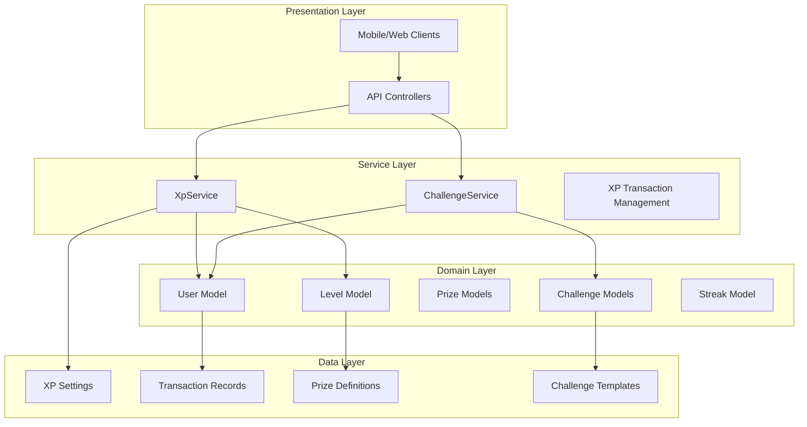
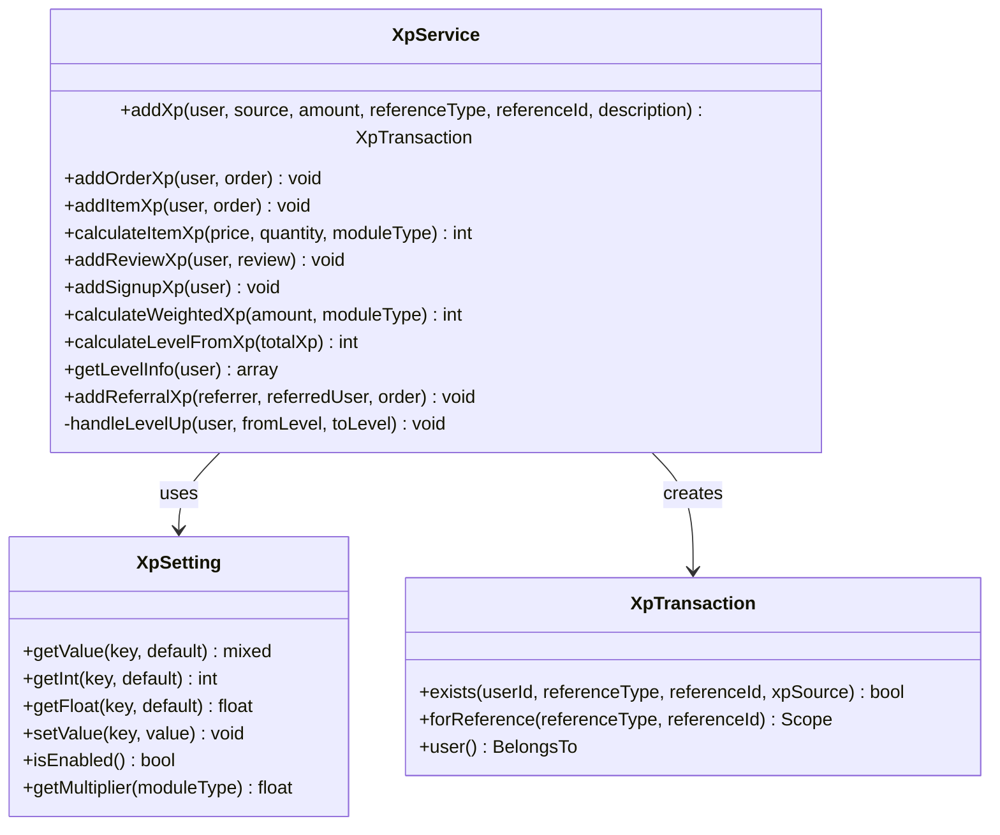
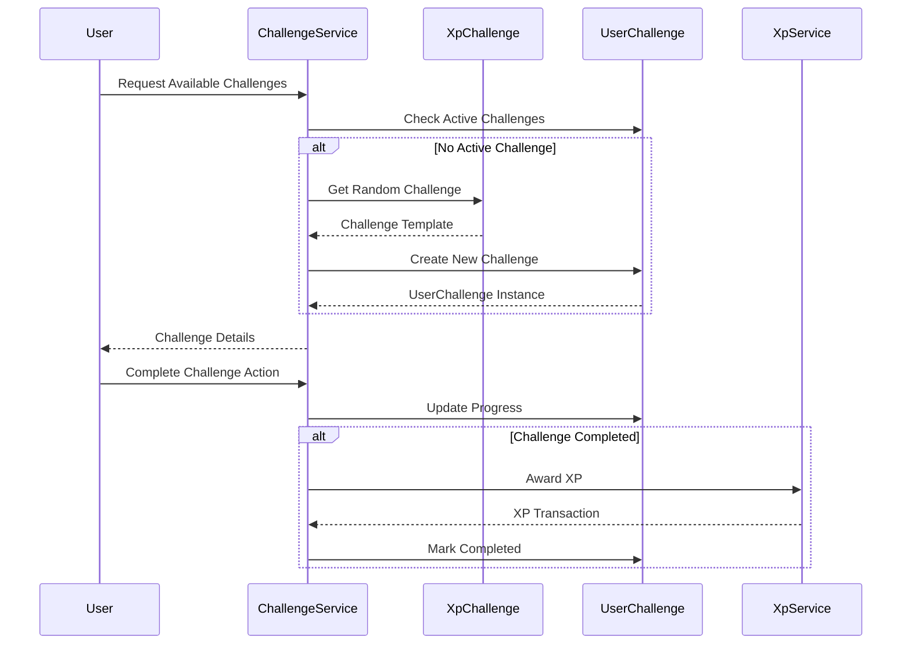
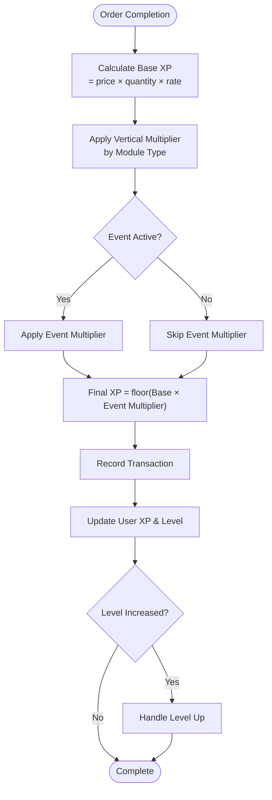
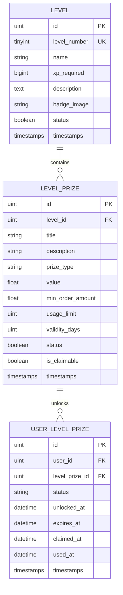
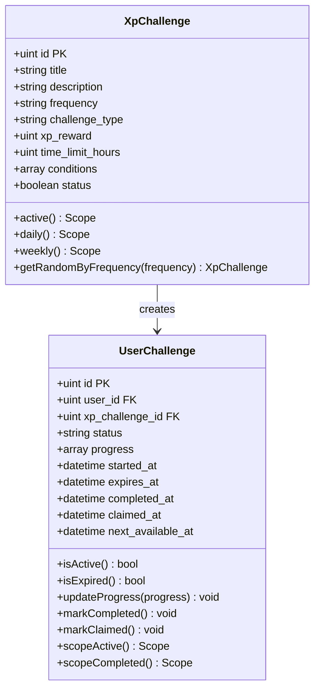
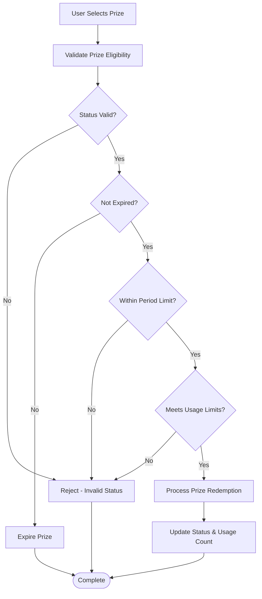
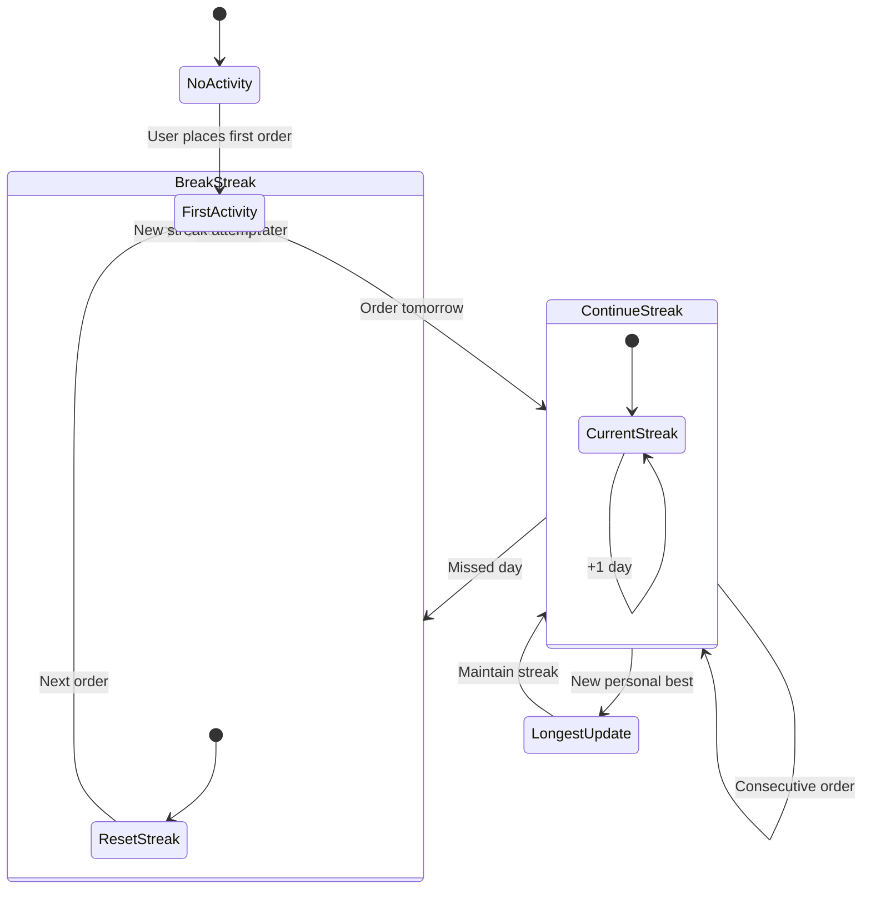
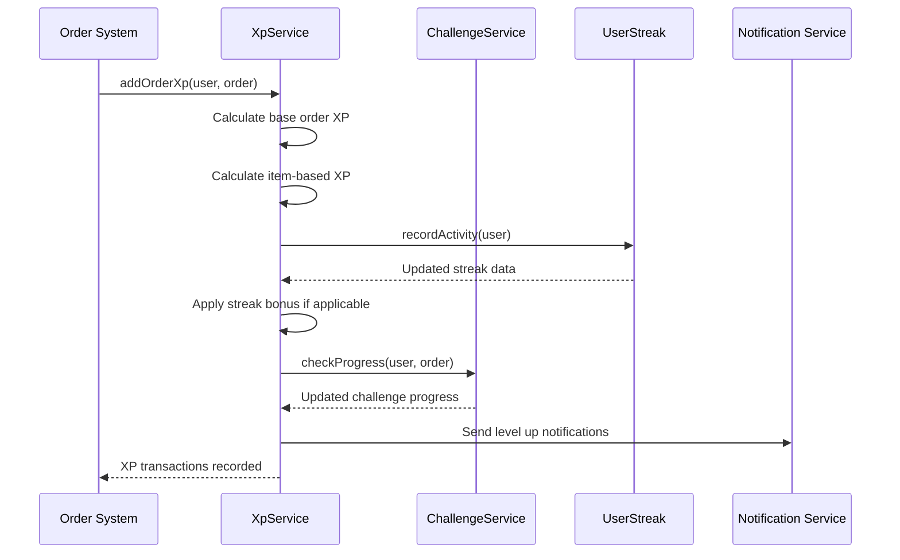

# Loyalty and XP System

<cite>
**Referenced Files in This Document**
- [XpService.php](file://app/Services/XpService.php)
- [XpController.php](file://app/Http/Controllers/Api/V1/XpController.php)
- [ChallengeService.php](file://app/Services/ChallengeService.php)
- [XpSetting.php](file://app/Models/XpSetting.php)
- [XpTransaction.php](file://app/Models/XpTransaction.php)
- [Level.php](file://app/Models/Level.php)
- [LevelPrize.php](file://app/Models/LevelPrize.php)
- [UserLevelPrize.php](file://app/Models/UserLevelPrize.php)
- [XpChallenge.php](file://app/Models/XpChallenge.php)
- [UserChallenge.php](file://app/Models/UserChallenge.php)
- [UserStreak.php](file://app/Models/UserStreak.php)
- [RewardItem.php](file://app/Models/RewardItem.php)
- [2025_12_28_000001_add_xp_level_to_users_table.php](file://database/migrations/2025_12_28_000001_add_xp_level_to_users_table.php)
- [2025_12_28_000002_create_levels_table.php](file://database/migrations/2025_12_28_000002_create_levels_table.php)
</cite>

## Table of Contents
1. [Introduction](#introduction)
2. [System Architecture](#system-architecture)
3. [Core Components](#core-components)
4. [XP Calculation Algorithms](#xp-calculation-algorithms)
5. [Level Progression System](#level-progression-system)
6. [Challenge Implementation](#challenge-implementation)
7. [Prize Redemption System](#prize-redemption-system)
8. [Streak Tracking](#streak-tracking)
9. [API Documentation](#api-documentation)
10. [Integration Patterns](#integration-patterns)
11. [Configuration and Customization](#configuration-and-customization)
12. [Performance Considerations](#performance-considerations)
13. [Troubleshooting Guide](#troubleshooting-guide)
14. [Conclusion](#conclusion)

## Introduction

The XP (Experience Points) loyalty system is a comprehensive customer engagement platform designed to drive user retention and increase purchase frequency through gamification. This system transforms traditional loyalty programs into an interactive experience by rewarding customers with experience points for various activities such as purchases, reviews, referrals, and challenge completions.

The system operates on a multi-tiered approach that combines point accumulation, level progression, challenge-based rewards, and achievement unlocking. It provides real-time feedback mechanisms, social comparison features, and personalized reward redemption options to create a compelling customer journey.

Key features include:
- Dynamic XP calculation based on purchase value and category
- Progressive level system with unlockable achievements
- Daily and weekly challenge systems with time-based limitations
- Multi-modal reward redemption including discounts, free items, and cash credits
- Comprehensive streak tracking for purchase consistency
- Real-time leaderboard integration for social engagement

## System Architecture

The XP loyalty system follows a modular architecture pattern with clear separation of concerns across multiple layers:

**Diagram sources**
- [XpService.php:15-336](file://app/Services/XpService.php#L15-L336)
- [ChallengeService.php:12-321](file://app/Services/ChallengeService.php#L12-L321)

The architecture ensures scalability through:
- Transaction isolation for atomic XP updates
- Caching-friendly configuration endpoints
- Asynchronous notification dispatch
- Modular service composition
- Database-optimized queries

## Core Components

### XP Service Layer

The XpService acts as the central coordinator for all XP-related operations, managing point accumulation, level calculations, and transaction recording.

**Diagram sources**
- [XpService.php:15-336](file://app/Services/XpService.php#L15-L336)
- [XpSetting.php:8-68](file://app/Models/XpSetting.php#L8-L68)
- [XpTransaction.php:8-53](file://app/Models/XpTransaction.php#L8-L53)

### Challenge Management System

The ChallengeService handles dynamic challenge assignment, progress tracking, and reward distribution with sophisticated reset mechanisms.

**Diagram sources**
- [ChallengeService.php:18-321](file://app/Services/ChallengeService.php#L18-L321)
- [XpChallenge.php:8-64](file://app/Models/XpChallenge.php#L8-L64)
- [UserChallenge.php:9-118](file://app/Models/UserChallenge.php#L9-L118)

**Section sources**
- [XpService.php:15-336](file://app/Services/XpService.php#L15-L336)
- [ChallengeService.php:12-321](file://app/Services/ChallengeService.php#L12-L321)

## XP Calculation Algorithms

### Base XP Accumulation

The system employs a tiered XP calculation model that rewards customers proportionally to their spending while incorporating business-defined multipliers and bonuses.

**Diagram sources**
- [XpService.php:150-166](file://app/Services/XpService.php#L150-L166)
- [XpService.php:81-144](file://app/Services/XpService.php#L81-L144)

### Multiplier System

The XP calculation incorporates a flexible multiplier system that adapts to different business verticals and promotional campaigns:

| Module Type | Default Multiplier | Purpose |
|-------------|-------------------|---------|
| Food | 1.0 | Standard retail |
| Grocery | 1.2 | Higher volume items |
| Pharmacy | 1.5 | Premium healthcare |
| E-commerce | 0.8 | Online convenience |
| Parcel | 2.0 | High-value logistics |
| Service | 1.3 | Professional services |

**Section sources**
- [XpService.php:150-166](file://app/Services/XpService.php#L150-L166)
- [XpService.php:121-144](file://app/Services/XpService.php#L121-L144)
- [XpSetting.php:62-66](file://app/Models/XpSetting.php#L62-L66)

## Level Progression System

### Level Configuration

The level system provides structured progression with configurable XP requirements and unlockable achievements.

**Diagram sources**
- [Level.php:11-152](file://app/Models/Level.php#L11-L152)
- [LevelPrize.php:9-97](file://app/Models/LevelPrize.php#L9-L97)
- [UserLevelPrize.php:10-203](file://app/Models/UserLevelPrize.php#L10-L203)

### Progress Tracking

The system maintains detailed progress tracking with real-time calculations and boundary detection:

| Metric | Description | Calculation Method |
|--------|-------------|-------------------|
| XP to Next Level | Difference between current and next level thresholds | Next Level XP - Current XP |
| Progress Percentage | Proportion toward next level | (Current XP / Next Level XP) × 100 |
| Level Completion | Whether user has reached target XP | Current XP ≥ Target XP |
| Max Level Detection | Whether user has achieved highest level | No higher level found |

**Section sources**
- [XpService.php:291-312](file://app/Services/XpService.php#L291-L312)
- [Level.php:109-126](file://app/Models/Level.php#L109-L126)

## Challenge Implementation

### Challenge Types and Mechanics

The challenge system offers diverse engagement opportunities with sophisticated progress tracking and time-based limitations.

**Diagram sources**
- [XpChallenge.php:8-64](file://app/Models/XpChallenge.php#L8-L64)
- [UserChallenge.php:9-118](file://app/Models/UserChallenge.php#L9-L118)

### Reset Mechanisms

The system implements intelligent reset mechanisms to maintain challenge freshness and user engagement:

| Challenge Type | Reset Frequency | Reset Trigger | Cooldown Period |
|----------------|----------------|---------------|-----------------|
| Daily | Midnight | Local time reset | 24 hours |
| Weekly | Saturday | Week boundary | 24 hours |
| Monthly | Month start | Calendar month | 24 hours |
| Once | Never | Manual completion | None |

**Section sources**
- [ChallengeService.php:18-142](file://app/Services/ChallengeService.php#L18-L142)
- [UserChallenge.php:45-116](file://app/Models/UserChallenge.php#L45-L116)

## Prize Redemption System

### Reward Types and Validation

The prize system supports multiple reward modalities with comprehensive validation and usage tracking.

**Diagram sources**
- [UserLevelPrize.php:64-101](file://app/Models/UserLevelPrize.php#L64-L101)
- [UserLevelPrize.php:132-169](file://app/Models/UserLevelPrize.php#L132-L169)

### Redemption Workflows

The system supports various redemption scenarios with appropriate business logic:

| Prize Type | Redemption Method | Usage Constraints | Auto-expiration |
|------------|------------------|-------------------|-----------------|
| Free Delivery | Immediate discount | Min order requirement | Yes (Validity days) |
| Wallet Credit | Instant credit | One-time use | Yes (Period limit) |
| Free Item | Store redemption | Availability check | Yes (Period limit) |
| Birthday Gift | Special item | Birth date validation | Yes (Period limit) |
| Badge Achievement | Unlock only | Non-transferable | No |

**Section sources**
- [UserLevelPrize.php:132-169](file://app/Models/UserLevelPrize.php#L132-L169)
- [LevelPrize.php:78-95](file://app/Models/LevelPrize.php#L78-L95)

## Streak Tracking

### Activity Pattern Recognition

The streak system monitors user activity patterns to encourage consistent purchasing behavior through progressive bonus rewards.

**Diagram sources**
- [UserStreak.php:34-66](file://app/Models/UserStreak.php#L34-L66)

### Bonus Calculation Logic

The streak bonus system provides diminishing returns for extended streaks:

| Streak Length | Bonus Multiplier | XP Earned |
|---------------|------------------|-----------|
| 1-2 days | 1.0x | Base XP |
| 3-6 days | 1.2x | 1.2 × Base XP |
| 7-13 days | 1.5x | 1.5 × Base XP |
| 14+ days | 2.0x | 2.0 × Base XP |

**Section sources**
- [UserStreak.php:34-66](file://app/Models/UserStreak.php#L34-L66)
- [XpService.php:98-115](file://app/Services/XpService.php#L98-L115)

## API Documentation

### Configuration Endpoint

Provides client-side configuration for XP calculations and system state.

**Endpoint:** `GET /api/v1/xp/config`

**Response Fields:**
- `enabled`: Boolean indicating if XP system is active
- `xp_per_order`: Integer XP for order completion
- `xp_per_review`: Integer XP for product reviews
- `xp_signup_bonus`: Integer XP for new user registration
- `max_level`: Maximum level number in system
- `multipliers`: Object containing XP multipliers by module type
- `multiplier_event`: Object containing active promotion details
- `streak_bonus_xp`: Integer XP bonus for streak achievements

### Level Information

**Endpoint:** `GET /api/v1/xp/level`

**Response Fields:**
- `current_level`: Current user level
- `level_name`: Name of current level
- `level_badge`: Badge image URL for current level
- `total_xp`: Total XP accumulated
- `xp_to_next_level`: XP needed for next level
- `progress_percentage`: Progress toward next level
- `is_max_level`: Boolean if user reached maximum level
- `next_level`: Object containing next level details (if exists)

### Challenge Management

**Endpoint:** `GET /api/v1/xp/challenges`

**Response Fields:**
- `challenges`: Object containing daily and/or weekly challenges
- `has_daily`: Boolean indicating daily challenge availability
- `has_weekly`: Boolean indicating weekly challenge availability

**Endpoint:** `POST /api/v1/xp/challenges/{id}/claim`

**Success Response Fields:**
- `message`: Success message
- `xp_earned`: XP awarded for challenge completion
- `new_total_xp`: User's updated XP balance
- `new_level`: User's new level (if applicable)

### Prize Redemption

**Endpoint:** `GET /api/v1/xp/prizes`

**Response Fields:**
- `usable_prizes`: Array of redeemable prizes
- `used_prizes`: Array of already used prizes
- `expired_prizes`: Array of expired prizes

**Endpoint:** `POST /api/v1/xp/prizes/{id}`

**Success Response Fields:**
- `message`: Success message
- `prize`: Object containing prize details
  - `id`: Prize instance ID
  - `title`: Prize name
  - `type`: Prize type
  - `value`: Prize value (for credits)
  - `status`: Current status

### Transaction History

**Endpoint:** `GET /api/v1/xp/transactions`

**Query Parameters:**
- `limit`: Integer (1-50) number of transactions per page
- `offset`: Integer page number

**Response Fields:**
- `total_size`: Total number of transactions
- `limit`: Number of transactions returned
- `offset`: Current page offset
- `transactions`: Array of transaction records

**Section sources**
- [XpController.php:26-49](file://app/Http/Controllers/Api/V1/XpController.php#L26-L49)
- [XpController.php:54-61](file://app/Http/Controllers/Api/V1/XpController.php#L54-L61)
- [XpController.php:256-309](file://app/Http/Controllers/Api/V1/XpController.php#L256-L309)
- [XpController.php:357-417](file://app/Http/Controllers/Api/V1/XpController.php#L357-L417)

## Integration Patterns

### Order Processing Integration

The XP system integrates seamlessly with the order management workflow through event-driven architecture:

**Diagram sources**
- [XpService.php:81-116](file://app/Services/XpService.php#L81-L116)
- [ChallengeService.php:196-256](file://app/Services/ChallengeService.php#L196-L256)

### Cross-Platform Consistency

The system maintains consistency across multiple touchpoints through standardized APIs and shared business logic:

| Integration Point | Data Flow | Synchronization |
|------------------|-----------|-----------------|
| Mobile App | Real-time XP updates | Push notifications |
| Web Portal | Batch processing | WebSocket updates |
| POS System | Immediate rewards | Local caching |
| Email System | Periodic reports | Scheduled jobs |
| Analytics | Historical data | ETL pipeline |

### Third-Party System Integration

The XP system supports integration with external systems through well-defined interfaces:

- **CRM Integration**: Customer profile synchronization
- **Payment Gateway**: Transaction correlation and validation
- **Inventory System**: Product-specific XP multipliers
- **Marketing Platform**: Personalized offer recommendations
- **SMS/Email**: Automated notification triggers

**Section sources**
- [XpService.php:39-76](file://app/Services/XpService.php#L39-L76)
- [ChallengeService.php:258-285](file://app/Services/ChallengeService.php#L258-L285)

## Configuration and Customization

### System Settings

The XP system provides extensive configuration options through the XpSetting model:

| Setting Key | Type | Default | Description |
|-------------|------|---------|-------------|
| `leveling_status` | Boolean | 1 | Enables/disables XP system |
| `xp_per_order` | Integer | 20 | Base XP for order completion |
| `xp_per_review` | Integer | 30 | XP for product reviews |
| `xp_signup_bonus` | Integer | 50 | Welcome bonus for new users |
| `xp_referral_bonus` | Integer | 50 | Bonus for successful referrals |
| `streak_bonus_xp` | Integer | 10 | Base XP for streak achievements |
| `prize_validity_days` | Integer | 30 | Default prize expiration |
| `multiplier_food` | Float | 1.0 | Food category multiplier |
| `multiplier_grocery` | Float | 1.2 | Grocery category multiplier |
| `multiplier_pharmacy` | Float | 1.5 | Pharmacy category multiplier |
| `multiplier_ecommerce` | Float | 0.8 | E-commerce category multiplier |
| `multiplier_parcel` | Float | 2.0 | Parcel delivery multiplier |
| `multiplier_service` | Float | 1.3 | Service category multiplier |
| `multiplier_event_active` | Boolean | 0 | Event multiplier activation |
| `multiplier_event_multiplier` | Float | 1.0 | Event multiplier value |
| `multiplier_event_ends_at` | DateTime | null | Event expiration timestamp |

### Level Configuration

Level definitions support comprehensive customization for brand-specific requirements:

| Level Property | Data Type | Description |
|----------------|-----------|-------------|
| `level_number` | Unsigned Tiny Integer | Unique level identifier |
| `name` | String | Human-readable level name |
| `xp_required` | Unsigned Big Integer | XP threshold for level |
| `description` | Text | Level description for users |
| `badge_image` | String | Badge image filename |
| `status` | Boolean | Level activation status |

### Challenge Customization

Challenge templates enable dynamic content creation:

| Challenge Property | Data Type | Description |
|--------------------|-----------|-------------|
| `title` | String | Challenge headline |
| `description` | Text | Detailed challenge instructions |
| `frequency` | Enum | 'daily' or 'weekly' |
| `challenge_type` | Enum | Specific challenge mechanics |
| `xp_reward` | Unsigned Integer | XP awarded upon completion |
| `time_limit_hours` | Unsigned Integer | Challenge duration |
| `conditions` | JSON Array | Challenge-specific requirements |
| `status` | Boolean | Challenge availability |

**Section sources**
- [XpSetting.php:17-66](file://app/Models/XpSetting.php#L17-L66)
- [Level.php:17-21](file://app/Models/Level.php#L17-L21)
- [XpChallenge.php:14-19](file://app/Models/XpChallenge.php#L14-L19)

## Performance Considerations

### Database Optimization

The XP system implements several optimization strategies to ensure high-performance operation:

**Index Strategy:**
- Composite index on `(user_id, xp_source, reference_type, reference_id)` for duplicate prevention
- Index on `level_number` for level progression queries
- Index on `status` for challenge filtering
- Full-text search capabilities for localized content

**Query Optimization:**
- Batch processing for periodic maintenance tasks
- Lazy loading for associated models
- Eager loading for frequently accessed relationships
- Pagination for large transaction histories

### Caching Strategy

The system employs multi-level caching to minimize database load:

| Cache Layer | Data Type | TTL | Purpose |
|-------------|-----------|-----|---------|
| Application Cache | XP Settings | 5 minutes | Configuration data |
| Redis Cache | User XP | 1 minute | Real-time balances |
| CDN Cache | Level Badges | 1 hour | Static media assets |
| Browser Cache | Public Config | 1 day | Client configuration |

### Scalability Patterns

**Horizontal Scaling:**
- Stateless API design for load balancing
- Database connection pooling
- Message queuing for asynchronous notifications
- Microservice decomposition for independent scaling

**Monitoring and Metrics:**
- Real-time performance monitoring
- Error rate tracking
- User engagement analytics
- System health indicators

## Troubleshooting Guide

### Common Issues and Solutions

**Issue:** Duplicate XP transactions
**Symptoms:** Unexpected XP increases or database constraint violations
**Solution:** Verify reference uniqueness and check for concurrent transaction processing

**Issue:** Level progression not updating
**Symptoms:** User XP increases but level remains unchanged
**Solution:** Check level threshold configuration and database indexing

**Issue:** Challenge not completing
**Symptoms:** Progress updates but challenge never completes
**Solution:** Verify challenge conditions and reset mechanisms

**Issue:** Streak not incrementing
**Symptoms:** Purchase activity not reflected in streak count
**Solution:** Check timezone configuration and activity recognition logic

### Debug Procedures

**Transaction Verification:**
1. Check XpTransaction existence for reference
2. Verify XP calculation accuracy
3. Confirm level threshold crossing
4. Validate streak activity recognition

**Configuration Validation:**
1. Review XpSetting values
2. Verify level definitions
3. Check challenge templates
4. Validate prize configurations

**Performance Monitoring:**
1. Monitor database query performance
2. Check cache hit rates
3. Track API response times
4. Analyze memory usage patterns

**Section sources**
- [XpTransaction.php:35-42](file://app/Models/XpTransaction.php#L35-L42)
- [XpService.php:33-37](file://app/Services/XpService.php#L33-L37)
- [ChallengeService.php:314-319](file://app/Services/ChallengeService.php#L314-L319)

## Conclusion

The XP loyalty system represents a comprehensive solution for customer engagement that balances simplicity with powerful customization capabilities. Through its modular architecture, the system provides:

**Technical Excellence:**
- Robust transaction processing with atomic operations
- Scalable architecture supporting high-volume operations
- Flexible configuration system for business adaptation
- Comprehensive monitoring and analytics capabilities

**Business Value:**
- Proven customer retention mechanisms through gamification
- Multi-channel engagement through integrated APIs
- Personalized experiences through dynamic content
- Real-time insights through comprehensive reporting

**Future Extensibility:**
The system's design supports future enhancements including advanced AI-driven personalization, blockchain-based reward systems, and expanded integration capabilities. The modular architecture ensures that new features can be added without disrupting existing functionality.

Implementation of this system requires careful consideration of business requirements, technical infrastructure, and ongoing maintenance needs. However, the foundation provided ensures a solid platform for building long-term customer loyalty and engagement.