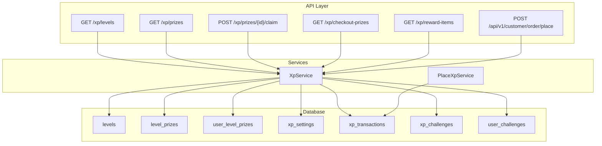
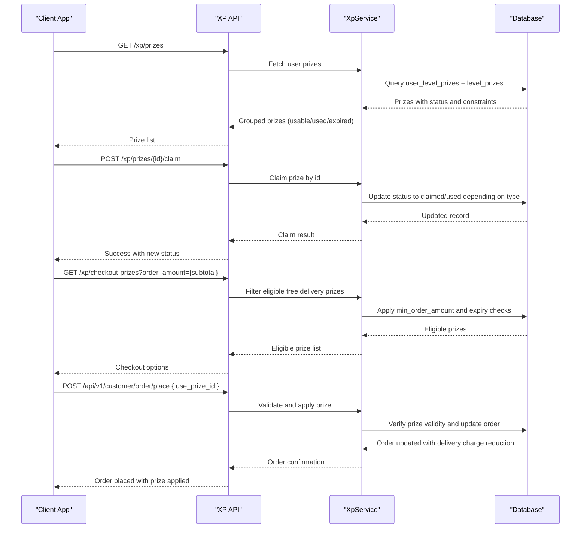
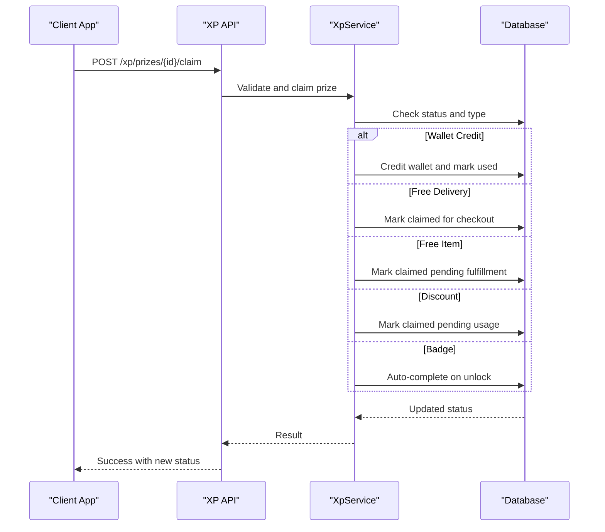
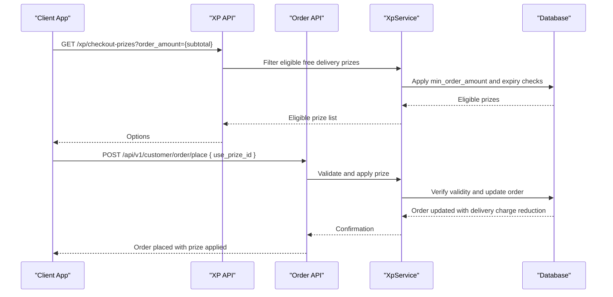
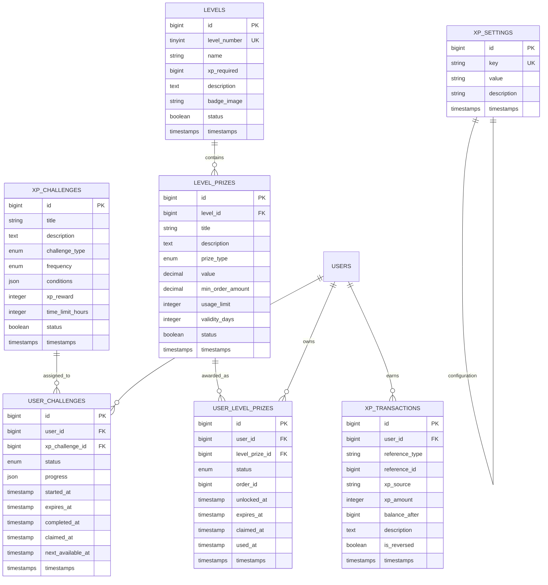
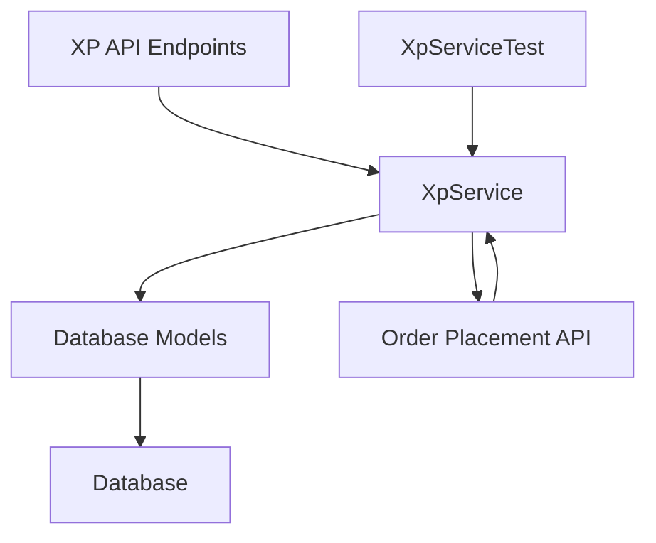

# Prize Redemption System

<cite>
**Referenced Files in This Document**
- [XP_SYSTEM_API_DOCS.md](file://XP_SYSTEM_API_DOCS.md)
- [2025_12_28_000001_add_xp_level_to_users_table.php](file://database/migrations/2025_12_28_000001_add_xp_level_to_users_table.php)
- [2025_12_28_000002_create_levels_table.php](file://database/migrations/2025_12_28_000002_create_levels_table.php)
- [2025_12_28_000003_create_level_prizes_table.php](file://database/migrations/2025_12_28_000003_create_level_prizes_table.php)
- [2025_12_28_000007_create_user_level_prizes_table.php](file://database/migrations/2025_12_28_000007_create_user_level_prizes_table.php)
- [2026_01_07_000001_add_prize_constraints_to_level_prizes.php](file://database/migrations/2026_01_07_000001_add_prize_constraints_to_level_prizes.php)
- [2025_12_28_000005_create_xp_challenges_table.php](file://database/migrations/2025_12_28_000005_create_xp_challenges_table.php)
- [2025_12_28_000006_create_user_challenges_table.php](file://database/migrations/2025_12_28_000006_create_user_challenges_table.php)
- [2025_12_28_000004_create_xp_transactions_table.php](file://database/migrations/2025_12_28_000004_create_xp_transactions_table.php)
- [2025_12_28_000008_create_xp_settings_table.php](file://database/migrations/2025_12_28_000008_create_xp_settings_table.php)
- [XpService.php](file://app/Services/XpService.php)
- [PlaceXpService.php](file://Modules/PlacesToVisit/Services/PlaceXpService.php)
- [XpServiceTest.php](file://tests/Unit/XpServiceTest.php)
</cite>

## Table of Contents
1. [Introduction](#introduction)
2. [Project Structure](#project-structure)
3. [Core Components](#core-components)
4. [Architecture Overview](#architecture-overview)
5. [Detailed Component Analysis](#detailed-component-analysis)
6. [Dependency Analysis](#dependency-analysis)
7. [Performance Considerations](#performance-considerations)
8. [Troubleshooting Guide](#troubleshooting-guide)
9. [Conclusion](#conclusion)

## Introduction
This document provides comprehensive documentation for the prize redemption system, covering prize types, claiming mechanisms, status management, availability filtering, checkout integration, and reward items for free_item prizes. It consolidates the frontend API documentation and backend implementation details to explain how users unlock, claim, and redeem various prizes such as badges, free delivery, wallet credits, free items, discounts, and custom rewards.

## Project Structure
The prize redemption system spans frontend API endpoints, database migrations defining the data model, and backend services implementing the logic. Key areas include:
- API endpoints for prize management, checkout integration, and reward items
- Database schema for levels, level prizes, user-level prize instances, XP settings, transactions, and challenges
- Backend services orchestrating XP calculations, prize unlocking, and fulfillment

**Diagram sources**
- [XP_SYSTEM_API_DOCS.md](file://XP_SYSTEM_API_DOCS.md)
- [XpService.php](file://app/Services/XpService.php)
- [PlaceXpService.php](file://Modules/PlacesToVisit/Services/PlaceXpService.php)
- [2025_12_28_000002_create_levels_table.php](file://database/migrations/2025_12_28_000002_create_levels_table.php)
- [2025_12_28_000003_create_level_prizes_table.php](file://database/migrations/2025_12_28_000003_create_level_prizes_table.php)
- [2025_12_28_000007_create_user_level_prizes_table.php](file://database/migrations/2025_12_28_000007_create_user_level_prizes_table.php)
- [2025_12_28_000008_create_xp_settings_table.php](file://database/migrations/2025_12_28_000008_create_xp_settings_table.php)
- [2025_12_28_000004_create_xp_transactions_table.php](file://database/migrations/2025_12_28_000004_create_xp_transactions_table.php)
- [2025_12_28_000005_create_xp_challenges_table.php](file://database/migrations/2025_12_28_000005_create_xp_challenges_table.php)
- [2025_12_28_000006_create_user_challenges_table.php](file://database/migrations/2025_12_28_000006_create_user_challenges_table.php)

**Section sources**
- [XP_SYSTEM_API_DOCS.md](file://XP_SYSTEM_API_DOCS.md)
- [2025_12_28_000001_add_xp_level_to_users_table.php](file://database/migrations/2025_12_28_000001_add_xp_level_to_users_table.php)
- [2025_12_28_000002_create_levels_table.php](file://database/migrations/2025_12_28_000002_create_levels_table.php)
- [2025_12_28_000003_create_level_prizes_table.php](file://database/migrations/2025_12_28_000003_create_level_prizes_table.php)
- [2025_12_28_000007_create_user_level_prizes_table.php](file://database/migrations/2025_12_28_000007_create_user_level_prizes_table.php)
- [2026_01_07_000001_add_prize_constraints_to_level_prizes.php](file://database/migrations/2026_01_07_000001_add_prize_constraints_to_level_prizes.php)
- [2025_12_28_000005_create_xp_challenges_table.php](file://database/migrations/2025_12_28_000005_create_xp_challenges_table.php)
- [2025_12_28_000006_create_user_challenges_table.php](file://database/migrations/2025_12_28_000006_create_user_challenges_table.php)
- [2025_12_28_000004_create_xp_transactions_table.php](file://database/migrations/2025_12_28_000004_create_xp_transactions_table.php)
- [2025_12_28_000008_create_xp_settings_table.php](file://database/migrations/2025_12_28_000008_create_xp_settings_table.php)

## Core Components
This section outlines the primary components of the prize redemption system, including prize types, statuses, and the claiming mechanism.

- Prize Types
  - Badge: Auto-unlocked on level reach; display-only.
  - Free Delivery: Usable at checkout with minimum order requirements.
  - Wallet Credit: Immediate wallet credit upon claiming.
  - Free Item: Redeemable for specific store items.
  - Discount: Order discount vouchers.
  - Custom: Special rewards.

- Status Management
  - Unlocked: Available to claim.
  - Claimed: Claimed but not yet used (e.g., free delivery).
  - Used: Consumed.
  - Expired: Validity period ended.

- Claiming Mechanism
  - Endpoint: POST /xp/prizes/{id}/claim
  - Behavior varies by type:
    - Wallet Credit: Credits added immediately; status becomes used.
    - Free Delivery: Status becomes claimed; usable at checkout.
    - Free Item: Status becomes claimed.
    - Discount: Status becomes claimed.
    - Badge: Auto-claimed on unlock; no manual claim needed.

- Availability Filtering
  - Usable prizes include both unlocked and claimed prizes that haven't expired and pass period limits.
  - is_usable indicates whether a prize can be applied.

**Section sources**
- [XP_SYSTEM_API_DOCS.md](file://XP_SYSTEM_API_DOCS.md)

## Architecture Overview
The system integrates frontend API endpoints with backend services and database models. The flow below illustrates the end-to-end process from claiming a prize to applying it at checkout.

**Diagram sources**
- [XP_SYSTEM_API_DOCS.md](file://XP_SYSTEM_API_DOCS.md)
- [XpService.php](file://app/Services/XpService.php)
- [2025_12_28_000003_create_level_prizes_table.php](file://database/migrations/2025_12_28_000003_create_level_prizes_table.php)
- [2025_12_28_000007_create_user_level_prizes_table.php](file://database/migrations/2025_12_28_000007_create_user_level_prizes_table.php)

## Detailed Component Analysis

### Prize Types and Behaviors
- Badge
  - Auto-unlocked on level reach; display-only.
  - No manual claim required.
- Free Delivery
  - Claimed status becomes usable at checkout.
  - Requires meeting minimum order amount and not being expired.
  - Applied by passing use_prize_id in order placement.
- Wallet Credit
  - On claim, credits are added immediately; status becomes used.
- Free Item
  - Status becomes claimed after claim; fulfillment handled separately.
- Discount
  - Status becomes claimed after claim; usage governed by constraints.
- Custom
  - Special rewards configured per level.

**Section sources**
- [XP_SYSTEM_API_DOCS.md](file://XP_SYSTEM_API_DOCS.md)

### Prize Claiming Process
- Endpoint: POST /xp/prizes/{id}/claim
- Request: No body required.
- Response: Success message and updated prize with new status.
- Validation: Returns 404 if prize not found; 403 if already claimed/used/expired.

**Diagram sources**
- [XP_SYSTEM_API_DOCS.md](file://XP_SYSTEM_API_DOCS.md)
- [XpService.php](file://app/Services/XpService.php)

**Section sources**
- [XP_SYSTEM_API_DOCS.md](file://XP_SYSTEM_API_DOCS.md)

### Checkout Integration and Validation
- Endpoint: GET /xp/checkout-prizes
  - Filters free delivery prizes by min_order_amount eligibility.
  - Returns eligible prizes with expiration and level name.
- Order Placement
  - Endpoint: POST /api/v1/customer/order/place
  - Pass use_prize_id from checkout-prizes or prizes endpoint.
  - Only free_delivery prizes are supported at checkout currently.
  - If valid, delivery charge becomes zero; otherwise, normal delivery charge applies.

**Diagram sources**
- [XP_SYSTEM_API_DOCS.md](file://XP_SYSTEM_API_DOCS.md)
- [XpService.php](file://app/Services/XpService.php)

**Section sources**
- [XP_SYSTEM_API_DOCS.md](file://XP_SYSTEM_API_DOCS.md)

### Reward Items System for Free Item Prizes
- Endpoint: GET /xp/reward-items
  - Query parameters: store_id (required), reward_type (optional).
  - Returns reward items available for free_item, free_side, or birthday_gift types.
  - Includes item metadata and max_value constraints.

**Section sources**
- [XP_SYSTEM_API_DOCS.md](file://XP_SYSTEM_API_DOCS.md)

### Database Model and Constraints
The database schema defines the core entities and constraints for the XP and prize system:

**Diagram sources**
- [2025_12_28_000002_create_levels_table.php](file://database/migrations/2025_12_28_000002_create_levels_table.php)
- [2025_12_28_000003_create_level_prizes_table.php](file://database/migrations/2025_12_28_000003_create_level_prizes_table.php)
- [2025_12_28_000007_create_user_level_prizes_table.php](file://database/migrations/2025_12_28_000007_create_user_level_prizes_table.php)
- [2025_12_28_000008_create_xp_settings_table.php](file://database/migrations/2025_12_28_000008_create_xp_settings_table.php)
- [2025_12_28_000004_create_xp_transactions_table.php](file://database/migrations/2025_12_28_000004_create_xp_transactions_table.php)
- [2025_12_28_000005_create_xp_challenges_table.php](file://database/migrations/2025_12_28_000005_create_xp_challenges_table.php)
- [2025_12_28_000006_create_user_challenges_table.php](file://database/migrations/2025_12_28_000006_create_user_challenges_table.php)

**Section sources**
- [2025_12_28_000002_create_levels_table.php](file://database/migrations/2025_12_28_000002_create_levels_table.php)
- [2025_12_28_000003_create_level_prizes_table.php](file://database/migrations/2025_12_28_000003_create_level_prizes_table.php)
- [2025_12_28_000007_create_user_level_prizes_table.php](file://database/migrations/2025_12_28_000007_create_user_level_prizes_table.php)
- [2026_01_07_000001_add_prize_constraints_to_level_prizes.php](file://database/migrations/2026_01_07_000001_add_prize_constraints_to_level_prizes.php)
- [2025_12_28_000008_create_xp_settings_table.php](file://database/migrations/2025_12_28_000008_create_xp_settings_table.php)
- [2025_12_28_000004_create_xp_transactions_table.php](file://database/migrations/2025_12_28_000004_create_xp_transactions_table.php)
- [2025_12_28_000005_create_xp_challenges_table.php](file://database/migrations/2025_12_28_000005_create_xp_challenges_table.php)
- [2025_12_28_000006_create_user_challenges_table.php](file://database/migrations/2025_12_28_000006_create_user_challenges_table.php)

### Backend Services
- XpService
  - Orchestrates XP calculations, challenge assignments, and prize management.
  - Handles prize unlocking, claiming, and validation for checkout.
- PlaceXpService
  - Integrates XP awarding with place order flow, ensuring proper transaction recording.

**Section sources**
- [XpService.php](file://app/Services/XpService.php)
- [PlaceXpService.php](file://Modules/PlacesToVisit/Services/PlaceXpService.php)

## Dependency Analysis
The system exhibits clear separation of concerns:
- API layer depends on services for business logic.
- Services depend on database models for persistence.
- Database models define referential integrity and constraints.

**Diagram sources**
- [XP_SYSTEM_API_DOCS.md](file://XP_SYSTEM_API_DOCS.md)
- [XpService.php](file://app/Services/XpService.php)
- [XpServiceTest.php](file://tests/Unit/XpServiceTest.php)

**Section sources**
- [XP_SYSTEM_API_DOCS.md](file://XP_SYSTEM_API_DOCS.md)
- [XpService.php](file://app/Services/XpService.php)
- [XpServiceTest.php](file://tests/Unit/XpServiceTest.php)

## Performance Considerations
- Indexes on user_id and status in user_level_prizes facilitate fast filtering of usable prizes.
- Unique constraints on XP transactions prevent duplicate awards.
- Period-based usage limits and expiry checks should leverage indexed timestamps for efficient queries.
- Caching of XP configuration reduces repeated database reads for client-side calculations.

## Troubleshooting Guide
Common issues and resolutions:
- Prize Not Found (404)
  - Verify the prize id corresponds to the user's instance id.
- Already Claimed/Used/Expired (403)
  - Check prize status and expiry date; ensure min_order_amount eligibility.
- Free Delivery Not Applied at Checkout
  - Confirm the prize is claimed, not expired, and meets min_order_amount.
  - Ensure use_prize_id matches an eligible prize id from checkout-prizes.
- Wallet Credit Not Credited
  - For wallet_credit type, verify immediate credit and status change to used.

**Section sources**
- [XP_SYSTEM_API_DOCS.md](file://XP_SYSTEM_API_DOCS.md)

## Conclusion
The prize redemption system provides a robust framework for rewarding users through diverse prize types with clear status management and checkout integration. The backend services coordinate with database models to enforce constraints, while the frontend API ensures a seamless user experience across claiming, filtering, and redemption processes.