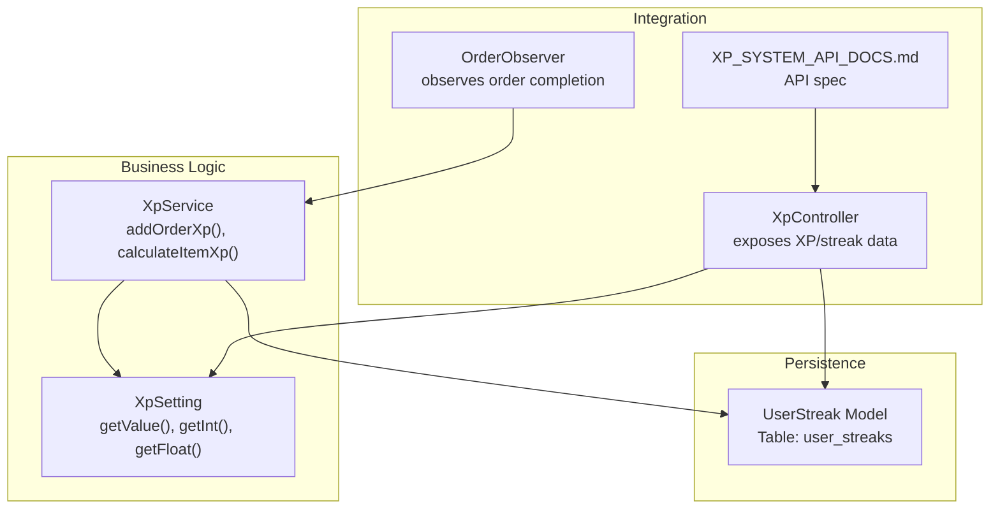
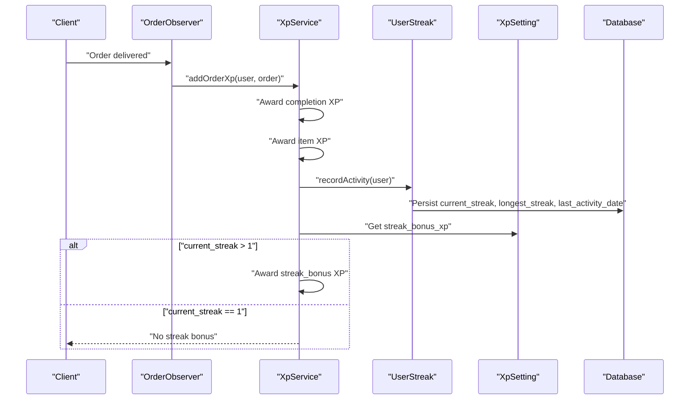
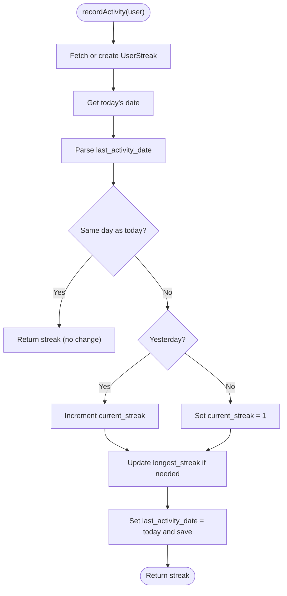
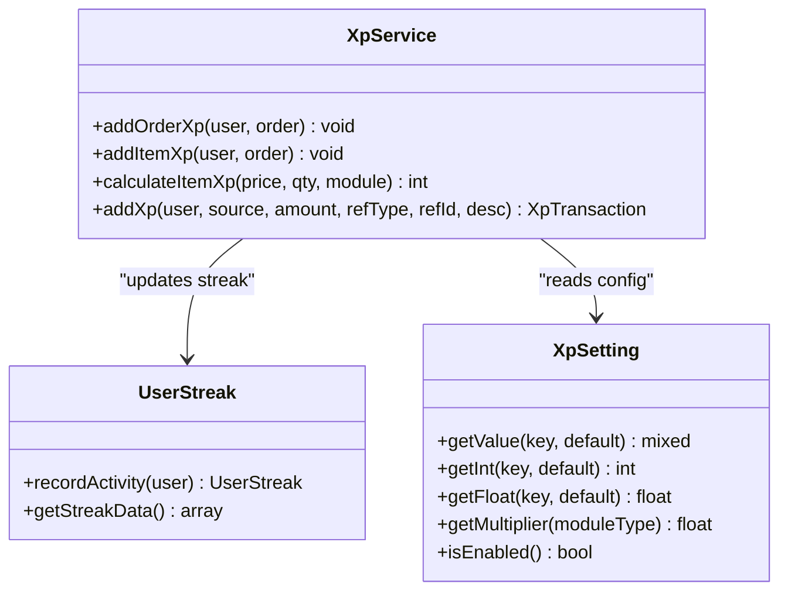
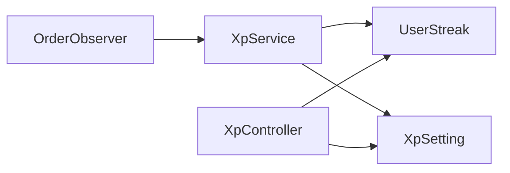

# Streak Tracking and Bonuses

<cite>
**Referenced Files in This Document**
- [2026_02_17_000001_create_user_streaks_table.php](file://database/migrations/2026_02_17_000001_create_user_streaks_table.php)
- [UserStreak.php](file://app/Models/UserStreak.php)
- [XpService.php](file://app/Services/XpService.php)
- [XpSetting.php](file://app/Models/XpSetting.php)
- [OrderObserver.php](file://app/Observers/OrderObserver.php)
- [XP_SYSTEM_API_DOCS.md](file://XP_SYSTEM_API_DOCS.md)
- [XpController.php](file://app/Http/Controllers/Api/V1/XpController.php)
</cite>

## Table of Contents
1. [Introduction](#introduction)
2. [Project Structure](#project-structure)
3. [Core Components](#core-components)
4. [Architecture Overview](#architecture-overview)
5. [Detailed Component Analysis](#detailed-component-analysis)
6. [Dependency Analysis](#dependency-analysis)
7. [Performance Considerations](#performance-considerations)
8. [Troubleshooting Guide](#troubleshooting-guide)
9. [Conclusion](#conclusion)

## Introduction
This document explains the streak tracking and bonus system that encourages repeat ordering by rewarding users for consecutive days placing delivered orders. It covers:
- How streaks are calculated and persisted
- The streak bonus mechanism that awards extra XP for orders placed during active streaks
- Integration with XP accumulation and other XP sources
- Streak data structure and configuration keys
- Streak detection logic, date-based validation, and order completion triggers
- Application timing of streak bonuses and reset conditions
- Streak UI indicators and integration with XP reporting

## Project Structure
The streak system spans a small set of core files:
- A dedicated database migration and model for storing streak data
- An XP service that orchestrates XP awards and streak updates
- An XP settings model for retrieving XP-related configuration
- An observer that triggers XP and streak updates upon order completion
- API documentation and controllers that surface streak data and XP sources

**Diagram sources**
- [2026_02_17_000001_create_user_streaks_table.php:14-23](file://database/migrations/2026_02_17_000001_create_user_streaks_table.php#L14-L23)
- [UserStreak.php:34-66](file://app/Models/UserStreak.php#L34-L66)
- [XpService.php:81-116](file://app/Services/XpService.php#L81-L116)
- [XpSetting.php:17-66](file://app/Models/XpSetting.php#L17-L66)
- [OrderObserver.php:55-65](file://app/Observers/OrderObserver.php#L55-L65)
- [XpController.php:46](file://app/Http/Controllers/Api/V1/XpController.php#L46)

**Section sources**
- [2026_02_17_000001_create_user_streaks_table.php:14-23](file://database/migrations/2026_02_17_000001_create_user_streaks_table.php#L14-L23)
- [UserStreak.php:34-80](file://app/Models/UserStreak.php#L34-L80)
- [XpService.php:81-166](file://app/Services/XpService.php#L81-L166)
- [XpSetting.php:17-66](file://app/Models/XpSetting.php#L17-L66)
- [OrderObserver.php:55-65](file://app/Observers/OrderObserver.php#L55-L65)
- [XP_SYSTEM_API_DOCS.md:79](file://XP_SYSTEM_API_DOCS.md#L79)
- [XP_SYSTEM_API_DOCS.md:192](file://XP_SYSTEM_API_DOCS.md#L192)
- [XP_SYSTEM_API_DOCS.md:200](file://XP_SYSTEM_API_DOCS.md#L200)
- [XP_SYSTEM_API_DOCS.md:291](file://XP_SYSTEM_API_DOCS.md#L291)
- [XP_SYSTEM_API_DOCS.md:616](file://XP_SYSTEM_API_DOCS.md#L616)

## Core Components
- UserStreak model: Persists current_streak, longest_streak, last_activity_date, and provides recordActivity() to update streaks and getStreakData() for API exposure.
- XpService: Adds XP for orders, items, reviews, signups, and applies streak bonuses when applicable.
- XpSetting: Centralized retrieval of XP configuration values including streak_bonus_xp.
- OrderObserver: Triggers XP and streak updates after an order transitions to a delivered state.
- API docs and controller: Expose streak data and XP sources for client consumption.

**Section sources**
- [UserStreak.php:34-80](file://app/Models/UserStreak.php#L34-L80)
- [XpService.php:81-116](file://app/Services/XpService.php#L81-L116)
- [XpSetting.php:17-66](file://app/Models/XpSetting.php#L17-L66)
- [OrderObserver.php:55-65](file://app/Observers/OrderObserver.php#L55-L65)
- [XP_SYSTEM_API_DOCS.md:79](file://XP_SYSTEM_API_DOCS.md#L79)
- [XP_SYSTEM_API_DOCS.md:192](file://XP_SYSTEM_API_DOCS.md#L192)
- [XP_SYSTEM_API_DOCS.md:200](file://XP_SYSTEM_API_DOCS.md#L200)
- [XP_SYSTEM_API_DOCS.md:291](file://XP_SYSTEM_API_DOCS.md#L291)
- [XP_SYSTEM_API_DOCS.md:616](file://XP_SYSTEM_API_DOCS.md#L616)

## Architecture Overview
The streak system integrates tightly with order completion and XP accumulation. When an order is completed and delivered, the observer invokes XpService.addOrderXp(), which:
- Awards flat XP for order completion
- Awards XP per item based on price and module multipliers
- Updates the user’s streak via UserStreak.recordActivity()
- If the streak is greater than 1, awards a fixed streak_bonus_xp configured in XP settings

**Diagram sources**
- [OrderObserver.php:55-65](file://app/Observers/OrderObserver.php#L55-L65)
- [XpService.php:81-116](file://app/Services/XpService.php#L81-L116)
- [UserStreak.php:34-66](file://app/Models/UserStreak.php#L34-L66)
- [XpSetting.php:26-28](file://app/Models/XpSetting.php#L26-L28)

## Detailed Component Analysis

### Streak Data Model and Persistence
The user_streaks table stores:
- user_id (unique)
- current_streak (integer)
- longest_streak (integer)
- last_activity_date (date)
- timestamps

Record activity logic:
- If last_activity_date is today, no change
- Else if last_activity_date was yesterday, increment current_streak
- Else reset current_streak to 1
- Update longest_streak if current_streak exceeds it
- Set last_activity_date to today

**Diagram sources**
- [UserStreak.php:34-66](file://app/Models/UserStreak.php#L34-L66)

**Section sources**
- [2026_02_17_000001_create_user_streaks_table.php:14-23](file://database/migrations/2026_02_17_000001_create_user_streaks_table.php#L14-L23)
- [UserStreak.php:34-66](file://app/Models/UserStreak.php#L34-L66)

### Streak Calculation Algorithm
- Consecutive day detection uses date comparison (same day vs. previous day).
- Streak resets when activity occurs on a non-consecutive day.
- Longest streak is tracked independently and updated whenever current_streak increases.

Integration points:
- Called from XpService.addOrderXp() after item XP is awarded.
- Uses Carbon dates to compare today and last_activity_date.

**Section sources**
- [UserStreak.php:34-66](file://app/Models/UserStreak.php#L34-L66)
- [XpService.php:98-116](file://app/Services/XpService.php#L98-L116)

### Streak Bonus Mechanism
- When current_streak > 1, a fixed bonus is awarded from XP settings.
- The bonus amount is retrieved via XpSetting.getInt('streak_bonus_xp', default 10).
- The bonus is recorded as an XP transaction with source 'streak_bonus'.

Application timing:
- Immediately after updating streak in addOrderXp().
- Only triggered when the streak continues (current_streak increased or remains > 1).

**Section sources**
- [XpService.php:98-116](file://app/Services/XpService.php#L98-L116)
- [UserStreak.php:71-79](file://app/Models/UserStreak.php#L71-L79)
- [XP_SYSTEM_API_DOCS.md:192](file://XP_SYSTEM_API_DOCS.md#L192)
- [XP_SYSTEM_API_DOCS.md:200](file://XP_SYSTEM_API_DOCS.md#L200)

### Integration with XP Accumulation
- Order completion: flat XP from xp_per_order setting.
- Per-item XP: calculated from price, quantity, module multiplier, and xp_per_currency_unit.
- Streak bonus: applied when current_streak > 1.
- Other sources: review bonus, signup bonus, referral bonus, challenges, etc.

**Diagram sources**
- [XpService.php:81-166](file://app/Services/XpService.php#L81-L166)
- [UserStreak.php:34-79](file://app/Models/UserStreak.php#L34-L79)
- [XpSetting.php:17-66](file://app/Models/XpSetting.php#L17-L66)

**Section sources**
- [XpService.php:81-166](file://app/Services/XpService.php#L81-L166)
- [XpSetting.php:17-66](file://app/Models/XpSetting.php#L17-L66)

### Streak Detection Logic and Date Validation
- Uses Carbon to normalize today and last_activity_date.
- Same-day check prevents double counting within a day.
- Previous-day check determines continuation vs. reset.

Edge cases handled:
- First-time activity initializes streak to 1.
- Non-consecutive days reset streak to 1.
- Longest streak is monotonic and only increases when current_streak improves.

**Section sources**
- [UserStreak.php:34-66](file://app/Models/UserStreak.php#L34-L66)

### Order Completion Trigger and Streak Update
- The observer listens for order completion events and calls XpService.addOrderXp().
- This ensures streak updates occur consistently when orders reach a delivered state.

**Section sources**
- [OrderObserver.php:55-65](file://app/Observers/OrderObserver.php#L55-L65)

### Streak UI Indicators and Reporting
- API exposes current_streak, longest_streak, streak_bonus_xp, and last_activity_date.
- The API docs specify that clients should show a streak flame icon with current_streak and XP bar with progress_percentage.

UI integration guidance:
- Display current_streak near the XP bar.
- Show streak flame icon when current_streak > 0.
- Use streak_bonus_xp to inform users about the bonus they earn on the next order.

**Section sources**
- [UserStreak.php:71-79](file://app/Models/UserStreak.php#L71-L79)
- [XP_SYSTEM_API_DOCS.md:79](file://XP_SYSTEM_API_DOCS.md#L79)
- [XP_SYSTEM_API_DOCS.md:192](file://XP_SYSTEM_API_DOCS.md#L192)
- [XP_SYSTEM_API_DOCS.md:200](file://XP_SYSTEM_API_DOCS.md#L200)
- [XP_SYSTEM_API_DOCS.md:291](file://XP_SYSTEM_API_DOCS.md#L291)
- [XP_SYSTEM_API_DOCS.md:616](file://XP_SYSTEM_API_DOCS.md#L616)

## Dependency Analysis
- UserStreak depends on Carbon for date comparisons and on the users table via foreign key.
- XpService depends on UserStreak for streak updates and on XpSetting for configuration values.
- OrderObserver depends on XpService to apply XP and streak bonuses.
- API surfaces streak data and XP sources for client consumption.

**Diagram sources**
- [OrderObserver.php:55-65](file://app/Observers/OrderObserver.php#L55-L65)
- [XpService.php:81-116](file://app/Services/XpService.php#L81-L116)
- [UserStreak.php:34-66](file://app/Models/UserStreak.php#L34-L66)
- [XpSetting.php:17-66](file://app/Models/XpSetting.php#L17-L66)

**Section sources**
- [OrderObserver.php:55-65](file://app/Observers/OrderObserver.php#L55-L65)
- [XpService.php:81-116](file://app/Services/XpService.php#L81-L116)
- [UserStreak.php:34-66](file://app/Models/UserStreak.php#L34-L66)
- [XpSetting.php:17-66](file://app/Models/XpSetting.php#L17-L66)

## Performance Considerations
- recordActivity() performs a single write per order completion and is O(1) in complexity.
- Using today() and Carbon comparisons avoids timezone inconsistencies when normalized to dates.
- No heavy joins are involved; persistence is straightforward.

## Troubleshooting Guide
Common issues and resolutions:
- Duplicate streak entries: The model uses firstOrCreate keyed by user_id, preventing duplicates.
- Streak not increasing: Ensure orders are transitioning to delivered state so the observer fires.
- Streak resets unexpectedly: Verify that activity occurs daily; non-consecutive days reset the streak.
- Streak bonus not awarded: Confirm that current_streak > 1 and streak_bonus_xp is configured.

Operational checks:
- Validate XP settings for streak_bonus_xp and xp_per_order.
- Confirm observer is registered and order completion events are firing.
- Inspect XpTransaction records for streak_bonus entries.

**Section sources**
- [UserStreak.php:36-39](file://app/Models/UserStreak.php#L36-L39)
- [OrderObserver.php:55-65](file://app/Observers/OrderObserver.php#L55-L65)
- [XpService.php:98-116](file://app/Services/XpService.php#L98-L116)

## Conclusion
The streak system provides a lightweight, robust mechanism to reward consistent ordering behavior. By integrating with order completion, it updates streaks and awards a configurable XP bonus when users maintain consecutive-day ordering. The design cleanly separates persistence, business logic, configuration, and presentation, enabling easy maintenance and extension.