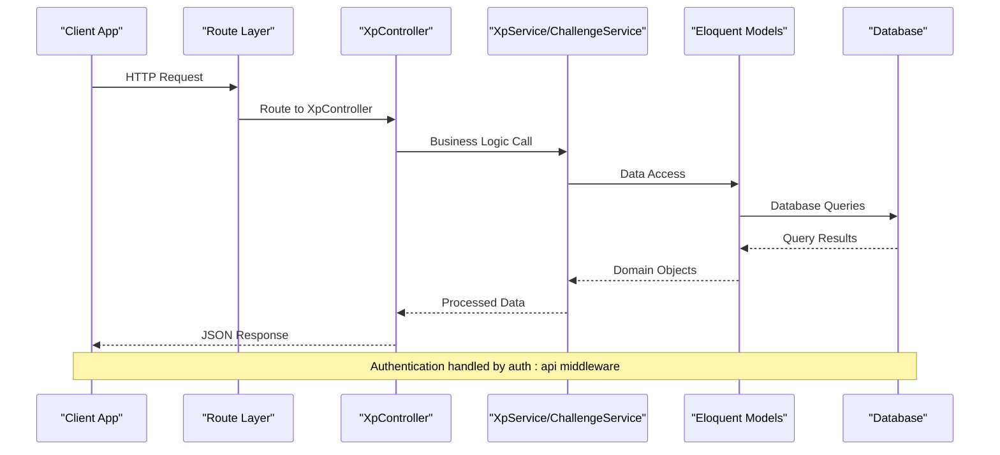
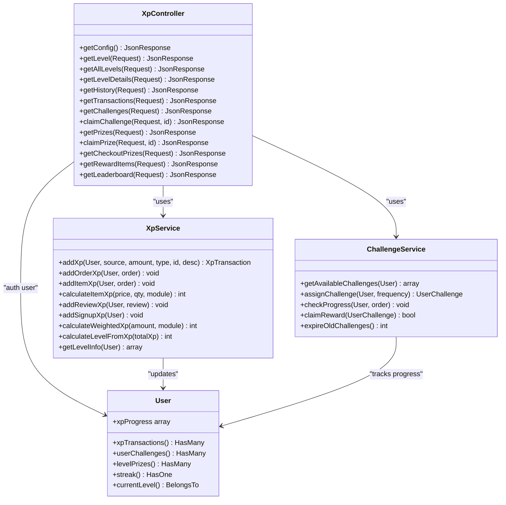

# XP API Endpoints

<cite>
**Referenced Files in This Document**
- [routes/api/v1/api.php](file://routes/api/v1/api.php)
- [app/Http/Controllers/Api/V1/XpController.php](file://app/Http/Controllers/Api/V1/XpController.php)
- [app/Services/XpService.php](file://app/Services/XpService.php)
- [app/Services/ChallengeService.php](file://app/Services/ChallengeService.php)
- [app/Models/User.php](file://app/Models/User.php)
- [XP_SYSTEM_API_DOCS.md](file://XP_SYSTEM_API_DOCS.md)
</cite>

## Table of Contents
1. [Introduction](#introduction)
2. [Project Structure](#project-structure)
3. [Core Components](#core-components)
4. [Architecture Overview](#architecture-overview)
5. [Detailed Component Analysis](#detailed-component-analysis)
6. [Dependency Analysis](#dependency-analysis)
7. [Performance Considerations](#performance-considerations)
8. [Troubleshooting Guide](#troubleshooting-guide)
9. [Conclusion](#conclusion)
10. [Appendices](#appendices)

## Introduction
This document provides comprehensive API documentation for the XP (Experience Points) system endpoints. It covers authentication requirements, request/response formats, error handling, and integration points for client-side XP calculation and UI display. The XP system includes:
- Public configuration endpoint for client-side calculation
- Authenticated endpoints for user progress tracking
- Activity history endpoints for XP activity logs
- Challenge management endpoints for challenge progression and claiming
- Prize management endpoints for discovery and redemption
- Leaderboard endpoint for competitive ranking
- Integration points for potential_xp field in product listings

## Project Structure
The XP system endpoints are organized under the `/api/v1/customer/xp` route prefix and are protected by the `auth:api` middleware except for the public configuration endpoint.

```mermaid
graph TB
subgraph "API Routes"
R1["/api/v1/xp/config<br/>Public (No Auth)"]
R2["/api/v1/customer/xp/level<br/>Auth Required"]
R3["/api/v1/customer/xp/levels<br/>Auth Required"]
R4["/api/v1/customer/xp/level-details<br/>Auth Required"]
R5["/api/v1/customer/xp/history<br/>Auth Required"]
R6["/api/v1/customer/xp/transactions<br/>Auth Required"]
R7["/api/v1/customer/xp/challenges<br/>Auth Required"]
R8["/api/v1/customer/xp/challenges/{id}/claim<br/>Auth Required"]
R9["/api/v1/customer/xp/prizes<br/>Auth Required"]
R10["/api/v1/customer/xp/prizes/{id}/claim<br/>Auth Required"]
R11["/api/v1/customer/xp/checkout-prizes<br/>Auth Required"]
R12["/api/v1/customer/xp/reward-items<br/>Auth Required"]
R13["/api/v1/customer/xp/leaderboard<br/>Auth Required"]
end
subgraph "Controllers"
C1["XpController"]
end
subgraph "Services"
S1["XpService"]
S2["ChallengeService"]
end
subgraph "Models"
M1["User"]
M2["Level"]
M3["XpTransaction"]
M4["UserChallenge"]
M5["UserLevelPrize"]
end
R1 --> C1
R2 --> C1
R3 --> C1
R4 --> C1
R5 --> C1
R6 --> C1
R7 --> C1
R8 --> C1
R9 --> C1
R10 --> C1
R11 --> C1
R12 --> C1
R13 --> C1
C1 --> S1
C1 --> S2
C1 --> M1
C1 --> M2
C1 --> M3
C1 --> M4
C1 --> M5
```



**Diagram sources**
- [routes/api/v1/api.php:387-400](file://routes/api/v1/api.php#L387-L400)
- [app/Http/Controllers/Api/V1/XpController.php:20-574](file://app/Http/Controllers/Api/V1/XpController.php#L20-L574)

**Section sources**
- [routes/api/v1/api.php:387-400](file://routes/api/v1/api.php#L387-L400)

## Core Components
The XP system consists of several core components working together:

### Authentication and Authorization
- Public endpoint: `/api/v1/xp/config` requires no authentication
- All other endpoints require `auth:api` middleware
- Endpoints are grouped under `/api/v1/customer/xp` prefix

### Key Services
- **XpService**: Core XP calculation, awarding, and level management
- **ChallengeService**: Challenge assignment, progress tracking, and claiming
- **User model extensions**: XP progress calculations and relationships

### Data Models
- User: XP balance, level, and progress calculations
- XpTransaction: XP activity records
- UserChallenge: Challenge assignments and progress
- UserLevelPrize: Prize management and status tracking

**Section sources**
- [app/Http/Controllers/Api/V1/XpController.php:20-574](file://app/Http/Controllers/Api/V1/XpController.php#L20-L574)
- [app/Services/XpService.php:15-336](file://app/Services/XpService.php#L15-L336)
- [app/Services/ChallengeService.php:12-321](file://app/Services/ChallengeService.php#L12-L321)

## Architecture Overview
The XP system follows a layered architecture with clear separation of concerns:



**Diagram sources**
- [routes/api/v1/api.php:387-400](file://routes/api/v1/api.php#L387-L400)
- [app/Http/Controllers/Api/V1/XpController.php:20-574](file://app/Http/Controllers/Api/V1/XpController.php#L20-L574)

## Detailed Component Analysis

### Public Configuration Endpoint
**Endpoint**: `GET /api/v1/xp/config`
**Authentication**: None
**Purpose**: Provides XP configuration for client-side calculation and UI display

**Response Schema**:
```json
{
  "enabled": boolean,
  "xp_per_order": integer,
  "xp_per_review": integer,
  "xp_signup_bonus": integer,
  "max_level": integer,
  "multipliers": {
    "food": number,
    "grocery": number,
    "pharmacy": number,
    "ecommerce": number,
    "parcel": number,
    "service": number
  },
  "multiplier_event": {
    "active": boolean,
    "multiplier": number,
    "ends_at": string|null
  },
  "streak_bonus_xp": integer
}
```

**Usage Notes**:
- Cache this endpoint on app startup
- When `enabled` is `false`, hide the entire XP UI
- When `multiplier_event.active` is `true`, apply multiplier to all item XP calculations

**Section sources**
- [app/Http/Controllers/Api/V1/XpController.php:26-49](file://app/Http/Controllers/Api/V1/XpController.php#L26-L49)
- [routes/api/v1/api.php:39-40](file://routes/api/v1/api.php#L39-L40)

### User Progress Tracking Endpoints

#### GET /api/v1/customer/xp/level
**Authentication**: Required
**Purpose**: Get current user's level and XP progress

**Response Schema**:
```json
{
  "current_level": integer,
  "level_name": string,
  "level_badge": string|null,
  "total_xp": integer,
  "xp_to_next_level": integer,
  "progress_percentage": integer,
  "is_max_level": boolean,
  "next_level": {
    "level_number": integer,
    "name": string,
    "xp_required": integer
  }|null
}
```

#### GET /api/v1/customer/xp/levels
**Authentication**: Required
**Purpose**: Get all levels with their prizes for the "Levels" screen

**Response Schema**:
```json
{
  "levels": [
    {
      "level_number": integer,
      "is_unlocked": boolean,
      "name": string,
      "xp_required": integer,
      "description": string,
      "badge_image": string|null,
      "prizes": [
        {
          "id": integer,
          "instance_id": integer|null,
          "title": string,
          "description": string,
          "prize_type": string,
          "value": integer|null,
          "validity_days": integer|null,
          "status": string|null,
          "is_claimed": boolean,
          "is_unlocked": boolean
        }
      ]
    }
  ],
  "current_level": integer,
  "current_xp": integer,
  "xp_for_next_level": integer|null,
  "xp_to_next_level": integer,
  "progress_percentage": integer
}
```

#### GET /api/v1/customer/xp/level-details
**Authentication**: Required
**Purpose**: Combined endpoint returning level info + all levels + streak data

**Response Schema**: Same as `/xp/levels` plus:
```json
{
  "level_name": string,
  "level_badge": string|null,
  "is_max_level": boolean,
  "next_level": object|null,
  "streak": {
    "current_streak": integer,
    "longest_streak": integer,
    "streak_bonus_xp": integer,
    "last_activity_date": string|null
  }
}
```

**Section sources**
- [app/Http/Controllers/Api/V1/XpController.php:54-183](file://app/Http/Controllers/Api/V1/XpController.php#L54-L183)
- [routes/api/v1/api.php:388-390](file://routes/api/v1/api.php#L388-L390)

### Activity History Endpoints

#### GET /api/v1/customer/xp/history
**Authentication**: Required
**Query Parameters**:
- `limit`: integer (1-50, required)
- `offset`: integer (≥1, required)

**Response Schema**:
```json
{
  "history": [
    {
      "type": string,
      "xp": integer,
      "description": string,
      "created_at": string
    }
  ],
  "total_earned": integer,
  "total_size": integer,
  "limit": integer,
  "offset": integer
}
```

**Type Values**: `order`, `review`, `challenge`, `signup`, `streak`, `referral`, `level_up`, `other`

#### GET /api/v1/customer/xp/transactions
**Authentication**: Required
**Query Parameters**: Same as `/history` endpoint

**Response Schema**:
```json
{
  "total_size": integer,
  "limit": integer,
  "offset": integer,
  "transactions": [
    {
      "id": integer,
      "user_id": integer,
      "reference_type": string,
      "reference_id": integer,
      "xp_source": string,
      "xp_amount": integer,
      "balance_after": integer,
      "description": string,
      "is_reversed": boolean,
      "created_at": string,
      "updated_at": string
    }
  ]
}
```

**XP Source Values**: `completion_bonus`, `item_purchase`, `review_bonus`, `signup_bonus`, `streak_bonus`, `referral_bonus`, `daily_challenge`, `weekly_challenge`, `admin_manual`

**Section sources**
- [app/Http/Controllers/Api/V1/XpController.php:228-251](file://app/Http/Controllers/Api/V1/XpController.php#L228-L251)
- [app/Http/Controllers/Api/V1/XpController.php:456-526](file://app/Http/Controllers/Api/V1/XpController.php#L456-L526)
- [routes/api/v1/api.php:391-392](file://routes/api/v1/api.php#L391-L392)

### Challenge Management Endpoints

#### GET /api/v1/customer/xp/challenges
**Authentication**: Required
**Purpose**: Get user's current daily and weekly challenges

**Response Schema**:
```json
{
  "challenges": {
    "daily": {
      "id": integer,
      "challenge_id": integer,
      "title": string,
      "description": string,
      "type": string,
      "challenge_type": string,
      "xp_reward": integer,
      "status": string,
      "progress": object,
      "conditions": object,
      "started_at": string,
      "expires_at": string,
      "completed_at": string|null
    },
    "weekly": {
      "id": integer,
      "challenge_id": integer,
      "title": string,
      "description": string,
      "type": string,
      "challenge_type": string,
      "xp_reward": integer,
      "status": string,
      "progress": object,
      "conditions": object,
      "started_at": string,
      "expires_at": string,
      "completed_at": string|null
    }
  },
  "has_daily": boolean,
  "has_weekly": boolean
}
```

**Challenge Type Values**: `complete_order`, `min_order_amount`, `multiple_orders`, `new_store`

#### POST /api/v1/customer/xp/challenges/{id}/claim
**Authentication**: Required
**URL Parameter**: `id` = the challenge `id` (not `challenge_id`)

**Success Response**:
```json
{
  "message": string,
  "xp_earned": integer,
  "new_total_xp": integer,
  "new_level": integer
}
```

**Error Responses**:
- `404` - Challenge not found or doesn't belong to user
- `403` - Challenge not in `completed` status

**Section sources**
- [app/Http/Controllers/Api/V1/XpController.php:256-309](file://app/Http/Controllers/Api/V1/XpController.php#L256-L309)
- [app/Services/ChallengeService.php:18-321](file://app/Services/ChallengeService.php#L18-L321)
- [routes/api/v1/api.php:394](file://routes/api/v1/api.php#L394)

### Prize Management Endpoints

#### GET /api/v1/customer/xp/prizes
**Authentication**: Required
**Purpose**: Get all user's prizes grouped by status

**Response Schema**:
```json
{
  "usable_prizes": [
    {
      "id": integer,
      "prize_id": integer,
      "level": integer|null,
      "level_name": string|null,
      "title": string,
      "description": string,
      "prize_type": string,
      "value": integer|null,
      "min_order_amount": integer|null,
      "usage_limit": integer|null,
      "status": string,
      "is_usable": boolean,
      "unlocked_at": string,
      "expires_at": string,
      "used_at": string|null
    }
  ],
  "used_prizes": [],
  "expired_prizes": []
}
```

#### POST /api/v1/customer/xp/prizes/{id}/claim
**Authentication**: Required
**URL Parameter**: `id` = the prize `id` from `/xp/prizes` response

**Success Response**:
```json
{
  "message": string,
  "prize": {
    "id": integer,
    "title": string,
    "type": string,
    "value": integer|null,
    "status": string
  }
}
```

**Prize Type Behavior**:
- `wallet_credit`: Credits added to wallet immediately, status becomes `used`
- `free_delivery`: Status becomes `claimed`, usable at checkout
- `free_item`: Status becomes `claimed`
- `discount`: Status becomes `claimed`
- `badge`: Auto-claimed on unlock, no manual claim needed

**Section sources**
- [app/Http/Controllers/Api/V1/XpController.php:314-417](file://app/Http/Controllers/Api/V1/XpController.php#L314-L417)
- [routes/api/v1/api.php:396-397](file://routes/api/v1/api.php#L396-L397)

### Additional Prize Endpoints

#### GET /api/v1/customer/xp/checkout-prizes
**Authentication**: Required
**Query Parameters**:
- `order_amount`: float (optional) - filters prizes by minimum order amount

**Response Schema**:
```json
{
  "prizes": [
    {
      "id": integer,
      "title": string,
      "min_order_amount": integer|null,
      "expires_at": string|null,
      "level_name": string|null
    }
  ]
}
```

#### GET /api/v1/customer/xp/reward-items
**Authentication**: Required
**Query Parameters**:
- `store_id`: integer (required)
- `reward_type`: string (optional, one of: `free_item`, `free_side`, `birthday_gift`)

**Response Schema**:
```json
{
  "reward_items": [
    {
      "id": integer,
      "item_id": integer,
      "item_name": string,
      "item_image": string|null,
      "reward_type": string,
      "max_value": integer|null
    }
  ]
}
```

**Section sources**
- [app/Http/Controllers/Api/V1/XpController.php:188-223](file://app/Http/Controllers/Api/V1/XpController.php#L188-L223)
- [app/Http/Controllers/Api/V1/XpController.php:422-451](file://app/Http/Controllers/Api/V1/XpController.php#L422-L451)

### Leaderboard Endpoint

#### GET /api/v1/customer/xp/leaderboard
**Authentication**: Required
**Query Parameters**:
- `type`: string (optional, default: `global`) - either `global` or `zone`

**Response Schema**:
```json
{
  "leaderboard": [
    {
      "rank": integer,
      "name": string,
      "total_xp": integer,
      "level": integer,
      "image": string|null
    }
  ],
  "my_rank": integer,
  "my_xp": integer,
  "my_level": integer,
  "type": string
}
```

**Section sources**
- [app/Http/Controllers/Api/V1/XpController.php:531-572](file://app/Http/Controllers/Api/V1/XpController.php#L531-L572)
- [routes/api/v1/api.php:399](file://routes/api/v1/api.php#L399)

### Product Integration Points

#### Potential XP Field in Product Listings
Every item returned from product endpoints now includes a `potential_xp` field:

```json
{
  "id": integer,
  "name": string,
  "price": number,
  "potential_xp": integer,
  "...other fields...": {}
}
```

**Formula**: `floor(price × 1 × module_multiplier × 0.1)`

**Client-Side Usage**:
- This is the XP for 1 unit
- For cart display: `displayed_xp = potential_xp × quantity`
- When an event multiplier is active, actual XP may be higher than `potential_xp`

**Section sources**
- [XP_SYSTEM_API_DOCS.md:565-590](file://XP_SYSTEM_API_DOCS.md#L565-L590)

## Dependency Analysis



**Diagram sources**
- [app/Http/Controllers/Api/V1/XpController.php:20-574](file://app/Http/Controllers/Api/V1/XpController.php#L20-L574)
- [app/Services/XpService.php:15-336](file://app/Services/XpService.php#L15-L336)
- [app/Services/ChallengeService.php:12-321](file://app/Services/ChallengeService.php#L12-L321)
- [app/Models/User.php:19-200](file://app/Models/User.php#L19-L200)

**Section sources**
- [app/Http/Controllers/Api/V1/XpController.php:20-574](file://app/Http/Controllers/Api/V1/XpController.php#L20-L574)
- [app/Services/XpService.php:15-336](file://app/Services/XpService.php#L15-L336)
- [app/Services/ChallengeService.php:12-321](file://app/Services/ChallengeService.php#L12-L321)

## Performance Considerations
- **Caching**: The public `/xp/config` endpoint should be cached aggressively due to its frequent client-side usage
- **Pagination**: All history and transaction endpoints support pagination with `limit` and `offset` parameters
- **Database Indexes**: Ensure proper indexing on `user_id`, `created_at`, and XP-related fields for optimal query performance
- **Batch Operations**: Consider batch processing for challenge expiration and XP calculations during peak usage
- **Memory Usage**: Large transaction histories may require careful pagination to avoid memory issues

## Troubleshooting Guide

### Common Authentication Issues
- **401 Unauthorized**: Missing or invalid authentication token
- **403 Forbidden**: User account disabled or insufficient permissions
- **404 Not Found**: User not found or endpoint not registered

### Challenge System Issues
- **Challenge not found**: Verify the challenge `id` parameter matches the user's challenge
- **Challenge not completed**: Ensure challenge status is `completed` before claiming
- **Daily/Weekly reset**: Challenges reset at midnight (daily) and weekly on Saturdays

### Prize System Issues
- **Prize not found**: Verify the prize `id` exists and belongs to the authenticated user
- **Already claimed/expired**: Check prize status is `unlocked` and not expired
- **Minimum order amount**: Ensure order meets the prize's minimum order requirement

### Error Response Format
All error responses follow this format:
```json
{
  "errors": [
    {
      "code": string,
      "message": string
    }
  ]
}
```

**Section sources**
- [app/Http/Controllers/Api/V1/XpController.php:280-308](file://app/Http/Controllers/Api/V1/XpController.php#L280-L308)
- [app/Http/Controllers/Api/V1/XpController.php:366-383](file://app/Http/Controllers/Api/V1/XpController.php#L366-L383)

## Conclusion
The XP system provides a comprehensive gamification framework with clear separation between public configuration data and authenticated user-specific data. The architecture supports scalability through service layer abstraction and provides extensive customization through XP settings and challenge configurations. The endpoints are designed for efficient client-side caching and responsive user experiences.

## Appendices

### Authentication Headers
For authenticated endpoints, include the following header:
```
Authorization: Bearer YOUR_ACCESS_TOKEN
```

### Rate Limiting
- Authentication endpoints: throttle:auth
- OTP verification: throttle:otp

### Data Validation Rules
- Pagination: limit (1-50), offset (≥1)
- Challenge claim: challenge must be in `completed` status
- Prize claim: prize must be in `unlocked` status and not expired