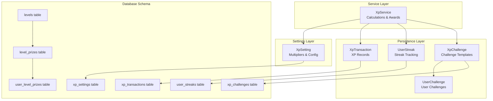
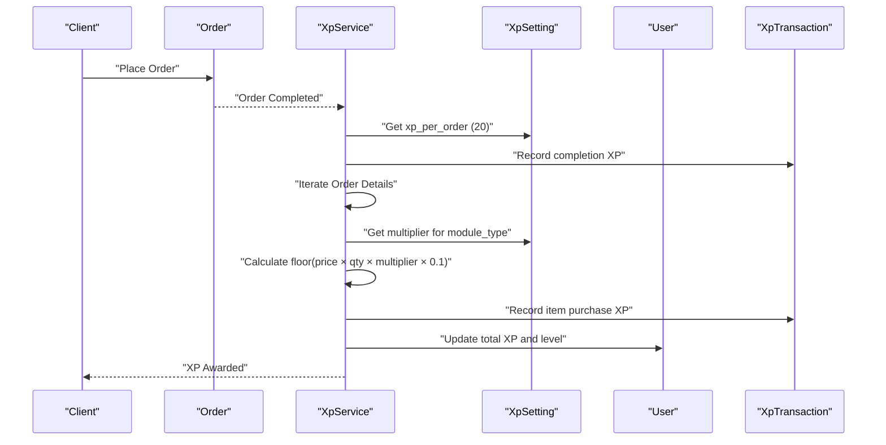
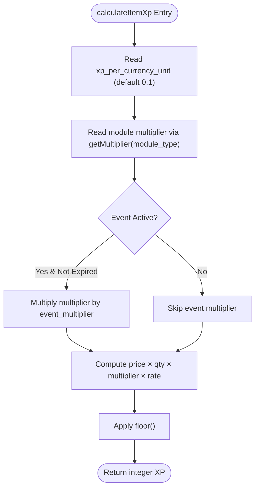
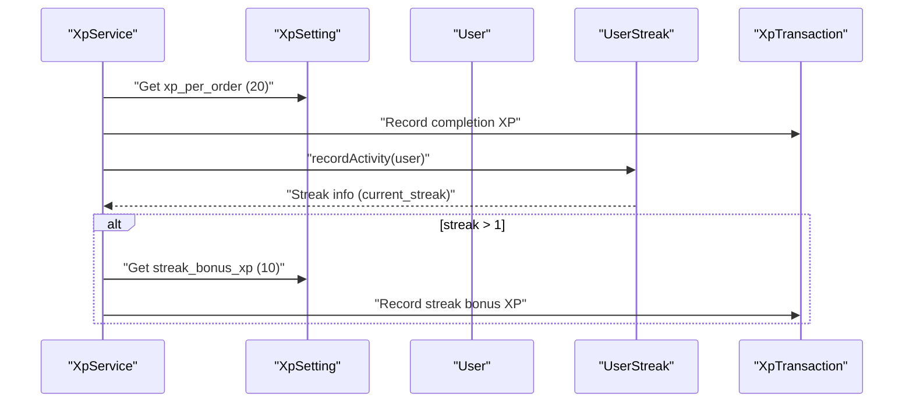
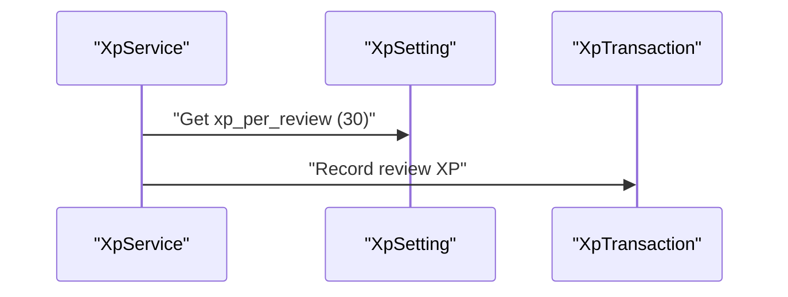
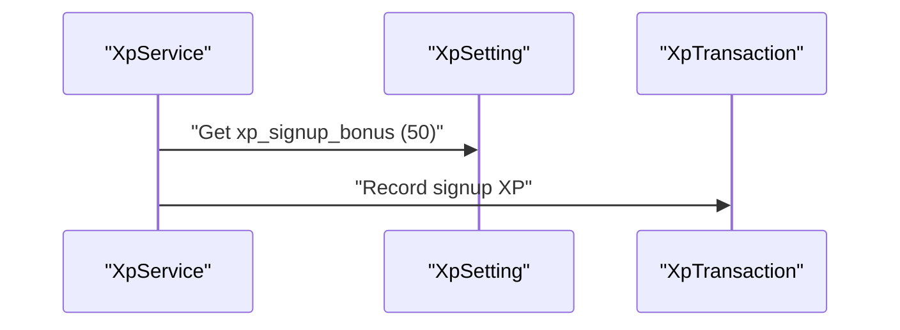
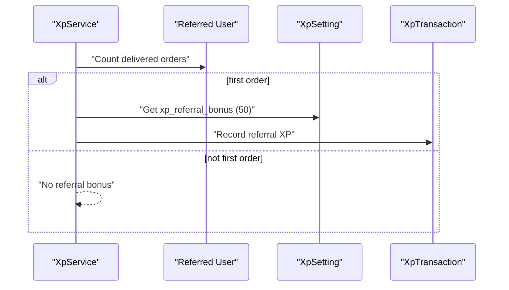
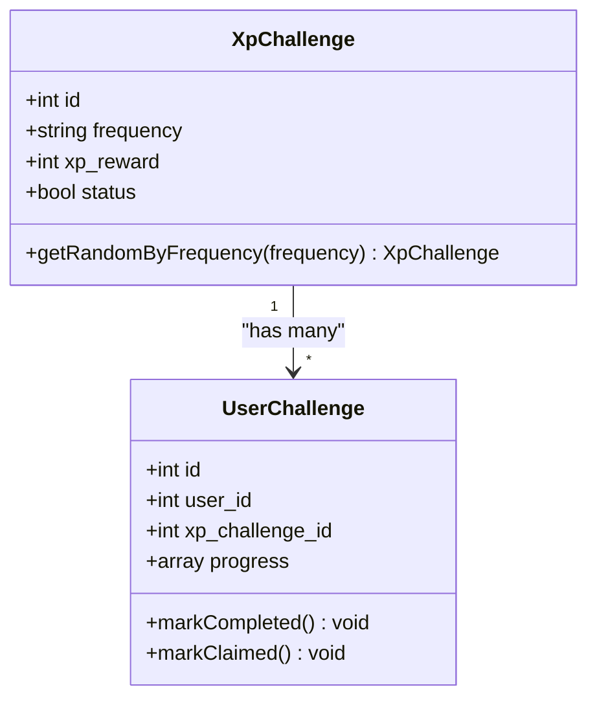
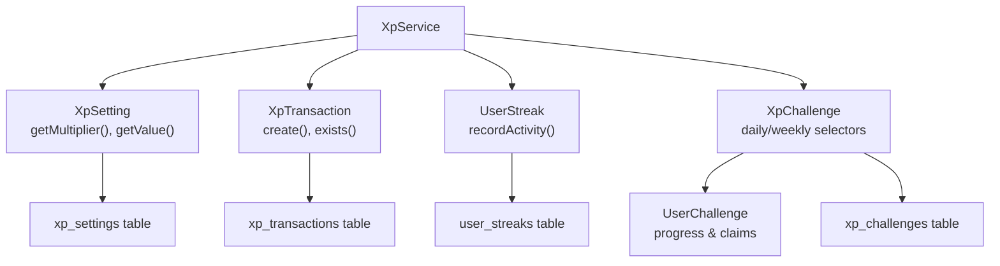

# XP Calculation Algorithms

<cite>
**Referenced Files in This Document**
- [XpService.php](file://app/Services/XpService.php)
- [XpSetting.php](file://app/Models/XpSetting.php)
- [XpTransaction.php](file://app/Models/XpTransaction.php)
- [UserStreak.php](file://app/Models/UserStreak.php)
- [XpChallenge.php](file://app/Models/XpChallenge.php)
- [UserChallenge.php](file://app/Models/UserChallenge.php)
- [create_xp_settings_table.php](file://database/migrations/2025_12_28_000008_create_xp_settings_table.php)
- [create_xp_transactions_table.php](file://database/migrations/2025_12_28_000004_create_xp_transactions_table.php)
- [create_user_streaks_table.php](file://database/migrations/2026_02_17_000001_create_user_streaks_table.php)
- [create_levels_table.php](file://database/migrations/2025_12_28_000002_create_levels_table.php)
- [create_level_prizes_table.php](file://database/migrations/2025_12_28_000003_create_level_prizes_table.php)
- [create_user_level_prizes_table.php](file://database/migrations/2025_12_28_000007_create_user_level_prizes_table.php)
- [create_xp_challenges_table.php](file://database/migrations/2025_12_28_000005_create_xp_challenges_table.php)
- [LevelsSeeder.php](file://database/seeders/LevelsSeeder.php)
- [ChallengesSeeder.php](file://database/seeders/ChallengesSeeder.php)
</cite>

## Table of Contents
1. [Introduction](#introduction)
2. [Project Structure](#project-structure)
3. [Core Components](#core-components)
4. [Architecture Overview](#architecture-overview)
5. [Detailed Component Analysis](#detailed-component-analysis)
6. [Dependency Analysis](#dependency-analysis)
7. [Performance Considerations](#performance-considerations)
8. [Troubleshooting Guide](#troubleshooting-guide)
9. [Conclusion](#conclusion)

## Introduction
This document explains the XP calculation algorithms used in the system, focusing on how XP points are accumulated through purchases, completions, reviews, signups, streaks, referrals, and challenges. It details the mathematical formulas, module multipliers, and integration points within the order processing workflow, and provides code references for implementation.

## Project Structure
The XP system spans several core components:
- Service layer: XpService orchestrates XP calculations and awards
- Settings layer: XpSetting manages configurable XP parameters and multipliers
- Persistence layer: XpTransaction records XP events; UserStreak tracks streaks; XpChallenge and UserChallenge manage challenge workflows
- Database schema: Migrations define XP-related tables and their relationships

**Diagram sources**
- [XpService.php:15-336](file://app/Services/XpService.php#L15-L336)
- [XpSetting.php:8-68](file://app/Models/XpSetting.php#L8-L68)
- [XpTransaction.php:8-53](file://app/Models/XpTransaction.php#L8-L53)
- [UserStreak.php:9-81](file://app/Models/UserStreak.php#L9-L81)
- [XpChallenge.php:8-64](file://app/Models/XpChallenge.php#L8-L64)
- [UserChallenge.php:9-118](file://app/Models/UserChallenge.php#L9-L118)

**Section sources**
- [XpService.php:15-336](file://app/Services/XpService.php#L15-L336)
- [XpSetting.php:8-68](file://app/Models/XpSetting.php#L8-L68)
- [XpTransaction.php:8-53](file://app/Models/XpTransaction.php#L8-L53)
- [UserStreak.php:9-81](file://app/Models/UserStreak.php#L9-L81)
- [XpChallenge.php:8-64](file://app/Models/XpChallenge.php#L8-L64)
- [UserChallenge.php:9-118](file://app/Models/UserChallenge.php#L9-L118)

## Core Components
This section documents the XP calculation formulas and their implementation:

- Item Purchase XP Formula
  - Mathematical formula: floor(price × quantity × multiplier × rate)
  - Rate parameter: xp_per_currency_unit (default 0.1)
  - Multiplier: derived from module type via XpSetting.getMultiplier(module_type)
  - Event multiplier: optional multiplier_event_multiplier applied when multiplier_event_active is true and not expired
  - Implementation reference: [calculateItemXp:150-166](file://app/Services/XpService.php#L150-L166)

- Order Completion Flat Rate
  - Fixed XP awarded per completed order: xp_per_order (default 20)
  - Implementation reference: [addOrderXp:81-116](file://app/Services/XpService.php#L81-L116)

- Review Bonus
  - Fixed XP awarded per review: xp_per_review (default 30)
  - Implementation reference: [addReviewXp:171-182](file://app/Services/XpService.php#L171-L182)

- Signup Bonus
  - Fixed XP awarded on user registration: xp_signup_bonus (default 50)
  - Implementation reference: [addSignupXp:187-200](file://app/Services/XpService.php#L187-L200)

- Streak Bonus
  - Additional XP for consecutive orders: streak_bonus_xp (default 10)
  - Streak tracking handled by UserStreak.recordActivity
  - Implementation reference: [addOrderXp:97-116](file://app/Services/XpService.php#L97-L116), [recordActivity:34-66](file://app/Models/UserStreak.php#L34-L66)

- Referral Bonus
  - Fixed XP awarded when a referred user places their first order: xp_referral_bonus (default 50)
  - Implementation reference: [addReferralXp:317-334](file://app/Services/XpService.php#L317-L334)

- Challenge-Based Rewards
  - Daily challenge reward: defined by XpChallenge.xp_reward (e.g., 20)
  - Weekly challenge reward: defined by XpChallenge.xp_reward (e.g., 100)
  - Implementation references: [XpChallenge:8-64](file://app/Models/XpChallenge.php#L8-L64), [UserChallenge:9-118](file://app/Models/UserChallenge.php#L9-L118)

- Module Multipliers
  - Food: 1.0
  - Ecommerce: 1.0
  - Pharmacy: 0.5
  - Grocery: 0.25
  - Parcel: 0.1
  - Service: 1.0
  - Retrieved from XpSetting.getMultiplier(module_type)
  - Implementation reference: [getMultiplier:62-66](file://app/Models/XpSetting.php#L62-L66)

**Section sources**
- [XpService.php:81-182](file://app/Services/XpService.php#L81-L182)
- [XpService.php:187-200](file://app/Services/XpService.php#L187-L200)
- [XpService.php:317-334](file://app/Services/XpService.php#L317-L334)
- [XpService.php:150-166](file://app/Services/XpService.php#L150-L166)
- [XpSetting.php:62-66](file://app/Models/XpSetting.php#L62-L66)
- [UserStreak.php:34-66](file://app/Models/UserStreak.php#L34-L66)
- [XpChallenge.php:8-64](file://app/Models/XpChallenge.php#L8-L64)
- [UserChallenge.php:9-118](file://app/Models/UserChallenge.php#L9-L118)

## Architecture Overview
The XP system integrates with order processing and user lifecycle events. The flow below shows how XP is calculated and recorded during an order completion.

**Diagram sources**
- [XpService.php:81-144](file://app/Services/XpService.php#L81-L144)
- [XpSetting.php:17-37](file://app/Models/XpSetting.php#L17-L37)

**Section sources**
- [XpService.php:81-144](file://app/Services/XpService.php#L81-L144)
- [XpSetting.php:17-37](file://app/Models/XpSetting.php#L17-L37)

## Detailed Component Analysis

### Item Purchase XP Calculation
The per-item XP is computed using the formula: floor(price × quantity × multiplier × rate). The rate is configurable via xp_per_currency_unit (default 0.1). An optional event multiplier can increase the effective multiplier if active and not expired.

**Diagram sources**
- [XpService.php:150-166](file://app/Services/XpService.php#L150-L166)
- [XpSetting.php:62-66](file://app/Models/XpSetting.php#L62-L66)

**Section sources**
- [XpService.php:150-166](file://app/Services/XpService.php#L150-L166)
- [XpSetting.php:62-66](file://app/Models/XpSetting.php#L62-L66)

### Order Completion and Streak Bonus
When an order completes, the system awards a flat rate (xp_per_order) and iterates through items to award purchase XP. It also updates the user's streak and may award a streak bonus if the streak count exceeds 1.

**Diagram sources**
- [XpService.php:81-116](file://app/Services/XpService.php#L81-L116)
- [UserStreak.php:34-66](file://app/Models/UserStreak.php#L34-L66)

**Section sources**
- [XpService.php:81-116](file://app/Services/XpService.php#L81-L116)
- [UserStreak.php:34-66](file://app/Models/UserStreak.php#L34-L66)

### Review Bonus Workflow
A fixed amount of XP (xp_per_review) is awarded when a user submits a review.

**Diagram sources**
- [XpService.php:171-182](file://app/Services/XpService.php#L171-L182)

**Section sources**
- [XpService.php:171-182](file://app/Services/XpService.php#L171-L182)

### Signup Bonus Workflow
On user registration, a fixed signup bonus (xp_signup_bonus) is awarded.

**Diagram sources**
- [XpService.php:187-200](file://app/Services/XpService.php#L187-L200)

**Section sources**
- [XpService.php:187-200](file://app/Services/XpService.php#L187-L200)

### Referral Bonus Workflow
When a referred user places their first order, the referrer receives a fixed referral bonus (xp_referral_bonus).

**Diagram sources**
- [XpService.php:317-334](file://app/Services/XpService.php#L317-L334)

**Section sources**
- [XpService.php:317-334](file://app/Services/XpService.php#L317-L334)

### Challenge-Based XP Rewards
Daily and weekly challenges define XP rewards. The system selects active challenges by frequency and allows users to track progress and claim rewards.

**Diagram sources**
- [XpChallenge.php:8-64](file://app/Models/XpChallenge.php#L8-L64)
- [UserChallenge.php:9-118](file://app/Models/UserChallenge.php#L9-L118)

**Section sources**
- [XpChallenge.php:8-64](file://app/Models/XpChallenge.php#L8-L64)
- [UserChallenge.php:9-118](file://app/Models/UserChallenge.php#L9-L118)

## Dependency Analysis
The XP system relies on configuration-driven multipliers and settings, ensuring flexibility across business verticals.

**Diagram sources**
- [XpService.php:15-336](file://app/Services/XpService.php#L15-L336)
- [XpSetting.php:8-68](file://app/Models/XpSetting.php#L8-L68)
- [XpTransaction.php:8-53](file://app/Models/XpTransaction.php#L8-L53)
- [UserStreak.php:9-81](file://app/Models/UserStreak.php#L9-L81)
- [XpChallenge.php:8-64](file://app/Models/XpChallenge.php#L8-L64)
- [UserChallenge.php:9-118](file://app/Models/UserChallenge.php#L9-L118)

**Section sources**
- [XpService.php:15-336](file://app/Services/XpService.php#L15-L336)
- [XpSetting.php:8-68](file://app/Models/XpSetting.php#L8-L68)
- [XpTransaction.php:8-53](file://app/Models/XpTransaction.php#L8-L53)
- [UserStreak.php:9-81](file://app/Models/UserStreak.php#L9-L81)
- [XpChallenge.php:8-64](file://app/Models/XpChallenge.php#L8-L64)
- [UserChallenge.php:9-118](file://app/Models/UserChallenge.php#L9-L118)

## Performance Considerations
- Transaction boundaries: All XP additions occur inside database transactions to maintain consistency.
- Duplicate prevention: XpTransaction.exists prevents double-awarding for the same reference and source.
- Event multipliers: Optional event multipliers are checked with time-based expiry to avoid unnecessary computation.
- Streak updates: Minimal overhead through date comparisons and atomic increments.

[No sources needed since this section provides general guidance]

## Troubleshooting Guide
Common issues and resolutions:
- XP not being awarded
  - Verify leveling is enabled via XpSetting.isEnabled()
  - Confirm settings keys exist and have expected defaults
  - Check for duplicate transactions via XpTransaction.exists()

- Incorrect XP amounts
  - Validate module_type alignment with multipliers
  - Ensure xp_per_currency_unit and event multipliers are set appropriately

- Streak bonus not applying
  - Confirm UserStreak.recordActivity runs after order completion
  - Verify streak_bonus_xp setting value

- Referral bonus not applying
  - Confirm referred user has placed ≤ 1 delivered order
  - Verify xp_referral_bonus setting value

**Section sources**
- [XpService.php:29-37](file://app/Services/XpService.php#L29-L37)
- [XpTransaction.php:35-42](file://app/Models/XpTransaction.php#L35-L42)
- [XpSetting.php:53-57](file://app/Models/XpSetting.php#L53-L57)
- [UserStreak.php:34-66](file://app/Models/UserStreak.php#L34-L66)
- [XpService.php:322-323](file://app/Services/XpService.php#L322-L323)

## Conclusion
The XP system uses configurable, modular calculations to reward user engagement across purchases, completions, reviews, signups, streaks, referrals, and challenges. The design leverages XpSetting for flexible multipliers and rates, XpTransaction for auditability, and UserStreak for behavioral incentives. The provided references enable precise implementation verification and future maintenance.