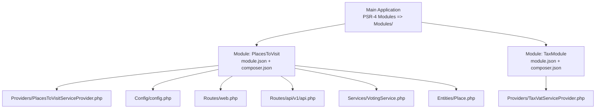
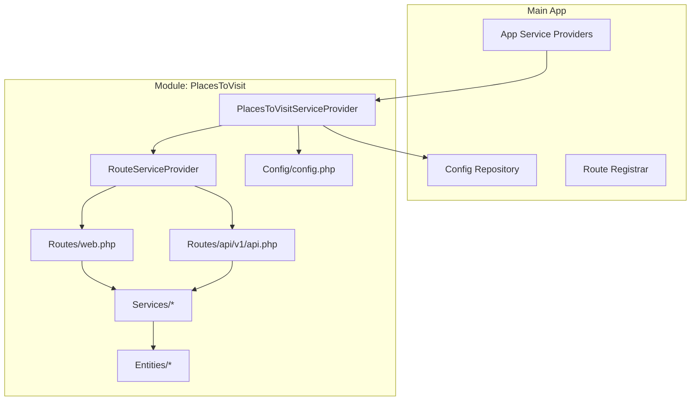
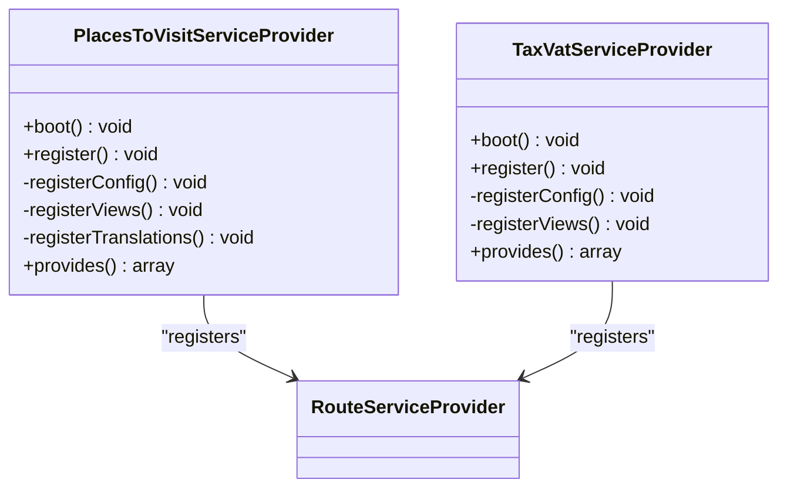
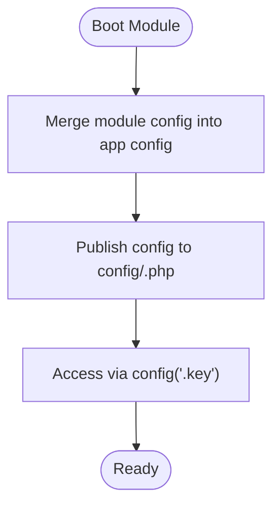
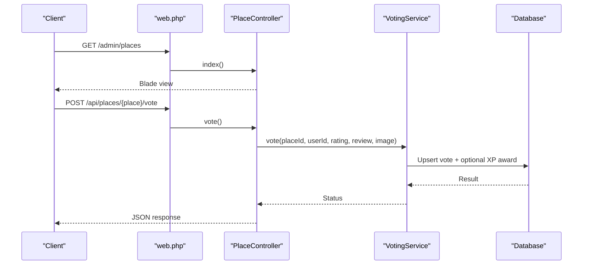
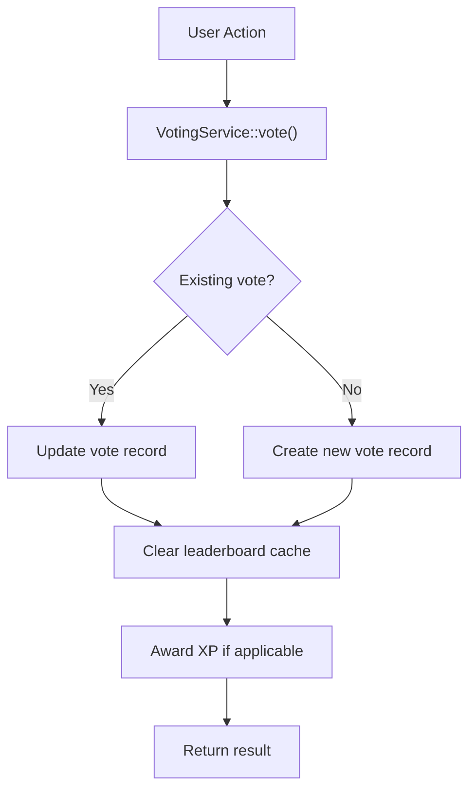
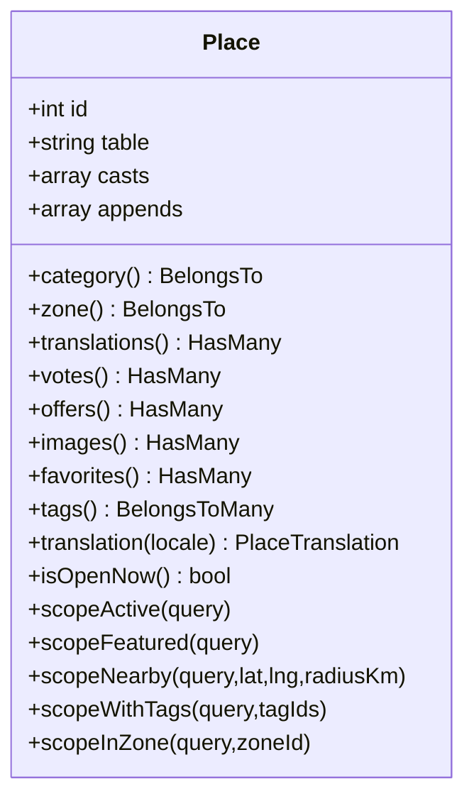
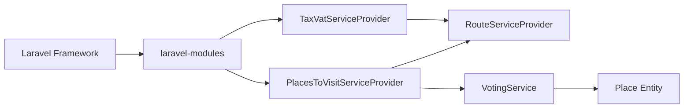

# Creating Custom Modules

<cite>
**Referenced Files in This Document**
- [module.json](file://Modules/PlacesToVisit/module.json)
- [module.json](file://Modules/TaxModule/module.json)
- [modules.php](file://config/modules.php)
- [composer.json](file://composer.json)
- [PlacesToVisitServiceProvider.php](file://Modules/PlacesToVisit/Providers/PlacesToVisitServiceProvider.php)
- [TaxVatServiceProvider.php](file://Modules/TaxModule/Providers/TaxVatServiceProvider.php)
- [config.php](file://Modules/PlacesToVisit/Config/config.php)
- [web.php](file://Modules/PlacesToVisit/Routes/web.php)
- [api.php](file://Modules/PlacesToVisit/Routes/api/v1/api.php)
- [VotingService.php](file://Modules/PlacesToVisit/Services/VotingService.php)
- [Place.php](file://Modules/PlacesToVisit/Entities/Place.php)
- [composer.json](file://Modules/PlacesToVisit/composer.json)
- [composer.json](file://Modules/TaxModule/composer.json)
</cite>

## Table of Contents
1. [Introduction](#introduction)
2. [Project Structure](#project-structure)
3. [Core Components](#core-components)
4. [Architecture Overview](#architecture-overview)
5. [Detailed Component Analysis](#detailed-component-analysis)
6. [Dependency Analysis](#dependency-analysis)
7. [Performance Considerations](#performance-considerations)
8. [Troubleshooting Guide](#troubleshooting-guide)
9. [Conclusion](#conclusion)
10. [Appendices](#appendices)

## Introduction
This document explains how to build custom modules from scratch in a Laravel application using the laravel-modules package. It covers both automated generation via CLI commands and manual setup, details the module.json configuration, namespace requirements, and metadata definition, and walks through generating module structure, implementing core components, and integrating with the main application. Practical examples demonstrate building two distinct modules: a feature-rich module with services, entities, routes, and configuration, and a minimal module focused on configuration and routing. Testing strategies and deployment considerations are included, along with best practices for naming, versioning, and documentation.

## Project Structure
The project organizes modules under the Modules directory, each containing standard Laravel folders (Config, Database, Entities, Http, Providers, Resources, Routes, Services) plus a module.json and composer.json. The main application’s composer autoload PSR-4 maps the Modules namespace so modules are autoloaded automatically.

**Diagram sources**
- [composer.json:71-76](file://composer.json#L71-L76)
- [module.json:1-17](file://Modules/PlacesToVisit/module.json#L1-L17)
- [module.json:1-14](file://Modules/TaxModule/module.json#L1-L14)
- [PlacesToVisitServiceProvider.php:1-88](file://Modules/PlacesToVisit/Providers/PlacesToVisitServiceProvider.php#L1-L88)
- [TaxVatServiceProvider.php:1-113](file://Modules/TaxModule/Providers/TaxVatServiceProvider.php#L1-L113)
- [config.php:1-53](file://Modules/PlacesToVisit/Config/config.php#L1-L53)
- [web.php:1-91](file://Modules/PlacesToVisit/Routes/web.php#L1-L91)
- [api.php:1-51](file://Modules/PlacesToVisit/Routes/api/v1/api.php#L1-L51)
- [VotingService.php:1-216](file://Modules/PlacesToVisit/Services/VotingService.php#L1-L216)
- [Place.php:1-218](file://Modules/PlacesToVisit/Entities/Place.php#L1-L218)

**Section sources**
- [composer.json:71-76](file://composer.json#L71-L76)
- [module.json:1-17](file://Modules/PlacesToVisit/module.json#L1-L17)
- [module.json:1-14](file://Modules/TaxModule/module.json#L1-L14)

## Core Components
- Module manifest and metadata: module.json defines human-readable metadata, aliases, keywords, priority, providers, and dependencies.
- Module autoloading: composer.json inside each module registers PSR-4 to load classes under Modules\<ModuleName>\.
- Module service provider: bootstraps configuration publishing, view loading, translation loading, and migration loading; registers route provider and singleton services.
- Configuration: module-specific config merged into the application config under a module alias.
- Routing: separate route files for web and API groups with middleware and namespaces.
- Domain services: encapsulate business logic (e.g., VotingService).
- Data model: Eloquent model with relationships, accessors, scopes, and localization helpers.

**Section sources**
- [module.json:1-17](file://Modules/PlacesToVisit/module.json#L1-L17)
- [module.json:1-14](file://Modules/TaxModule/module.json#L1-L14)
- [composer.json:1-16](file://Modules/PlacesToVisit/composer.json#L1-L16)
- [composer.json:1-24](file://Modules/TaxModule/composer.json#L1-L24)
- [PlacesToVisitServiceProvider.php:10-31](file://Modules/PlacesToVisit/Providers/PlacesToVisitServiceProvider.php#L10-L31)
- [TaxVatServiceProvider.php:8-41](file://Modules/TaxModule/Providers/TaxVatServiceProvider.php#L8-L41)
- [config.php:1-53](file://Modules/PlacesToVisit/Config/config.php#L1-L53)
- [web.php:1-91](file://Modules/PlacesToVisit/Routes/web.php#L1-L91)
- [api.php:1-51](file://Modules/PlacesToVisit/Routes/api/v1/api.php#L1-L51)
- [VotingService.php:11-31](file://Modules/PlacesToVisit/Services/VotingService.php#L11-L31)
- [Place.php:12-24](file://Modules/PlacesToVisit/Entities/Place.php#L12-L24)

## Architecture Overview
The module architecture follows Laravel conventions with a dedicated namespace and provider-driven initialization. Providers merge module config, publish views, load migrations, and register route providers and services. Routes are grouped by domain and middleware, and controllers delegate to services and models.

**Diagram sources**
- [PlacesToVisitServiceProvider.php:15-31](file://Modules/PlacesToVisit/Providers/PlacesToVisitServiceProvider.php#L15-L31)
- [TaxVatServiceProvider.php:25-41](file://Modules/TaxModule/Providers/TaxVatServiceProvider.php#L25-L41)
- [config.php:1-53](file://Modules/PlacesToVisit/Config/config.php#L1-L53)
- [web.php:1-91](file://Modules/PlacesToVisit/Routes/web.php#L1-L91)
- [api.php:1-51](file://Modules/PlacesToVisit/Routes/api/v1/api.php#L1-L51)

## Detailed Component Analysis

### Module Manifest and Metadata (module.json)
- Fields:
  - name: Human-friendly module name.
  - alias: Lowercase, hyphen-free identifier used in config publishing and view paths.
  - description, keywords: Metadata for discoverability.
  - priority: Load order hint.
  - providers: Fully qualified provider classes to register.
  - aliases, files: Optional bindings and files to load.
  - requires: Dependencies on other modules.
- Example references:
  - PlacesToVisit module manifest.
  - TaxModule module manifest.

Best practices:
- Keep alias concise and URL-safe.
- List only providers required at bootstrap.
- Use requires to enforce module dependencies.

**Section sources**
- [module.json:1-17](file://Modules/PlacesToVisit/module.json#L1-L17)
- [module.json:1-14](file://Modules/TaxModule/module.json#L1-L14)

### Module Autoloading and Namespaces
- Main app composer autoload maps Modules => Modules/.
- Each module’s composer.json sets PSR-4 Modules\<ModuleName>\ => "" to autoload its classes.
- References:
  - Main app autoload PSR-4 Modules.
  - PlacesToVisit module autoload.
  - TaxModule module autoload.

Guidelines:
- Use PascalCase for module name in namespace.
- Keep module composer.json minimal; rely on main app autoload for Modules.

**Section sources**
- [composer.json:71-76](file://composer.json#L71-L76)
- [composer.json:11-15](file://Modules/PlacesToVisit/composer.json#L11-L15)
- [composer.json:18-22](file://Modules/TaxModule/composer.json#L18-L22)

### Service Provider Bootstrapping
- PlacesToVisitServiceProvider:
  - Registers RouteServiceProvider.
  - Registers singletons for LeaderboardService, VotingService, TrendingService.
  - Publishes and merges config.
  - Loads views from Resources/views and publishes to resource path.
  - Loads translations from module or resource path.
  - Loads migrations from Database/Migrations.
- TaxVatServiceProvider:
  - Similar pattern with config and views registration, and migration loading.

**Diagram sources**
- [PlacesToVisitServiceProvider.php:10-31](file://Modules/PlacesToVisit/Providers/PlacesToVisitServiceProvider.php#L10-L31)
- [TaxVatServiceProvider.php:8-41](file://Modules/TaxModule/Providers/TaxVatServiceProvider.php#L8-L41)

**Section sources**
- [PlacesToVisitServiceProvider.php:15-66](file://Modules/PlacesToVisit/Providers/PlacesToVisitServiceProvider.php#L15-L66)
- [TaxVatServiceProvider.php:25-74](file://Modules/TaxModule/Providers/TaxVatServiceProvider.php#L25-L74)

### Configuration Publishing and Loading
- Module config is published to config/<alias>.php and merged under the alias.
- Example module config keys include leaderboard thresholds, trending windows, XP rewards, and submission limits.

**Diagram sources**
- [PlacesToVisitServiceProvider.php:33-43](file://Modules/PlacesToVisit/Providers/PlacesToVisitServiceProvider.php#L33-L43)
- [config.php:1-53](file://Modules/PlacesToVisit/Config/config.php#L1-L53)

**Section sources**
- [PlacesToVisitServiceProvider.php:33-43](file://Modules/PlacesToVisit/Providers/PlacesToVisitServiceProvider.php#L33-L43)
- [config.php:1-53](file://Modules/PlacesToVisit/Config/config.php#L1-L53)

### Routing and Controllers
- Web routes:
  - Grouped under admin/places with middleware and controller namespaces.
  - Admin CRUD routes for categories, zones, places, leaderboard, banners, offers, and submissions.
- API routes:
  - Public endpoints for listings and leaderboards.
  - Protected endpoints for voting, favorites, and submissions gated by API auth middleware.

**Diagram sources**
- [web.php:11-90](file://Modules/PlacesToVisit/Routes/web.php#L11-L90)
- [api.php:11-49](file://Modules/PlacesToVisit/Routes/api/v1/api.php#L11-L49)
- [VotingService.php:16-86](file://Modules/PlacesToVisit/Services/VotingService.php#L16-L86)

**Section sources**
- [web.php:1-91](file://Modules/PlacesToVisit/Routes/web.php#L1-L91)
- [api.php:1-51](file://Modules/PlacesToVisit/Routes/api/v1/api.php#L1-L51)
- [VotingService.php:11-31](file://Modules/PlacesToVisit/Services/VotingService.php#L11-L31)

### Domain Services and Business Logic
- VotingService encapsulates:
  - Submitting/updating votes with period scoping.
  - Removing votes.
  - Reporting and flagging reviews.
  - Clearing leaderboard caches on changes.
- Integrates with XP services to award points for activity.

**Diagram sources**
- [VotingService.php:16-86](file://Modules/PlacesToVisit/Services/VotingService.php#L16-L86)

**Section sources**
- [VotingService.php:11-216](file://Modules/PlacesToVisit/Services/VotingService.php#L11-L216)

### Data Models and Relationships
- Place entity demonstrates:
  - Casts for numeric precision and booleans.
  - Accessors for image URLs and localized title/description.
  - Relationships to categories, zones, translations, votes, offers, images, favorites, and tags.
  - Scopes for active, featured, nearby, with tags, and zone filtering.

**Diagram sources**
- [Place.php:12-218](file://Modules/PlacesToVisit/Entities/Place.php#L12-L218)

**Section sources**
- [Place.php:12-218](file://Modules/PlacesToVisit/Entities/Place.php#L12-L218)

### Step-by-Step Module Creation

#### Automated Generation with Laravel Modules CLI
- Install laravel-modules if not present.
- Run the module generator command to scaffold a new module with standard folders and files.
- The generator reads configuration from config/modules.php to determine generator paths and stubs.
- After generation, update module.json with metadata and providers, and adjust composer.json autoload if needed.

References:
- Generator paths and stubs configuration.
- Available commands list.

**Section sources**
- [modules.php:103-131](file://config/modules.php#L103-L131)
- [modules.php:144-190](file://config/modules.php#L144-L190)

#### Manual Setup Checklist
- Create directory Modules/<ModuleName>.
- Add module.json with name, alias, providers, and metadata.
- Add composer.json with PSR-4 Modules\<ModuleName>\ => "".
- Create Providers/<ModuleName>ServiceProvider.php with boot/register logic.
- Create Config/config.php with module-specific settings.
- Create Routes/web.php and Routes/api/v1/api.php with route groups and middleware.
- Create Services, Entities, Resources, and Database folders as needed.
- Ensure main app composer autoload includes Modules.

References:
- PlacesToVisit module structure and files.
- TaxModule module structure and files.

**Section sources**
- [module.json:1-17](file://Modules/PlacesToVisit/module.json#L1-L17)
- [composer.json:1-16](file://Modules/PlacesToVisit/composer.json#L1-L16)
- [PlacesToVisitServiceProvider.php:10-31](file://Modules/PlacesToVisit/Providers/PlacesToVisitServiceProvider.php#L10-L31)
- [config.php:1-53](file://Modules/PlacesToVisit/Config/config.php#L1-L53)
- [web.php:1-91](file://Modules/PlacesToVisit/Routes/web.php#L1-L91)
- [api.php:1-51](file://Modules/PlacesToVisit/Routes/api/v1/api.php#L1-L51)
- [module.json:1-14](file://Modules/TaxModule/module.json#L1-L14)
- [composer.json:1-24](file://Modules/TaxModule/composer.json#L1-L24)
- [TaxVatServiceProvider.php:8-41](file://Modules/TaxModule/Providers/TaxVatServiceProvider.php#L8-L41)

### Practical Examples

#### Example 1: PlacesToVisit Module
- Purpose: Local places discovery with voting, leaderboard, trending, banners, offers, favorites, and submissions.
- Key components:
  - Providers: PlacesToVisitServiceProvider registers services and loads migrations/views/config.
  - Routes: Admin CRUD and public API endpoints.
  - Services: VotingService orchestrates voting logic and cache invalidation.
  - Models: Place entity with localization and geospatial-like scopes.
  - Config: Leaderboard thresholds, trending windows, XP rewards, and submission limits.

Integration steps:
- Ensure module.json lists the provider.
- Publish and merge config during provider boot.
- Load routes via RouteServiceProvider registered in the module provider.
- Use services in controllers to handle business logic.

**Section sources**
- [module.json:1-17](file://Modules/PlacesToVisit/module.json#L1-L17)
- [PlacesToVisitServiceProvider.php:15-31](file://Modules/PlacesToVisit/Providers/PlacesToVisitServiceProvider.php#L15-L31)
- [web.php:1-91](file://Modules/PlacesToVisit/Routes/web.php#L1-L91)
- [api.php:1-51](file://Modules/PlacesToVisit/Routes/api/v1/api.php#L1-L51)
- [VotingService.php:11-31](file://Modules/PlacesToVisit/Services/VotingService.php#L11-L31)
- [Place.php:12-24](file://Modules/PlacesToVisit/Entities/Place.php#L12-L24)
- [config.php:1-53](file://Modules/PlacesToVisit/Config/config.php#L1-L53)

#### Example 2: TaxModule (Minimal)
- Purpose: Tax/VAT module with basic configuration and routing.
- Key components:
  - Providers: TaxVatServiceProvider registers routes and loads config/views/migrations.
  - Routes: Minimal web/API routes for tax-related actions.
  - Config: Placeholder configuration file.

Integration steps:
- Ensure module.json lists the provider.
- Publish and merge config.
- Load routes via RouteServiceProvider.

**Section sources**
- [module.json:1-14](file://Modules/TaxModule/module.json#L1-L14)
- [TaxVatServiceProvider.php:25-41](file://Modules/TaxModule/Providers/TaxVatServiceProvider.php#L25-L41)
- [web.php:1-91](file://Modules/PlacesToVisit/Routes/web.php#L1-L91)
- [api.php:1-51](file://Modules/PlacesToVisit/Routes/api/v1/api.php#L1-L51)

### Testing Strategies
- Unit tests: Isolate service logic (e.g., VotingService) with mocks for models and cache.
- Feature tests: Exercise route endpoints with authenticated users and assert responses.
- Database tests: Use module-specific migrations and seeders to prepare test data.
- Integration tests: Verify provider registration, config merging, and route availability.

References:
- Existing tests structure in the application.

**Section sources**
- [VotingService.php:11-31](file://Modules/PlacesToVisit/Services/VotingService.php#L11-L31)

### Deployment Considerations
- Composer autoload: Ensure Modules are autoloaded via PSR-4.
- Module activation: laravel-modules uses an activator to track enabled modules; ensure the activator configuration matches your deployment environment.
- Assets: Views and config are published to resource and config directories respectively; ensure permissions allow publishing.
- Migrations: Run module migrations post-deploy to create/update schema.

References:
- Composer autoload configuration.
- Module activator configuration.

**Section sources**
- [composer.json:71-76](file://composer.json#L71-L76)
- [modules.php:267-277](file://config/modules.php#L267-L277)

## Dependency Analysis
- Internal dependencies:
  - Providers depend on RouteServiceProvider and services.
  - Services depend on models and configuration.
  - Controllers depend on services and repositories.
- External dependencies:
  - laravel-modules package for module scaffolding and lifecycle.
  - Laravel framework components for routing, views, config, and database.

**Diagram sources**
- [modules.php:31-32](file://config/modules.php#L31-L32)
- [PlacesToVisitServiceProvider.php:25-30](file://Modules/PlacesToVisit/Providers/PlacesToVisitServiceProvider.php#L25-L30)
- [TaxVatServiceProvider.php:40-41](file://Modules/TaxModule/Providers/TaxVatServiceProvider.php#L40-L41)
- [VotingService.php:7-9](file://Modules/PlacesToVisit/Services/VotingService.php#L7-L9)
- [Place.php:5-8](file://Modules/PlacesToVisit/Entities/Place.php#L5-L8)

**Section sources**
- [modules.php:31-32](file://config/modules.php#L31-L32)
- [PlacesToVisitServiceProvider.php:25-30](file://Modules/PlacesToVisit/Providers/PlacesToVisitServiceProvider.php#L25-L30)
- [TaxVatServiceProvider.php:40-41](file://Modules/TaxModule/Providers/TaxVatServiceProvider.php#L40-L41)
- [VotingService.php:7-9](file://Modules/PlacesToVisit/Services/VotingService.php#L7-L9)
- [Place.php:5-8](file://Modules/PlacesToVisit/Entities/Place.php#L5-L8)

## Performance Considerations
- Cache invalidation: Clear leaderboard and trending caches after voting changes.
- Efficient queries: Use model scopes and eager loading where appropriate.
- Middleware overhead: Keep route middleware lean; avoid heavy checks in global middleware.
- Asset publishing: Minimize repeated publishes by managing view/config paths carefully.

**Section sources**
- [VotingService.php:210-214](file://Modules/PlacesToVisit/Services/VotingService.php#L210-L214)

## Troubleshooting Guide
- Module not loading:
  - Verify module.json providers are correct and autoloaded.
  - Confirm PSR-4 mapping includes Modules.
- Routes not found:
  - Ensure RouteServiceProvider is registered in the module provider.
  - Check route file paths and namespaces.
- Config not applied:
  - Confirm config is published and merged under the module alias.
- Views not rendering:
  - Verify view paths and publishing destinations.

**Section sources**
- [PlacesToVisitServiceProvider.php:25-55](file://Modules/PlacesToVisit/Providers/PlacesToVisitServiceProvider.php#L25-L55)
- [TaxVatServiceProvider.php:40-74](file://Modules/TaxModule/Providers/TaxVatServiceProvider.php#L40-L74)
- [composer.json:71-76](file://composer.json#L71-L76)
- [module.json:11-12](file://Modules/PlacesToVisit/module.json#L11-L12)

## Conclusion
By following the module.json metadata, provider bootstrapping, and standard Laravel folder structure, you can reliably create reusable modules. Use laravel-modules for rapid scaffolding and tailor each module’s provider, routes, services, and models to encapsulate domain logic. Adopt best practices for naming, versioning, and documentation to maintain clarity and portability across deployments.

## Appendices

### Best Practices for Module Naming, Versioning, and Documentation
- Naming:
  - Use PascalCase for module name in namespace.
  - Use lowercase, hyphen-free alias in module.json.
- Versioning:
  - Use semantic versioning in module composer.json.
  - Keep module composer.json minimal; rely on main app autoload.
- Documentation:
  - Include module README with purpose, configuration keys, and endpoints.
  - Document service APIs and model relationships.
  - Provide migration notes and upgrade steps.

[No sources needed since this section provides general guidance]