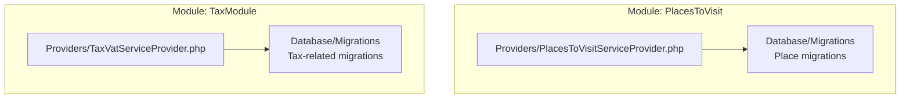
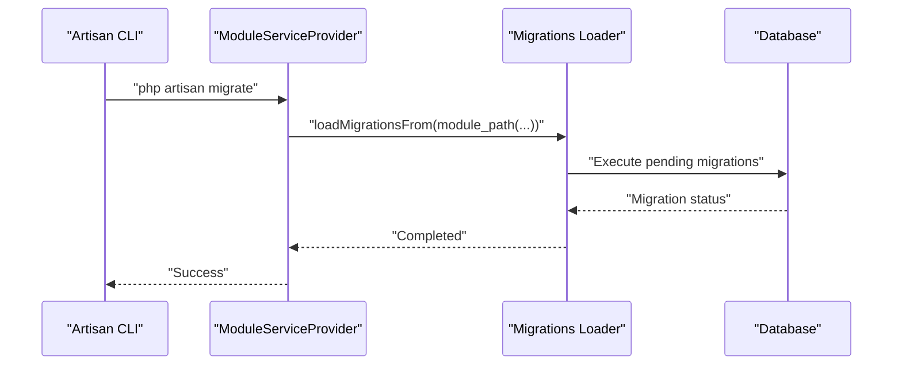
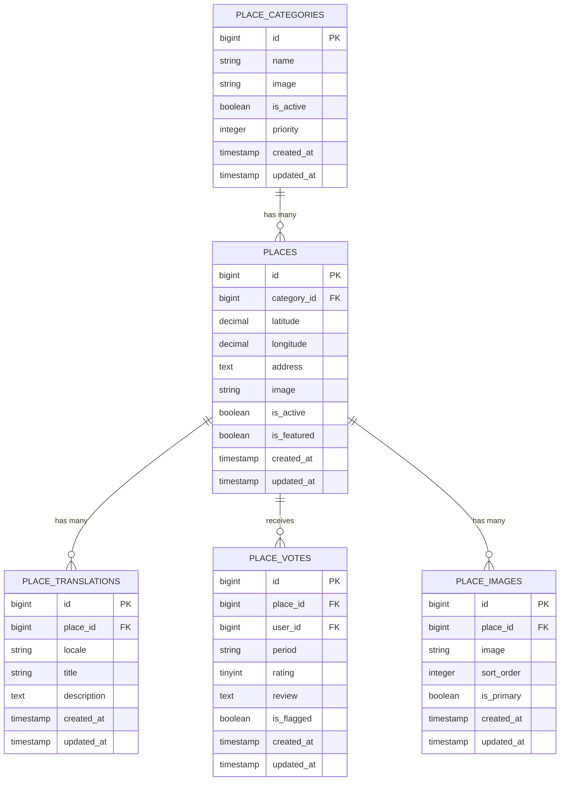
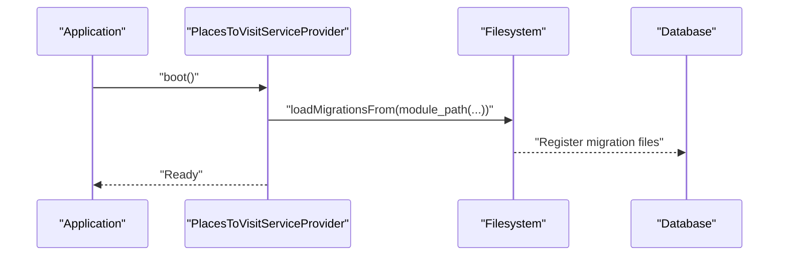
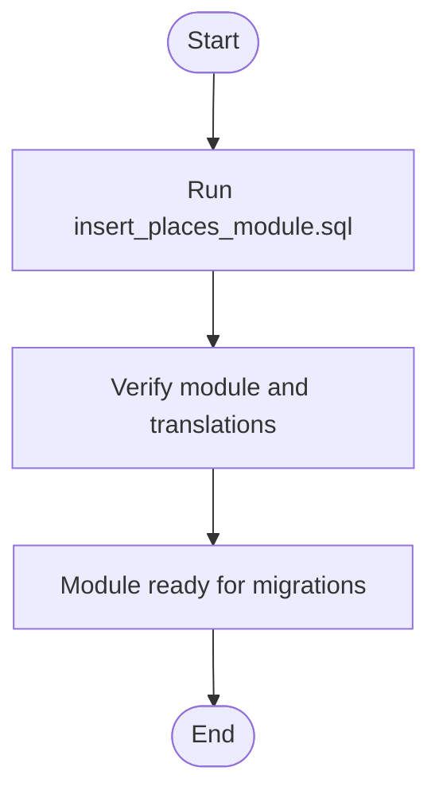
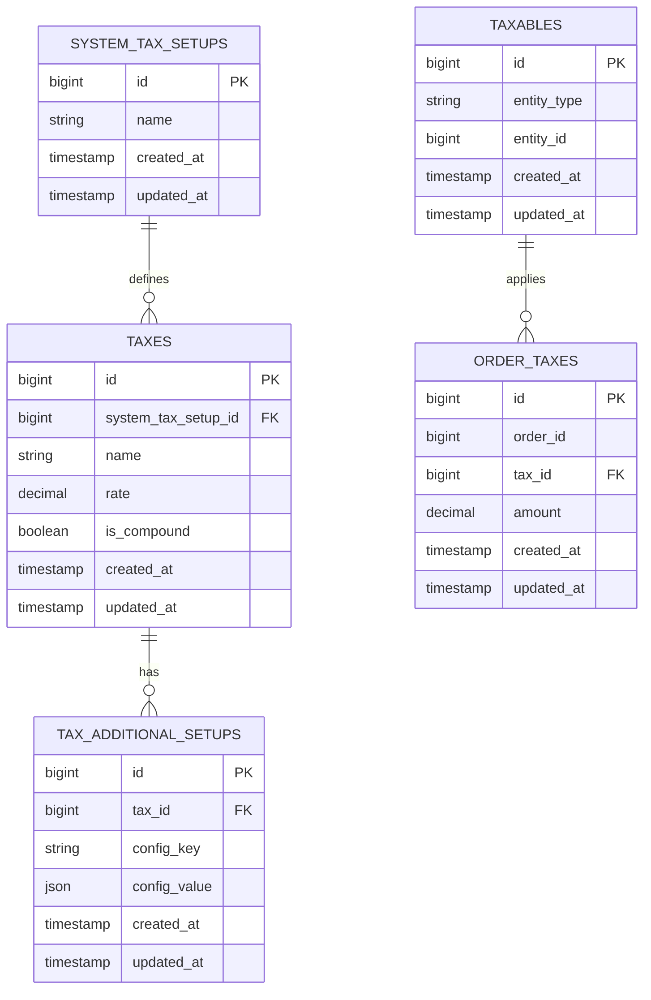
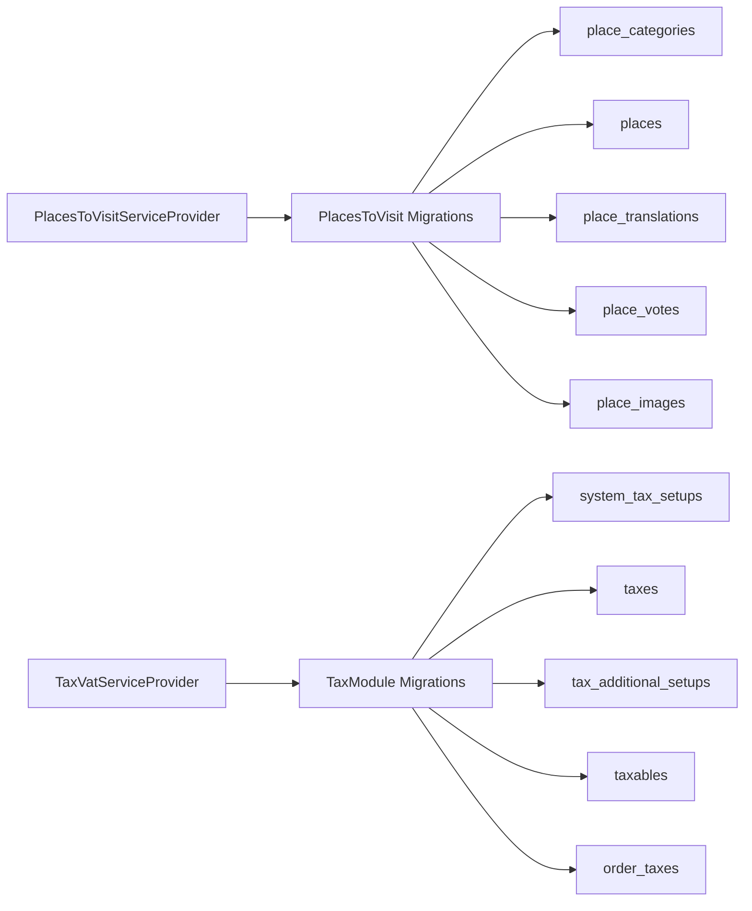

# Database Migrations and Seeders

<cite>
**Referenced Files in This Document**
- [module.json](file://Modules/PlacesToVisit/module.json)
- [PlacesToVisitServiceProvider.php](file://Modules/PlacesToVisit/Providers/PlacesToVisitServiceProvider.php)
- [2026_01_04_000001_create_place_categories_table.php](file://Modules/PlacesToVisit/Database/Migrations/2026_01_04_000001_create_place_categories_table.php)
- [2026_01_04_000002_create_places_table.php](file://Modules/PlacesToVisit/Database/Migrations/2026_01_04_000002_create_places_table.php)
- [2026_01_04_000003_create_place_translations_table.php](file://Modules/PlacesToVisit/Database/Migrations/2026_01_04_000003_create_place_translations_table.php)
- [2026_01_04_000004_create_place_votes_table.php](file://Modules/PlacesToVisit/Database/Migrations/2026_01_04_000004_create_place_votes_table.php)
- [2026_02_10_000001_add_details_to_places_table.php](file://Modules/PlacesToVisit/Database/Migrations/2026_02_10_000001_add_details_to_places_table.php)
- [2026_02_10_000002_create_place_images_table.php](file://Modules/PlacesToVisit/Database/Migrations/2026_02_10_000002_create_place_images_table.php)
- [insert_places_module.sql](file://Modules/PlacesToVisit/Database/insert_places_module.sql)
- [module.json](file://Modules/TaxModule/module.json)
- [TaxVatServiceProvider.php](file://Modules/TaxModule/Providers/TaxVatServiceProvider.php)
- [2025_05_26_115043_create_system_tax_setups_table.php](file://Modules/TaxModule/Database/Migrations/2025_05_26_115043_create_system_tax_setups_table.php)
- [2025_05_26_115643_create_taxes_table.php](file://Modules/TaxModule/Database/Migrations/2025_05_26_115643_create_taxes_table.php)
- [2025_05_26_120030_create_tax_additional_setups_table.php](file://Modules/TaxModule/Database/Migrations/2025_05_26_120030_create_tax_additional_setups_table.php)
- [2025_05_26_120912_create_taxables_table.php](file://Modules/TaxModule/Database/Migrations/2025_05_26_120912_create_taxables_table.php)
- [2025_05_26_121656_create_order_taxes_table.php](file://Modules/TaxModule/Database/Migrations/2025_05_26_121656_create_order_taxes_table.php)
</cite>

## Table of Contents
1. [Introduction](#introduction)
2. [Project Structure](#project-structure)
3. [Core Components](#core-components)
4. [Architecture Overview](#architecture-overview)
5. [Detailed Component Analysis](#detailed-component-analysis)
6. [Dependency Analysis](#dependency-analysis)
7. [Performance Considerations](#performance-considerations)
8. [Troubleshooting Guide](#troubleshooting-guide)
9. [Conclusion](#conclusion)

## Introduction
This document explains how modules manage their own database schema using Laravel migrations and seeders. It focuses on the module pattern used in this repository, detailing:
- How modules load their migrations automatically via service providers
- Migration naming conventions and dependency ordering
- Rollback strategies and best practices
- Seeder patterns for initial data and testing
- Practical examples of related tables, foreign keys, and indexing
- Migration publishing, versioning, and database compatibility considerations

## Project Structure
Modules are organized under the Modules directory, with each module containing its own Database/Migrations and Database/Seeders directories. Providers inside each module register and load migrations from their respective paths.

**Diagram sources**
- [PlacesToVisitServiceProvider.php:15-21](file://Modules/PlacesToVisit/Providers/PlacesToVisitServiceProvider.php#L15-L21)
- [TaxVatServiceProvider.php:25-31](file://Modules/TaxModule/Providers/TaxVatServiceProvider.php#L25-L31)

**Section sources**
- [module.json:1-17](file://Modules/PlacesToVisit/module.json#L1-L17)
- [module.json:1-14](file://Modules/TaxModule/module.json#L1-L14)
- [PlacesToVisitServiceProvider.php:15-21](file://Modules/PlacesToVisit/Providers/PlacesToVisitServiceProvider.php#L15-L21)
- [TaxVatServiceProvider.php:25-31](file://Modules/TaxModule/Providers/TaxVatServiceProvider.php#L25-L31)

## Core Components
- Module migrations: Stored under Modules/<ModuleName>/Database/Migrations and loaded automatically by the module’s service provider.
- Migration loading: Providers call loadMigrationsFrom with a path pointing to the module’s Migrations directory.
- Seeder support: Modules can include Database/Seeders with seeders that are invoked via Laravel’s db:seed command or custom commands.

Key implementation highlights:
- Automatic loading of migrations from module path
- Clear separation of concerns: migrations define schema, seeders populate data
- SQL-based module registration example included for quick onboarding

**Section sources**
- [PlacesToVisitServiceProvider.php:15-21](file://Modules/PlacesToVisit/Providers/PlacesToVisitServiceProvider.php#L15-L21)
- [TaxVatServiceProvider.php:25-31](file://Modules/TaxModule/Providers/TaxVatServiceProvider.php#L25-L31)
- [insert_places_module.sql:1-25](file://Modules/PlacesToVisit/Database/insert_places_module.sql#L1-L25)

## Architecture Overview
The module system relies on service providers to register and load migrations. Each module’s provider invokes loadMigrationsFrom with a path to its Migrations directory. This ensures migrations are discovered and executed during artisan commands such as migrate and migrate:fresh.

**Diagram sources**
- [PlacesToVisitServiceProvider.php:15-21](file://Modules/PlacesToVisit/Providers/PlacesToVisitServiceProvider.php#L15-L21)
- [TaxVatServiceProvider.php:25-31](file://Modules/TaxModule/Providers/TaxVatServiceProvider.php#L25-L31)

## Detailed Component Analysis

### PlacesToVisit Module: Migrations and Schema Design
The PlacesToVisit module defines a set of migrations that establish categories, places, translations, votes, images, favorites, submissions, tags, and reports. These migrations demonstrate:
- Foreign key relationships with cascade-on-delete
- Composite unique constraints for user-place-period combinations
- JSON fields for flexible data
- Indexing for performance-sensitive queries
- Column additions via subsequent migrations

Representative migration examples:
- Category table creation with metadata and timestamps
- Place table with category relationship and geographic coordinates
- Place translation table with locale-scoped uniqueness
- Vote table with composite unique constraint and moderation flag
- Image table with sort order and primary image flag
- Details addition to places (phone, website, social links, opening hours)

Rollback strategy:
- Each migration includes a down method to drop tables or remove columns, preserving referential integrity during rollbacks.

**Diagram sources**
- [2026_01_04_000001_create_place_categories_table.php:11-18](file://Modules/PlacesToVisit/Database/Migrations/2026_01_04_000001_create_place_categories_table.php#L11-L18)
- [2026_01_04_000002_create_places_table.php:11-21](file://Modules/PlacesToVisit/Database/Migrations/2026_01_04_000002_create_places_table.php#L11-L21)
- [2026_01_04_000003_create_place_translations_table.php:11-18](file://Modules/PlacesToVisit/Database/Migrations/2026_01_04_000003_create_place_translations_table.php#L11-L18)
- [2026_01_04_000004_create_place_votes_table.php:11-23](file://Modules/PlacesToVisit/Database/Migrations/2026_01_04_000004_create_place_votes_table.php#L11-L23)
- [2026_02_10_000002_create_place_images_table.php:11-20](file://Modules/PlacesToVisit/Database/Migrations/2026_02_10_000002_create_place_images_table.php#L11-L20)

**Section sources**
- [2026_01_04_000001_create_place_categories_table.php:1-26](file://Modules/PlacesToVisit/Database/Migrations/2026_01_04_000001_create_place_categories_table.php#L1-L26)
- [2026_01_04_000002_create_places_table.php:1-29](file://Modules/PlacesToVisit/Database/Migrations/2026_01_04_000002_create_places_table.php#L1-L29)
- [2026_01_04_000003_create_place_translations_table.php:1-26](file://Modules/PlacesToVisit/Database/Migrations/2026_01_04_000003_create_place_translations_table.php#L1-L26)
- [2026_01_04_000004_create_place_votes_table.php:1-31](file://Modules/PlacesToVisit/Database/Migrations/2026_01_04_000004_create_place_votes_table.php#L1-L31)
- [2026_02_10_000001_add_details_to_places_table.php:1-26](file://Modules/PlacesToVisit/Database/Migrations/2026_02_10_000001_add_details_to_places_table.php#L1-L26)
- [2026_02_10_000002_create_place_images_table.php:1-28](file://Modules/PlacesToVisit/Database/Migrations/2026_02_10_000002_create_place_images_table.php#L1-L28)

### PlacesToVisit Module: Migration Loading and Publishing
- Migration loading: The PlacesToVisitServiceProvider loads migrations from the module’s Migrations directory during boot.
- Publishing: The provider publishes and merges module configuration, enabling module-specific settings to be available at runtime.

**Diagram sources**
- [PlacesToVisitServiceProvider.php:15-21](file://Modules/PlacesToVisit/Providers/PlacesToVisitServiceProvider.php#L15-L21)

**Section sources**
- [PlacesToVisitServiceProvider.php:15-21](file://Modules/PlacesToVisit/Providers/PlacesToVisitServiceProvider.php#L15-L21)

### PlacesToVisit Module: Initial Data and Testing
- SQL-based module registration: The module includes a SQL script to insert the module record and translations into the global translations table. This supports quick setup in environments where direct SQL execution is preferred.
- Seeder availability: The module’s Database/Seeders directory exists and can be used to seed related data for testing and development.

**Diagram sources**
- [insert_places_module.sql:1-25](file://Modules/PlacesToVisit/Database/insert_places_module.sql#L1-L25)

**Section sources**
- [insert_places_module.sql:1-25](file://Modules/PlacesToVisit/Database/insert_places_module.sql#L1-L25)

### TaxModule: Migrations and Schema Design
The TaxModule defines migrations for system tax setups, taxes, additional tax configurations, taxables, and order taxes. These migrations illustrate:
- Normalized tax configuration tables
- Relationship tables linking orders to taxes
- Scalable tax setup patterns

Representative migration examples:
- System tax setups table
- Taxes table
- Additional tax setups table
- Taxables table
- Order taxes table

**Diagram sources**
- [2025_05_26_115043_create_system_tax_setups_table.php](file://Modules/TaxModule/Database/Migrations/2025_05_26_115043_create_system_tax_setups_table.php)
- [2025_05_26_115643_create_taxes_table.php](file://Modules/TaxModule/Database/Migrations/2025_05_26_115643_create_taxes_table.php)
- [2025_05_26_120030_create_tax_additional_setups_table.php](file://Modules/TaxModule/Database/Migrations/2025_05_26_120030_create_tax_additional_setups_table.php)
- [2025_05_26_120912_create_taxables_table.php](file://Modules/TaxModule/Database/Migrations/2025_05_26_120912_create_taxables_table.php)
- [2025_05_26_121656_create_order_taxes_table.php](file://Modules/TaxModule/Database/Migrations/2025_05_26_121656_create_order_taxes_table.php)

**Section sources**
- [TaxVatServiceProvider.php:25-31](file://Modules/TaxModule/Providers/TaxVatServiceProvider.php#L25-L31)
- [2025_05_26_115043_create_system_tax_setups_table.php](file://Modules/TaxModule/Database/Migrations/2025_05_26_115043_create_system_tax_setups_table.php)
- [2025_05_26_115643_create_taxes_table.php](file://Modules/TaxModule/Database/Migrations/2025_05_26_115643_create_taxes_table.php)
- [2025_05_26_120030_create_tax_additional_setups_table.php](file://Modules/TaxModule/Database/Migrations/2025_05_26_120030_create_tax_additional_setups_table.php)
- [2025_05_26_120912_create_taxables_table.php](file://Modules/TaxModule/Database/Migrations/2025_05_26_120912_create_taxables_table.php)
- [2025_05_26_121656_create_order_taxes_table.php](file://Modules/TaxModule/Database/Migrations/2025_05_26_121656_create_order_taxes_table.php)

### Migration Naming Conventions and Dependency Management
- Timestamp-based filenames: Both modules use timestamp prefixes followed by a sequence number to ensure deterministic ordering.
- Logical grouping: Related migrations are grouped under the same timestamp prefix to reflect a cohesive change set.
- Downstream dependencies: Foreign keys enforce dependency ordering; earlier migrations must create referenced tables before later ones add foreign keys.

Examples:
- PlacesToVisit migrations consistently use a base timestamp with incremental suffixes.
- TaxModule migrations use a separate base timestamp, ensuring isolation from other modules’ migrations.

**Section sources**
- [2026_01_04_000001_create_place_categories_table.php:1-26](file://Modules/PlacesToVisit/Database/Migrations/2026_01_04_000001_create_place_categories_table.php#L1-L26)
- [2026_01_04_000002_create_places_table.php:1-29](file://Modules/PlacesToVisit/Database/Migrations/2026_01_04_000002_create_places_table.php#L1-L29)
- [2026_01_04_000003_create_place_translations_table.php:1-26](file://Modules/PlacesToVisit/Database/Migrations/2026_01_04_000003_create_place_translations_table.php#L1-L26)
- [2026_01_04_000004_create_place_votes_table.php:1-31](file://Modules/PlacesToVisit/Database/Migrations/2026_01_04_000004_create_place_votes_table.php#L1-L31)
- [2026_02_10_000001_add_details_to_places_table.php:1-26](file://Modules/PlacesToVisit/Database/Migrations/2026_02_10_000001_add_details_to_places_table.php#L1-L26)
- [2026_02_10_000002_create_place_images_table.php:1-28](file://Modules/PlacesToVisit/Database/Migrations/2026_02_10_000002_create_place_images_table.php#L1-L28)
- [2025_05_26_115043_create_system_tax_setups_table.php](file://Modules/TaxModule/Database/Migrations/2025_05_26_115043_create_system_tax_setups_table.php)
- [2025_05_26_115643_create_taxes_table.php](file://Modules/TaxModule/Database/Migrations/2025_05_26_115643_create_taxes_table.php)
- [2025_05_26_120030_create_tax_additional_setups_table.php](file://Modules/TaxModule/Database/Migrations/2025_05_26_120030_create_tax_additional_setups_table.php)
- [2025_05_26_120912_create_taxables_table.php](file://Modules/TaxModule/Database/Migrations/2025_05_26_120912_create_taxables_table.php)
- [2025_05_26_121656_create_order_taxes_table.php](file://Modules/TaxModule/Database/Migrations/2025_05_26_121656_create_order_taxes_table.php)

### Rollback Strategies
- Each migration includes a down method to reverse schema changes safely.
- Cascade-on-delete constraints simplify cleanup when dropping parent tables.
- Column removal migrations revert schema changes introduced by later migrations.

Examples:
- Dropping tables or removing columns in down methods preserves clean rollback states.
- Unique constraints and indexes are dropped alongside their parent tables or removed via column drops.

**Section sources**
- [2026_01_04_000001_create_place_categories_table.php:21-24](file://Modules/PlacesToVisit/Database/Migrations/2026_01_04_000001_create_place_categories_table.php#L21-L24)
- [2026_01_04_000002_create_places_table.php:24-27](file://Modules/PlacesToVisit/Database/Migrations/2026_01_04_000002_create_places_table.php#L24-L27)
- [2026_01_04_000003_create_place_translations_table.php:21-24](file://Modules/PlacesToVisit/Database/Migrations/2026_01_04_000003_create_place_translations_table.php#L21-L24)
- [2026_01_04_000004_create_place_votes_table.php:26-29](file://Modules/PlacesToVisit/Database/Migrations/2026_01_04_000004_create_place_votes_table.php#L26-L29)
- [2026_02_10_000001_add_details_to_places_table.php:19-24](file://Modules/PlacesToVisit/Database/Migrations/2026_02_10_000001_add_details_to_places_table.php#L19-L24)
- [2026_02_10_000002_create_place_images_table.php:23-26](file://Modules/PlacesToVisit/Database/Migrations/2026_02_10_000002_create_place_images_table.php#L23-L26)

### Seeder Implementation for Initial Data and Testing
- Seeder directory presence: The PlacesToVisit module includes a Database/Seeders directory, indicating support for seeding.
- Typical usage: Seeders can be invoked via Laravel’s db:seed command or custom commands to populate initial data for testing and development.
- Integration: Seeders complement migrations by providing realistic test fixtures and module-specific data.

Note: The exact seeder files are not included in this repository snapshot; however, their presence confirms the module’s readiness for seeding workflows.

**Section sources**
- [PlacesToVisitServiceProvider.php:15-21](file://Modules/PlacesToVisit/Providers/PlacesToVisitServiceProvider.php#L15-L21)

## Dependency Analysis
- Module-to-provider dependency: Each module’s service provider is responsible for loading its migrations.
- Migration-to-table dependency: Later migrations depend on earlier migrations having created referenced tables.
- Foreign key constraints: Enforce referential integrity across related tables.

**Diagram sources**
- [PlacesToVisitServiceProvider.php:15-21](file://Modules/PlacesToVisit/Providers/PlacesToVisitServiceProvider.php#L15-L21)
- [TaxVatServiceProvider.php:25-31](file://Modules/TaxModule/Providers/TaxVatServiceProvider.php#L25-L31)
- [2026_01_04_000001_create_place_categories_table.php:11-18](file://Modules/PlacesToVisit/Database/Migrations/2026_01_04_000001_create_place_categories_table.php#L11-L18)
- [2026_01_04_000002_create_places_table.php:11-21](file://Modules/PlacesToVisit/Database/Migrations/2026_01_04_000002_create_places_table.php#L11-L21)
- [2026_01_04_000003_create_place_translations_table.php:11-18](file://Modules/PlacesToVisit/Database/Migrations/2026_01_04_000003_create_place_translations_table.php#L11-L18)
- [2026_01_04_000004_create_place_votes_table.php:11-23](file://Modules/PlacesToVisit/Database/Migrations/2026_01_04_000004_create_place_votes_table.php#L11-L23)
- [2026_02_10_000002_create_place_images_table.php:11-20](file://Modules/PlacesToVisit/Database/Migrations/2026_02_10_000002_create_place_images_table.php#L11-L20)
- [2025_05_26_115043_create_system_tax_setups_table.php](file://Modules/TaxModule/Database/Migrations/2025_05_26_115043_create_system_tax_setups_table.php)
- [2025_05_26_115643_create_taxes_table.php](file://Modules/TaxModule/Database/Migrations/2025_05_26_115643_create_taxes_table.php)
- [2025_05_26_120030_create_tax_additional_setups_table.php](file://Modules/TaxModule/Database/Migrations/2025_05_26_120030_create_tax_additional_setups_table.php)
- [2025_05_26_120912_create_taxables_table.php](file://Modules/TaxModule/Database/Migrations/2025_05_26_120912_create_taxables_table.php)
- [2025_05_26_121656_create_order_taxes_table.php](file://Modules/TaxModule/Database/Migrations/2025_05_26_121656_create_order_taxes_table.php)

**Section sources**
- [PlacesToVisitServiceProvider.php:15-21](file://Modules/PlacesToVisit/Providers/PlacesToVisitServiceProvider.php#L15-L21)
- [TaxVatServiceProvider.php:25-31](file://Modules/TaxModule/Providers/TaxVatServiceProvider.php#L25-L31)

## Performance Considerations
- Indexing: Place images table includes a composite index on place_id and sort_order to optimize retrieval and ordering.
- JSON fields: Flexible fields like opening_hours enable dynamic scheduling while keeping schema simple.
- Cascade deletes: Simplify cleanup but may impact performance on large datasets; use judiciously.
- Migration ordering: Consistent timestamp-based naming prevents conflicts and ensures predictable execution order.

**Section sources**
- [2026_02_10_000002_create_place_images_table.php:19-20](file://Modules/PlacesToVisit/Database/Migrations/2026_02_10_000002_create_place_images_table.php#L19-L20)

## Troubleshooting Guide
- Migrations not found: Ensure the service provider calls loadMigrationsFrom with the correct module path.
- Foreign key errors: Confirm that referenced tables are migrated before dependent tables.
- Rollback issues: Verify that down methods exist and remove indexes and unique constraints before dropping tables.
- Module registration: Use the provided SQL script to quickly insert module records and translations when needed.

**Section sources**
- [PlacesToVisitServiceProvider.php:15-21](file://Modules/PlacesToVisit/Providers/PlacesToVisitServiceProvider.php#L15-L21)
- [TaxVatServiceProvider.php:25-31](file://Modules/TaxModule/Providers/TaxVatServiceProvider.php#L25-L31)
- [insert_places_module.sql:1-25](file://Modules/PlacesToVisit/Database/insert_places_module.sql#L1-L25)

## Conclusion
Modules in this repository encapsulate their database schema through dedicated migration sets and automatic loading via service providers. The PlacesToVisit and TaxModule demonstrate robust patterns for relational schema design, foreign key relationships, and index strategies. Migration naming conventions and dependency ordering ensure reliable upgrades and rollbacks. Seeders and SQL scripts support efficient initial data setup and testing workflows.