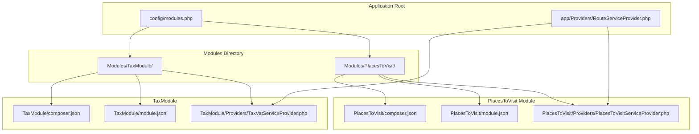
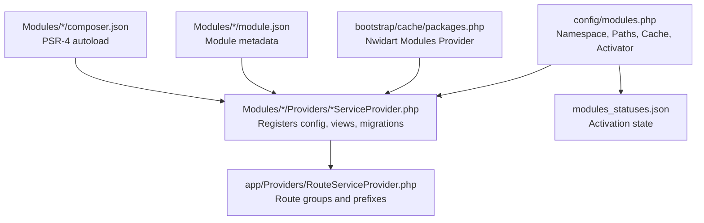
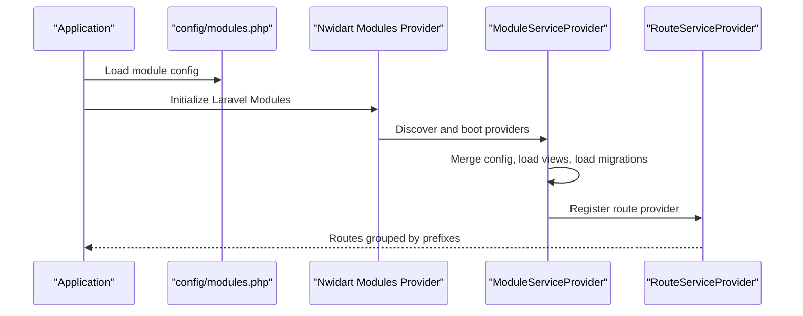
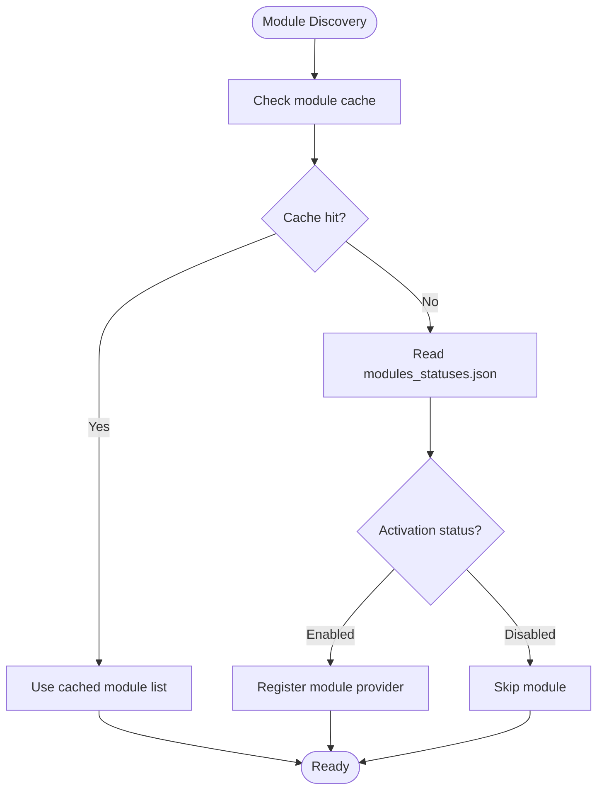
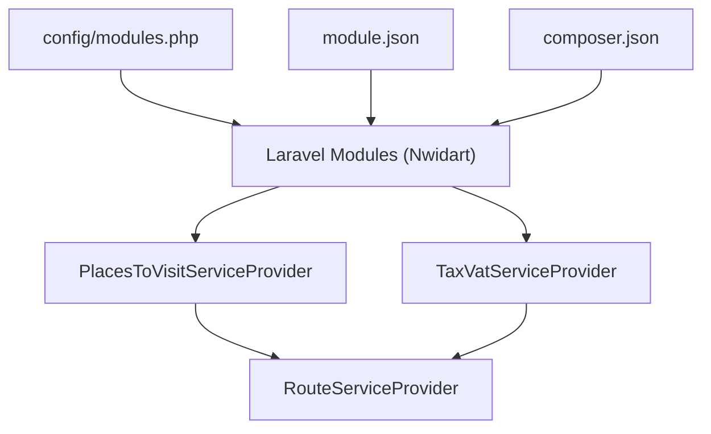

# Module Architecture Overview

<cite>
**Referenced Files in This Document**
- [modules.php](file://config/modules.php)
- [packages.php](file://bootstrap/cache/packages.php)
- [services.php](file://bootstrap/cache/services.php)
- [module.json (PlacesToVisit)](file://Modules/PlacesToVisit/module.json)
- [module.json (TaxModule)](file://Modules/TaxModule/module.json)
- [composer.json (PlacesToVisit)](file://Modules/PlacesToVisit/composer.json)
- [composer.json (TaxModule)](file://Modules/TaxModule/composer.json)
- [PlacesToVisitServiceProvider.php](file://Modules/PlacesToVisit/Providers/PlacesToVisitServiceProvider.php)
- [TaxVatServiceProvider.php](file://Modules/TaxModule/Providers/TaxVatServiceProvider.php)
- [RouteServiceProvider.php](file://app/Providers/RouteServiceProvider.php)
- [Module.php](file://app/Models/Module.php)
- [ModuleService.php](file://app/Services/ModuleService.php)
</cite>

## Table of Contents
1. [Introduction](#introduction)
2. [Project Structure](#project-structure)
3. [Core Components](#core-components)
4. [Architecture Overview](#architecture-overview)
5. [Detailed Component Analysis](#detailed-component-analysis)
6. [Dependency Analysis](#dependency-analysis)
7. [Performance Considerations](#performance-considerations)
8. [Troubleshooting Guide](#troubleshooting-guide)
9. [Conclusion](#conclusion)

## Introduction
This document explains the module architecture design used by Waddy Back. It focuses on the pluggable module system that isolates business functionality, promotes reusability, and integrates seamlessly with Laravel via the Nwidart Laravel Modules package. The documentation covers module namespace configuration, directory conventions, registration and activation mechanisms, scanning and caching strategies, and the lifecycle of modules from discovery to runtime. It also highlights the benefits of modular architecture for maintainability, scalability, and feature isolation.

## Project Structure
Waddy Back organizes modules under the Modules directory, with each module containing its own namespace, configuration, providers, routes, views, migrations, and services. The Laravel Modules package configuration defines the module namespace, scanning paths, generator templates, and activation strategy.

**Diagram sources**
- [modules.php:63-132](file://config/modules.php#L63-L132)
- [module.json (PlacesToVisit):1-17](file://Modules/PlacesToVisit/module.json#L1-L17)
- [module.json (TaxModule):1-14](file://Modules/TaxModule/module.json#L1-L14)
- [composer.json (PlacesToVisit):1-16](file://Modules/PlacesToVisit/composer.json#L1-L16)
- [composer.json (TaxModule):1-24](file://Modules/TaxModule/composer.json#L1-L24)
- [PlacesToVisitServiceProvider.php:1-88](file://Modules/PlacesToVisit/Providers/PlacesToVisitServiceProvider.php#L1-L88)
- [TaxVatServiceProvider.php:1-113](file://Modules/TaxModule/Providers/TaxVatServiceProvider.php#L1-L113)
- [RouteServiceProvider.php:46-83](file://app/Providers/RouteServiceProvider.php#L46-L83)

**Section sources**
- [modules.php:63-132](file://config/modules.php#L63-L132)
- [module.json (PlacesToVisit):1-17](file://Modules/PlacesToVisit/module.json#L1-L17)
- [module.json (TaxModule):1-14](file://Modules/TaxModule/module.json#L1-L14)
- [composer.json (PlacesToVisit):1-16](file://Modules/PlacesToVisit/composer.json#L1-L16)
- [composer.json (TaxModule):1-24](file://Modules/TaxModule/composer.json#L1-L24)
- [RouteServiceProvider.php:46-83](file://app/Providers/RouteServiceProvider.php#L46-L83)

## Core Components
- Module configuration and activation
  - The module system is configured via config/modules.php, which sets the module namespace, generator paths, scanning behavior, caching, and activator type.
  - The activator type is file-based and persists activation status to modules_statuses.json, enabling selective module activation per deployment.
- Module metadata and autoloading
  - Each module declares its metadata and PSR-4 autoload mapping in module.json and composer.json respectively, ensuring proper discovery and autoloading.
- Module service providers
  - Each module registers a dedicated service provider that merges configuration, publishes and loads views, loads migrations, and binds services into the container.
- Application routing integration
  - The application’s RouteServiceProvider groups routes under multiple prefixes and delegates module-specific routing to module providers.

**Section sources**
- [modules.php:17](file://config/modules.php#L17)
- [modules.php:234-277](file://config/modules.php#L234-L277)
- [module.json (PlacesToVisit):1-17](file://Modules/PlacesToVisit/module.json#L1-L17)
- [module.json (TaxModule):1-14](file://Modules/TaxModule/module.json#L1-L14)
- [composer.json (PlacesToVisit):11-16](file://Modules/PlacesToVisit/composer.json#L11-L16)
- [composer.json (TaxModule):18-23](file://Modules/TaxModule/composer.json#L18-L23)
- [PlacesToVisitServiceProvider.php:15-31](file://Modules/PlacesToVisit/Providers/PlacesToVisitServiceProvider.php#L15-L31)
- [TaxVatServiceProvider.php:25-41](file://Modules/TaxModule/Providers/TaxVatServiceProvider.php#L25-L41)
- [RouteServiceProvider.php:50-82](file://app/Providers/RouteServiceProvider.php#L50-L82)

## Architecture Overview
The module architecture leverages Laravel Modules to discover modules under the Modules directory, load their providers, and integrate their configuration, views, and migrations. Activation is controlled by a file-based activator that reads and writes activation status to modules_statuses.json. The RouteServiceProvider centralizes route loading across the application and defers module route loading to module providers.

**Diagram sources**
- [modules.php:63-132](file://config/modules.php#L63-L132)
- [packages.php:117-127](file://bootstrap/cache/packages.php#L117-L127)
- [module.json (PlacesToVisit):1-17](file://Modules/PlacesToVisit/module.json#L1-L17)
- [module.json (TaxModule):1-14](file://Modules/TaxModule/module.json#L1-L14)
- [composer.json (PlacesToVisit):11-16](file://Modules/PlacesToVisit/composer.json#L11-L16)
- [composer.json (TaxModule):18-23](file://Modules/TaxModule/composer.json#L18-L23)
- [PlacesToVisitServiceProvider.php:15-31](file://Modules/PlacesToVisit/Providers/PlacesToVisitServiceProvider.php#L15-L31)
- [TaxVatServiceProvider.php:25-41](file://Modules/TaxModule/Providers/TaxVatServiceProvider.php#L25-L41)
- [RouteServiceProvider.php:50-82](file://app/Providers/RouteServiceProvider.php#L50-L82)

## Detailed Component Analysis

### Module Namespace and Directory Conventions
- Namespace
  - Modules share a common namespace prefix defined in config/modules.php, ensuring consistent class resolution.
- Directory layout
  - Modules follow a standardized structure with Config, Database/Migrations, Entities, Http/Controllers, Providers, Resources, Routes, Services, and other optional folders. Generator paths in config/modules.php define where scaffolding creates these folders.
- Autoloading
  - Each module’s composer.json defines PSR-4 autoloading for its namespace, enabling direct class usage without manual loading.

**Section sources**
- [modules.php:17](file://config/modules.php#L17)
- [modules.php:103-131](file://config/modules.php#L103-L131)
- [composer.json (PlacesToVisit):11-16](file://Modules/PlacesToVisit/composer.json#L11-L16)
- [composer.json (TaxModule):18-23](file://Modules/TaxModule/composer.json#L18-L23)

### Module Registration and Provider Lifecycle
- Provider registration
  - Module providers are declared in module.json and loaded by the Laravel Modules package. They merge module configuration, publish and load views, and load migrations from the module’s Database/Migrations directory.
- Container bindings
  - Providers bind singleton services into the container, exposing domain services to the application.
- Route delegation
  - Providers can register their own RouteServiceProvider to attach module-specific routes.

**Diagram sources**
- [modules.php:63-132](file://config/modules.php#L63-L132)
- [packages.php:117-127](file://bootstrap/cache/packages.php#L117-L127)
- [PlacesToVisitServiceProvider.php:15-31](file://Modules/PlacesToVisit/Providers/PlacesToVisitServiceProvider.php#L15-L31)
- [TaxVatServiceProvider.php:25-41](file://Modules/TaxModule/Providers/TaxVatServiceProvider.php#L25-L41)
- [RouteServiceProvider.php:50-82](file://app/Providers/RouteServiceProvider.php#L50-L82)

**Section sources**
- [module.json (PlacesToVisit):11-13](file://Modules/PlacesToVisit/module.json#L11-L13)
- [module.json (TaxModule):7-9](file://Modules/TaxModule/module.json#L7-L9)
- [PlacesToVisitServiceProvider.php:15-31](file://Modules/PlacesToVisit/Providers/PlacesToVisitServiceProvider.php#L15-L31)
- [TaxVatServiceProvider.php:25-41](file://Modules/TaxModule/Providers/TaxVatServiceProvider.php#L25-L41)
- [RouteServiceProvider.php:50-82](file://app/Providers/RouteServiceProvider.php#L50-L82)

### Module Scanning Mechanism
- Scanning configuration
  - config/modules.php includes a scan block that controls whether vendor packages are scanned for modules. In this project, scanning is disabled by default.
- Implications
  - Modules are discovered from the configured modules path (Modules directory) rather than vendor packages, simplifying control over module discovery.

**Section sources**
- [modules.php:202-207](file://config/modules.php#L202-L207)

### Caching Strategies
- Cache configuration
  - config/modules.php defines cache settings for modules, including enabling/disabling cache, cache key, and lifetime. In this project, caching is disabled.
- Impact
  - With caching disabled, module metadata and activation status are evaluated on each request, which simplifies development but may reduce performance in production environments.

**Section sources**
- [modules.php:234-238](file://config/modules.php#L234-L238)

### Activation and Deactivation Process
- Activator type
  - The activator is configured as file-based, storing activation state in modules_statuses.json.
- Activation state persistence
  - The activator uses a statuses file and a cache key with a long lifetime, indicating that activation state is persisted and cached for performance.
- Management
  - Activation/deactivation can be performed via Laravel Modules commands (e.g., enable/disable) or by editing modules_statuses.json directly.

**Diagram sources**
- [modules.php:234-277](file://config/modules.php#L234-L277)

**Section sources**
- [modules.php:267-277](file://config/modules.php#L267-L277)

### Module Metadata and Autoloading
- Metadata
  - Each module’s module.json declares the module name, alias, description, providers, and other metadata. Providers are referenced here to ensure they are booted during application initialization.
- Autoloading
  - composer.json defines PSR-4 autoload entries for the module namespace, allowing classes to be resolved automatically.

**Section sources**
- [module.json (PlacesToVisit):1-17](file://Modules/PlacesToVisit/module.json#L1-L17)
- [module.json (TaxModule):1-14](file://Modules/TaxModule/module.json#L1-L14)
- [composer.json (PlacesToVisit):11-16](file://Modules/PlacesToVisit/composer.json#L11-L16)
- [composer.json (TaxModule):18-23](file://Modules/TaxModule/composer.json#L18-L23)

### Module Service Providers
- Responsibilities
  - Providers register configuration, load views, publish assets, and load migrations. They also bind services into the container for domain logic.
- Examples
  - PlacesToVisitServiceProvider and TaxVatServiceProvider demonstrate these responsibilities, including merging config and loading migrations from module_path.

**Section sources**
- [PlacesToVisitServiceProvider.php:15-31](file://Modules/PlacesToVisit/Providers/PlacesToVisitServiceProvider.php#L15-L31)
- [TaxVatServiceProvider.php:25-41](file://Modules/TaxModule/Providers/TaxVatServiceProvider.php#L25-L41)

### Application Routing Integration
- Route groups
  - RouteServiceProvider groups routes under multiple prefixes (web, admin, vendor-panel, api/v1, api/v2) and delegates module-specific routing to module providers.
- Module route loading
  - Module providers can register their own RouteServiceProvider to attach module routes, keeping routing logic encapsulated within modules.

**Section sources**
- [RouteServiceProvider.php:50-82](file://app/Providers/RouteServiceProvider.php#L50-L82)
- [PlacesToVisitServiceProvider.php:25](file://Modules/PlacesToVisit/Providers/PlacesToVisitServiceProvider.php#L25)
- [TaxVatServiceProvider.php:40](file://Modules/TaxModule/Providers/TaxVatServiceProvider.php#L40)

### Domain Model and Service Integration
- Domain model
  - The Module model encapsulates module metadata, relationships, and global scopes for translations and storage attachments.
- Service integration
  - ModuleService handles upload and formatting logic for module-related data, supporting admin operations for module creation and updates.

**Section sources**
- [Module.php:32-240](file://app/Models/Module.php#L32-L240)
- [ModuleService.php:11-51](file://app/Services/ModuleService.php#L11-L51)

## Dependency Analysis
The module system depends on the Laravel Modules package for discovery and provider bootstrapping, and on the application’s service provider boot process for route grouping. Providers depend on module metadata and composer autoload configuration.

**Diagram sources**
- [packages.php:117-127](file://bootstrap/cache/packages.php#L117-L127)
- [modules.php:63-132](file://config/modules.php#L63-L132)
- [module.json (PlacesToVisit):1-17](file://Modules/PlacesToVisit/module.json#L1-L17)
- [module.json (TaxModule):1-14](file://Modules/TaxModule/module.json#L1-L14)
- [composer.json (PlacesToVisit):11-16](file://Modules/PlacesToVisit/composer.json#L11-L16)
- [composer.json (TaxModule):18-23](file://Modules/TaxModule/composer.json#L18-L23)
- [PlacesToVisitServiceProvider.php:15-31](file://Modules/PlacesToVisit/Providers/PlacesToVisitServiceProvider.php#L15-L31)
- [TaxVatServiceProvider.php:25-41](file://Modules/TaxModule/Providers/TaxVatServiceProvider.php#L25-L41)
- [RouteServiceProvider.php:50-82](file://app/Providers/RouteServiceProvider.php#L50-L82)

**Section sources**
- [packages.php:117-127](file://bootstrap/cache/packages.php#L117-L127)
- [modules.php:63-132](file://config/modules.php#L63-L132)
- [module.json (PlacesToVisit):1-17](file://Modules/PlacesToVisit/module.json#L1-L17)
- [module.json (TaxModule):1-14](file://Modules/TaxModule/module.json#L1-L14)
- [composer.json (PlacesToVisit):11-16](file://Modules/PlacesToVisit/composer.json#L11-L16)
- [composer.json (TaxModule):18-23](file://Modules/TaxModule/composer.json#L18-L23)
- [RouteServiceProvider.php:50-82](file://app/Providers/RouteServiceProvider.php#L50-L82)

## Performance Considerations
- Disable module caching in development for immediate feedback; enable it in production to reduce repeated scans and improve boot performance.
- Keep module activation minimal in production to avoid unnecessary provider boots.
- Use lazy loading for heavy services and defer non-critical tasks to background jobs.

## Troubleshooting Guide
- Module not loading
  - Verify module.json providers are correctly declared and autoload is configured in composer.json.
  - Confirm the module namespace matches the configured namespace in config/modules.php.
- Routes not registering
  - Ensure module providers register their RouteServiceProvider and that RouteServiceProvider groups are correctly defined.
- Activation issues
  - Check modules_statuses.json permissions and content; confirm the activator settings in config/modules.php.

**Section sources**
- [module.json (PlacesToVisit):11-13](file://Modules/PlacesToVisit/module.json#L11-L13)
- [module.json (TaxModule):7-9](file://Modules/TaxModule/module.json#L7-L9)
- [composer.json (PlacesToVisit):11-16](file://Modules/PlacesToVisit/composer.json#L11-L16)
- [composer.json (TaxModule):18-23](file://Modules/TaxModule/composer.json#L18-L23)
- [modules.php:17](file://config/modules.php#L17)
- [modules.php:267-277](file://config/modules.php#L267-L277)
- [RouteServiceProvider.php:50-82](file://app/Providers/RouteServiceProvider.php#L50-L82)

## Conclusion
Waddy Back’s module architecture leverages Laravel Modules to achieve business functionality isolation and reusability. The configuration-driven approach, standardized module structure, and file-based activation provide a robust foundation for maintainability and scalability. By encapsulating concerns within modules and delegating routing and service binding to module providers, the system supports clean separation of features while remaining easy to manage and extend.