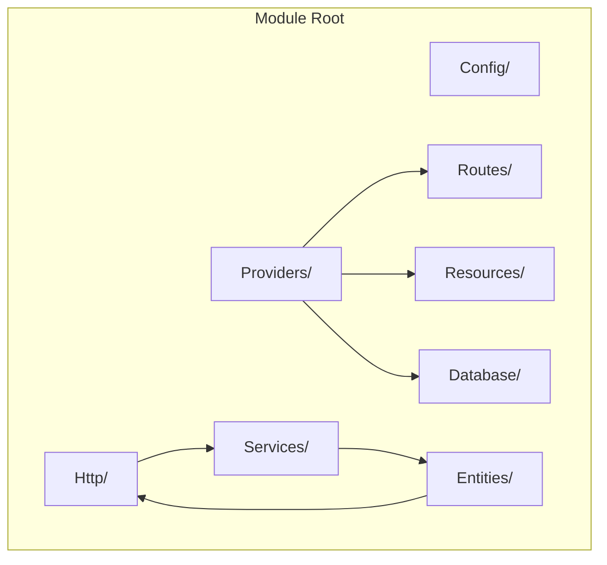
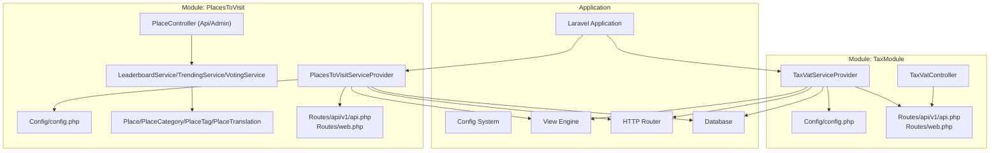
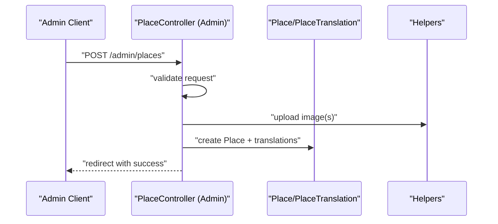
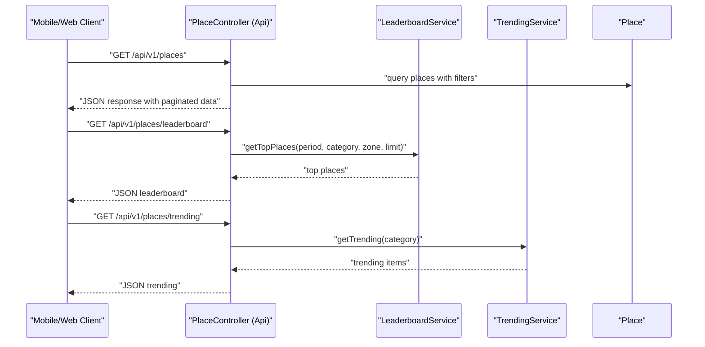
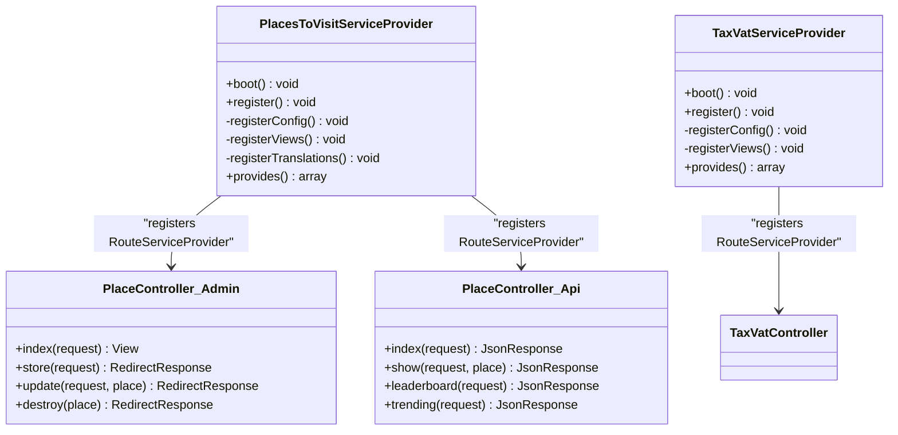
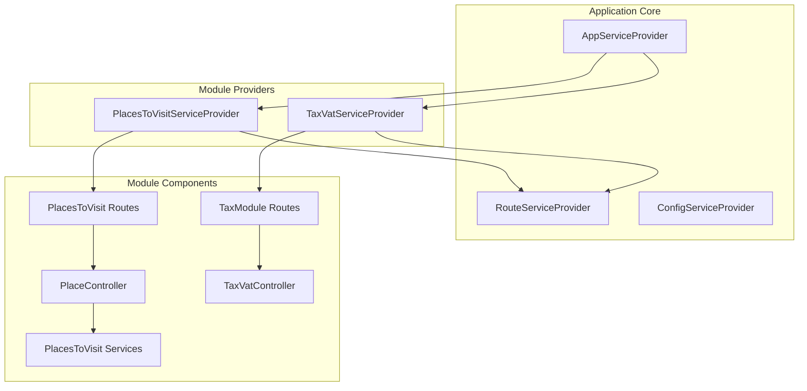

# Module Structure and Components

<cite>
**Referenced Files in This Document**
- [module.json](file://Modules/PlacesToVisit/module.json)
- [composer.json](file://Modules/PlacesToVisit/composer.json)
- [config.php](file://Modules/PlacesToVisit/Config/config.php)
- [PlacesToVisitServiceProvider.php](file://Modules/PlacesToVisit/Providers/PlacesToVisitServiceProvider.php)
- [PlaceController.php (Admin)](file://Modules/PlacesToVisit/Http/Controllers/Admin/PlaceController.php)
- [PlaceController.php (Api)](file://Modules/PlacesToVisit/Http/Controllers/Api/PlaceController.php)
- [web.php](file://Modules/PlacesToVisit/Routes/web.php)
- [api.php](file://Modules/PlacesToVisit/Routes/api/v1/api.php)
- [module.json](file://Modules/TaxModule/module.json)
- [composer.json](file://Modules/TaxModule/composer.json)
- [config.php](file://Modules/TaxModule/Config/config.php)
- [TaxVatServiceProvider.php](file://Modules/TaxModule/Providers/TaxVatServiceProvider.php)
- [TaxVatController.php](file://Modules/TaxModule/Http/Controllers/TaxVatController.php)
- [web.php](file://Modules/TaxModule/Routes/web.php)
- [api.php](file://Modules/TaxModule/Routes/api/v1/api.php)
</cite>

## Table of Contents
1. [Introduction](#introduction)
2. [Project Structure](#project-structure)
3. [Core Components](#core-components)
4. [Architecture Overview](#architecture-overview)
5. [Detailed Component Analysis](#detailed-component-analysis)
6. [Dependency Analysis](#dependency-analysis)
7. [Performance Considerations](#performance-considerations)
8. [Troubleshooting Guide](#troubleshooting-guide)
9. [Conclusion](#conclusion)

## Introduction
This document explains the standard module structure and component organization used across the application’s modular architecture. It focuses on the typical directory layout (Config/, Database/, Entities/, Http/, Providers/, Resources/, Routes/, Services/) and demonstrates how modules integrate with the Laravel application via service providers, configuration publishing, view loading, and routing. Examples from the PlacesToVisit and TaxModule modules illustrate best practices for organizing configuration, controllers, services, and routes.

## Project Structure
Each module follows a consistent folder hierarchy designed to separate concerns and enable easy maintenance and reuse. The standard structure includes:

- Config/: Module-specific configuration files merged into the application’s configuration system.
- Database/: Migration and seeding assets for database schema and initial data.
- Entities/: Eloquent models representing domain entities.
- Http/: Controllers organized by context (e.g., Admin, Api) and related middleware/routing.
- Providers/: Service providers that register bindings, load views, publish assets, and wire module services.
- Resources/: Views, language files, and frontend assets.
- Routes/: Route definitions grouped by HTTP method and API version.
- Services/: Domain services encapsulating business logic and reusable operations.

**Diagram sources**
- [PlacesToVisitServiceProvider.php:10-31](file://Modules/PlacesToVisit/Providers/PlacesToVisitServiceProvider.php#L10-L31)
- [TaxVatServiceProvider.php:8-41](file://Modules/TaxModule/Providers/TaxVatServiceProvider.php#L8-L41)

**Section sources**
- [module.json:11-13](file://Modules/PlacesToVisit/module.json#L11-L13)
- [module.json:7-9](file://Modules/TaxModule/module.json#L7-L9)

## Core Components
This section documents the purpose and contents of each component type within a module and how they interact with the application.

- Config/
  - Purpose: Provide module-level configuration values merged into the application’s config system.
  - Typical contents: PHP arrays defining keys and defaults (e.g., limits, caching, feature flags).
  - Registration: Providers publish and merge config files during boot.

- Database/
  - Purpose: Define schema and initial data for the module.
  - Typical contents: Migrations and Seeders under Database/Migrations and Database/Seeders.
  - Registration: Providers load migrations automatically.

- Entities/
  - Purpose: Represent domain objects with Eloquent models, relationships, scopes, and accessors.
  - Typical contents: Model classes under Entities/.

- Http/
  - Purpose: Handle incoming requests via controllers and expose routes.
  - Organization: Controllers grouped by context (Admin, Api) under Http/Controllers/.
  - Routing: Routes grouped by API version under Routes/.

- Providers/
  - Purpose: Register services, load views, publish assets, and wire module components.
  - Typical contents: A primary service provider extending Illuminate\Support\ServiceProvider.

- Resources/
  - Purpose: Provide views, language files, and frontend assets.
  - Organization: Views under Resources/views; optional language files under Resources/lang.

- Routes/
  - Purpose: Define HTTP endpoints for the module.
  - Organization: Routes grouped by context and version (e.g., web.php, api/v1/api.php).

- Services/
  - Purpose: Encapsulate business logic and reusable operations.
  - Typical contents: Service classes under Services/.

**Section sources**
- [config.php:3-52](file://Modules/PlacesToVisit/Config/config.php#L3-L52)
- [PlacesToVisitServiceProvider.php:15-43](file://Modules/PlacesToVisit/Providers/PlacesToVisitServiceProvider.php#L15-L43)
- [TaxVatServiceProvider.php:25-56](file://Modules/TaxModule/Providers/TaxVatServiceProvider.php#L25-L56)

## Architecture Overview
The module architecture centers around a service provider that registers configuration, views, translations, migrations, and routes. Controllers depend on services for business logic, while models encapsulate persistence and relationships.

**Diagram sources**
- [PlacesToVisitServiceProvider.php:15-43](file://Modules/PlacesToVisit/Providers/PlacesToVisitServiceProvider.php#L15-L43)
- [PlaceController.php (Api):12-17](file://Modules/PlacesToVisit/Http/Controllers/Api/PlaceController.php#L12-L17)
- [PlaceController.php (Admin):16-38](file://Modules/PlacesToVisit/Http/Controllers/Admin/PlaceController.php#L16-L38)
- [TaxVatServiceProvider.php:25-56](file://Modules/TaxModule/Providers/TaxVatServiceProvider.php#L25-L56)
- [TaxVatController.php:16-37](file://Modules/TaxModule/Http/Controllers/TaxVatController.php#L16-L37)

## Detailed Component Analysis

### Config/ Directory
- Purpose: Provide module configuration values merged into the application’s configuration namespace.
- Implementation pattern:
  - Publish configuration files to the application’s config directory.
  - Merge module config into the application’s config container.
- Example keys:
  - PlacesToVisit: leaderboard thresholds, trending windows, XP rewards, moderation thresholds, submission limits.
  - TaxModule: pagination, country type, version, project identifier.

**Section sources**
- [config.php:3-52](file://Modules/PlacesToVisit/Config/config.php#L3-L52)
- [config.php:3-10](file://Modules/TaxModule/Config/config.php#L3-L10)
- [PlacesToVisitServiceProvider.php:33-43](file://Modules/PlacesToVisit/Providers/PlacesToVisitServiceProvider.php#L33-L43)
- [TaxVatServiceProvider.php:48-56](file://Modules/TaxModule/Providers/TaxVatServiceProvider.php#L48-L56)

### Database/ Directory
- Purpose: Manage schema and initial data for the module.
- Implementation pattern:
  - Migrations under Database/Migrations.
  - Seeders under Database/Seeders.
  - Provider loads migrations automatically.

**Section sources**
- [PlacesToVisitServiceProvider.php:20-20](file://Modules/PlacesToVisit/Providers/PlacesToVisitServiceProvider.php#L20-L20)
- [TaxVatServiceProvider.php:30-30](file://Modules/TaxModule/Providers/TaxVatServiceProvider.php#L30-L30)

### Entities/ Directory
- Purpose: Define Eloquent models representing domain entities.
- Implementation pattern:
  - Models under Entities/ with relationships, scopes, and accessors.
  - Controllers and services operate on these models.

**Section sources**
- [PlaceController.php (Admin):9-14](file://Modules/PlacesToVisit/Http/Controllers/Admin/PlaceController.php#L9-L14)
- [PlaceController.php (Api):8-11](file://Modules/PlacesToVisit/Http/Controllers/Api/PlaceController.php#L8-L11)

### Http/ Directory
- Purpose: Handle HTTP requests via controllers and expose routes.
- Organization:
  - Controllers grouped by context (Admin, Api) under Http/Controllers/.
  - Controllers depend on services for business logic and models for persistence.

#### Admin Context
- Example: PlaceController handles CRUD operations for places, including translations, images, tags, and statuses.

**Diagram sources**
- [PlaceController.php (Admin):48-126](file://Modules/PlacesToVisit/Http/Controllers/Admin/PlaceController.php#L48-L126)

**Section sources**
- [PlaceController.php (Admin):18-126](file://Modules/PlacesToVisit/Http/Controllers/Admin/PlaceController.php#L18-L126)

#### Api Context
- Example: PlaceController (Api) exposes endpoints for listing places, retrieving details, leaderboards, top voters, and trending items.

**Diagram sources**
- [PlaceController.php (Api):23-91](file://Modules/PlacesToVisit/Http/Controllers/Api/PlaceController.php#L23-L91)
- [PlaceController.php (Api):185-200](file://Modules/PlacesToVisit/Http/Controllers/Api/PlaceController.php#L185-L200)
- [PlaceController.php (Api):225-235](file://Modules/PlacesToVisit/Http/Controllers/Api/PlaceController.php#L225-L235)

**Section sources**
- [PlaceController.php (Api):19-91](file://Modules/PlacesToVisit/Http/Controllers/Api/PlaceController.php#L19-L91)
- [PlaceController.php (Api):181-235](file://Modules/PlacesToVisit/Http/Controllers/Api/PlaceController.php#L181-L235)

### Providers/ Directory
- Purpose: Register services, load views, publish assets, and wire module components.
- Implementation pattern:
  - Extend Illuminate\Support\ServiceProvider.
  - Register singletons for services in the register() method.
  - Load migrations, views, and translations in boot().

**Diagram sources**
- [PlacesToVisitServiceProvider.php:10-31](file://Modules/PlacesToVisit/Providers/PlacesToVisitServiceProvider.php#L10-L31)
- [TaxVatServiceProvider.php:8-41](file://Modules/TaxModule/Providers/TaxVatServiceProvider.php#L8-L41)
- [PlaceController.php (Admin):16-38](file://Modules/PlacesToVisit/Http/Controllers/Admin/PlaceController.php#L16-L38)
- [PlaceController.php (Api):12-17](file://Modules/PlacesToVisit/Http/Controllers/Api/PlaceController.php#L12-L17)
- [TaxVatController.php:16-37](file://Modules/TaxModule/Http/Controllers/TaxVatController.php#L16-L37)

**Section sources**
- [PlacesToVisitServiceProvider.php:15-43](file://Modules/PlacesToVisit/Providers/PlacesToVisitServiceProvider.php#L15-L43)
- [TaxVatServiceProvider.php:25-56](file://Modules/TaxModule/Providers/TaxVatServiceProvider.php#L25-L56)

### Resources/ Directory
- Purpose: Provide views, language files, and frontend assets.
- Implementation pattern:
  - Views under Resources/views.
  - Providers publish views to resource_path('views/modules/<alias>') and load them from both published and module locations.

**Section sources**
- [PlacesToVisitServiceProvider.php:45-66](file://Modules/PlacesToVisit/Providers/PlacesToVisitServiceProvider.php#L45-L66)
- [TaxVatServiceProvider.php:63-74](file://Modules/TaxModule/Providers/TaxVatServiceProvider.php#L63-L74)

### Routes/ Directory
- Purpose: Define HTTP endpoints for the module.
- Implementation pattern:
  - Routes grouped by context (web.php, api/v1/api.php).
  - Providers register RouteServiceProvider to bind routes to controllers.

**Section sources**
- [web.php](file://Modules/PlacesToVisit/Routes/web.php)
- [api.php](file://Modules/PlacesToVisit/Routes/api/v1/api.php)
- [web.php](file://Modules/TaxModule/Routes/web.php)
- [api.php](file://Modules/TaxModule/Routes/api/v1/api.php)

### Services/ Directory
- Purpose: Encapsulate business logic and reusable operations.
- Implementation pattern:
  - Services registered as singletons in the module’s ServiceProvider.
  - Controllers depend on services for domain operations.

**Section sources**
- [PlacesToVisitServiceProvider.php:27-30](file://Modules/PlacesToVisit/Providers/PlacesToVisitServiceProvider.php#L27-L30)
- [PlaceController.php (Api):14-17](file://Modules/PlacesToVisit/Http/Controllers/Api/PlaceController.php#L14-L17)

## Dependency Analysis
This section maps how modules integrate with the application and each other.

**Diagram sources**
- [PlacesToVisitServiceProvider.php:25-25](file://Modules/PlacesToVisit/Providers/PlacesToVisitServiceProvider.php#L25-L25)
- [TaxVatServiceProvider.php:40-40](file://Modules/TaxModule/Providers/TaxVatServiceProvider.php#L40-L40)
- [PlaceController.php (Admin):16-38](file://Modules/PlacesToVisit/Http/Controllers/Admin/PlaceController.php#L16-L38)
- [PlaceController.php (Api):12-17](file://Modules/PlacesToVisit/Http/Controllers/Api/PlaceController.php#L12-L17)
- [TaxVatController.php:16-37](file://Modules/TaxModule/Http/Controllers/TaxVatController.php#L16-L37)

**Section sources**
- [module.json:11-13](file://Modules/PlacesToVisit/module.json#L11-L13)
- [module.json:7-9](file://Modules/TaxModule/module.json#L7-L9)

## Performance Considerations
- Use pagination for list endpoints to avoid large payloads.
- Apply appropriate eager loading (with, withCount) to reduce N+1 queries.
- Cache frequently accessed configuration values and computed metrics (leaderboard, trending).
- Minimize heavy computations in controllers; delegate to services.
- Use database indexes on filtered columns (category_id, zone_id, tags) to improve query performance.

## Troubleshooting Guide
- Configuration not loading:
  - Verify the provider publishes and merges config correctly.
  - Confirm the module alias matches the config key used in code.
- Views not rendering:
  - Ensure views are published to resource_path('views/modules/<alias>') and loaded from both published and module locations.
- Routes not reachable:
  - Confirm the module’s RouteServiceProvider is registered in the provider’s register() method.
  - Verify route files are included in the module’s Routes directory.
- Services not resolved:
  - Ensure services are registered as singletons in the provider’s register() method.
  - Confirm constructor injection in controllers matches service types.

**Section sources**
- [PlacesToVisitServiceProvider.php:27-31](file://Modules/PlacesToVisit/Providers/PlacesToVisitServiceProvider.php#L27-L31)
- [TaxVatServiceProvider.php:39-41](file://Modules/TaxModule/Providers/TaxVatServiceProvider.php#L39-L41)
- [PlaceController.php (Api):14-17](file://Modules/PlacesToVisit/Http/Controllers/Api/PlaceController.php#L14-L17)

## Conclusion
The module structure promotes clean separation of concerns, reusability, and maintainability. By following the standard layout and provider-driven registration pattern, modules can consistently expose configuration, views, routes, and services while integrating seamlessly with the Laravel application. The PlacesToVisit and TaxModule examples demonstrate practical implementations of configuration, controllers, services, and routing that serve as templates for new modules.