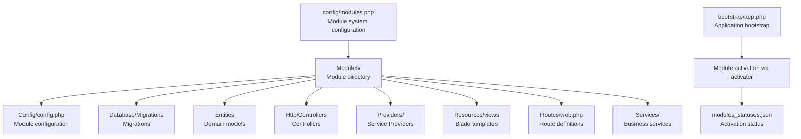
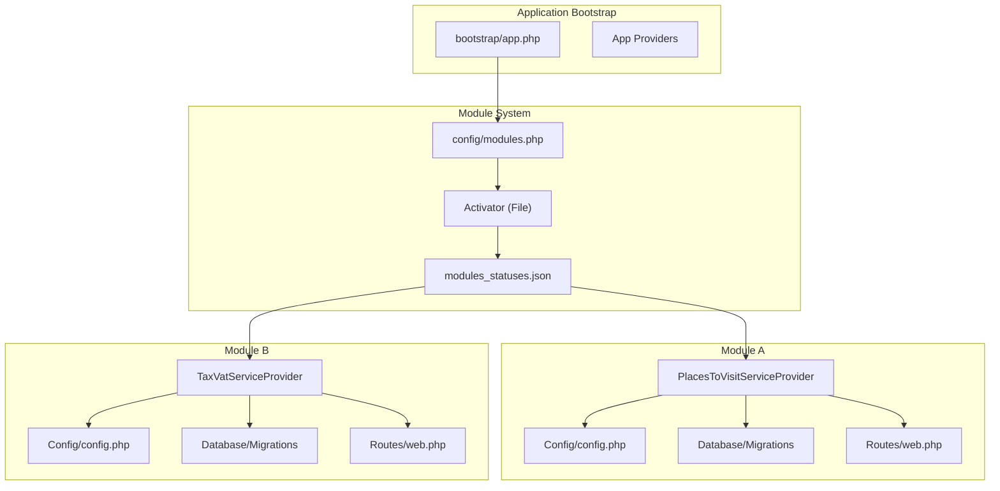
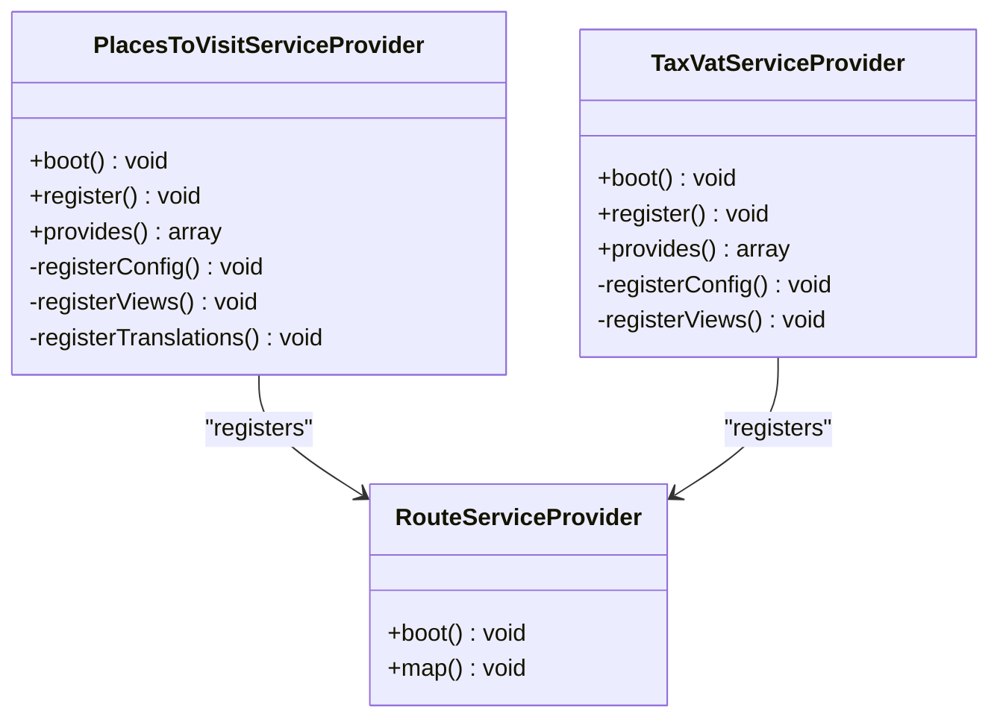
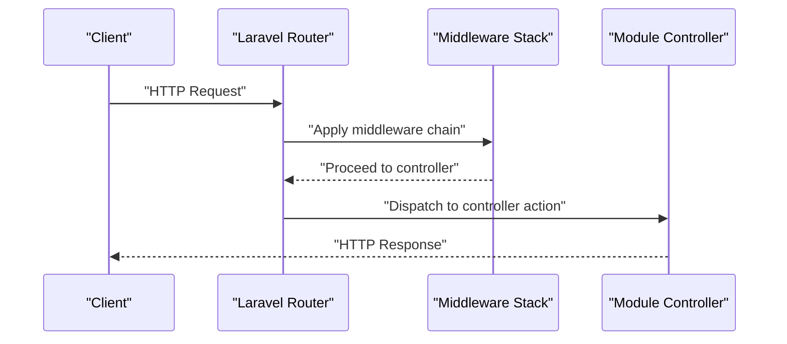
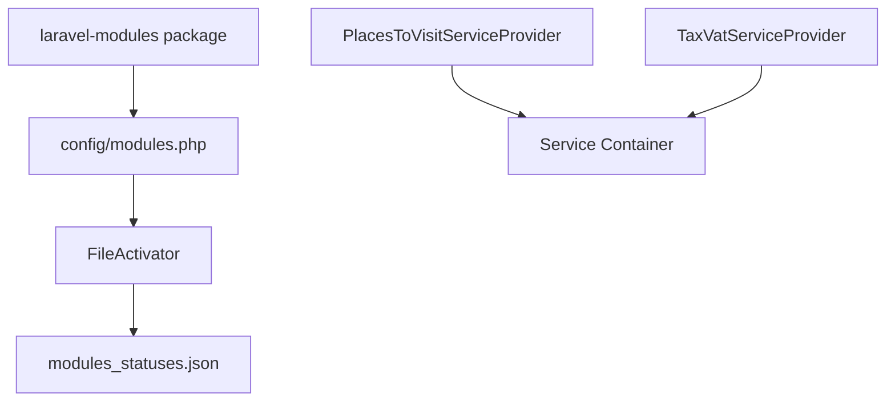

# Module System

<cite>
**Referenced Files in This Document**
- [config/modules.php](file://config/modules.php)
- [Modules/PlacesToVisit/module.json](file://Modules/PlacesToVisit/module.json)
- [Modules/TaxModule/module.json](file://Modules/TaxModule/module.json)
- [Modules/PlacesToVisit/composer.json](file://Modules/PlacesToVisit/composer.json)
- [Modules/TaxModule/composer.json](file://Modules/TaxModule/composer.json)
- [Modules/PlacesToVisit/Config/config.php](file://Modules/PlacesToVisit/Config/config.php)
- [Modules/TaxModule/Config/config.php](file://Modules/TaxModule/Config/config.php)
- [Modules/PlacesToVisit/Providers/PlacesToVisitServiceProvider.php](file://Modules/PlacesToVisit/Providers/PlacesToVisitServiceProvider.php)
- [Modules/TaxModule/Providers/TaxVatServiceProvider.php](file://Modules/TaxModule/Providers/TaxVatServiceProvider.php)
- [Modules/PlacesToVisit/Routes/web.php](file://Modules/PlacesToVisit/Routes/web.php)
- [Modules/TaxModule/Routes/web.php](file://Modules/TaxModule/Routes/web.php)
- [bootstrap/app.php](file://bootstrap/app.php)
</cite>

## Table of Contents
1. [Introduction](#introduction)
2. [Project Structure](#project-structure)
3. [Core Components](#core-components)
4. [Architecture Overview](#architecture-overview)
5. [Detailed Component Analysis](#detailed-component-analysis)
6. [Dependency Analysis](#dependency-analysis)
7. [Performance Considerations](#performance-considerations)
8. [Troubleshooting Guide](#troubleshooting-guide)
9. [Conclusion](#conclusion)

## Introduction
This document explains the module system architecture used by Waddy Back. It focuses on the pluggable module design that isolates business functionality and promotes reusability across the platform. The system leverages Laravel's ecosystem with the laravel-modules package to manage modules, their configurations, service providers, database migrations, entities, controllers, and resources. It also documents the module registration process, dependency management, inter-module communication patterns, routing, middleware integration, and lifecycle management.

## Project Structure
The module system is organized around a dedicated Modules directory containing individual modules. Each module encapsulates its own structure:
- Config: module-specific configuration files
- Database/Migrations: database migration files scoped to the module
- Entities: model-like classes representing domain entities
- Http/Controllers: controllers for module-specific routes
- Providers: service providers that register bindings and boot module components
- Resources: views, assets, and localization files
- Routes: route definitions for the module
- Services: business logic services
- composer.json and module.json: module metadata and autoloading configuration

**Diagram sources**
- [config/modules.php:63-132](file://config/modules.php#L63-L132)
- [bootstrap/app.php:14-62](file://bootstrap/app.php#L14-L62)

**Section sources**
- [config/modules.php:63-132](file://config/modules.php#L63-L132)
- [bootstrap/app.php:14-62](file://bootstrap/app.php#L14-L62)

## Core Components
The module system centers on several core components that work together to enable modular functionality:

- Module configuration: Defines module namespace, generator paths, scanning behavior, caching, and activator settings.
- Module manifest: Declares module identity, provider classes, aliases, and dependencies.
- Service providers: Register bindings, load migrations, publish assets, and merge configuration.
- Routing: Defines module-specific routes under prefixed namespaces with middleware.
- Configuration publishing: Allows modules to publish and merge their configuration into the application.

Key implementation patterns:
- Namespacing: Modules are namespaced under a common namespace to avoid collisions.
- Autoloading: PSR-4 autoload configuration in module composer.json ensures classes are autoloaded from the module root.
- Activation: File-based activation stores module status in a JSON file, enabling selective module loading.

**Section sources**
- [config/modules.php:17-277](file://config/modules.php#L17-L277)
- [Modules/PlacesToVisit/module.json:1-17](file://Modules/PlacesToVisit/module.json#L1-L17)
- [Modules/TaxModule/module.json:1-14](file://Modules/TaxModule/module.json#L1-L14)
- [Modules/PlacesToVisit/composer.json:1-16](file://Modules/PlacesToVisit/composer.json#L1-L16)
- [Modules/TaxModule/composer.json:1-24](file://Modules/TaxModule/composer.json#L1-L24)

## Architecture Overview
The module system architecture integrates tightly with Laravel’s service container and module management package. At runtime, modules are discovered, activated, and registered through their service providers. Configuration is merged, migrations are loaded, and routes are registered under module-specific prefixes.

**Diagram sources**
- [bootstrap/app.php:14-62](file://bootstrap/app.php#L14-L62)
- [config/modules.php:267-277](file://config/modules.php#L267-L277)
- [Modules/PlacesToVisit/Providers/PlacesToVisitServiceProvider.php:10-31](file://Modules/PlacesToVisit/Providers/PlacesToVisitServiceProvider.php#L10-L31)
- [Modules/TaxModule/Providers/TaxVatServiceProvider.php:8-41](file://Modules/TaxModule/Providers/TaxVatServiceProvider.php#L8-L41)

## Detailed Component Analysis

### Module Manifest and Metadata
Each module declares its identity and registration points via a manifest file. The manifest specifies:
- Human-readable name and alias
- Description and keywords
- Priority and provider classes
- Aliases and required dependencies

Examples:
- PlacesToVisit module manifest defines its primary service provider.
- TaxModule manifest defines its service provider and minimal metadata.

These manifests are consumed by the module system to register providers and manage dependencies.

**Section sources**
- [Modules/PlacesToVisit/module.json:1-17](file://Modules/PlacesToVisit/module.json#L1-L17)
- [Modules/TaxModule/module.json:1-14](file://Modules/TaxModule/module.json#L1-L14)

### Configuration Management
Modules publish and merge configuration into the application configuration. This allows centralized access to module settings while supporting overrides.

Key behaviors:
- Publish configuration files to the application config directory
- Merge module configuration with the application configuration
- Support environment-specific overrides

Examples:
- PlacesToVisit module exposes settings for leaderboard thresholds, trending windows, banners, XP rewards, and submission limits.
- TaxModule module exposes project metadata, pagination, country type, and versioning.

**Section sources**
- [Modules/PlacesToVisit/Config/config.php:1-53](file://Modules/PlacesToVisit/Config/config.php#L1-L53)
- [Modules/TaxModule/Config/config.php:1-11](file://Modules/TaxModule/Config/config.php#L1-L11)
- [Modules/PlacesToVisit/Providers/PlacesToVisitServiceProvider.php:33-43](file://Modules/PlacesToVisit/Providers/PlacesToVisitServiceProvider.php#L33-L43)
- [Modules/TaxModule/Providers/TaxVatServiceProvider.php:48-56](file://Modules/TaxModule/Providers/TaxVatServiceProvider.php#L48-L56)

### Service Providers and Registration Lifecycle
Service providers orchestrate module initialization:
- Boot phase: register configuration, views, translations, and load migrations
- Register phase: bind services into the container and register route providers
- Provides: declare container bindings exposed by the module

Examples:
- PlacesToVisit service provider registers three singleton services and loads migrations from the module’s migration directory.
- TaxModule service provider registers a route provider and loads migrations from its migration directory.

**Diagram sources**
- [Modules/PlacesToVisit/Providers/PlacesToVisitServiceProvider.php:10-88](file://Modules/PlacesToVisit/Providers/PlacesToVisitServiceProvider.php#L10-L88)
- [Modules/TaxModule/Providers/TaxVatServiceProvider.php:8-113](file://Modules/TaxModule/Providers/TaxVatServiceProvider.php#L8-L113)

**Section sources**
- [Modules/PlacesToVisit/Providers/PlacesToVisitServiceProvider.php:15-31](file://Modules/PlacesToVisit/Providers/PlacesToVisitServiceProvider.php#L15-L31)
- [Modules/TaxModule/Providers/TaxVatServiceProvider.php:25-41](file://Modules/TaxModule/Providers/TaxVatServiceProvider.php#L25-L41)

### Routing and Middleware Integration
Modules define their routes under prefixed namespaces and apply middleware stacks appropriate to their domain. Routes are grouped with:
- Prefix: module-specific URL prefix
- Name: module-specific route name prefix
- Middleware: module-scoped middleware pipeline

Examples:
- PlacesToVisit module routes are prefixed for admin access and include a current-module guard.
- TaxModule module routes are prefixed for admin access and include a current-module guard.

**Diagram sources**
- [Modules/PlacesToVisit/Routes/web.php:11-81](file://Modules/PlacesToVisit/Routes/web.php#L11-L81)
- [Modules/TaxModule/Routes/web.php:16-27](file://Modules/TaxModule/Routes/web.php#L16-L27)

**Section sources**
- [Modules/PlacesToVisit/Routes/web.php:11-81](file://Modules/PlacesToVisit/Routes/web.php#L11-L81)
- [Modules/TaxModule/Routes/web.php:16-27](file://Modules/TaxModule/Routes/web.php#L16-L27)

### Database Migrations and Entities
Modules encapsulate their persistence concerns:
- Migrations: stored under Database/Migrations and loaded during module boot
- Entities: domain models placed under Entities for clarity and separation

This pattern ensures that each module manages its own schema evolution independently.

**Section sources**
- [Modules/PlacesToVisit/Providers/PlacesToVisitServiceProvider.php:20](file://Modules/PlacesToVisit/Providers/PlacesToVisitServiceProvider.php#L20)
- [Modules/TaxModule/Providers/TaxVatServiceProvider.php:30](file://Modules/TaxModule/Providers/TaxVatServiceProvider.php#L30)

### Views and Assets Publishing
Modules can publish views and assets to the application for customization and reuse. The service provider:
- Publishes module views to resource paths
- Loads views from both published locations and module source
- Supports translation loading from module or published paths

**Section sources**
- [Modules/PlacesToVisit/Providers/PlacesToVisitServiceProvider.php:45-66](file://Modules/PlacesToVisit/Providers/PlacesToVisitServiceProvider.php#L45-L66)
- [Modules/TaxModule/Providers/TaxVatServiceProvider.php:63-74](file://Modules/TaxModule/Providers/TaxVatServiceProvider.php#L63-L74)

### Composer Autoload and Module Discovery
Modules declare PSR-4 autoload configuration pointing to their root, enabling seamless class resolution. The module system configuration defines:
- Module namespace
- Paths for modules, assets, and generators
- Generator defaults for scaffolding module components

**Section sources**
- [Modules/PlacesToVisit/composer.json:11-16](file://Modules/PlacesToVisit/composer.json#L11-L16)
- [Modules/TaxModule/composer.json:18-24](file://Modules/TaxModule/composer.json#L18-L24)
- [config/modules.php:17](file://config/modules.php#L17)
- [config/modules.php:63-132](file://config/modules.php#L63-L132)

## Dependency Analysis
The module system relies on a few key dependencies:
- laravel-modules package for module management
- File activator for module activation status persistence
- Laravel service container for dependency injection and service registration

**Diagram sources**
- [config/modules.php:3-5](file://config/modules.php#L3-L5)
- [config/modules.php:267-277](file://config/modules.php#L267-L277)
- [Modules/PlacesToVisit/Providers/PlacesToVisitServiceProvider.php:10-31](file://Modules/PlacesToVisit/Providers/PlacesToVisitServiceProvider.php#L10-L31)
- [Modules/TaxModule/Providers/TaxVatServiceProvider.php:8-41](file://Modules/TaxModule/Providers/TaxVatServiceProvider.php#L8-L41)

**Section sources**
- [config/modules.php:3-5](file://config/modules.php#L3-L5)
- [config/modules.php:267-277](file://config/modules.php#L267-L277)

## Performance Considerations
- Caching: The module system supports caching module metadata to reduce overhead on subsequent boots.
- Migration loading: Migrations are loaded per module during boot; keep migration counts reasonable to minimize boot time.
- Asset publishing: Publishing views and assets can be costly; use targeted publishes and leverage the built-in merging behavior.
- Middleware stack: Keep middleware chains lean to avoid request latency increases.

[No sources needed since this section provides general guidance]

## Troubleshooting Guide
Common issues and resolutions:
- Module not activating: Verify activation status in the activation file and ensure the module path exists.
- Routes not loading: Confirm the module’s RouteServiceProvider is registered and routes are defined under the module’s Routes directory.
- Configuration not applied: Ensure the module publishes configuration and merges correctly into the application configuration.
- Views not rendering: Check that views are published to the expected resource path and that the view loader includes the module’s view path.

**Section sources**
- [config/modules.php:267-277](file://config/modules.php#L267-L277)
- [Modules/PlacesToVisit/Providers/PlacesToVisitServiceProvider.php:15-31](file://Modules/PlacesToVisit/Providers/PlacesToVisitServiceProvider.php#L15-L31)
- [Modules/TaxModule/Providers/TaxVatServiceProvider.php:25-41](file://Modules/TaxModule/Providers/TaxVatServiceProvider.php#L25-L41)

## Conclusion
Waddy Back’s module system provides a robust, scalable foundation for building isolated, reusable business capabilities. Through structured manifests, service providers, configuration publishing, and route grouping with middleware, modules integrate cleanly with Laravel’s ecosystem. The file-based activation mechanism and generator defaults streamline development and deployment. Following the patterns outlined here enables teams to extend existing functionality, create new modules, and manage module lifecycles effectively.