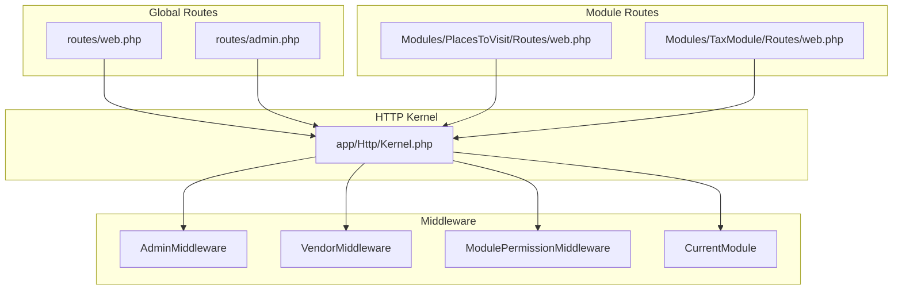
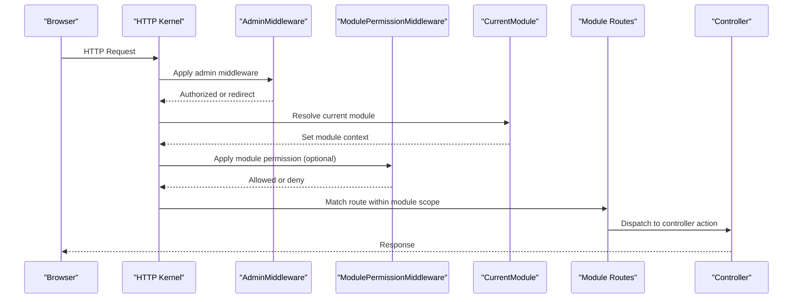
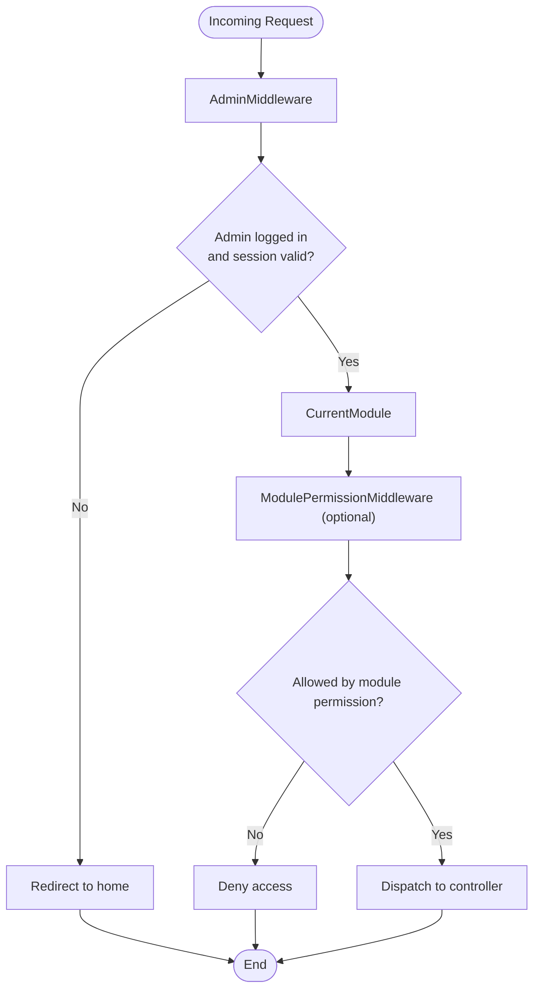
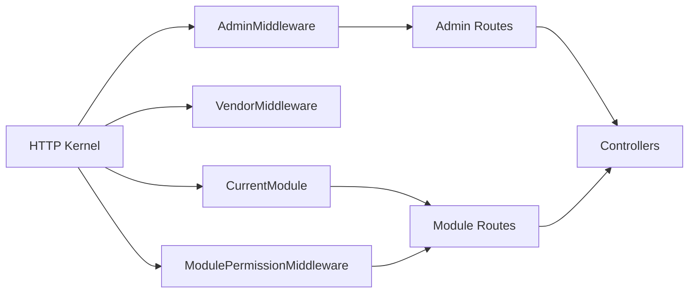

# Routing and Middleware Integration

<cite>
**Referenced Files in This Document**
- [routes/web.php](file://routes/web.php)
- [routes/admin.php](file://routes/admin.php)
- [app/Http/Kernel.php](file://app/Http/Kernel.php)
- [Modules/PlacesToVisit/Routes/web.php](file://Modules/PlacesToVisit/Routes/web.php)
- [Modules/TaxModule/Routes/web.php](file://Modules/TaxModule/Routes/web.php)
- [app/Http/Middleware/ModulePermissionMiddleware.php](file://app/Http/Middleware/ModulePermissionMiddleware.php)
- [app/Http/Middleware/CurrentModule.php](file://app/Http/Middleware/CurrentModule.php)
- [app/Http/Middleware/AdminMiddleware.php](file://app/Http/Middleware/AdminMiddleware.php)
- [app/Http/Middleware/VendorMiddleware.php](file://app/Http/Middleware/VendorMiddleware.php)
</cite>

## Table of Contents
1. [Introduction](#introduction)
2. [Project Structure](#project-structure)
3. [Core Components](#core-components)
4. [Architecture Overview](#architecture-overview)
5. [Detailed Component Analysis](#detailed-component-analysis)
6. [Dependency Analysis](#dependency-analysis)
7. [Performance Considerations](#performance-considerations)
8. [Troubleshooting Guide](#troubleshooting-guide)
9. [Conclusion](#conclusion)

## Introduction
This document explains how routing and middleware are integrated across the application and modules. It covers:
- How modules define their own route files for web and admin endpoints
- Route registration, URL generation, and parameter binding within modules
- Middleware integration for authentication, authorization, and cross-cutting concerns
- Examples of admin routes, API versioning, and route model binding
- Route caching, performance considerations, and conflict resolution between modules

## Project Structure
The routing system is organized around:
- Global web routes for public and payment integrations
- Admin routes grouped under a dedicated admin route file
- Module-specific route files under each module’s Routes directory
- Middleware configured globally and per-route via the HTTP kernel

**Diagram sources**
- [routes/web.php:1-260](file://routes/web.php#L1-L260)
- [routes/admin.php:1-827](file://routes/admin.php#L1-L827)
- [app/Http/Kernel.php:1-88](file://app/Http/Kernel.php#L1-L88)
- [Modules/PlacesToVisit/Routes/web.php:1-91](file://Modules/PlacesToVisit/Routes/web.php#L1-L91)
- [Modules/TaxModule/Routes/web.php:1-27](file://Modules/TaxModule/Routes/web.php#L1-L27)
- [app/Http/Middleware/AdminMiddleware.php:1-47](file://app/Http/Middleware/AdminMiddleware.php#L1-L47)
- [app/Http/Middleware/VendorMiddleware.php:1-60](file://app/Http/Middleware/VendorMiddleware.php#L1-L60)
- [app/Http/Middleware/ModulePermissionMiddleware.php:1-34](file://app/Http/Middleware/ModulePermissionMiddleware.php#L1-L34)
- [app/Http/Middleware/CurrentModule.php:1-61](file://app/Http/Middleware/CurrentModule.php#L1-L61)

**Section sources**
- [routes/web.php:1-260](file://routes/web.php#L1-L260)
- [routes/admin.php:1-827](file://routes/admin.php#L1-L827)
- [app/Http/Kernel.php:1-88](file://app/Http/Kernel.php#L1-L88)

## Core Components
- Global web routes: Define public pages, authentication, payments, and admin API endpoints.
- Admin routes: Centralized admin navigation and module-scoped admin routes.
- Module routes: Each module registers its own web routes with module-aware prefixes and middleware.
- HTTP kernel: Declares middleware groups and individual middleware aliases.
- Middleware: Enforce authentication, authorization, current module selection, and module permissions.

**Section sources**
- [routes/web.php:1-260](file://routes/web.php#L1-L260)
- [routes/admin.php:1-827](file://routes/admin.php#L1-L827)
- [Modules/PlacesToVisit/Routes/web.php:1-91](file://Modules/PlacesToVisit/Routes/web.php#L1-L91)
- [Modules/TaxModule/Routes/web.php:1-27](file://Modules/TaxModule/Routes/web.php#L1-L27)
- [app/Http/Kernel.php:1-88](file://app/Http/Kernel.php#L1-L88)

## Architecture Overview
The routing architecture combines global routes, admin routes, and module routes. Middleware ensures proper authentication and authorization at each layer. Modules encapsulate their admin UI under a consistent namespace and prefix.

**Diagram sources**
- [app/Http/Kernel.php:35-86](file://app/Http/Kernel.php#L35-L86)
- [app/Http/Middleware/AdminMiddleware.php:20-45](file://app/Http/Middleware/AdminMiddleware.php#L20-L45)
- [app/Http/Middleware/CurrentModule.php:20-58](file://app/Http/Middleware/CurrentModule.php#L20-L58)
- [app/Http/Middleware/ModulePermissionMiddleware.php:18-32](file://app/Http/Middleware/ModulePermissionMiddleware.php#L18-L32)
- [Modules/PlacesToVisit/Routes/web.php:11-90](file://Modules/PlacesToVisit/Routes/web.php#L11-L90)

## Detailed Component Analysis

### Global Web Routes
- Public pages and authentication endpoints are registered here.
- Payment provider routes are grouped under prefixes and sometimes exclude CSRF verification for third-party callbacks.
- Admin API endpoints for order tracking are defined with throttling middleware.

Key observations:
- Route registration uses closures and controller method arrays.
- Parameter binding occurs implicitly via route model binding in controllers.
- Throttling middleware is applied to streaming endpoints.

**Section sources**
- [routes/web.php:32-260](file://routes/web.php#L32-L260)

### Admin Routes
- Admin routes are grouped under an admin namespace and prefixed route groups.
- Middleware stacks include admin authentication, current module detection, and activation checks.
- Module-scoped routes are guarded by a module middleware that checks permissions for specific modules.

Examples:
- Orders, stores, campaigns, flash sales, and promotional banners are grouped under module-specific middleware.
- URLs are generated with the admin namespace and module-specific suffixes.

**Section sources**
- [routes/admin.php:6-827](file://routes/admin.php#L6-L827)

### Module Routes: PlacesToVisit
- Module routes are prefixed under admin and scoped to the module namespace.
- Uses admin and current-module middleware to ensure access and context.
- Groups cover categories, zones, places, leaderboard, banners, offers, and submissions.

URL generation:
- Namespaced routes allow consistent URL generation using the admin.places.* pattern.

**Section sources**
- [Modules/PlacesToVisit/Routes/web.php:11-90](file://Modules/PlacesToVisit/Routes/web.php#L11-L90)

### Module Routes: TaxModule
- Module routes are prefixed under taxvat and namespaced similarly.
- Includes CRUD endpoints for tax/vat data and system-wide settings.

**Section sources**
- [Modules/TaxModule/Routes/web.php:16-26](file://Modules/TaxModule/Routes/web.php#L16-L26)

### Middleware Integration
- Authentication middleware: AdminMiddleware and VendorMiddleware enforce session validity and status checks.
- Authorization middleware: ModulePermissionMiddleware validates module access for both admins and vendors/employees.
- Context middleware: CurrentModule selects the active module and sets configuration for module-aware logic.

**Diagram sources**
- [app/Http/Middleware/AdminMiddleware.php:20-45](file://app/Http/Middleware/AdminMiddleware.php#L20-L45)
- [app/Http/Middleware/CurrentModule.php:20-58](file://app/Http/Middleware/CurrentModule.php#L20-L58)
- [app/Http/Middleware/ModulePermissionMiddleware.php:18-32](file://app/Http/Middleware/ModulePermissionMiddleware.php#L18-L32)

**Section sources**
- [app/Http/Middleware/AdminMiddleware.php:1-47](file://app/Http/Middleware/AdminMiddleware.php#L1-L47)
- [app/Http/Middleware/VendorMiddleware.php:1-60](file://app/Http/Middleware/VendorMiddleware.php#L1-L60)
- [app/Http/Middleware/ModulePermissionMiddleware.php:1-34](file://app/Http/Middleware/ModulePermissionMiddleware.php#L1-L34)
- [app/Http/Middleware/CurrentModule.php:1-61](file://app/Http/Middleware/CurrentModule.php#L1-L61)

### Route Model Binding
- Implicit binding is used in module routes where route parameters match controller method parameters.
- Example: Routes with placeholders like {place}, {category}, {zone}, and {taxVat} bind to controller method parameters automatically.

**Section sources**
- [Modules/PlacesToVisit/Routes/web.php:40-80](file://Modules/PlacesToVisit/Routes/web.php#L40-L80)
- [Modules/TaxModule/Routes/web.php:17-25](file://Modules/TaxModule/Routes/web.php#L17-L25)

### URL Generation and Naming Conventions
- Routes are named consistently within modules (e.g., admin.places.*, taxvat.*).
- Prefixes and namespaces ensure unique route names and predictable URL patterns.

**Section sources**
- [Modules/PlacesToVisit/Routes/web.php:11-90](file://Modules/PlacesToVisit/Routes/web.php#L11-L90)
- [Modules/TaxModule/Routes/web.php:16-26](file://Modules/TaxModule/Routes/web.php#L16-L26)

### API Versioning
- API routes are versioned under separate directories (e.g., api/v1, api/v2).
- Global web routes also include admin API endpoints for order tracking with throttling.

**Section sources**
- [routes/web.php:248-258](file://routes/web.php#L248-L258)

### Admin Routes and Module Permissions
- Admin routes apply middleware stacks including admin authentication and module permission checks.
- Module-scoped routes are gated by module middleware to restrict access to authorized users.

**Section sources**
- [routes/admin.php:8-496](file://routes/admin.php#L8-L496)
- [app/Http/Middleware/ModulePermissionMiddleware.php:18-32](file://app/Http/Middleware/ModulePermissionMiddleware.php#L18-L32)

## Dependency Analysis
The routing system depends on:
- HTTP kernel for middleware registration and grouping
- Middleware for enforcing authentication, authorization, and module context
- Module route files for encapsulating module-specific endpoints

**Diagram sources**
- [app/Http/Kernel.php:35-86](file://app/Http/Kernel.php#L35-L86)
- [app/Http/Middleware/AdminMiddleware.php:20-45](file://app/Http/Middleware/AdminMiddleware.php#L20-L45)
- [app/Http/Middleware/VendorMiddleware.php:19-57](file://app/Http/Middleware/VendorMiddleware.php#L19-L57)
- [app/Http/Middleware/ModulePermissionMiddleware.php:18-32](file://app/Http/Middleware/ModulePermissionMiddleware.php#L18-L32)
- [app/Http/Middleware/CurrentModule.php:20-58](file://app/Http/Middleware/CurrentModule.php#L20-L58)
- [routes/admin.php:6-827](file://routes/admin.php#L6-L827)
- [Modules/PlacesToVisit/Routes/web.php:11-90](file://Modules/PlacesToVisit/Routes/web.php#L11-L90)

**Section sources**
- [app/Http/Kernel.php:1-88](file://app/Http/Kernel.php#L1-L88)
- [routes/admin.php:6-827](file://routes/admin.php#L6-L827)
- [Modules/PlacesToVisit/Routes/web.php:11-90](file://Modules/PlacesToVisit/Routes/web.php#L11-L90)

## Performance Considerations
- Route caching: Laravel supports route caching to reduce bootstrapping overhead. Enable route caching in production environments to improve performance.
- Middleware ordering: Keep heavy middleware (e.g., module permission checks) after early authentication checks to minimize unnecessary work.
- Throttling: Use throttle middleware on endpoints that are sensitive to abuse (e.g., order tracking streaming).
- Static assets: Serve static assets efficiently and leverage browser caching.

[No sources needed since this section provides general guidance]

## Troubleshooting Guide
Common issues and resolutions:
- Access denied errors: Ensure the user has the appropriate module permissions. The module permission middleware denies access when the user lacks permission.
- Session expiration: Admin and vendor middleware log out users with invalid or expired sessions and redirect them to login.
- Incorrect module context: The current module middleware sets module context based on query parameters or session; verify module_id and current module type.
- CSRF failures for third-party callbacks: Some payment routes exclude CSRF verification for external callbacks; confirm the route excludes CSRF middleware as intended.

**Section sources**
- [app/Http/Middleware/ModulePermissionMiddleware.php:18-32](file://app/Http/Middleware/ModulePermissionMiddleware.php#L18-L32)
- [app/Http/Middleware/AdminMiddleware.php:20-45](file://app/Http/Middleware/AdminMiddleware.php#L20-L45)
- [app/Http/Middleware/VendorMiddleware.php:19-57](file://app/Http/Middleware/VendorMiddleware.php#L19-L57)
- [app/Http/Middleware/CurrentModule.php:20-58](file://app/Http/Middleware/CurrentModule.php#L20-L58)
- [routes/web.php:88-196](file://routes/web.php#L88-L196)

## Conclusion
The routing and middleware integration pattern leverages:
- Clear separation of global, admin, and module routes
- Strong middleware enforcement for authentication, authorization, and module context
- Consistent naming and prefixing for predictable URL generation
- Practical examples of admin routes, API versioning, and route model binding

This design enables scalable module development while maintaining centralized control over access and behavior.