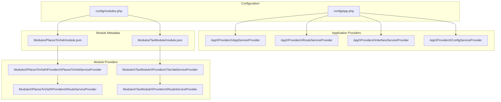
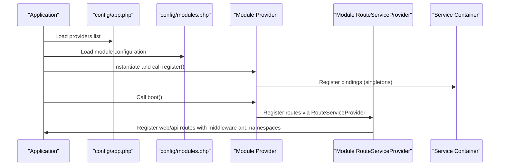
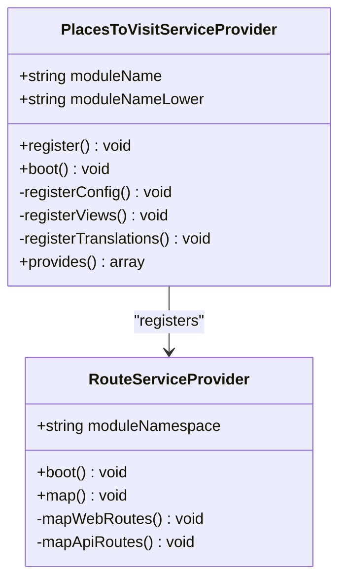
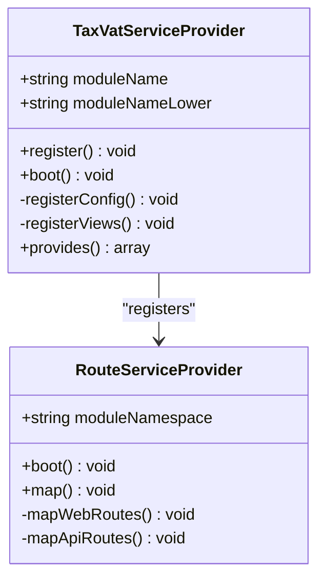
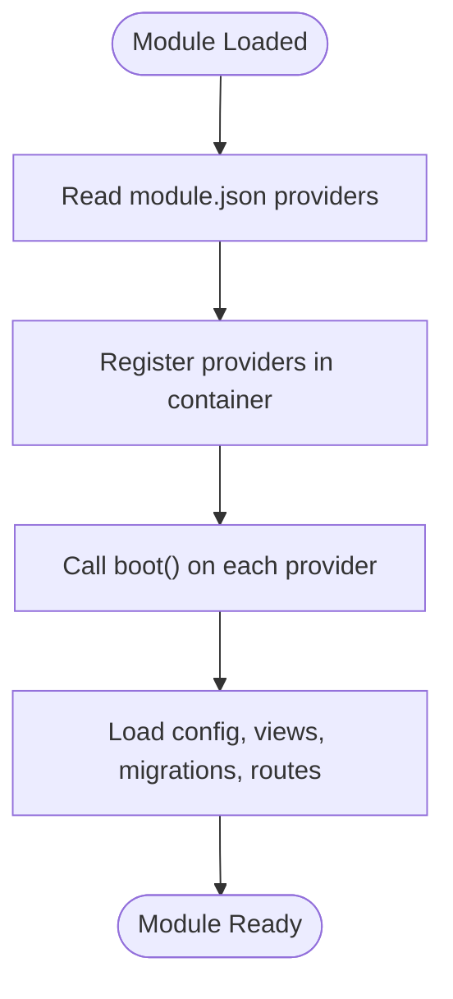
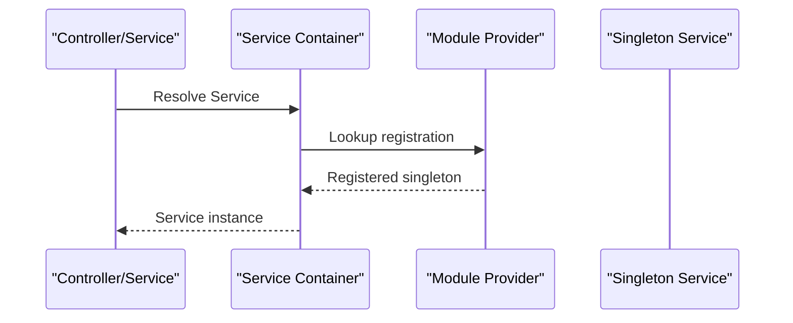
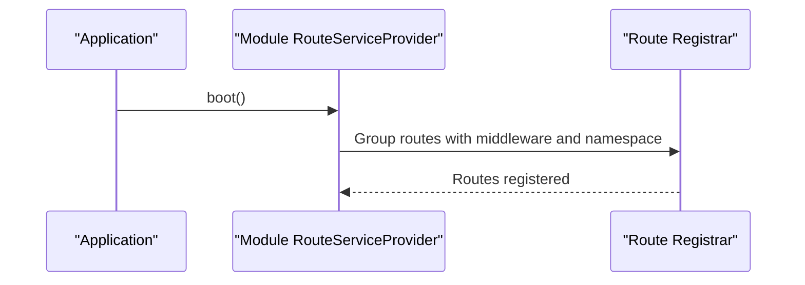
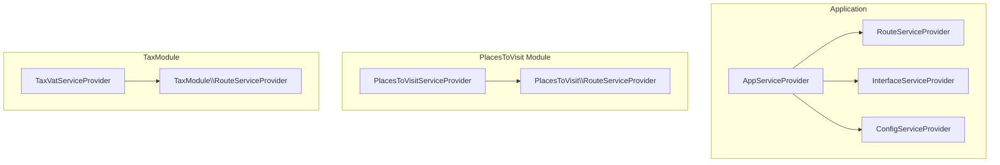

# Service Providers and Registration

<cite>
**Referenced Files in This Document**
- [app.php](file://bootstrap/app.php)
- [app.php](file://config/app.php)
- [modules.php](file://config/modules.php)
- [AppServiceProvider.php](file://app/Providers/AppServiceProvider.php)
- [RouteServiceProvider.php](file://app/Providers/RouteServiceProvider.php)
- [InterfaceServiceProvider.php](file://app/Providers/InterfaceServiceProvider.php)
- [ConfigServiceProvider.php](file://app/Providers/ConfigServiceProvider.php)
- [PlacesToVisitServiceProvider.php](file://Modules/PlacesToVisit/Providers/PlacesToVisitServiceProvider.php)
- [RouteServiceProvider.php](file://Modules/PlacesToVisit/Providers/RouteServiceProvider.php)
- [module.json](file://Modules/PlacesToVisit/module.json)
- [config.php](file://Modules/PlacesToVisit/Config/config.php)
- [TaxVatServiceProvider.php](file://Modules/TaxModule/Providers/TaxVatServiceProvider.php)
- [RouteServiceProvider.php](file://Modules/TaxModule/Providers/RouteServiceProvider.php)
- [module.json](file://Modules/TaxModule/module.json)
- [config.php](file://Modules/TaxModule/Config/config.php)
</cite>

## Table of Contents
1. [Introduction](#introduction)
2. [Project Structure](#project-structure)
3. [Core Components](#core-components)
4. [Architecture Overview](#architecture-overview)
5. [Detailed Component Analysis](#detailed-component-analysis)
6. [Dependency Analysis](#dependency-analysis)
7. [Performance Considerations](#performance-considerations)
8. [Troubleshooting Guide](#troubleshooting-guide)
9. [Conclusion](#conclusion)

## Introduction
This document explains how service providers bootstrap module functionality, register bindings, and configure services in the application. It focuses on the module-level providers and their integration with the Laravel service container, including registration, bootstrapping, dependency injection patterns, and lifecycle hooks. Two concrete examples are documented: the PlacesToVisitServiceProvider and the TaxVatServiceProvider. The guide also covers provider ordering, conditional loading via module activation, and cleanup procedures.

## Project Structure
The application uses Laravel’s standard provider registration mechanism combined with a modular structure powered by the nwidart/laravel-modules package. Providers are declared in the application configuration and module metadata, enabling automatic discovery and bootstrapping of module-specific functionality.

**Diagram sources**
- [app.php:139-186](file://config/app.php#L139-L186)
- [modules.php:246-256](file://config/modules.php#L246-L256)
- [module.json:11-13](file://Modules/PlacesToVisit/module.json#L11-L13)
- [module.json:7-9](file://Modules/TaxModule/module.json#L7-L9)

**Section sources**
- [app.php:139-186](file://config/app.php#L139-L186)
- [modules.php:246-256](file://config/modules.php#L246-L256)
- [module.json:11-13](file://Modules/PlacesToVisit/module.json#L11-L13)
- [module.json:7-9](file://Modules/TaxModule/module.json#L7-L9)

## Core Components
- Application-level providers handle global application concerns such as routing, interface binding, configuration hydration, and shared bootstrap tasks.
- Module-level providers encapsulate module-specific bootstrapping, including configuration publishing, view and translation loading, migration registration, and service binding.

Key responsibilities:
- Provider registration: Declared in application configuration and module metadata.
- Bootstrapping: Executed during application bootstrap to register routes, views, translations, and migrations.
- Dependency injection: Registering singletons and interface-to-concrete bindings.
- Cleanup: Ensuring proper teardown and avoiding memory leaks in long-running contexts.

**Section sources**
- [AppServiceProvider.php:19-47](file://app/Providers/AppServiceProvider.php#L19-L47)
- [RouteServiceProvider.php:46-83](file://app/Providers/RouteServiceProvider.php#L46-L83)
- [InterfaceServiceProvider.php:15-44](file://app/Providers/InterfaceServiceProvider.php#L15-L44)
- [ConfigServiceProvider.php:32-249](file://app/Providers/ConfigServiceProvider.php#L32-L249)
- [PlacesToVisitServiceProvider.php:15-31](file://Modules/PlacesToVisit/Providers/PlacesToVisitServiceProvider.php#L15-L31)
- [TaxVatServiceProvider.php:25-41](file://Modules/TaxModule/Providers/TaxVatServiceProvider.php#L25-L41)

## Architecture Overview
The provider architecture follows a layered approach:
- Application providers are registered globally and executed early in the bootstrap lifecycle.
- Module providers are discovered via module metadata and executed per-module during the application bootstrap phase.
- Route providers within modules map module-specific routes under appropriate prefixes and middleware groups.

**Diagram sources**
- [app.php:139-186](file://config/app.php#L139-L186)
- [modules.php:246-256](file://config/modules.php#L246-L256)
- [PlacesToVisitServiceProvider.php:23-31](file://Modules/PlacesToVisit/Providers/PlacesToVisitServiceProvider.php#L23-L31)
- [RouteServiceProvider.php:12-21](file://Modules/PlacesToVisit/Providers/RouteServiceProvider.php#L12-L21)

## Detailed Component Analysis

### PlacesToVisitServiceProvider
Purpose:
- Registers module services as singletons.
- Publishes and merges module configuration.
- Loads views and translations.
- Loads module migrations.
- Registers module route provider.

Implementation highlights:
- Singleton registrations for domain services.
- Configuration publishing and merging with a dedicated key.
- View paths resolution and translation loading.
- Migration loading from module path.
- Route provider registration and route mapping.

**Diagram sources**
- [PlacesToVisitServiceProvider.php:10-87](file://Modules/PlacesToVisit/Providers/PlacesToVisitServiceProvider.php#L10-L87)
- [RouteServiceProvider.php:8-37](file://Modules/PlacesToVisit/Providers/RouteServiceProvider.php#L8-L37)

**Section sources**
- [PlacesToVisitServiceProvider.php:15-31](file://Modules/PlacesToVisit/Providers/PlacesToVisitServiceProvider.php#L15-L31)
- [PlacesToVisitServiceProvider.php:33-43](file://Modules/PlacesToVisit/Providers/PlacesToVisitServiceProvider.php#L33-L43)
- [PlacesToVisitServiceProvider.php:45-55](file://Modules/PlacesToVisit/Providers/PlacesToVisitServiceProvider.php#L45-L55)
- [PlacesToVisitServiceProvider.php:57-66](file://Modules/PlacesToVisit/Providers/PlacesToVisitServiceProvider.php#L57-L66)
- [PlacesToVisitServiceProvider.php:68-75](file://Modules/PlacesToVisit/Providers/PlacesToVisitServiceProvider.php#L68-L75)
- [module.json:11-13](file://Modules/PlacesToVisit/module.json#L11-L13)

### TaxVatServiceProvider
Purpose:
- Registers module route provider.
- Publishes and merges module configuration.
- Loads views and migrations.

Implementation highlights:
- Minimal service registration; relies on route provider for routing.
- Configuration publishing and merging.
- View publishing and loading.
- Migration loading from module path.

**Diagram sources**
- [TaxVatServiceProvider.php:8-112](file://Modules/TaxModule/Providers/TaxVatServiceProvider.php#L8-L112)
- [RouteServiceProvider.php:8-69](file://Modules/TaxModule/Providers/RouteServiceProvider.php#L8-L69)

**Section sources**
- [TaxVatServiceProvider.php:25-41](file://Modules/TaxModule/Providers/TaxVatServiceProvider.php#L25-L41)
- [TaxVatServiceProvider.php:48-56](file://Modules/TaxModule/Providers/TaxVatServiceProvider.php#L48-L56)
- [TaxVatServiceProvider.php:63-74](file://Modules/TaxModule/Providers/TaxVatServiceProvider.php#L63-L74)
- [module.json:7-9](file://Modules/TaxModule/module.json#L7-L9)

### Application-Level Providers

#### AppServiceProvider
Responsibilities:
- Shares configuration and view data globally.
- Applies global pagination theme.
- Integrates addon routes and payment status flags.

Lifecycle:
- register(): Placeholder for bindings.
- boot(): Executes shared bootstrap logic.

**Section sources**
- [AppServiceProvider.php:19-47](file://app/Providers/AppServiceProvider.php#L19-L47)

#### RouteServiceProvider
Responsibilities:
- Defines route groups for web, admin, vendor-panel, and API versions.
- Configures rate limiting policies.
- Uses a central namespace for controllers.

Lifecycle:
- boot(): Registers route groups and applies middleware and prefixes.

**Section sources**
- [RouteServiceProvider.php:46-83](file://app/Providers/RouteServiceProvider.php#L46-L83)
- [RouteServiceProvider.php:90-103](file://app/Providers/RouteServiceProvider.php#L90-L103)

#### InterfaceServiceProvider
Responsibilities:
- Dynamically binds repository interfaces to their concrete implementations.
- Scans repository and contract directories to establish bindings.

Lifecycle:
- register(): Performs dynamic binding at startup.

**Section sources**
- [InterfaceServiceProvider.php:15-44](file://app/Providers/InterfaceServiceProvider.php#L15-L44)

#### ConfigServiceProvider
Responsibilities:
- Hydrates application configuration from database/business settings.
- Sets mail, payment gateway, timezone, pagination, and other runtime settings.

Lifecycle:
- boot(): Reads settings and updates Config facade values.

**Section sources**
- [ConfigServiceProvider.php:32-249](file://app/Providers/ConfigServiceProvider.php#L32-L249)

### Module Registration and Discovery
- Providers are declared in module metadata files.
- Module scanning and activation are configured in module settings.
- Providers are autoloaded and executed according to the application bootstrap sequence.

**Diagram sources**
- [module.json:11-13](file://Modules/PlacesToVisit/module.json#L11-L13)
- [module.json:7-9](file://Modules/TaxModule/module.json#L7-L9)
- [modules.php:246-256](file://config/modules.php#L246-L256)

**Section sources**
- [module.json:11-13](file://Modules/PlacesToVisit/module.json#L11-L13)
- [module.json:7-9](file://Modules/TaxModule/module.json#L7-L9)
- [modules.php:246-256](file://config/modules.php#L246-L256)

### Dependency Injection Patterns
- Singletons: Domain services are registered as singletons to ensure shared state and performance.
- Interface binding: Dynamic binding of repository interfaces to concrete implementations.
- Container resolution: Services resolved via dependency injection in controllers and other classes.

**Diagram sources**
- [PlacesToVisitServiceProvider.php:27-30](file://Modules/PlacesToVisit/Providers/PlacesToVisitServiceProvider.php#L27-L30)
- [InterfaceServiceProvider.php:20-36](file://app/Providers/InterfaceServiceProvider.php#L20-L36)

**Section sources**
- [PlacesToVisitServiceProvider.php:27-30](file://Modules/PlacesToVisit/Providers/PlacesToVisitServiceProvider.php#L27-L30)
- [InterfaceServiceProvider.php:20-36](file://app/Providers/InterfaceServiceProvider.php#L20-L36)

### Provider Registration Examples
- Routes: Module route providers group routes under web and API prefixes with appropriate middleware and namespaces.
- Middleware: Global and module route providers apply middleware stacks.
- Configuration: Providers publish and merge module configuration into the application.
- Facades: While not explicitly shown in the analyzed files, facades are typically resolved via the container and bound in providers.

**Diagram sources**
- [RouteServiceProvider.php:17-21](file://Modules/PlacesToVisit/Providers/RouteServiceProvider.php#L17-L21)
- [RouteServiceProvider.php:23-36](file://Modules/PlacesToVisit/Providers/RouteServiceProvider.php#L23-L36)

**Section sources**
- [RouteServiceProvider.php:17-36](file://Modules/PlacesToVisit/Providers/RouteServiceProvider.php#L17-L36)
- [RouteServiceProvider.php:34-68](file://Modules/TaxModule/Providers/RouteServiceProvider.php#L34-L68)

### Provider Ordering and Conditional Loading
- Ordering: Providers are loaded in the order they appear in the application configuration and module metadata.
- Conditional loading: Modules are activated/deactivated via the module activator; only enabled modules bootstrap their providers.

**Section sources**
- [app.php:139-186](file://config/app.php#L139-L186)
- [modules.php:267-277](file://config/modules.php#L267-L277)
- [module.json:11-13](file://Modules/PlacesToVisit/module.json#L11-L13)
- [module.json:7-9](file://Modules/TaxModule/module.json#L7-L9)

### Cleanup Procedures
- No explicit cleanup logic was identified in the analyzed provider files. For long-running processes, ensure singletons are stateless or provide reset/cleanup hooks if state accumulation is possible.

**Section sources**
- [PlacesToVisitServiceProvider.php:15-31](file://Modules/PlacesToVisit/Providers/PlacesToVisitServiceProvider.php#L15-L31)
- [TaxVatServiceProvider.php:25-41](file://Modules/TaxModule/Providers/TaxVatServiceProvider.php#L25-L41)
- [InterfaceServiceProvider.php:15-44](file://app/Providers/InterfaceServiceProvider.php#L15-L44)

## Dependency Analysis
This section maps provider dependencies and their relationships.

**Diagram sources**
- [app.php:139-186](file://config/app.php#L139-L186)
- [PlacesToVisitServiceProvider.php:25-30](file://Modules/PlacesToVisit/Providers/PlacesToVisitServiceProvider.php#L25-L30)
- [TaxVatServiceProvider.php:40-41](file://Modules/TaxModule/Providers/TaxVatServiceProvider.php#L40-L41)

**Section sources**
- [app.php:139-186](file://config/app.php#L139-L186)
- [PlacesToVisitServiceProvider.php:25-30](file://Modules/PlacesToVisit/Providers/PlacesToVisitServiceProvider.php#L25-L30)
- [TaxVatServiceProvider.php:40-41](file://Modules/TaxModule/Providers/TaxVatServiceProvider.php#L40-L41)

## Performance Considerations
- Prefer singletons for expensive-to-create services to reduce overhead.
- Minimize heavy operations in provider boot methods; defer to lazy initialization when possible.
- Use module activation to disable unused modules and avoid unnecessary provider bootstrapping.

## Troubleshooting Guide
Common issues and resolutions:
- Provider not loaded: Verify provider class path in module metadata and that the module is enabled in the activator configuration.
- Routes not found: Ensure module route provider registers routes under correct prefixes and namespaces.
- Configuration not applied: Confirm config publishing and merging steps are executed and keys match expected values.
- Interface binding failures: Ensure repository and contract files exist and filenames align with the dynamic binding logic.

**Section sources**
- [modules.php:267-277](file://config/modules.php#L267-L277)
- [RouteServiceProvider.php:17-36](file://Modules/PlacesToVisit/Providers/RouteServiceProvider.php#L17-L36)
- [PlacesToVisitServiceProvider.php:33-43](file://Modules/PlacesToVisit/Providers/PlacesToVisitServiceProvider.php#L33-L43)
- [InterfaceServiceProvider.php:20-36](file://app/Providers/InterfaceServiceProvider.php#L20-L36)

## Conclusion
Service providers are the backbone of module bootstrapping and application configuration in this codebase. Module providers encapsulate domain-specific setup, while application providers manage global concerns. Proper registration, bootstrapping, and dependency injection patterns ensure clean separation of concerns and maintainable extensibility. Following the outlined practices helps achieve predictable provider ordering, efficient conditional loading, and robust cleanup.