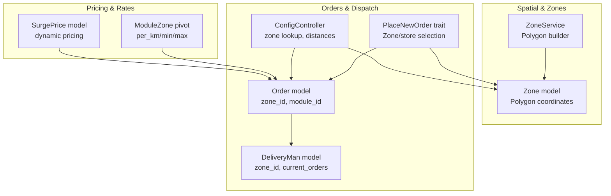
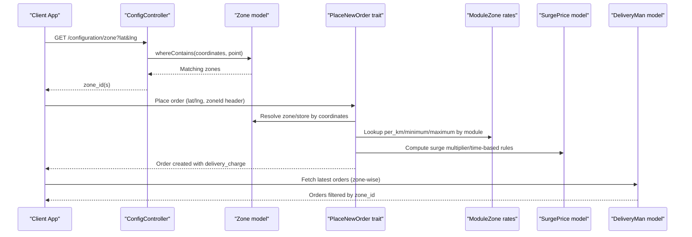
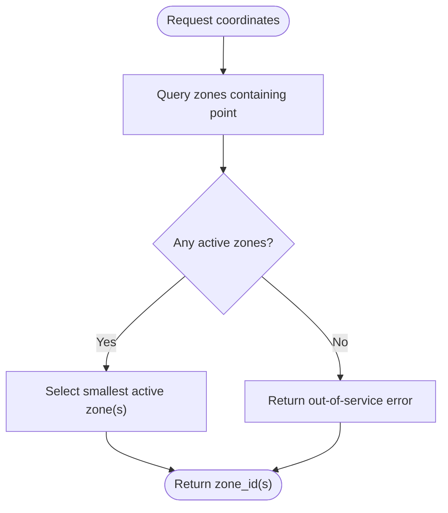
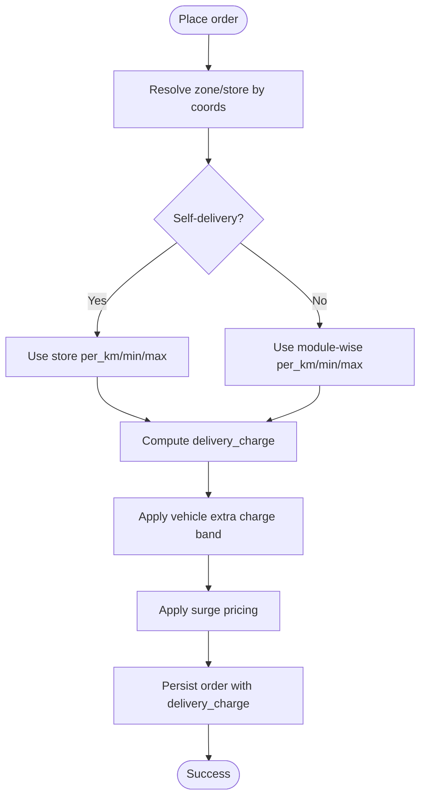
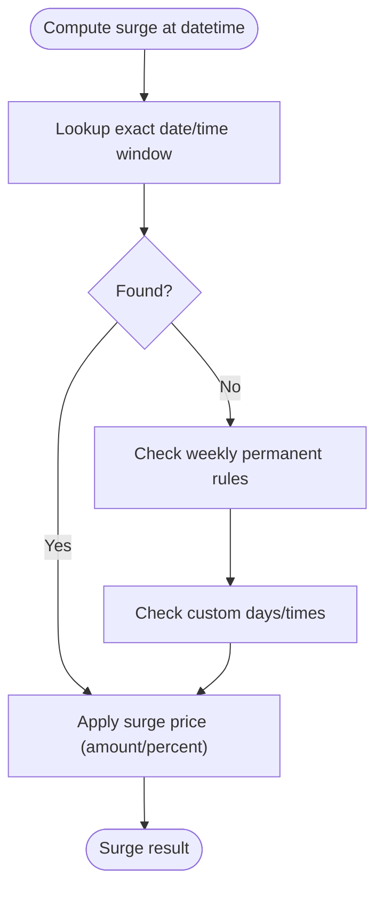
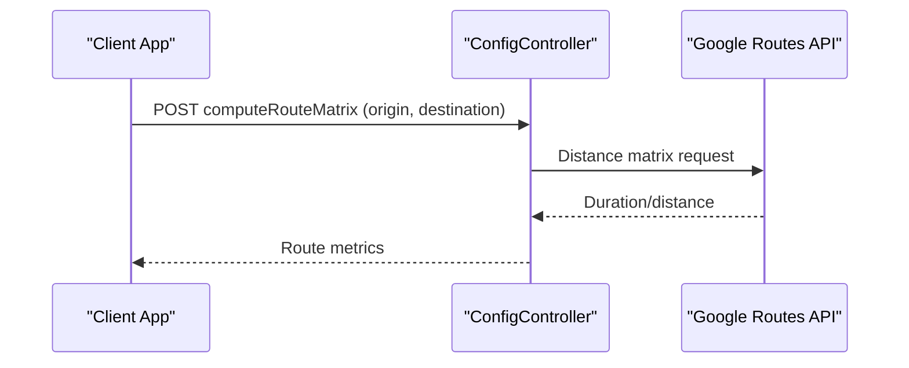
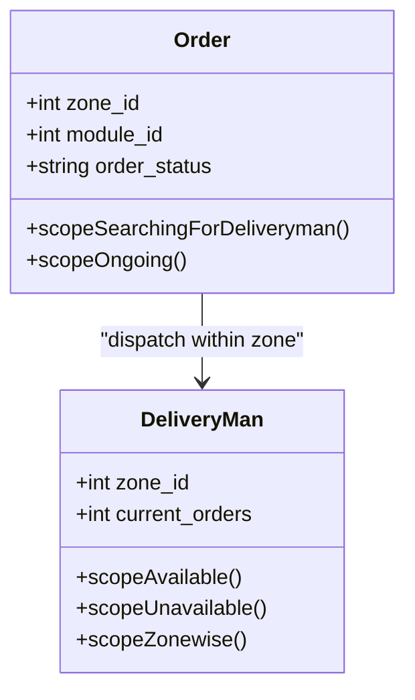
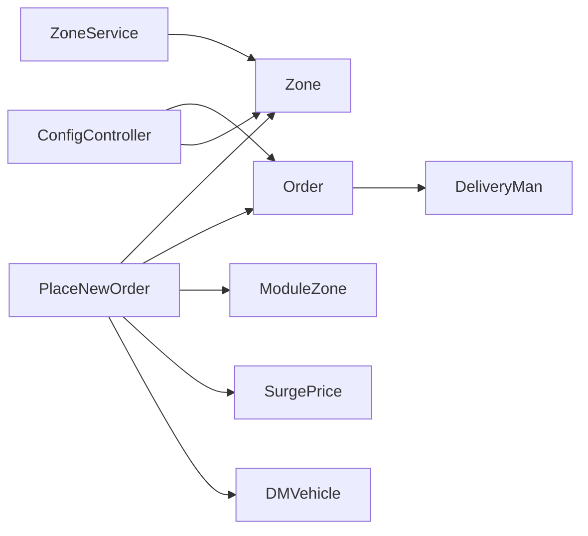

# Delivery Routing

<cite>
**Referenced Files in This Document**
- [Zone.php](file://app/Models/Zone.php)
- [ZoneService.php](file://app/Services/ZoneService.php)
- [PlaceNewOrder.php](file://app/Traits/PlaceNewOrder.php)
- [ConfigController.php](file://app/Http/Controllers/Api/V1/ConfigController.php)
- [Order.php](file://app/Models/Order.php)
- [DeliveryMan.php](file://app/Models/DeliveryMan.php)
- [ModuleZone.php](file://app/Models/ModuleZone.php)
- [SurgePrice.php](file://app/Models/SurgePrice.php)
- [order.php](file://config/order.php)
- [2025_07_13_185456_create_surge_prices_table.php](file://database/migrations/2025_07_13_185456_create_surge_prices_table.php)
- [surge_prices](file://installation/backup/database.sql)
- [DashboardController.php](file://app/Http/Controllers/Admin/DashboardController.php)
- [DeliverymanController.php](file://app/Http/Controllers/Api/V1/DeliverymanController.php)
- [order.php](file://resources/views/admin-views/zone/module-setup.blade.php)
- [index.blade.php](file://resources/views/admin-views/pos/index.blade.php)
- [index.blade.php](file://resources/views/vendor-views/pos/index.blade.php)
</cite>

## Table of Contents
1. [Introduction](#introduction)
2. [Project Structure](#project-structure)
3. [Core Components](#core-components)
4. [Architecture Overview](#architecture-overview)
5. [Detailed Component Analysis](#detailed-component-analysis)
6. [Dependency Analysis](#dependency-analysis)
7. [Performance Considerations](#performance-considerations)
8. [Troubleshooting Guide](#troubleshooting-guide)
9. [Conclusion](#conclusion)

## Introduction
This document explains delivery routing within multi-zone operations. It covers automatic zone detection based on delivery addresses, spatial queries for zone matching, route optimization via external distance matrix APIs, and delivery fee calculations incorporating zone-specific rates, distance-based pricing, and surge pricing during peak hours. It also documents integration with delivery man assignments, order dispatching within designated zones, and real-time zone availability monitoring. Finally, it outlines performance optimization techniques for spatial queries, caching strategies for frequently accessed zones, and fallback mechanisms for zone detection failures.

## Project Structure
The delivery routing system spans several core areas:
- Spatial modeling and zone management
- Order placement and delivery fee calculation
- Distance matrix integration for route estimation
- Surge pricing and dynamic rate adjustments
- Delivery man assignment and dispatch controls
- Configuration and caching for performance

**Diagram sources**
- [Zone.php:1-160](file://app/Models/Zone.php#L1-L160)
- [ZoneService.php:1-126](file://app/Services/ZoneService.php#L1-L126)
- [PlaceNewOrder.php:779-800](file://app/Traits/PlaceNewOrder.php#L779-L800)
- [Order.php:13-358](file://app/Models/Order.php#L1-L358)
- [DeliveryMan.php:1-234](file://app/Models/DeliveryMan.php#L1-L234)
- [ModuleZone.php:1-24](file://app/Models/ModuleZone.php#L1-L24)
- [SurgePrice.php:1-73](file://app/Models/SurgePrice.php#L1-L73)
- [ConfigController.php:327-361](file://app/Http/Controllers/Api/V1/ConfigController.php#L327-L361)

**Section sources**
- [Zone.php:1-160](file://app/Models/Zone.php#L1-L160)
- [ZoneService.php:1-126](file://app/Services/ZoneService.php#L1-L126)
- [PlaceNewOrder.php:779-800](file://app/Traits/PlaceNewOrder.php#L779-L800)
- [Order.php:13-358](file://app/Models/Order.php#L1-L358)
- [DeliveryMan.php:1-234](file://app/Models/DeliveryMan.php#L1-L234)
- [ModuleZone.php:1-24](file://app/Models/ModuleZone.php#L1-L24)
- [SurgePrice.php:1-73](file://app/Models/SurgePrice.php#L1-L73)
- [ConfigController.php:327-361](file://app/Http/Controllers/Api/V1/ConfigController.php#L327-L361)

## Core Components
- Zone model with spatial polygon support and module associations
- ZoneService for constructing polygons from coordinate inputs
- PlaceNewOrder trait orchestrating zone/store selection, delivery fee computation, and surge pricing
- ConfigController exposing zone lookup and distance matrix APIs
- Order model linking orders to zones, modules, and delivery men
- DeliveryMan model tracking availability and zone constraints
- ModuleZone pivot defining per-zone, per-module delivery cost policies
- SurgePrice model and database schema for dynamic pricing

**Section sources**
- [Zone.php:1-160](file://app/Models/Zone.php#L1-L160)
- [ZoneService.php:1-126](file://app/Services/ZoneService.php#L1-L126)
- [PlaceNewOrder.php:779-800](file://app/Traits/PlaceNewOrder.php#L779-L800)
- [ConfigController.php:327-361](file://app/Http/Controllers/Api/V1/ConfigController.php#L327-L361)
- [Order.php:13-358](file://app/Models/Order.php#L1-L358)
- [DeliveryMan.php:1-234](file://app/Models/DeliveryMan.php#L1-L234)
- [ModuleZone.php:1-24](file://app/Models/ModuleZone.php#L1-L24)
- [SurgePrice.php:1-73](file://app/Models/SurgePrice.php#L1-L73)

## Architecture Overview
The system integrates spatial queries, external distance matrix APIs, and dynamic pricing to deliver a robust multi-zone routing pipeline.

**Diagram sources**
- [ConfigController.php:327-361](file://app/Http/Controllers/Api/V1/ConfigController.php#L327-L361)
- [Zone.php:135-137](file://app/Models/Zone.php#L135-L137)
- [PlaceNewOrder.php:779-800](file://app/Traits/PlaceNewOrder.php#L779-L800)
- [ModuleZone.php:14-22](file://app/Models/ModuleZone.php#L14-L22)
- [SurgePrice.php:26-29](file://app/Models/SurgePrice.php#L26-L29)
- [DeliverymanController.php:175-203](file://app/Http/Controllers/Api/V1/DeliverymanController.php#L175-L203)

## Detailed Component Analysis

### Automatic Zone Detection and Spatial Queries
- Zone detection uses spatial containment checks against polygon coordinates.
- The controller endpoint returns matching zones ordered by polygon area to prioritize smaller, more precise zones.
- Fallback occurs when no zones are found or all inactive.

**Diagram sources**
- [ConfigController.php:327-361](file://app/Http/Controllers/Api/V1/ConfigController.php#L327-L361)
- [Zone.php:135-137](file://app/Models/Zone.php#L135-L137)

**Section sources**
- [ConfigController.php:327-361](file://app/Http/Controllers/Api/V1/ConfigController.php#L327-L361)
- [Zone.php:135-137](file://app/Models/Zone.php#L135-L137)

### Order Placement, Zone/Store Resolution, and Delivery Fee Calculation
- During order placement, the system resolves the drop-off zone and store using spatial queries and module filters.
- Delivery fees are computed using either fixed or distance-based rules defined per module per zone.
- Optional store-level self-delivery overrides module rules.
- Vehicle coverage checks add extra charges based on distance bands.

**Diagram sources**
- [PlaceNewOrder.php:779-800](file://app/Traits/PlaceNewOrder.php#L779-L800)
- [PlaceNewOrder.php:949-969](file://app/Traits/PlaceNewOrder.php#L949-L969)
- [PlaceNewOrder.php:768-778](file://app/Traits/PlaceNewOrder.php#L768-L778)
- [ModuleZone.php:14-22](file://app/Models/ModuleZone.php#L14-L22)

**Section sources**
- [PlaceNewOrder.php:779-800](file://app/Traits/PlaceNewOrder.php#L779-L800)
- [PlaceNewOrder.php:949-969](file://app/Traits/PlaceNewOrder.php#L949-L969)
- [PlaceNewOrder.php:768-778](file://app/Traits/PlaceNewOrder.php#L768-L778)
- [ModuleZone.php:14-22](file://app/Models/ModuleZone.php#L14-L22)

### Surge Pricing During Peak Hours
- Surge pricing is defined per zone and module, with support for daily, weekly, and custom schedules.
- The system checks exact-date applicability first, then weekly permanent rules, and finally custom-day/time windows.
- Surge rules include amount or percent modifiers and optional customer-facing notes.

**Diagram sources**
- [PlaceNewOrder.php:1916-1968](file://app/Traits/PlaceNewOrder.php#L1916-L1968)
- [SurgePrice.php:13-19](file://app/Models/SurgePrice.php#L13-L19)
- [2025_07_13_185456_create_surge_prices_table.php:14-34](file://database/migrations/2025_07_13_185456_create_surge_prices_table.php#L14-L34)
- [surge_prices:3348-3369](file://installation/backup/database.sql#L3348-L3369)

**Section sources**
- [PlaceNewOrder.php:1916-1968](file://app/Traits/PlaceNewOrder.php#L1916-L1968)
- [SurgePrice.php:13-19](file://app/Models/SurgePrice.php#L13-L19)
- [2025_07_13_185456_create_surge_prices_table.php:14-34](file://database/migrations/2025_07_13_185456_create_surge_prices_table.php#L14-L34)
- [surge_prices:3348-3369](file://installation/backup/database.sql#L3348-L3369)

### Route Optimization and Distance Matrix Integration
- The system integrates with Google Routes Distance Matrix API to compute durations and distances between locations.
- The ConfigController exposes endpoints to fetch distance matrices and place details, enabling accurate fee estimation and route planning.

**Diagram sources**
- [ConfigController.php:398-442](file://app/Http/Controllers/Api/V1/ConfigController.php#L398-L442)

**Section sources**
- [ConfigController.php:398-442](file://app/Http/Controllers/Api/V1/ConfigController.php#L398-L442)

### Delivery Man Assignments and Dispatching Within Designated Zones
- Delivery managers can filter unassigned and ongoing orders by module and zone.
- DeliveryMan model enforces zone-wise assignment and capacity constraints (maximum orders).
- The system tracks availability and dispatch status for real-time monitoring.

**Diagram sources**
- [Order.php:272-294](file://app/Models/Order.php#L272-L294)
- [DeliveryMan.php:150-158](file://app/Models/DeliveryMan.php#L150-L158)
- [DashboardController.php:180-203](file://app/Http/Controllers/Admin/DashboardController.php#L180-L203)

**Section sources**
- [Order.php:272-294](file://app/Models/Order.php#L272-L294)
- [DeliveryMan.php:150-158](file://app/Models/DeliveryMan.php#L150-L158)
- [DashboardController.php:180-203](file://app/Http/Controllers/Admin/DashboardController.php#L180-L203)
- [DeliverymanController.php:175-203](file://app/Http/Controllers/Api/V1/DeliverymanController.php#L175-L203)

### Real-Time Zone Availability Monitoring
- Admin dashboards expose counts of available vs unavailable delivery men per zone.
- Dispatch lists show unassigned and ongoing orders per module and zone for timely intervention.

**Section sources**
- [DashboardController.php:180-203](file://app/Http/Controllers/Admin/DashboardController.php#L180-L203)
- [resources/views/admin-views/dashboard-dispatch.blade.php:73-96](file://resources/views/admin-views/dashboard-dispatch.blade.php#L73-L96)

## Dependency Analysis
- ZoneService depends on spatial objects to construct polygons from raw coordinates.
- PlaceNewOrder depends on Zone, Store, ModuleZone, DMVehicle, and SurgePrice models.
- ConfigController depends on external APIs for geocoding and distance matrix.
- Order and DeliveryMan scopes enforce zone-aware filtering and capacity checks.

**Diagram sources**
- [ZoneService.php:1-126](file://app/Services/ZoneService.php#L1-L126)
- [PlaceNewOrder.php:779-800](file://app/Traits/PlaceNewOrder.php#L779-L800)
- [ConfigController.php:327-361](file://app/Http/Controllers/Api/V1/ConfigController.php#L327-L361)
- [Order.php:13-358](file://app/Models/Order.php#L1-L358)
- [DeliveryMan.php:1-234](file://app/Models/DeliveryMan.php#L1-L234)

**Section sources**
- [ZoneService.php:1-126](file://app/Services/ZoneService.php#L1-L126)
- [PlaceNewOrder.php:779-800](file://app/Traits/PlaceNewOrder.php#L779-L800)
- [ConfigController.php:327-361](file://app/Http/Controllers/Api/V1/ConfigController.php#L327-L361)
- [Order.php:13-358](file://app/Models/Order.php#L1-L358)
- [DeliveryMan.php:1-234](file://app/Models/DeliveryMan.php#L1-L234)

## Performance Considerations
- Spatial queries: Use indexed polygon fields and leverage the spatial extension’s optimized containment checks. Prefer filtering by module and status early to reduce candidate sets.
- Caching: Cache frequently accessed zone configurations and business settings to minimize repeated database hits.
- Distance matrix calls: Cache route metrics for repeated origin-destination pairs and apply timeouts to avoid blocking requests.
- Capacity checks: Enforce delivery man capacity constraints at query time to avoid over-assignment.
- Configuration: Tune maximum orders per delivery man and scheduling lookahead windows to balance workload.

[No sources needed since this section provides general guidance]

## Troubleshooting Guide
Common issues and resolutions:
- Out-of-coverage area: When no zones contain the given coordinates, the zone lookup returns an error. Clients should prompt re-entry or suggest nearby addresses.
- No matching store in zone: For non-parcel orders, ensure the store belongs to the resolved zone and is open at the requested time.
- Surge pricing not applied: Verify surge rules are active, dates/times match, and module/zone associations are correct.
- Vehicle extra charge not applied: Confirm distance falls within a coverage band; otherwise, extra charges remain zero.
- Dispatch capacity exceeded: If a delivery man exceeds maximum orders, the system marks them unavailable; adjust assignments or increase thresholds.

**Section sources**
- [ConfigController.php:337-361](file://app/Http/Controllers/Api/V1/ConfigController.php#L337-L361)
- [PlaceNewOrder.php:798-800](file://app/Traits/PlaceNewOrder.php#L798-L800)
- [PlaceNewOrder.php:1916-1968](file://app/Traits/PlaceNewOrder.php#L1916-L1968)
- [PlaceNewOrder.php:768-778](file://app/Traits/PlaceNewOrder.php#L768-L778)
- [order.php:17-24](file://config/order.php#L17-L24)

## Conclusion
The multi-zone delivery routing system combines spatial zone detection, module-aware pricing, dynamic surge pricing, and real-time dispatch controls. By leveraging spatial queries, external distance matrix APIs, and capacity-aware delivery man models, it ensures accurate, scalable, and responsive order routing across zones. Proper caching, validation, and fallback mechanisms further improve reliability and performance.