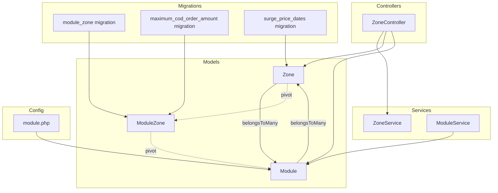
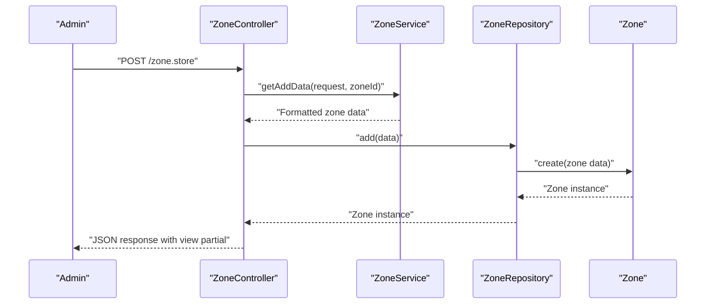
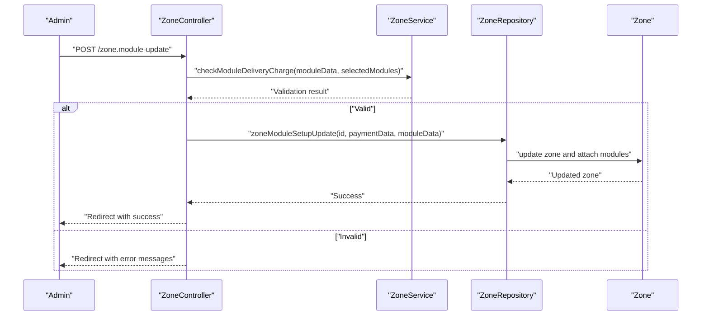
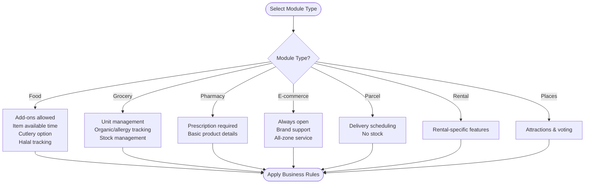
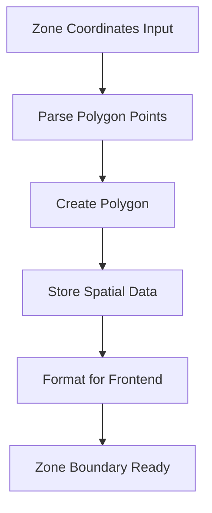
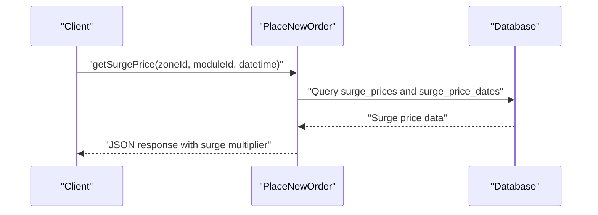
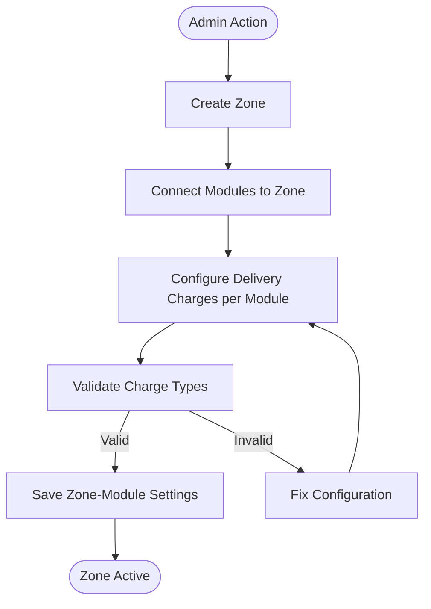
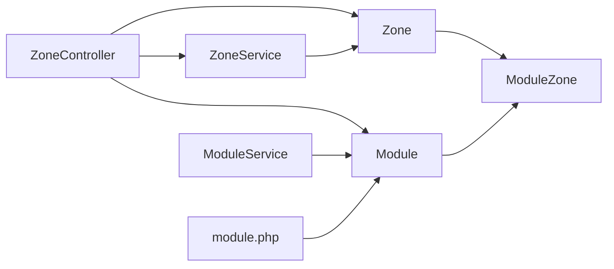

# Module-Zone Integration

<cite>
**Referenced Files in This Document**
- [Zone.php](file://app/Models/Zone.php)
- [Module.php](file://app/Models/Module.php)
- [ModuleZone.php](file://app/Models/ModuleZone.php)
- [ZoneService.php](file://app/Services/ZoneService.php)
- [ModuleService.php](file://app/Services/ModuleService.php)
- [ZoneController.php](file://app/Http/Controllers/Admin/Zone/ZoneController.php)
- [module.php](file://config/module.php)
- [2022_10_20_105050_module_zone.php](file://database/migrations/2022_10_20_105050_module_zone.php)
- [2022_12_29_105321_add_maximum_cod_order_amount_column_to_module_zone_table.php](file://database/migrations/2022_12_29_105321_add_maximum_cod_order_amount_column_to_module_zone_table.php)
- [ZoneModuleUpdateRequest.php](file://app/Http/Requests/Admin/ZoneModuleUpdateRequest.php)
- [PlaceNewOrder.php](file://app/Traits/PlaceNewOrder.php)
- [SurgePriceController.php](file://app/Http/Controllers/Admin/SurgePriceController.php)
- [2025_07_13_192359_create_surge_price_dates_table.php](file://database/migrations/2025_07_13_192359_create_surge_price_dates_table.php)
</cite>

## Table of Contents
1. [Introduction](#introduction)
2. [Project Structure](#project-structure)
3. [Core Components](#core-components)
4. [Architecture Overview](#architecture-overview)
5. [Detailed Component Analysis](#detailed-component-analysis)
6. [Dependency Analysis](#dependency-analysis)
7. [Performance Considerations](#performance-considerations)
8. [Troubleshooting Guide](#troubleshooting-guide)
9. [Conclusion](#conclusion)

## Introduction
This document explains how business modules integrate with geographic zones and how different business models operate within specific zones with customized configurations. It covers module-specific zone settings, service area limitations, business rule adaptations per module type, zone assignment workflows, module activation within zones, cross-module coordination, and operational constraints across different business models within the same geographic area.

## Project Structure
The module-zone integration spans several core areas:
- Models representing Zones, Modules, and the junction table ModuleZone
- Services handling zone geometry parsing, payment method setup, and delivery charge validation
- Controllers orchestrating admin workflows for zone creation, updates, and module setup
- Configuration defining business module capabilities and constraints
- Migrations establishing the relational schema and evolving fields



**Diagram sources**
- [Zone.php:150-153](file://app/Models/Zone.php#L150-L153)
- [Module.php:201-204](file://app/Models/Module.php#L201-L204)
- [ModuleZone.php:10-23](file://app/Models/ModuleZone.php#L10-L23)
- [ZoneService.php:9-126](file://app/Services/ZoneService.php#L9-L126)
- [ModuleService.php:7-54](file://app/Services/ModuleService.php#L7-L54)
- [ZoneController.php:28-347](file://app/Http/Controllers/Admin/Zone/ZoneController.php#L28-L347)
- [module.php:1-192](file://config/module.php#L1-L192)
- [2022_10_20_105050_module_zone.php:14-24](file://database/migrations/2022_10_20_105050_module_zone.php#L14-L24)
- [2022_12_29_105321_add_maximum_cod_order_amount_column_to_module_zone_table.php:14-18](file://database/migrations/2022_12_29_105321_add_maximum_cod_order_amount_column_to_module_zone_table.php#L14-L18)
- [2025_07_13_192359_create_surge_price_dates_table.php:14-24](file://database/migrations/2025_07_13_192359_create_surge_price_dates_table.php#L14-L24)

**Section sources**
- [Zone.php:37-160](file://app/Models/Zone.php#L37-L160)
- [Module.php:32-240](file://app/Models/Module.php#L32-L240)
- [ModuleZone.php:10-23](file://app/Models/ModuleZone.php#L10-L23)
- [ZoneService.php:9-126](file://app/Services/ZoneService.php#L9-L126)
- [ModuleService.php:7-54](file://app/Services/ModuleService.php#L7-L54)
- [ZoneController.php:28-347](file://app/Http/Controllers/Admin/Zone/ZoneController.php#L28-L347)
- [module.php:1-192](file://config/module.php#L1-L192)
- [2022_10_20_105050_module_zone.php:14-24](file://database/migrations/2022_10_20_105050_module_zone.php#L14-L24)
- [2022_12_29_105321_add_maximum_cod_order_amount_column_to_module_zone_table.php:14-18](file://database/migrations/2022_12_29_105321_add_maximum_cod_order_amount_column_to_module_zone_table.php#L14-L18)
- [2025_07_13_192359_create_surge_price_dates_table.php:14-24](file://database/migrations/2025_07_13_192359_create_surge_price_dates_table.php#L14-L24)

## Core Components
- Zone: Geographic boundaries with payment method flags, delivery fee configuration, and relationships to stores, delivery men, orders, campaigns, and modules via ModuleZone pivot.
- Module: Business capability definitions (e.g., food, grocery, pharmacy, parcel) with type-specific features and relationships to stores and items.
- ModuleZone: Pivot table storing per-zone module settings including shipping charges and COD limits.
- ZoneService: Parses polygon coordinates, formats data for zone creation/update, validates module delivery charge configurations, and prepares payment setup data.
- ModuleService: Handles module image uploads and prepares module data for admin operations.
- ZoneController: Manages zone lifecycle, module setup, payment method toggles, and coordinate retrieval.
- Configuration: Defines module types and their business rule variations (stock, add-ons, scheduling, etc.).

**Section sources**
- [Zone.php:37-160](file://app/Models/Zone.php#L37-L160)
- [Module.php:32-240](file://app/Models/Module.php#L32-L240)
- [ModuleZone.php:10-23](file://app/Models/ModuleZone.php#L10-L23)
- [ZoneService.php:9-126](file://app/Services/ZoneService.php#L9-L126)
- [ModuleService.php:7-54](file://app/Services/ModuleService.php#L7-L54)
- [ZoneController.php:28-347](file://app/Http/Controllers/Admin/Zone/ZoneController.php#L28-L347)
- [module.php:1-192](file://config/module.php#L1-L192)

## Architecture Overview
The system integrates zones and modules through a many-to-many relationship with a pivot table that carries module-specific zone settings. Admin workflows configure payment methods and delivery charges per module within a zone, while configuration files define business rule adaptations per module type.

```mermaid
classDiagram
class Zone {
+int id
+string name
+string display_name
+Polygon coordinates
+int status
+bool cash_on_delivery
+bool digital_payment
+bool offline_payment
+hasMany stores()
+hasMany deliverymen()
+hasManyThrough orders()
+hasManyThrough campaigns()
+belongsToMany modules()
}
class Module {
+int id
+string module_name
+string module_type
+string icon
+string thumbnail
+bool status
+bool all_zone_service
+hasMany stores()
+hasMany items()
+belongsToMany zones()
}
class ModuleZone {
+int id
+int module_id
+int zone_id
+float per_km_shipping_charge
+float minimum_shipping_charge
+float maximum_shipping_charge
+float maximum_cod_order_amount
}
Zone ||--o{ ModuleZone : "pivot"
Module ||--o{ ModuleZone : "pivot"
```

**Diagram sources**
- [Zone.php:104-153](file://app/Models/Zone.php#L104-L153)
- [Module.php:70-204](file://app/Models/Module.php#L70-L204)
- [ModuleZone.php:14-22](file://app/Models/ModuleZone.php#L14-L22)

## Detailed Component Analysis

### Zone Management and Payment Methods
- Zone creation parses polygon coordinates into spatial polygons and assigns zone-specific messaging topics.
- Payment method flags (cash on delivery, digital payment, offline payment) are validated and stored at the zone level.
- ZoneController enforces that at least one payment method must be enabled and that modules must be connected before enabling certain payment options.



**Diagram sources**
- [ZoneController.php:59-80](file://app/Http/Controllers/Admin/Zone/ZoneController.php#L59-L80)
- [ZoneService.php:12-37](file://app/Services/ZoneService.php#L12-L37)

**Section sources**
- [ZoneController.php:59-127](file://app/Http/Controllers/Admin/Zone/ZoneController.php#L59-L127)
- [ZoneService.php:12-37](file://app/Services/ZoneService.php#L12-L37)

### Module Setup Within Zones
- Admins connect modules to zones and configure delivery charges per module.
- ZoneController validates delivery charge configurations based on charge type (fixed vs distance) and ensures required fields are present.
- The system supports maximum COD order amounts per module-zone pair.



**Diagram sources**
- [ZoneController.php:178-233](file://app/Http/Controllers/Admin/Zone/ZoneController.php#L178-L233)
- [ZoneService.php:94-123](file://app/Services/ZoneService.php#L94-L123)
- [ZoneModuleUpdateRequest.php:35-52](file://app/Http/Requests/Admin/ZoneModuleUpdateRequest.php#L35-L52)

**Section sources**
- [ZoneController.php:157-176](file://app/Http/Controllers/Admin/Zone/ZoneController.php#L157-L176)
- [ZoneController.php:178-233](file://app/Http/Controllers/Admin/Zone/ZoneController.php#L178-L233)
- [ZoneService.php:62-72](file://app/Services/ZoneService.php#L62-L72)
- [ZoneService.php:94-123](file://app/Services/ZoneService.php#L94-L123)
- [ZoneModuleUpdateRequest.php:20-53](file://app/Http/Requests/Admin/ZoneModuleUpdateRequest.php#L20-L53)

### Business Rule Adaptations Per Module Type
- Configuration defines distinct capabilities for each module type:
  - Food: add-ons, item available time, cutlery, halal compliance
  - Grocery: unit management, organic and allergy tracking
  - Pharmacy: prescription requirement, basic product details
  - E-commerce: always open, brand support, all-zone service
  - Parcel: dedicated delivery scheduling, no stock management
  - Rental and Places: specialized features for rental and attraction modules
- These rules influence UI behavior, validation, and operational constraints.



**Diagram sources**
- [module.php:8-192](file://config/module.php#L8-L192)

**Section sources**
- [module.php:1-192](file://config/module.php#L1-L192)

### Service Area Limitations and Spatial Boundaries
- Zones are defined by polygon coordinates stored as spatial data, enabling proximity checks and boundary enforcement.
- ZoneService formats coordinates for frontend display and maintains topic identifiers for zone-specific notifications.



**Diagram sources**
- [ZoneService.php:12-37](file://app/Services/ZoneService.php#L12-L37)
- [Zone.php:22-73](file://app/Models/Zone.php#L22-L73)

**Section sources**
- [ZoneService.php:74-92](file://app/Services/ZoneService.php#L74-L92)
- [Zone.php:22-73](file://app/Models/Zone.php#L22-L73)

### Cross-Module Coordination and Operational Constraints
- Surges and pricing can be configured per zone and module combination, with conflict detection preventing overlapping schedules.
- PlaceNewOrder trait retrieves surge pricing considering zone, module, and datetime, ensuring dynamic pricing alignment with business rules.



**Diagram sources**
- [PlaceNewOrder.php:1909-1935](file://app/Traits/PlaceNewOrder.php#L1909-L1935)
- [SurgePriceController.php:505-554](file://app/Http/Controllers/Admin/SurgePriceController.php#L505-L554)
- [2025_07_13_192359_create_surge_price_dates_table.php:14-24](file://database/migrations/2025_07_13_192359_create_surge_price_dates_table.php#L14-L24)

**Section sources**
- [PlaceNewOrder.php:1909-1935](file://app/Traits/PlaceNewOrder.php#L1909-L1935)
- [SurgePriceController.php:505-554](file://app/Http/Controllers/Admin/SurgePriceController.php#L505-L554)
- [2025_07_13_192359_create_surge_price_dates_table.php:14-24](file://database/migrations/2025_07_13_192359_create_surge_price_dates_table.php#L14-L24)

### Zone Assignment Workflows
- Admin creates zones with polygon boundaries and payment method flags.
- Admin connects modules to zones and sets delivery charge configurations per module.
- ZoneController enforces validation rules and prevents deletion if active orders exist.



**Diagram sources**
- [ZoneController.php:59-80](file://app/Http/Controllers/Admin/Zone/ZoneController.php#L59-L80)
- [ZoneController.php:178-233](file://app/Http/Controllers/Admin/Zone/ZoneController.php#L178-L233)

**Section sources**
- [ZoneController.php:59-80](file://app/Http/Controllers/Admin/Zone/ZoneController.php#L59-L80)
- [ZoneController.php:178-233](file://app/Http/Controllers/Admin/Zone/ZoneController.php#L178-L233)

## Dependency Analysis
- Zone depends on Module through ModuleZone pivot, carrying per-zone module settings.
- ZoneService depends on spatial data structures for coordinate parsing and validation.
- ZoneController orchestrates repository interactions and applies business validations.
- Configuration module.php defines module capabilities that influence zone-module behavior.



**Diagram sources**
- [ZoneController.php:28-347](file://app/Http/Controllers/Admin/Zone/ZoneController.php#L28-L347)
- [ZoneService.php:9-126](file://app/Services/ZoneService.php#L9-L126)
- [ModuleService.php:7-54](file://app/Services/ModuleService.php#L7-L54)
- [module.php:1-192](file://config/module.php#L1-L192)

**Section sources**
- [ZoneController.php:28-347](file://app/Http/Controllers/Admin/Zone/ZoneController.php#L28-L347)
- [ZoneService.php:9-126](file://app/Services/ZoneService.php#L9-L126)
- [ModuleService.php:7-54](file://app/Services/ModuleService.php#L7-L54)
- [module.php:1-192](file://config/module.php#L1-L192)

## Performance Considerations
- Spatial queries on polygon coordinates should be indexed appropriately for efficient containment checks.
- Batch operations for zone exports and coordinate formatting can leverage pagination to avoid memory spikes.
- Validation of delivery charge configurations occurs server-side; ensure minimal redundant computations by validating only changed modules.

## Troubleshooting Guide
Common issues and resolutions:
- Payment method validation failures: Ensure at least one payment method is enabled per zone and that modules are connected before enabling certain payment options.
- Delivery charge configuration errors: Verify required fields for fixed or distance-based charge types and ensure maximum charge is not less than minimum charge.
- Surge pricing conflicts: Resolve overlapping surge price dates or weekly schedules for the same zone and module combination.
- Zone deletion blocked: Complete ongoing orders in the zone before deletion.

**Section sources**
- [ZoneController.php:181-184](file://app/Http/Controllers/Admin/Zone/ZoneController.php#L181-L184)
- [ZoneController.php:265-272](file://app/Http/Controllers/Admin/Zone/ZoneController.php#L265-L272)
- [ZoneController.php:287-294](file://app/Http/Controllers/Admin/Zone/ZoneController.php#L287-L294)
- [ZoneController.php:309-317](file://app/Http/Controllers/Admin/Zone/ZoneController.php#L309-L317)
- [ZoneController.php:119-123](file://app/Http/Controllers/Admin/Zone/ZoneController.php#L119-L123)
- [ZoneService.php:94-123](file://app/Services/ZoneService.php#L94-L123)
- [SurgePriceController.php:505-554](file://app/Http/Controllers/Admin/SurgePriceController.php#L505-L554)

## Conclusion
The module-zone integration enables fine-grained customization of business operations across geographic boundaries. By leveraging spatial boundaries, per-zone module settings, and configuration-driven business rules, the system supports diverse business models (food, grocery, pharmacy, parcel, etc.) within the same area while maintaining operational coherence and preventing conflicts through validation and conflict detection mechanisms.