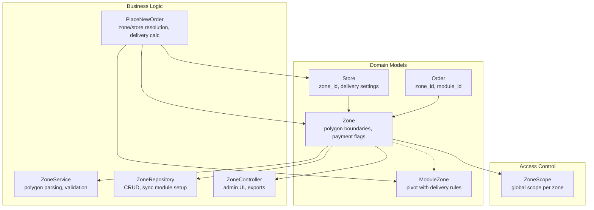
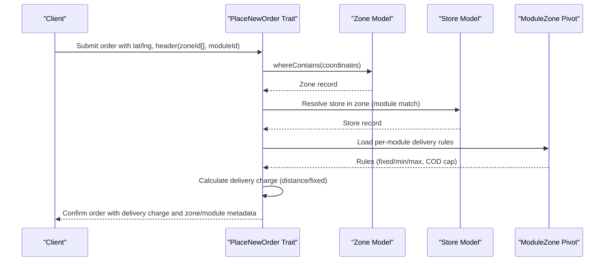
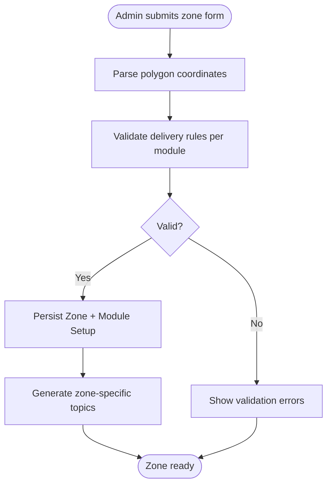
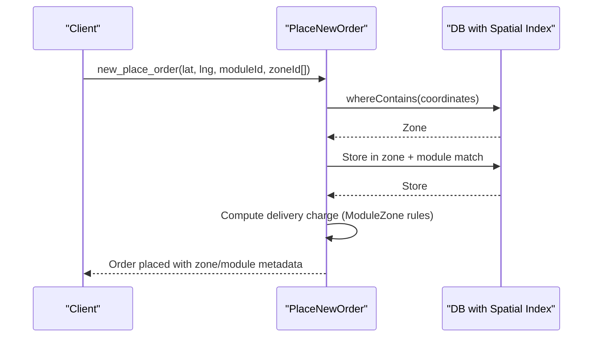
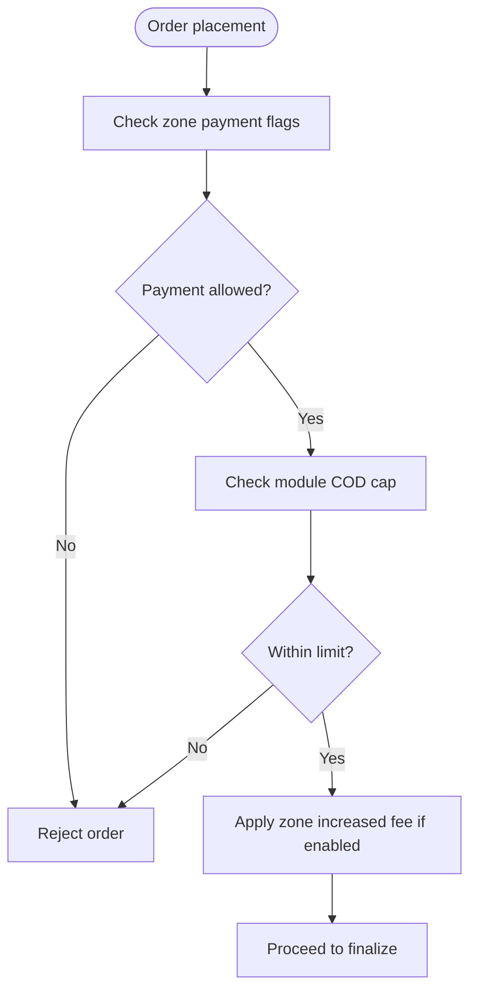
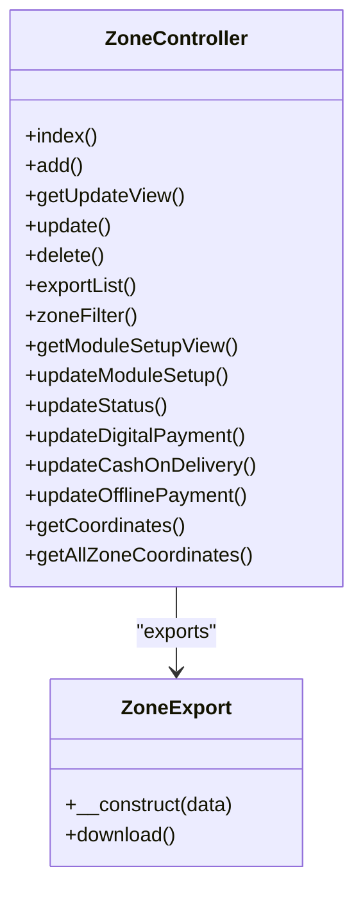
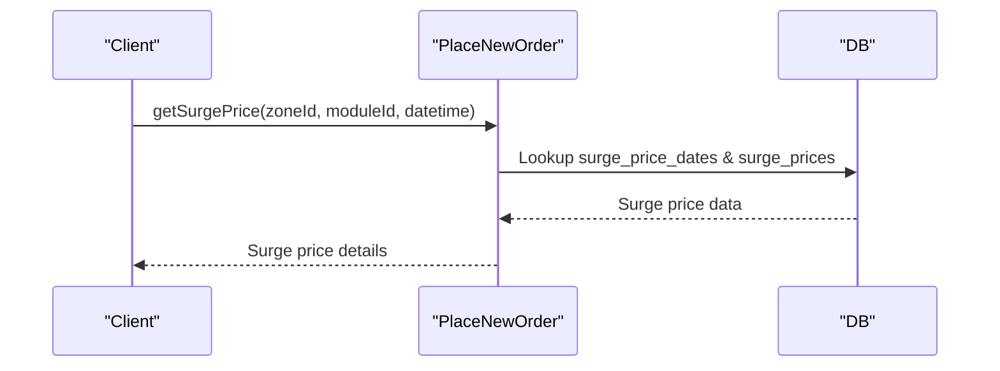
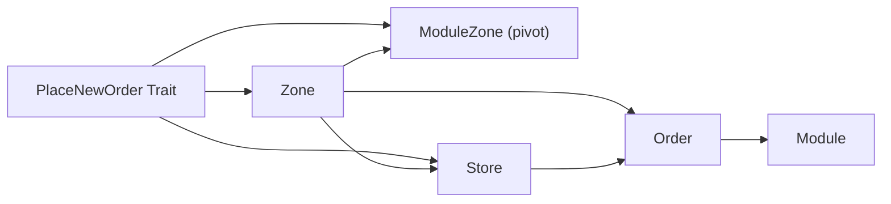

# Multi-zone Operations

<cite>
**Referenced Files in This Document**
- [Zone.php](file://app/Models/Zone.php)
- [ZoneService.php](file://app/Services/ZoneService.php)
- [ZoneRepository.php](file://app/Repositories/ZoneRepository.php)
- [ZoneController.php](file://app/Http/Controllers/Admin/Zone/ZoneController.php)
- [ZoneController.php (API)](file://app/Http/Controllers/Api/V1/ZoneController.php)
- [PlaceNewOrder.php](file://app/Traits/PlaceNewOrder.php)
- [Order.php](file://app/Models/Order.php)
- [Store.php](file://app/Models/Store.php)
- [ZoneScope.php](file://app/Scopes/ZoneScope.php)
- [ModuleZone.php](file://app/Models/ModuleZone.php)
- [ZoneExport.php](file://app/Exports/ZoneExport.php)
- [Zone.php (Admin Enum)](file://app/Enums/ExportFileNames/Admin/Zone.php)
- [Zone.php (Admin View Path)](file://app/Enums/ViewPaths/Admin/Zone.php)
- [ZoneAddRequest.php](file://app/Http/Requests/Admin/ZoneAddRequest.php)
- [ZoneUpdateRequest.php](file://app/Http/Requests/Admin/ZoneUpdateRequest.php)
- [ZoneModuleUpdateRequest.php](file://app/Http/Requests/Admin/ZoneModuleUpdateRequest.php)
- [ZoneRepositoryInterface.php](file://app/Contracts/Repositories/ZoneRepositoryInterface.php)
- [ZoneController.php (Dashboard)](file://app/Http/Controllers/Admin/DashboardController.php)
- [dashboard.blade.php](file://resources/views/admin-views/order/order-view.blade copy.php)
- [database.sql](file://installation/backup/database.sql)
- [2023_10_08_103818_add_increased_delivery_fee_in_zones_table.php](file://database/migrations/2023_10_08_103818_add_increased_delivery_fee_in_zones_table.php)
- [2023_11_21_123038_create_withdrawal_methods_table.php](file://database/migrations/2023_11_21_123038_create_withdrawal_methods_table.php)
</cite>

## Table of Contents
1. [Introduction](#introduction)
2. [Project Structure](#project-structure)
3. [Core Components](#core-components)
4. [Architecture Overview](#architecture-overview)
5. [Detailed Component Analysis](#detailed-component-analysis)
6. [Dependency Analysis](#dependency-analysis)
7. [Performance Considerations](#performance-considerations)
8. [Troubleshooting Guide](#troubleshooting-guide)
9. [Conclusion](#conclusion)

## Introduction
This document explains the multi-zone operation management system, focusing on geographic segmentation, zone-specific configurations, and delivery zone handling. It covers zone creation and boundary definition, service area management, zone-specific pricing and delivery charges, business rule enforcement, integration with order processing, delivery routing, and payment handling across zones. Administrative tools for zone management, reporting capabilities, and performance optimization for multi-zone deployments are also documented.

## Project Structure
The multi-zone system spans models, repositories, services, controllers, traits, scopes, and database migrations. Zones are represented as spatial polygons with associated payment and pricing metadata. Orders, stores, and delivery personnel are scoped per zone for role-based access and operational isolation.

**Diagram sources**
- [Zone.php:37-160](file://app/Models/Zone.php#L37-L160)
- [ZoneService.php:9-126](file://app/Services/ZoneService.php#L9-L126)
- [ZoneRepository.php:12-129](file://app/Repositories/ZoneRepository.php#L12-L129)
- [ZoneController.php:28-347](file://app/Http/Controllers/Admin/Zone/ZoneController.php#L28-L347)
- [PlaceNewOrder.php:779-800](file://app/Traits/PlaceNewOrder.php#L779-L800)
- [ZoneScope.php:9-102](file://app/Scopes/ZoneScope.php#L9-L102)
- [ModuleZone.php:10-24](file://app/Models/ModuleZone.php#L10-L24)

**Section sources**
- [Zone.php:37-160](file://app/Models/Zone.php#L37-L160)
- [ZoneService.php:9-126](file://app/Services/ZoneService.php#L9-L126)
- [ZoneRepository.php:12-129](file://app/Repositories/ZoneRepository.php#L12-L129)
- [ZoneController.php:28-347](file://app/Http/Controllers/Admin/Zone/ZoneController.php#L28-L347)
- [PlaceNewOrder.php:779-800](file://app/Traits/PlaceNewOrder.php#L779-L800)
- [ZoneScope.php:9-102](file://app/Scopes/ZoneScope.php#L9-L102)
- [ModuleZone.php:10-24](file://app/Models/ModuleZone.php#L10-L24)

## Core Components
- Zone model: Geographic boundaries as polygons, payment method flags, increased delivery fee configuration, and module linkage via pivot.
- ZoneService: Parses polygon coordinates, validates delivery charge configurations per module, formats coordinates for frontend.
- ZoneRepository: CRUD operations, coordinate queries, bulk exports, and module setup synchronization.
- ZoneController: Admin UI for adding/updating zones, payment method toggles, module setup, exports, and coordinate retrieval.
- PlaceNewOrder trait: Resolves zone/store from coordinates, calculates delivery charges per module, applies COD limits, and enforces business rules.
- ZoneScope: Applies global zone-based filtering for orders, stores, delivery personnel, and other entities.
- ModuleZone pivot: Stores per-module delivery rules (fixed/distance-based charges, min/max shipping, COD caps).

**Section sources**
- [Zone.php:37-160](file://app/Models/Zone.php#L37-L160)
- [ZoneService.php:9-126](file://app/Services/ZoneService.php#L9-L126)
- [ZoneRepository.php:12-129](file://app/Repositories/ZoneRepository.php#L12-L129)
- [ZoneController.php:28-347](file://app/Http/Controllers/Admin/Zone/ZoneController.php#L28-L347)
- [PlaceNewOrder.php:779-800](file://app/Traits/PlaceNewOrder.php#L779-L800)
- [ZoneScope.php:9-102](file://app/Scopes/ZoneScope.php#L9-L102)
- [ModuleZone.php:10-24](file://app/Models/ModuleZone.php#L10-L24)

## Architecture Overview
The system integrates spatial queries for zone detection, module-aware delivery pricing, and strict business rule enforcement. Admins configure zones, payment methods, and per-module delivery rules. Orders are validated against zone/store availability, payment method eligibility, and COD thresholds.

**Diagram sources**
- [PlaceNewOrder.php:779-800](file://app/Traits/PlaceNewOrder.php#L779-L800)
- [Zone.php:104-122](file://app/Models/Zone.php#L104-L122)
- [ModuleZone.php:14-22](file://app/Models/ModuleZone.php#L14-L22)

## Detailed Component Analysis

### Zone Management
- Creation and boundary definition: Admins define polygon coordinates; service converts to spatial polygon; topics for notifications are auto-generated per zone.
- Payment method configuration: Zones enable/disable cash on delivery, digital payment, and offline payment based on business settings and module connectivity.
- Per-module delivery rules: Admins set fixed or distance-based shipping charges, minimum/maximum amounts, and COD order caps per module.

**Diagram sources**
- [ZoneService.php:12-72](file://app/Services/ZoneService.php#L12-L72)
- [ZoneController.php:178-233](file://app/Http/Controllers/Admin/Zone/ZoneController.php#L178-L233)

**Section sources**
- [ZoneService.php:12-72](file://app/Services/ZoneService.php#L12-L72)
- [ZoneRepository.php:18-72](file://app/Repositories/ZoneRepository.php#L18-L72)
- [ZoneController.php:59-127](file://app/Http/Controllers/Admin/Zone/ZoneController.php#L59-L127)
- [ZoneController.php:178-233](file://app/Http/Controllers/Admin/Zone/ZoneController.php#L178-L233)

### Spatial Zone Resolution and Order Placement
- Coordinate-based zone detection: Orders sent with latitude/longitude resolve to a zone containing the point and matching the requested module type.
- Store selection within zone: Ensures the store belongs to the resolved zone and is open/scheduled appropriately.
- Delivery charge calculation: Uses module-specific rules (fixed or per km with minimum) and applies optional increased delivery fee configured at the zone level.

**Diagram sources**
- [PlaceNewOrder.php:779-800](file://app/Traits/PlaceNewOrder.php#L779-L800)
- [ZoneController.php (API):23-37](file://app/Http/Controllers/Api/V1/ZoneController.php#L23-L37)

**Section sources**
- [PlaceNewOrder.php:779-800](file://app/Traits/PlaceNewOrder.php#L779-L800)
- [ZoneController.php (API):13-37](file://app/Http/Controllers/Api/V1/ZoneController.php#L13-L37)
- [ModuleZone.php:14-22](file://app/Models/ModuleZone.php#L14-L22)

### Payment Method Enforcement and Business Rules
- Payment method gating: Each zone maintains flags for enabled payment methods; requests are validated against these flags and global business settings.
- COD limits: Enforced per module via maximum COD order amount stored in the module-zone pivot.
- Increased delivery fees: Zones can apply surcharges with messages; service validates presence and status before enabling.

**Diagram sources**
- [ZoneController.php:178-233](file://app/Http/Controllers/Admin/Zone/ZoneController.php#L178-L233)
- [PlaceNewOrder.php:532-539](file://app/Traits/PlaceNewOrder.php#L532-L539)
- [ZoneService.php:94-123](file://app/Services/ZoneService.php#L94-L123)

**Section sources**
- [ZoneController.php:178-233](file://app/Http/Controllers/Admin/Zone/ZoneController.php#L178-L233)
- [PlaceNewOrder.php:532-539](file://app/Traits/PlaceNewOrder.php#L532-L539)
- [ZoneService.php:94-123](file://app/Services/ZoneService.php#L94-L123)

### Administrative Tools and Reporting
- Admin UI: Zone listing, add/update forms, coordinate visualization, and module setup editing.
- Exports: CSV/XLSX export of zones with counts of stores and delivery men.
- Dashboard filters: Zone-based filtering for analytics and order metrics.
- Coordinate utilities: Retrieve formatted coordinates and centroid for map rendering.

**Diagram sources**
- [ZoneController.php:38-347](file://app/Http/Controllers/Admin/Zone/ZoneController.php#L38-L347)
- [ZoneExport.php](file://app/Exports/ZoneExport.php)

**Section sources**
- [ZoneController.php:38-347](file://app/Http/Controllers/Admin/Zone/ZoneController.php#L38-L347)
- [ZoneExport.php](file://app/Exports/ZoneExport.php)
- [Zone.php (Admin Enum)](file://app/Enums/ExportFileNames/Admin/Zone.php)
- [Zone.php (Admin View Path)](file://app/Enums/ViewPaths/Admin/Zone.php)

### Delivery Routing and Surge Pricing
- Surge pricing: Zones can define surge prices applicable by date/time or weekly recurrence; order placement can fetch surge pricing for a given datetime.
- Vehicle coverage: Delivery vehicle extra charges considered based on distance coverage bands.

**Diagram sources**
- [PlaceNewOrder.php:1909-1968](file://app/Traits/PlaceNewOrder.php#L1909-L1968)

**Section sources**
- [PlaceNewOrder.php:1909-1968](file://app/Traits/PlaceNewOrder.php#L1909-L1968)

## Dependency Analysis
The system relies on spatial indexing for efficient zone containment checks and tight coupling between zones, stores, orders, and module-specific delivery rules.

**Diagram sources**
- [Zone.php:104-153](file://app/Models/Zone.php#L104-L153)
- [ModuleZone.php:10-24](file://app/Models/ModuleZone.php#L10-L24)
- [Order.php:148-161](file://app/Models/Order.php#L148-L161)
- [Store.php:502-505](file://app/Models/Store.php#L502-L505)
- [PlaceNewOrder.php:779-800](file://app/Traits/PlaceNewOrder.php#L779-L800)

**Section sources**
- [Zone.php:104-153](file://app/Models/Zone.php#L104-L153)
- [ModuleZone.php:10-24](file://app/Models/ModuleZone.php#L10-L24)
- [Order.php:148-161](file://app/Models/Order.php#L148-L161)
- [Store.php:502-505](file://app/Models/Store.php#L502-L505)
- [PlaceNewOrder.php:779-800](file://app/Traits/PlaceNewOrder.php#L779-L800)

## Performance Considerations
- Spatial indexing: Ensure polygon columns are indexed for ST_Contain/ST_Within operations during zone resolution.
- Batch operations: Use repository pagination and bulk exports to avoid memory pressure on large datasets.
- Global scopes: ZoneScope reduces query overhead by applying zone filters automatically; ensure appropriate use to prevent N+1 queries.
- Surges and COD caps: Cache frequently accessed surge price rules and module delivery configurations to minimize DB hits.
- Coordinate formatting: Pre-format coordinates server-side to reduce client-side computation.

[No sources needed since this section provides general guidance]

## Troubleshooting Guide
Common issues and resolutions:
- Zone deletion blocked by ongoing orders: Ensure no pending/accepted orders exist in the zone before deletion.
- Invalid delivery charge configuration: Validation ensures fixed/distance rules and min/max consistency; correct module setup accordingly.
- Payment method disabled: Verify zone flags and global business settings; ensure at least one payment method remains enabled.
- Out-of-coverage receiver address: Parcel orders require both sender and receiver zones to contain the respective coordinates.

**Section sources**
- [ZoneController.php:112-127](file://app/Http/Controllers/Admin/Zone/ZoneController.php#L112-L127)
- [ZoneController.php:178-233](file://app/Http/Controllers/Admin/Zone/ZoneController.php#L178-L233)
- [PlaceNewOrder.php:789-797](file://app/Traits/PlaceNewOrder.php#L789-L797)

## Conclusion
The multi-zone system provides robust geographic segmentation with flexible payment and pricing controls per zone and module. Administrative tools streamline zone creation, configuration, and reporting, while order placement logic enforces business rules and integrates with delivery routing and surge pricing. Proper spatial indexing and caching strategies are recommended for optimal performance in production environments.