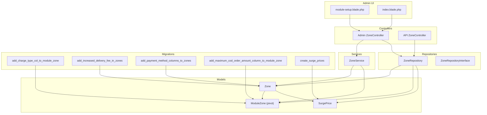
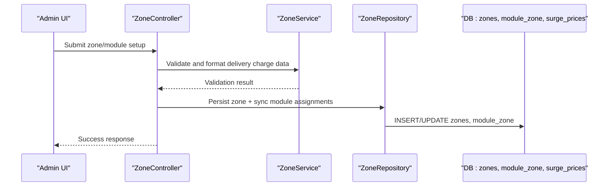
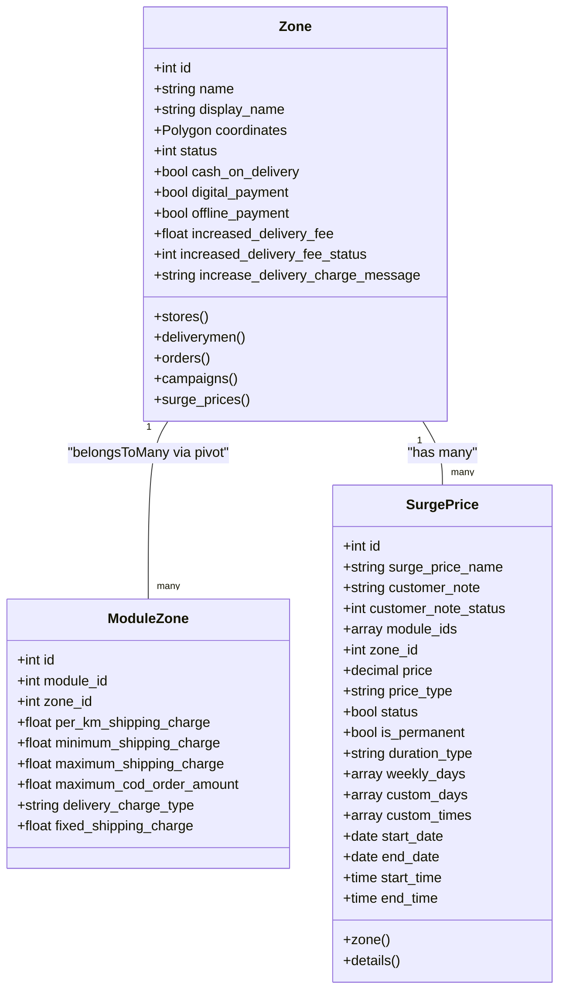
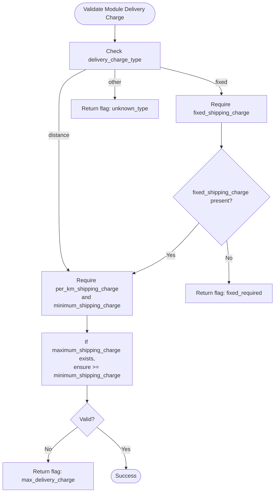
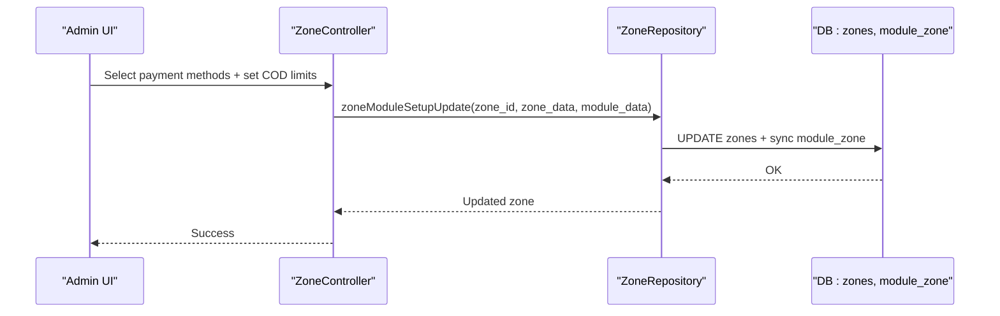
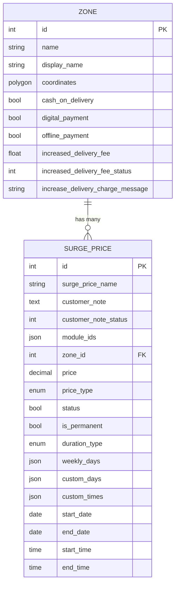
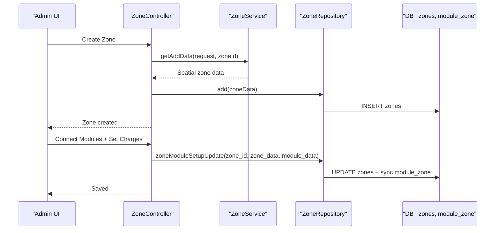
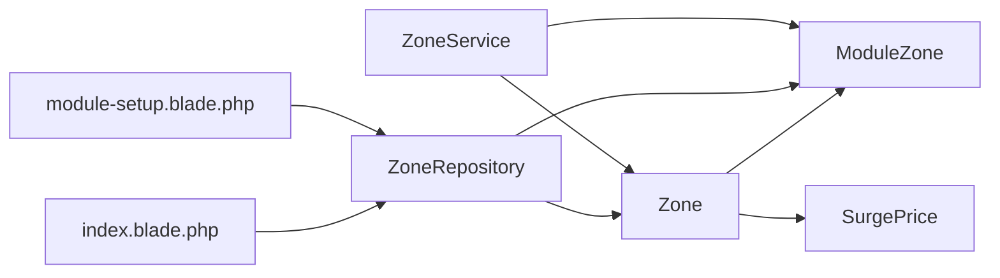

# Zone Configurations

<cite>
**Referenced Files in This Document**
- [Zone.php](file://app/Models/Zone.php)
- [ModuleZone.php](file://app/Models/ModuleZone.php)
- [ZoneService.php](file://app/Services/ZoneService.php)
- [ZoneRepository.php](file://app/Repositories/ZoneRepository.php)
- [ZoneRepositoryInterface.php](file://app/Contracts/Repositories/ZoneRepositoryInterface.php)
- [ZoneController.php](file://app/Http/Controllers/Admin/Zone/ZoneController.php)
- [ZoneController.php](file://app/Http/Controllers/Api/V1/ZoneController.php)
- [module-setup.blade.php](file://resources/views/admin-views/zone/module-setup.blade.php)
- [index.blade.php](file://resources/views/admin-views/zone/index.blade.php)
- [SurgePrice.php](file://app/Models/SurgePrice.php)
- [2025_07_13_185456_create_surge_prices_table.php](file://database/migrations/2025_07_13_185456_create_surge_prices_table.php)
- [2025_07_13_160717_add_charge_type_col_to_module_zone_table.php](file://database/migrations/2025_07_13_160717_add_charge_type_col_to_module_zone_table.php)
- [2023_10_08_103818_add_increased_delivery_fee_in_zones_table.php](file://database/migrations/2023_10_08_103818_add_increased_delivery_fee_in_zones_table.php)
- [2022_10_25_153214_add_payment_method_columns_to_zones_table.php](file://database/migrations/2022_10_25_153214_add_payment_method_columns_to_zones_table.php)
- [2022_10_31_165427_add_rename_delivery_charge_column_to_stores_table.php](file://database/migrations/2022_10_31_165427_add_rename_delivery_charge_column_to_stores_table.php)
- [2022_12_29_105321_add_maximum_cod_order_amount_column_to_module_zone_table.php](file://database/migrations/2022_12_29_105321_add_maximum_cod_order_amount_column_to_module_zone_table.php)
</cite>

## Table of Contents
1. [Introduction](#introduction)
2. [Project Structure](#project-structure)
3. [Core Components](#core-components)
4. [Architecture Overview](#architecture-overview)
5. [Detailed Component Analysis](#detailed-component-analysis)
6. [Dependency Analysis](#dependency-analysis)
7. [Performance Considerations](#performance-considerations)
8. [Troubleshooting Guide](#troubleshooting-guide)
9. [Conclusion](#conclusion)

## Introduction
This document explains the zone-specific configuration system and business rule enforcement for dynamic pricing, payment method controls, and surge pricing integration. It covers:
- Per-zone pricing structures: fixed and distance-based shipping charges, minimum and maximum caps
- COD limits per zone and module
- Payment method restrictions per zone
- Zone-specific messaging for increased delivery fees
- Surge pricing configuration and integration
- Workflows for configuration, validation, and dynamic pricing calculation

## Project Structure
The zone configuration system spans models, repositories, services, controllers, and admin views. Key areas:
- Models define spatial zones, pivot tables for module-zone linkage, and surge pricing
- Services handle coordinate parsing, validation, and formatting
- Repositories manage persistence and synchronization of zone-module relationships
- Controllers orchestrate admin workflows and API endpoints
- Views render configuration forms for delivery charges, payment methods, and surge pricing

**Diagram sources**
- [module-setup.blade.php:1-403](file://resources/views/admin-views/zone/module-setup.blade.php#L1-L403)
- [index.blade.php:1-585](file://resources/views/admin-views/zone/index.blade.php#L1-L585)
- [ZoneController.php](file://app/Http/Controllers/Admin/Zone/ZoneController.php)
- [ZoneController.php](file://app/Http/Controllers/Api/V1/ZoneController.php)
- [ZoneService.php:1-126](file://app/Services/ZoneService.php#L1-L126)
- [ZoneRepository.php:1-129](file://app/Repositories/ZoneRepository.php#L1-L129)
- [ZoneRepositoryInterface.php:1-63](file://app/Contracts/Repositories/ZoneRepositoryInterface.php#L1-L63)
- [Zone.php:1-160](file://app/Models/Zone.php#L1-L160)
- [ModuleZone.php:1-24](file://app/Models/ModuleZone.php#L1-L24)
- [SurgePrice.php:1-73](file://app/Models/SurgePrice.php#L1-L73)
- [2025_07_13_160717_add_charge_type_col_to_module_zone_table.php:1-31](file://database/migrations/2025_07_13_160717_add_charge_type_col_to_module_zone_table.php#L1-L31)
- [2023_10_08_103818_add_increased_delivery_fee_in_zones_table.php:1-35](file://database/migrations/2023_10_08_103818_add_increased_delivery_fee_in_zones_table.php#L1-L35)
- [2022_10_25_153214_add_payment_method_columns_to_zones_table.php:1-35](file://database/migrations/2022_10_25_153214_add_payment_method_columns_to_zones_table.php#L1-L35)
- [2022_12_29_105321_add_maximum_cod_order_amount_column_to_module_zone_table.php:1-32](file://database/migrations/2022_12_29_105321_add_maximum_cod_order_amount_column_to_module_zone_table.php#L1-L32)
- [2025_07_13_185456_create_surge_prices_table.php:1-45](file://database/migrations/2025_07_13_185456_create_surge_prices_table.php#L1-L45)

**Section sources**
- [Zone.php:1-160](file://app/Models/Zone.php#L1-L160)
- [ModuleZone.php:1-24](file://app/Models/ModuleZone.php#L1-L24)
- [ZoneService.php:1-126](file://app/Services/ZoneService.php#L1-L126)
- [ZoneRepository.php:1-129](file://app/Repositories/ZoneRepository.php#L1-L129)
- [ZoneRepositoryInterface.php:1-63](file://app/Contracts/Repositories/ZoneRepositoryInterface.php#L1-L63)
- [module-setup.blade.php:1-403](file://resources/views/admin-views/zone/module-setup.blade.php#L1-L403)
- [index.blade.php:1-585](file://resources/views/admin-views/zone/index.blade.php#L1-L585)
- [SurgePrice.php:1-73](file://app/Models/SurgePrice.php#L1-L73)
- [2025_07_13_160717_add_charge_type_col_to_module_zone_table.php:1-31](file://database/migrations/2025_07_13_160717_add_charge_type_col_to_module_zone_table.php#L1-L31)
- [2023_10_08_103818_add_increased_delivery_fee_in_zones_table.php:1-35](file://database/migrations/2023_10_08_103818_add_increased_delivery_fee_in_zones_table.php#L1-L35)
- [2022_10_25_153214_add_payment_method_columns_to_zones_table.php:1-35](file://database/migrations/2022_10_25_153214_add_payment_method_columns_to_zones_table.php#L1-L35)
- [2022_12_29_105321_add_maximum_cod_order_amount_column_to_module_zone_table.php:1-32](file://database/migrations/2022_12_29_105321_add_maximum_cod_order_amount_column_to_module_zone_table.php#L1-L32)
- [2025_07_13_185456_create_surge_prices_table.php:1-45](file://database/migrations/2025_07_13_185456_create_surge_prices_table.php#L1-L45)

## Core Components
- Zone model: spatial polygon-based zones with payment method flags, increased delivery fee settings, and relationships to stores, delivery men, orders, campaigns, and surge prices.
- ModuleZone pivot: per-zone, per-module pricing and limits (fixed or distance-based).
- ZoneService: parses coordinates, formats spatial data, validates delivery charge setups, and prepares zone-module setup data.
- ZoneRepository: persists zones, synchronizes module assignments, and retrieves zones with counts and coordinates.
- Admin views: configure payment methods, delivery charges, COD limits, and surge pricing per zone.

**Section sources**
- [Zone.php:37-160](file://app/Models/Zone.php#L37-L160)
- [ModuleZone.php:10-24](file://app/Models/ModuleZone.php#L10-L24)
- [ZoneService.php:9-126](file://app/Services/ZoneService.php#L9-L126)
- [ZoneRepository.php:12-129](file://app/Repositories/ZoneRepository.php#L12-L129)
- [module-setup.blade.php:23-340](file://resources/views/admin-views/zone/module-setup.blade.php#L23-L340)

## Architecture Overview
The system integrates admin configuration with runtime enforcement:
- Admin UI posts zone and module settings to controllers
- Controllers delegate to services for validation/formatting and repositories for persistence
- Models define relationships and casts for spatial and numeric fields
- Surge pricing is linked to zones and modules for dynamic adjustments

**Diagram sources**
- [module-setup.blade.php:23-348](file://resources/views/admin-views/zone/module-setup.blade.php#L23-L348)
- [ZoneController.php](file://app/Http/Controllers/Admin/Zone/ZoneController.php)
- [ZoneService.php:94-123](file://app/Services/ZoneService.php#L94-L123)
- [ZoneRepository.php:108-117](file://app/Repositories/ZoneRepository.php#L108-L117)
- [2025_07_13_160717_add_charge_type_col_to_module_zone_table.php:14-17](file://database/migrations/2025_07_13_160717_add_charge_type_col_to_module_zone_table.php#L14-L17)

## Detailed Component Analysis

### Zone Model and Spatial Configuration
- Stores spatial polygon coordinates and translation-aware display names
- Flags for payment methods (cash on delivery, digital payment, offline payment)
- Increased delivery fee fields for messaging and enforcement
- Relationships to stores, deliverymen, orders, campaigns, and surge prices

**Diagram sources**
- [Zone.php:37-160](file://app/Models/Zone.php#L37-L160)
- [ModuleZone.php:10-24](file://app/Models/ModuleZone.php#L10-L24)
- [SurgePrice.php:9-73](file://app/Models/SurgePrice.php#L9-L73)

**Section sources**
- [Zone.php:37-160](file://app/Models/Zone.php#L37-L160)
- [SurgePrice.php:9-73](file://app/Models/SurgePrice.php#L9-L73)

### Per-Zone Pricing Structures
- Fixed amount: requires a positive fixed_shipping_charge when delivery_charge_type equals fixed
- Distance-based: requires per_km_shipping_charge and minimum_shipping_charge; optional maximum_shipping_charge
- Validation ensures maximum_shipping_charge is not less than minimum_shipping_charge when both are present

**Diagram sources**
- [ZoneService.php:94-123](file://app/Services/ZoneService.php#L94-L123)

**Section sources**
- [ZoneService.php:94-123](file://app/Services/ZoneService.php#L94-L123)
- [2025_07_13_160717_add_charge_type_col_to_module_zone_table.php:14-17](file://database/migrations/2025_07_13_160717_add_charge_type_col_to_module_zone_table.php#L14-L17)

### COD Limits and Payment Method Restrictions
- Maximum COD order amount per module-zone: stored in module_zone table
- Payment method flags per zone: cash_on_delivery, digital_payment, offline_payment
- Admin UI enforces at least one payment method selection and validates COD limits per module

**Diagram sources**
- [module-setup.blade.php:324-332](file://resources/views/admin-views/zone/module-setup.blade.php#L324-L332)
- [ZoneRepository.php:108-117](file://app/Repositories/ZoneRepository.php#L108-L117)
- [2022_12_29_105321_add_maximum_cod_order_amount_column_to_module_zone_table.php:16-18](file://database/migrations/2022_12_29_105321_add_maximum_cod_order_amount_column_to_module_zone_table.php#L16-L18)
- [2022_10_25_153214_add_payment_method_columns_to_zones_table.php:16-19](file://database/migrations/2022_10_25_153214_add_payment_method_columns_to_zones_table.php#L16-L19)

**Section sources**
- [module-setup.blade.php:32-88](file://resources/views/admin-views/zone/module-setup.blade.php#L32-L88)
- [ZoneRepository.php:108-117](file://app/Repositories/ZoneRepository.php#L108-L117)
- [2022_12_29_105321_add_maximum_cod_order_amount_column_to_module_zone_table.php:1-32](file://database/migrations/2022_12_29_105321_add_maximum_cod_order_amount_column_to_module_zone_table.php#L1-L32)
- [2022_10_25_153214_add_payment_method_columns_to_zones_table.php:1-35](file://database/migrations/2022_10_25_153214_add_payment_method_columns_to_zones_table.php#L1-L35)

### Zone-Specific Messaging for Increased Delivery Fees
- Zones support increased_delivery_fee, increased_delivery_fee_status, and increase_delivery_charge_message
- These fields enable targeted messaging to users when delivery fees rise in specific zones

**Section sources**
- [Zone.php:29-36](file://app/Models/Zone.php#L29-L36)
- [2023_10_08_103818_add_increased_delivery_fee_in_zones_table.php:14-19](file://database/migrations/2023_10_08_103818_add_increased_delivery_fee_in_zones_table.php#L14-L19)

### Surge Pricing Integration
- Surge prices are zone-bound with flexible duration types (daily, weekly, custom) and price types (amount or percent)
- Surge pricing can target specific modules and optionally include customer-facing notes

**Diagram sources**
- [SurgePrice.php:9-73](file://app/Models/SurgePrice.php#L9-L73)
- [2025_07_13_185456_create_surge_prices_table.php:14-34](file://database/migrations/2025_07_13_185456_create_surge_prices_table.php#L14-L34)

**Section sources**
- [SurgePrice.php:9-73](file://app/Models/SurgePrice.php#L9-L73)
- [2025_07_13_185456_create_surge_prices_table.php:1-45](file://database/migrations/2025_07_13_185456_create_surge_prices_table.php#L1-L45)

### Configuration Workflows
- Zone creation: Admin UI collects translated names, coordinates, and initial flags; service converts coordinates to spatial polygons
- Module setup: Admin selects modules and sets delivery charge type, fixed amount, per-km, minimum, maximum, and COD limits
- Persistence: Repository persists zone and synchronizes module assignments with per-zone parameters

**Diagram sources**
- [index.blade.php:533-575](file://resources/views/admin-views/zone/index.blade.php#L533-L575)
- [module-setup.blade.php:23-348](file://resources/views/admin-views/zone/module-setup.blade.php#L23-L348)
- [ZoneService.php:12-37](file://app/Services/ZoneService.php#L12-L37)
- [ZoneRepository.php:18-26](file://app/Repositories/ZoneRepository.php#L18-L26)
- [ZoneRepository.php:108-117](file://app/Repositories/ZoneRepository.php#L108-L117)

**Section sources**
- [index.blade.php:533-575](file://resources/views/admin-views/zone/index.blade.php#L533-L575)
- [module-setup.blade.php:23-348](file://resources/views/admin-views/zone/module-setup.blade.php#L23-L348)
- [ZoneService.php:12-37](file://app/Services/ZoneService.php#L12-L37)
- [ZoneRepository.php:18-26](file://app/Repositories/ZoneRepository.php#L18-L26)
- [ZoneRepository.php:108-117](file://app/Repositories/ZoneRepository.php#L108-L117)

## Dependency Analysis
- Zone depends on spatial traits and relations to stores, deliverymen, orders, campaigns, and surge prices
- ModuleZone is a pivot with strong casting for numeric pricing fields
- ZoneService depends on spatial objects for coordinate parsing
- ZoneRepository depends on Zone model and performs synchronization with module assignments
- Admin views depend on controller actions and model relationships for rendering and validation

**Diagram sources**
- [ZoneService.php:5-8](file://app/Services/ZoneService.php#L5-L8)
- [ZoneRepository.php:6-12](file://app/Repositories/ZoneRepository.php#L6-L12)
- [Zone.php:104-153](file://app/Models/Zone.php#L104-L153)
- [ModuleZone.php:10-24](file://app/Models/ModuleZone.php#L10-L24)
- [SurgePrice.php:26-34](file://app/Models/SurgePrice.php#L26-L34)
- [module-setup.blade.php:1-403](file://resources/views/admin-views/zone/module-setup.blade.php#L1-L403)
- [index.blade.php:1-585](file://resources/views/admin-views/zone/index.blade.php#L1-L585)

**Section sources**
- [Zone.php:104-153](file://app/Models/Zone.php#L104-L153)
- [ModuleZone.php:10-24](file://app/Models/ModuleZone.php#L10-L24)
- [ZoneService.php:5-8](file://app/Services/ZoneService.php#L5-L8)
- [ZoneRepository.php:6-12](file://app/Repositories/ZoneRepository.php#L6-L12)
- [SurgePrice.php:26-34](file://app/Models/SurgePrice.php#L26-L34)
- [module-setup.blade.php:1-403](file://resources/views/admin-views/zone/module-setup.blade.php#L1-L403)
- [index.blade.php:1-585](file://resources/views/admin-views/zone/index.blade.php#L1-L585)

## Performance Considerations
- Spatial queries: Zones use spatial polygons; ensure proper indexing on geographic fields for efficient containment checks
- Coordinate parsing: ZoneService constructs polygons from raw coordinate strings; keep input validation tight to avoid malformed geometry
- Module synchronization: zoneModuleSetupUpdate performs a sync operation; batch updates when connecting many modules to reduce overhead
- Surges: Duration-based surge schedules can be precomputed or cached to minimize runtime calculations during checkout

## Troubleshooting Guide
Common validation failures and remedies:
- Fixed delivery charge missing: When delivery_charge_type is fixed, ensure fixed_shipping_charge is set
- Distance-based charge missing required fields: Ensure per_km_shipping_charge and minimum_shipping_charge are both provided
- Maximum less than minimum: If maximum_shipping_charge is set, it must be greater than or equal to minimum_shipping_charge
- Unknown delivery charge type: delivery_charge_type must be either fixed or distance

Operational checks:
- Payment method flags: At least one of cash_on_delivery, digital_payment, or offline_payment must be enabled
- COD limit configuration: maximum_cod_order_amount should be set appropriately per module-zone
- Surge pricing: Verify zone association and duration settings for accurate customer messaging and price adjustments

**Section sources**
- [ZoneService.php:94-123](file://app/Services/ZoneService.php#L94-L123)
- [module-setup.blade.php:32-88](file://resources/views/admin-views/zone/module-setup.blade.php#L32-L88)
- [2022_12_29_105321_add_maximum_cod_order_amount_column_to_module_zone_table.php:16-18](file://database/migrations/2022_12_29_105321_add_maximum_cod_order_amount_column_to_module_zone_table.php#L16-L18)
- [2025_07_13_185456_create_surge_prices_table.php:19-33](file://database/migrations/2025_07_13_185456_create_surge_prices_table.php#L19-L33)

## Conclusion
The zone configuration system provides robust, per-zone control over pricing, COD limits, and payment methods, with optional surge pricing and messaging for increased delivery fees. Admin workflows enforce business rules through validation and synchronization, while models and services encapsulate spatial and pricing logic for reliable runtime behavior.