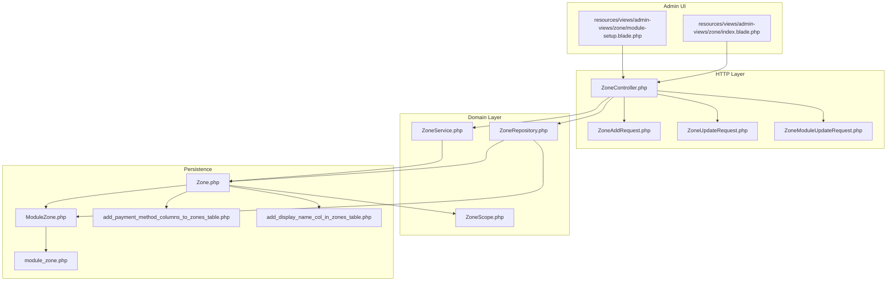
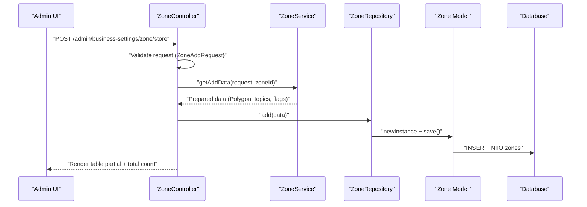
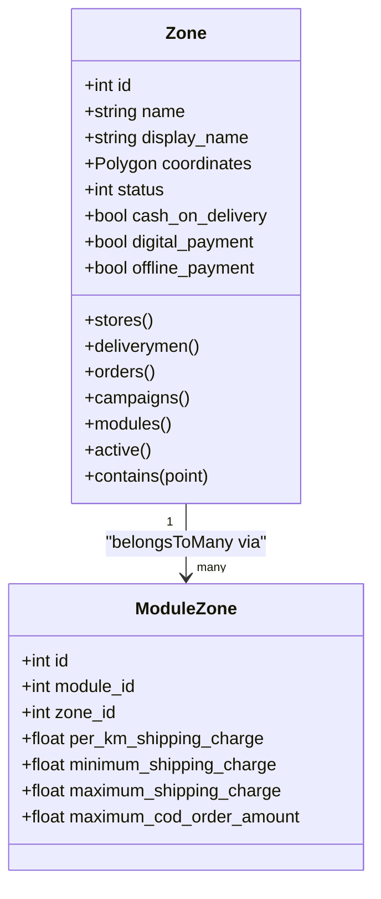
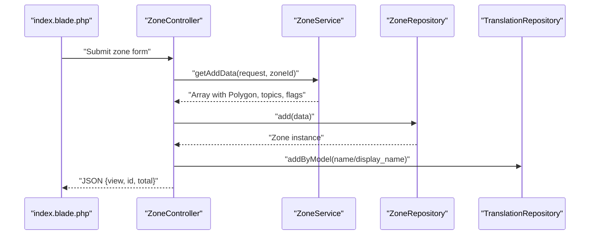
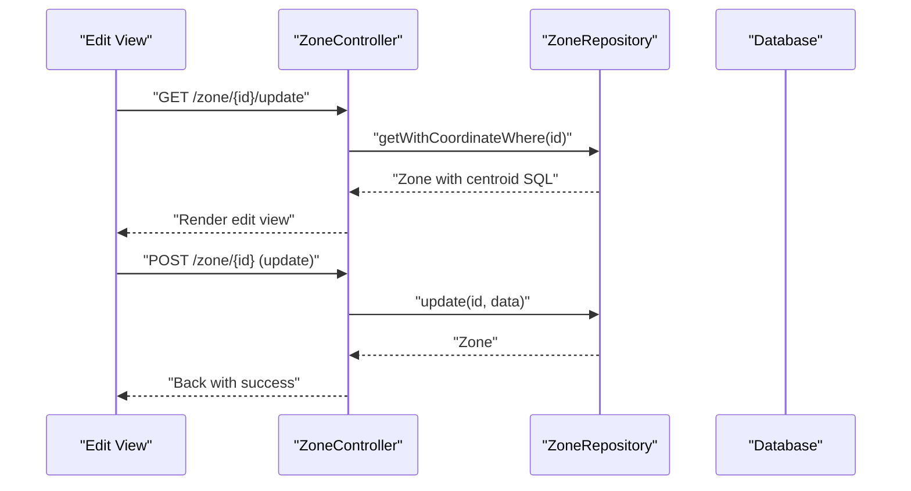
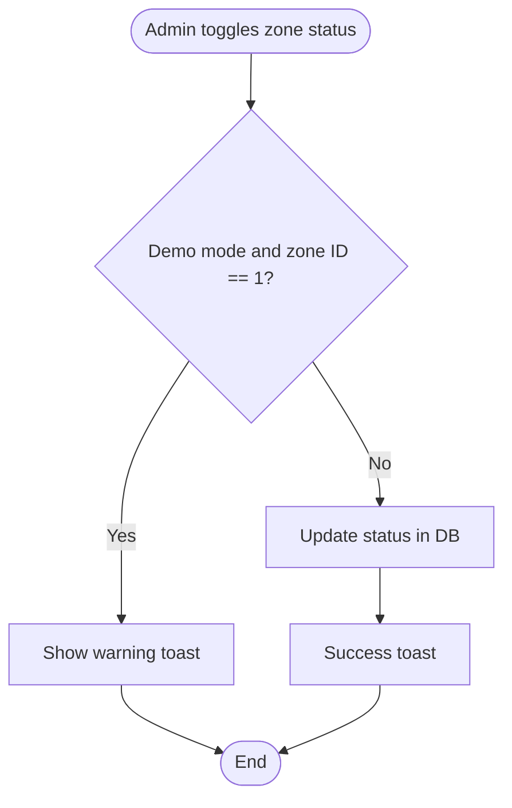
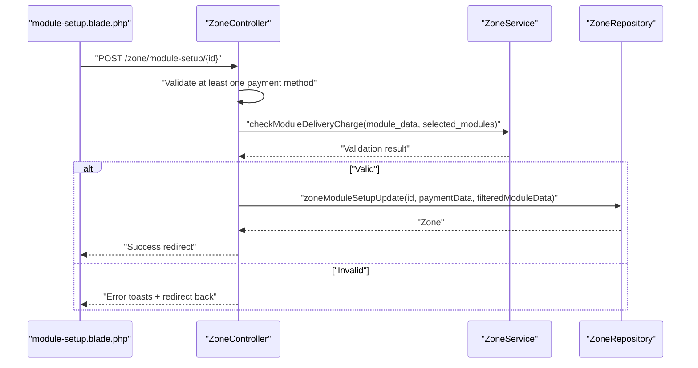
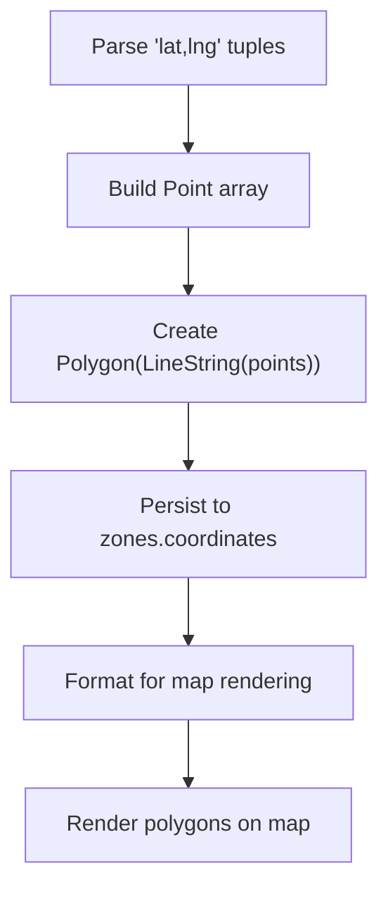
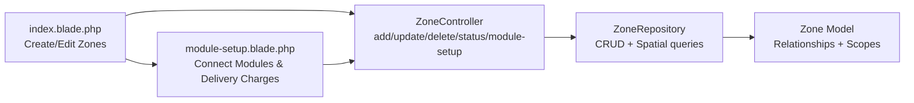
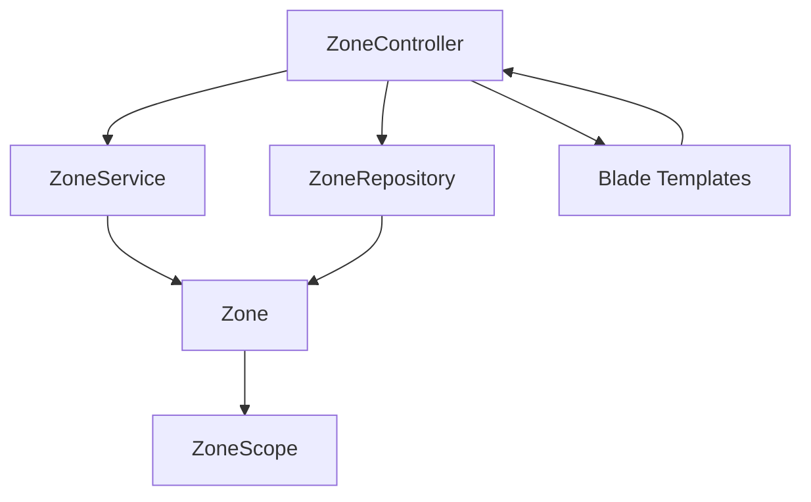

# Zone Management

<cite>
**Referenced Files in This Document**
- [Zone.php](file://app/Models/Zone.php)
- [ZoneService.php](file://app/Services/ZoneService.php)
- [ZoneRepository.php](file://app/Repositories/ZoneRepository.php)
- [ZoneController.php](file://app/Http/Controllers/Admin/Zone/ZoneController.php)
- [ZoneAddRequest.php](file://app/Http/Requests/Admin/ZoneAddRequest.php)
- [ZoneUpdateRequest.php](file://app/Http/Requests/Admin/ZoneUpdateRequest.php)
- [ZoneModuleUpdateRequest.php](file://app/Http/Requests/Admin/ZoneModuleUpdateRequest.php)
- [ModuleZone.php](file://app/Models/ModuleZone.php)
- [ZoneScope.php](file://app/Scopes/ZoneScope.php)
- [module_zone.php](file://database/migrations/2022_10_20_105050_module_zone.php)
- [add_payment_method_columns_to_zones_table.php](file://database/migrations/2022_10_25_153214_add_payment_method_columns_to_zones_table.php)
- [add_display_name_col_in_zones_table.php](file://database/migrations/2024_09_11_094735_add_display_name_col_in_zones_table.php)
- [index.blade.php](file://resources/views/admin-views/zone/index.blade.php)
- [module-setup.blade.php](file://resources/views/admin-views/zone/module-setup.blade.php)
</cite>

## Table of Contents
1. [Introduction](#introduction)
2. [Project Structure](#project-structure)
3. [Core Components](#core-components)
4. [Architecture Overview](#architecture-overview)
5. [Detailed Component Analysis](#detailed-component-analysis)
6. [Dependency Analysis](#dependency-analysis)
7. [Performance Considerations](#performance-considerations)
8. [Troubleshooting Guide](#troubleshooting-guide)
9. [Conclusion](#conclusion)

## Introduction
This document explains the zone management functionality, covering creation, editing, and deletion of geographic zones, status management, payment method configuration per zone, business module assignment, spatial queries, and multi-language support. It also documents the administrative interface usage, coordinate validation, and integration with mapping systems.

## Project Structure
Zone management spans models, repositories, services, controllers, requests, scopes, migrations, and Blade templates for the admin UI.

**Diagram sources**
- [index.blade.php:1-585](file://resources/views/admin-views/zone/index.blade.php#L1-L585)
- [module-setup.blade.php:1-403](file://resources/views/admin-views/zone/module-setup.blade.php#L1-L403)
- [ZoneController.php:1-347](file://app/Http/Controllers/Admin/Zone/ZoneController.php#L1-L347)
- [ZoneService.php:1-126](file://app/Services/ZoneService.php#L1-L126)
- [ZoneRepository.php:1-129](file://app/Repositories/ZoneRepository.php#L1-L129)
- [Zone.php:1-160](file://app/Models/Zone.php#L1-L160)
- [ModuleZone.php:1-24](file://app/Models/ModuleZone.php#L1-L24)
- [module_zone.php:1-37](file://database/migrations/2022_10_20_105050_module_zone.php#L1-L37)
- [add_payment_method_columns_to_zones_table.php:1-35](file://database/migrations/2022_10_25_153214_add_payment_method_columns_to_zones_table.php#L1-L35)
- [add_display_name_col_in_zones_table.php:1-29](file://database/migrations/2024_09_11_094735_add_display_name_col_in_zones_table.php#L1-L29)

**Section sources**
- [ZoneController.php:1-347](file://app/Http/Controllers/Admin/Zone/ZoneController.php#L1-L347)
- [Zone.php:1-160](file://app/Models/Zone.php#L1-L160)
- [ZoneService.php:1-126](file://app/Services/ZoneService.php#L1-L126)
- [ZoneRepository.php:1-129](file://app/Repositories/ZoneRepository.php#L1-L129)
- [ZoneScope.php:1-102](file://app/Scopes/ZoneScope.php#L1-L102)
- [ModuleZone.php:1-24](file://app/Models/ModuleZone.php#L1-L24)
- [module_zone.php:1-37](file://database/migrations/2022_10_20_105050_module_zone.php#L1-L37)
- [add_payment_method_columns_to_zones_table.php:1-35](file://database/migrations/2022_10_25_153214_add_payment_method_columns_to_zones_table.php#L1-L35)
- [add_display_name_col_in_zones_table.php:1-29](file://database/migrations/2024_09_11_094735_add_display_name_col_in_zones_table.php#L1-L29)
- [index.blade.php:1-585](file://resources/views/admin-views/zone/index.blade.php#L1-L585)
- [module-setup.blade.php:1-403](file://resources/views/admin-views/zone/module-setup.blade.php#L1-L403)

## Core Components
- Zone model: Defines attributes, casts, spatial polygon handling, translations, and relationships to stores, deliverymen, orders, campaigns, and modules.
- ZoneService: Transforms raw coordinate strings into spatial polygons, formats coordinates for frontend, validates module delivery charge configurations, and prepares data for creation/update.
- ZoneRepository: Persists zones, handles search/pagination, updates module linkage, and performs spatial queries via database functions.
- ZoneController: Orchestrates admin actions (create, update, delete, status toggles, module setup), integrates with translation repository, and renders views.
- Validation requests: Enforce required fields and uniqueness for zone names and coordinates.
- Scopes: Apply admin role-based visibility constraints across related models.
- Migrations: Define zones table, payment method flags, display name, and module-zone pivot table.

**Section sources**
- [Zone.php:1-160](file://app/Models/Zone.php#L1-L160)
- [ZoneService.php:1-126](file://app/Services/ZoneService.php#L1-L126)
- [ZoneRepository.php:1-129](file://app/Repositories/ZoneRepository.php#L1-L129)
- [ZoneController.php:1-347](file://app/Http/Controllers/Admin/Zone/ZoneController.php#L1-L347)
- [ZoneAddRequest.php:1-59](file://app/Http/Requests/Admin/ZoneAddRequest.php#L1-L59)
- [ZoneUpdateRequest.php:1-50](file://app/Http/Requests/Admin/ZoneUpdateRequest.php#L1-L50)
- [ZoneModuleUpdateRequest.php:1-54](file://app/Http/Requests/Admin/ZoneModuleUpdateRequest.php#L1-L54)
- [ZoneScope.php:1-102](file://app/Scopes/ZoneScope.php#L1-L102)
- [module_zone.php:1-37](file://database/migrations/2022_10_20_105050_module_zone.php#L1-L37)
- [add_payment_method_columns_to_zones_table.php:1-35](file://database/migrations/2022_10_25_153214_add_payment_method_columns_to_zones_table.php#L1-L35)
- [add_display_name_col_in_zones_table.php:1-29](file://database/migrations/2024_09_11_094735_add_display_name_col_in_zones_table.php#L1-L29)

## Architecture Overview
The zone management follows a layered architecture:
- Presentation: Blade templates render the admin UI for zone creation, updates, and module setup.
- HTTP: Controllers handle requests, enforce validations, and delegate persistence and transformations to services and repositories.
- Domain: Service encapsulates coordinate parsing/formatting and business rules for delivery charge configuration.
- Persistence: Repository manages CRUD, search, pagination, and spatial queries; Model defines relationships and global scopes.

**Diagram sources**
- [ZoneController.php:59-80](file://app/Http/Controllers/Admin/Zone/ZoneController.php#L59-L80)
- [ZoneAddRequest.php:37-44](file://app/Http/Requests/Admin/ZoneAddRequest.php#L37-L44)
- [ZoneService.php:12-37](file://app/Services/ZoneService.php#L12-L37)
- [ZoneRepository.php:18-26](file://app/Repositories/ZoneRepository.php#L18-L26)
- [Zone.php:37-73](file://app/Models/Zone.php#L37-L73)

## Detailed Component Analysis

### Zone Model and Spatial Data
- Attributes include name, display_name, coordinates (spatial Polygon), status, and payment method flags.
- Casts ensure proper typing for booleans and spatial types.
- Relationships:
  - stores, deliverymen, orders (through stores), campaigns (through stores), modules (belongsToMany via ModuleZone).
- Global scopes:
  - Active scope filters by status.
  - Translate scope loads translations for the current locale.
  - ZoneScope restricts visibility based on admin role and zone association.

**Diagram sources**
- [Zone.php:37-160](file://app/Models/Zone.php#L37-L160)
- [ModuleZone.php:10-23](file://app/Models/ModuleZone.php#L10-L23)

**Section sources**
- [Zone.php:1-160](file://app/Models/Zone.php#L1-L160)
- [ModuleZone.php:1-24](file://app/Models/ModuleZone.php#L1-L24)
- [ZoneScope.php:1-102](file://app/Scopes/ZoneScope.php#L1-L102)

### Zone Creation Workflow
- Admin UI collects multi-language names and display names, and draws a polygon on the map.
- Coordinates are submitted as a string and parsed into a Polygon by the service.
- The controller persists the zone and creates translations for name and display_name.
- The system returns a rendered table partial and total count for immediate UI refresh.

**Diagram sources**
- [index.blade.php:533-575](file://resources/views/admin-views/zone/index.blade.php#L533-L575)
- [ZoneController.php:59-80](file://app/Http/Controllers/Admin/Zone/ZoneController.php#L59-L80)
- [ZoneService.php:12-37](file://app/Services/ZoneService.php#L12-L37)
- [ZoneRepository.php:18-26](file://app/Repositories/ZoneRepository.php#L18-L26)

**Section sources**
- [index.blade.php:35-116](file://resources/views/admin-views/zone/index.blade.php#L35-L116)
- [ZoneController.php:59-80](file://app/Http/Controllers/Admin/Zone/ZoneController.php#L59-L80)
- [ZoneAddRequest.php:37-44](file://app/Http/Requests/Admin/ZoneAddRequest.php#L37-L44)
- [ZoneService.php:12-37](file://app/Services/ZoneService.php#L12-L37)

### Zone Editing and Deletion
- Edit view loads existing coordinates and language-specific names for editing.
- Update request validates uniqueness and presence of coordinates.
- Delete action prevents removal if active orders exist in the zone and cascades translation deletions before zone deletion.

**Diagram sources**
- [ZoneController.php:82-110](file://app/Http/Controllers/Admin/Zone/ZoneController.php#L82-L110)
- [ZoneUpdateRequest.php:34-41](file://app/Http/Requests/Admin/ZoneUpdateRequest.php#L34-L41)
- [ZoneRepository.php:55-62](file://app/Repositories/ZoneRepository.php#L55-L62)

**Section sources**
- [ZoneController.php:82-127](file://app/Http/Controllers/Admin/Zone/ZoneController.php#L82-L127)
- [ZoneUpdateRequest.php:1-50](file://app/Http/Requests/Admin/ZoneUpdateRequest.php#L1-L50)
- [ZoneRepository.php:65-72](file://app/Repositories/ZoneRepository.php#L65-L72)

### Status Management and Activation/Deactivation
- Status updates are handled via dedicated endpoints with guards preventing deactivation of demo zones.
- The model includes an active scope to filter enabled zones.

**Diagram sources**
- [ZoneController.php:245-255](file://app/Http/Controllers/Admin/Zone/ZoneController.php#L245-L255)
- [Zone.php:130-133](file://app/Models/Zone.php#L130-L133)

**Section sources**
- [ZoneController.php:245-255](file://app/Http/Controllers/Admin/Zone/ZoneController.php#L245-L255)
- [Zone.php:130-133](file://app/Models/Zone.php#L130-L133)

### Payment Methods and Module Setup
- Per-zone payment flags (cash_on_delivery, digital_payment, offline_payment) are validated against global business settings.
- Module-wise delivery charge configuration supports fixed or distance-based pricing with validation rules.
- The controller ensures at least one payment method is selected and validates module delivery charge setups.

**Diagram sources**
- [module-setup.blade.php:23-89](file://resources/views/admin-views/zone/module-setup.blade.php#L23-L89)
- [ZoneController.php:178-233](file://app/Http/Controllers/Admin/Zone/ZoneController.php#L178-L233)
- [ZoneModuleUpdateRequest.php:35-44](file://app/Http/Requests/Admin/ZoneModuleUpdateRequest.php#L35-L44)
- [ZoneService.php:94-123](file://app/Services/ZoneService.php#L94-L123)
- [ZoneRepository.php:108-117](file://app/Repositories/ZoneRepository.php#L108-L117)

**Section sources**
- [ZoneController.php:157-233](file://app/Http/Controllers/Admin/Zone/ZoneController.php#L157-L233)
- [ZoneModuleUpdateRequest.php:1-54](file://app/Http/Requests/Admin/ZoneModuleUpdateRequest.php#L1-L54)
- [ZoneService.php:94-123](file://app/Services/ZoneService.php#L94-L123)
- [module_zone.php:16-24](file://database/migrations/2022_10_20_105050_module_zone.php#L16-L24)

### Spatial Queries and Coordinate Handling
- The service parses coordinate strings into spatial polygons and formats them for frontend consumption.
- Repository exposes methods to fetch centroids and lists of zones for map rendering.
- The model includes a scope for containment checks using spatial functions.

**Diagram sources**
- [ZoneService.php:14-31](file://app/Services/ZoneService.php#L14-L31)
- [ZoneRepository.php:84-87](file://app/Repositories/ZoneRepository.php#L84-L87)
- [Zone.php:135-137](file://app/Models/Zone.php#L135-L137)

**Section sources**
- [ZoneService.php:74-92](file://app/Services/ZoneService.php#L74-L92)
- [ZoneRepository.php:84-87](file://app/Repositories/ZoneRepository.php#L84-L87)
- [Zone.php:135-137](file://app/Models/Zone.php#L135-L137)

### Administrative Interface Usage
- Zone creation page supports multi-language name and display name entries and integrates Google Maps for polygon drawing.
- Module setup page allows selecting payment methods, connecting business modules, and configuring delivery charges per module.
- Export functionality supports CSV/XLSX exports of zone lists.

**Diagram sources**
- [index.blade.php:1-585](file://resources/views/admin-views/zone/index.blade.php#L1-L585)
- [module-setup.blade.php:1-403](file://resources/views/admin-views/zone/module-setup.blade.php#L1-L403)
- [ZoneController.php:1-347](file://app/Http/Controllers/Admin/Zone/ZoneController.php#L1-L347)
- [ZoneRepository.php:1-129](file://app/Repositories/ZoneRepository.php#L1-L129)
- [Zone.php:1-160](file://app/Models/Zone.php#L1-L160)

**Section sources**
- [index.blade.php:1-585](file://resources/views/admin-views/zone/index.blade.php#L1-L585)
- [module-setup.blade.php:1-403](file://resources/views/admin-views/zone/module-setup.blade.php#L1-L403)
- [ZoneController.php:1-347](file://app/Http/Controllers/Admin/Zone/ZoneController.php#L1-L347)

## Dependency Analysis
- Controller depends on Service for data preparation and Repository for persistence.
- Service depends on spatial objects to build polygons and on model relationships for module linkage.
- Model depends on global scopes and translation morph relation.
- Views depend on controller endpoints and route URLs for AJAX and form submissions.

**Diagram sources**
- [ZoneController.php:1-347](file://app/Http/Controllers/Admin/Zone/ZoneController.php#L1-L347)
- [ZoneService.php:1-126](file://app/Services/ZoneService.php#L1-L126)
- [ZoneRepository.php:1-129](file://app/Repositories/ZoneRepository.php#L1-L129)
- [Zone.php:1-160](file://app/Models/Zone.php#L1-L160)
- [ZoneScope.php:1-102](file://app/Scopes/ZoneScope.php#L1-L102)

**Section sources**
- [ZoneController.php:1-347](file://app/Http/Controllers/Admin/Zone/ZoneController.php#L1-L347)
- [ZoneService.php:1-126](file://app/Services/ZoneService.php#L1-L126)
- [ZoneRepository.php:1-129](file://app/Repositories/ZoneRepository.php#L1-L129)
- [Zone.php:1-160](file://app/Models/Zone.php#L1-L160)
- [ZoneScope.php:1-102](file://app/Scopes/ZoneScope.php#L1-L102)

## Performance Considerations
- Spatial indexing: Ensure the coordinates column is indexed appropriately for spatial queries to minimize overhead.
- Pagination: Use paginated lists for zone tables to avoid loading large datasets.
- Translation loading: The translate scope limits loaded translations to the current locale to reduce query cost.
- Batch operations: Prefer bulk updates for module setup when many zones require similar configurations.

## Troubleshooting Guide
- Validation failures during creation/editing return JSON errors; inspect the returned error keys and messages.
- Deleting a zone blocked by active orders: Resolve pending orders before deletion.
- Payment method conflicts: Ensure at least one payment method is enabled and aligned with global business settings.
- Module delivery charge validation: Fixed type requires fixed amount; distance type requires per_km and minimum values; maximum must be greater than or equal to minimum.

**Section sources**
- [ZoneAddRequest.php:53-58](file://app/Http/Requests/Admin/ZoneAddRequest.php#L53-L58)
- [ZoneUpdateRequest.php:43-48](file://app/Http/Requests/Admin/ZoneUpdateRequest.php#L43-L48)
- [ZoneController.php:119-126](file://app/Http/Controllers/Admin/Zone/ZoneController.php#L119-L126)
- [ZoneController.php:181-224](file://app/Http/Controllers/Admin/Zone/ZoneController.php#L181-L224)
- [ZoneService.php:94-123](file://app/Services/ZoneService.php#L94-L123)

## Conclusion
Zone management integrates a robust backend with spatial capabilities, multi-language support, and flexible payment/module configurations. The admin UI streamlines creation, updates, and operational controls while ensuring data integrity through validation and scoping. The modular design enables future enhancements such as expanded spatial analytics and advanced mapping integrations.