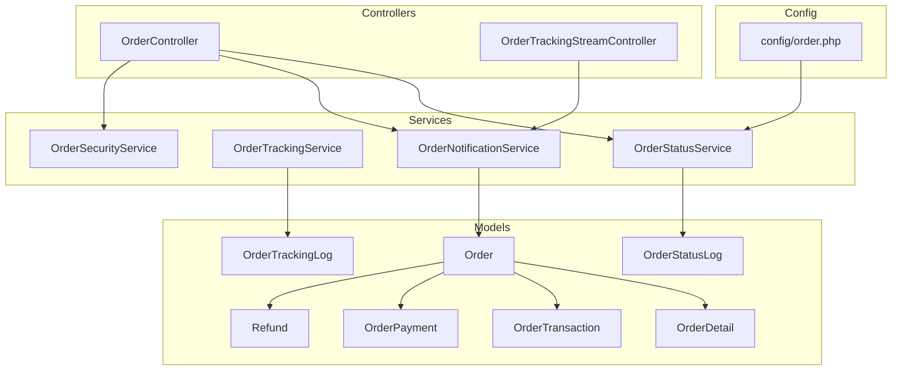
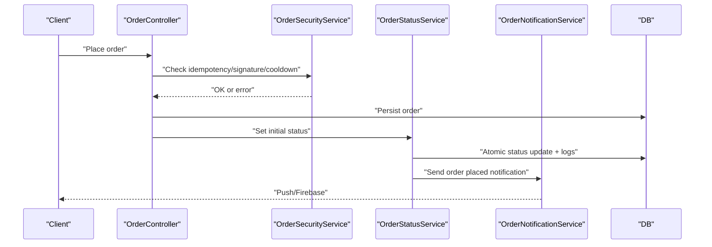
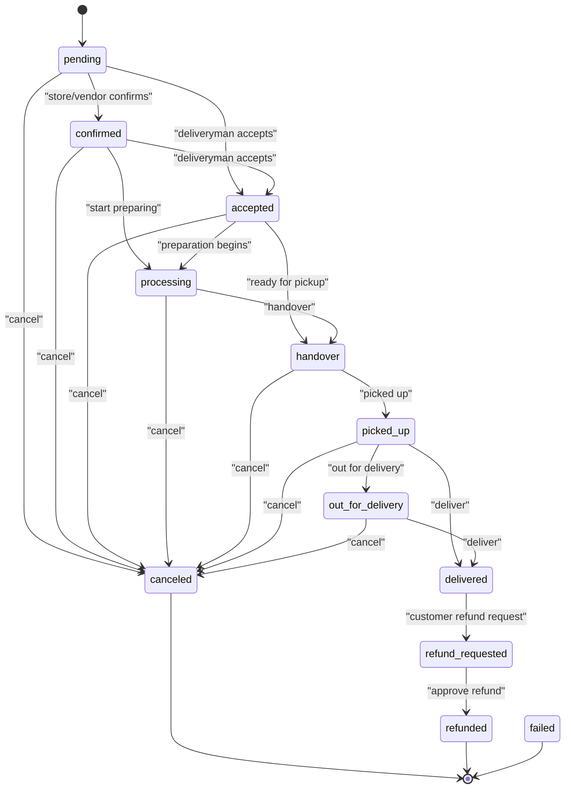
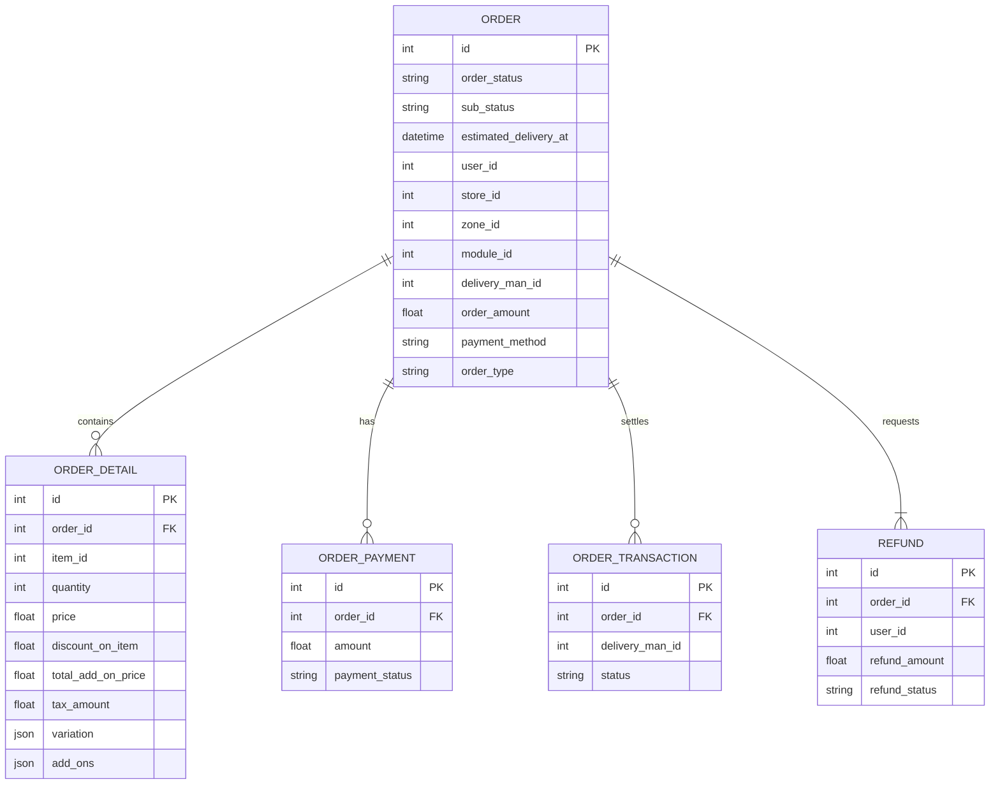
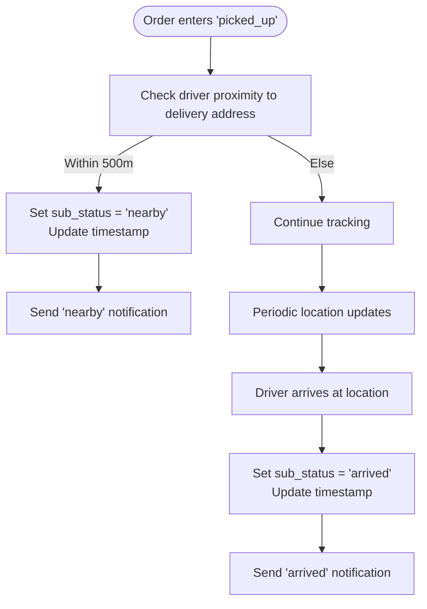
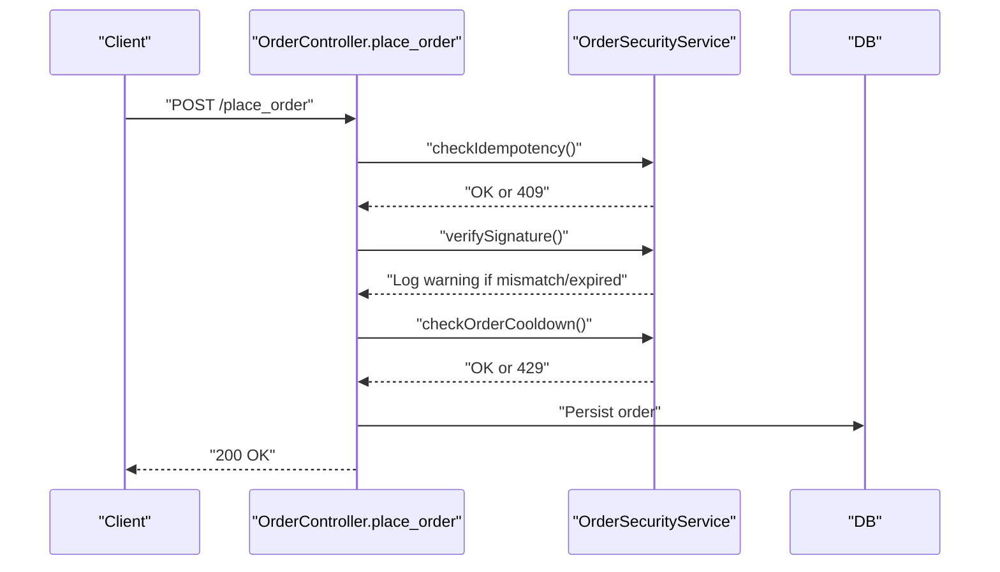
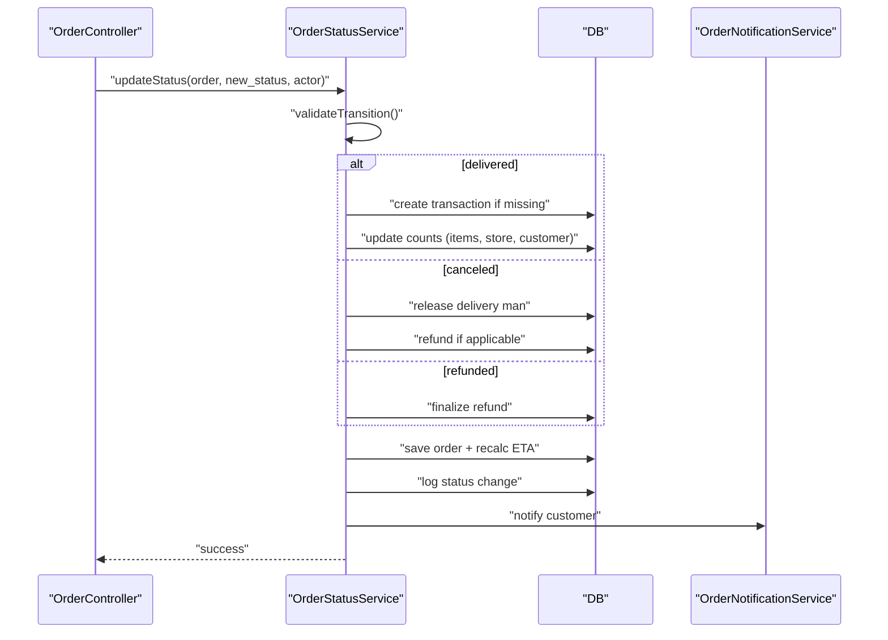
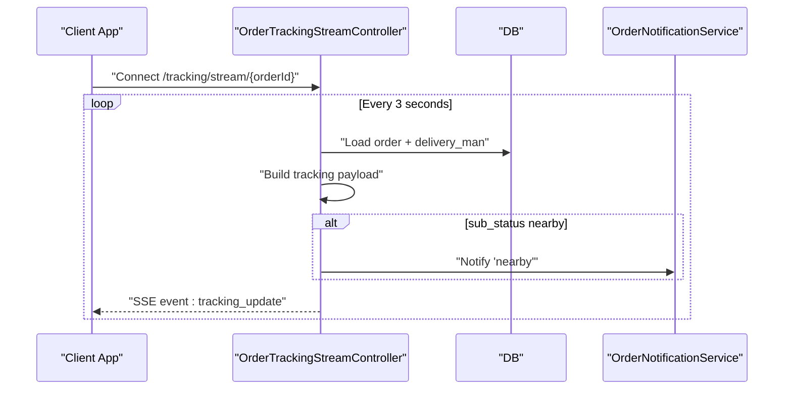
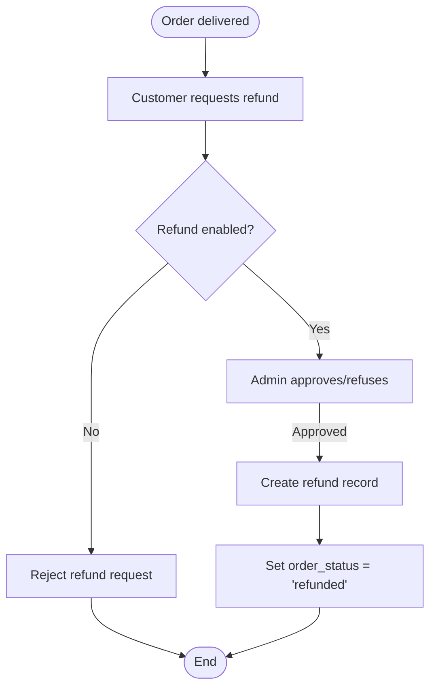
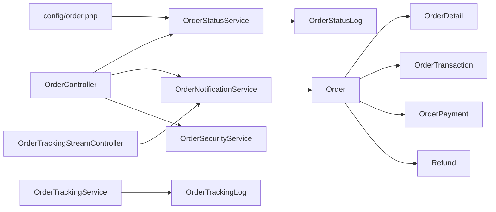

# Order Lifecycle Management

<cite>
**Referenced Files in This Document**
- [Order.php](file://app/Models/Order.php)
- [OrderDetail.php](file://app/Models/OrderDetail.php)
- [OrderStatusService.php](file://app/Services/OrderStatusService.php)
- [OrderTrackingService.php](file://app/Services/OrderTrackingService.php)
- [OrderSecurityService.php](file://app/Services/OrderSecurityService.php)
- [OrderSubStatus.php](file://app/Enums/OrderSubStatus.php)
- [OrderStatusLog.php](file://app/Models/OrderStatusLog.php)
- [OrderTrackingLog.php](file://app/Models/OrderTrackingLog.php)
- [OrderTransaction.php](file://app/Models/OrderTransaction.php)
- [OrderPayment.php](file://app/Models/OrderPayment.php)
- [Refund.php](file://app/Models/Refund.php)
- [OrderController.php](file://app/Http/Controllers/Api/V1/OrderController.php)
- [OrderTrackingStreamController.php](file://app/Http/Controllers/Api/V1/OrderTrackingStreamController.php)
- [OrderNotificationService.php](file://app/Services/OrderNotificationService.php)
- [order.php](file://config/order.php)
- [2026_02_02_184900_create_order_status_logs_table.php](file://database/migrations/2026_02_02_184900_create_order_status_logs_table.php)
- [2026_01_25_000002_create_order_tracking_logs_table.php](file://database/migrations/2026_01_25_000002_create_order_tracking_logs_table.php)
</cite>

## Table of Contents
1. [Introduction](#introduction)
2. [Project Structure](#project-structure)
3. [Core Components](#core-components)
4. [Architecture Overview](#architecture-overview)
5. [Detailed Component Analysis](#detailed-component-analysis)
6. [Dependency Analysis](#dependency-analysis)
7. [Performance Considerations](#performance-considerations)
8. [Troubleshooting Guide](#troubleshooting-guide)
9. [Conclusion](#conclusion)

## Introduction
This document describes the order lifecycle management system, covering the complete journey from order creation to post-delivery resolution. It documents the order state machine, state transitions, validation rules, timing constraints, sub-status tracking, and integration points with payment processing, inventory, and delivery coordination systems. The goal is to provide a clear understanding of how orders move through the platform, who can act at each stage, and how the system enforces business rules.

## Project Structure
The order lifecycle spans several core areas:
- Data models representing orders, order details, transactions, payments, and refunds
- Services orchestrating status transitions, tracking, and notifications
- Controllers exposing APIs for placing, tracking, and managing orders
- Configuration defining valid transitions and operational parameters
- Database migrations establishing audit trails and tracking logs

**Diagram sources**
- [Order.php:13-358](file://app/Models/Order.php#L13-L358)
- [OrderDetail.php:10-51](file://app/Models/OrderDetail.php#L10-L51)
- [OrderStatusService.php:21-348](file://app/Services/OrderStatusService.php#L21-L348)
- [OrderTrackingService.php:12-124](file://app/Services/OrderTrackingService.php#L12-L124)
- [OrderNotificationService.php:14-312](file://app/Services/OrderNotificationService.php#L14-L312)
- [OrderSecurityService.php:12-137](file://app/Services/OrderSecurityService.php#L12-L137)
- [OrderController.php:31-791](file://app/Http/Controllers/Api/V1/OrderController.php#L31-L791)
- [OrderTrackingStreamController.php:10-174](file://app/Http/Controllers/Api/V1/OrderTrackingStreamController.php#L10-L174)
- [order.php:10-108](file://config/order.php#L10-L108)

**Section sources**
- [Order.php:13-358](file://app/Models/Order.php#L13-L358)
- [OrderDetail.php:10-51](file://app/Models/OrderDetail.php#L10-L51)
- [OrderStatusService.php:21-348](file://app/Services/OrderStatusService.php#L21-L348)
- [OrderTrackingService.php:12-124](file://app/Services/OrderTrackingService.php#L12-L124)
- [OrderNotificationService.php:14-312](file://app/Services/OrderNotificationService.php#L14-L312)
- [OrderSecurityService.php:12-137](file://app/Services/OrderSecurityService.php#L12-L137)
- [OrderController.php:31-791](file://app/Http/Controllers/Api/V1/OrderController.php#L31-L791)
- [OrderTrackingStreamController.php:10-174](file://app/Http/Controllers/Api/V1/OrderTrackingStreamController.php#L10-L174)
- [order.php:10-108](file://config/order.php#L10-L108)

## Core Components
- Order model encapsulates order metadata, relationships, scopes, and computed attributes. It defines order-level validations and behaviors, including delivery address parsing, attachment URLs, and global scopes for zone and storage.
- OrderDetail links items to orders, capturing quantities, prices, discounts, taxes, and optional campaigns.
- OrderStatusService centralizes state transitions with validation, atomic updates, transaction creation, audit logging, and notifications.
- OrderTrackingService manages sub-status updates, location logging, and proximity-based notifications.
- OrderNotificationService builds rich push payloads and Live Activity updates for real-time customer experience.
- OrderSecurityService enforces idempotency, rate limits, and HMAC signature checks during order placement.
- OrderStatusLog and OrderTrackingLog provide immutable audit trails for status changes and driver locations.
- OrderTransaction and OrderPayment support financial reconciliation and partial payments.
- Refund tracks refund requests and outcomes.
- Controllers expose endpoints for placing, updating, tracking, and managing orders.

**Section sources**
- [Order.php:13-358](file://app/Models/Order.php#L13-L358)
- [OrderDetail.php:10-51](file://app/Models/OrderDetail.php#L10-L51)
- [OrderStatusService.php:21-348](file://app/Services/OrderStatusService.php#L21-L348)
- [OrderTrackingService.php:12-124](file://app/Services/OrderTrackingService.php#L12-L124)
- [OrderNotificationService.php:14-312](file://app/Services/OrderNotificationService.php#L14-L312)
- [OrderSecurityService.php:12-137](file://app/Services/OrderSecurityService.php#L12-L137)
- [OrderStatusLog.php:8-112](file://app/Models/OrderStatusLog.php#L8-L112)
- [OrderTrackingLog.php:8-56](file://app/Models/OrderTrackingLog.php#L8-L56)
- [OrderTransaction.php:9-47](file://app/Models/OrderTransaction.php#L9-L47)
- [OrderPayment.php:8-27](file://app/Models/OrderPayment.php#L8-L27)
- [Refund.php:12-72](file://app/Models/Refund.php#L12-L72)

## Architecture Overview
The order lifecycle is governed by a centralized state machine with explicit transitions and guards. The system ensures consistency through:
- Atomic status updates with row-level locking
- Audit logging for all state changes
- Real-time tracking and sub-status updates
- Notification delivery to customers and drivers
- Financial reconciliation upon delivery
- Security measures during order placement

**Diagram sources**
- [OrderController.php:762-769](file://app/Http/Controllers/Api/V1/OrderController.php#L762-L769)
- [OrderSecurityService.php:22-137](file://app/Services/OrderSecurityService.php#L22-L137)
- [OrderStatusService.php:89-156](file://app/Services/OrderStatusService.php#L89-L156)
- [OrderNotificationService.php:86-122](file://app/Services/OrderNotificationService.php#L86-L122)

## Detailed Component Analysis

### Order State Machine and Transitions
The state machine defines valid transitions and guards enforced by configuration and service logic.

States:
- pending
- confirmed
- accepted
- processing
- handover
- picked_up
- out_for_delivery
- delivered
- refund_requested
- refunded
- canceled
- failed

Valid transitions (from configuration):
- pending → confirmed | accepted | canceled
- confirmed → accepted | processing | canceled
- accepted → processing | handover | canceled
- processing → handover | canceled
- handover → picked_up | canceled
- picked_up → out_for_delivery | delivered | canceled
- out_for_delivery → delivered | canceled
- delivered → refund_requested
- refund_requested → refunded
- canceled → (terminal)
- refunded → (terminal)
- failed → (terminal)

**Diagram sources**
- [order.php:66-79](file://config/order.php#L66-L79)
- [OrderStatusService.php:26-42](file://app/Services/OrderStatusService.php#L26-L42)

Business rules and constraints:
- Transition validation occurs before any update.
- Terminal states (canceled, refunded, failed) block further transitions.
- Delivery-man-specific actions (accept, handover, pick-up, deliver) are guarded by delivery assignment and availability.
- Payment status and COD rules influence refund eligibility and transaction creation.

**Section sources**
- [order.php:66-79](file://config/order.php#L66-L79)
- [OrderStatusService.php:51-78](file://app/Services/OrderStatusService.php#L51-L78)
- [OrderStatusService.php:107-156](file://app/Services/OrderStatusService.php#L107-L156)

### Order Data Structures and Relationships
Core entities and relationships:
- Order has many OrderDetails, OrderPayments, OrderTransactions, Refund, and DeliveryHistory.
- Order belongs to User (customer), Store, Zone, Module, DeliveryMan, and ParcelCategory.
- OrderDetail belongs to Order and Item, optionally to ItemCampaign.
- OrderStatusLog and OrderTrackingLog record audit trails for status and location.

**Diagram sources**
- [Order.php:13-358](file://app/Models/Order.php#L13-L358)
- [OrderDetail.php:10-51](file://app/Models/OrderDetail.php#L10-L51)
- [OrderTransaction.php:9-47](file://app/Models/OrderTransaction.php#L9-L47)
- [OrderPayment.php:8-27](file://app/Models/OrderPayment.php#L8-L27)
- [Refund.php:12-72](file://app/Models/Refund.php#L12-L72)

**Section sources**
- [Order.php:118-191](file://app/Models/Order.php#L118-L191)
- [OrderDetail.php:27-42](file://app/Models/OrderDetail.php#L27-L42)
- [OrderTransaction.php:15-23](file://app/Models/OrderTransaction.php#L15-L23)
- [OrderPayment.php:17-20](file://app/Models/OrderPayment.php#L17-L20)
- [Refund.php:28-31](file://app/Models/Refund.php#L28-L31)

### Sub-Status Tracking
Sub-statuses provide granular visibility within major stages:
- Processing: preparing, packaging, ready
- Delivery: en_route, nearby (<500m), arrived

Sub-status lifecycle:
- Sub-status updates are logged and trigger proximity notifications when driver nears the destination.
- Sub-status timestamps help measure dwell times and SLAs.

**Diagram sources**
- [OrderTrackingService.php:110-122](file://app/Services/OrderTrackingService.php#L110-L122)
- [OrderNotificationService.php:252-283](file://app/Services/OrderNotificationService.php#L252-L283)
- [OrderSubStatus.php:10-78](file://app/Enums/OrderSubStatus.php#L10-L78)

**Section sources**
- [OrderSubStatus.php:12-52](file://app/Enums/OrderSubStatus.php#L12-L52)
- [OrderTrackingService.php:110-122](file://app/Services/OrderTrackingService.php#L110-L122)
- [OrderNotificationService.php:252-283](file://app/Services/OrderNotificationService.php#L252-L283)

### Order Placement and Validation
Order placement is secured and rate-limited:
- Idempotency key prevents duplicate submissions.
- Signature verification (HMAC-SHA256) validates authenticity and freshness.
- Cooldown prevents rapid successive orders per user/guest.
- Controller validates request shape and applies business rules before persisting.

**Diagram sources**
- [OrderController.php:762-769](file://app/Http/Controllers/Api/V1/OrderController.php#L762-L769)
- [OrderSecurityService.php:22-137](file://app/Services/OrderSecurityService.php#L22-L137)

**Section sources**
- [OrderSecurityService.php:22-137](file://app/Services/OrderSecurityService.php#L22-L137)
- [OrderController.php:762-769](file://app/Http/Controllers/Api/V1/OrderController.php#L762-L769)

### Status Transition Workflow
The service enforces atomicity and side effects:
- Validates transition against configuration.
- Handles special cases: delivered (creates transaction, updates counts), canceled (updates counts, refunds if applicable), refunded (finalizes refund).
- Updates estimated delivery time and logs changes with metadata.

**Diagram sources**
- [OrderStatusService.php:89-156](file://app/Services/OrderStatusService.php#L89-L156)
- [OrderStatusService.php:161-204](file://app/Services/OrderStatusService.php#L161-L204)
- [OrderStatusService.php:209-234](file://app/Services/OrderStatusService.php#L209-L234)
- [OrderStatusService.php:239-266](file://app/Services/OrderStatusService.php#L239-L266)
- [OrderStatusLog.php:71-90](file://app/Models/OrderStatusLog.php#L71-L90)

**Section sources**
- [OrderStatusService.php:89-156](file://app/Services/OrderStatusService.php#L89-L156)
- [OrderStatusLog.php:71-90](file://app/Models/OrderStatusLog.php#L71-L90)

### Real-Time Tracking and Notifications
Real-time tracking uses Server-Sent Events (SSE) to stream updates:
- Clients connect to a streaming endpoint and receive updates when order data changes.
- Proximity triggers sub-status updates and targeted notifications.
- Live Activity updates are pushed to iOS devices when tokens exist.

**Diagram sources**
- [OrderTrackingStreamController.php:19-101](file://app/Http/Controllers/Api/V1/OrderTrackingStreamController.php#L19-L101)
- [OrderNotificationService.php:252-283](file://app/Services/OrderNotificationService.php#L252-L283)

**Section sources**
- [OrderTrackingStreamController.php:19-101](file://app/Http/Controllers/Api/V1/OrderTrackingStreamController.php#L19-L101)
- [OrderTrackingService.php:28-50](file://app/Services/OrderTrackingService.php#L28-L50)
- [OrderNotificationService.php:252-283](file://app/Services/OrderNotificationService.php#L252-L283)

### Refund and Post-Delivery Resolution
Refund process:
- Customer initiates refund after delivery (subject to business settings).
- Admin approval moves the order to refunded.
- Refund amount calculation excludes delivery charge and tips where applicable.
- Refund records maintain images and notes.

**Diagram sources**
- [OrderController.php:241-316](file://app/Http/Controllers/Api/V1/OrderController.php#L241-L316)
- [Refund.php:12-72](file://app/Models/Refund.php#L12-L72)

**Section sources**
- [OrderController.php:241-316](file://app/Http/Controllers/Api/V1/OrderController.php#L241-L316)
- [Refund.php:28-58](file://app/Models/Refund.php#L28-L58)

## Dependency Analysis
- Controllers depend on services for business logic and on models for persistence.
- Services depend on models, configuration, and external integrations (notifications, payments).
- Models define relationships and scopes; logs enforce auditability.
- Configuration centralizes policy (transitions, OTP limits, delivery settings).

**Diagram sources**
- [OrderController.php:31-791](file://app/Http/Controllers/Api/V1/OrderController.php#L31-L791)
- [OrderTrackingStreamController.php:10-174](file://app/Http/Controllers/Api/V1/OrderTrackingStreamController.php#L10-L174)
- [OrderStatusService.php:21-348](file://app/Services/OrderStatusService.php#L21-L348)
- [OrderTrackingService.php:12-124](file://app/Services/OrderTrackingService.php#L12-L124)
- [OrderNotificationService.php:14-312](file://app/Services/OrderNotificationService.php#L14-L312)
- [OrderSecurityService.php:12-137](file://app/Services/OrderSecurityService.php#L12-L137)
- [OrderStatusLog.php:8-112](file://app/Models/OrderStatusLog.php#L8-L112)
- [OrderTrackingLog.php:8-56](file://app/Models/OrderTrackingLog.php#L8-L56)
- [Order.php:13-358](file://app/Models/Order.php#L13-L358)
- [order.php:10-108](file://config/order.php#L10-L108)

**Section sources**
- [OrderController.php:31-791](file://app/Http/Controllers/Api/V1/OrderController.php#L31-L791)
- [OrderTrackingStreamController.php:10-174](file://app/Http/Controllers/Api/V1/OrderTrackingStreamController.php#L10-L174)
- [OrderStatusService.php:21-348](file://app/Services/OrderStatusService.php#L21-L348)
- [OrderTrackingService.php:12-124](file://app/Services/OrderTrackingService.php#L12-L124)
- [OrderNotificationService.php:14-312](file://app/Services/OrderNotificationService.php#L14-L312)
- [OrderSecurityService.php:12-137](file://app/Services/OrderSecurityService.php#L12-L137)
- [OrderStatusLog.php:8-112](file://app/Models/OrderStatusLog.php#L8-L112)
- [OrderTrackingLog.php:8-56](file://app/Models/OrderTrackingLog.php#L8-L56)
- [Order.php:13-358](file://app/Models/Order.php#L13-L358)
- [order.php:10-108](file://config/order.php#L10-L108)

## Performance Considerations
- Use atomic status updates with row-level locks to prevent race conditions.
- Batch notifications and avoid redundant sends; leverage SSE heartbeat to detect disconnections.
- Cache OTP attempts and enforce decay windows to reduce DB load.
- Index audit tables (order_status_logs, order_tracking_logs) on frequently queried columns (order_id, created_at, new_status).
- Limit tracking history fetch sizes and paginate where appropriate.

## Troubleshooting Guide
Common issues and resolutions:
- Invalid status transition: Ensure the target status is in the configured valid transitions for the current state.
- Duplicate order submission: Verify idempotency key uniqueness and TTL.
- OTP verification failures: Check rate-limit thresholds and decay windows; inspect cache keys.
- Missing notifications: Confirm device tokens, Live Activity tokens, and notification settings.
- Refund rejections: Validate payment method rules and COD constraints; ensure transaction exists for delivered orders.

Operational checks:
- Review order_status_logs for the last successful transition and actor.
- Inspect order_tracking_logs for driver location updates and sub-status changes.
- Validate security fields (idempotency_key, device_fingerprint, order_timestamp) on orders.

**Section sources**
- [OrderStatusService.php:51-60](file://app/Services/OrderStatusService.php#L51-L60)
- [OrderSecurityService.php:22-70](file://app/Services/OrderSecurityService.php#L22-L70)
- [OrderStatusLog.php:95-110](file://app/Models/OrderStatusLog.php#L95-L110)
- [OrderTrackingLog.php:43-54](file://app/Models/OrderTrackingLog.php#L43-L54)

## Conclusion
The order lifecycle management system provides a robust, auditable, and real-time-driven workflow. By centralizing state transitions, enforcing strict validation, and integrating tracking and notifications, it ensures predictable behavior across order placement, preparation, dispatch, delivery, and post-delivery resolution. The modular design allows for easy extension and maintenance while preserving consistency and reliability.