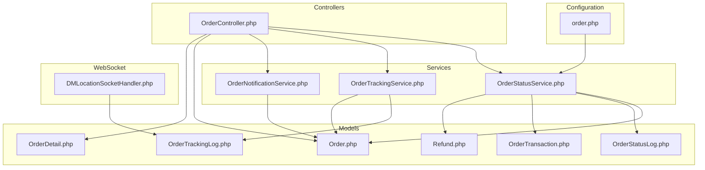
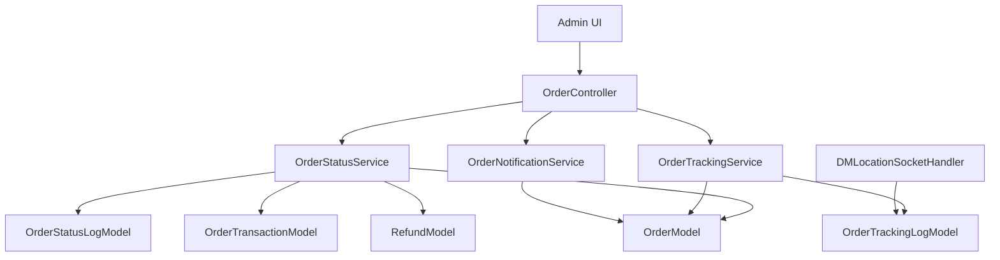
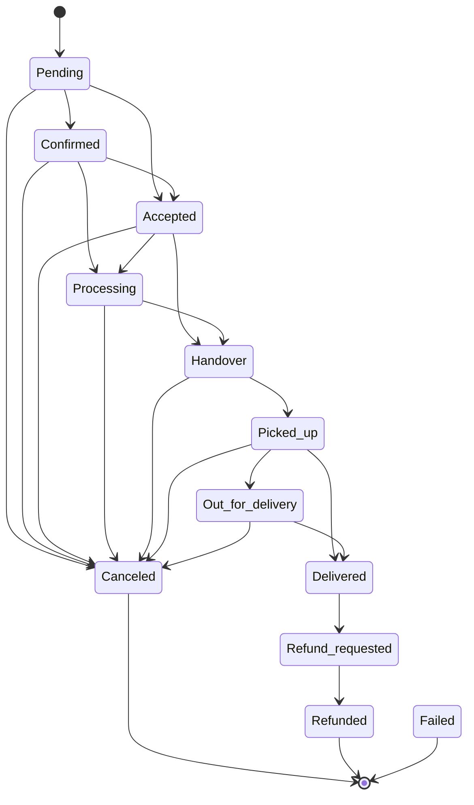
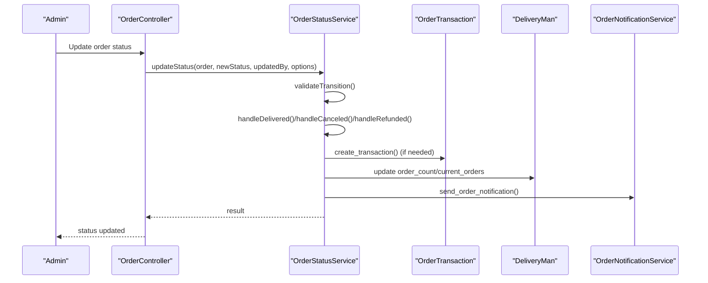
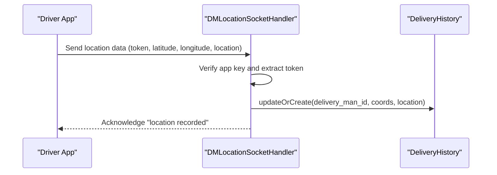
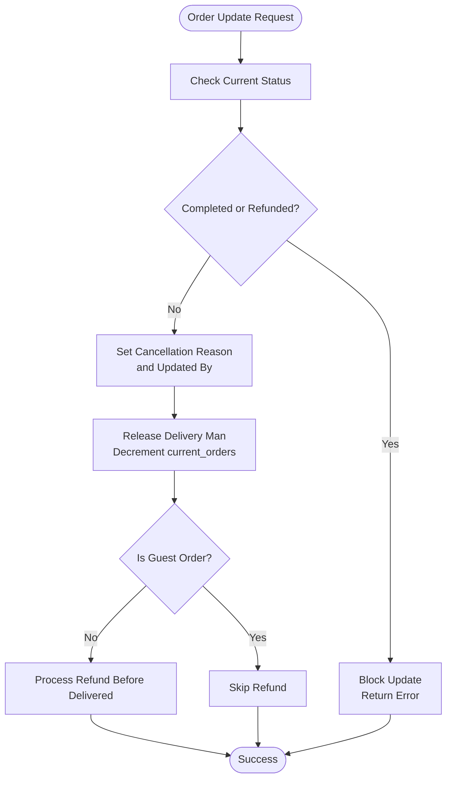
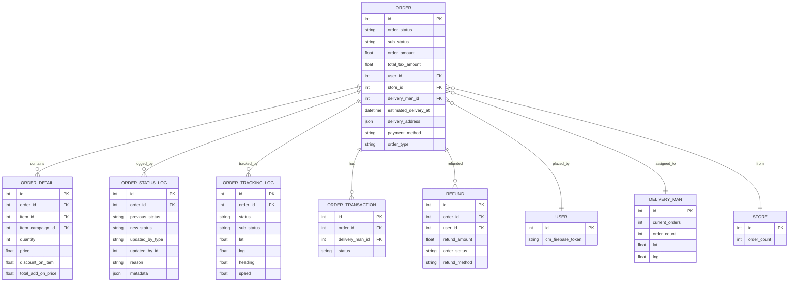
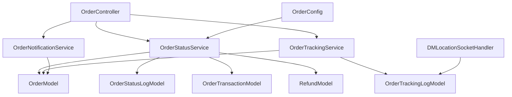

# Order Management System

<cite>
**Referenced Files in This Document**
- [Order.php](file://app/Models/Order.php)
- [OrderDetail.php](file://app/Models/OrderDetail.php)
- [OrderStatusLog.php](file://app/Models/OrderStatusLog.php)
- [OrderTrackingLog.php](file://app/Models/OrderTrackingLog.php)
- [OrderTransaction.php](file://app/Models/OrderTransaction.php)
- [Refund.php](file://app/Models/Refund.php)
- [OrderStatusService.php](file://app/Services/OrderStatusService.php)
- [OrderTrackingService.php](file://app/Services/OrderTrackingService.php)
- [OrderNotificationService.php](file://app/Services/OrderNotificationService.php)
- [OrderController.php](file://app/Http/Controllers/Admin/OrderController.php)
- [DMLocationSocketHandler.php](file://app/WebSockets/Handler/DMLocationSocketHandler.php)
- [order.php](file://config/order.php)
</cite>

## Table of Contents
1. [Introduction](#introduction)
2. [Project Structure](#project-structure)
3. [Core Components](#core-components)
4. [Architecture Overview](#architecture-overview)
5. [Detailed Component Analysis](#detailed-component-analysis)
6. [Dependency Analysis](#dependency-analysis)
7. [Performance Considerations](#performance-considerations)
8. [Troubleshooting Guide](#troubleshooting-guide)
9. [Conclusion](#conclusion)

## Introduction
This document provides comprehensive documentation for the order management system, covering the complete order lifecycle from placement to completion. It details order creation, status tracking, fulfillment processes, and cancellation/refund workflows. The document explains the order state machine, status transitions, and business rule enforcement, along with integrations for payment processing, inventory management, and delivery coordination. Real-time order tracking implementation using WebSocket technology is documented, alongside order data structures, relationship mapping, and performance optimization strategies for high-volume scenarios.

## Project Structure
The order management system is organized around Laravel models, services, controllers, and configuration files. Key areas include:
- Data models representing orders, order details, transactions, refunds, and tracking logs
- Services handling status transitions, tracking, and notifications
- Controllers orchestrating administrative actions and order fulfillment
- Configuration files defining valid status transitions and operational limits
- WebSocket handler for real-time delivery location updates

**Diagram sources**
- [Order.php:13-358](file://app/Models/Order.php#L13-L358)
- [OrderDetail.php:10-51](file://app/Models/OrderDetail.php#L10-L51)
- [OrderStatusLog.php:8-112](file://app/Models/OrderStatusLog.php#L8-L112)
- [OrderTrackingLog.php:8-56](file://app/Models/OrderTrackingLog.php#L8-L56)
- [OrderTransaction.php:9-47](file://app/Models/OrderTransaction.php#L9-L47)
- [Refund.php:12-72](file://app/Models/Refund.php#L12-L72)
- [OrderStatusService.php:21-348](file://app/Services/OrderStatusService.php#L21-L348)
- [OrderTrackingService.php:12-124](file://app/Services/OrderTrackingService.php#L12-L124)
- [OrderNotificationService.php:14-312](file://app/Services/OrderNotificationService.php#L14-L312)
- [OrderController.php:46-800](file://app/Http/Controllers/Admin/OrderController.php#L46-L800)
- [order.php:10-108](file://config/order.php#L10-L108)
- [DMLocationSocketHandler.php:16-83](file://app/WebSockets/Handler/DMLocationSocketHandler.php#L16-L83)

**Section sources**
- [Order.php:13-358](file://app/Models/Order.php#L13-L358)
- [OrderStatusService.php:21-348](file://app/Services/OrderStatusService.php#L21-L348)
- [OrderTrackingService.php:12-124](file://app/Services/OrderTrackingService.php#L12-L124)
- [OrderNotificationService.php:14-312](file://app/Services/OrderNotificationService.php#L14-L312)
- [OrderController.php:46-800](file://app/Http/Controllers/Admin/OrderController.php#L46-L800)
- [order.php:10-108](file://config/order.php#L10-L108)
- [DMLocationSocketHandler.php:16-83](file://app/WebSockets/Handler/DMLocationSocketHandler.php#L16-L83)

## Core Components
This section outlines the primary components involved in order lifecycle management.

- Order Model: Central entity representing an order with attributes for amounts, taxes, delivery details, and relationships to stores, customers, delivery personnel, and transactions.
- OrderDetail Model: Represents individual items within an order, linking to items or campaigns and maintaining pricing and quantity details.
- OrderStatusService: Validates and executes status transitions, manages atomic operations, logs changes, and triggers notifications.
- OrderTrackingService: Handles real-time tracking updates, sub-status management, and proximity-based notifications.
- OrderNotificationService: Builds and sends push notifications with extended payload data for live activity updates.
- OrderController: Administrative interface for order listing, status updates, delivery assignments, and invoice generation.
- Configuration: Defines valid status transitions, operational limits (deliveryman capacity, cash limits), and scheduling parameters.

**Section sources**
- [Order.php:13-358](file://app/Models/Order.php#L13-L358)
- [OrderDetail.php:10-51](file://app/Models/OrderDetail.php#L10-L51)
- [OrderStatusService.php:21-348](file://app/Services/OrderStatusService.php#L21-L348)
- [OrderTrackingService.php:12-124](file://app/Services/OrderTrackingService.php#L12-L124)
- [OrderNotificationService.php:14-312](file://app/Services/OrderNotificationService.php#L14-L312)
- [OrderController.php:46-800](file://app/Http/Controllers/Admin/OrderController.php#L46-L800)
- [order.php:10-108](file://config/order.php#L10-L108)

## Architecture Overview
The order management system follows a layered architecture:
- Presentation Layer: Controllers handle administrative requests and coordinate with services.
- Service Layer: Services encapsulate business logic for status transitions, tracking, and notifications.
- Data Access Layer: Models define relationships and scopes for querying orders and related entities.
- Configuration Layer: Centralized configuration governs valid transitions and operational policies.

**Diagram sources**
- [OrderController.php:46-800](file://app/Http/Controllers/Admin/OrderController.php#L46-L800)
- [OrderStatusService.php:21-348](file://app/Services/OrderStatusService.php#L21-L348)
- [OrderTrackingService.php:12-124](file://app/Services/OrderTrackingService.php#L12-L124)
- [OrderNotificationService.php:14-312](file://app/Services/OrderNotificationService.php#L14-L312)
- [Order.php:13-358](file://app/Models/Order.php#L13-L358)
- [OrderStatusLog.php:8-112](file://app/Models/OrderStatusLog.php#L8-L112)
- [OrderTrackingLog.php:8-56](file://app/Models/OrderTrackingLog.php#L8-L56)
- [OrderTransaction.php:9-47](file://app/Models/OrderTransaction.php#L9-L47)
- [Refund.php:12-72](file://app/Models/Refund.php#L12-L72)
- [DMLocationSocketHandler.php:16-83](file://app/WebSockets/Handler/DMLocationSocketHandler.php#L16-L83)

## Detailed Component Analysis

### Order State Machine and Status Transitions
The system defines a finite state machine for order statuses with explicit valid transitions. The OrderStatusService validates transitions and enforces business rules during updates.

**Diagram sources**
- [order.php:66-79](file://config/order.php#L66-L79)
- [OrderStatusService.php:26-60](file://app/Services/OrderStatusService.php#L26-L60)

Key behaviors:
- Transition validation prevents invalid state changes.
- Atomic operations lock orders during updates to avoid race conditions.
- Special handling for delivered, canceled, and refunded states ensures financial and inventory integrity.

**Section sources**
- [OrderStatusService.php:89-156](file://app/Services/OrderStatusService.php#L89-L156)
- [OrderStatusService.php:107-112](file://app/Services/OrderStatusService.php#L107-L112)
- [order.php:66-79](file://config/order.php#L66-L79)

### Order Fulfillment Workflow
The fulfillment workflow integrates status updates, delivery assignments, and transaction creation.

**Diagram sources**
- [OrderController.php:369-574](file://app/Http/Controllers/Admin/OrderController.php#L369-L574)
- [OrderStatusService.php:89-156](file://app/Services/OrderStatusService.php#L89-L156)
- [OrderNotificationService.php:86-122](file://app/Services/OrderNotificationService.php#L86-L122)

Operational highlights:
- Delivery assignments enforce capacity limits and cash-in-hand thresholds.
- Transaction creation occurs upon delivery for paid orders.
- Inventory adjustments are handled via stock updates when cancellations occur.

**Section sources**
- [OrderController.php:576-718](file://app/Http/Controllers/Admin/OrderController.php#L576-L718)
- [OrderController.php:524-553](file://app/Http/Controllers/Admin/OrderController.php#L524-L553)

### Real-Time Order Tracking with WebSocket
Real-time tracking leverages WebSocket connections to record delivery personnel locations and broadcast updates.

**Diagram sources**
- [DMLocationSocketHandler.php:19-43](file://app/WebSockets/Handler/DMLocationSocketHandler.php#L19-L43)

Tracking service integration:
- OrderTrackingService logs location updates and computes proximity notifications.
- Extended payload data enables clients to reflect ETA and status without additional API calls.

**Section sources**
- [OrderTrackingService.php:28-50](file://app/Services/OrderTrackingService.php#L28-L50)
- [OrderTrackingService.php:73-100](file://app/Services/OrderTrackingService.php#L73-L100)
- [OrderNotificationService.php:133-172](file://app/Services/OrderNotificationService.php#L133-L172)

### Cancellation and Refund Workflows
Cancellation and refund processes enforce business rules and maintain audit trails.

**Diagram sources**
- [OrderStatusService.php:209-234](file://app/Services/OrderStatusService.php#L209-L234)

Refund workflow specifics:
- Prevents COD orders from being refunded.
- Creates refund records and updates order status accordingly.
- Integrates with wallet transactions when configured.

**Section sources**
- [OrderStatusService.php:239-266](file://app/Services/OrderStatusService.php#L239-L266)
- [OrderController.php:456-493](file://app/Http/Controllers/Admin/OrderController.php#L456-L493)

### Order Data Structures and Relationship Mapping
The following diagram illustrates core order-related entities and their relationships.

**Diagram sources**
- [Order.php:13-358](file://app/Models/Order.php#L13-L358)
- [OrderDetail.php:10-51](file://app/Models/OrderDetail.php#L10-L51)
- [OrderStatusLog.php:8-112](file://app/Models/OrderStatusLog.php#L8-L112)
- [OrderTrackingLog.php:8-56](file://app/Models/OrderTrackingLog.php#L8-L56)
- [OrderTransaction.php:9-47](file://app/Models/OrderTransaction.php#L9-L47)
- [Refund.php:12-72](file://app/Models/Refund.php#L12-L72)

## Dependency Analysis
The system exhibits clear separation of concerns:
- Controllers depend on services for business logic.
- Services depend on models for persistence and relationships.
- Notifications rely on extended payload building for real-time UI updates.
- Configuration centralizes policy enforcement.

**Diagram sources**
- [OrderController.php:46-800](file://app/Http/Controllers/Admin/OrderController.php#L46-L800)
- [OrderStatusService.php:21-348](file://app/Services/OrderStatusService.php#L21-L348)
- [OrderTrackingService.php:12-124](file://app/Services/OrderTrackingService.php#L12-L124)
- [OrderNotificationService.php:14-312](file://app/Services/OrderNotificationService.php#L14-L312)
- [Order.php:13-358](file://app/Models/Order.php#L13-L358)
- [OrderStatusLog.php:8-112](file://app/Models/OrderStatusLog.php#L8-L112)
- [OrderTrackingLog.php:8-56](file://app/Models/OrderTrackingLog.php#L8-L56)
- [OrderTransaction.php:9-47](file://app/Models/OrderTransaction.php#L9-L47)
- [Refund.php:12-72](file://app/Models/Refund.php#L12-L72)
- [order.php:10-108](file://config/order.php#L10-L108)
- [DMLocationSocketHandler.php:16-83](file://app/WebSockets/Handler/DMLocationSocketHandler.php#L16-L83)

**Section sources**
- [OrderStatusService.php:21-348](file://app/Services/OrderStatusService.php#L21-L348)
- [OrderTrackingService.php:12-124](file://app/Services/OrderTrackingService.php#L12-L124)
- [OrderNotificationService.php:14-312](file://app/Services/OrderNotificationService.php#L14-L312)
- [OrderController.php:46-800](file://app/Http/Controllers/Admin/OrderController.php#L46-L800)
- [order.php:10-108](file://config/order.php#L10-L108)
- [DMLocationSocketHandler.php:16-83](file://app/WebSockets/Handler/DMLocationSocketHandler.php#L16-L83)

## Performance Considerations
- Use atomic operations: The system employs database transactions and row-level locking to prevent race conditions during status updates and delivery assignments.
- Efficient queries: Models provide scopes for filtering orders by status, module, and scheduling windows to reduce overhead.
- Caching: OTP attempts are rate-limited using caching to minimize repeated validations.
- Pagination: Configuration supports configurable limits for listing recent orders to manage memory usage.
- Indexing: Database migrations include indexes on frequently queried columns (e.g., items, reviews, wishlists) to improve query performance.

[No sources needed since this section provides general guidance]

## Troubleshooting Guide
Common issues and resolutions:
- Invalid status transition: The system returns a failure response when attempting to move to an invalid state. Verify the current order status and allowed transitions.
- Delivery assignment failures: Ensure the delivery person is available, within capacity limits, and cash-in-hand constraints are met.
- Notification failures: The system logs notification errors and continues processing. Check FCM tokens and notification settings.
- Refund restrictions: COD orders cannot be refunded automatically; ensure payment status and eligibility criteria are satisfied.

**Section sources**
- [OrderStatusService.php:94-99](file://app/Services/OrderStatusService.php#L94-L99)
- [OrderController.php:608-620](file://app/Http/Controllers/Admin/OrderController.php#L608-L620)
- [OrderController.php:568-570](file://app/Http/Controllers/Admin/OrderController.php#L568-L570)
- [OrderStatusService.php:241-246](file://app/Services/OrderStatusService.php#L241-L246)

## Conclusion
The order management system provides a robust, scalable foundation for managing the complete order lifecycle. Its modular design, centralized configuration, and strong business rule enforcement support high-volume operations while enabling real-time tracking and seamless integrations with payment and delivery workflows. The documented components and flows serve as a blueprint for extending functionality and optimizing performance under load.