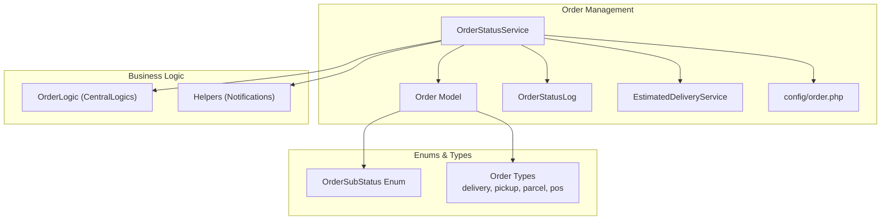
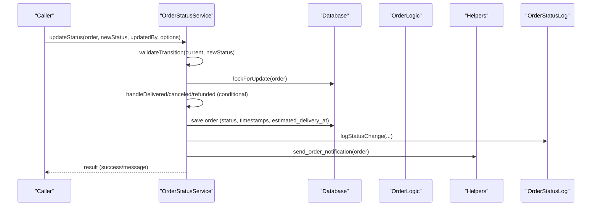
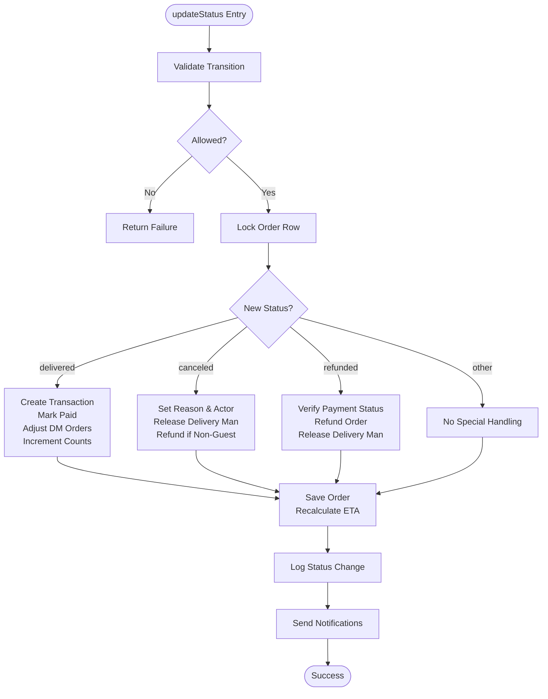
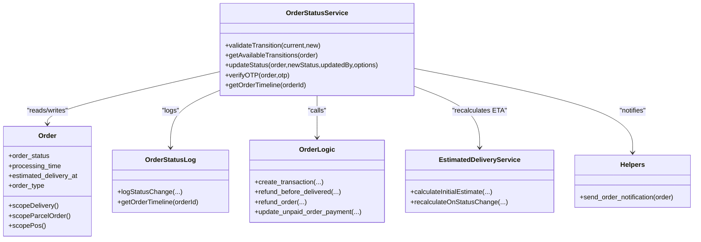

# Order Status Management

<cite>
**Referenced Files in This Document**
- [OrderStatusService.php](file://app/Services/OrderStatusService.php)
- [Order.php](file://app/Models/Order.php)
- [OrderStatusLog.php](file://app/Models/OrderStatusLog.php)
- [OrderSubStatus.php](file://app/Enums/OrderSubStatus.php)
- [order.php](file://app/CentralLogics/order.php)
- [order.php](file://config/order.php)
- [EstimatedDeliveryService.php](file://app/Services/EstimatedDeliveryService.php)
- [Helpers.php](file://app/CentralLogics/Helpers.php)
- [OrderStatusServiceTest.php](file://tests/Unit/OrderStatusServiceTest.php)
</cite>

## Table of Contents
1. [Introduction](#introduction)
2. [Project Structure](#project-structure)
3. [Core Components](#core-components)
4. [Architecture Overview](#architecture-overview)
5. [Detailed Component Analysis](#detailed-component-analysis)
6. [Dependency Analysis](#dependency-analysis)
7. [Performance Considerations](#performance-considerations)
8. [Troubleshooting Guide](#troubleshooting-guide)
9. [Conclusion](#conclusion)
10. [Appendices](#appendices)

## Introduction
This document describes the order status management system, focusing on status update mechanisms, approval workflows, administrative controls, and audit trails. It explains the OrderStatusService implementation, status validation logic, and audit trail generation via order status logs. It also details order types (delivery, pickup, parcel, pos), their specific handling, business rules for status transitions, permission requirements, automated updates, integrations with delivery man assignments, payment verification, inventory adjustments, notifications, and reporting capabilities.

## Project Structure
The order status management spans several core areas:
- Centralized service for status transitions and validations
- Domain models for orders and status logs
- Configuration for transitions and operational settings
- Supporting services for estimated delivery time
- Central logics for payment and transaction handling
- Helpers for notifications and communication triggers
- Tests validating transitions and OTP rate limiting

**Diagram sources**
- [OrderStatusService.php:1-348](file://app/Services/OrderStatusService.php#L1-L348)
- [Order.php:1-358](file://app/Models/Order.php#L1-L358)
- [OrderStatusLog.php:1-112](file://app/Models/OrderStatusLog.php#L1-L112)
- [order.php:1-108](file://config/order.php#L1-L108)
- [EstimatedDeliveryService.php:1-172](file://app/Services/EstimatedDeliveryService.php#L1-L172)
- [order.php:24-674](file://app/CentralLogics/order.php#L24-L674)
- [Helpers.php:2000-2042](file://app/CentralLogics/Helpers.php#L2000-L2042)
- [OrderSubStatus.php:1-78](file://app/Enums/OrderSubStatus.php#L1-L78)

**Section sources**
- [OrderStatusService.php:1-348](file://app/Services/OrderStatusService.php#L1-L348)
- [Order.php:1-358](file://app/Models/Order.php#L1-L358)
- [OrderStatusLog.php:1-112](file://app/Models/OrderStatusLog.php#L1-L112)
- [order.php:1-108](file://config/order.php#L1-L108)
- [EstimatedDeliveryService.php:1-172](file://app/Services/EstimatedDeliveryService.php#L1-L172)
- [order.php:24-674](file://app/CentralLogics/order.php#L24-L674)
- [Helpers.php:2000-2042](file://app/CentralLogics/Helpers.php#L2000-L2042)
- [OrderSubStatus.php:1-78](file://app/Enums/OrderSubStatus.php#L1-L78)

## Core Components
- OrderStatusService: Validates transitions, executes atomic updates, triggers notifications, and maintains audit logs. Handles special cases for delivered, canceled, and refunded states, including payment reconciliation and delivery man adjustments.
- Order Model: Defines order attributes, scopes, and relationships. Includes order type scoping (delivery, parcel, pos) and computed URLs for attachments.
- OrderStatusLog: Persists status change events with metadata, IP, and actor identity for auditability.
- OrderSubStatus: Provides granular sub-statuses for processing and delivery stages.
- OrderLogic: Manages transactions, refunds, unpaid payment updates, and financial adjustments across admin/store/delivery man wallets.
- EstimatedDeliveryService: Recalculates estimated delivery time based on status changes and store characteristics.
- Helpers: Sends order-related notifications to customers, stores, and delivery men, and handles verification emails and push notifications.
- Configuration: Centralizes valid transitions, OTP limits, scheduling, and permissions for cancellations and verifications.

**Section sources**
- [OrderStatusService.php:26-156](file://app/Services/OrderStatusService.php#L26-L156)
- [Order.php:17-51](file://app/Models/Order.php#L17-L51)
- [OrderStatusLog.php:10-25](file://app/Models/OrderStatusLog.php#L10-L25)
- [OrderSubStatus.php:10-77](file://app/Enums/OrderSubStatus.php#L10-L77)
- [order.php:40-371](file://app/CentralLogics/order.php#L40-L371)
- [EstimatedDeliveryService.php:15-69](file://app/Services/EstimatedDeliveryService.php#L15-L69)
- [Helpers.php:2000-2042](file://app/CentralLogics/Helpers.php#L2000-L2042)
- [order.php:66-107](file://config/order.php#L66-L107)

## Architecture Overview
The system centralizes order state changes through a single service that validates transitions, performs atomic updates, and coordinates side effects such as notifications, audit logging, and financial adjustments.

**Diagram sources**
- [OrderStatusService.php:89-156](file://app/Services/OrderStatusService.php#L89-L156)
- [OrderStatusLog.php:71-90](file://app/Models/OrderStatusLog.php#L71-L90)
- [Helpers.php:2000-2042](file://app/CentralLogics/Helpers.php#L2000-L2042)
- [order.php:40-371](file://app/CentralLogics/order.php#L40-L371)

## Detailed Component Analysis

### OrderStatusService
Responsibilities:
- Transition validation against centralized configuration
- Atomic status updates with row-level locking
- Special handling for delivered, canceled, and refunded states
- Recalculation of estimated delivery time
- Audit trail creation
- Notification dispatch
- OTP verification with rate limiting

Key behaviors:
- Transition matrix is configurable and validated before applying changes.
- Delivered state ensures transaction creation, payment marking as paid, delivery man counters adjustment, and inventory-like increments for items/stores/customers/parcel categories.
- Canceled state records cancellation reason and actor, releases delivery man, and initiates refund for non-guest orders.
- Refunded state verifies payment status and triggers refund logic, releasing delivery man.
- OTP verification enforces rate limits and clears attempts on success.

**Diagram sources**
- [OrderStatusService.php:89-156](file://app/Services/OrderStatusService.php#L89-L156)
- [OrderStatusService.php:158-266](file://app/Services/OrderStatusService.php#L158-L266)
- [OrderStatusLog.php:71-90](file://app/Models/OrderStatusLog.php#L71-L90)
- [Helpers.php:2000-2042](file://app/CentralLogics/Helpers.php#L2000-L2042)

**Section sources**
- [OrderStatusService.php:26-156](file://app/Services/OrderStatusService.php#L26-L156)
- [OrderStatusService.php:158-266](file://app/Services/OrderStatusService.php#L158-L266)
- [OrderStatusLog.php:71-90](file://app/Models/OrderStatusLog.php#L71-L90)
- [Helpers.php:2000-2042](file://app/CentralLogics/Helpers.php#L2000-L2042)

### Order Model and Order Types
Order model defines:
- Casts for monetary and numeric fields
- Relationships to delivery man, customer, store, zone, module, and parcel category
- Scopes for filtering by order type (delivery, parcel, pos) and status
- Computed attributes for attachment and voice instruction URLs

Order types:
- Delivery: standard home delivery orders
- Pickup: take-away orders
- Parcel: dedicated parcel delivery
- POS: point-of-sale orders

These types influence which transitions are valid and how notifications and logistics are triggered.

**Section sources**
- [Order.php:17-51](file://app/Models/Order.php#L17-L51)
- [Order.php:277-324](file://app/Models/Order.php#L277-L324)

### Order Status Logs and Audit Trail
OrderStatusLog persists:
- Order ID, previous/new status, updated by type and optional ID
- Reason and metadata (e.g., processing time, order amount, payment method)
- IP address and timestamps

The service logs each status change with contextual metadata, ensuring compliance and traceability.

**Section sources**
- [OrderStatusLog.php:10-25](file://app/Models/OrderStatusLog.php#L10-L25)
- [OrderStatusLog.php:71-90](file://app/Models/OrderStatusLog.php#L71-L90)
- [OrderStatusService.php:313-338](file://app/Services/OrderStatusService.php#L313-L338)

### Order Sub-Statuses
OrderSubStatus provides granular sub-statuses:
- Processing: preparing, packaging, ready
- Delivery: en route, nearby (<500m), arrived

These support richer tracking UIs and can be used alongside main order statuses for customer communication.

**Section sources**
- [OrderSubStatus.php:10-77](file://app/Enums/OrderSubStatus.php#L10-L77)

### Configuration and Permissions
Valid transitions and operational settings are configured centrally:
- Transition matrix for order lifecycle
- OTP attempts and decay window
- Scheduling lookahead window
- Cancellation permissions by role
- Delivery verification toggle

These settings are consumed by the service and logic to enforce business rules.

**Section sources**
- [order.php:66-107](file://config/order.php#L66-L107)
- [OrderStatusService.php:26-42](file://app/Services/OrderStatusService.php#L26-L42)

### Payment and Transaction Handling
OrderLogic manages:
- Transaction creation upon delivery with commission splits
- Refunds before delivery and after delivery with appropriate adjustments
- Updates to unpaid orders and partial payments
- Wallet adjustments for admin, vendor, and delivery man

These operations are invoked during delivered and canceled/refunded transitions.

**Section sources**
- [order.php:40-371](file://app/CentralLogics/order.php#L40-L371)

### Estimated Delivery Time Recalculation
EstimatedDeliveryService recalculates delivery estimates on key status changes:
- Confirmed: full processing + travel + buffer
- Processing: committed processing time + travel
- Handover: travel + small buffer
- Picked Up: travel only

This ensures accurate ETA updates throughout the lifecycle.

**Section sources**
- [EstimatedDeliveryService.php:60-113](file://app/Services/EstimatedDeliveryService.php#L60-L113)

### Notifications and Communication Triggers
Helpers orchestrates:
- Customer email notifications for pending delivery verification and confirmed orders (non-COD)
- Delivery man push notifications when orders enter processing/handover
- General order status notifications to relevant parties

These are triggered automatically after successful status updates.

**Section sources**
- [Helpers.php:2000-2042](file://app/CentralLogics/Helpers.php#L2000-L2042)
- [OrderStatusService.php:138-142](file://app/Services/OrderStatusService.php#L138-L142)

### Reporting and Analytics
OrderStatusLog supports timeline retrieval for an order, enabling:
- Auditing status changes
- Generating reports on transition frequency and timing
- Investigating delays or anomalies

**Section sources**
- [OrderStatusLog.php:95-110](file://app/Models/OrderStatusLog.php#L95-L110)
- [OrderStatusService.php:343-346](file://app/Services/OrderStatusService.php#L343-L346)

## Dependency Analysis

**Diagram sources**
- [OrderStatusService.php:1-348](file://app/Services/OrderStatusService.php#L1-L348)
- [Order.php:1-358](file://app/Models/Order.php#L1-L358)
- [OrderStatusLog.php:1-112](file://app/Models/OrderStatusLog.php#L1-L112)
- [order.php:24-674](file://app/CentralLogics/order.php#L24-L674)
- [EstimatedDeliveryService.php:1-172](file://app/Services/EstimatedDeliveryService.php#L1-L172)
- [Helpers.php:2000-2042](file://app/CentralLogics/Helpers.php#L2000-L2042)

**Section sources**
- [OrderStatusService.php:1-348](file://app/Services/OrderStatusService.php#L1-L348)
- [Order.php:1-358](file://app/Models/Order.php#L1-L358)
- [OrderStatusLog.php:1-112](file://app/Models/OrderStatusLog.php#L1-L112)
- [order.php:24-674](file://app/CentralLogics/order.php#L24-L674)
- [EstimatedDeliveryService.php:1-172](file://app/Services/EstimatedDeliveryService.php#L1-L172)
- [Helpers.php:2000-2042](file://app/CentralLogics/Helpers.php#L2000-L2042)

## Performance Considerations
- Atomicity: Uses database transactions and row-level locks to prevent race conditions during status updates.
- ETA recalculation: Lightweight calculations based on status and store data; minimal overhead.
- Notifications: Asynchronous by nature of mail and push delivery; failures are logged and do not block the main flow.
- Logging: Structured metadata minimizes storage overhead while preserving auditability.

## Troubleshooting Guide
Common issues and resolutions:
- Invalid status transition: The service rejects transitions not defined in the configuration. Verify the current order status and the intended new status.
- OTP verification failures: Exceeding the configured maximum attempts triggers rate limiting. Reset attempts by correcting OTP or allowing decay.
- Delivery man release: Ensure delivery man is assigned; otherwise, canceled/refunded transitions will not adjust delivery man counters.
- Refund errors: COD orders cannot be refunded; verify payment status and transaction existence before attempting refunds.
- Notification failures: Check mail configuration and push notification settings; failures are logged but do not block status updates.

**Section sources**
- [OrderStatusService.php:94-99](file://app/Services/OrderStatusService.php#L94-L99)
- [OrderStatusService.php:275-308](file://app/Services/OrderStatusService.php#L275-L308)
- [OrderStatusService.php:239-266](file://app/Services/OrderStatusService.php#L239-L266)
- [Helpers.php:2034-2041](file://app/CentralLogics/Helpers.php#L2034-L2041)

## Conclusion
The order status management system provides a robust, auditable, and extensible mechanism for controlling order lifecycles. It centralizes validation, automates side effects, integrates with payment and logistics, and offers comprehensive reporting through status logs. The modular design allows easy extension of transitions, sub-statuses, and notification channels.

## Appendices

### Business Rules for Status Transitions
- Pending can move to confirmed, accepted, or canceled.
- Confirmed can move to accepted, processing, or canceled.
- Accepted can move to processing, handover, or canceled.
- Processing can move to handover or canceled.
- Handover can move to picked_up or canceled.
- Picked_up can move to out_for_delivery, delivered, or canceled.
- Out_for_delivery can move to delivered or canceled.
- Delivered can move to refund_requested.
- Refund_requested can move to refunded.
- Canceled, refunded, and failed are terminal states.

**Section sources**
- [order.php:66-79](file://config/order.php#L66-L79)

### Permission Requirements for Status Changes
- Cancellation permissions are configurable by role (store, deliveryman, customer).
- Delivery verification can be enabled/disabled globally.

**Section sources**
- [order.php:96-98](file://config/order.php#L96-L98)
- [order.php:106](file://config/order.php#L106)

### Automated Status Updates Based on System Events
- Estimated delivery time recalculations occur on key status changes.
- Unpaid order payments are updated to paid upon successful transactions.
- Delivery man counters are adjusted automatically on delivered and canceled/refunded transitions.

**Section sources**
- [EstimatedDeliveryService.php:60-113](file://app/Services/EstimatedDeliveryService.php#L60-L113)
- [order.php:565-581](file://app/CentralLogics/order.php#L565-L581)
- [OrderStatusService.php:182-188](file://app/Services/OrderStatusService.php#L182-L188)

### Integration with Delivery Man Assignments, Payment Verification, and Inventory Adjustments
- Delivery man assignment: Delivery man is linked to the order; counters are decremented on delivered and canceled/refunded.
- Payment verification: OTP verification with rate limiting; delivery verification email sent for pending orders when enabled.
- Inventory adjustments: Item, customer, store, and parcel category order counts are incremented on delivered.

**Section sources**
- [Order.php:128-131](file://app/Models/Order.php#L128-L131)
- [OrderStatusService.php:275-308](file://app/Services/OrderStatusService.php#L275-L308)
- [OrderStatusService.php:164-203](file://app/Services/OrderStatusService.php#L164-L203)

### Status Change Notifications and Customer Communication Triggers
- Pending delivery verification email when enabled.
- Order confirmation email for non-COD confirmed orders.
- Delivery man push notifications when entering processing/handover.

**Section sources**
- [Helpers.php:2027-2036](file://app/CentralLogics/Helpers.php#L2027-L2036)
- [Helpers.php:2009-2024](file://app/CentralLogics/Helpers.php#L2009-L2024)

### Reporting Capabilities for Status Analytics
- Timeline retrieval for an order’s status history.
- Export and report formatting utilities for order data.

**Section sources**
- [OrderStatusLog.php:95-110](file://app/Models/OrderStatusLog.php#L95-L110)
- [order.php:480-548](file://app/CentralLogics/order.php#L480-L548)