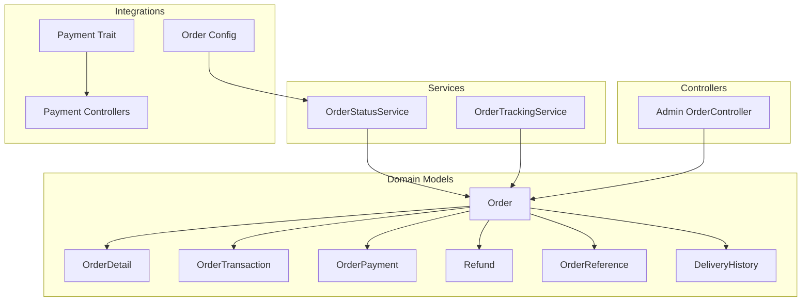
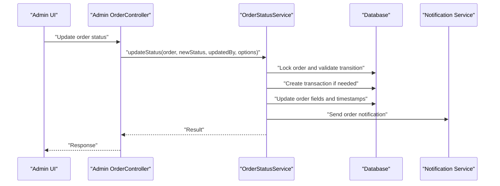
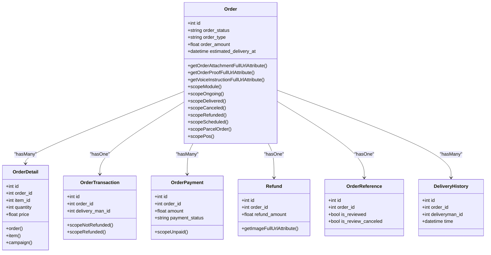
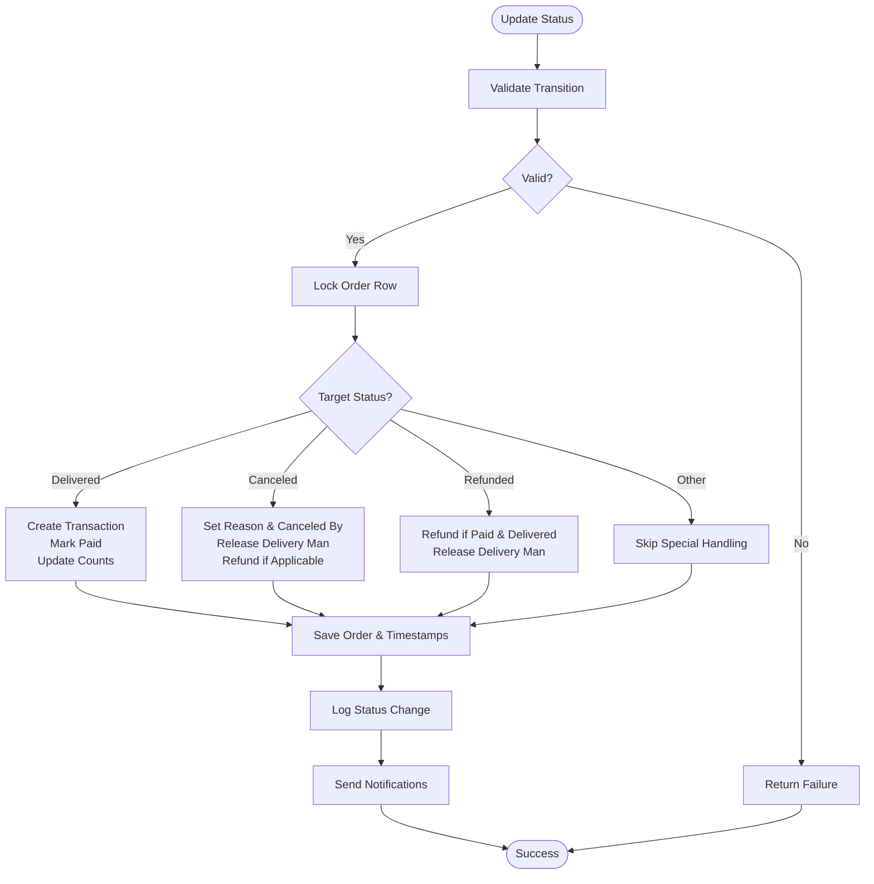
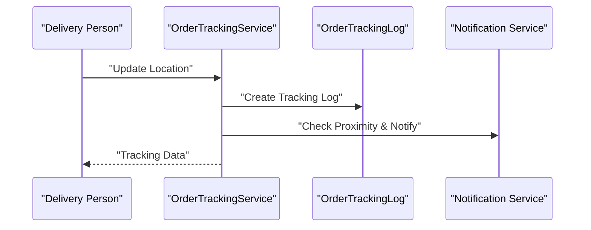
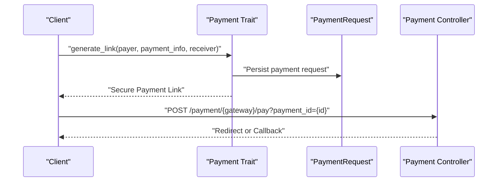
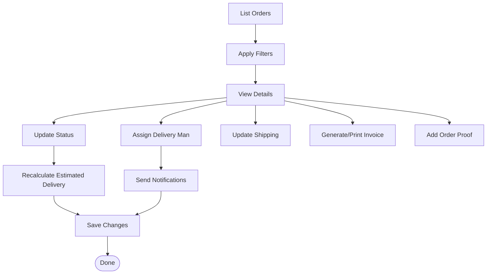
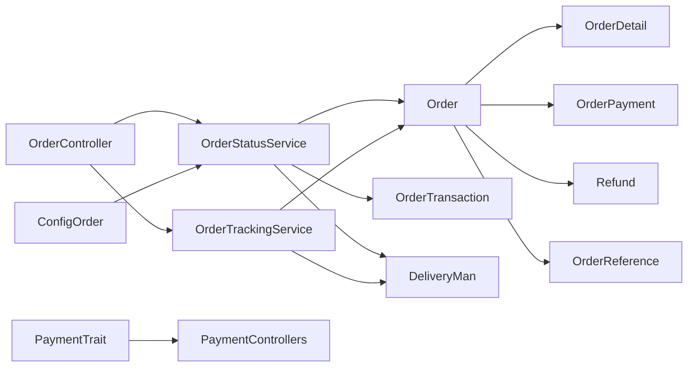

# Order System Integrations

<cite>
**Referenced Files in This Document**
- [Order.php](file://app/Models/Order.php)
- [OrderDetail.php](file://app/Models/OrderDetail.php)
- [OrderTransaction.php](file://app/Models/OrderTransaction.php)
- [OrderPayment.php](file://app/Models/OrderPayment.php)
- [Refund.php](file://app/Models/Refund.php)
- [OrderReference.php](file://app/Models/OrderReference.php)
- [OrderStatusService.php](file://app/Services/OrderStatusService.php)
- [OrderTrackingService.php](file://app/Services/OrderTrackingService.php)
- [OrderController.php](file://app/Http/Controllers/Admin/OrderController.php)
- [Payment.php](file://app/Traits/Payment.php)
- [order.php](file://config/order.php)
- [DeliveryHistory.php](file://app/Models/DeliveryHistory.php)
</cite>

## Table of Contents
1. [Introduction](#introduction)
2. [Project Structure](#project-structure)
3. [Core Components](#core-components)
4. [Architecture Overview](#architecture-overview)
5. [Detailed Component Analysis](#detailed-component-analysis)
6. [Dependency Analysis](#dependency-analysis)
7. [Performance Considerations](#performance-considerations)
8. [Troubleshooting Guide](#troubleshooting-guide)
9. [Conclusion](#conclusion)

## Introduction
This document explains the order system integrations within the Laravel-based e-commerce platform, focusing on how orders relate to transactions, payments, refunds, delivery history, and order references. It details integration patterns with payment processing systems, inventory management, delivery coordination, and customer communication platforms. The documentation also covers order detail structures, variation handling, bulk operations, webhook/callback implementations, and asynchronous processing patterns for external system communications.

## Project Structure
The order system spans several core areas:
- Domain models representing orders, order details, transactions, payments, refunds, and references
- Services orchestrating status transitions, tracking, and notifications
- Controllers managing administrative workflows and external payment integrations
- Configuration governing order behavior, OTP limits, and status transitions
- Traits enabling payment link generation and gateway integration

**Diagram sources**
- [Order.php:13-358](file://app/Models/Order.php#L13-L358)
- [OrderDetail.php:10-51](file://app/Models/OrderDetail.php#L10-L51)
- [OrderTransaction.php:9-47](file://app/Models/OrderTransaction.php#L9-L47)
- [OrderPayment.php:8-27](file://app/Models/OrderPayment.php#L8-L27)
- [Refund.php:12-72](file://app/Models/Refund.php#L12-L72)
- [OrderReference.php:10-26](file://app/Models/OrderReference.php#L10-L26)
- [OrderStatusService.php:21-348](file://app/Services/OrderStatusService.php#L21-L348)
- [OrderTrackingService.php:12-124](file://app/Services/OrderTrackingService.php#L12-L124)
- [OrderController.php:46-800](file://app/Http/Controllers/Admin/OrderController.php#L46-L800)
- [Payment.php:10-84](file://app/Traits/Payment.php#L10-L84)
- [order.php:10-108](file://config/order.php#L10-L108)

**Section sources**
- [Order.php:13-358](file://app/Models/Order.php#L13-L358)
- [OrderDetail.php:10-51](file://app/Models/OrderDetail.php#L10-L51)
- [OrderTransaction.php:9-47](file://app/Models/OrderTransaction.php#L9-L47)
- [OrderPayment.php:8-27](file://app/Models/OrderPayment.php#L8-L27)
- [Refund.php:12-72](file://app/Models/Refund.php#L12-L72)
- [OrderReference.php:10-26](file://app/Models/OrderReference.php#L10-L26)
- [OrderStatusService.php:21-348](file://app/Services/OrderStatusService.php#L21-L348)
- [OrderTrackingService.php:12-124](file://app/Services/OrderTrackingService.php#L12-L124)
- [OrderController.php:46-800](file://app/Http/Controllers/Admin/OrderController.php#L46-L800)
- [Payment.php:10-84](file://app/Traits/Payment.php#L10-L84)
- [order.php:10-108](file://config/order.php#L10-L108)

## Core Components
- Order model encapsulates order metadata, relationships to customers, stores, zones, delivery personnel, coupons, and references. It includes scopes for filtering by status and type, and computed attributes for media URLs.
- OrderDetail captures items purchased, quantities, prices, discounts, taxes, and optional campaigns.
- OrderTransaction records financial settlement per order, linking to delivery personnel and supporting refund status filtering.
- OrderPayment tracks payment attempts and statuses for an order.
- Refund holds refund requests and images, with morph-to-storage support.
- OrderReference links orders to review/referral tracking.
- OrderStatusService validates transitions, executes atomic updates, recalculates estimated delivery, logs status changes, and triggers notifications.
- OrderTrackingService manages location updates, proximity notifications, and current tracking data.
- Payment trait generates secure payment links and persists payment requests for multiple gateways.
- OrderController coordinates administrative actions, including status changes, delivery assignments, shipping updates, invoice generation, and payment reference management.

**Section sources**
- [Order.php:13-358](file://app/Models/Order.php#L13-L358)
- [OrderDetail.php:10-51](file://app/Models/OrderDetail.php#L10-L51)
- [OrderTransaction.php:9-47](file://app/Models/OrderTransaction.php#L9-L47)
- [OrderPayment.php:8-27](file://app/Models/OrderPayment.php#L8-L27)
- [Refund.php:12-72](file://app/Models/Refund.php#L12-L72)
- [OrderReference.php:10-26](file://app/Models/OrderReference.php#L10-L26)
- [OrderStatusService.php:21-348](file://app/Services/OrderStatusService.php#L21-L348)
- [OrderTrackingService.php:12-124](file://app/Services/OrderTrackingService.php#L12-L124)
- [Payment.php:10-84](file://app/Traits/Payment.php#L10-L84)
- [OrderController.php:46-800](file://app/Http/Controllers/Admin/OrderController.php#L46-L800)

## Architecture Overview
The order system follows a layered architecture:
- Presentation: Controllers handle HTTP requests and delegate to services.
- Services: Encapsulate business logic for status transitions, tracking, and notifications.
- Persistence: Eloquent models define relationships and scopes; configuration governs behavior.
- Integration: Payment trait and controllers integrate with external payment providers via standardized hooks and redirect links.

**Diagram sources**
- [OrderController.php:369-574](file://app/Http/Controllers/Admin/OrderController.php#L369-L574)
- [OrderStatusService.php:89-156](file://app/Services/OrderStatusService.php#L89-L156)

**Section sources**
- [OrderController.php:369-574](file://app/Http/Controllers/Admin/OrderController.php#L369-L574)
- [OrderStatusService.php:89-156](file://app/Services/OrderStatusService.php#L89-L156)

## Detailed Component Analysis

### Order Model and Relationships
The Order model defines:
- Casts for numeric and boolean fields, ensuring consistent serialization
- Computed attributes for attachment, proof, and voice instruction URLs
- Relationships to customer, store, zone, delivery personnel, coupons, details, payments, transactions, refunds, references, delivery history, and tracking logs
- Scope methods for filtering by status, type, scheduling, and module
- MorphToMany storage for attachments

**Diagram sources**
- [Order.php:13-358](file://app/Models/Order.php#L13-L358)
- [OrderDetail.php:10-51](file://app/Models/OrderDetail.php#L10-L51)
- [OrderTransaction.php:9-47](file://app/Models/OrderTransaction.php#L9-L47)
- [OrderPayment.php:8-27](file://app/Models/OrderPayment.php#L8-L27)
- [Refund.php:12-72](file://app/Models/Refund.php#L12-L72)
- [OrderReference.php:10-26](file://app/Models/OrderReference.php#L10-L26)
- [DeliveryHistory.php:7-22](file://app/Models/DeliveryHistory.php#L7-L22)

**Section sources**
- [Order.php:13-358](file://app/Models/Order.php#L13-L358)
- [OrderDetail.php:10-51](file://app/Models/OrderDetail.php#L10-L51)
- [OrderTransaction.php:9-47](file://app/Models/OrderTransaction.php#L9-L47)
- [OrderPayment.php:8-27](file://app/Models/OrderPayment.php#L8-L27)
- [Refund.php:12-72](file://app/Models/Refund.php#L12-L72)
- [OrderReference.php:10-26](file://app/Models/OrderReference.php#L10-L26)
- [DeliveryHistory.php:7-22](file://app/Models/DeliveryHistory.php#L7-L22)

### Order Status Management
OrderStatusService centralizes status transitions with:
- Validation against configured valid transitions
- Atomic transaction handling with row-level locking
- Special handlers for delivered, canceled, and refunded states
- Estimated delivery recalculation and audit logging
- OTP verification with rate limiting using cache

**Diagram sources**
- [OrderStatusService.php:89-266](file://app/Services/OrderStatusService.php#L89-L266)

**Section sources**
- [OrderStatusService.php:26-78](file://app/Services/OrderStatusService.php#L26-L78)
- [OrderStatusService.php:89-266](file://app/Services/OrderStatusService.php#L89-L266)

### Order Tracking and Delivery Coordination
OrderTrackingService:
- Logs location updates with order status and sub-status
- Provides current tracking data including delivery person details
- Updates sub-status with optional notifications
- Coordinates proximity notifications based on delivery person location

**Diagram sources**
- [OrderTrackingService.php:28-122](file://app/Services/OrderTrackingService.php#L28-L122)

**Section sources**
- [OrderTrackingService.php:28-122](file://app/Services/OrderTrackingService.php#L28-L122)

### Payment Integration Patterns
The Payment trait:
- Generates payment links for multiple gateways
- Persists PaymentRequest entries with payer/receiver info and hooks
- Supports external redirects and additional data arrays

**Diagram sources**
- [Payment.php:12-82](file://app/Traits/Payment.php#L12-L82)

**Section sources**
- [Payment.php:12-82](file://app/Traits/Payment.php#L12-L82)

### Administrative Workflows and Bulk Operations
Admin OrderController manages:
- Listing orders filtered by status, module, zone, vendor, and date range
- Updating order status with validation and side effects (transactions, counts, refunds)
- Assigning delivery persons with availability checks and cash-in-hand limits
- Updating shipping addresses with zone coverage validation
- Generating invoices and adding payment reference codes
- Handling order proofs upload

**Diagram sources**
- [OrderController.php:49-154](file://app/Http/Controllers/Admin/OrderController.php#L49-L154)
- [OrderController.php:369-574](file://app/Http/Controllers/Admin/OrderController.php#L369-L574)
- [OrderController.php:576-718](file://app/Http/Controllers/Admin/OrderController.php#L576-L718)
- [OrderController.php:720-750](file://app/Http/Controllers/Admin/OrderController.php#L720-L750)
- [OrderController.php:752-787](file://app/Http/Controllers/Admin/OrderController.php#L752-L787)
- [OrderController.php:789-800](file://app/Http/Controllers/Admin/OrderController.php#L789-L800)

**Section sources**
- [OrderController.php:49-154](file://app/Http/Controllers/Admin/OrderController.php#L49-L154)
- [OrderController.php:369-574](file://app/Http/Controllers/Admin/OrderController.php#L369-L574)
- [OrderController.php:576-718](file://app/Http/Controllers/Admin/OrderController.php#L576-L718)
- [OrderController.php:720-750](file://app/Http/Controllers/Admin/OrderController.php#L720-L750)
- [OrderController.php:752-787](file://app/Http/Controllers/Admin/OrderController.php#L752-L787)
- [OrderController.php:789-800](file://app/Http/Controllers/Admin/OrderController.php#L789-L800)

### Order Detail Structure and Variation Handling
OrderDetail supports:
- Item or campaign-based purchases
- Quantities, pricing, discounts, taxes, and total add-on price
- Relationship to order, item, and campaign
- Global scope ensuring related order presence

Variation handling:
- Variants are stored as JSON and processed during stock updates and cancellations
- Campaign variants are supported alongside regular item variants

**Section sources**
- [OrderDetail.php:14-51](file://app/Models/OrderDetail.php#L14-L51)
- [OrderController.php:534-543](file://app/Http/Controllers/Admin/OrderController.php#L534-L543)

### Data Consistency Mechanisms
- Row-level locking during status updates and delivery assignments prevents race conditions
- Transactions wrap critical operations to maintain atomicity
- Audit logging via OrderStatusLog ensures traceability
- Cache-backed OTP rate limiting prevents brute-force attempts

**Section sources**
- [OrderStatusService.php:102-148](file://app/Services/OrderStatusService.php#L102-L148)
- [OrderController.php:583-717](file://app/Http/Controllers/Admin/OrderController.php#L583-L717)
- [OrderStatusService.php:275-308](file://app/Services/OrderStatusService.php#L275-L308)

### Error Handling and Retry Strategies
- Status updates catch exceptions and return structured failures
- Delivery assignment handles availability and cash-in-hand constraints with informative responses
- Notification failures are logged and do not block primary operations
- OTP attempts are rate-limited with decay windows

**Section sources**
- [OrderStatusService.php:149-155](file://app/Services/OrderStatusService.php#L149-L155)
- [OrderController.php:608-619](file://app/Http/Controllers/Admin/OrderController.php#L608-L619)
- [OrderStatusService.php:138-142](file://app/Services/OrderStatusService.php#L138-L142)

### Webhook Implementations and Asynchronous Processing
- Payment trait persists PaymentRequest entries and maps payment method to route, enabling asynchronous callbacks
- Payment controllers handle success/failure hooks and external redirects
- Notifications are sent asynchronously via push and email channels

**Section sources**
- [Payment.php:22-37](file://app/Traits/Payment.php#L22-L37)
- [Payment.php:39-82](file://app/Traits/Payment.php#L39-L82)
- [OrderStatusService.php:138-142](file://app/Services/OrderStatusService.php#L138-L142)

## Dependency Analysis
The order system exhibits clear separation of concerns:
- Models define domain entities and relationships
- Services encapsulate business logic and orchestration
- Controllers coordinate user interactions and delegate to services
- Configuration centralizes behavioral settings
- Traits provide reusable integration capabilities

**Diagram sources**
- [OrderController.php:46-800](file://app/Http/Controllers/Admin/OrderController.php#L46-L800)
- [OrderStatusService.php:21-348](file://app/Services/OrderStatusService.php#L21-L348)
- [OrderTrackingService.php:12-124](file://app/Services/OrderTrackingService.php#L12-L124)
- [Payment.php:10-84](file://app/Traits/Payment.php#L10-L84)
- [order.php:10-108](file://config/order.php#L10-L108)

**Section sources**
- [OrderController.php:46-800](file://app/Http/Controllers/Admin/OrderController.php#L46-L800)
- [OrderStatusService.php:21-348](file://app/Services/OrderStatusService.php#L21-L348)
- [OrderTrackingService.php:12-124](file://app/Services/OrderTrackingService.php#L12-L124)
- [Payment.php:10-84](file://app/Traits/Payment.php#L10-L84)
- [order.php:10-108](file://config/order.php#L10-L108)

## Performance Considerations
- Use scopes and eager loading to minimize N+1 queries when listing orders and retrieving details
- Batch operations for status updates and notifications to reduce overhead
- Cache frequently accessed configuration values (e.g., OTP limits, delivery thresholds)
- Index order status, timestamps, and foreign keys to optimize filtering and joins

## Troubleshooting Guide
Common issues and resolutions:
- Invalid status transitions: Ensure the target status exists in configured valid transitions
- Delivery assignment conflicts: Verify delivery person availability and cash-in-hand limits
- Payment link generation failures: Confirm payment method mapping and required fields in PaymentRequest
- Notification failures: Check push token validity and notification channel configurations
- OTP attempts exceeded: Monitor cache keys and adjust decay windows as needed

**Section sources**
- [OrderStatusService.php:51-60](file://app/Services/OrderStatusService.php#L51-L60)
- [OrderController.php:608-619](file://app/Http/Controllers/Admin/OrderController.php#L608-L619)
- [Payment.php:14-20](file://app/Traits/Payment.php#L14-L20)
- [OrderStatusService.php:275-308](file://app/Services/OrderStatusService.php#L275-L308)

## Conclusion
The order system integrates external payment providers, delivery coordination, and customer communication through well-defined models, services, and controllers. Robust status management, transactional integrity, and configurable behavior ensure reliable operations across diverse scenarios. The architecture supports extensibility for additional payment gateways, delivery partners, and notification channels while maintaining data consistency and operational visibility.