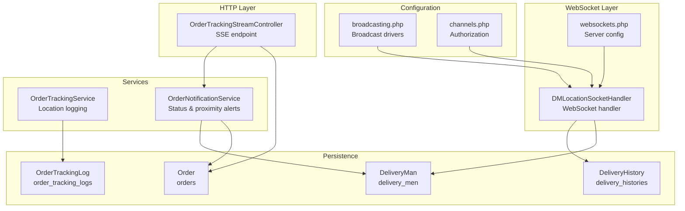
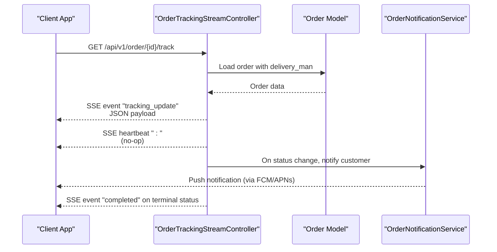
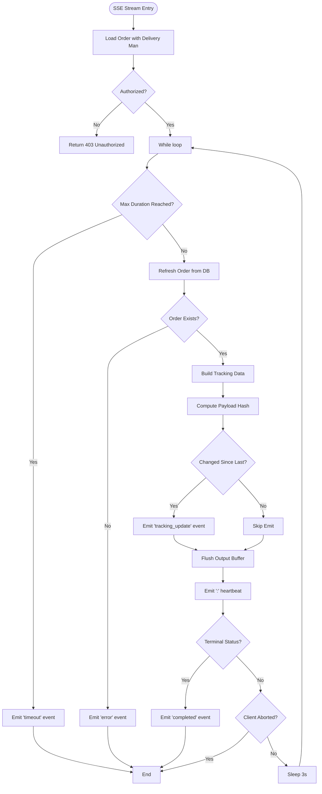
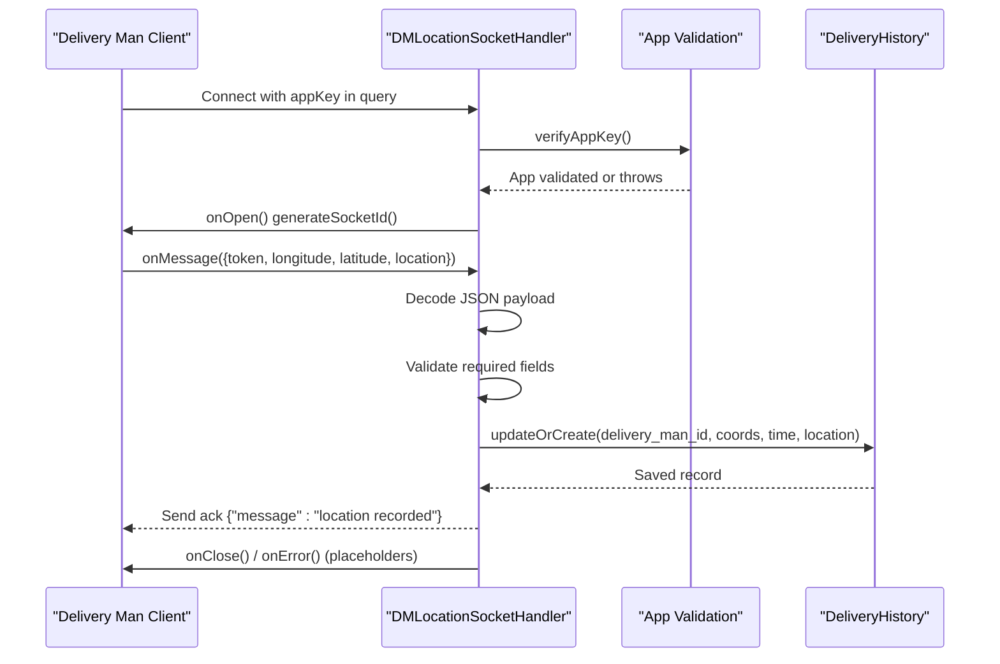
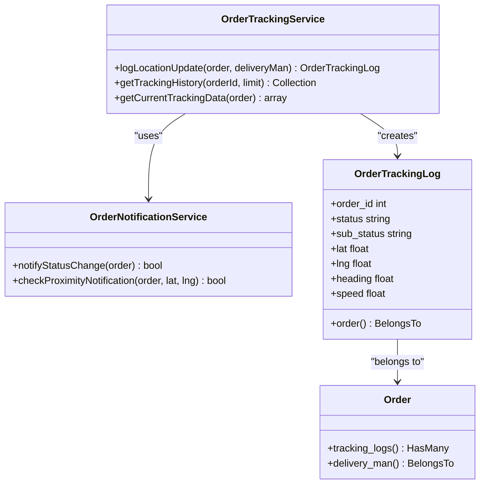
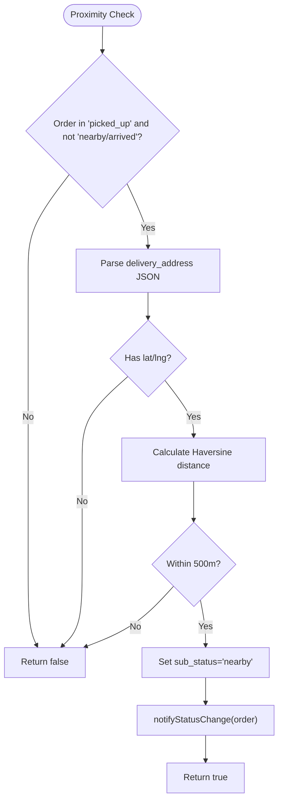
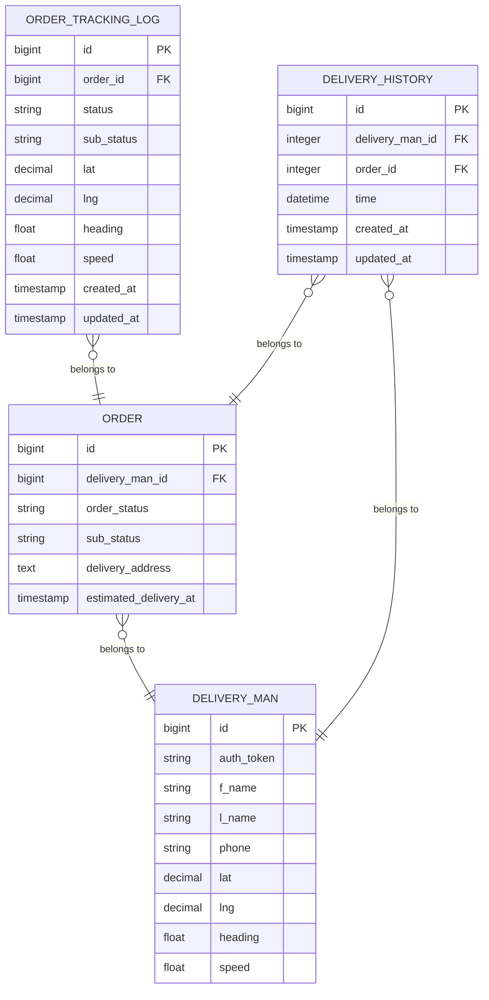
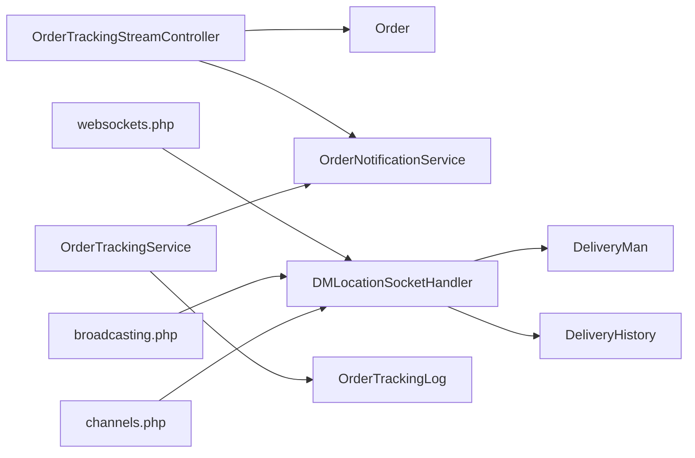

# Real-time Order Tracking

<cite>
**Referenced Files in This Document**
- [OrderTrackingStreamController.php](file://app/Http/Controllers/Api/V1/OrderTrackingStreamController.php)
- [DMLocationSocketHandler.php](file://app/WebSockets/Handler/DMLocationSocketHandler.php)
- [OrderTrackingService.php](file://app/Services/OrderTrackingService.php)
- [OrderNotificationService.php](file://app/Services/OrderNotificationService.php)
- [OrderTrackingLog.php](file://app/Models/OrderTrackingLog.php)
- [DeliveryHistory.php](file://app/Models/DeliveryHistory.php)
- [Order.php](file://app/Models/Order.php)
- [DeliveryMan.php](file://app/Models/DeliveryMan.php)
- [websockets.php](file://config/websockets.php)
- [broadcasting.php](file://config/broadcasting.php)
- [channels.php](file://routes/channels.php)
- [2026_01_25_000002_create_order_tracking_logs_table.php](file://database/migrations/2026_01_25_000002_create_order_tracking_logs_table.php)
- [DeliveryManController.php](file://app/Http/Controllers/Api/V1/DeliveryManController.php)
</cite>

## Table of Contents
1. [Introduction](#introduction)
2. [Project Structure](#project-structure)
3. [Core Components](#core-components)
4. [Architecture Overview](#architecture-overview)
5. [Detailed Component Analysis](#detailed-component-analysis)
6. [Dependency Analysis](#dependency-analysis)
7. [Performance Considerations](#performance-considerations)
8. [Troubleshooting Guide](#troubleshooting-guide)
9. [Conclusion](#conclusion)

## Introduction
This document describes the real-time order tracking system, focusing on live location updates, order status streaming, and delivery man tracking. It explains the WebSocket implementation for bidirectional communication, the server-sent events (SSE) mechanism for status updates, connection management, message broadcasting, and the logging infrastructure for tracking history and location persistence. It also covers event types, message formats, client-server protocols, synchronization strategies, and operational guidance for high-concurrency scenarios.

## Project Structure
The real-time tracking system spans several layers:
- HTTP controllers for SSE-based order tracking streams
- WebSocket handlers for live delivery man location updates
- Services for tracking and notifications
- Models for persistence of tracking logs and delivery history
- Configuration for WebSocket server and broadcasting drivers
- Database migrations defining tracking log schema

**Diagram sources**
- [OrderTrackingStreamController.php:19-101](file://app/Http/Controllers/Api/V1/OrderTrackingStreamController.php#L19-L101)
- [DMLocationSocketHandler.php:16-81](file://app/WebSockets/Handler/DMLocationSocketHandler.php#L16-L81)
- [OrderTrackingService.php:28-50](file://app/Services/OrderTrackingService.php#L28-L50)
- [OrderNotificationService.php:86-122](file://app/Services/OrderNotificationService.php#L86-L122)
- [OrderTrackingLog.php:8-55](file://app/Models/OrderTrackingLog.php#L8-L55)
- [DeliveryHistory.php:7-22](file://app/Models/DeliveryHistory.php#L7-L22)
- [Order.php:13-172](file://app/Models/Order.php#L13-L172)
- [DeliveryMan.php:13-112](file://app/Models/DeliveryMan.php#L13-L112)
- [websockets.php:24-35](file://config/websockets.php#L24-L35)
- [broadcasting.php:31-62](file://config/broadcasting.php#L31-L62)
- [channels.php:16-18](file://routes/channels.php#L16-L18)

**Section sources**
- [OrderTrackingStreamController.php:19-101](file://app/Http/Controllers/Api/V1/OrderTrackingStreamController.php#L19-L101)
- [DMLocationSocketHandler.php:16-81](file://app/WebSockets/Handler/DMLocationSocketHandler.php#L16-L81)
- [OrderTrackingService.php:28-50](file://app/Services/OrderTrackingService.php#L28-L50)
- [OrderNotificationService.php:86-122](file://app/Services/OrderNotificationService.php#L86-L122)
- [OrderTrackingLog.php:8-55](file://app/Models/OrderTrackingLog.php#L8-L55)
- [DeliveryHistory.php:7-22](file://app/Models/DeliveryHistory.php#L7-L22)
- [Order.php:13-172](file://app/Models/Order.php#L13-L172)
- [DeliveryMan.php:13-112](file://app/Models/DeliveryMan.php#L13-L112)
- [websockets.php:24-35](file://config/websockets.php#L24-L35)
- [broadcasting.php:31-62](file://config/broadcasting.php#L31-L62)
- [channels.php:16-18](file://routes/channels.php#L16-L18)

## Core Components
- SSE Order Tracking Stream Controller: Streams order status and delivery man location updates to clients with change-detection and heartbeat.
- WebSocket Delivery Man Location Handler: Receives live location updates from delivery men, authenticates via token, persists last location, and acknowledges receipt.
- Order Tracking Service: Logs location updates with status and sub-status, triggers proximity notifications.
- Order Notification Service: Sends push notifications for status changes and proximity thresholds, and manages iOS Live Activity updates.
- Persistence Models: OrderTrackingLog for historical tracking entries, DeliveryHistory for last location snapshots, Order and DeliveryMan for relationships.
- Configuration: Laravel WebSockets server configuration and broadcasting drivers.

**Section sources**
- [OrderTrackingStreamController.php:19-101](file://app/Http/Controllers/Api/V1/OrderTrackingStreamController.php#L19-L101)
- [DMLocationSocketHandler.php:16-81](file://app/WebSockets/Handler/DMLocationSocketHandler.php#L16-L81)
- [OrderTrackingService.php:28-50](file://app/Services/OrderTrackingService.php#L28-L50)
- [OrderNotificationService.php:86-122](file://app/Services/OrderNotificationService.php#L86-L122)
- [OrderTrackingLog.php:8-55](file://app/Models/OrderTrackingLog.php#L8-L55)
- [DeliveryHistory.php:7-22](file://app/Models/DeliveryHistory.php#L7-L22)
- [Order.php:13-172](file://app/Models/Order.php#L13-L172)
- [DeliveryMan.php:13-112](file://app/Models/DeliveryMan.php#L13-L112)
- [websockets.php:24-35](file://config/websockets.php#L24-L35)
- [broadcasting.php:31-62](file://config/broadcasting.php#L31-L62)
- [channels.php:16-18](file://routes/channels.php#L16-L18)

## Architecture Overview
The system combines SSE and WebSocket for different real-time needs:
- SSE: Long-lived server-to-client streaming for order status updates and delivery man location changes.
- WebSocket: Bidirectional delivery man location reporting with authentication and acknowledgment.

**Diagram sources**
- [OrderTrackingStreamController.php:19-101](file://app/Http/Controllers/Api/V1/OrderTrackingStreamController.php#L19-L101)
- [OrderNotificationService.php:86-122](file://app/Services/OrderNotificationService.php#L86-L122)
- [Order.php:128-131](file://app/Models/Order.php#L128-L131)

**Section sources**
- [OrderTrackingStreamController.php:19-101](file://app/Http/Controllers/Api/V1/OrderTrackingStreamController.php#L19-L101)
- [OrderNotificationService.php:86-122](file://app/Services/OrderNotificationService.php#L86-L122)
- [Order.php:128-131](file://app/Models/Order.php#L128-L131)

## Detailed Component Analysis

### SSE Order Tracking Stream Controller
- Purpose: Provide a long-lived SSE endpoint that emits tracking updates for a specific order.
- Authentication and Authorization: Validates access via logged-in user ownership, guest contact number matching, or guest ID.
- Data Building: Constructs tracking payload including order status, sub-status, delivery man details, and timestamp.
- Change Detection: Uses MD5 hash of serialized payload to avoid redundant emissions.
- Heartbeat: Emits comment-only events to keep connection alive and detect client disconnects.
- Lifecycle: Stops streaming on terminal statuses and after a maximum connection duration.
- Headers: Sets SSE-compatible headers and CORS allowance.

**Diagram sources**
- [OrderTrackingStreamController.php:32-94](file://app/Http/Controllers/Api/V1/OrderTrackingStreamController.php#L32-L94)

**Section sources**
- [OrderTrackingStreamController.php:19-101](file://app/Http/Controllers/Api/V1/OrderTrackingStreamController.php#L19-L101)
- [OrderTrackingStreamController.php:106-131](file://app/Http/Controllers/Api/V1/OrderTrackingStreamController.php#L106-L131)
- [OrderTrackingStreamController.php:136-172](file://app/Http/Controllers/Api/V1/OrderTrackingStreamController.php#L136-L172)

### WebSocket Delivery Man Location Handler
- Purpose: Accept live location updates from delivery men via WebSocket, authenticate via token, persist last location, and acknowledge receipt.
- Authentication: Extracts app key from query parameters and validates against configured apps; authenticates delivery man via auth token.
- Message Handling: Decodes JSON payload containing token, longitude, latitude, and location; updates or creates DeliveryHistory record.
- Acknowledgment: Sends a JSON acknowledgment back to the client upon successful recording.
- Lifecycle Hooks: Implements open/close/error hooks; currently leaves close and error unimplemented.

**Diagram sources**
- [DMLocationSocketHandler.php:19-43](file://app/WebSockets/Handler/DMLocationSocketHandler.php#L19-L43)
- [DMLocationSocketHandler.php:46-60](file://app/WebSockets/Handler/DMLocationSocketHandler.php#L46-L60)
- [DMLocationSocketHandler.php:62-81](file://app/WebSockets/Handler/DMLocationSocketHandler.php#L62-L81)

**Section sources**
- [DMLocationSocketHandler.php:16-81](file://app/WebSockets/Handler/DMLocationSocketHandler.php#L16-L81)

### Order Tracking Service
- Purpose: Centralize location logging and proximity notification logic.
- Location Logging: Creates OrderTrackingLog entries with order status, sub-status, and driver coordinates.
- Proximity Notifications: Triggers proximity-based "nearby" sub-status transitions and sends notifications when driver approaches delivery address.

**Diagram sources**
- [OrderTrackingService.php:28-50](file://app/Services/OrderTrackingService.php#L28-L50)
- [OrderNotificationService.php:252-283](file://app/Services/OrderNotificationService.php#L252-L283)
- [OrderTrackingLog.php:8-55](file://app/Models/OrderTrackingLog.php#L8-L55)
- [Order.php:196-199](file://app/Models/Order.php#L196-L199)

**Section sources**
- [OrderTrackingService.php:28-50](file://app/Services/OrderTrackingService.php#L28-L50)
- [OrderTrackingService.php:59-65](file://app/Services/OrderTrackingService.php#L59-L65)
- [OrderTrackingService.php:73-100](file://app/Services/OrderTrackingService.php#L73-L100)

### Order Notification Service
- Purpose: Manage push notifications for order status changes and proximity thresholds, and coordinate iOS Live Activity updates.
- Status Steps: Defines step and progress mapping for UI rendering.
- Messages: Predefined localized messages per status and sub-status.
- Extended Payload: Builds rich data payload for background updates (ETA, store/driver info, progress).
- Proximity Logic: Calculates distance between driver and delivery address; sets sub-status to "nearby" and notifies when within threshold.
- Live Activity: Sends APNs push to update iOS Live Activity.

**Diagram sources**
- [OrderNotificationService.php:252-283](file://app/Services/OrderNotificationService.php#L252-L283)
- [OrderNotificationService.php:288-302](file://app/Services/OrderNotificationService.php#L288-L302)

**Section sources**
- [OrderNotificationService.php:86-122](file://app/Services/OrderNotificationService.php#L86-L122)
- [OrderNotificationService.php:133-172](file://app/Services/OrderNotificationService.php#L133-L172)
- [OrderNotificationService.php:252-283](file://app/Services/OrderNotificationService.php#L252-L283)
- [OrderNotificationService.php:288-302](file://app/Services/OrderNotificationService.php#L288-L302)

### Data Models and Persistence
- OrderTrackingLog: Stores per-order tracking entries with status, sub-status, and geolocation metadata; indexed for efficient queries.
- DeliveryHistory: Stores last known location snapshots for delivery men; linked to orders and delivery men.
- Order and DeliveryMan: Relationships enable building tracking payloads and proximity calculations.

**Diagram sources**
- [OrderTrackingLog.php:8-55](file://app/Models/OrderTrackingLog.php#L8-L55)
- [DeliveryHistory.php:7-22](file://app/Models/DeliveryHistory.php#L7-L22)
- [Order.php:128-172](file://app/Models/Order.php#L128-L172)
- [DeliveryMan.php:13-112](file://app/Models/DeliveryMan.php#L13-L112)
- [2026_01_25_000002_create_order_tracking_logs_table.php:14-30](file://database/migrations/2026_01_25_000002_create_order_tracking_logs_table.php#L14-L30)

**Section sources**
- [OrderTrackingLog.php:8-55](file://app/Models/OrderTrackingLog.php#L8-L55)
- [DeliveryHistory.php:7-22](file://app/Models/DeliveryHistory.php#L7-L22)
- [Order.php:128-172](file://app/Models/Order.php#L128-L172)
- [DeliveryMan.php:13-112](file://app/Models/DeliveryMan.php#L13-L112)
- [2026_01_25_000002_create_order_tracking_logs_table.php:14-30](file://database/migrations/2026_01_25_000002_create_order_tracking_logs_table.php#L14-L30)

### Delivery Man Location Recording (REST)
- Endpoint: Records delivery man location via REST when WebSocket is disabled or unavailable.
- Behavior: Updates or creates a DeliveryHistory record for the delivery man and order.

**Section sources**
- [DeliveryManController.php:375-388](file://app/Http/Controllers/Api/V1/DeliveryManController.php#L375-L388)

## Dependency Analysis
- SSE Controller depends on Order model and OrderNotificationService for push notifications.
- WebSocket Handler depends on DeliveryMan and DeliveryHistory models; uses Laravel WebSockets server configuration.
- OrderTrackingService depends on OrderTrackingLog and OrderNotificationService.
- Broadcasting configuration supports multiple drivers; WebSocket server uses its own configuration.

**Diagram sources**
- [OrderTrackingStreamController.php:19-101](file://app/Http/Controllers/Api/V1/OrderTrackingStreamController.php#L19-L101)
- [DMLocationSocketHandler.php:16-81](file://app/WebSockets/Handler/DMLocationSocketHandler.php#L16-L81)
- [OrderTrackingService.php:28-50](file://app/Services/OrderTrackingService.php#L28-L50)
- [OrderNotificationService.php:86-122](file://app/Services/OrderNotificationService.php#L86-L122)
- [websockets.php:24-35](file://config/websockets.php#L24-L35)
- [broadcasting.php:31-62](file://config/broadcasting.php#L31-L62)
- [channels.php:16-18](file://routes/channels.php#L16-L18)

**Section sources**
- [OrderTrackingStreamController.php:19-101](file://app/Http/Controllers/Api/V1/OrderTrackingStreamController.php#L19-L101)
- [DMLocationSocketHandler.php:16-81](file://app/WebSockets/Handler/DMLocationSocketHandler.php#L16-L81)
- [OrderTrackingService.php:28-50](file://app/Services/OrderTrackingService.php#L28-L50)
- [OrderNotificationService.php:86-122](file://app/Services/OrderNotificationService.php#L86-L122)
- [websockets.php:24-35](file://config/websockets.php#L24-L35)
- [broadcasting.php:31-62](file://config/broadcasting.php#L31-L62)
- [channels.php:16-18](file://routes/channels.php#L16-L18)

## Performance Considerations
- SSE Streaming
  - Change detection reduces bandwidth by emitting only when data changes.
  - Heartbeat keeps connections alive and helps detect disconnections promptly.
  - Max connection duration prevents resource exhaustion.
  - Output buffering disabled for immediate delivery.
- WebSocket
  - Lightweight JSON messages with minimal fields reduce overhead.
  - App key validation ensures only authorized clients connect.
  - Consider connection limits and capacity planning via WebSocket server configuration.
- Database
  - Index on order_tracking_logs.order_id accelerates queries.
  - Use paginated retrieval for history endpoints.
- Notifications
  - Proximity checks avoid unnecessary notifications.
  - ETA calculation avoids repeated heavy computations by reusing order timestamps.

[No sources needed since this section provides general guidance]

## Troubleshooting Guide
- SSE Issues
  - If clients stop receiving updates, verify heartbeat emission and client-side event listeners.
  - Ensure proper CORS headers and SSE content-type are set.
  - Check authorization logic for guest access and normalized phone numbers.
- WebSocket Issues
  - Confirm appKey query parameter matches configured app keys.
  - Validate delivery man authentication token and presence.
  - Inspect server logs for unknown app key exceptions.
- Location Recording
  - REST fallback: Use the REST endpoint when WebSocket is disabled.
  - Verify DeliveryHistory creation/update and timestamps.
- Notifications
  - Confirm device tokens exist and push notification settings are enabled.
  - For iOS Live Activity, ensure push tokens and APNs credentials are configured.

**Section sources**
- [OrderTrackingStreamController.php:136-172](file://app/Http/Controllers/Api/V1/OrderTrackingStreamController.php#L136-L172)
- [DMLocationSocketHandler.php:62-72](file://app/WebSockets/Handler/DMLocationSocketHandler.php#L62-L72)
- [DeliveryManController.php:375-388](file://app/Http/Controllers/Api/V1/DeliveryManController.php#L375-L388)
- [OrderNotificationService.php:86-122](file://app/Services/OrderNotificationService.php#L86-L122)

## Conclusion
The real-time order tracking system integrates SSE for reliable order status streaming and WebSocket for live delivery man location updates. It leverages dedicated services for logging and notifications, maintains robust persistence models, and provides clear configuration for high-concurrency operation. The design balances reliability, performance, and maintainability, with clear separation of concerns and extensible components for future enhancements.