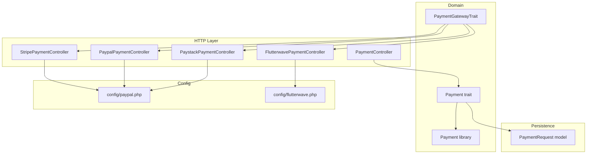
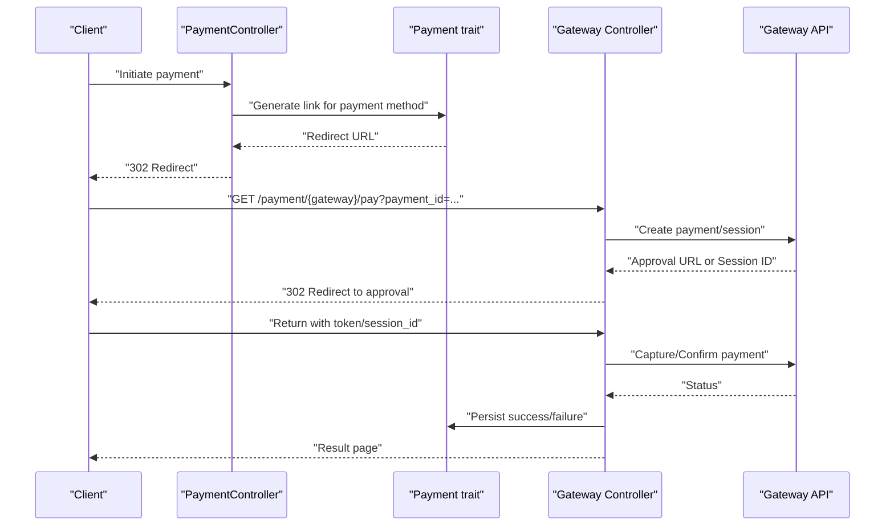
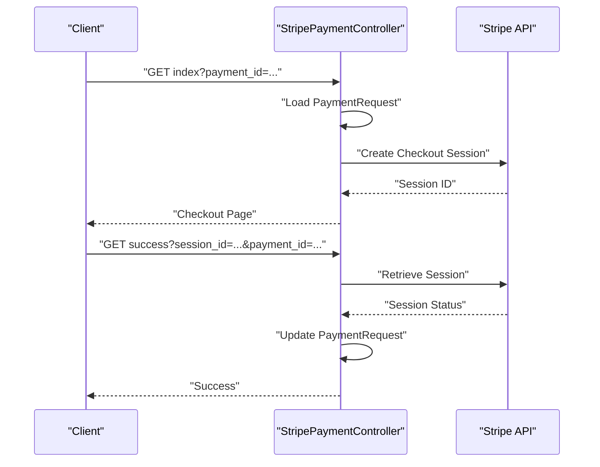
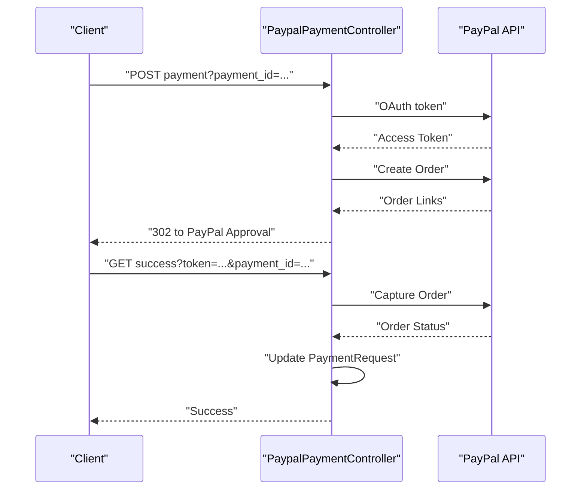
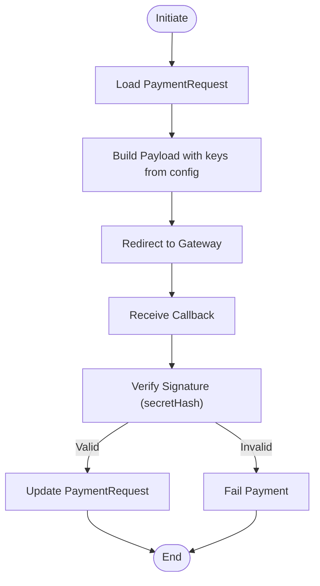
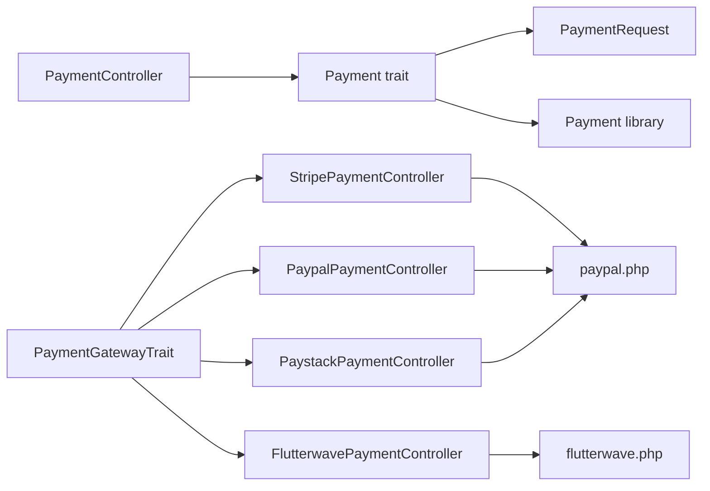

# International Payment Gateways

<cite>
**Referenced Files in This Document**
- [paypal.php](file://config/paypal.php)
- [flutterwave.php](file://config/flutterwave.php)
- [PaymentGatewayTrait.php](file://app/Traits/PaymentGatewayTrait.php)
- [PaypalPaymentController.php](file://app/Http/Controllers/PaypalPaymentController.php)
- [StripePaymentController.php](file://app/Http/Controllers/StripePaymentController.php)
- [PaymentController.php](file://app/Http/Controllers/PaymentController.php)
- [Payment.php](file://app/Traits/Payment.php)
- [Payment.php](file://app/Library/Payment.php)
- [SslCommerzPaymentController.php](file://app/Http/Controllers/SslCommerzPaymentController.php)
- [BkashPaymentController.php](file://app/Http/Controllers/BkashPaymentController.php)
</cite>

## Table of Contents
1. [Introduction](#introduction)
2. [Project Structure](#project-structure)
3. [Core Components](#core-components)
4. [Architecture Overview](#architecture-overview)
5. [Detailed Component Analysis](#detailed-component-analysis)
6. [Dependency Analysis](#dependency-analysis)
7. [Performance Considerations](#performance-considerations)
8. [Troubleshooting Guide](#troubleshooting-guide)
9. [Conclusion](#conclusion)
10. [Appendices](#appendices)

## Introduction
This document explains the international payment gateway implementations present in the codebase, focusing on Stripe, PayPal, Flutterwave, and Paystack. It covers controller-level integrations, configuration, currency support, webhook handling, payment verification, sandbox/production setup, error handling, retry strategies, and security considerations. The goal is to help developers configure, extend, and operate these gateways securely and reliably.

## Project Structure
The payment system centers around:
- A unified payment request model persisted via a PaymentRequest entity.
- A generic Payment trait that generates gateway-specific redirect links.
- Gateway-specific controllers that orchestrate payment initiation, capture, and result handling.
- Configuration files for each gateway’s credentials and mode.
- A shared trait that enumerates supported currencies per gateway.

**Diagram sources**
- [PaymentController.php:1-160](file://app/Http/Controllers/PaymentController.php#L1-L160)
- [Payment.php:1-84](file://app/Traits/Payment.php#L1-L84)
- [Payment.php:1-96](file://app/Library/Payment.php#L1-L96)
- [PaymentGatewayTrait.php:1-344](file://app/Traits/PaymentGatewayTrait.php#L1-L344)
- [paypal.php:1-14](file://config/paypal.php#L1-L14)
- [flutterwave.php:1-32](file://config/flutterwave.php#L1-L32)

**Section sources**
- [PaymentController.php:1-160](file://app/Http/Controllers/PaymentController.php#L1-L160)
- [Payment.php:1-84](file://app/Traits/Payment.php#L1-L84)
- [Payment.php:1-96](file://app/Library/Payment.php#L1-L96)
- [PaymentGatewayTrait.php:1-344](file://app/Traits/PaymentGatewayTrait.php#L1-L344)
- [paypal.php:1-14](file://config/paypal.php#L1-L14)
- [flutterwave.php:1-32](file://config/flutterwave.php#L1-L32)

## Core Components
- Unified payment request lifecycle:
  - PaymentController orchestrates creation of a PaymentRequest and delegates to a gateway-specific controller.
  - Payment trait persists the request and resolves the gateway route.
  - Gateway controllers handle OAuth/token issuance, payment initiation, and result capture.
- Currency support:
  - PaymentGatewayTrait enumerates supported currencies per gateway for validation and display.
- Configuration:
  - PayPal configuration supports live/test modes and logging.
  - Flutterwave configuration defines public key, secret key, and webhook secret hash.

**Section sources**
- [PaymentController.php:41-131](file://app/Http/Controllers/PaymentController.php#L41-L131)
- [Payment.php:12-82](file://app/Traits/Payment.php#L12-L82)
- [PaymentGatewayTrait.php:8-341](file://app/Traits/PaymentGatewayTrait.php#L8-L341)
- [paypal.php:3-13](file://config/paypal.php#L3-L13)
- [flutterwave.php:12-31](file://config/flutterwave.php#L12-L31)

## Architecture Overview
The system uses a request-to-gateway routing pattern:
- PaymentController builds a Payment object and delegates to Payment trait to generate a redirect URL to the appropriate gateway controller.
- Gateway controllers fetch stored credentials from configuration, construct requests to the gateway APIs, and update PaymentRequest upon success/failure.

**Diagram sources**
- [PaymentController.php:41-131](file://app/Http/Controllers/PaymentController.php#L41-L131)
- [Payment.php:39-82](file://app/Traits/Payment.php#L39-L82)
- [StripePaymentController.php:37-100](file://app/Http/Controllers/StripePaymentController.php#L37-L100)
- [PaypalPaymentController.php:62-138](file://app/Http/Controllers/PaypalPaymentController.php#L62-L138)

## Detailed Component Analysis

### Stripe Integration
- Controller responsibilities:
  - Validates payment_id and loads PaymentRequest.
  - Renders a Stripe checkout page with product metadata derived from additional_data or business settings.
  - Creates a Stripe Checkout Session and returns the session identifier.
  - Confirms payment status and updates PaymentRequest accordingly.
- Currency handling:
  - Uses currency_code from PaymentRequest.
  - Adjusts unit_amount for zero-decimal currencies.
- Security:
  - Uses Stripe secret API key to confirm sessions.
  - Returns only session identifiers to the client.

**Diagram sources**
- [StripePaymentController.php:37-128](file://app/Http/Controllers/StripePaymentController.php#L37-L128)

**Section sources**
- [StripePaymentController.php:1-139](file://app/Http/Controllers/StripePaymentController.php#L1-L139)

### PayPal Integration
- Controller responsibilities:
  - Loads gateway credentials from PaymentRequest configuration (live/test).
  - Issues OAuth token against PayPal API.
  - Creates an order resource and redirects the client to PayPal for approval.
  - Captures the order after approval and updates PaymentRequest.
- Sandbox/Production:
  - Base URL switches based on mode.
- Logging:
  - PayPal SDK logging configured via config file.

**Diagram sources**
- [PaypalPaymentController.php:37-198](file://app/Http/Controllers/PaypalPaymentController.php#L37-L198)
- [paypal.php:3-13](file://config/paypal.php#L3-L13)

**Section sources**
- [PaypalPaymentController.php:1-200](file://app/Http/Controllers/PaypalPaymentController.php#L1-L200)
- [paypal.php:1-14](file://config/paypal.php#L1-L14)

### Flutterwave Integration
- Configuration:
  - Requires public key, secret key, and optional secret hash for webhook verification.
- Implementation pattern:
  - Gateway controllers typically follow a similar pattern: validate payment_id, load PaymentRequest, construct payload, redirect to gateway, and finalize on callback.
- Webhook handling:
  - Secret hash enables signature verification for callbacks.

**Diagram sources**
- [flutterwave.php:12-31](file://config/flutterwave.php#L12-L31)

**Section sources**
- [flutterwave.php:1-32](file://config/flutterwave.php#L1-L32)

### Paystack Integration
- Implementation pattern:
  - Similar to other gateways: validate payment_id, load PaymentRequest, construct payload, redirect to Paystack, and finalize on callback.
- Currency support:
  - Supported currencies are enumerated in PaymentGatewayTrait.

**Section sources**
- [PaymentGatewayTrait.php:172-181](file://app/Traits/PaymentGatewayTrait.php#L172-L181)

### Additional Gateways (context)
- SslCommerz and bKash controllers demonstrate the same pattern: validate payment_id, load PaymentRequest, build gateway payload, redirect to gateway, and finalize on callback. These are useful references for implementing Paystack similarly.

**Section sources**
- [SslCommerzPaymentController.php:54-227](file://app/Http/Controllers/SslCommerzPaymentController.php#L54-L227)
- [BkashPaymentController.php:81-183](file://app/Http/Controllers/BkashPaymentController.php#L81-L183)

## Dependency Analysis
- PaymentController depends on:
  - Payment trait for generating gateway routes.
  - Payment library for encapsulating payment metadata.
- Payment trait depends on:
  - PaymentRequest persistence.
  - Route mapping for supported payment methods.
- Gateway controllers depend on:
  - Payment trait for configuration resolution.
  - Configuration files for credentials and mode.
  - External APIs for payment creation and capture.

**Diagram sources**
- [PaymentController.php:1-160](file://app/Http/Controllers/PaymentController.php#L1-L160)
- [Payment.php:1-84](file://app/Traits/Payment.php#L1-L84)
- [Payment.php:1-96](file://app/Library/Payment.php#L1-L96)
- [PaymentGatewayTrait.php:1-344](file://app/Traits/PaymentGatewayTrait.php#L1-L344)
- [paypal.php:1-14](file://config/paypal.php#L1-L14)
- [flutterwave.php:1-32](file://config/flutterwave.php#L1-L32)

**Section sources**
- [PaymentController.php:1-160](file://app/Http/Controllers/PaymentController.php#L1-L160)
- [Payment.php:1-84](file://app/Traits/Payment.php#L1-L84)
- [Payment.php:1-96](file://app/Library/Payment.php#L1-L96)
- [PaymentGatewayTrait.php:1-344](file://app/Traits/PaymentGatewayTrait.php#L1-L344)
- [paypal.php:1-14](file://config/paypal.php#L1-L14)
- [flutterwave.php:1-32](file://config/flutterwave.php#L1-L32)

## Performance Considerations
- Minimize external API calls:
  - Reuse access tokens where possible; PayPal controller issues a token per request.
- Asynchronous callbacks:
  - Prefer webhooks for finalization to avoid long client waits.
- Caching:
  - Cache supported currencies from PaymentGatewayTrait to reduce repeated computations.
- Idempotency:
  - Ensure PaymentRequest updates are idempotent to handle retries safely.

## Troubleshooting Guide
Common issues and remedies:
- Invalid payment_id:
  - Controllers validate UUID and return 204/400 responses when missing or unpaid.
- Missing credentials:
  - Ensure environment variables for gateway keys are set; controllers rely on configuration resolution.
- Currency mismatch:
  - Use PaymentGatewayTrait to validate supported currencies before initiating payment.
- Sandbox vs Production:
  - Confirm mode in PaymentRequest configuration; base URLs differ for PayPal.
- Webhook verification:
  - For Flutterwave, verify signatures using the secret hash to prevent tampering.
- Logging:
  - Enable PayPal SDK logging for diagnostics.

**Section sources**
- [PaypalPaymentController.php:64-75](file://app/Http/Controllers/PaypalPaymentController.php#L64-L75)
- [StripePaymentController.php:39-50](file://app/Http/Controllers/StripePaymentController.php#L39-L50)
- [SslCommerzPaymentController.php:56-67](file://app/Http/Controllers/SslCommerzPaymentController.php#L56-L67)
- [paypal.php:6-12](file://config/paypal.php#L6-L12)
- [flutterwave.php:30-31](file://config/flutterwave.php#L30-L31)

## Conclusion
The codebase provides a robust, extensible foundation for international payments. A single entry point creates a standardized PaymentRequest, while gateway-specific controllers manage initiation, capture, and result handling. Currency support is centralized, and configuration files enable seamless sandbox/production transitions. Implementing Paystack follows the established patterns demonstrated by other gateways.

## Appendices

### Setup Procedures
- Stripe
  - Configure secret API key in environment variables and ensure the controller can read them.
  - Use Checkout Sessions and confirm payment status before marking transactions complete.
- PayPal
  - Set client_id, secret, and mode in environment variables; controller reads live/test values from PaymentRequest configuration.
  - Use OAuth token endpoint and order capture endpoints; ensure base URL selection matches mode.
- Flutterwave
  - Provide public key, secret key, and optional secret hash for webhook verification.
  - Construct payloads according to gateway requirements and verify signatures on callbacks.
- Paystack
  - Follow the same request/response pattern as other gateways; validate supported currencies via PaymentGatewayTrait.

### Regional Availability and Currency Conversion
- Use PaymentGatewayTrait to enumerate supported currencies per gateway and enforce compatibility.
- For Stripe, adjust unit amounts for zero-decimal currencies during session creation.
- For PayPal, convert amounts to the smallest currency unit before sending to the API.

**Section sources**
- [PaymentGatewayTrait.php:8-341](file://app/Traits/PaymentGatewayTrait.php#L8-L341)
- [StripePaymentController.php:80-97](file://app/Http/Controllers/StripePaymentController.php#L80-L97)
- [PaypalPaymentController.php:94-104](file://app/Http/Controllers/PaypalPaymentController.php#L94-L104)

### Error Handling, Retry, and Fallback
- Validation:
  - Controllers validate input and return structured error responses for invalid requests.
- Idempotency:
  - PaymentRequest updates should be idempotent; guard against duplicate completions.
- Retry:
  - On transient failures, retry external API calls with exponential backoff.
- Fallback:
  - If a gateway is unavailable, offer alternative payment methods enumerated in Payment trait route mapping.

**Section sources**
- [PaymentController.php:41-131](file://app/Http/Controllers/PaymentController.php#L41-L131)
- [Payment.php:39-82](file://app/Traits/Payment.php#L39-L82)

### Compliance and Security Best Practices
- PCI DSS:
  - Use Stripe Checkout or PayPal hosted pages to avoid card data handling on your servers.
- Secrets:
  - Store API keys in environment variables; never log or expose them.
- Webhooks:
  - Verify signatures (e.g., Flutterwave secret hash) and process only verified events.
- Logging:
  - Limit sensitive data in logs; enable error-level logging for PayPal SDK.
- Data Protection:
  - Sanitize customer data and avoid storing raw PANs; rely on gateway tokens.

**Section sources**
- [paypal.php:6-12](file://config/paypal.php#L6-L12)
- [flutterwave.php:30-31](file://config/flutterwave.php#L30-L31)