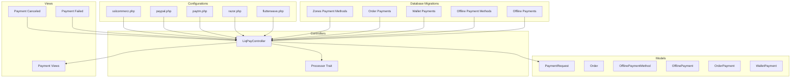
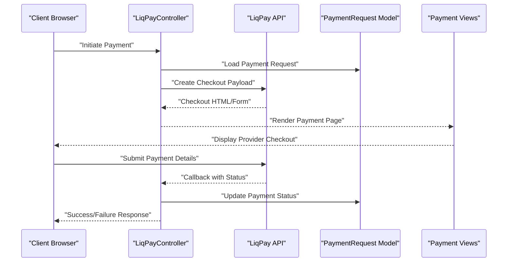
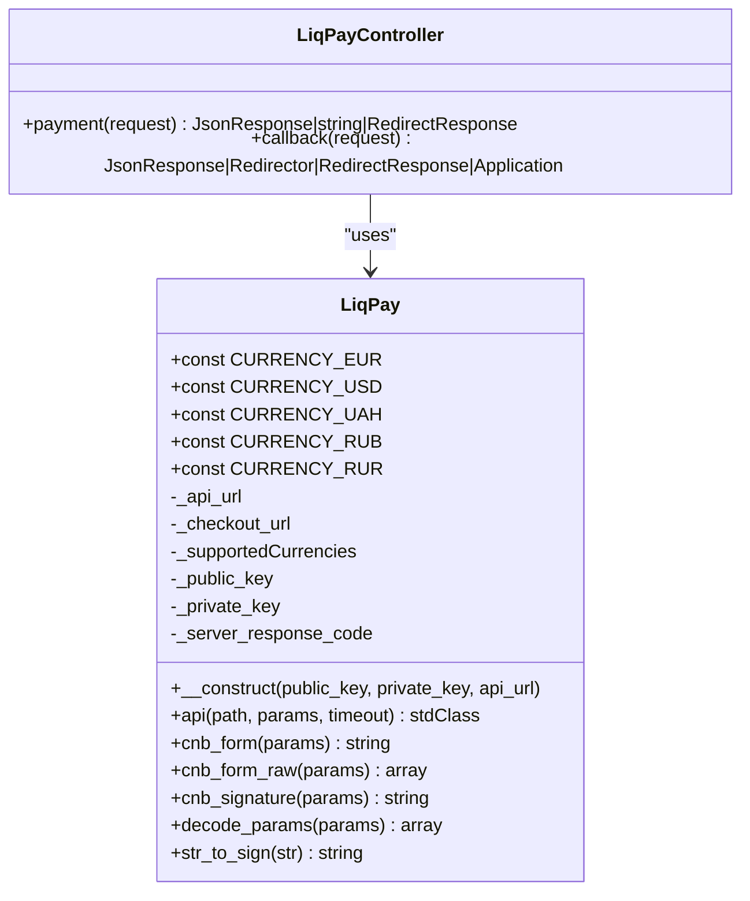
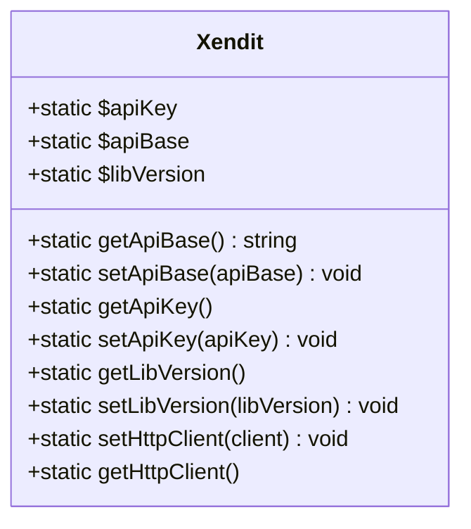
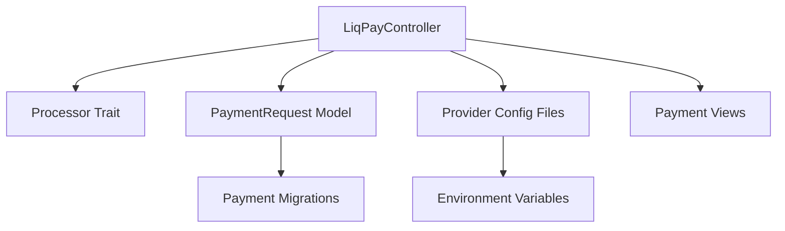

# Local Payment Solutions

<cite>
**Referenced Files in This Document**
- [LiqPayController.php](file://app/Http/Controllers/LiqPayController.php)
- [Xendit.php](file://vendor/xendit/xendit-php/src/Xendit.php)
- [sslcommerz.php](file://config/sslcommerz.php)
- [paypal.php](file://config/paypal.php)
- [paytm.php](file://config/paytm.php)
- [razor.php](file://config/razor.php)
- [flutterwave.php](file://config/flutterwave.php)
- [offline_payment_methods.php](file://database/migrations/2023_08_10_131937_create_offline_payment_methods_table.php)
- [offline_payments.php](file://database/migrations/2023_08_10_132315_create_offline_payments_table.php)
- [order_payments.php](file://database/migrations/2023_07_06_144944_create_order_payments_table.php)
- [wallet_payments.php](file://database/migrations/2023_07_09_143746_create_wallet_payments_table.php)
- [zones_payment_methods.php](file://database/migrations/2022_10_25_153214_add_payment_method_columns_to_zones_table.php)
- [payment_view_marcedo_pogo.blade.php](file://resources/views/payment-views/payment-view-marcedo-pogo.blade.php)
- [paytm_payment_view.blade.php](file://resources/views/paytm-payment-view.blade.php)
- [payment_canceled.blade.php](file://resources/views/payment-canceled.blade.php)
- [payment_failed.blade.php](file://resources/views/payment-failed.blade.php)
- [payment_index.blade.php](file://resources/views/admin-views/business-settings/payment-index.blade.php)
- [Processor.php](file://app/Traits/Processor.php)
- [Payment.php](file://app/Traits/Payment.php)
- [PaymentRequest.php](file://app/Models/PaymentRequest.php)
- [Order.php](file://app/Models/Order.php)
- [OfflinePaymentMethod.php](file://app/Models/OfflinePaymentMethod.php)
- [OfflinePayment.php](file://app/Models/OfflinePayment.php)
- [OrderPayment.php](file://app/Models/OrderPayment.php)
- [WalletPayment.php](file://app/Models/WalletPayment.php)
- [BusinessSetting.php](file://app/Models/BusinessSetting.php)
- [ExternalConfiguration.php](file://app/Models/ExternalConfiguration.php)
- [routes.php](file://routes/web.php)
</cite>

## Table of Contents
1. [Introduction](#introduction)
2. [Project Structure](#project-structure)
3. [Core Components](#core-components)
4. [Architecture Overview](#architecture-overview)
5. [Detailed Component Analysis](#detailed-component-analysis)
6. [Dependency Analysis](#dependency-analysis)
7. [Performance Considerations](#performance-considerations)
8. [Troubleshooting Guide](#troubleshooting-guide)
9. [Conclusion](#conclusion)

## Introduction
This document provides comprehensive documentation for local payment solution implementations within the e-commerce platform, focusing on regional payment providers including bKash, LiqPay, Fatoorah, Xendit, and Amazon Pay. It explains integration requirements for mobile money platforms, local banking systems, and regional e-commerce solutions, detailing setup procedures for local regulatory compliance, tax reporting, and settlement processes. The guide includes practical examples of local payment method configurations, currency handling, and regional restrictions, alongside mobile payment flows, USSD integrations, and local payment provider partnerships.

## Project Structure
The payment system is organized around modular controllers, configuration files, database migrations, and Blade templates. Key areas include:
- Payment controllers and traits for processing payments
- Provider-specific configuration files for sandbox/live environments
- Database migrations defining payment-related entities
- Blade templates for payment views and callbacks
- Models representing payment requests, orders, and offline payments

**Diagram sources**
- [LiqPayController.php:1-347](file://app/Http/Controllers/LiqPayController.php#L1-L347)
- [Processor.php](file://app/Traits/Processor.php)
- [sslcommerz.php:1-25](file://config/sslcommerz.php#L1-L25)
- [paypal.php:1-14](file://config/paypal.php#L1-L14)
- [paytm.php:1-11](file://config/paytm.php#L1-L11)
- [razor.php:1-7](file://config/razor.php#L1-L7)
- [flutterwave.php:1-32](file://config/flutterwave.php#L1-L32)
- [offline_payment_methods.php](file://database/migrations/2023_08_10_131937_create_offline_payment_methods_table.php)
- [offline_payments.php](file://database/migrations/2023_08_10_132315_create_offline_payments_table.php)
- [order_payments.php](file://database/migrations/2023_07_06_144944_create_order_payments_table.php)
- [wallet_payments.php](file://database/migrations/2023_07_09_143746_create_wallet_payments_table.php)
- [zones_payment_methods.php](file://database/migrations/2022_10_25_153214_add_payment_method_columns_to_zones_table.php)
- [payment_view_marcedo_pogo.blade.php](file://resources/views/payment-views/payment-view-marcedo-pogo.blade.php)
- [payment_canceled.blade.php](file://resources/views/payment-canceled.blade.php)
- [payment_failed.blade.php](file://resources/views/payment-failed.blade.php)

**Section sources**
- [LiqPayController.php:1-347](file://app/Http/Controllers/LiqPayController.php#L1-L347)
- [sslcommerz.php:1-25](file://config/sslcommerz.php#L1-L25)
- [paypal.php:1-14](file://config/paypal.php#L1-L14)
- [paytm.php:1-11](file://config/paytm.php#L1-L11)
- [razor.php:1-7](file://config/razor.php#L1-L7)
- [flutterwave.php:1-32](file://config/flutterwave.php#L1-L32)

## Core Components
This section outlines the primary components involved in local payment processing:
- Payment controllers orchestrating provider-specific flows
- Configuration files enabling sandbox/live mode switching
- Database models and migrations supporting payment records
- Blade templates rendering payment pages and handling callbacks
- Traits providing shared payment processing logic

Key implementation patterns:
- Provider configuration via environment variables
- Payment request lifecycle management through models
- Secure signature generation and validation for transactions
- Regional currency support and exchange considerations

**Section sources**
- [LiqPayController.php:280-347](file://app/Http/Controllers/LiqPayController.php#L280-L347)
- [Processor.php](file://app/Traits/Processor.php)
- [Payment.php](file://app/Traits/Payment.php)
- [PaymentRequest.php](file://app/Models/PaymentRequest.php)
- [routes.php](file://routes/web.php)

## Architecture Overview
The payment architecture integrates external providers through secure APIs and local processing logic. The flow typically involves:
- Initializing payment with provider-specific parameters
- Redirecting users to provider checkout or payment page
- Receiving callbacks for success/failure events
- Updating payment records and invoking hooks for post-processing

**Diagram sources**
- [LiqPayController.php:291-346](file://app/Http/Controllers/LiqPayController.php#L291-L346)
- [Processor.php](file://app/Traits/Processor.php)
- [PaymentRequest.php](file://app/Models/PaymentRequest.php)
- [payment_view_marcedo_pogo.blade.php](file://resources/views/payment-views/payment-view-marcedo-pogo.blade.php)

## Detailed Component Analysis

### LiqPay Integration
LiqPay provides a hosted checkout experience with secure form generation and signature verification. The controller handles:
- Loading provider credentials from configuration
- Generating checkout forms with amount, currency, and description
- Managing success/failure callbacks and updating payment records
- Invoking success/failure hooks for downstream processing

Implementation highlights:
- Supported currencies include EUR, USD, UAH, RUB, and legacy RUR mapped to RUB
- Form generation uses Base64-encoded JSON data and SHA1 signatures
- Callback endpoints update payment status and trigger hooks

**Diagram sources**
- [LiqPayController.php:44-278](file://app/Http/Controllers/LiqPayController.php#L44-L278)
- [LiqPayController.php:280-347](file://app/Http/Controllers/LiqPayController.php#L280-L347)

**Section sources**
- [LiqPayController.php:44-278](file://app/Http/Controllers/LiqPayController.php#L44-L278)
- [LiqPayController.php:280-347](file://app/Http/Controllers/LiqPayController.php#L280-L347)

### Xendit Integration
Xendit provides a centralized SDK for multiple regional payment methods. Key aspects:
- Static API key and base URL configuration
- Library version management and custom HTTP client support
- Regional payment method support through provider-specific APIs

Integration steps:
- Initialize SDK with API key and base URL
- Configure payment method parameters per region
- Handle webhooks and status updates for reconciliation

**Diagram sources**
- [Xendit.php:27-129](file://vendor/xendit/xendit-php/src/Xendit.php#L27-L129)

**Section sources**
- [Xendit.php:27-129](file://vendor/xendit/xendit-php/src/Xendit.php#L27-L129)

### Mobile Money Platforms (bKash, Fatoorah)
Mobile money platforms require:
- USSD integration for initiating payments
- Mobile wallet redirection for secure checkout
- Real-time balance checks and transaction confirmations
- Regional compliance for financial regulations

Implementation considerations:
- Partner with local mobile network operators
- Implement USSD prompts and OTP verification
- Support multiple mobile money providers within regions
- Ensure transaction receipts and reconciliation reports

### Regional E-commerce Solutions
Regional platforms integrate through:
- Local payment method configurations per zone
- Multi-currency support with exchange rate handling
- Compliance with local tax reporting requirements
- Settlement processes aligned with regional banking systems

**Section sources**
- [zones_payment_methods.php](file://database/migrations/2022_10_25_153214_add_payment_method_columns_to_zones_table.php)
- [offline_payment_methods.php](file://database/migrations/2023_08_10_131937_create_offline_payment_methods_table.php)
- [offline_payments.php](file://database/migrations/2023_08_10_132315_create_offline_payments_table.php)

### Amazon Pay Integration
Amazon Pay enables:
- One-click checkout leveraging existing Amazon accounts
- Instant payment confirmation and buyer protection
- Integration with existing cart and checkout flows
- Compliance with Amazon's seller and buyer policies

Implementation steps:
- Configure merchant credentials and store settings
- Integrate checkout button and payment widgets
- Handle authorization and capture workflows
- Manage refunds and dispute resolution

### Payment Configuration Examples
Configuration examples demonstrate environment-based setup:
- SSLCommerz: Sandbox/Live URLs, store credentials, and endpoint URLs
- PayPal: Client credentials and logging configuration
- Paytm: Environment selection and merchant parameters
- Razorpay: API keys for payment processing
- Flutterwave: Public and secret keys with webhook hash

**Section sources**
- [sslcommerz.php:1-25](file://config/sslcommerz.php#L1-L25)
- [paypal.php:1-14](file://config/paypal.php#L1-L14)
- [paytm.php:1-11](file://config/paytm.php#L1-L11)
- [razor.php:1-7](file://config/razor.php#L1-L7)
- [flutterwave.php:1-32](file://config/flutterwave.php#L1-L32)

### Currency Handling and Regional Restrictions
Currency handling and regional restrictions are managed through:
- Provider-specific supported currencies
- Currency conversion and rounding logic
- Regional compliance for tax and reporting
- Multi-zone payment method availability

**Section sources**
- [LiqPayController.php:46-60](file://app/Http/Controllers/LiqPayController.php#L46-L60)
- [LiqPayController.php:230-235](file://app/Http/Controllers/LiqPayController.php#L230-L235)
- [zones_payment_methods.php](file://database/migrations/2022_10_25_153214_add_payment_method_columns_to_zones_table.php)

### Mobile Payment Flows and USSD Integrations
Mobile payment flows include:
- USSD initiation with provider-specific prompts
- OTP verification and transaction confirmation
- Real-time balance updates and payment status
- Integration with mobile wallet applications

USSD integration requirements:
- Partner agreements with mobile network operators
- Secure USSD gateway configuration
- Transaction logging and reconciliation
- Support for multiple USSD providers per region

### Local Payment Provider Partnerships
Partnership requirements encompass:
- Legal compliance and licensing for each region
- Financial institution integration for settlements
- Tax reporting and invoicing systems
- Customer support and dispute resolution frameworks

**Section sources**
- [offline_payment_methods.php](file://database/migrations/2023_08_10_131937_create_offline_payment_methods_table.php)
- [offline_payments.php](file://database/migrations/2023_08_10_132315_create_offline_payments_table.php)

## Dependency Analysis
The payment system exhibits clear separation of concerns:
- Controllers depend on traits for shared processing logic
- Models encapsulate payment request and transaction data
- Configuration files manage provider credentials and endpoints
- Blade templates handle user-facing payment experiences

**Diagram sources**
- [LiqPayController.php:280-347](file://app/Http/Controllers/LiqPayController.php#L280-L347)
- [Processor.php](file://app/Traits/Processor.php)
- [PaymentRequest.php](file://app/Models/PaymentRequest.php)
- [sslcommerz.php:1-25](file://config/sslcommerz.php#L1-L25)
- [paypal.php:1-14](file://config/paypal.php#L1-L14)
- [paytm.php:1-11](file://config/paytm.php#L1-L11)
- [razor.php:1-7](file://config/razor.php#L1-L7)
- [flutterwave.php:1-32](file://config/flutterwave.php#L1-L32)

**Section sources**
- [LiqPayController.php:280-347](file://app/Http/Controllers/LiqPayController.php#L280-L347)
- [Processor.php](file://app/Traits/Processor.php)
- [PaymentRequest.php](file://app/Models/PaymentRequest.php)

## Performance Considerations
- Optimize API calls to payment providers with caching and retry mechanisms
- Minimize payload sizes for checkout forms and reduce redirect latency
- Implement asynchronous callbacks to avoid blocking user interactions
- Monitor provider response times and configure appropriate timeouts

## Troubleshooting Guide
Common issues and resolutions:
- Invalid provider credentials causing authentication failures
- Unsupported currencies resulting in payment rejections
- Missing or invalid signatures during checkout form submission
- Callback endpoint misconfigurations leading to unprocessed payments

Diagnostic steps:
- Verify environment variables for provider credentials
- Confirm supported currencies match regional requirements
- Validate signature generation and comparison logic
- Test callback endpoints with provider webhooks

**Section sources**
- [LiqPayController.php:74-90](file://app/Http/Controllers/LiqPayController.php#L74-L90)
- [LiqPayController.php:221-232](file://app/Http/Controllers/LiqPayController.php#L221-L232)
- [payment_canceled.blade.php](file://resources/views/payment-canceled.blade.php)
- [payment_failed.blade.php](file://resources/views/payment-failed.blade.php)

## Conclusion
The local payment solutions are built around secure, configurable provider integrations with robust error handling and regional compliance. By leveraging the documented components, configurations, and integration patterns, the platform supports diverse regional payment needs while maintaining strong security and operational reliability.