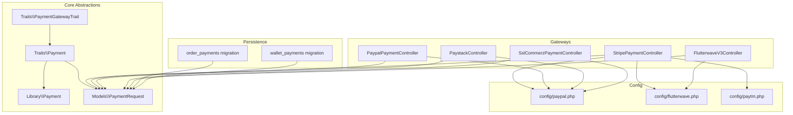
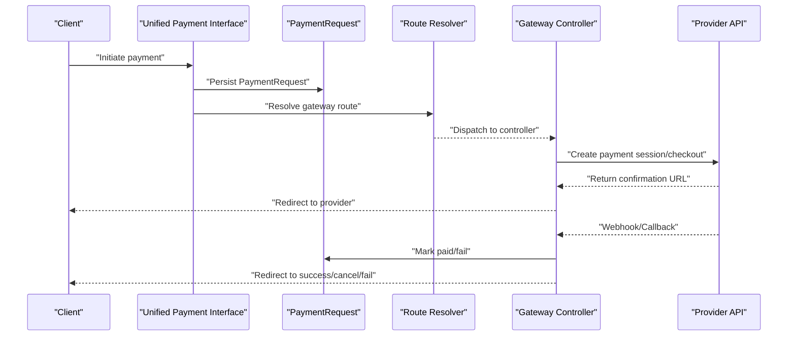
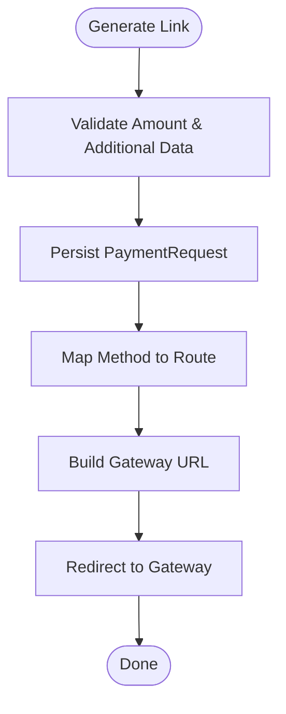
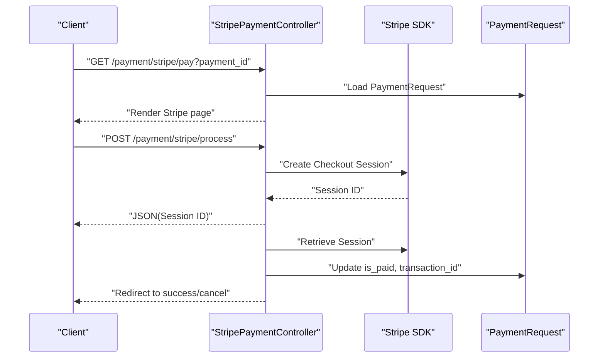
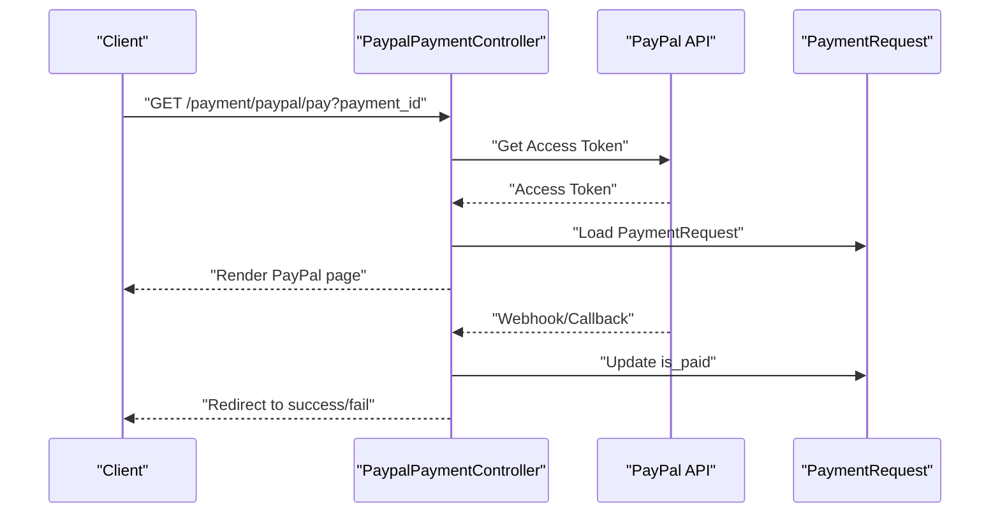
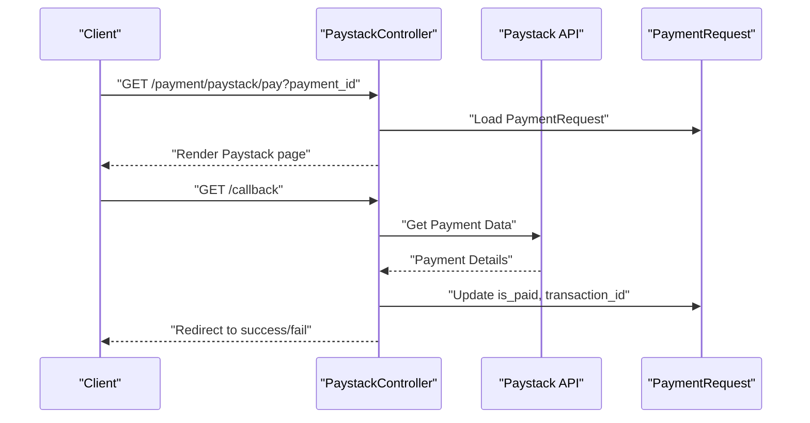
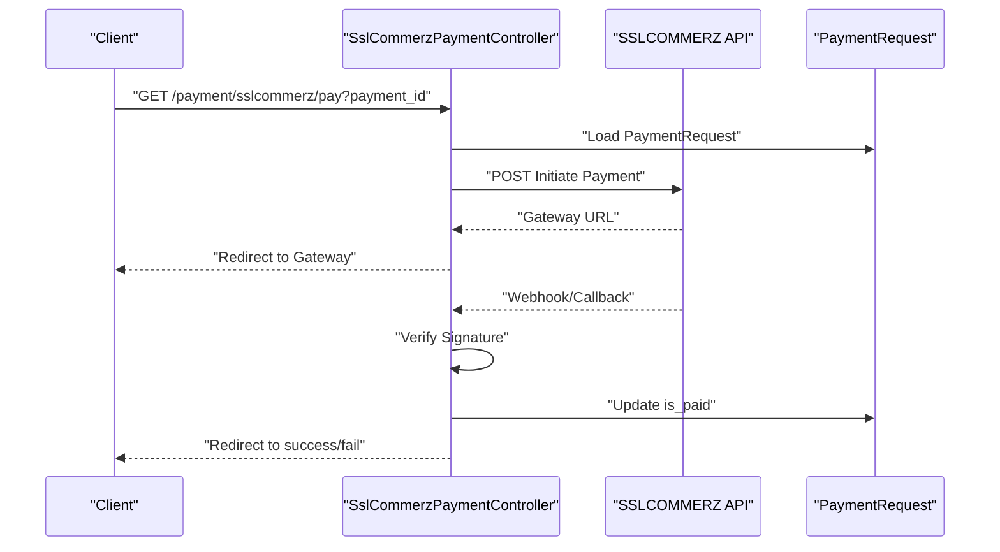
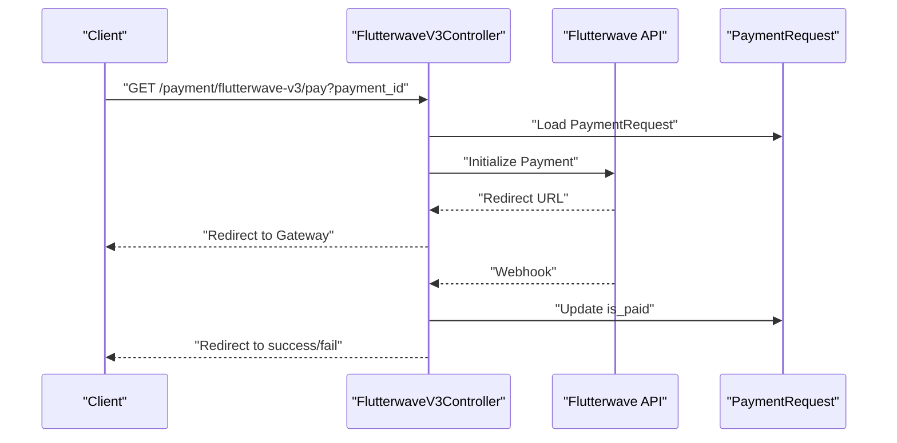
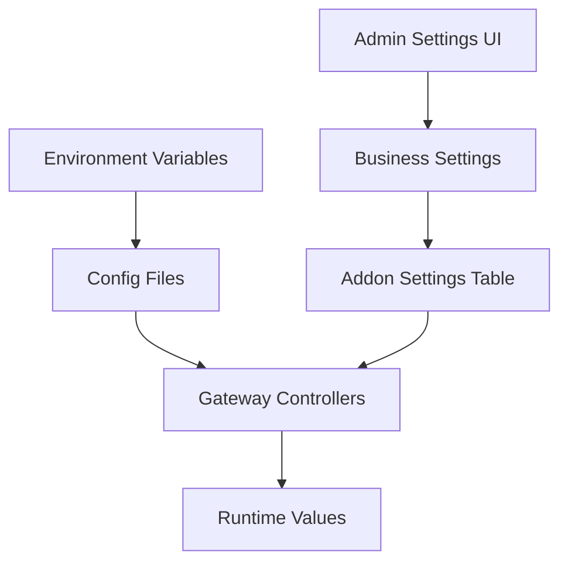
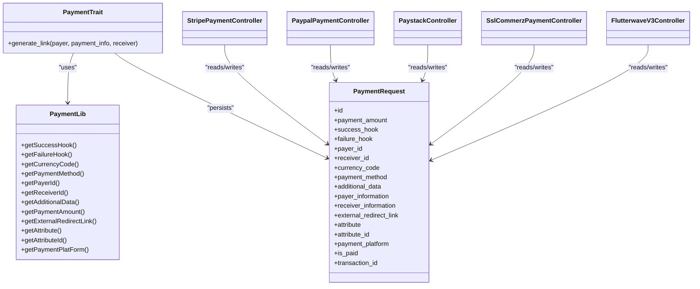

# Payment Gateways

<cite>
**Referenced Files in This Document**
- [PaymentGatewayTrait.php](file://app/Traits/PaymentGatewayTrait.php)
- [Payment.php](file://app/Traits/Payment.php)
- [Processor.php](file://app/Traits/Processor.php)
- [Payment.php](file://app/Library/Payment.php)
- [PaymentController.php](file://app/Http/Controllers/PaymentController.php)
- [StripePaymentController.php](file://app/Http/Controllers/StripePaymentController.php)
- [PaypalPaymentController.php](file://app/Http/Controllers/PaypalPaymentController.php)
- [PaystackController.php](file://app/Http/Controllers/PaystackController.php)
- [SslCommerzPaymentController.php](file://app/Http/Controllers/SslCommerzPaymentController.php)
- [FlutterwaveV3Controller.php](file://app/Http/Controllers/FlutterwaveV3Controller.php)
- [Constant.php](file://app/Library/Constant.php)
- [paypal.php](file://config/paypal.php)
- [flutterwave.php](file://config/flutterwave.php)
- [paytm.php](file://config/paytm.php)
- [PaymentRequest.php](file://app/Models/PaymentRequest.php)
- [2023_07_06_144944_create_order_payments_table.php](file://database/migrations/2023_07_06_144944_create_order_payments_table.php)
- [2023_07_09_143746_create_wallet_payments_table.php](file://database/migrations/2023_07_09_143746_create_wallet_payments_table.php)
- [BusinessSettingsController.php](file://app/Http/Controllers/Admin/BusinessSettingsController.php)
- [UpdateController.php](file://app/Http/Controllers/UpdateController.php)
</cite>

## Table of Contents
1. [Introduction](#introduction)
2. [Project Structure](#project-structure)
3. [Core Components](#core-components)
4. [Architecture Overview](#architecture-overview)
5. [Detailed Component Analysis](#detailed-component-analysis)
6. [Dependency Analysis](#dependency-analysis)
7. [Performance Considerations](#performance-considerations)
8. [Troubleshooting Guide](#troubleshooting-guide)
9. [Conclusion](#conclusion)

## Introduction
This document describes the payment gateway integration system that supports 15+ payment methods including Stripe, PayPal, Flutterwave, Paystack, Paytm, and regional gateways. It explains the unified payment interface abstraction, gateway-specific controllers, configuration management, routing, success/failure callbacks, and webhook handling. It also documents API credential setup, sandbox testing, region and currency support, transaction limits, error handling, retries, and fallback strategies.

## Project Structure
The payment system is organized around:
- A unified payment request model and traits for routing and configuration
- Gateway-specific controllers implementing payment initiation, success, failure, and cancellation
- Configuration files for third-party SDKs and environment variables
- Database migrations for persisting payment records
- Admin controllers for managing gateway credentials and modes

**Diagram sources**
- [Payment.php:10-84](file://app/Traits/Payment.php#L10-L84)
- [PaymentGatewayTrait.php:6-344](file://app/Traits/PaymentGatewayTrait.php#L6-L344)
- [Payment.php:5-96](file://app/Library/Payment.php#L5-L96)
- [PaymentRequest.php:9-16](file://app/Models/PaymentRequest.php#L9-L16)
- [StripePaymentController.php:19-139](file://app/Http/Controllers/StripePaymentController.php#L19-L139)
- [PaypalPaymentController.php:46-84](file://app/Http/Controllers/PaypalPaymentController.php#L46-L84)
- [PaystackController.php:15-96](file://app/Http/Controllers/PaystackController.php#L15-L96)
- [SslCommerzPaymentController.php:17-228](file://app/Http/Controllers/SslCommerzPaymentController.php#L17-L228)
- [FlutterwaveV3Controller.php:14-76](file://app/Http/Controllers/FlutterwaveV3Controller.php#L14-L76)
- [paypal.php:3-13](file://config/paypal.php#L3-L13)
- [flutterwave.php:12-32](file://config/flutterwave.php#L12-L32)
- [paytm.php:3-11](file://config/paytm.php#L3-L11)
- [2023_07_06_144944_create_order_payments_table.php:14-22](file://database/migrations/2023_07_06_144944_create_order_payments_table.php#L14-L22)
- [2023_07_09_143746_create_wallet_payments_table.php:14-22](file://database/migrations/2023_07_09_143746_create_wallet_payments_table.php#L14-L22)

**Section sources**
- [Payment.php:10-84](file://app/Traits/Payment.php#L10-L84)
- [PaymentGatewayTrait.php:6-344](file://app/Traits/PaymentGatewayTrait.php#L6-L344)
- [Payment.php:5-96](file://app/Library/Payment.php#L5-L96)
- [PaymentRequest.php:9-16](file://app/Models/PaymentRequest.php#L9-L16)
- [StripePaymentController.php:19-139](file://app/Http/Controllers/StripePaymentController.php#L19-L139)
- [PaypalPaymentController.php:46-84](file://app/Http/Controllers/PaypalPaymentController.php#L46-L84)
- [PaystackController.php:15-96](file://app/Http/Controllers/PaystackController.php#L15-L96)
- [SslCommerzPaymentController.php:17-228](file://app/Http/Controllers/SslCommerzPaymentController.php#L17-L228)
- [FlutterwaveV3Controller.php:14-76](file://app/Http/Controllers/FlutterwaveV3Controller.php#L14-L76)
- [paypal.php:3-13](file://config/paypal.php#L3-L13)
- [flutterwave.php:12-32](file://config/flutterwave.php#L12-L32)
- [paytm.php:3-11](file://config/paytm.php#L3-L11)
- [2023_07_06_144944_create_order_payments_table.php:14-22](file://database/migrations/2023_07_06_144944_create_order_payments_table.php#L14-L22)
- [2023_07_09_143746_create_wallet_payments_table.php:14-22](file://database/migrations/2023_07_09_143746_create_wallet_payments_table.php#L14-L22)

## Core Components
- Unified payment interface trait: Provides a single entry point to generate payment links and route to gateway-specific controllers.
- Gateway-specific controllers: Implement initialization, success, failure, and cancellation flows per provider.
- Configuration management: Environment-driven configuration via config files and admin/business settings.
- Payment request model: Stores payment metadata, hooks, and state for post-transaction callbacks.
- Processor trait: Shared utilities for response formatting, localization, config retrieval, and redirect handling.

**Section sources**
- [Payment.php:10-84](file://app/Traits/Payment.php#L10-L84)
- [Processor.php:16-97](file://app/Traits/Processor.php#L16-L97)
- [PaymentRequest.php:9-16](file://app/Models/PaymentRequest.php#L9-L16)

## Architecture Overview
The system uses a request-first pattern:
- A client initiates a payment via a unified interface that persists a PaymentRequest record.
- The system resolves the appropriate gateway controller based on the selected payment method.
- The gateway controller handles provider-specific steps (SDK/API calls, redirects, webhooks).
- On completion, success/failure hooks trigger application logic and the user is redirected to a success/cancel/fail page.

**Diagram sources**
- [Payment.php:12-82](file://app/Traits/Payment.php#L12-L82)
- [PaymentRequest.php:9-16](file://app/Models/PaymentRequest.php#L9-L16)
- [StripePaymentController.php:37-100](file://app/Http/Controllers/StripePaymentController.php#L37-L100)
- [PaypalPaymentController.php:62-84](file://app/Http/Controllers/PaypalPaymentController.php#L62-L84)
- [PaystackController.php:46-94](file://app/Http/Controllers/PaystackController.php#L46-L94)
- [SslCommerzPaymentController.php:54-144](file://app/Http/Controllers/SslCommerzPaymentController.php#L54-L144)
- [FlutterwaveV3Controller.php:35-76](file://app/Http/Controllers/FlutterwaveV3Controller.php#L35-L76)

## Detailed Component Analysis

### Unified Payment Interface
- Purpose: Encapsulate payment creation and route resolution.
- Responsibilities:
  - Validate payment payload and persist PaymentRequest.
  - Map payment_method to a gateway route.
  - Redirect to the gateway’s payment page with a secure payment_id.

**Diagram sources**
- [Payment.php:12-82](file://app/Traits/Payment.php#L12-L82)
- [Payment.php:20-96](file://app/Library/Payment.php#L20-L96)
- [PaymentRequest.php:9-16](file://app/Models/PaymentRequest.php#L9-L16)

**Section sources**
- [Payment.php:10-84](file://app/Traits/Payment.php#L10-L84)
- [Payment.php:5-96](file://app/Library/Payment.php#L5-L96)

### Gateway-Specific Controllers

#### Stripe
- Initialization: Renders a view with provider configuration.
- Payment process: Uses Stripe Checkout to create a session and returns session id.
- Success/Canceled: Verifies payment status and updates PaymentRequest, then triggers success/failure hooks.

**Diagram sources**
- [StripePaymentController.php:37-139](file://app/Http/Controllers/StripePaymentController.php#L37-L139)

**Section sources**
- [StripePaymentController.php:19-139](file://app/Http/Controllers/StripePaymentController.php#L19-L139)

#### PayPal
- Token acquisition: Retrieves an access token from PayPal OAuth.
- Payment: Validates payment_id, loads PaymentRequest, and prepares provider data.
- Success/Failure: Updates PaymentRequest and triggers hooks.

**Diagram sources**
- [PaypalPaymentController.php:62-84](file://app/Http/Controllers/PaypalPaymentController.php#L62-L84)

**Section sources**
- [PaypalPaymentController.php:46-84](file://app/Http/Controllers/PaypalPaymentController.php#L46-L84)

#### Paystack
- Authorization: Generates a reference and redirects to Paystack hosted page.
- Callback: Validates payment data, updates PaymentRequest, and triggers hooks.

**Diagram sources**
- [PaystackController.php:46-94](file://app/Http/Controllers/PaystackController.php#L46-L94)

**Section sources**
- [PaystackController.php:15-96](file://app/Http/Controllers/PaystackController.php#L15-L96)

#### SslCommerz
- Initialization: Builds a POST payload with merchant credentials and provider URLs.
- Hash verification: Validates response signature before accepting success.
- Success/Failure/Cancel: Updates PaymentRequest and triggers hooks.

**Diagram sources**
- [SslCommerzPaymentController.php:54-228](file://app/Http/Controllers/SslCommerzPaymentController.php#L54-L228)

**Section sources**
- [SslCommerzPaymentController.php:17-228](file://app/Http/Controllers/SslCommerzPaymentController.php#L17-L228)

#### Flutterwave
- Initialization: Prepares a request with tx_ref, amount, currency, redirect_url, customer, and customizations.
- Callback: Uses configured secret hash to validate webhook authenticity.

**Diagram sources**
- [FlutterwaveV3Controller.php:35-76](file://app/Http/Controllers/FlutterwaveV3Controller.php#L35-L76)

**Section sources**
- [FlutterwaveV3Controller.php:14-76](file://app/Http/Controllers/FlutterwaveV3Controller.php#L14-L76)

### Configuration Management
- Environment-based configs:
  - PayPal: client_id, secret, mode, log settings.
  - Flutterwave: publicKey, secretKey, secretHash.
  - Paytm: env, merchant_id, merchant_key, merchant_website, channel, industry_type.
- Admin/business settings:
  - Gateway enable/disable and credentials per gateway (e.g., stripe, paypal, paystack, flutterwave, paytm, paytabs, razor_pay, senang_pay, paymob_accept, mercadopago, liqpay, bkash, fatoorah, xendit, amazon_pay, iyzi_pay, hyper_pay, foloosi, ccavenue, pvit, moncash, thawani, tap, viva_wallet, hubtel, maxicash, esewa, swish, momo, payfast, worldpay, sixcash).
- Update controller:
  - Decodes and persists gateway configurations during updates.

**Diagram sources**
- [paypal.php:3-13](file://config/paypal.php#L3-L13)
- [flutterwave.php:12-32](file://config/flutterwave.php#L12-L32)
- [paytm.php:3-11](file://config/paytm.php#L3-L11)
- [BusinessSettingsController.php:1127-1215](file://app/Http/Controllers/Admin/BusinessSettingsController.php#L1127-L1215)
- [UpdateController.php:300-350](file://app/Http/Controllers/UpdateController.php#L300-L350)

**Section sources**
- [paypal.php:3-13](file://config/paypal.php#L3-L13)
- [flutterwave.php:12-32](file://config/flutterwave.php#L12-L32)
- [paytm.php:3-11](file://config/paytm.php#L3-L11)
- [BusinessSettingsController.php:1127-1215](file://app/Http/Controllers/Admin/BusinessSettingsController.php#L1127-L1215)
- [UpdateController.php:300-350](file://app/Http/Controllers/UpdateController.php#L300-L350)

### Payment Method Routing and Webhook Handling
- Routing:
  - Payment method keys map to specific routes under payment/{method}/pay.
- Webhooks:
  - Controllers implement success/failed/canceled handlers or callback endpoints.
  - Some gateways rely on redirect URLs with query parameters; others use provider webhooks.

**Section sources**
- [Payment.php:39-76](file://app/Traits/Payment.php#L39-L76)
- [StripePaymentController.php:95-137](file://app/Http/Controllers/StripePaymentController.php#L95-L137)
- [PaypalPaymentController.php:62-84](file://app/Http/Controllers/PaypalPaymentController.php#L62-L84)
- [PaystackController.php:73-94](file://app/Http/Controllers/PaystackController.php#L73-L94)
- [SslCommerzPaymentController.php:186-226](file://app/Http/Controllers/SslCommerzPaymentController.php#L186-L226)
- [FlutterwaveV3Controller.php:35-76](file://app/Http/Controllers/FlutterwaveV3Controller.php#L35-L76)

### Success/Failure Callbacks
- PaymentRequest stores success_hook and failure_hook.
- After gateway confirmation, the system invokes the stored hook functions and redirects to a payment outcome page.

**Section sources**
- [Payment.php:22-37](file://app/Traits/Payment.php#L22-L37)
- [StripePaymentController.php:107-127](file://app/Http/Controllers/StripePaymentController.php#L107-L127)
- [PaystackController.php:83-93](file://app/Http/Controllers/PaystackController.php#L83-L93)
- [SslCommerzPaymentController.php:196-207](file://app/Http/Controllers/SslCommerzPaymentController.php#L196-L207)
- [Processor.php:87-95](file://app/Traits/Processor.php#L87-L95)

### API Credentials Setup and Sandbox Testing
- Stripe:
  - Configure API keys and publishable keys via environment or admin settings.
  - Mode selection handled in controller initialization.
- PayPal:
  - Client ID and secret with sandbox mode in config.
- Flutterwave:
  - Public and secret keys plus secret hash for webhook validation.
- Paytm:
  - Merchant credentials and environment mode.
- Admin/business settings:
  - Enable/disable gateways and set credentials per gateway.

**Section sources**
- [StripePaymentController.php:26-35](file://app/Http/Controllers/StripePaymentController.php#L26-L35)
- [paypal.php:3-13](file://config/paypal.php#L3-L13)
- [flutterwave.php:12-32](file://config/flutterwave.php#L12-L32)
- [paytm.php:3-11](file://config/paytm.php#L3-L11)
- [BusinessSettingsController.php:1127-1215](file://app/Http/Controllers/Admin/BusinessSettingsController.php#L1127-L1215)

### Payment Method Availability, Currency Support, and Transaction Limits
- Supported currencies:
  - PaymentGatewayTrait enumerates supported currencies per payment method.
- Region and currency:
  - Use PaymentGatewayTrait to check currency availability for a given method.
- Transaction limits:
  - Not explicitly defined in the analyzed files; implement at the application level if required.

**Section sources**
- [PaymentGatewayTrait.php:8-341](file://app/Traits/PaymentGatewayTrait.php#L8-L341)

### Error Handling, Retry Mechanisms, and Fallback Strategies
- Validation:
  - Controllers validate payment_id and PaymentRequest existence.
- Response formatting:
  - Processor trait provides standardized response structures and error translation.
- Redirect handling:
  - Processor builds redirect URLs with tokenized parameters for success/cancel outcomes.
- Retry and fallback:
  - No explicit retry logic observed in the analyzed files; implement at the application layer if needed.

**Section sources**
- [StripePaymentController.php:39-50](file://app/Http/Controllers/StripePaymentController.php#L39-L50)
- [PaystackController.php:48-59](file://app/Http/Controllers/PaystackController.php#L48-L59)
- [SslCommerzPaymentController.php:56-67](file://app/Http/Controllers/SslCommerzPaymentController.php#L56-L67)
- [Processor.php:18-33](file://app/Traits/Processor.php#L18-L33)
- [Processor.php:87-95](file://app/Traits/Processor.php#L87-L95)

## Dependency Analysis

**Diagram sources**
- [Payment.php:10-84](file://app/Traits/Payment.php#L10-L84)
- [Payment.php:5-96](file://app/Library/Payment.php#L5-L96)
- [PaymentRequest.php:9-16](file://app/Models/PaymentRequest.php#L9-L16)
- [StripePaymentController.php:19-139](file://app/Http/Controllers/StripePaymentController.php#L19-L139)
- [PaypalPaymentController.php:46-84](file://app/Http/Controllers/PaypalPaymentController.php#L46-L84)
- [PaystackController.php:15-96](file://app/Http/Controllers/PaystackController.php#L15-L96)
- [SslCommerzPaymentController.php:17-228](file://app/Http/Controllers/SslCommerzPaymentController.php#L17-L228)
- [FlutterwaveV3Controller.php:14-76](file://app/Http/Controllers/FlutterwaveV3Controller.php#L14-L76)

**Section sources**
- [Payment.php:10-84](file://app/Traits/Payment.php#L10-L84)
- [Payment.php:5-96](file://app/Library/Payment.php#L5-L96)
- [PaymentRequest.php:9-16](file://app/Models/PaymentRequest.php#L9-L16)
- [StripePaymentController.php:19-139](file://app/Http/Controllers/StripePaymentController.php#L19-L139)
- [PaypalPaymentController.php:46-84](file://app/Http/Controllers/PaypalPaymentController.php#L46-L84)
- [PaystackController.php:15-96](file://app/Http/Controllers/PaystackController.php#L15-L96)
- [SslCommerzPaymentController.php:17-228](file://app/Http/Controllers/SslCommerzPaymentController.php#L17-L228)
- [FlutterwaveV3Controller.php:14-76](file://app/Http/Controllers/FlutterwaveV3Controller.php#L14-L76)

## Performance Considerations
- Minimize synchronous network calls in request lifecycle; offload heavy operations to queues if needed.
- Cache frequently accessed configuration values per request lifecycle.
- Use provider SDKs efficiently and avoid redundant API calls.

## Troubleshooting Guide
- Payment ID validation failures:
  - Ensure payment_id is a valid UUID and PaymentRequest exists and is unpaid.
- Missing or invalid additional data:
  - Payment amount must be greater than zero; additional_data must be an array.
- Redirect loops or missing external_redirect_link:
  - Verify external_redirect_link is present for web/app platforms; otherwise, fallback route is used.
- Gateway-specific issues:
  - Check environment variables and admin settings for the selected gateway.
  - Confirm provider credentials and mode (sandbox/live).

**Section sources**
- [Payment.php:14-20](file://app/Traits/Payment.php#L14-L20)
- [Processor.php:18-33](file://app/Traits/Processor.php#L18-L33)
- [Processor.php:87-95](file://app/Traits/Processor.php#L87-L95)
- [BusinessSettingsController.php:1127-1215](file://app/Http/Controllers/Admin/BusinessSettingsController.php#L1127-L1215)

## Conclusion
The payment gateway system provides a unified abstraction over multiple providers, with robust routing, configuration management, and standardized success/failure handling. By leveraging traits, a shared PaymentRequest model, and provider-specific controllers, the system supports extensibility and maintainability. Administrators can enable/disable and configure gateways centrally, while developers can add new gateways by implementing the standard controller pattern and updating the route mapping.