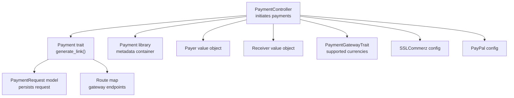
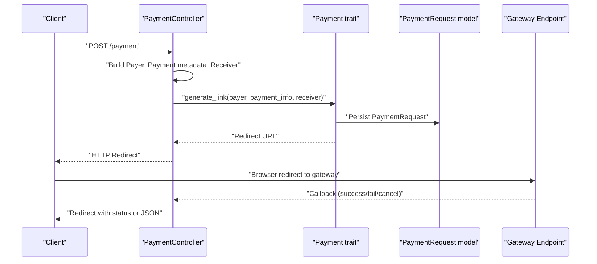
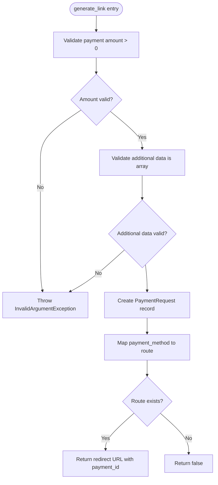
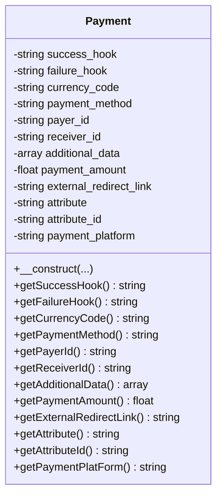
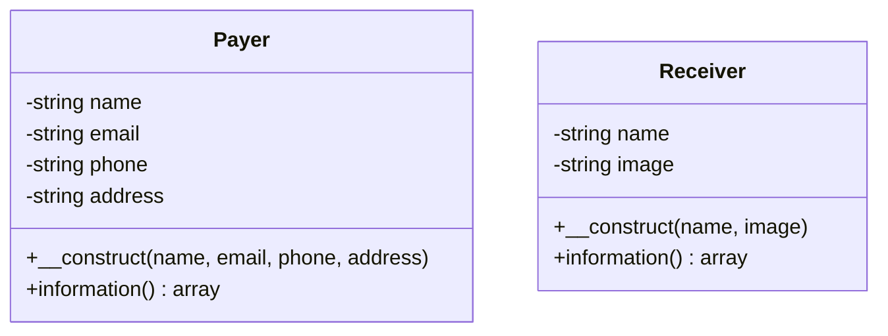
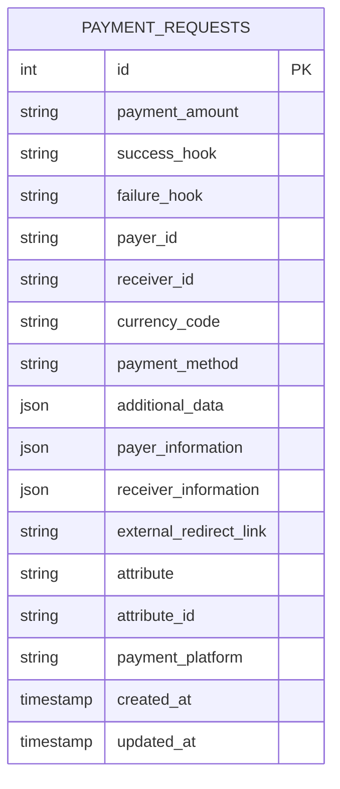
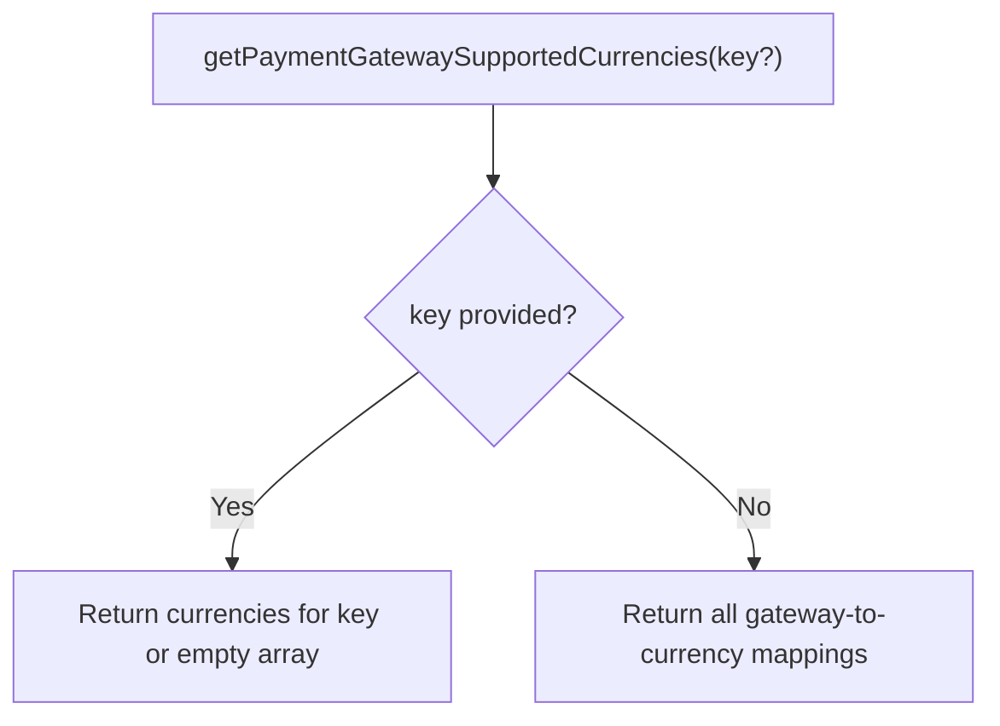
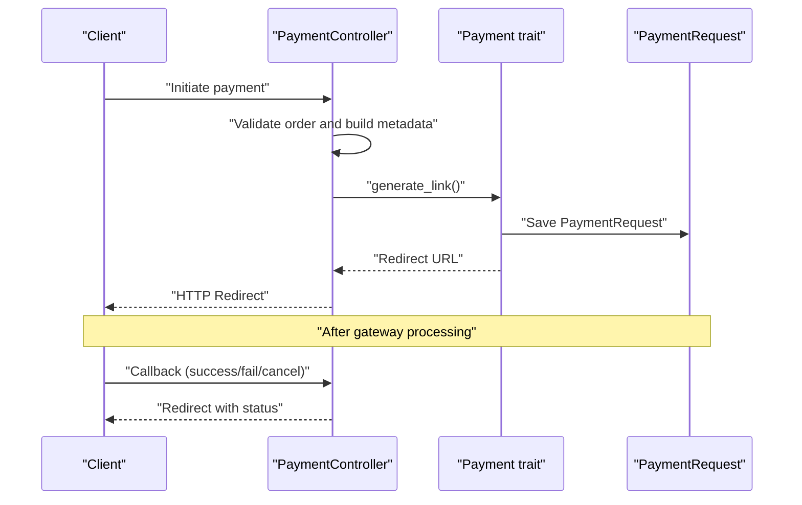
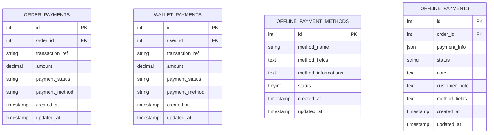
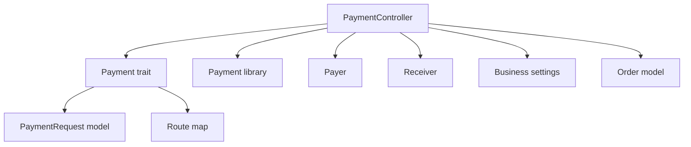

# Payment Integration Core

<cite>
**Referenced Files in This Document**
- [Payment.php](file://app/Traits/Payment.php)
- [PaymentGatewayTrait.php](file://app/Traits/PaymentGatewayTrait.php)
- [Payment.php](file://app/Library/Payment.php)
- [Payer.php](file://app/Library/Payer.php)
- [Receiver.php](file://app/Library/Receiver.php)
- [PaymentRequest.php](file://app/Models/PaymentRequest.php)
- [OrderPayment.php](file://app/Models/OrderPayment.php)
- [WalletPayment.php](file://app/Models/WalletPayment.php)
- [PaymentController.php](file://app/Http/Controllers/PaymentController.php)
- [sslcommerz.php](file://config/sslcommerz.php)
- [paypal.php](file://config/paypal.php)
- [create_order_payments_table_migration.php](file://database/migrations/2023_07_06_144944_create_order_payments_table.php)
- [create_wallet_payments_table_migration.php](file://database/migrations/2023_07_09_143746_create_wallet_payments_table.php)
- [create_offline_payment_methods_table_migration.php](file://database/migrations/2023_08_10_131937_create_offline_payment_methods_table.php)
- [create_offline_payments_table_migration.php](file://database/migrations/2023_08_10_132315_create_offline_payments_table.php)
</cite>

## Table of Contents
1. [Introduction](#introduction)
2. [Project Structure](#project-structure)
3. [Core Components](#core-components)
4. [Architecture Overview](#architecture-overview)
5. [Detailed Component Analysis](#detailed-component-analysis)
6. [Dependency Analysis](#dependency-analysis)
7. [Performance Considerations](#performance-considerations)
8. [Troubleshooting Guide](#troubleshooting-guide)
9. [Conclusion](#conclusion)

## Introduction
This document explains the unified payment integration system that generates payment requests, routes them to appropriate gateway endpoints, and manages the payment lifecycle across supported payment providers. It covers the Payment trait for request generation and routing, the PaymentRequest model for persistence, gateway support definitions, and the centralized controller flow for payment initiation, success/failure callbacks, and webhook processing.

## Project Structure
The payment system is organized around:
- A central Payment trait that validates inputs, persists a PaymentRequest, and returns a gateway-specific redirect URL
- A Payment library class that encapsulates payment metadata and getters
- Payer and Receiver value objects that provide structured payer/receiver information
- A PaymentRequest model persisted to the payment_requests table
- A PaymentGatewayTrait that defines supported currencies per gateway
- Controllers that orchestrate payment creation and callback handling
- Configuration files for gateway APIs (e.g., SSLCommerz, PayPal)
- Database migrations for payment records and offline payment flows

**Diagram sources**
- [PaymentController.php:41-131](file://app/Http/Controllers/PaymentController.php#L41-L131)
- [Payment.php:12-82](file://app/Traits/Payment.php#L12-L82)
- [PaymentRequest.php:9-15](file://app/Models/PaymentRequest.php#L9-L15)
- [PaymentGatewayTrait.php:8-341](file://app/Traits/PaymentGatewayTrait.php#L8-L341)
- [Payment.php:20-94](file://app/Library/Payment.php#L20-L94)
- [Payer.php:5-45](file://app/Library/Payer.php#L5-L45)
- [Receiver.php:5-33](file://app/Library/Receiver.php#L5-L33)
- [sslcommerz.php:1-25](file://config/sslcommerz.php#L1-L25)
- [paypal.php:1-14](file://config/paypal.php#L1-L14)

**Section sources**
- [PaymentController.php:14-160](file://app/Http/Controllers/PaymentController.php#L14-L160)
- [Payment.php:10-84](file://app/Traits/Payment.php#L10-L84)
- [Payment.php:5-96](file://app/Library/Payment.php#L5-L96)
- [Payer.php:5-46](file://app/Library/Payer.php#L5-L46)
- [Receiver.php:5-34](file://app/Library/Receiver.php#L5-L34)
- [PaymentRequest.php:9-16](file://app/Models/PaymentRequest.php#L9-L16)
- [PaymentGatewayTrait.php:6-344](file://app/Traits/PaymentGatewayTrait.php#L6-L344)
- [sslcommerz.php:1-25](file://config/sslcommerz.php#L1-L25)
- [paypal.php:1-14](file://config/paypal.php#L1-L14)

## Core Components
- Unified Payment trait: Validates payment amount and additional data, constructs a PaymentRequest record, and returns a gateway-specific redirect URL based on the selected payment_method.
- Payment library class: Encapsulates payment metadata (hooks, currency, method, amounts, identifiers, attributes, platform) with getters.
- Payer and Receiver value objects: Provide standardized information arrays for payer and receiver details.
- PaymentRequest model: Persists payment metadata to the payment_requests table.
- PaymentGatewayTrait: Defines supported currencies per gateway for validation and display.
- PaymentController: Orchestrates payment creation, session management, and success/failure callbacks; delegates redirect generation to the Payment trait.
- Gateway configurations: SSLCommerz and PayPal configs define endpoints and credentials.

**Section sources**
- [Payment.php:12-82](file://app/Traits/Payment.php#L12-L82)
- [Payment.php:20-94](file://app/Library/Payment.php#L20-L94)
- [Payer.php:36-45](file://app/Library/Payer.php#L36-L45)
- [Receiver.php:26-32](file://app/Library/Receiver.php#L26-L32)
- [PaymentRequest.php:14-15](file://app/Models/PaymentRequest.php#L14-L15)
- [PaymentGatewayTrait.php:8-341](file://app/Traits/PaymentGatewayTrait.php#L8-L341)
- [PaymentController.php:41-131](file://app/Http/Controllers/PaymentController.php#L41-L131)
- [sslcommerz.php:3-24](file://config/sslcommerz.php#L3-L24)
- [paypal.php:3-13](file://config/paypal.php#L3-L13)

## Architecture Overview
The payment flow begins when a client initiates a payment via the PaymentController. The controller builds a Payer, Payment metadata, and Receiver, then delegates to the Payment trait to create a PaymentRequest and obtain a redirect URL. The user is redirected to the gateway endpoint, and upon completion, the gateway invokes configured success/failure URLs. The PaymentController handles these callbacks and redirects back to the caller with status indicators.

**Diagram sources**
- [PaymentController.php:41-131](file://app/Http/Controllers/PaymentController.php#L41-L131)
- [Payment.php:12-82](file://app/Traits/Payment.php#L12-L82)
- [PaymentRequest.php:14-15](file://app/Models/PaymentRequest.php#L14-L15)

## Detailed Component Analysis

### Payment trait: Request Generation and Routing
The Payment trait performs:
- Validation: Ensures payment amount > 0 and additional data is an array
- Persistence: Creates a PaymentRequest record with amount, hooks, payer/receiver info, currency, method, additional data, and attributes
- Routing: Maps payment_method to a gateway route and returns a URL containing the PaymentRequest.id

**Diagram sources**
- [Payment.php:12-82](file://app/Traits/Payment.php#L12-L82)

**Section sources**
- [Payment.php:12-82](file://app/Traits/Payment.php#L12-L82)

### Payment metadata model: Payment library class
The Payment library class holds payment metadata and exposes getters for:
- Hooks (success/failure)
- Currency code
- Payment method
- Payer/receiver IDs
- Additional data
- Payment amount
- External redirect link
- Attribute and attribute ID
- Payment platform

**Diagram sources**
- [Payment.php:5-96](file://app/Library/Payment.php#L5-L96)

**Section sources**
- [Payment.php:20-94](file://app/Library/Payment.php#L20-L94)

### Payer and Receiver value objects
- Payer: Holds name, email, phone, address and returns an information array
- Receiver: Holds name, image and returns an information array

**Diagram sources**
- [Payer.php:5-46](file://app/Library/Payer.php#L5-L46)
- [Receiver.php:5-34](file://app/Library/Receiver.php#L5-L34)

**Section sources**
- [Payer.php:36-45](file://app/Library/Payer.php#L36-L45)
- [Receiver.php:26-32](file://app/Library/Receiver.php#L26-L32)

### PaymentRequest model and persistence
- PaymentRequest is persisted to the payment_requests table
- The Payment trait writes payment_amount, success_hook, failure_hook, payer_id, receiver_id, currency_code, payment_method, additional_data, payer_information, receiver_information, external_redirect_link, attribute, attribute_id, payment_platform

**Diagram sources**
- [PaymentRequest.php:14-15](file://app/Models/PaymentRequest.php#L14-L15)
- [Payment.php:22-37](file://app/Traits/Payment.php#L22-L37)

**Section sources**
- [PaymentRequest.php:14-15](file://app/Models/PaymentRequest.php#L14-L15)
- [Payment.php:22-37](file://app/Traits/Payment.php#L22-L37)

### PaymentGatewayTrait: Supported currencies
Defines supported currencies per gateway. Can be used to validate currency compatibility or present options to users.

**Diagram sources**
- [PaymentGatewayTrait.php:8-341](file://app/Traits/PaymentGatewayTrait.php#L8-L341)

**Section sources**
- [PaymentGatewayTrait.php:8-341](file://app/Traits/PaymentGatewayTrait.php#L8-L341)

### PaymentController: Orchestration and callbacks
- payment(): Builds Payer, Payment metadata, Receiver; calls Payment::generate_link; redirects to gateway
- success()/fail()/cancel(): Handle callbacks and redirect back to the caller with status

**Diagram sources**
- [PaymentController.php:41-131](file://app/Http/Controllers/PaymentController.php#L41-L131)
- [Payment.php:12-82](file://app/Traits/Payment.php#L12-L82)

**Section sources**
- [PaymentController.php:41-131](file://app/Http/Controllers/PaymentController.php#L41-L131)
- [PaymentController.php:133-157](file://app/Http/Controllers/PaymentController.php#L133-L157)

### Payment records and offline payment flows
- OrderPayment: Tracks per-order payment transactions with amount, status, and method
- WalletPayment: Tracks wallet funding/refund transactions similarly
- OfflinePaymentMethod and OfflinePayment: Support manual/branch-based payment methods with configurable fields and statuses

**Diagram sources**
- [OrderPayment.php:12-26](file://app/Models/OrderPayment.php#L12-L26)
- [WalletPayment.php:8-11](file://app/Models/WalletPayment.php#L8-L11)
- [create_order_payments_table_migration.php:14-22](file://database/migrations/2023_07_06_144944_create_order_payments_table.php#L14-L22)
- [create_wallet_payments_table_migration.php:14-21](file://database/migrations/2023_07_09_143746_create_wallet_payments_table.php#L14-L21)
- [create_offline_payment_methods_table_migration.php:14-20](file://database/migrations/2023_08_10_131937_create_offline_payment_methods_table.php#L14-L20)
- [create_offline_payments_table_migration.php:14-22](file://database/migrations/2023_08_10_132315_create_offline_payments_table.php#L14-L22)

**Section sources**
- [OrderPayment.php:12-26](file://app/Models/OrderPayment.php#L12-L26)
- [WalletPayment.php:8-11](file://app/Models/WalletPayment.php#L8-L11)
- [create_order_payments_table_migration.php:14-22](file://database/migrations/2023_07_06_144944_create_order_payments_table.php#L14-L22)
- [create_wallet_payments_table_migration.php:14-21](file://database/migrations/2023_07_09_143746_create_wallet_payments_table.php#L14-L21)
- [create_offline_payment_methods_table_migration.php:14-20](file://database/migrations/2023_08_10_131937_create_offline_payment_methods_table.php#L14-L20)
- [create_offline_payments_table_migration.php:14-22](file://database/migrations/2023_08_10_132315_create_offline_payments_table.php#L14-L22)

### Gateway configuration examples
- SSLCommerz: Defines API domain, credentials, endpoints, and success/failure/cancel/IPN URLs
- PayPal: Defines client credentials and SDK settings including mode and logging

**Section sources**
- [sslcommerz.php:3-24](file://config/sslcommerz.php#L3-L24)
- [paypal.php:3-13](file://config/paypal.php#L3-L13)

## Dependency Analysis
The Payment trait depends on:
- PaymentRequest model for persistence
- Route map for gateway redirection
- Payment library class for metadata
- Payer/Receiver for structured information

PaymentController depends on:
- Payment trait for redirect URL generation
- Payer/Receiver/Payment for building request metadata
- Business settings for currency and business branding
- Order model for payment amount and callback handling

**Diagram sources**
- [PaymentController.php:10-127](file://app/Http/Controllers/PaymentController.php#L10-L127)
- [Payment.php:12-82](file://app/Traits/Payment.php#L12-L82)
- [PaymentRequest.php:14-15](file://app/Models/PaymentRequest.php#L14-L15)

**Section sources**
- [PaymentController.php:10-127](file://app/Http/Controllers/PaymentController.php#L10-L127)
- [Payment.php:12-82](file://app/Traits/Payment.php#L12-L82)

## Performance Considerations
- Minimize database writes: Persist PaymentRequest only once during redirect generation
- Use lightweight JSON fields: additional_data, payer_information, receiver_information keep payload compact
- Avoid heavy computations in callbacks: handle business logic after verifying gateway signatures
- Cache gateway currency lists: Use PaymentGatewayTrait results to avoid repeated computation

## Troubleshooting Guide
Common issues and resolutions:
- Payment amount validation failures: Ensure payment amount is greater than zero before calling generate_link
- Additional data type errors: Provide an associative array for additional_data
- Unsupported payment method: Verify payment_method exists in the route map; otherwise generate_link returns false
- Callback handling: Ensure callback URLs are set in the Payment metadata and Order records; PaymentController will append status parameters
- Gateway configuration: Confirm SSLCommerz and PayPal credentials are correctly set in environment variables

**Section sources**
- [Payment.php:14-20](file://app/Traits/Payment.php#L14-L20)
- [Payment.php:77-81](file://app/Traits/Payment.php#L77-L81)
- [PaymentController.php:133-157](file://app/Http/Controllers/PaymentController.php#L133-L157)
- [sslcommerz.php:8-11](file://config/sslcommerz.php#L8-L11)
- [paypal.php:4-7](file://config/paypal.php#L4-L7)

## Conclusion
The payment integration system provides a unified, extensible foundation for payment request generation, routing, and lifecycle management. By encapsulating metadata in the Payment library class, structuring payer/receiver information with value objects, persisting requests via PaymentRequest, and delegating routing to the Payment trait, the system supports multiple gateways while maintaining a consistent interface. Controllers orchestrate the flow, and gateway configurations enable seamless integration with external providers. Robust validation, clear callback handling, and dedicated models for order and wallet payments ensure reliable payment processing.