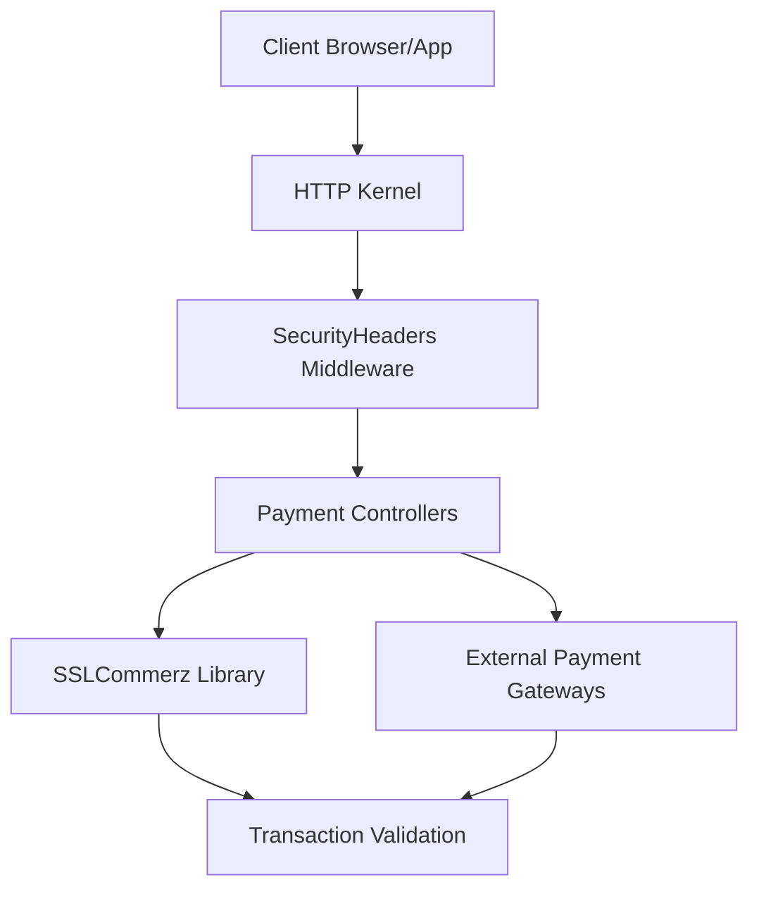
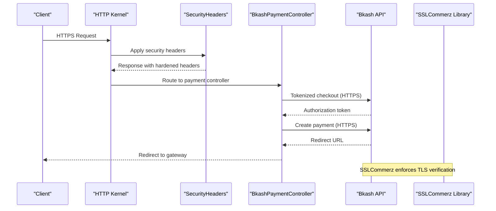
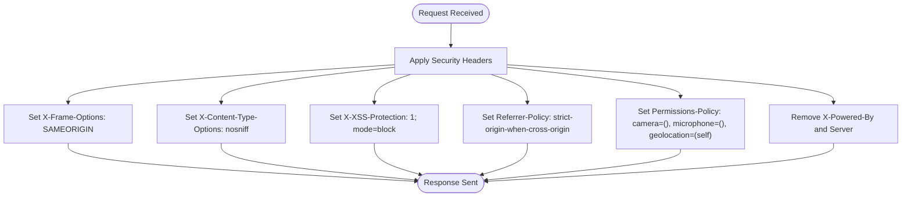
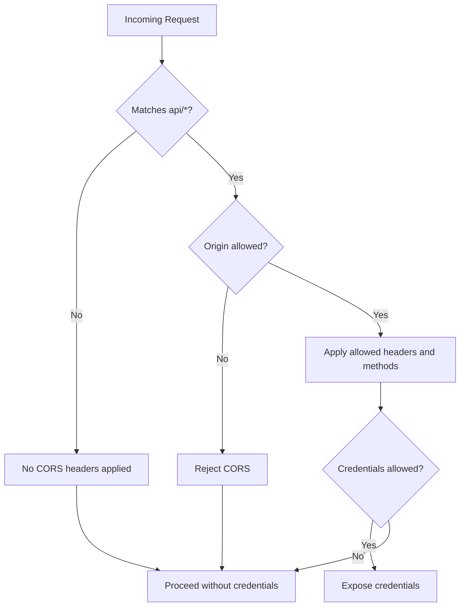
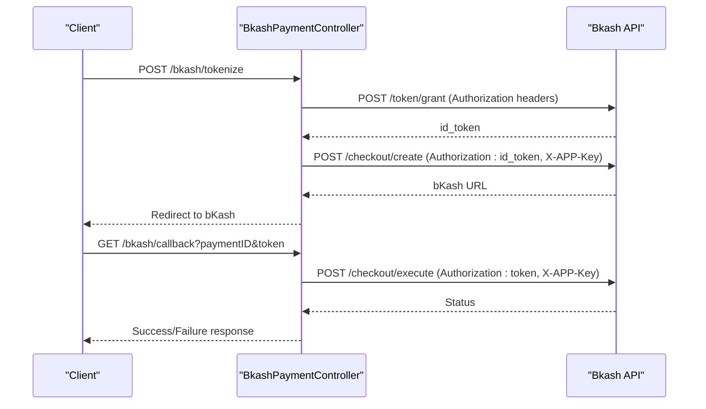
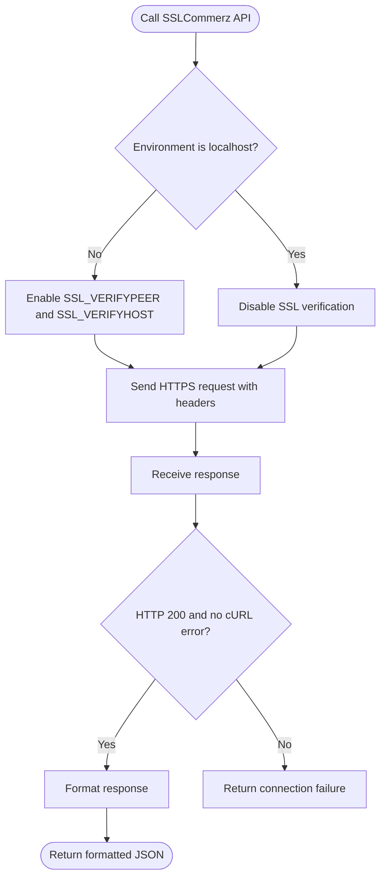
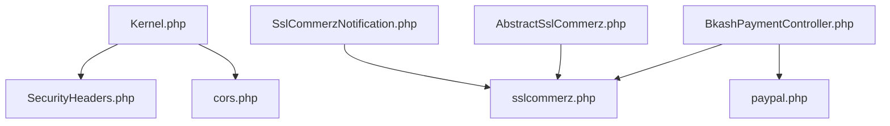

# Payment Security and Compliance

<cite>
**Referenced Files in This Document**
- [SecurityHeaders.php](file://app/Http/Middleware/SecurityHeaders.php)
- [cors.php](file://config/cors.php)
- [Kernel.php](file://app/Http/Kernel.php)
- [BkashPaymentController.php](file://app/Http/Controllers/BkashPaymentController.php)
- [AbstractSslCommerz.php](file://app/Library/SslCommerz/AbstractSslCommerz.php)
- [SslCommerzNotification.php](file://app/Library/SslCommerz/SslCommerzNotification.php)
- [sslcommerz.php](file://config/sslcommerz.php)
- [paypal.php](file://config/paypal.php)
- [.htaccess](file://.htaccess)
- [PaymentGatewayTrait.php](file://app/Traits/PaymentGatewayTrait.php)
- [app.php](file://config/app.php)
</cite>

## Table of Contents
1. [Introduction](#introduction)
2. [Project Structure](#project-structure)
3. [Core Components](#core-components)
4. [Architecture Overview](#architecture-overview)
5. [Detailed Component Analysis](#detailed-component-analysis)
6. [Dependency Analysis](#dependency-analysis)
7. [Performance Considerations](#performance-considerations)
8. [Troubleshooting Guide](#troubleshooting-guide)
9. [Conclusion](#conclusion)
10. [Appendices](#appendices)

## Introduction
This document provides comprehensive guidance on payment security measures, compliance requirements, and fraud prevention systems for the payment infrastructure. It focuses on PCI DSS compliance procedures, data encryption standards, secure payment transmission protocols, tokenization processes, 3D Secure implementation, risk assessment mechanisms, security headers configuration, CORS policies, and HTTPS enforcement. It also outlines vulnerability scanning, penetration testing, and security audit preparation, along with regional compliance requirements, data residency laws, and cross-border payment regulations.

## Project Structure
The payment security and compliance posture is implemented across middleware, configuration files, controllers, and library components:
- Global HTTP middleware applies security headers to all responses.
- CORS configuration controls cross-origin access for API endpoints.
- Payment controllers integrate with external gateways using HTTPS and secure headers.
- SSLCommerz library enforces TLS verification and response validation.
- Configuration files define gateway credentials, domains, and operational modes.

**Diagram sources**
- [Kernel.php:18-28](file://app/Http/Kernel.php#L18-L28)
- [SecurityHeaders.php:10-23](file://app/Http/Middleware/SecurityHeaders.php#L10-L23)
- [BkashPaymentController.php:47-132](file://app/Http/Controllers/BkashPaymentController.php#L47-L132)
- [AbstractSslCommerz.php:46-79](file://app/Library/SslCommerz/AbstractSslCommerz.php#L46-L79)

**Section sources**
- [Kernel.php:18-28](file://app/Http/Kernel.php#L18-L28)
- [SecurityHeaders.php:10-23](file://app/Http/Middleware/SecurityHeaders.php#L10-L23)

## Core Components
- Security Headers Middleware: Applies hardened headers and removes server fingerprinting metadata.
- CORS Configuration: Defines allowed origins, methods, headers, and credentials policy.
- Payment Controllers: Integrate with gateways using HTTPS endpoints and secure headers.
- SSLCommerz Library: Enforces TLS verification, validates responses, and formats outcomes.
- Configuration Files: Define gateway domains, credentials, and operational modes.

**Section sources**
- [SecurityHeaders.php:10-23](file://app/Http/Middleware/SecurityHeaders.php#L10-L23)
- [cors.php:18-34](file://config/cors.php#L18-L34)
- [BkashPaymentController.php:47-132](file://app/Http/Controllers/BkashPaymentController.php#L47-L132)
- [AbstractSslCommerz.php:46-79](file://app/Library/SslCommerz/AbstractSslCommerz.php#L46-L79)
- [sslcommerz.php:7-19](file://config/sslcommerz.php#L7-L19)

## Architecture Overview
The payment flow integrates client requests with secure middleware and external gateways. TLS verification is enforced for SSLCommerz, while Bkash uses tokenized checkout with HTTPS endpoints. CORS and security headers protect API exposure and mitigate common web vulnerabilities.

**Diagram sources**
- [Kernel.php:18-28](file://app/Http/Kernel.php#L18-L28)
- [SecurityHeaders.php:10-23](file://app/Http/Middleware/SecurityHeaders.php#L10-L23)
- [BkashPaymentController.php:47-132](file://app/Http/Controllers/BkashPaymentController.php#L47-L132)
- [AbstractSslCommerz.php:46-79](file://app/Library/SslCommerz/AbstractSslCommerz.php#L46-L79)

## Detailed Component Analysis

### Security Headers Middleware
- Purpose: Hardens HTTP responses by setting security headers and removing server fingerprinting.
- Key behaviors:
  - Sets X-Frame-Options to SAMEORIGIN.
  - Sets X-Content-Type-Options to nosniff.
  - Sets X-XSS-Protection to block mode.
  - Sets Referrer-Policy to strict-origin-when-cross-origin.
  - Sets Permissions-Policy to restrict camera, microphone, and geolocation.
  - Removes X-Powered-By and Server headers.

**Diagram sources**
- [SecurityHeaders.php:10-23](file://app/Http/Middleware/SecurityHeaders.php#L10-L23)

**Section sources**
- [SecurityHeaders.php:10-23](file://app/Http/Middleware/SecurityHeaders.php#L10-L23)

### CORS Policy Configuration
- Paths: Restricts CORS to API routes.
- Methods: Supports GET, POST, PUT, DELETE, PATCH, OPTIONS.
- Origins: Controlled via environment variable with defaults.
- Headers: Includes Content-Type, Authorization, and custom headers.
- Credentials: Enabled to support cookies and auth.
- Notes: Ensure allowed origins match production domains.

**Diagram sources**
- [cors.php:18-34](file://config/cors.php#L18-L34)

**Section sources**
- [cors.php:18-34](file://config/cors.php#L18-L34)

### Bkash Tokenized Checkout Integration
- HTTPS Base URLs: Uses live or sandbox base URLs depending on mode.
- Authentication: Username/password in headers; app_key and app_secret for tokenization.
- Tokenization: Requests an id_token for subsequent checkout calls.
- Payment Creation: Sends amount, currency, intent, payerReference, and callback URL.
- Callback Execution: Executes payment with paymentID and updates payment records.

**Diagram sources**
- [BkashPaymentController.php:47-132](file://app/Http/Controllers/BkashPaymentController.php#L47-L132)
- [BkashPaymentController.php:134-183](file://app/Http/Controllers/BkashPaymentController.php#L134-L183)

**Section sources**
- [BkashPaymentController.php:26-45](file://app/Http/Controllers/BkashPaymentController.php#L26-L45)
- [BkashPaymentController.php:81-132](file://app/Http/Controllers/BkashPaymentController.php#L81-L132)
- [BkashPaymentController.php:134-183](file://app/Http/Controllers/BkashPaymentController.php#L134-L183)

### SSLCommerz TLS Verification and Validation
- TLS Settings: Enforces SSL verification for non-localhost environments.
- API Calls: Uses cURL with SSL verification and timeout settings.
- Response Formatting: Returns standardized JSON for checkout responses.
- Transaction Validation: Validates hash signatures and amounts/currency matches.

**Diagram sources**
- [AbstractSslCommerz.php:46-79](file://app/Library/SslCommerz/AbstractSslCommerz.php#L46-L79)
- [SslCommerzNotification.php:43-150](file://app/Library/SslCommerz/SslCommerzNotification.php#L43-L150)

**Section sources**
- [AbstractSslCommerz.php:46-79](file://app/Library/SslCommerz/AbstractSslCommerz.php#L46-L79)
- [SslCommerzNotification.php:43-150](file://app/Library/SslCommerz/SslCommerzNotification.php#L43-L150)

### HTTPS Enforcement and .htaccess
- .htaccess: Redirects trailing slashes and handles Authorization header forwarding.
- Environment URL: Application URL is configurable; ensure HTTPS in production.
- Recommendations: Enforce HTTPS at the load balancer or web server level and configure HSTS.

**Section sources**
- [.htaccess:1-30](file://.htaccess#L1-L30)
- [app.php:57](file://config/app.php#L57)

### Payment Gateway Supported Currencies
- Purpose: Provides supported currencies per gateway for localization and validation.
- Usage: Use to validate currency compatibility before initiating payments.

**Section sources**
- [PaymentGatewayTrait.php:8-341](file://app/Traits/PaymentGatewayTrait.php#L8-L341)

## Dependency Analysis
- Middleware Dependencies:
  - Kernel registers SecurityHeaders globally.
  - CORS is handled by the framework’s HandleCors middleware.
- Controller Dependencies:
  - BkashPaymentController depends on payment configuration and routes.
  - SSLCommerz components depend on configuration values for domain and credentials.
- Configuration Dependencies:
  - sslcommerz.php defines API domain and credentials.
  - paypal.php defines PayPal client credentials and mode.

**Diagram sources**
- [Kernel.php:18-28](file://app/Http/Kernel.php#L18-L28)
- [SecurityHeaders.php:10-23](file://app/Http/Middleware/SecurityHeaders.php#L10-L23)
- [cors.php:18-34](file://config/cors.php#L18-L34)
- [BkashPaymentController.php:26-45](file://app/Http/Controllers/BkashPaymentController.php#L26-L45)
- [sslcommerz.php:7-19](file://config/sslcommerz.php#L7-L19)
- [paypal.php:1-14](file://config/paypal.php#L1-L14)
- [AbstractSslCommerz.php:46-79](file://app/Library/SslCommerz/AbstractSslCommerz.php#L46-L79)
- [SslCommerzNotification.php:17-23](file://app/Library/SslCommerz/SslCommerzNotification.php#L17-L23)

**Section sources**
- [Kernel.php:18-28](file://app/Http/Kernel.php#L18-L28)
- [cors.php:18-34](file://config/cors.php#L18-L34)
- [sslcommerz.php:7-19](file://config/sslcommerz.php#L7-L19)
- [paypal.php:1-14](file://config/paypal.php#L1-L14)

## Performance Considerations
- TLS Verification Overhead: Enabling SSL verification adds latency; ensure proper caching and keep-alive settings.
- cURL Timeouts: Configure appropriate timeouts for gateway calls to prevent hanging requests.
- Response Parsing: Validate and parse responses efficiently to minimize processing overhead.

## Troubleshooting Guide
- SSL/TLS Issues:
  - Verify SSL verification settings in the SSLCommerz library for production vs. sandbox.
  - Confirm API domain configuration and environment variables.
- CORS Errors:
  - Ensure allowed origins include the frontend domain and credentials are enabled when required.
- Authorization Header Handling:
  - Confirm .htaccess rewrite rules forward Authorization headers to PHP.
- Payment Callback Failures:
  - Validate gateway callbacks and ensure success/failure hooks are callable.

**Section sources**
- [AbstractSslCommerz.php:46-79](file://app/Library/SslCommerz/AbstractSslCommerz.php#L46-L79)
- [sslcommerz.php:7-19](file://config/sslcommerz.php#L7-L19)
- [cors.php:18-34](file://config/cors.php#L18-L34)
- [.htaccess:8-10](file://.htaccess#L8-L10)
- [BkashPaymentController.php:161-182](file://app/Http/Controllers/BkashPaymentController.php#L161-L182)

## Conclusion
The payment infrastructure employs hardened security headers, strict TLS verification, and controlled CORS policies to mitigate common web vulnerabilities. Integration with external gateways follows HTTPS best practices, and response validation ensures transaction integrity. For full PCI DSS alignment, additional controls such as secure credential storage, network segmentation, and continuous monitoring are recommended.

## Appendices

### PCI DSS Compliance Procedures
- Network Security:
  - Enforce TLS 1.2+ for all payment traffic.
  - Disable weak ciphers and protocols.
- Data Protection:
  - Encrypt stored cardholder data at rest.
  - Use strong key management and rotation.
- Access Control:
  - Limit access to cardholder data.
  - Enforce multi-factor authentication for administrative access.
- Monitoring and Logging:
  - Maintain audit trails for all access and modifications.
  - Monitor for suspicious activities.
- Vulnerability Management:
  - Conduct regular vulnerability scans and penetration tests.
  - Remediate findings within defined SLAs.

### Data Encryption Standards
- Transport Encryption: TLS 1.2+ for all external communications.
- At-Rest Encryption: AES-256 for sensitive data storage.
- Key Management: Rotate keys annually and maintain secure key stores.

### Secure Payment Transmission Protocols
- Use HTTPS endpoints for all payment APIs.
- Implement mutual TLS where supported by gateways.
- Validate SSL certificates and enforce certificate pinning when feasible.

### Tokenization Processes
- Replace primary account numbers (PAN) with tokens.
- Store tokens separately from raw card data.
- Limit token lifetime and revoke unused tokens.

### 3D Secure Implementation
- Integrate 3D Secure with supported gateways.
- Redirect customers to authentication pages.
- Validate challenge results and approve/reject transactions accordingly.

### Risk Assessment Mechanisms
- Implement velocity checks and device fingerprints.
- Monitor transaction anomalies and geographic inconsistencies.
- Use machine learning models for fraud detection.

### Security Headers Configuration
- Apply hardened headers consistently across all responses.
- Remove server fingerprinting headers.
- Regularly review and update header policies.

### CORS Policies
- Restrict allowed origins to trusted domains.
- Limit exposed headers and methods.
- Enable credentials only when necessary.

### HTTPS Enforcement
- Enforce HTTPS at the load balancer or web server.
- Configure HSTS for long-term security.
- Redirect HTTP to HTTPS automatically.

### Vulnerability Scanning and Penetration Testing
- Schedule quarterly vulnerability scans.
- Perform annual penetration tests by approved assessors.
- Maintain remediation plans and track progress.

### Security Audit Preparation
- Document policies, procedures, and controls.
- Maintain evidence of compliance activities.
- Prepare for on-site assessments with trained personnel.

### Regional Compliance Requirements
- PCI DSS: Applies globally for entities handling cardholder data.
- GDPR: Requires consent, data minimization, and breach notification.
- Brazil’s Lei Geral de Proteção de Dados (LGPD): Similar to GDPR.
- Mexico’s AEP: Consumer protection and data security obligations.
- India’s Digital Personal Data Protection Act: Consent, data fiduciary obligations, and breach reporting.
- UAE’s Federal Decree-Law No. 5/2022: Data protection and cybersecurity obligations.

### Data Residency Laws
- Store and process personal data within jurisdictional boundaries where required.
- Obtain consent for cross-border transfers.
- Implement appropriate safeguards for international data transfers.

### Cross-Border Payment Regulations
- Comply with local licensing and registration requirements.
- Implement anti-money laundering (AML) and counter-terrorism financing (CTF) measures.
- Report suspicious transactions to relevant authorities.