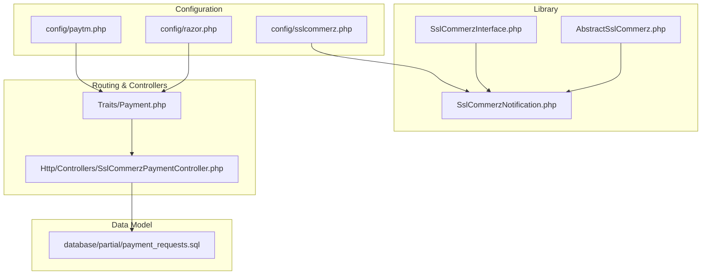
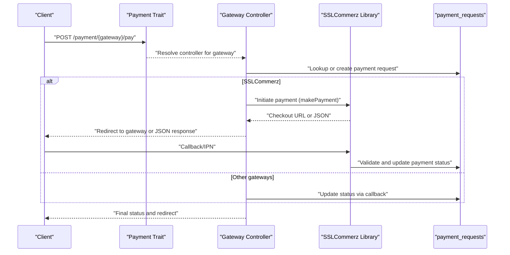
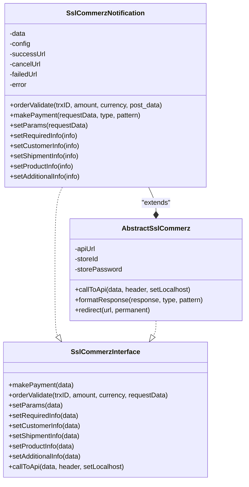
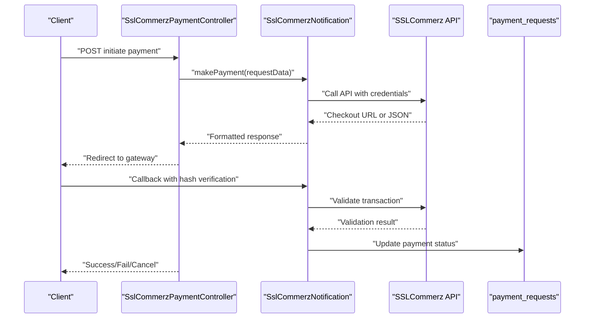
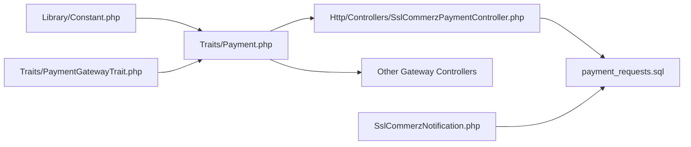

# Regional Payment Gateways

<cite>
**Referenced Files in This Document**
- [paytm.php](file://config/paytm.php)
- [razor.php](file://config/razor.php)
- [sslcommerz.php](file://config/sslcommerz.php)
- [AbstractSslCommerz.php](file://app/Library/SslCommerz/AbstractSslCommerz.php)
- [SslCommerzInterface.php](file://app/Library/SslCommerz/SslCommerzInterface.php)
- [SslCommerzNotification.php](file://app/Library/SslCommerz/SslCommerzNotification.php)
- [Constant.php](file://app/Library/Constant.php)
- [Payment.php](file://app/Traits/Payment.php)
- [PaymentGatewayTrait.php](file://app/Traits/PaymentGatewayTrait.php)
- [SslCommerzPaymentController.php](file://app/Http/Controllers/SslCommerzPaymentController.php)
- [payment_requests.sql](file://database/partial/payment_requests.sql)
- [UpdateController.php](file://app/Http/Controllers/UpdateController.php)
- [index.blade.php](file://resources/views/admin-views/subscription/index.blade.php)
- [subscription-in-store-details.blade.php](file://resources/views/admin-views/subscription/subscription-in-store-details.blade.php)
</cite>

## Table of Contents
1. [Introduction](#introduction)
2. [Project Structure](#project-structure)
3. [Core Components](#core-components)
4. [Architecture Overview](#architecture-overview)
5. [Detailed Component Analysis](#detailed-component-analysis)
6. [Dependency Analysis](#dependency-analysis)
7. [Performance Considerations](#performance-considerations)
8. [Troubleshooting Guide](#troubleshooting-guide)
9. [Conclusion](#conclusion)
10. [Appendices](#appendices)

## Introduction
This document explains the regional payment gateway implementations present in the codebase, focusing on Paytm, Razorpay, SenangPay, MercadoPago, and SSLCommerz. It covers configuration, regional requirements, local payment method support, mobile money and QR integrations where available, setup procedures, compliance hooks, webhook implementations, settlement, and reporting capabilities. The goal is to enable developers and operators to configure, integrate, and troubleshoot regional gateways effectively while maintaining compliance and accurate financial reporting.

## Project Structure
The payment gateway ecosystem is organized around:
- Configuration files per gateway under config/
- A reusable SSLCommerz library under app/Library/SslCommerz/
- Route-to-controller mappings in traits and controllers
- A central payment_requests table for tracking payment intents and callbacks
- Blade templates that surface gateway options in admin UIs

**Diagram sources**
- [paytm.php:1-11](file://config/paytm.php#L1-L11)
- [razor.php:1-7](file://config/razor.php#L1-L7)
- [sslcommerz.php:1-25](file://config/sslcommerz.php#L1-L25)
- [SslCommerzInterface.php:1-24](file://app/Library/SslCommerz/SslCommerzInterface.php#L1-L24)
- [AbstractSslCommerz.php:1-124](file://app/Library/SslCommerz/AbstractSslCommerz.php#L1-L124)
- [SslCommerzNotification.php:1-455](file://app/Library/SslCommerz/SslCommerzNotification.php#L1-L455)
- [Payment.php:39-68](file://app/Traits/Payment.php#L39-L68)
- [SslCommerzPaymentController.php:210-227](file://app/Http/Controllers/SslCommerzPaymentController.php#L210-L227)
- [payment_requests.sql:32-53](file://database/partial/payment_requests.sql#L32-L53)

**Section sources**
- [paytm.php:1-11](file://config/paytm.php#L1-L11)
- [razor.php:1-7](file://config/razor.php#L1-L7)
- [sslcommerz.php:1-25](file://config/sslcommerz.php#L1-L25)
- [SslCommerzInterface.php:1-24](file://app/Library/SslCommerz/SslCommerzInterface.php#L1-L24)
- [AbstractSslCommerz.php:1-124](file://app/Library/SslCommerz/AbstractSslCommerz.php#L1-L124)
- [SslCommerzNotification.php:1-455](file://app/Library/SslCommerz/SslCommerzNotification.php#L1-L455)
- [Payment.php:39-68](file://app/Traits/Payment.php#L39-L68)
- [SslCommerzPaymentController.php:210-227](file://app/Http/Controllers/SslCommerzPaymentController.php#L210-L227)
- [payment_requests.sql:32-53](file://database/partial/payment_requests.sql#L32-L53)

## Core Components
- Gateway constants and supported currencies are centralized for consistent routing and currency availability.
- SSLCommerz library provides a reusable interface and base implementation for payment initiation, validation, and response formatting.
- Payment trait defines route mappings for each gateway, including regional ones.
- Payment requests table persists payment intents, hooks, and metadata for reconciliation and reporting.

Key highlights:
- Supported gateways include Paytm, Razorpay, SenangPay, MercadoPago, and SSLCommerz.
- Currency support is gateway-specific and defined centrally.
- SSLCommerz supports hosted checkout and IPN-style callbacks via a dedicated notification class.

**Section sources**
- [Constant.php:4-38](file://app/Library/Constant.php#L4-L38)
- [PaymentGatewayTrait.php:196-245](file://app/Traits/PaymentGatewayTrait.php#L196-L245)
- [SslCommerzInterface.php:1-24](file://app/Library/SslCommerz/SslCommerzInterface.php#L1-L24)
- [AbstractSslCommerz.php:40-123](file://app/Library/SslCommerz/AbstractSslCommerz.php#L40-L123)
- [SslCommerzNotification.php:193-230](file://app/Library/SslCommerz/SslCommerzNotification.php#L193-L230)
- [Payment.php:39-68](file://app/Traits/Payment.php#L39-L68)
- [payment_requests.sql:32-53](file://database/partial/payment_requests.sql#L32-L53)

## Architecture Overview
The payment flow follows a consistent pattern:
- Client initiates payment via a gateway route.
- Backend creates or retrieves a payment request record.
- Gateway-specific controller or library handles initiation, redirects, and validation.
- Callbacks update the payment request and trigger success/failure hooks.
- Reporting and settlement rely on persisted records and hooks.

**Diagram sources**
- [Payment.php:39-68](file://app/Traits/Payment.php#L39-L68)
- [SslCommerzNotification.php:193-230](file://app/Library/SslCommerz/SslCommerzNotification.php#L193-L230)
- [SslCommerzPaymentController.php:210-227](file://app/Http/Controllers/SslCommerzPaymentController.php#L210-L227)
- [payment_requests.sql:32-53](file://database/partial/payment_requests.sql#L32-L53)

## Detailed Component Analysis

### Paytm
- Configuration: Environment-driven settings for sandbox/live mode, merchant credentials, website, channel, and industry type.
- Routing: Paytm route is mapped via the central payment trait.
- Regional support: Currency support is defined centrally for Paytm.
- Local payment methods: Not explicitly modeled in the provided files; integration would follow similar patterns as other gateways.

Implementation notes:
- Use environment variables to switch between sandbox and production.
- Ensure merchant credentials are set per region/environment.

**Section sources**
- [paytm.php:3-10](file://config/paytm.php#L3-L10)
- [Payment.php:44-44](file://app/Traits/Payment.php#L44-L44)
- [PaymentGatewayTrait.php:196-198](file://app/Traits/PaymentGatewayTrait.php#L196-L198)

### Razorpay
- Configuration: API key and secret configured via environment variables.
- Routing: Razorpay route is mapped via the central payment trait.
- Regional support: Currency support includes multiple major currencies and regional ones.

Integration guidance:
- Store keys securely and rotate periodically.
- Use currency lists to validate amounts and conversions.

**Section sources**
- [razor.php:3-6](file://config/razor.php#L3-L6)
- [Payment.php:48-48](file://app/Traits/Payment.php#L48-L48)
- [PaymentGatewayTrait.php:205-215](file://app/Traits/PaymentGatewayTrait.php#L205-L215)

### SenangPay
- Configuration: Gateway is present in constants and supported currencies.
- Routing: SenangPay route is mapped via the central payment trait.
- Regional support: Currency support is defined centrally for MYR.

Integration guidance:
- Ensure domain and credentials are configured for the target region.
- Validate success/fail/cancel URLs align with gateway requirements.

**Section sources**
- [Constant.php:10-10](file://app/Library/Constant.php#L10-L10)
- [Payment.php:49-49](file://app/Traits/Payment.php#L49-L49)
- [PaymentGatewayTrait.php:216-218](file://app/Traits/PaymentGatewayTrait.php#L216-L218)

### MercadoPago
- Configuration: Gateway presence in constants and supported currencies.
- UI: Admin blade surfaces MercadoPago as a selectable payment method.
- Routing: MercadoPago route is mapped via the central payment trait.

Integration guidance:
- Admin UI enables selection of MercadoPago for stores.
- Backend controllers should handle authorization and callback flows.

**Section sources**
- [Constant.php:16-16](file://app/Library/Constant.php#L16-L16)
- [Payment.php:50-50](file://app/Traits/Payment.php#L50-L50)
- [PaymentGatewayTrait.php:216-245](file://app/Traits/PaymentGatewayTrait.php#L216-L245)
- [index.blade.php:504-516](file://resources/views/admin-views/subscription/index.blade.php#L504-L516)
- [subscription-in-store-details.blade.php:504-516](file://resources/views/admin-views/subscription/subscription-in-store-details.blade.php#L504-L516)

### SSLCommerz
- Configuration: API domain, credentials, endpoint URLs, and local/production flags.
- Library: Interface and abstract class define payment initiation, response formatting, and redirect behavior.
- Notification handler: Validates callbacks, verifies signatures, and reconciles amounts and currencies.
- Controller: Handles success, failed, and canceled callbacks and triggers hooks.

**Diagram sources**
- [SslCommerzInterface.php:1-24](file://app/Library/SslCommerz/SslCommerzInterface.php#L1-L24)
- [AbstractSslCommerz.php:4-123](file://app/Library/SslCommerz/AbstractSslCommerz.php#L4-L123)
- [SslCommerzNotification.php:4-455](file://app/Library/SslCommerz/SslCommerzNotification.php#L4-L455)

**Diagram sources**
- [SslCommerzNotification.php:193-230](file://app/Library/SslCommerz/SslCommerzNotification.php#L193-L230)
- [SslCommerzNotification.php:25-150](file://app/Library/SslCommerz/SslCommerzNotification.php#L25-L150)
- [SslCommerzPaymentController.php:210-227](file://app/Http/Controllers/SslCommerzPaymentController.php#L210-L227)
- [payment_requests.sql:32-53](file://database/partial/payment_requests.sql#L32-L53)

**Section sources**
- [sslcommerz.php:3-24](file://config/sslcommerz.php#L3-L24)
- [SslCommerzInterface.php:1-24](file://app/Library/SslCommerz/SslCommerzInterface.php#L1-L24)
- [AbstractSslCommerz.php:40-123](file://app/Library/SslCommerz/AbstractSslCommerz.php#L40-L123)
- [SslCommerzNotification.php:193-230](file://app/Library/SslCommerz/SslCommerzNotification.php#L193-L230)
- [SslCommerzNotification.php:25-150](file://app/Library/SslCommerz/SslCommerzNotification.php#L25-L150)
- [SslCommerzPaymentController.php:210-227](file://app/Http/Controllers/SslCommerzPaymentController.php#L210-L227)
- [payment_requests.sql:32-53](file://database/partial/payment_requests.sql#L32-L53)

## Dependency Analysis
- Centralized routing: The payment trait maps each gateway to a route, enabling consistent client-side initiation.
- Gateway-specific controllers: Each gateway’s controller interacts with its configuration and library where applicable.
- Data persistence: The payment_requests table stores intent, hooks, currency, and additional metadata for reconciliation.
- Admin UI: Blade templates expose gateway selection for stores and subscriptions.

**Diagram sources**
- [Payment.php:39-68](file://app/Traits/Payment.php#L39-L68)
- [SslCommerzPaymentController.php:210-227](file://app/Http/Controllers/SslCommerzPaymentController.php#L210-L227)
- [payment_requests.sql:32-53](file://database/partial/payment_requests.sql#L32-L53)
- [SslCommerzNotification.php:1-455](file://app/Library/SslCommerz/SslCommerzNotification.php#L1-L455)
- [Constant.php:4-38](file://app/Library/Constant.php#L4-L38)
- [PaymentGatewayTrait.php:196-245](file://app/Traits/PaymentGatewayTrait.php#L196-L245)

**Section sources**
- [Payment.php:39-68](file://app/Traits/Payment.php#L39-L68)
- [SslCommerzPaymentController.php:210-227](file://app/Http/Controllers/SslCommerzPaymentController.php#L210-L227)
- [payment_requests.sql:32-53](file://database/partial/payment_requests.sql#L32-L53)
- [SslCommerzNotification.php:1-455](file://app/Library/SslCommerz/SslCommerzNotification.php#L1-L455)
- [Constant.php:4-38](file://app/Library/Constant.php#L4-L38)
- [PaymentGatewayTrait.php:196-245](file://app/Traits/PaymentGatewayTrait.php#L196-L245)

## Performance Considerations
- SSLCommerz API calls: Use appropriate timeouts and secure verification for production environments.
- Hash verification: Ensure signature verification is performed before accepting callbacks to prevent tampering.
- Redirect handling: Minimize round-trips by returning checkout URLs directly for hosted flows.
- Database writes: Batch updates and ensure idempotency in callback handlers to avoid duplicate entries.

[No sources needed since this section provides general guidance]

## Troubleshooting Guide
Common issues and resolutions:
- SSLCommerz validation failures: Verify store credentials, signature hash, and amount/currency reconciliation.
- Callback mismatch: Confirm success/fail/cancel URLs match gateway expectations and are reachable.
- Environment configuration: Ensure environment variables for Paytm and Razorpay are set correctly.
- Hook execution: Confirm success/failure hooks are callable and idempotent.

Operational checks:
- Inspect payment_requests rows for is_paid transitions and additional_data for gateway-specific payloads.
- Review gateway logs for cURL errors and HTTP codes.
- Validate webhook URLs and ensure they are publicly accessible.

**Section sources**
- [SslCommerzNotification.php:43-150](file://app/Library/SslCommerz/SslCommerzNotification.php#L43-L150)
- [SslCommerzNotification.php:153-191](file://app/Library/SslCommerz/SslCommerzNotification.php#L153-L191)
- [SslCommerzPaymentController.php:210-227](file://app/Http/Controllers/SslCommerzPaymentController.php#L210-L227)
- [payment_requests.sql:32-53](file://database/partial/payment_requests.sql#L32-L53)

## Conclusion
The codebase provides a modular foundation for integrating regional payment gateways, with SSLCommerz offering a robust library and callback validation mechanism. Paytm, Razorpay, SenangPay, and MercadoPago are integrated via centralized routing and configuration. The payment_requests table and hook mechanisms enable reliable reconciliation, settlement, and reporting. Operators should focus on correct environment configuration, secure callback handling, and currency compliance per gateway.

[No sources needed since this section summarizes without analyzing specific files]

## Appendices

### Setup Procedures by Gateway
- Paytm
  - Set environment variables for sandbox/live mode and merchant credentials.
  - Map route via the payment trait.
  - Validate regional currency support and local payment methods as required.

- Razorpay
  - Configure API key and secret.
  - Ensure currency list matches business needs.

- SenangPay
  - Confirm MYR support and domain configuration.
  - Align success/fail/cancel URLs with gateway requirements.

- MercadoPago
  - Enable gateway selection in admin UI.
  - Implement authorization and callback handling in the controller.

- SSLCommerz
  - Configure API domain, credentials, and endpoint URLs.
  - Use the notification library for validation and response formatting.
  - Implement success/fail/cancel callbacks and IPN handling.

**Section sources**
- [paytm.php:3-10](file://config/paytm.php#L3-L10)
- [razor.php:3-6](file://config/razor.php#L3-L6)
- [sslcommerz.php:3-24](file://config/sslcommerz.php#L3-L24)
- [SslCommerzNotification.php:193-230](file://app/Library/SslCommerz/SslCommerzNotification.php#L193-L230)
- [Payment.php:39-68](file://app/Traits/Payment.php#L39-L68)
- [index.blade.php:504-516](file://resources/views/admin-views/subscription/index.blade.php#L504-L516)
- [subscription-in-store-details.blade.php:504-516](file://resources/views/admin-views/subscription/subscription-in-store-details.blade.php#L504-L516)

### Compliance and Reporting
- Compliance
  - Maintain PCI-ready flows; avoid storing sensitive cardholder data.
  - Use signed callbacks and verify hashes before updating payment status.
  - Store only necessary transaction metadata in payment_requests.

- Reporting
  - Use payment_requests to generate settlement and reconciliation reports.
  - Trigger success/failure hooks for downstream systems.

**Section sources**
- [SslCommerzNotification.php:43-150](file://app/Library/SslCommerz/SslCommerzNotification.php#L43-L150)
- [payment_requests.sql:32-53](file://database/partial/payment_requests.sql#L32-L53)