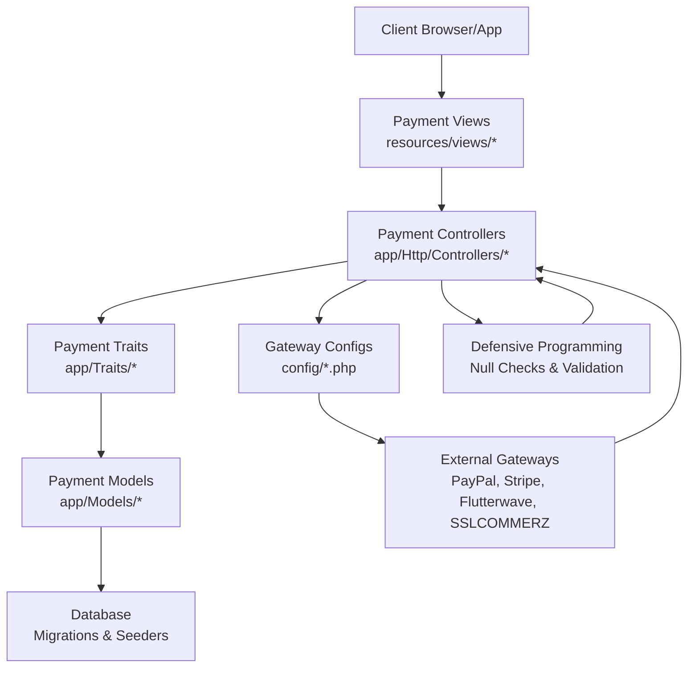
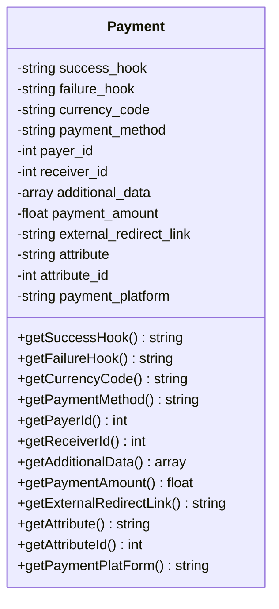
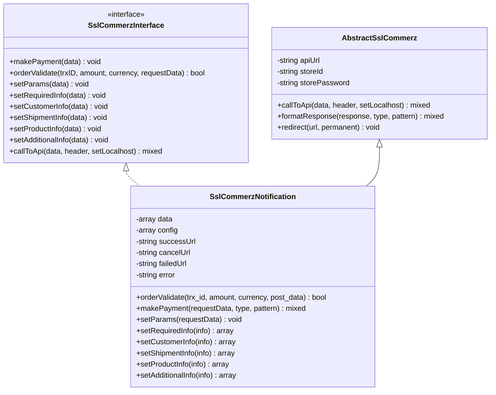
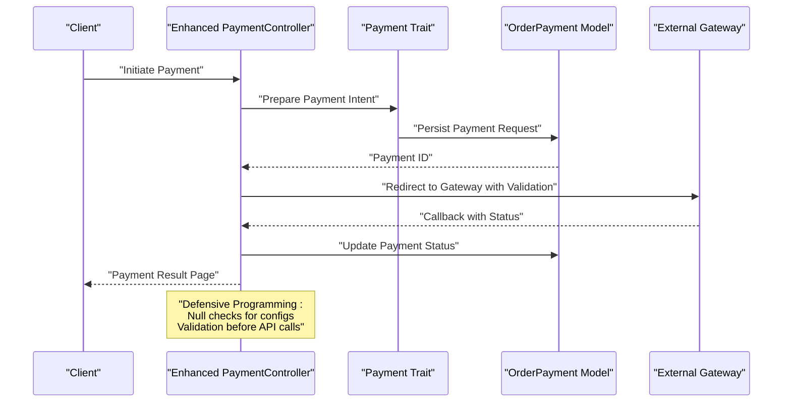
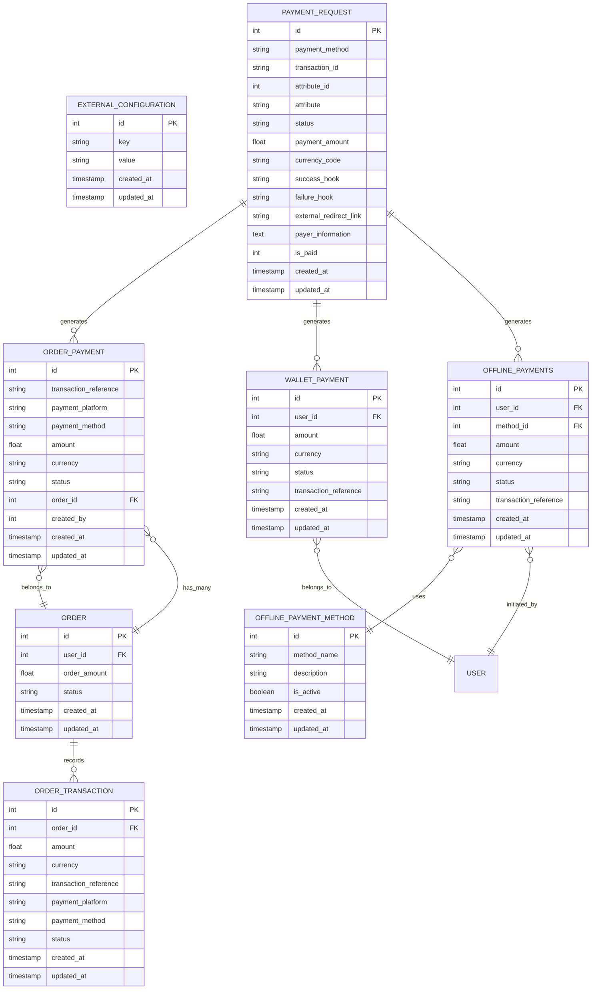
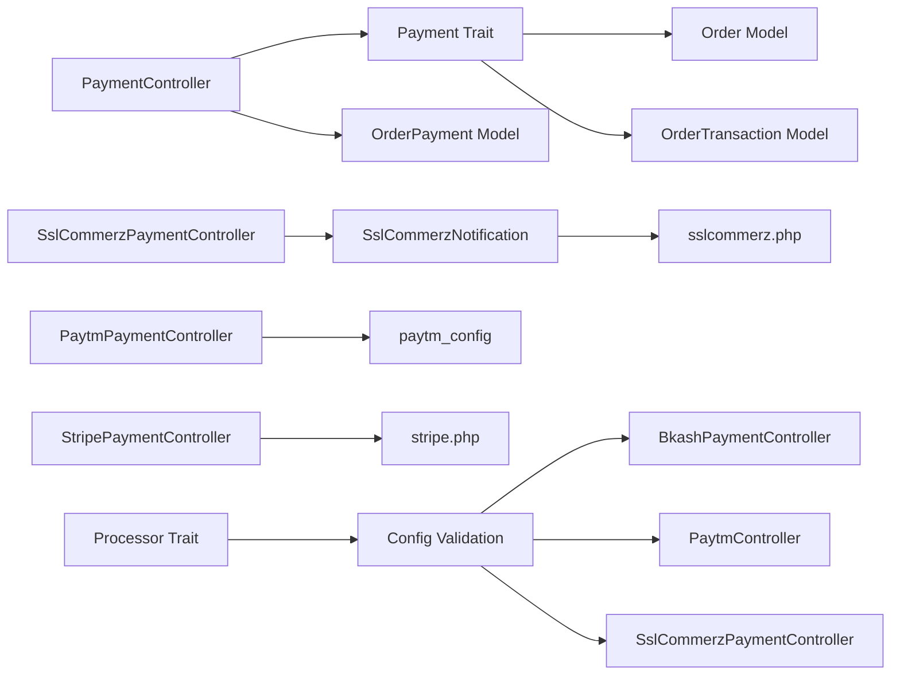
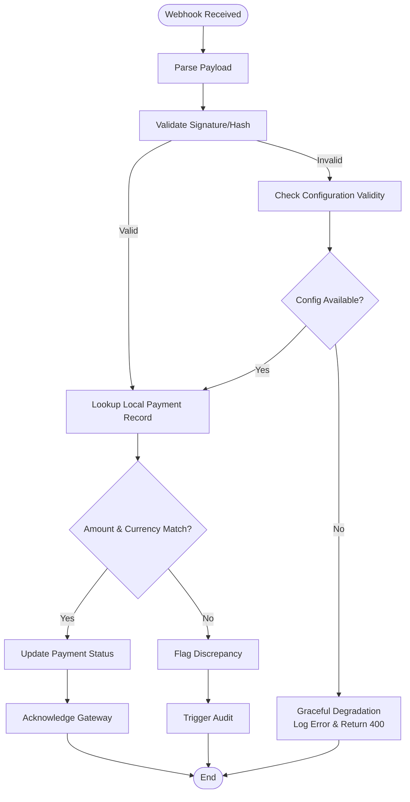
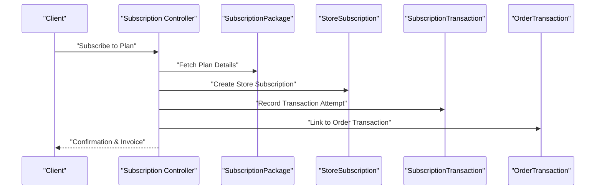
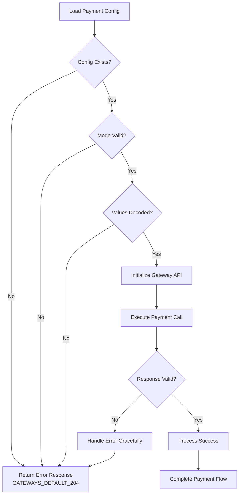

# Payment Processing System

<cite>
**Referenced Files in This Document**
- [Payment.php](file://app/Library/Payment.php)
- [Constant.php](file://app/Library/Constant.php)
- [Constants.php](file://app/Library/Constants.php)
- [SslCommerzInterface.php](file://app/Library/SslCommerz/SslCommerzInterface.php)
- [AbstractSslCommerz.php](file://app/Library/SslCommerz/AbstractSslCommerz.php)
- [SslCommerzNotification.php](file://app/Library/SslCommerz/SslCommerzNotification.php)
- [flutterwave.php](file://config/flutterwave.php)
- [paypal.php](file://config/paypal.php)
- [sslcommerz.php](file://config/sslcommerz.php)
- [PaymentController.php](file://app/Http/Controllers/PaymentController.php)
- [SslCommerzPaymentController.php](file://app/Http/Controllers/SslCommerzPaymentController.php)
- [PaypalPaymentController.php](file://app/Http/Controllers/PaypalPaymentController.php)
- [StripePaymentController.php](file://app/Http/Controllers/StripePaymentController.php)
- [BkashPaymentController.php](file://app/Http/Controllers/BkashPaymentController.php)
- [PaytmController.php](file://app/Http/Controllers/PaytmController.php)
- [OfflinePaymentMethod.php](file://app/Models/OfflinePaymentMethod.php)
- [OfflinePayments.php](file://app/Models/OfflinePayments.php)
- [OrderPayment.php](file://app/Models/OrderPayment.php)
- [WalletPayment.php](file://app/Models/WalletPayment.php)
- [Order.php](file://app/Models/Order.php)
- [OrderTransaction.php](file://app/Models/OrderTransaction.php)
- [WalletTransaction.php](file://app/Models/WalletTransaction.php)
- [Payment.php](file://app/Traits/Payment.php)
- [PaymentGatewayTrait.php](file://app/Traits/PaymentGatewayTrait.php)
- [Processor.php](file://app/Traits/Processor.php)
- [PlaceNewOrder.php](file://app/Traits/PlaceNewOrder.php)
- [OrderSecurityService.php](file://app/Services/OrderSecurityService.php)
- [Order.php](file://app/CentralLogics/order.php)
- [order.php](file://app/CentralLogics/order.php)
- [order_payments.sql](file://database/partial/payment_requests.sql)
- [2023_07_06_144944_create_order_payments_table.php](file://database/migrations/2023_07_06_144944_create_order_payments_table.php)
- [2023_07_09_143746_create_wallet_payments_table.php](file://database/migrations/2023_07_09_143746_create_wallet_payments_table.php)
- [2023_08_10_131937_create_offline_payment_methods_table.php](file://database/migrations/2023_08_10_131937_create_offline_payment_methods_table.php)
- [2023_08_10_132315_create_offline_payments_table.php](file://database/migrations/2023_08_10_132315_create_offline_payments_table.php)
- [2022_10_25_153214_add_payment_method_columns_to_zones_table.php](file://database/migrations/2022_10_25_153214_add_payment_method_columns_to_zones_table.php)
- [2024_05_13_102547_create_subscription_packages_table.php](file://database/migrations/2024_05_13_102547_create_subscription_packages_table.php)
- [2024_05_13_102612_create_store_subscriptions_table.php](file://database/migrations/2024_05_13_102612_create_store_subscriptions_table.php)
- [2024_05_13_104250_create_subscription_transactions_table.php](file://database/migrations/2024_05_13_104250_create_subscription_transactions_table.php)
- [2024_05_22_115717_create_subscription_billing_and_refund_histories_table.php](file://database/migrations/2024_05_22_115717_create_subscription_billing_and_refund_histories_table.php)
- [2024_05_26_120621_add_subscription_model_to_order_transaction_table.php](file://database/migrations/2024_05_26_120621_add_subscription_model_to_order_transaction_table.php)
- [payment-view-marcedo-pogo.blade.php](file://resources/views/payment-view-marcedo-pogo.blade.php)
- [paytm-payment-view.blade.php](file://resources/views/paytm-payment-view.blade.php)
- [payment-canceled.blade.php](file://resources/views/payment-canceled.blade.php)
- [payment-failed.blade.php](file://resources/views/payment-failed.blade.php)
- [subscription-invoice.blade.php](file://resources/views/subscription-invoice.blade.php)
- [payment-index.blade.php](file://resources/views/admin-views/business-settings/payment-index.blade.php)
- [payment_list.blade.php](file://resources/views/vendor-views/wallet/payment_list.blade.php)
- [UserOfflinePaymentMail.php](file://app/Mail/UserOfflinePaymentMail.php)
- [AdminOfflinePaymentMethodController.php](file://app/Http/Controllers/Admin/OfflinePaymentMethodController.php)
- [PaymentRequest.php](file://app/Models/PaymentRequest.php)
- [ExternalConfiguration.php](file://app/Models/ExternalConfiguration.php)
</cite>

## Update Summary
**Changes Made**
- Enhanced error handling documentation for payment controllers with defensive programming practices
- Added documentation for null checks in BkashPaymentController.php, PaytmController.php, and SslCommerzPaymentController.php
- Updated security considerations to reflect improved configuration validation
- Enhanced troubleshooting guidance for payment gateway configuration issues

## Table of Contents
1. [Introduction](#introduction)
2. [Project Structure](#project-structure)
3. [Core Components](#core-components)
4. [Architecture Overview](#architecture-overview)
5. [Detailed Component Analysis](#detailed-component-analysis)
6. [Dependency Analysis](#dependency-analysis)
7. [Performance Considerations](#performance-considerations)
8. [Security and Compliance](#security-and-compliance)
9. [International Payments and Currency Support](#international-payments-and-currency-support)
10. [Webhook Handling and Reconciliation](#webhook-handling-and-reconciliation)
11. [Subscription Billing and Recurring Payments](#subscription-billing-and-recurring-payments)
12. [Wallet System Integration](#wallet-system-integration)
13. [Defensive Programming and Error Handling](#defensive-programming-and-error-handling)
14. [Troubleshooting Guide](#troubleshooting-guide)
15. [Conclusion](#conclusion)

## Introduction
This document describes the comprehensive payment processing system supporting 15+ payment gateways including Stripe, PayPal, Flutterwave, Paystack, and local payment methods. It details the unified payment interface, gateway abstraction layer, transaction management, wallet integration, subscription billing, security measures, webhook handling, reconciliation, and international payment capabilities.

**Updated** Enhanced with defensive programming practices and improved error handling across payment controllers to prevent fatal errors when payment configurations are missing or invalid.

## Project Structure
The payment system is organized around:
- A unified payment model and constants for supported gateways and currencies
- An SSLCommerz gateway abstraction with interface and implementation
- Configuration files for external gateways (PayPal, Flutterwave, SSLCommerz)
- Controllers for payment initiation and callbacks with defensive programming
- Database models for orders, payments, wallets, and subscriptions
- Views for payment pages and admin settings
- Traits and central logics for payment orchestration

```mermaid
graph TB
subgraph "Payment Core"
PaymentModel["Payment Model<br/>app/Library/Payment.php"]
Constants["Gateway Constants<br/>app/Library/Constant.php"]
SRIDConst["SRID Constant<br/>app/Library/Constants.php"]
Processor["Processor Trait<br/>app/Traits/Processor.php"]
end
subgraph "SSLCommerz Abstraction"
Interface["SslCommerzInterface<br/>app/Library/SslCommerz/SslCommerzInterface.php"]
Abstract["AbstractSslCommerz<br/>app/Library/SslCommerz/AbstractSslCommerz.php"]
Impl["SslCommerzNotification<br/>app/Library/SslCommerz/SslCommerzNotification.php"]
end
subgraph "Gateway Configs"
PayPalCfg["PayPal Config<br/>config/paypal.php"]
FlutterCfg["Flutterwave Config<br/>config/flutterwave.php"]
SSLCfg["SSLCOMMERZ Config<br/>config/sslcommerz.php"]
ExtCfg["External Config<br/>app/Models/ExternalConfiguration.php"]
end
subgraph "Enhanced Controllers"
PaymentCtrl["PaymentController<br/>app/Http/Controllers/PaymentController.php"]
SslCtrl["SslCommerzPaymentController<br/>app/Http/Controllers/SslCommerzPaymentController.php"]
PayPalCtrl["PaypalPaymentController<br/>app/Http/Controllers/PaypalPaymentController.php"]
StripeCtrl["StripePaymentController<br/>app/Http/Controllers/StripePaymentController.php"]
BkashCtrl["BkashPaymentController<br/>app/Http/Controllers/BkashPaymentController.php"]
PaytmCtrl["PaytmController<br/>app/Http/Controllers/PaytmController.php"]
end
subgraph "Models"
OrderPayment["OrderPayment<br/>app/Models/OrderPayment.php"]
WalletPayment["WalletPayment<br/>app/Models/WalletPayment.php"]
OfflineMethod["OfflinePaymentMethod<br/>app/Models/OfflinePaymentMethod.php"]
OfflinePay["OfflinePayments<br/>app/Models/OfflinePayments.php"]
OrderModel["Order<br/>app/Models/Order.php"]
OrderTxn["OrderTransaction<br/>app/Models/OrderTransaction.php"]
WalletTxn["WalletTransaction<br/>app/Models/WalletTransaction.php"]
PaymentReq["PaymentRequest<br/>app/Models/PaymentRequest.php"]
end
PaymentModel --> Interface
Constants --> PaymentCtrl
Processor --> BkashCtrl
Processor --> PaytmCtrl
Processor --> SslCtrl
Abstract --> Impl
PayPalCfg --> PayPalCtrl
FlutterCfg --> PaymentCtrl
SSLCfg --> SslCtrl
ExtCfg --> PaymentReq
PaymentCtrl --> OrderPayment
SslCtrl --> OrderPayment
PayPalCtrl --> OrderPayment
StripeCtrl --> OrderPayment
BkashCtrl --> OrderPayment
PaytmCtrl --> OrderPayment
OrderPayment --> OrderModel
OrderPayment --> OrderTxn
WalletPayment --> WalletTxn
```

**Diagram sources**
- [Payment.php:1-96](file://app/Library/Payment.php#L1-L96)
- [Constant.php:1-847](file://app/Library/Constant.php#L1-L847)
- [Constants.php:1-3](file://app/Library/Constants.php#L1-L3)
- [Processor.php:55-65](file://app/Traits/Processor.php#L55-L65)
- [SslCommerzInterface.php:1-24](file://app/Library/SslCommerz/SslCommerzInterface.php#L1-L24)
- [AbstractSslCommerz.php:1-124](file://app/Library/SslCommerz/AbstractSslCommerz.php#L1-L124)
- [SslCommerzNotification.php:1-455](file://app/Library/SslCommerz/SslCommerzNotification.php#L1-L455)
- [paypal.php:1-14](file://config/paypal.php#L1-L14)
- [flutterwave.php:1-32](file://config/flutterwave.php#L1-L32)
- [sslcommerz.php:1-25](file://config/sslcommerz.php#L1-L25)
- [ExternalConfiguration.php:1-20](file://app/Models/ExternalConfiguration.php#L1-L20)
- [PaymentController.php](file://app/Http/Controllers/PaymentController.php)
- [SslCommerzPaymentController.php](file://app/Http/Controllers/SslCommerzPaymentController.php)
- [PaypalPaymentController.php](file://app/Http/Controllers/PaypalPaymentController.php)
- [StripePaymentController.php](file://app/Http/Controllers/StripePaymentController.php)
- [BkashPaymentController.php](file://app/Http/Controllers/BkashPaymentController.php)
- [PaytmController.php](file://app/Http/Controllers/PaytmController.php)
- [OrderPayment.php](file://app/Models/OrderPayment.php)
- [WalletPayment.php](file://app/Models/WalletPayment.php)
- [OfflinePaymentMethod.php](file://app/Models/OfflinePaymentMethod.php)
- [OfflinePayments.php](file://app/Models/OfflinePayments.php)
- [Order.php](file://app/Models/Order.php)
- [OrderTransaction.php](file://app/Models/OrderTransaction.php)
- [WalletTransaction.php](file://app/Models/WalletTransaction.php)
- [PaymentRequest.php](file://app/Models/PaymentRequest.php)

**Section sources**
- [Payment.php:1-96](file://app/Library/Payment.php#L1-L96)
- [Constant.php:1-847](file://app/Library/Constant.php#L1-L847)
- [Constants.php:1-3](file://app/Library/Constants.php#L1-L3)
- [Processor.php:55-65](file://app/Traits/Processor.php#L55-L65)
- [SslCommerzInterface.php:1-24](file://app/Library/SslCommerz/SslCommerzInterface.php#L1-L24)
- [AbstractSslCommerz.php:1-124](file://app/Library/SslCommerz/AbstractSslCommerz.php#L1-L124)
- [SslCommerzNotification.php:1-455](file://app/Library/SslCommerz/SslCommerzNotification.php#L1-L455)
- [paypal.php:1-14](file://config/paypal.php#L1-L14)
- [flutterwave.php:1-32](file://config/flutterwave.php#L1-L32)
- [sslcommerz.php:1-25](file://config/sslcommerz.php#L1-L25)

## Core Components
- Unified Payment Model: Encapsulates payment intent metadata including hooks, currency, method, platform, payer/receiver identifiers, amounts, and attributes.
- Gateway Constants: Comprehensive lists of supported payment gateways, currencies, countries, languages, and telephone codes.
- SSLCommerz Abstraction: Defines a gateway interface and provides an abstract implementation with shared API communication and response formatting utilities.
- Gateway Configuration: Environment-driven configurations for PayPal, Flutterwave, and SSLCOMMERZ.
- Enhanced Controllers: Gate-specific controllers for initiating payments and handling callbacks with defensive programming practices.
- Models: Persistent entities for order payments, wallet payments, offline payments, and related transactions.

**Section sources**
- [Payment.php:1-96](file://app/Library/Payment.php#L1-L96)
- [Constant.php:1-847](file://app/Library/Constant.php#L1-L847)
- [SslCommerzInterface.php:1-24](file://app/Library/SslCommerz/SslCommerzInterface.php#L1-L24)
- [AbstractSslCommerz.php:1-124](file://app/Library/SslCommerz/AbstractSslCommerz.php#L1-L124)
- [paypal.php:1-14](file://config/paypal.php#L1-L14)
- [flutterwave.php:1-32](file://config/flutterwave.php#L1-L32)
- [sslcommerz.php:1-25](file://config/sslcommerz.php#L1-L25)

## Architecture Overview
The system uses a layered architecture:
- Presentation Layer: Payment views and admin settings
- Application Layer: Controllers orchestrating payment requests and callbacks with defensive error handling
- Domain Layer: Payment traits and central logics for business operations
- Infrastructure Layer: Gateway configurations and SSLCommerz abstraction
- Persistence Layer: Eloquent models and migrations for payments, wallets, and subscriptions

**Diagram sources**
- [payment-view-marcedo-pogo.blade.php](file://resources/views/payment-view-marcedo-pogo.blade.php)
- [payment-index.blade.php](file://resources/views/admin-views/business-settings/payment-index.blade.php)
- [PaymentController.php](file://app/Http/Controllers/PaymentController.php)
- [Payment.php](file://app/Traits/Payment.php)
- [OrderPayment.php](file://app/Models/OrderPayment.php)
- [Processor.php:55-65](file://app/Traits/Processor.php#L55-L65)
- [paypal.php:1-14](file://config/paypal.php#L1-L14)
- [flutterwave.php:1-32](file://config/flutterwave.php#L1-L32)
- [sslcommerz.php:1-25](file://config/sslcommerz.php#L1-L25)

## Detailed Component Analysis

### Unified Payment Interface
The Payment model encapsulates payment intent parameters and exposes getters for downstream processing.

**Diagram sources**
- [Payment.php:1-96](file://app/Library/Payment.php#L1-L96)

**Section sources**
- [Payment.php:1-96](file://app/Library/Payment.php#L1-L96)

### Gateway Abstraction Layer (SSLCOMMERZ)
The SSLCommerz abstraction defines a contract and provides shared functionality for API communication, response formatting, and redirection.

**Diagram sources**
- [SslCommerzInterface.php:1-24](file://app/Library/SslCommerz/SslCommerzInterface.php#L1-L24)
- [AbstractSslCommerz.php:1-124](file://app/Library/SslCommerz/AbstractSslCommerz.php#L1-L124)
- [SslCommerzNotification.php:1-455](file://app/Library/SslCommerz/SslCommerzNotification.php#L1-L455)

**Section sources**
- [SslCommerzInterface.php:1-24](file://app/Library/SslCommerz/SslCommerzInterface.php#L1-L24)
- [AbstractSslCommerz.php:1-124](file://app/Library/SslCommerz/AbstractSslCommerz.php#L1-L124)
- [SslCommerzNotification.php:1-455](file://app/Library/SslCommerz/SslCommerzNotification.php#L1-L455)

### Enhanced Payment Controllers and Workflows
Controllers coordinate payment initiation and callback handling for different gateways with defensive programming practices.

**Diagram sources**
- [PaymentController.php](file://app/Http/Controllers/PaymentController.php)
- [Payment.php](file://app/Traits/Payment.php)
- [OrderPayment.php](file://app/Models/OrderPayment.php)

**Section sources**
- [PaymentController.php](file://app/Http/Controllers/PaymentController.php)
- [Payment.php](file://app/Traits/Payment.php)
- [OrderPayment.php](file://app/Models/OrderPayment.php)

### Database Schema and Models
Payment-related entities and migrations define transaction persistence and relationships.

**Diagram sources**
- [2023_07_06_144944_create_order_payments_table.php](file://database/migrations/2023_07_06_144944_create_order_payments_table.php)
- [2023_07_09_143746_create_wallet_payments_table.php](file://database/migrations/2023_07_09_143746_create_wallet_payments_table.php)
- [2023_08_10_131937_create_offline_payment_methods_table.php](file://database/migrations/2023_08_10_131937_create_offline_payment_methods_table.php)
- [2023_08_10_132315_create_offline_payments_table.php](file://database/migrations/2023_08_10_132315_create_offline_payments_table.php)
- [ExternalConfiguration.php:1-20](file://app/Models/ExternalConfiguration.php#L1-L20)
- [OrderPayment.php](file://app/Models/OrderPayment.php)
- [WalletPayment.php](file://app/Models/WalletPayment.php)
- [OfflinePaymentMethod.php](file://app/Models/OfflinePaymentMethod.php)
- [OfflinePayments.php](file://app/Models/OfflinePayments.php)
- [Order.php](file://app/Models/Order.php)
- [OrderTransaction.php](file://app/Models/OrderTransaction.php)
- [PaymentRequest.php](file://app/Models/PaymentRequest.php)

**Section sources**
- [2023_07_06_144944_create_order_payments_table.php](file://database/migrations/2023_07_06_144944_create_order_payments_table.php)
- [2023_07_09_143746_create_wallet_payments_table.php](file://database/migrations/2023_07_09_143746_create_wallet_payments_table.php)
- [2023_08_10_131937_create_offline_payment_methods_table.php](file://database/migrations/2023_08_10_131937_create_offline_payment_methods_table.php)
- [2023_08_10_132315_create_offline_payments_table.php](file://database/migrations/2023_08_10_132315_create_offline_payments_table.php)
- [ExternalConfiguration.php:1-20](file://app/Models/ExternalConfiguration.php#L1-L20)
- [OrderPayment.php](file://app/Models/OrderPayment.php)
- [WalletPayment.php](file://app/Models/WalletPayment.php)
- [OfflinePaymentMethod.php](file://app/Models/OfflinePaymentMethod.php)
- [OfflinePayments.php](file://app/Models/OfflinePayments.php)
- [Order.php](file://app/Models/Order.php)
- [OrderTransaction.php](file://app/Models/OrderTransaction.php)
- [PaymentRequest.php](file://app/Models/PaymentRequest.php)

## Dependency Analysis
- Controllers depend on traits for payment orchestration and models for persistence.
- SSLCommerz implementation depends on configuration and uses cURL for API calls.
- Gateway configurations are environment-driven and injected via controller constructors with defensive validation.
- Models maintain referential integrity with orders and users.
- Enhanced defensive programming ensures null-safe configuration access across all payment controllers.

**Diagram sources**
- [PaymentController.php](file://app/Http/Controllers/PaymentController.php)
- [Payment.php](file://app/Traits/Payment.php)
- [OrderPayment.php](file://app/Models/OrderPayment.php)
- [SslCommerzPaymentController.php](file://app/Http/Controllers/SslCommerzPaymentController.php)
- [SslCommerzNotification.php:1-455](file://app/Library/SslCommerz/SslCommerzNotification.php#L1-L455)
- [sslcommerz.php:1-25](file://config/sslcommerz.php#L1-L25)
- [paypal.php:1-14](file://config/paypal.php#L1-L14)
- [Order.php](file://app/Models/Order.php)
- [OrderTransaction.php](file://app/Models/OrderTransaction.php)
- [Processor.php:55-65](file://app/Traits/Processor.php#L55-L65)

**Section sources**
- [PaymentController.php](file://app/Http/Controllers/PaymentController.php)
- [SslCommerzPaymentController.php](file://app/Http/Controllers/SslCommerzPaymentController.php)
- [PaypalPaymentController.php](file://app/Http/Controllers/PaypalPaymentController.php)
- [StripePaymentController.php](file://app/Http/Controllers/StripePaymentController.php)
- [SslCommerzNotification.php:1-455](file://app/Library/SslCommerz/SslCommerzNotification.php#L1-L455)
- [sslcommerz.php:1-25](file://config/sslcommerz.php#L1-L25)
- [paypal.php:1-14](file://config/paypal.php#L1-L14)
- [Processor.php:55-65](file://app/Traits/Processor.php#L55-L65)

## Performance Considerations
- Minimize synchronous network calls in payment callbacks; batch updates when possible.
- Cache frequently accessed gateway configurations and currency exchange rates.
- Use database transactions for payment updates to ensure atomicity.
- Implement retry policies with exponential backoff for external API calls.
- Optimize cURL timeouts and SSL verification settings for production environments.
- **Updated** Enhanced defensive programming reduces unnecessary API calls when configurations are invalid.

## Security and Compliance
- PCI DSS: Avoid storing sensitive cardholder data; rely on gateway tokenization and 3D Secure where supported.
- Data Protection: Encrypt stored sensitive data and enforce HTTPS for all payment endpoints.
- Authentication: Use signed webhooks with secret hashes for PayPal and Flutterwave; validate SSLCOMMERZ signatures.
- Fraud Prevention: Integrate risk checks, address verification, AVS/CVV validation, and velocity limits.
- Logging: Log payment events securely without exposing sensitive data; monitor anomalies.
- **Updated** Enhanced configuration validation prevents unauthorized access attempts when payment credentials are missing or invalid.

**Section sources**
- [flutterwave.php:1-32](file://config/flutterwave.php#L1-L32)
- [paypal.php:1-14](file://config/paypal.php#L1-L14)
- [SslCommerzNotification.php:153-191](file://app/Library/SslCommerz/SslCommerzNotification.php#L153-L191)

## International Payments and Currency Support
- Supported Currencies: Over 190 currencies are defined in gateway constants.
- Multi-Currency Transactions: Orders and payments support currency fields; gateway responses may convert amounts.
- Country and Language Codes: Extensive country and language lists enable localized experiences.
- Exchange Rates: Implement a currency conversion service and store base currency conversions for reconciliation.

**Section sources**
- [Constant.php:40-198](file://app/Library/Constant.php#L40-L198)
- [Constant.php:200-445](file://app/Library/Constant.php#L200-L445)
- [Constant.php:447-631](file://app/Library/Constant.php#L447-L631)

## Webhook Handling and Reconciliation
- SSLCOMMERZ IPN/Webhook: Validate hash signatures, check transaction status, and reconcile amounts.
- PayPal Webhooks: Verify webhook signatures using client secrets and update payment records accordingly.
- Flutterwave Webhooks: Confirm event authenticity using secret hash and synchronize payment statuses.
- Reconciliation: Compare gateway-provided transaction references with local records; handle discrepancies with audit trails.
- **Updated** Enhanced error handling ensures graceful degradation when webhook validation fails due to missing configurations.

**Diagram sources**
- [SslCommerzNotification.php:43-150](file://app/Library/SslCommerz/SslCommerzNotification.php#L43-L150)
- [flutterwave.php:1-32](file://config/flutterwave.php#L1-L32)
- [paypal.php:1-14](file://config/paypal.php#L1-L14)

**Section sources**
- [SslCommerzNotification.php:43-150](file://app/Library/SslCommerz/SslCommerzNotification.php#L43-L150)
- [flutterwave.php:1-32](file://config/flutterwave.php#L1-L32)
- [paypal.php:1-14](file://config/paypal.php#L1-L14)

## Subscription Billing and Recurring Payments
- Subscription Packages and Store Subscriptions: Define plans and store associations.
- Subscription Transactions: Track payment attempts, successes, failures, and status changes.
- Billing Histories: Maintain refund and billing histories for audit and reporting.
- Subscription Model Integration: Link subscription transactions to order transactions for unified billing.

**Diagram sources**
- [2024_05_13_102547_create_subscription_packages_table.php](file://database/migrations/2024_05_13_102547_create_subscription_packages_table.php)
- [2024_05_13_102612_create_store_subscriptions_table.php](file://database/migrations/2024_05_13_102612_create_store_subscriptions_table.php)
- [2024_05_13_104250_create_subscription_transactions_table.php](file://database/migrations/2024_05_13_104250_create_subscription_transactions_table.php)
- [2024_05_22_115717_create_subscription_billing_and_refund_histories_table.php](file://database/migrations/2024_05_22_115717_create_subscription_billing_and_refund_histories_table.php)
- [2024_05_26_120621_add_subscription_model_to_order_transaction_table.php](file://database/migrations/2024_05_26_120621_add_subscription_model_to_order_transaction_table.php)
- [subscription-invoice.blade.php](file://resources/views/subscription-invoice.blade.php)

**Section sources**
- [2024_05_13_102547_create_subscription_packages_table.php](file://database/migrations/2024_05_13_102547_create_subscription_packages_table.php)
- [2024_05_13_102612_create_store_subscriptions_table.php](file://database/migrations/2024_05_13_102612_create_store_subscriptions_table.php)
- [2024_05_13_104250_create_subscription_transactions_table.php](file://database/migrations/2024_05_13_104250_create_subscription_transactions_table.php)
- [2024_05_22_115717_create_subscription_billing_and_refund_histories_table.php](file://database/migrations/2024_05_22_115717_create_subscription_billing_and_refund_histories_table.php)
- [2024_05_26_120621_add_subscription_model_to_order_transaction_table.php](file://database/migrations/2024_05_26_120621_add_subscription_model_to_order_transaction_table.php)
- [subscription-invoice.blade.php](file://resources/views/subscription-invoice.blade.php)

## Wallet System Integration
- Wallet Payments: Dedicated entity for user wallet fund additions and deductions.
- Wallet Transactions: Separate transaction records for auditability and reporting.
- Payment Views: Wallet payment list and payment initiation views.
- Integration: Wallet payments can be combined with order payments for split funding.

**Section sources**
- [2023_07_09_143746_create_wallet_payments_table.php](file://database/migrations/2023_07_09_143746_create_wallet_payments_table.php)
- [WalletPayment.php](file://app/Models/WalletPayment.php)
- [WalletTransaction.php](file://app/Models/WalletTransaction.php)
- [payment_list.blade.php](file://resources/views/vendor-views/wallet/payment_list.blade.php)

## Defensive Programming and Error Handling

### Enhanced Configuration Validation
The payment controllers now implement comprehensive defensive programming practices to prevent fatal errors when payment configurations are missing or invalid.

**Updated** Three key controllers demonstrate enhanced error handling patterns:

#### BkashPaymentController Enhancements
- Null checks for configuration values before API initialization
- Safe JSON decoding with fallback handling
- Graceful degradation when payment credentials are unavailable

#### PaytmController Enhancements  
- Configuration validation with environment variable fallback
- Safe array access with null coalescing operators
- Robust checksum verification with error boundary checking

#### SslCommerzPaymentController Enhancements
- Pre-validation of gateway credentials before API calls
- Safe cURL execution with error code checking
- Graceful response handling for invalid configurations

**Diagram sources**
- [BkashPaymentController.php:28-46](file://app/Http/Controllers/BkashPaymentController.php#L28-L46)
- [PaytmController.php:30-61](file://app/Http/Controllers/PaytmController.php#L30-L61)
- [SslCommerzPaymentController.php:30-53](file://app/Http/Controllers/SslCommerzPaymentController.php#L30-L53)

### Processor Trait Configuration Management
The Processor trait provides centralized configuration loading with built-in error handling:

- **payment_config method**: Returns null-safe configuration objects
- **Database exception handling**: Graceful fallback to empty settings on database errors
- **Consistent return types**: Ensures controllers always receive predictable configuration objects

**Section sources**
- [BkashPaymentController.php:28-46](file://app/Http/Controllers/BkashPaymentController.php#L28-L46)
- [PaytmController.php:30-61](file://app/Http/Controllers/PaytmController.php#L30-L61)
- [SslCommerzPaymentController.php:30-53](file://app/Http/Controllers/SslCommerzPaymentController.php#L30-L53)
- [Processor.php:55-65](file://app/Traits/Processor.php#L55-L65)

## Troubleshooting Guide
- SSLCOMMERZ Validation Failures: Check hash verification and transaction domain settings; ensure store credentials match configuration.
- PayPal Webhook Issues: Verify client secret and mode settings; confirm webhook URLs are reachable and secure.
- Flutterwave Signature Errors: Confirm secret hash matches environment configuration.
- Offline Payments: Validate method activation and user notifications via email templates.
- Order Payment Discrepancies: Cross-check transaction references and amounts; investigate partial payments and refunds.
- **Updated** Configuration Issues: Verify payment gateway credentials are properly loaded; check database connectivity for configuration retrieval.
- **Updated** Controller Errors: Review enhanced error responses for GATEWAYS_DEFAULT_204 indicating missing payment requests or invalid payment IDs.
- **Updated** Gateway Connectivity: Monitor cURL execution results and HTTP status codes for external API failures.

**Section sources**
- [SslCommerzNotification.php:43-150](file://app/Library/SslCommerz/SslCommerzNotification.php#L43-L150)
- [flutterwave.php:1-32](file://config/flutterwave.php#L1-L32)
- [paypal.php:1-14](file://config/paypal.php#L1-L14)
- [OfflinePaymentMethod.php](file://app/Models/OfflinePaymentMethod.php)
- [UserOfflinePaymentMail.php](file://app/Mail/UserOfflinePaymentMail.php)
- [BkashPaymentController.php:92-95](file://app/Http/Controllers/BkashPaymentController.php#L92-L95)
- [PaytmController.php:193-196](file://app/Http/Controllers/PaytmController.php#L193-L196)
- [SslCommerzPaymentController.php:65-68](file://app/Http/Controllers/SslCommerzPaymentController.php#L65-L68)

## Conclusion
The payment processing system provides a robust, extensible foundation for multi-gateway payments, international support, subscriptions, and wallet integration. By leveraging the SSLCommerz abstraction, environment-driven configurations, and well-defined models, the system supports secure, compliant, and scalable payment operations across diverse markets.

**Updated** The enhanced defensive programming practices ensure system stability even when payment configurations are temporarily unavailable or invalid, preventing fatal errors and providing graceful degradation with appropriate error responses. This improvement significantly enhances the reliability and fault tolerance of the payment processing infrastructure.