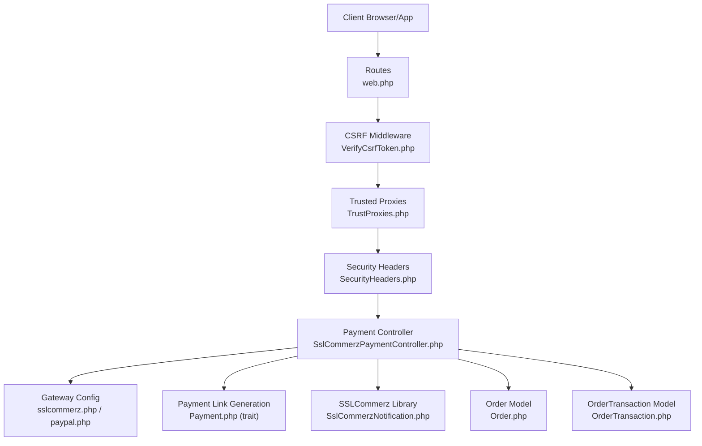
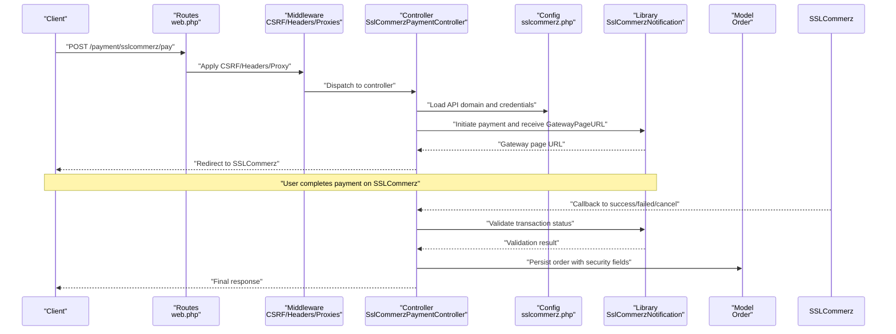
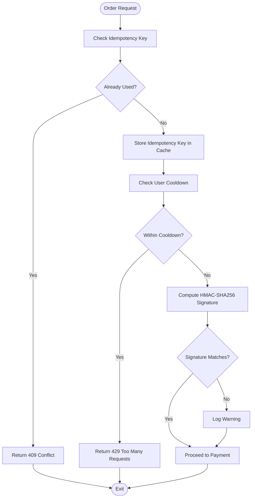
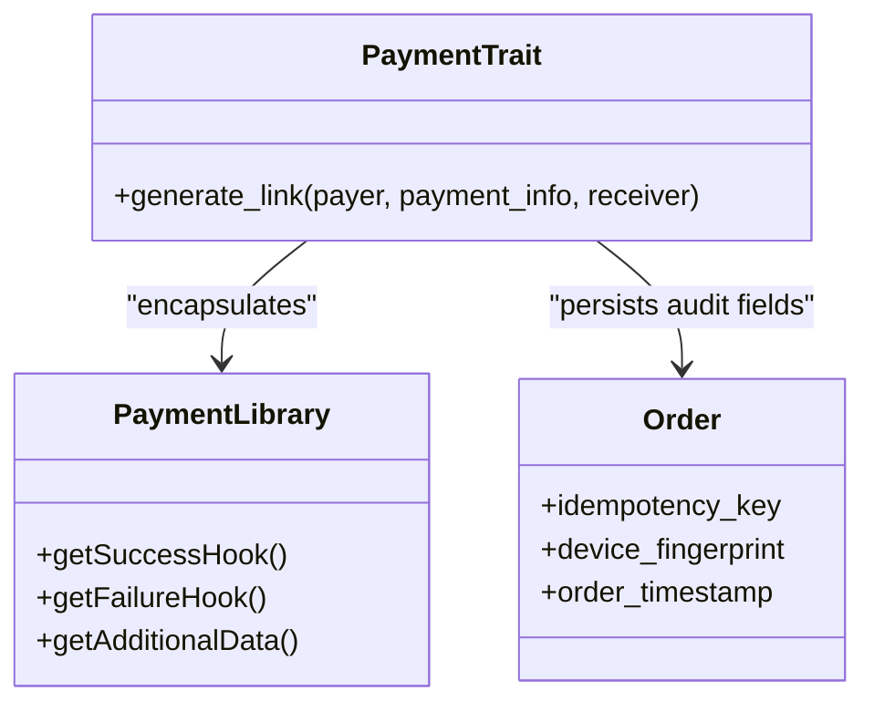
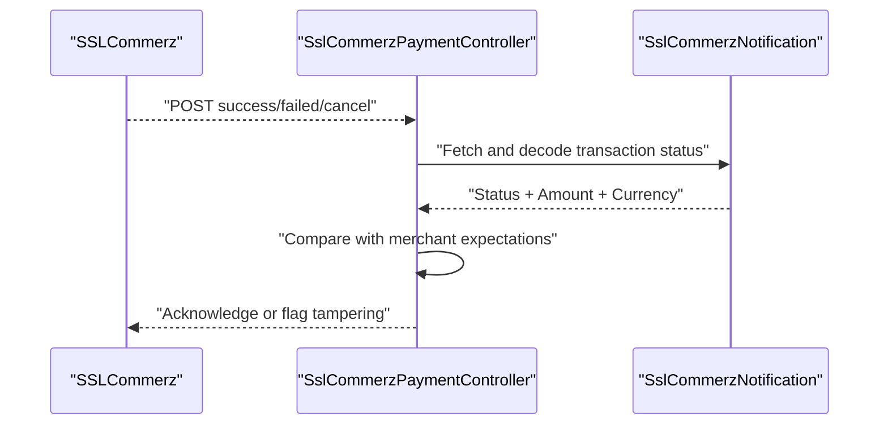
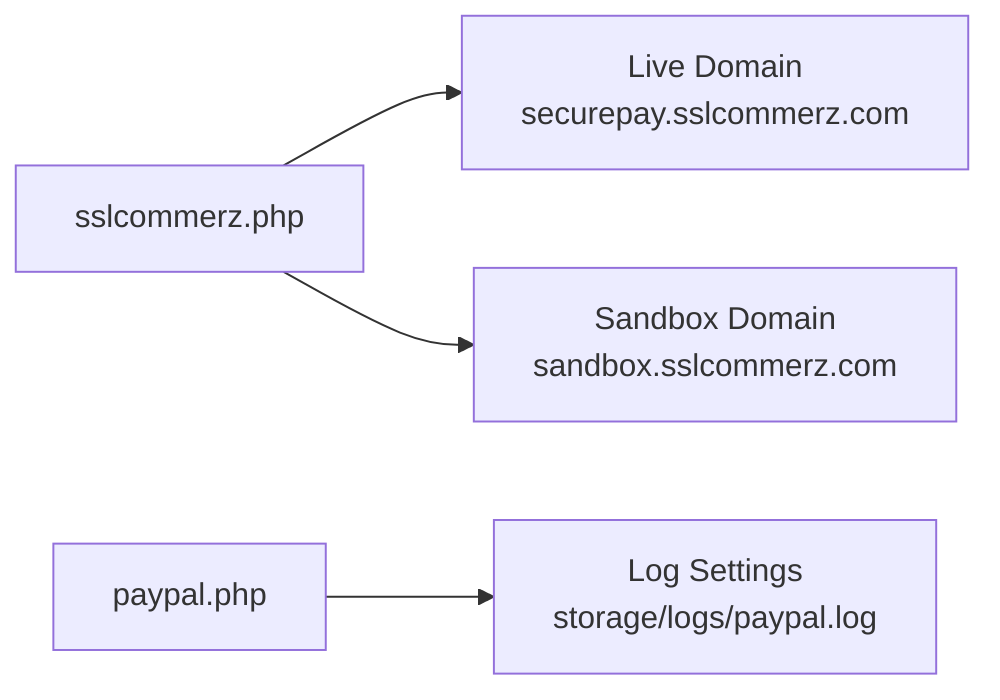
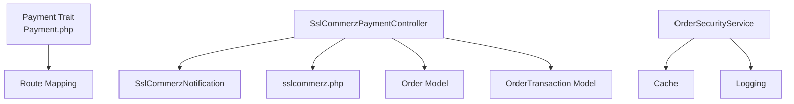

# Payment Security

<cite>
**Referenced Files in This Document**
- [OrderSecurityService.php](file://app/Services/OrderSecurityService.php)
- [web.php](file://routes/web.php)
- [VerifyCsrfToken.php](file://app/Http/Middleware/VerifyCsrfToken.php)
- [SecurityHeaders.php](file://app/Http/Middleware/SecurityHeaders.php)
- [.htaccess](file://.htaccess)
- [TrustProxies.php](file://app/Http/Middleware/TrustProxies.php)
- [sslcommerz.php](file://config/sslcommerz.php)
- [paypal.php](file://config/paypal.php)
- [SslCommerzNotification.php](file://app/Library/SslCommerz/SslCommerzNotification.php)
- [SslCommerzPaymentController.php](file://app/Http/Controllers/SslCommerzPaymentController.php)
- [Payment.php](file://app/Library/Payment.php)
- [PaymentGatewayTrait.php](file://app/Traits/PaymentGatewayTrait.php)
- [Payment.php](file://app/Traits/Payment.php)
- [Order.php](file://app/Models/Order.php)
- [OrderTransaction.php](file://app/Models/OrderTransaction.php)
- [composer.lock](file://composer.lock)
</cite>

## Table of Contents
1. [Introduction](#introduction)
2. [Project Structure](#project-structure)
3. [Core Components](#core-components)
4. [Architecture Overview](#architecture-overview)
5. [Detailed Component Analysis](#detailed-component-analysis)
6. [Dependency Analysis](#dependency-analysis)
7. [Performance Considerations](#performance-considerations)
8. [Troubleshooting Guide](#troubleshooting-guide)
9. [Conclusion](#conclusion)

## Introduction
This document details the payment security measures implemented in the application, focusing on PCI DSS compliance readiness, data encryption, fraud prevention, secure payment tokenization, sensitive data handling, secure communication protocols, SSL/TLS configuration, certificate management, secure API endpoints, security headers, CSRF protection, input validation, replay attack prevention, transaction authorization verification, and security audit requirements. It synthesizes the current implementation and highlights areas requiring attention to meet robust security standards.

## Project Structure
The payment security implementation spans routing, middleware, configuration, controllers, traits, libraries, and models:
- Routing exposes payment endpoints and disables CSRF for third-party callbacks.
- Middleware applies security headers and trusts reverse proxies.
- Configuration defines gateway endpoints and credentials.
- Controllers orchestrate payment initiation and callback handling.
- Traits and libraries encapsulate payment generation and supported currencies.
- Models persist order and transaction data with audit-relevant fields.

**Diagram sources**
- [web.php:74-96](file://routes/web.php#L74-L96)
- [VerifyCsrfToken.php:1-19](file://app/Http/Middleware/VerifyCsrfToken.php#L1-L19)
- [TrustProxies.php:1-24](file://app/Http/Middleware/TrustProxies.php#L1-L24)
- [SecurityHeaders.php:1-24](file://app/Http/Middleware/SecurityHeaders.php#L1-L24)
- [SslCommerzPaymentController.php:54-109](file://app/Http/Controllers/SslCommerzPaymentController.php#L54-L109)
- [sslcommerz.php:1-25](file://config/sslcommerz.php#L1-L25)
- [paypal.php:1-14](file://config/paypal.php#L1-L14)
- [Payment.php:10-84](file://app/Traits/Payment.php#L10-L84)
- [SslCommerzNotification.php:74-131](file://app/Library/SslCommerz/SslCommerzNotification.php#L74-L131)
- [Order.php:1-358](file://app/Models/Order.php#L1-L358)
- [OrderTransaction.php:1-47](file://app/Models/OrderTransaction.php#L1-L47)

**Section sources**
- [web.php:74-96](file://routes/web.php#L74-L96)
- [VerifyCsrfToken.php:1-19](file://app/Http/Middleware/VerifyCsrfToken.php#L1-L19)
- [TrustProxies.php:1-24](file://app/Http/Middleware/TrustProxies.php#L1-L24)
- [SecurityHeaders.php:1-24](file://app/Http/Middleware/SecurityHeaders.php#L1-L24)
- [sslcommerz.php:1-25](file://config/sslcommerz.php#L1-L25)
- [paypal.php:1-14](file://config/paypal.php#L1-L14)
- [SslCommerzPaymentController.php:54-109](file://app/Http/Controllers/SslCommerzPaymentController.php#L54-L109)
- [Payment.php:10-84](file://app/Traits/Payment.php#L10-L84)
- [SslCommerzNotification.php:74-131](file://app/Library/SslCommerz/SslCommerzNotification.php#L74-L131)
- [Order.php:1-358](file://app/Models/Order.php#L1-L358)
- [OrderTransaction.php:1-47](file://app/Models/OrderTransaction.php#L1-L47)

## Core Components
- OrderSecurityService: Implements idempotency checks, rate limiting via cooldown, HMAC-SHA256 signature verification, and stores security fields on orders for audit.
- Payment trait: Generates payment links, validates amounts and additional data, persists payment requests, and routes to gateway-specific endpoints.
- SSLCommerz library: Handles gateway responses, decodes JSON, extracts transaction and issuer information, and validates transaction authenticity against merchant data.
- Gateway configurations: Define API domains, endpoints, and credentials for SSLCommerz and PayPal.
- Middleware stack: Applies security headers, trusts proxies, and exempts payment callbacks from CSRF verification.
- Models: Persist order metadata and transaction records with audit-relevant fields.

**Section sources**
- [OrderSecurityService.php:1-136](file://app/Services/OrderSecurityService.php#L1-L136)
- [Payment.php:10-84](file://app/Traits/Payment.php#L10-L84)
- [SslCommerzNotification.php:74-131](file://app/Library/SslCommerz/SslCommerzNotification.php#L74-L131)
- [sslcommerz.php:1-25](file://config/sslcommerz.php#L1-L25)
- [paypal.php:1-14](file://config/paypal.php#L1-L14)
- [VerifyCsrfToken.php:1-19](file://app/Http/Middleware/VerifyCsrfToken.php#L1-L19)
- [SecurityHeaders.php:1-24](file://app/Http/Middleware/SecurityHeaders.php#L1-L24)
- [Order.php:1-358](file://app/Models/Order.php#L1-L358)
- [OrderTransaction.php:1-47](file://app/Models/OrderTransaction.php#L1-L47)

## Architecture Overview
The payment flow integrates client requests, routing, middleware, controller orchestration, gateway APIs, and persistence. Third-party callbacks bypass CSRF protection but are handled securely via signature validation and transaction verification.

**Diagram sources**
- [web.php:74-96](file://routes/web.php#L74-L96)
- [VerifyCsrfToken.php:1-19](file://app/Http/Middleware/VerifyCsrfToken.php#L1-L19)
- [SecurityHeaders.php:1-24](file://app/Http/Middleware/SecurityHeaders.php#L1-L24)
- [TrustProxies.php:1-24](file://app/Http/Middleware/TrustProxies.php#L1-L24)
- [SslCommerzPaymentController.php:54-109](file://app/Http/Controllers/SslCommerzPaymentController.php#L54-L109)
- [sslcommerz.php:1-25](file://config/sslcommerz.php#L1-L25)
- [SslCommerzNotification.php:74-131](file://app/Library/SslCommerz/SslCommerzNotification.php#L74-L131)
- [Order.php:1-358](file://app/Models/Order.php#L1-L358)

## Detailed Component Analysis

### Idempotency, Replay Attack Prevention, and Signature Verification
- Idempotency: Uses a cache key derived from the idempotency_key to prevent duplicate submissions within a TTL window.
- Cooldown: Enforces a per-user cooldown to mitigate rapid successive orders.
- Signature verification: Computes HMAC-SHA256 over a composed payload and compares with the received signature; logs discrepancies without blocking during rollout.

**Diagram sources**
- [OrderSecurityService.php:22-125](file://app/Services/OrderSecurityService.php#L22-L125)

**Section sources**
- [OrderSecurityService.php:14-125](file://app/Services/OrderSecurityService.php#L14-L125)

### Secure Payment Tokenization and Sensitive Data Handling
- Payment link generation: Persists payer/receiver information and additional data as JSON in PaymentRequest, avoiding raw card data in application logs.
- Gateway redirection: Sends minimal required fields to SSLCommerz; sensitive data remains with the gateway.
- Audit fields: Stores idempotency_key, device_fingerprint, and order_timestamp on the Order model for later audit review.

**Diagram sources**
- [Payment.php:10-84](file://app/Traits/Payment.php#L10-L84)
- [Payment.php:1-96](file://app/Library/Payment.php#L1-L96)
- [Order.php:130-136](file://app/Models/Order.php#L130-L136)

**Section sources**
- [Payment.php:10-84](file://app/Traits/Payment.php#L10-L84)
- [Payment.php:1-96](file://app/Library/Payment.php#L1-L96)
- [Order.php:130-136](file://app/Models/Order.php#L130-L136)

### Transaction Authorization Verification and Validation
- SSLCommerz callback handling: Validates transaction status and currency/amount matching against merchant expectations.
- Gateway response decoding: Parses JSON response and extracts transaction and issuer attributes.

**Diagram sources**
- [web.php:74-96](file://routes/web.php#L74-L96)
- [SslCommerzNotification.php:74-131](file://app/Library/SslCommerz/SslCommerzNotification.php#L74-L131)
- [SslCommerzPaymentController.php:54-109](file://app/Http/Controllers/SslCommerzPaymentController.php#L54-L109)

**Section sources**
- [SslCommerzNotification.php:74-131](file://app/Library/SslCommerz/SslCommerzNotification.php#L74-L131)
- [web.php:74-96](file://routes/web.php#L74-L96)
- [SslCommerzPaymentController.php:54-109](file://app/Http/Controllers/SslCommerzPaymentController.php#L54-L109)

### Secure Communication Protocols and SSL/TLS Configuration
- Gateway endpoints: SSLCommerz configuration specifies live and sandbox URLs for production-grade HTTPS.
- Logging: PayPal configuration sets log levels and file paths for error tracking.
- Environment variables: API domain and credentials are loaded from environment variables.

**Diagram sources**
- [sslcommerz.php:1-25](file://config/sslcommerz.php#L1-L25)
- [paypal.php:1-14](file://config/paypal.php#L1-L14)

**Section sources**
- [sslcommerz.php:1-25](file://config/sslcommerz.php#L1-L25)
- [paypal.php:1-14](file://config/paypal.php#L1-L14)

### Certificate Management
- The repository does not expose explicit certificate management logic. Ensure that:
  - API endpoints are accessed over HTTPS only.
  - Environment variables for API credentials are managed securely.
  - Reverse proxies and load balancers terminate TLS and forward encrypted traffic.

[No sources needed since this section provides general guidance]

### Secure API Endpoints
- Payment endpoints: Exposed under /payment/* with exemptions from CSRF verification for callbacks.
- Proxies: Trusted proxies are configured to honor forwarded headers for protocol and host resolution.

**Section sources**
- [web.php:74-96](file://routes/web.php#L74-L96)
- [VerifyCsrfToken.php:1-19](file://app/Http/Middleware/VerifyCsrfToken.php#L1-L19)
- [TrustProxies.php:1-24](file://app/Http/Middleware/TrustProxies.php#L1-L24)

### Security Headers Implementation
- Applies X-Frame-Options, X-Content-Type-Options, X-XSS-Protection, Referrer-Policy, Permissions-Policy, and removes server fingerprinting headers.

**Section sources**
- [SecurityHeaders.php:1-24](file://app/Http/Middleware/SecurityHeaders.php#L1-L24)
- [.htaccess:1-30](file://.htaccess#L1-L30)

### CSRF Protection
- CSRF verification is disabled for payment-related endpoints to accommodate third-party callbacks while maintaining protection for application routes.

**Section sources**
- [VerifyCsrfToken.php:1-19](file://app/Http/Middleware/VerifyCsrfToken.php#L1-L19)
- [web.php:74-96](file://routes/web.php#L74-L96)

### Input Validation
- Payment initiation validates UUID and paid status before proceeding.
- Payment trait validates payment amount and ensures additional data is an array.

**Section sources**
- [SslCommerzPaymentController.php:54-109](file://app/Http/Controllers/SslCommerzPaymentController.php#L54-L109)
- [Payment.php:10-84](file://app/Traits/Payment.php#L10-L84)

### Fraud Detection Mechanisms and Risk Assessment
- Signature verification: HMAC-SHA256 over order payload with a secret key.
- Transaction validation: Amount and currency checks against merchant expectations.
- Audit trail: Security fields stored on orders for forensic analysis.

**Section sources**
- [OrderSecurityService.php:76-125](file://app/Services/OrderSecurityService.php#L76-L125)
- [SslCommerzNotification.php:110-131](file://app/Library/SslCommerz/SslCommerzNotification.php#L110-L131)
- [Order.php:130-136](file://app/Models/Order.php#L130-L136)

### Suspicious Activity Monitoring
- Signature mismatch logging: Records expected vs received signatures and payload for investigation.
- Cooldown enforcement: Prevents high-frequency order attempts indicative of abuse.

**Section sources**
- [OrderSecurityService.php:117-124](file://app/Services/OrderSecurityService.php#L117-L124)
- [OrderSecurityService.php:51-70](file://app/Services/OrderSecurityService.php#L51-L70)

### Payment Replay Attack Prevention
- Idempotency keys cached with TTL prevent duplicate processing.
- Cooldown timers reduce replay frequency.

**Section sources**
- [OrderSecurityService.php:22-45](file://app/Services/OrderSecurityService.php#L22-L45)
- [OrderSecurityService.php:51-70](file://app/Services/OrderSecurityService.php#L51-L70)

### Transaction Authorization Verification
- SSLCommerz response decoding and validation ensure transaction integrity and correct amount/currency.

**Section sources**
- [SslCommerzNotification.php:74-131](file://app/Library/SslCommerz/SslCommerzNotification.php#L74-L131)

### Security Audit Requirements
- Order model captures idempotency_key, device_fingerprint, and order_timestamp for auditability.
- Logging configuration for gateways enables error tracking and incident response.

**Section sources**
- [Order.php:130-136](file://app/Models/Order.php#L130-L136)
- [paypal.php:1-14](file://config/paypal.php#L1-L14)

## Dependency Analysis
- Payment trait depends on Payment model and route mapping for gateway selection.
- SSLCommerz controller depends on SSLCommerz library and configuration.
- OrderSecurityService integrates with cache and logging for replay and signature checks.
- Middleware stack influences request handling for callbacks.

**Diagram sources**
- [Payment.php:10-84](file://app/Traits/Payment.php#L10-L84)
- [SslCommerzPaymentController.php:54-109](file://app/Http/Controllers/SslCommerzPaymentController.php#L54-L109)
- [SslCommerzNotification.php:74-131](file://app/Library/SslCommerz/SslCommerzNotification.php#L74-L131)
- [sslcommerz.php:1-25](file://config/sslcommerz.php#L1-L25)
- [OrderSecurityService.php:1-136](file://app/Services/OrderSecurityService.php#L1-L136)
- [Order.php:1-358](file://app/Models/Order.php#L1-L358)
- [OrderTransaction.php:1-47](file://app/Models/OrderTransaction.php#L1-L47)

**Section sources**
- [Payment.php:10-84](file://app/Traits/Payment.php#L10-L84)
- [SslCommerzPaymentController.php:54-109](file://app/Http/Controllers/SslCommerzPaymentController.php#L54-L109)
- [SslCommerzNotification.php:74-131](file://app/Library/SslCommerz/SslCommerzNotification.php#L74-L131)
- [sslcommerz.php:1-25](file://config/sslcommerz.php#L1-L25)
- [OrderSecurityService.php:1-136](file://app/Services/OrderSecurityService.php#L1-L136)
- [Order.php:1-358](file://app/Models/Order.php#L1-L358)
- [OrderTransaction.php:1-47](file://app/Models/OrderTransaction.php#L1-L47)

## Performance Considerations
- Cache TTL and cooldown windows balance security and user experience.
- HMAC computation overhead is minimal compared to network calls to gateways.
- Logging should be tuned to avoid excessive I/O during high-volume periods.

[No sources needed since this section provides general guidance]

## Troubleshooting Guide
- Payment callbacks failing CSRF: Confirm exemptions in CSRF middleware for payment routes.
- Transaction validation failures: Verify amount and currency comparisons against merchant expectations.
- Missing security headers: Ensure middleware is registered and applied globally.
- Proxy issues: Confirm trusted proxy headers configuration for accurate client IP and protocol detection.

**Section sources**
- [VerifyCsrfToken.php:1-19](file://app/Http/Middleware/VerifyCsrfToken.php#L1-L19)
- [SslCommerzNotification.php:110-131](file://app/Library/SslCommerz/SslCommerzNotification.php#L110-L131)
- [SecurityHeaders.php:1-24](file://app/Http/Middleware/SecurityHeaders.php#L1-L24)
- [TrustProxies.php:1-24](file://app/Http/Middleware/TrustProxies.php#L1-L24)

## Conclusion
The application implements foundational payment security controls including idempotency, signature verification, transaction validation, and audit-relevant data capture. To achieve robust PCI DSS compliance and advanced fraud prevention, consider strengthening encryption for at-rest data, implementing stricter input sanitization, adding real-time risk scoring, and establishing formalized audit trails with immutable logging. The current middleware and configuration provide a solid baseline for secure communications and endpoint handling.