# Payment Webhooks

<cite>
**Referenced Files in This Document**
- [SslCommerzPaymentController.php](file://app/Http/Controllers/SslCommerzPaymentController.php)
- [FlutterwaveV3Controller.php](file://app/Http/Controllers/FlutterwaveV3Controller.php)
- [PaytmController.php](file://app/Http/Controllers/PaytmController.php)
- [BusinessSettingsController.php](file://app/Http/Controllers/Admin/BusinessSettingsController.php)
- [UpdateController.php](file://app/Http/Controllers/UpdateController.php)
- [OrderSecurityService.php](file://app/Services/OrderSecurityService.php)
- [OrderStatusService.php](file://app/Services/OrderStatusService.php)
- [Order.php](file://app/Models/Order.php)
- [OrderPayment.php](file://app/Models/OrderPayment.php)
- [PaymentRequest.php](file://app/Models/PaymentRequest.php)
- [OrderStatusLog.php](file://app/Models/OrderStatusLog.php)
- [OrderTransaction.php](file://app/Models/OrderTransaction.php)
- [OrderController.php](file://app/Http/Controllers/Admin/OrderController.php)
- [Payment.php](file://app/Traits/Payment.php)
- [Constant.php](file://app/Library/Constant.php)
- [sslcommerz.php](file://vendor/iyzico/iyzipay-php/samples/webhook_Signature_Validation.php)
</cite>

## Table of Contents
1. [Introduction](#introduction)
2. [Project Structure](#project-structure)
3. [Core Components](#core-components)
4. [Architecture Overview](#architecture-overview)
5. [Detailed Component Analysis](#detailed-component-analysis)
6. [Dependency Analysis](#dependency-analysis)
7. [Performance Considerations](#performance-considerations)
8. [Troubleshooting Guide](#troubleshooting-guide)
9. [Conclusion](#conclusion)
10. [Appendices](#appendices)

## Introduction
This document explains how payment webhooks are handled in the system, focusing on callback processing, event synchronization, and payment status updates. It covers endpoint configuration, signature verification, payload validation, asynchronous processing, retry mechanisms, failure recovery, webhook event types, notification formats, integration patterns, testing procedures, debugging tools, monitoring dashboards, security measures, rate limiting, and duplicate event prevention.

## Project Structure
The payment webhook handling spans several controllers for different gateways, supporting models for persistence, services for security and status tracking, and administrative controllers for configuration management.

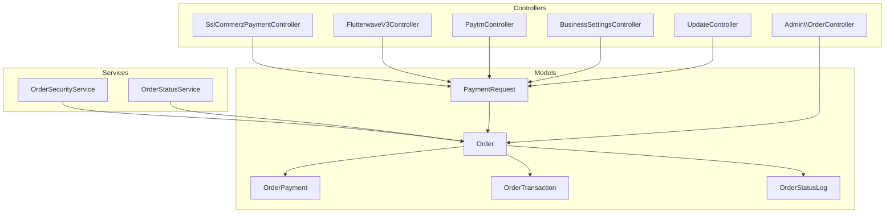

**Diagram sources**
- [SslCommerzPaymentController.php:1-228](file://app/Http/Controllers/SslCommerzPaymentController.php#L1-L228)
- [FlutterwaveV3Controller.php:1-158](file://app/Http/Controllers/FlutterwaveV3Controller.php#L1-L158)
- [PaytmController.php:1-255](file://app/Http/Controllers/PaytmController.php#L1-L255)
- [BusinessSettingsController.php:1020-1052](file://app/Http/Controllers/Admin/BusinessSettingsController.php#L1020-L1052)
- [UpdateController.php:244-385](file://app/Http/Controllers/UpdateController.php#L244-L385)
- [OrderSecurityService.php:44-136](file://app/Services/OrderSecurityService.php#L44-L136)
- [OrderStatusService.php:304-347](file://app/Services/OrderStatusService.php#L304-L347)
- [Order.php](file://app/Models/Order.php)
- [OrderPayment.php](file://app/Models/OrderPayment.php)
- [OrderTransaction.php](file://app/Models/OrderTransaction.php)
- [OrderStatusLog.php](file://app/Models/OrderStatusLog.php)

**Section sources**
- [SslCommerzPaymentController.php:1-228](file://app/Http/Controllers/SslCommerzPaymentController.php#L1-L228)
- [FlutterwaveV3Controller.php:1-158](file://app/Http/Controllers/FlutterwaveV3Controller.php#L1-L158)
- [PaytmController.php:1-255](file://app/Http/Controllers/PaytmController.php#L1-L255)
- [BusinessSettingsController.php:1020-1052](file://app/Http/Controllers/Admin/BusinessSettingsController.php#L1020-L1052)
- [UpdateController.php:244-385](file://app/Http/Controllers/UpdateController.php#L244-L385)
- [OrderSecurityService.php:44-136](file://app/Services/OrderSecurityService.php#L44-L136)
- [OrderStatusService.php:304-347](file://app/Services/OrderStatusService.php#L304-L347)

## Core Components
- Gateway-specific controllers handle initialization, callbacks, and post-payment hooks.
- PaymentRequest model stores pending payment intents and associated hooks.
- Order model tracks payment status and triggers status logs.
- OrderStatusLog persists audit trails for status changes.
- OrderSecurityService provides signature verification and cooldown enforcement.
- OrderStatusService manages status change logging and timeline retrieval.
- Administrative controllers manage gateway credentials and migration of legacy configurations.

**Section sources**
- [SslCommerzPaymentController.php:186-226](file://app/Http/Controllers/SslCommerzPaymentController.php#L186-L226)
- [FlutterwaveV3Controller.php:108-156](file://app/Http/Controllers/FlutterwaveV3Controller.php#L108-L156)
- [PaytmController.php:223-253](file://app/Http/Controllers/PaytmController.php#L223-L253)
- [Order.php](file://app/Models/Order.php)
- [OrderStatusLog.php](file://app/Models/OrderStatusLog.php)
- [OrderSecurityService.php:76-125](file://app/Services/OrderSecurityService.php#L76-L125)
- [OrderStatusService.php:313-338](file://app/Services/OrderStatusService.php#L313-L338)

## Architecture Overview
The webhook architecture integrates gateway callbacks with internal payment reconciliation and order state updates. Gateways initiate payment sessions and redirect users to external checkout pages. Upon completion, gateways call back to configured endpoints where signatures are verified, amounts reconciled, and payment records updated.

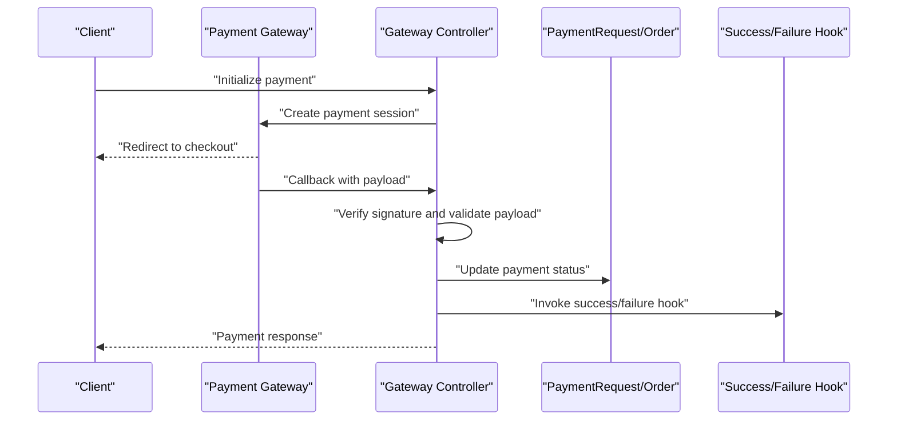

**Diagram sources**
- [SslCommerzPaymentController.php:186-226](file://app/Http/Controllers/SslCommerzPaymentController.php#L186-L226)
- [FlutterwaveV3Controller.php:108-156](file://app/Http/Controllers/FlutterwaveV3Controller.php#L108-L156)
- [PaytmController.php:223-253](file://app/Http/Controllers/PaytmController.php#L223-L253)

## Detailed Component Analysis

### SSLCommerz Webhook Handling
- Initializes payment with gateway and redirects to checkout.
- Processes success/failure/cancel callbacks.
- Verifies hash signature before marking payment as successful.
- Invokes success/failure hooks after state transitions.

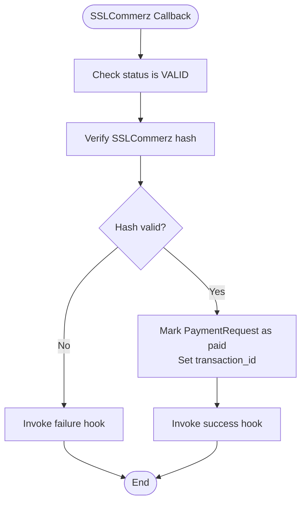

**Diagram sources**
- [SslCommerzPaymentController.php:186-208](file://app/Http/Controllers/SslCommerzPaymentController.php#L186-L208)

**Section sources**
- [SslCommerzPaymentController.php:186-226](file://app/Http/Controllers/SslCommerzPaymentController.php#L186-L226)

### Flutterwave Webhook Handling
- Initializes payment with Flutterwave API and obtains redirect link.
- Receives callback and verifies transaction via Flutterwave's verification endpoint.
- Confirms amount meets or exceeds expected amount before marking paid.
- Invokes success/failure hooks accordingly.

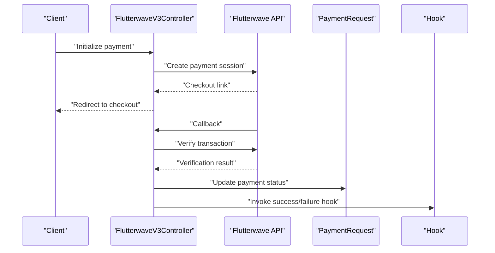

**Diagram sources**
- [FlutterwaveV3Controller.php:108-156](file://app/Http/Controllers/FlutterwaveV3Controller.php#L108-L156)

**Section sources**
- [FlutterwaveV3Controller.php:108-156](file://app/Http/Controllers/FlutterwaveV3Controller.php#L108-L156)

### Paytm Webhook Handling
- Builds checksum for transaction parameters and renders Paytm form.
- Processes callback, validates checksum, and updates payment status on success.
- Invokes success/failure hooks after state update.

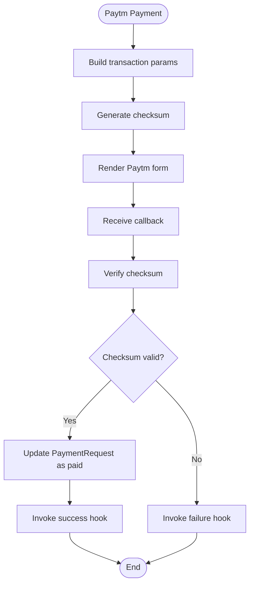

**Diagram sources**
- [PaytmController.php:182-253](file://app/Http/Controllers/PaytmController.php#L182-L253)

**Section sources**
- [PaytmController.php:223-253](file://app/Http/Controllers/PaytmController.php#L223-L253)

### Signature Verification and Payload Validation
- OrderSecurityService provides HMAC-SHA256 signature verification for order payloads and enforces cooldown periods.
- Gateway controllers implement gateway-specific signature/hash verification during callbacks.

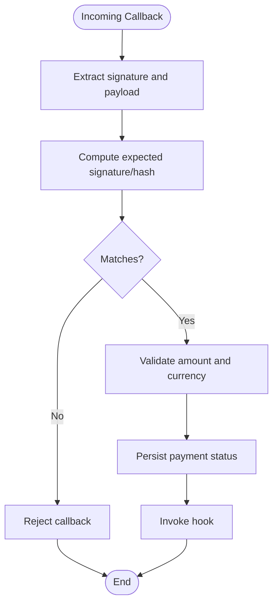

**Diagram sources**
- [OrderSecurityService.php:76-125](file://app/Services/OrderSecurityService.php#L76-L125)
- [SslCommerzPaymentController.php:147-184](file://app/Http/Controllers/SslCommerzPaymentController.php#L147-L184)
- [PaytmController.php:115-134](file://app/Http/Controllers/PaytmController.php#L115-L134)

**Section sources**
- [OrderSecurityService.php:76-125](file://app/Services/OrderSecurityService.php#L76-L125)
- [SslCommerzPaymentController.php:147-184](file://app/Http/Controllers/SslCommerzPaymentController.php#L147-L184)
- [PaytmController.php:115-134](file://app/Http/Controllers/PaytmController.php#L115-L134)

### Asynchronous Processing, Retry Mechanisms, and Failure Recovery
- Success/failure hooks are invoked after payment status updates, enabling asynchronous downstream actions.
- Administrative controllers migrate legacy payment configurations and normalize gateway credentials, aiding recovery from misconfiguration.
- OrderStatusService logs status changes for audit and recovery tracing.

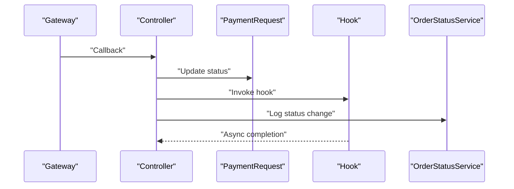

**Diagram sources**
- [SslCommerzPaymentController.php:198-200](file://app/Http/Controllers/SslCommerzPaymentController.php#L198-L200)
- [FlutterwaveV3Controller.php:144-146](file://app/Http/Controllers/FlutterwaveV3Controller.php#L144-L146)
- [PaytmController.php:242-244](file://app/Http/Controllers/PaytmController.php#L242-L244)
- [OrderStatusService.php:313-338](file://app/Services/OrderStatusService.php#L313-L338)

**Section sources**
- [UpdateController.php:244-385](file://app/Http/Controllers/UpdateController.php#L244-L385)
- [OrderStatusService.php:313-338](file://app/Services/OrderStatusService.php#L313-L338)

### Webhook Endpoint Configuration and Integration Patterns
- Gateway controllers expose endpoints for initialization and callbacks.
- Payment routes are defined via a trait mapping gateway keys to route paths.
- Administrative controllers manage gateway credentials and enable/disable integrations.

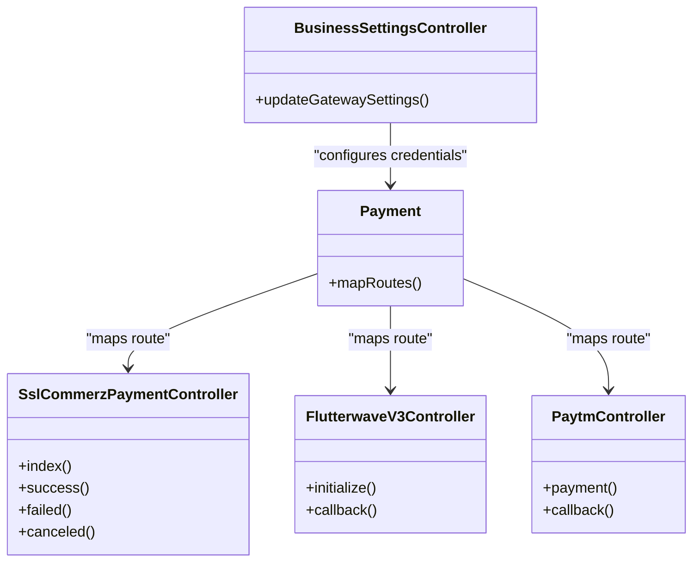

**Diagram sources**
- [Payment.php:39-68](file://app/Traits/Payment.php#L39-L68)
- [SslCommerzPaymentController.php:54-144](file://app/Http/Controllers/SslCommerzPaymentController.php#L54-L144)
- [FlutterwaveV3Controller.php:35-106](file://app/Http/Controllers/FlutterwaveV3Controller.php#L35-L106)
- [PaytmController.php:182-221](file://app/Http/Controllers/PaytmController.php#L182-L221)
- [BusinessSettingsController.php:1020-1052](file://app/Http/Controllers/Admin/BusinessSettingsController.php#L1020-L1052)

**Section sources**
- [Payment.php:39-68](file://app/Traits/Payment.php#L39-L68)
- [BusinessSettingsController.php:1020-1052](file://app/Http/Controllers/Admin/BusinessSettingsController.php#L1020-L1052)

### Payment Status Updates and Event Synchronization
- PaymentRequest model is updated upon successful callbacks.
- Order model receives payment status updates and triggers notifications.
- OrderStatusLog captures audit trails for status transitions.

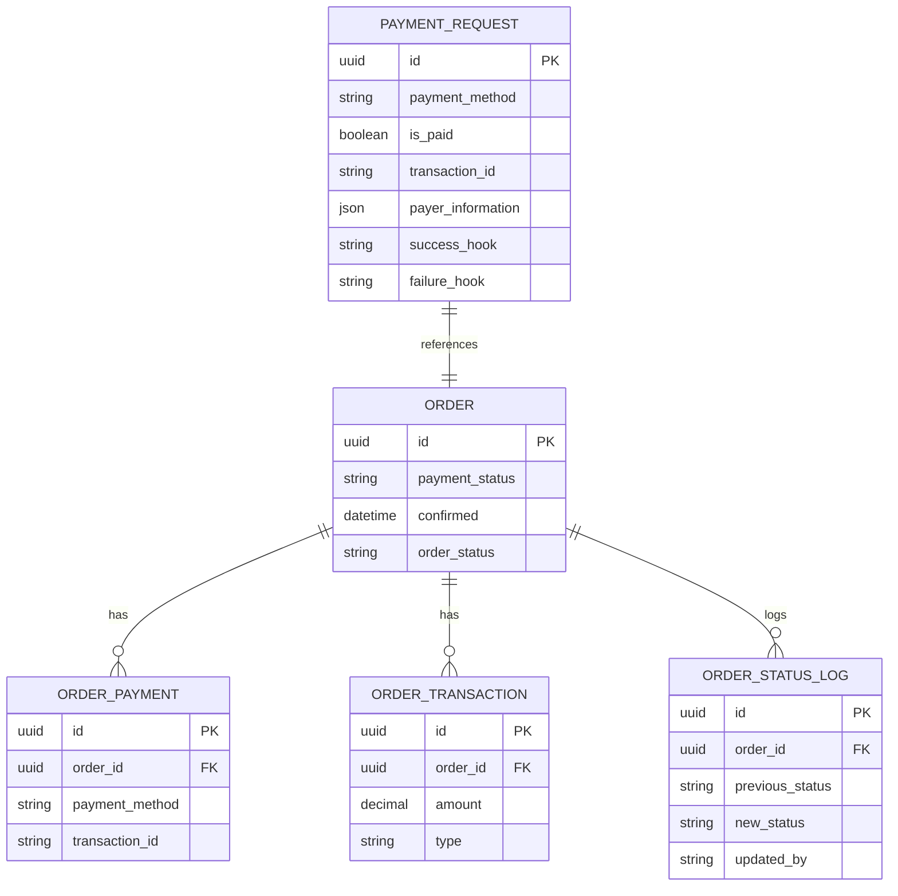

**Diagram sources**
- [Order.php](file://app/Models/Order.php)
- [OrderPayment.php](file://app/Models/OrderPayment.php)
- [OrderTransaction.php](file://app/Models/OrderTransaction.php)
- [OrderStatusLog.php](file://app/Models/OrderStatusLog.php)

**Section sources**
- [Order.php](file://app/Models/Order.php)
- [OrderStatusLog.php](file://app/Models/OrderStatusLog.php)

### Security, Rate Limiting, and Duplicate Prevention
- OrderSecurityService enforces HMAC-SHA256 signature verification and a 30-second cooldown per user/guest to mitigate replay attacks and abuse.
- Gateway controllers implement gateway-specific signature checks during callbacks.
- Administrative controllers manage credential updates and normalization.

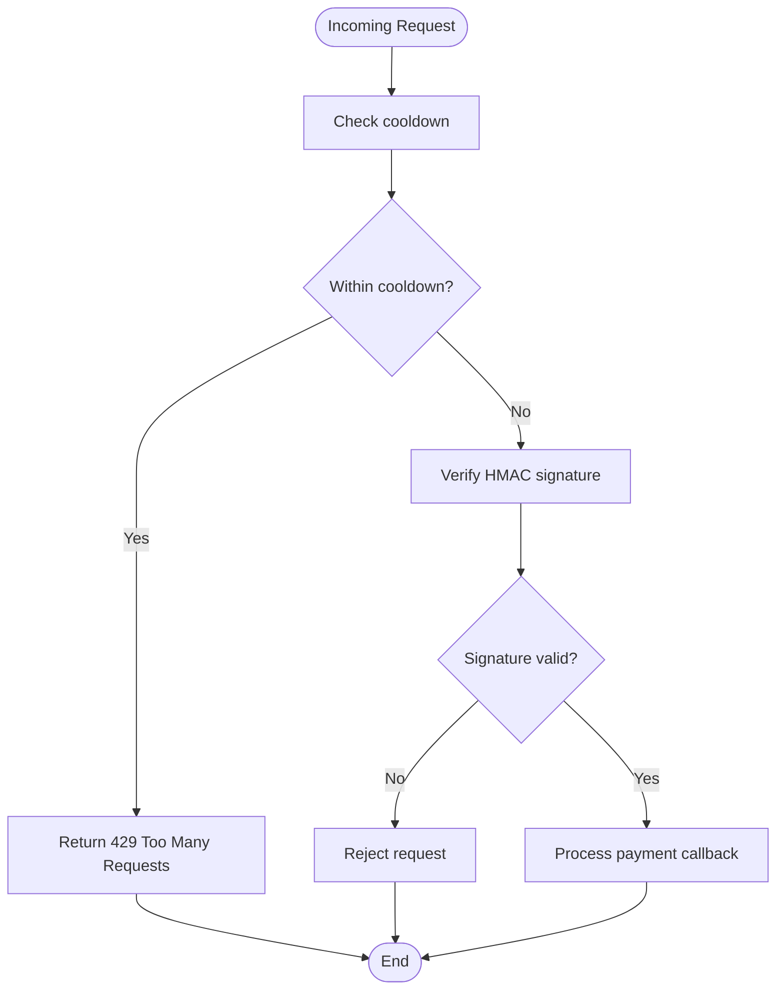

**Diagram sources**
- [OrderSecurityService.php:51-70](file://app/Services/OrderSecurityService.php#L51-L70)
- [OrderSecurityService.php:76-125](file://app/Services/OrderSecurityService.php#L76-L125)

**Section sources**
- [OrderSecurityService.php:51-70](file://app/Services/OrderSecurityService.php#L51-L70)
- [OrderSecurityService.php:76-125](file://app/Services/OrderSecurityService.php#L76-L125)

### Testing Procedures, Debugging Tools, and Monitoring Dashboards
- Use gateway-provided test modes and sandbox URLs for development and testing.
- Enable logging around signature verification and payment updates for debugging.
- Monitor OrderStatusLog entries for audit trails and recovery insights.
- Administrative controllers provide centralized configuration management for credentials.

**Section sources**
- [SslCommerzPaymentController.php:42-48](file://app/Http/Controllers/SslCommerzPaymentController.php#L42-L48)
- [FlutterwaveV3Controller.php:78-94](file://app/Http/Controllers/FlutterwaveV3Controller.php#L78-L94)
- [OrderStatusService.php:313-338](file://app/Services/OrderStatusService.php#L313-L338)
- [BusinessSettingsController.php:1020-1052](file://app/Http/Controllers/Admin/BusinessSettingsController.php#L1020-L1052)

## Dependency Analysis
The system exhibits clear separation of concerns:
- Controllers depend on PaymentRequest and gateway APIs.
- PaymentRequest updates cascade to Order and related models.
- Services encapsulate cross-cutting concerns like security and status logging.
- Administrative controllers manage configuration and legacy migrations.

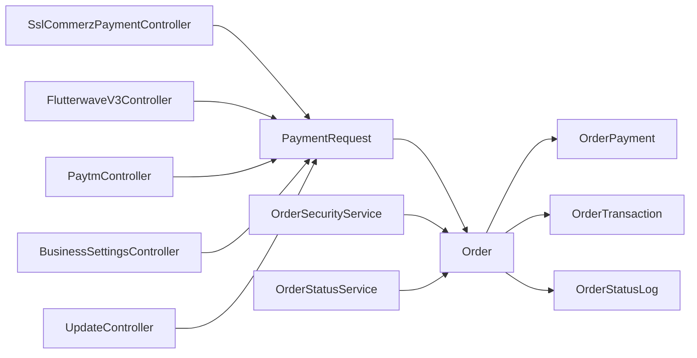

**Diagram sources**
- [SslCommerzPaymentController.php:1-228](file://app/Http/Controllers/SslCommerzPaymentController.php#L1-L228)
- [FlutterwaveV3Controller.php:1-158](file://app/Http/Controllers/FlutterwaveV3Controller.php#L1-L158)
- [PaytmController.php:1-255](file://app/Http/Controllers/PaytmController.php#L1-L255)
- [Order.php](file://app/Models/Order.php)
- [OrderPayment.php](file://app/Models/OrderPayment.php)
- [OrderTransaction.php](file://app/Models/OrderTransaction.php)
- [OrderStatusLog.php](file://app/Models/OrderStatusLog.php)
- [OrderSecurityService.php:44-136](file://app/Services/OrderSecurityService.php#L44-L136)
- [OrderStatusService.php:304-347](file://app/Services/OrderStatusService.php#L304-L347)
- [BusinessSettingsController.php:1020-1052](file://app/Http/Controllers/Admin/BusinessSettingsController.php#L1020-L1052)
- [UpdateController.php:244-385](file://app/Http/Controllers/UpdateController.php#L244-L385)

**Section sources**
- [SslCommerzPaymentController.php:1-228](file://app/Http/Controllers/SslCommerzPaymentController.php#L1-L228)
- [FlutterwaveV3Controller.php:1-158](file://app/Http/Controllers/FlutterwaveV3Controller.php#L1-L158)
- [PaytmController.php:1-255](file://app/Http/Controllers/PaytmController.php#L1-L255)
- [Order.php](file://app/Models/Order.php)
- [OrderPayment.php](file://app/Models/OrderPayment.php)
- [OrderTransaction.php](file://app/Models/OrderTransaction.php)
- [OrderStatusLog.php](file://app/Models/OrderStatusLog.php)
- [OrderSecurityService.php:44-136](file://app/Services/OrderSecurityService.php#L44-L136)
- [OrderStatusService.php:304-347](file://app/Services/OrderStatusService.php#L304-L347)
- [BusinessSettingsController.php:1020-1052](file://app/Http/Controllers/Admin/BusinessSettingsController.php#L1020-L1052)
- [UpdateController.php:244-385](file://app/Http/Controllers/UpdateController.php#L244-L385)

## Performance Considerations
- Minimize synchronous work in callbacks; delegate heavy tasks to queues or background jobs.
- Cache signature verification results where safe to reduce repeated computations.
- Use efficient logging and avoid excessive disk writes in hot paths.
- Ensure timeout and connection limits are appropriate for gateway APIs.

## Troubleshooting Guide
Common issues and resolutions:
- Signature mismatch: Verify shared secrets and payload construction align with gateway requirements.
- Amount discrepancies: Confirm currency conversion and rounding policies match gateway expectations.
- Duplicate payments: Implement idempotency keys and deduplicate based on transaction_id.
- Stalled callbacks: Check gateway webhook URLs and DNS resolution; validate HTTPS certificates.
- Audit gaps: Inspect OrderStatusLog entries and PaymentRequest updates for missed transitions.

**Section sources**
- [OrderSecurityService.php:76-125](file://app/Services/OrderSecurityService.php#L76-L125)
- [OrderStatusService.php:313-338](file://app/Services/OrderStatusService.php#L313-L338)
- [SslCommerzPaymentController.php:186-208](file://app/Http/Controllers/SslCommerzPaymentController.php#L186-L208)
- [FlutterwaveV3Controller.php:108-156](file://app/Http/Controllers/FlutterwaveV3Controller.php#L108-L156)
- [PaytmController.php:223-253](file://app/Http/Controllers/PaytmController.php#L223-L253)

## Conclusion
The system provides robust webhook handling across multiple payment gateways with strong emphasis on signature verification, payload validation, and audit logging. Controllers orchestrate gateway interactions, while services enforce security and maintain status integrity. Administrative controls streamline configuration and recovery, and models persist payment and status data for reliable reconciliation and monitoring.

## Appendices

### Webhook Event Types and Notification Formats
- Successful payment: Gateway callback with success status and transaction details.
- Failed payment: Gateway callback indicating failure; invoke failure hook.
- Cancelled payment: Gateway callback indicating cancellation; invoke failure hook.
- Pending/Processing: Re-query gateway status via scheduled jobs if needed.

**Section sources**
- [SslCommerzPaymentController.php:186-226](file://app/Http/Controllers/SslCommerzPaymentController.php#L186-L226)
- [FlutterwaveV3Controller.php:108-156](file://app/Http/Controllers/FlutterwaveV3Controller.php#L108-L156)
- [PaytmController.php:223-253](file://app/Http/Controllers/PaytmController.php#L223-L253)

### Gateway Credentials Management
- Administrative controllers update and normalize gateway credentials for all supported providers.
- Legacy configurations are migrated and consolidated into unified settings.

**Section sources**
- [BusinessSettingsController.php:1020-1052](file://app/Http/Controllers/Admin/BusinessSettingsController.php#L1020-L1052)
- [UpdateController.php:244-385](file://app/Http/Controllers/UpdateController.php#L244-L385)

### Additional Security References
- Signature validation examples for other gateways (e.g., iyzico) demonstrate webhook verification patterns applicable to similar systems.

**Section sources**
- [sslcommerz.php](file://vendor/iyzico/iyzipay-php/samples/webhook_Signature_Validation.php)